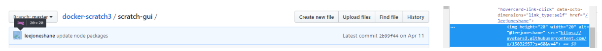
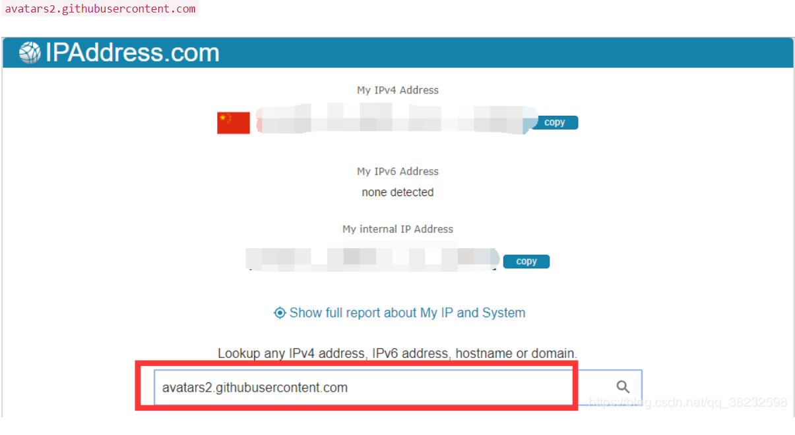
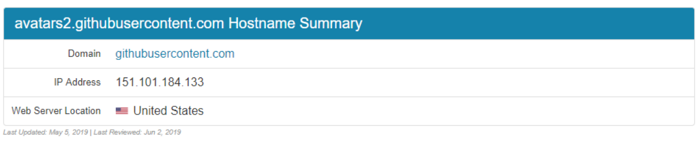

 # 常用命令

**这些是在各种情况下使用的通用Git命令:** 

| clone      | 将存储库克隆到新目录中                                  |
| ---------- | ------------------------------------------------------- |
| `init`     | `init`创建一个空的Git存储库或重新初始化一个现有的存储库 |
| `add`      | 添加添加文件内容到索引                                  |
| `mv`       | 移动或重命名文件、目录或符号链接                        |
| `reset`    | 将当前磁头复位到指定的状态                              |
| `rm`       | rm从工作树和索引中删除文件                              |
| `bisect`   | 二分法使用二分查找来查找引起错误的提交                  |
| `grep`     | 匹配模式的`grep`打印行                                  |
| `log`      | 提交日志                                                |
| `show`     | 显示各种类型的对象                                      |
| `status`   | 显示工作树状态                                          |
| `branch`   | 分支列表、创建或删除分支                                |
| `checkout` | 签出交换机分支或还原工作树文件                          |
| `commit`   | 将记录更改提交到存储库                                  |
| `diff`     | `diff`显示提交、提交和工作树等之间的更改                |
| `merge`    | 将两个或多个开发历史合并在一起                          |
| `rebase`   | 在另一个基本提示上重新应用提交                          |
| `tag`      | 标记创建、列表、删除或验证用`GPG`签名的标记对象         |
| `fetch`    | 从另一个存储库获取下载对象和引用                        |
| `pull`     | 从另一个存储库或本地分支获取并与之集成                  |
| `push`     | 推送更新远程引用和相关对象                              |

# 在`gitube`显示图片 

- 第一种方式：在`github`上先创建一个仓库，在仓库里创建一个文件夹，先把本地的文件push到这个文件夹里，这样图片就可以得到一份`github`的地址，再按照markdown的格式添加图片即可
- 第二种方式：可以先把图片放到简书或者是`CSDN`这样的博客网站进行一次转存，这样图片就可以获得该博客的地址，再打开`github`，自己图片地址复制上去也可以显示
- 第三种方式

当我们向markdown中粘贴图片资源的时候，会自动提示保存图片到...  这时我们可以在存放markdown文档的地方建立一个assert或者`pic`静态资源文件夹，将图片等静态资源存放到上述新建文件夹中。然后点击图片会弹出图片路径，一般情况下，默认的图片路径为：

`C:\Filename1\xxxx\xxxx\pic\Ajr.png`
一定不要只是将上述路径中的前面去掉，直接使用

`pic\Ajr.png`
这样并不是`github`认可的文件路径格式，而是要写成如下格式：

`./pic/Ajr.png`
然后，将文件夹和markdown文档一起上传，这时在GitHub上就可以正常显示markdown内容了

```java
git add .
git commit -m "xxxx"
git push
```

- 第四种方式

工具：Typora+Github

原因：Typora专注笔记，TOC目录，默认样式好看等优点，让我选择了他，那现在要解决的问题是图片上传和云笔记的问题了。

(1）图片上传：打开Typora，文件→偏好设置，打开即看到如下界面，按照下面的配置设置，一定要选择“复制图片到./assets文件夹“哦，后面结合github才能完成图片上传功能，否则，你的图片地址，就会是绝对路径，而非相对路径！！


设置完后，现在，请你复制一张图片，图片会存储在assets文件夹下


云笔记：

下载Git，在保存笔记的地方建立仓库，上传到Github

其实图片正常显示的原因，是因为我们把assert文件夹也提交到github了，Typora复制图片使用了相对路径，所以能正常找到图片。至此，问题都解决了。

# 解决github上图片加载慢的问题

## 解决方法

主要思路就是使用本地hosts文件对网站进行域名解析，一般的`DNS`问题都可以通过修改hosts文件来解决，github的CDN域名被污染问题也不例外，同样可以通过修改hosts文件解决，将域名解析直接指向IP地址来绕过DNS的解析，以此解决污染问题。

1. 找到URL
   打开github任意带有挂掉图片的网页，使用元素选择器（Ctrl+Shift+C）放在显示不了的图片上，或者在挂掉的图片上右键-检查元素，定位到该图片的标签，那么你得到了它的URL，叫做src属性。

比如介个

在右面把它的网址复制粗来：

`https://avatars2.githubusercontent.com/u/15832957?s=60&v=4`

2. 获取IP地址
   得到上述网址以后打开[IPAddress.com ](https://www.ipaddress.com/)这个网站，在搜索框输入它的域名，就是https://到com那一部分，俗称二级域名：

`avatars2.githubusercontent.com`



回车！！！下面你会看到该域名的信息和`IP`地址：



可以看出IP是：151.101.184.133，并且是2019.05.05最后更新的，alright，那么我们就可以使这个IP和域名映射起来。

（其他如果有挂掉的图片一样使用此方法进行一一映射即可。）

## 修改hosts

具体咋映射呢？修改hosts文件！！！本人使用的是windows系统，所以使用Sublime Text打开：`C:\Windows\System32\drivers\etc\hosts`

在文件末尾添加：

```reStructuredText
# GitHub Start 
192.30.253.112    github.com 
192.30.253.119    gist.github.com
151.101.184.133    assets-cdn.github.com
151.101.184.133    raw.githubusercontent.com
151.101.184.133    gist.githubusercontent.com
151.101.184.133    cloud.githubusercontent.com
151.101.184.133    camo.githubusercontent.com
151.101.184.133    avatars0.githubusercontent.com
151.101.184.133    avatars1.githubusercontent.com
151.101.184.133    avatars2.githubusercontent.com
151.101.184.133    avatars3.githubusercontent.com
151.101.184.133    avatars4.githubusercontent.com
151.101.184.133    avatars5.githubusercontent.com
151.101.184.133    avatars6.githubusercontent.com
151.101.184.133    avatars7.githubusercontent.com
151.101.184.133    avatars8.githubusercontent.com
# GitHub End
```

然后保存文件就OK了，至于无法保存，没有修改权限，鼠标右键-属性-安全-修改权限；或将hosts文件复制一份，修改之后，复制到原文件夹替换。

PS：另外要注意的一点就是，如果图片再次挂掉，只需要及时更新IP就行啦，这波操作不麻烦

# 生成目录索引

**方法一**

```sql
- [测试](#测试)
### <a id="测试">测试</a>
```

效果如下

>- [测试](https://blog.csdn.net/wangzhibo666/article/details/88731227#测试)
>
>### 测试

在标签外可以用-或者###来调节字段的格式和字体的显示大小

注：id一定要和#后面的描述相等，这是关键，其他地方怎么写无所谓

**方法二**

```sql
### <a href="#测试2">测试2</a>
h
t
m
l
<a id="测试2">测试2</a>
```

效果如下

>[测试2](https://blog.csdn.net/wangzhibo666/article/details/88731227#测试2)
>h
>t
>m
>l
>测试2

注：id一定要和`href`后面的描述相等才可以实现，其他地方怎么写无所谓

**方法三**

自己在最上面加一个[TOD]标识，其他地方还是该怎么写就怎么写，会自动生成目录索引，但是这种方式上传到github上就会失去效果，但是在CSDN上就有用，在Typora上也能显示出来效果


