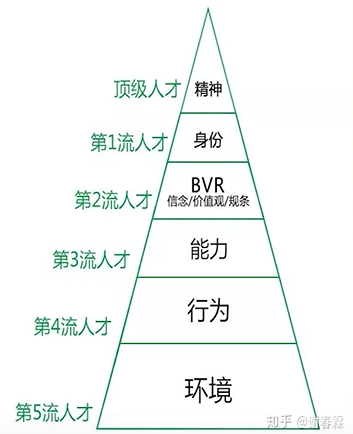
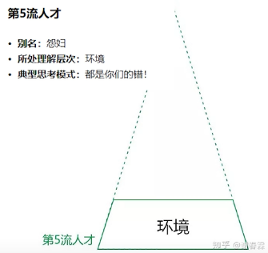
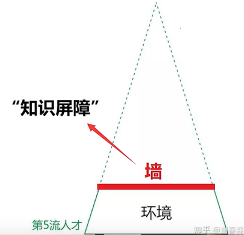
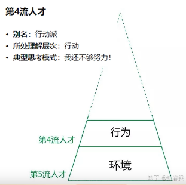
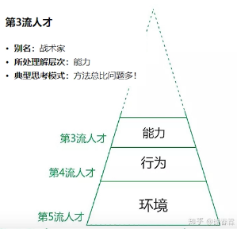
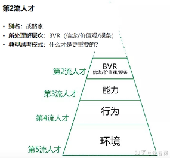

- 每个人的理解层次不同：不是说每个人不会去想其他层次的问题，而是主要去想自我所在层面的问题

# 第5流人才

- 环境：我们周围身边一切的人、一切的事、一切的物或者是过去、将来，甚至包括现在的天气，社会舆论等，这些都是环境
- 这一类人总喜欢把错误归结于环境不好。比如说我最近工作不顺利那肯定是因为领导太蠢；我很长时间没有晋升了那肯定是因为办公室竞争太激烈，是因为公司的晋升体制不好；我房子太贵了，是因为炒房团，是因为政府无能，没有合理的调控房价，是因为我没有一个有钱的父母。总之，当问题发生是，总是在说不是我的问题。都说是公司的问题，社会的问题，政府的问题或者是自己运气的问题，是自己命不好。

- 知识屏障极难被自己打破
- 根本原因：自己不知道自己不知道，就不可能形成因为知道而去行动，然后再去改变

>- **弱小和无知不是生存的障碍，傲慢才是**
>  - 换言之因为傲慢使我们根本看不到自己的弱小与无知

# 第4流人才

- 这一层次的人把所有都归因与自己还不够努力。比如说我收入太低了或者买不起房子，或者说我创业失败了等等。当问题发生时他们都会先从自己身上找原因，想想是不是自己又偷懒了，是不是我自己最近不够努力，是不是因为最近投入工作的时间变少了...等等
- 当处在行动这一层次的时候，环境已经不重要了
- 努力是成功的必要条件，但不是充分条件

# 第3流人才

- 能力：你用最简单最高效的方法来解决问题的一个综合要素。也可以说当你面临问题的时候，你可以让自己拥有更多的选择
- 这一类人当问题发生时也会把问题归结于自己，从自身去寻找方法。这一类人有很强大的解决能力和应变能力，他们能够把知识转化为操作方法，进而改善效率解决问题。他们明白任何问题不是孤立存在的，之前一定有人遇到过，而且早就有成熟的解决方法了，只是我不知道而已，他们认为自己有时候的恍然大悟只是别人的基本功而已。我应该站在巨人的肩膀上去学习，获得更成熟的经验来解决方法

# 第2流人才

- 这类人典型的思考模式：什么才是最重要的？
- 能力层的人做的是解答题的话，这一层的人做的就是选择题
- Blief：往大了说是世界观，往小了看是一个一个的概念，而且概念是所有能力的积值
- 价值观：就是你认为A和B哪个更重要
  - 每个人的内心对每一件事、每一个物都会有价值衡量
- 人生观：如果实现自己一生的行为准则

