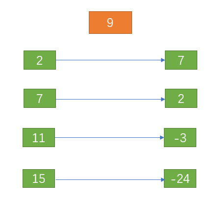
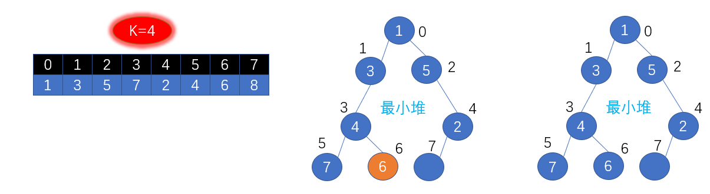
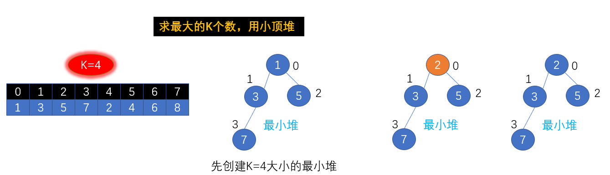

# 数组

## 88.合并两个有序数组

- 给你两个有序整数数组 nums1和 nums2，请你将 nums2合并到 nums1 中*，*使 nums1成为一个有序数组
- 说明:

>- 初始化 nums1 和 nums2 的元素数量分别为 m 和 n 
>- 你可以假设 nums1 有足够的空间（空间大小大于或等于 m + n）来保存 nums2 中的元素

- 示例:


```java
输入:
nums1 = [1,2,3,0,0,0], m = 3
nums2 = [2,5,6],       n = 3
输出: [1,2,2,3,5,6]
```

- 思路：


>- 指针从后往前指，若i1>i2则i1指针所指位置元素移动到cur指针位置，之后cur指针向前移动，反之i2指针移动到cur指针位置，之后cur指针向前移动
>- 会出现两种情况：第一种是i1指针已经指向索引为-1处但i2指针还在合法范围，这时将i2指针所指元素全都往上逐一移动结束即可；第二种是i2指针已经指向索引为-1处但i1指针还在合法范围，这时无需再做任何操作，数组已经有序，直接结束方法
>- 综合以上分析：只有在i2指针处于合法范围才需要继续移动元素和指针

- 解答：

```java
public class Solution88 {
    /**
     * 归并排序的思想
     * nums1 有足够的空间（空间大小大于或等于 m + n）来保存 nums2 中的元素
     * @param nums1 数组1
     * @param m 数组1的元素个数
     * @param nums2 数组2
     * @param n 数组2的元素个数
     */
    public void merge(int[] nums1, int m, int[] nums2, int n) {
        int i1 = m-1; //指向num1数组中的最后一个元素
        int i2 = n-1; //指向num2数组中的最后一个元素
        int cur = nums1.length - 1; //指向num1数组中的最后一个可用位置

        while (i2 >= 0){ //将num2数组中的元素都移动到num1中
            if (i1 >= 0 && nums1[i1] > nums2[i2]){ //确保i1指针不越界的情况下所指元素大于i2指针所指
                nums1[cur--] = nums1[i1--]; //移动到cur指针所指位置
            }else { // i1 < 0 || nums1[i1] < nums2[i2] 的情况
                nums1[cur--] = nums2[i2--];
            }
        }
    }
}
```

## 75.颜色分类

- 给定一个包含红色、白色和蓝色，一共 n 个元素的数组，原地对它们进行排序，使得相同颜色的元素相邻，并按照红色、白色、蓝色顺序排列
- 此题中，我们使用整数 0、 1 和 2 分别表示红色、白色和蓝色
- 注意:不能使用代码库中的排序函数来解决这道题
- 示例:

```java
输入: [2,0,2,1,1,0]
输出: [0,0,1,1,2,2]
```

- 思路


>- 遇到0就要往最左边移动，遇到2就要往最右边移动。遇到1则不一移动，那么当0和2都归为后1自然就在中间了
>- 红色指针遇到2就和最右边黄色指针指向的元素交换位置，之后黄色指针向前移动，注意，此时由于黄色指针交换过来元素可能还是2，所以红色指针不能立即往后移动
>- 红色指针遇到0就往和最左边的蓝色指针指向元素交换位置，之后蓝色指针和红色指针都往后移动
>- 红色指针遇到1时则只往前移动即可

- 边界条件的判断


>- 由图可以看出，当红色指针和黄色指针指向相同的时候并不能说明排序已经完成，必须要红色指针代表的索引大于黄色指针代表的索引才能让排序真正的结束

- 解答

```java
public class Solution75 {

    /**
     * 要求：仅使用常数空间的一趟扫描算法
     * 时间复杂度O(n),空间复杂度O(1)
     * @param nums 只有0,1,2的数组,对这些数进行原地排序
     */
    public void sortColors(int[] nums) {
        int i = 0; //用于扫描的指针
        int l = 0; //指向最左边未曾交换过的元素
        int r = nums.length - 1; //指向最右边未曾交换过的元素
        while (i <= r){
            int cur = nums[i]; //被i指针扫描到的元素
            if (cur == 0){
                swap(nums, i++,l++ ); //把0放到数组最左边并往下继续扫描
            }else if (cur == 1){
                i++; //1的位置不变
            }else {
                swap(nums,i,r--); //把2放在最右边并继续扫描交换过来的元素
            }
        }
    }

    //交换数组nums[i]和num[j]的值
    public void swap(int[] nums, int i ,int j){
        int temp = nums[i];
        nums[i] = nums[j];
        nums[j] = temp;
    }
}
```

# 排序

## 16.部分排序

- 给定一个整数数组，编写一个函数，找出索引m和n，只要将索引区间[m,n]的元素排好序，整个数组就是有序的。注意：n-m尽量最小，也就是说，找出符合条件的最短序列。函数返回值为[m,n]，若不存在这样的m和n（例如整个数组是有序的），请返回[-1,-1]。
- 示例：

```java
输入： [1,2,4,7,10,11,7,12,6,7,16,18,19]
输出： [3,9] //即将数组索引的3和9之间的元素排序就可使整个数组有序
```

- 提示：

```java
0 <= len(array) <= 1000000
```

- 思路


>- 初始化array[0]为最大值，从第二个数开始扫描，若大于最大值则更新max，若小于最大值则记录该元素的位置。直到整个数组扫描结束，得到最右边的逆序位置：r
>- 同理，初始化array[array.length-1]为最小值，从倒数第二个数开始扫描，若小于最小值则更新min，若大于最小值则记录该元素的位置。直到整个数组扫描结束，得到最左边的逆序位置：l
>- 【l,r】则是需要排序的区间
>- 实质：上图从左到右的逆序对有(5,4),(5,3),(5,2),(4,3),(4,2),(3,2)===>要找到其中和最大值匹配的最后一个逆序对，即(5,2)
>- 从右到左的逆序对有(2,3),(2,4),(2,5),(3,4),(3,5),(4,5)===>要找到其中和最小值的最后一个逆序对，即(2,5)
>- 最终取2和5所在的位置索引即使是需要排序的区间范围

- 解答

```java
public int[] subSort(int[] array) {
       if(array.length == 0) return new int[]{-1,-1};
       int max = array[0]; //从左扫描到右寻找逆序对(正序：逐渐变大)
       int r = -1; //用来记录最右边的那个逆序对位置
        for (int i = 1; i < array.length; i++) {
            int scanned = array[i];
            if (scanned >= max){
                max = scanned;
            }else {
                r = i;
            }
        }
        if (r == -1) return new int[]{-1,-1}; //遍历一轮后无逆序对则提前结束

        int min = array[array.length - 1]; //从右扫描到左寻找逆序对(正序：逐渐变小)
        int l = -1; //用来记录最左边的那个逆序对位置
        for (int j = array.length - 2; j >= 0; j--) {
            int scanned = array[j];
            if (scanned <= min){
                min = scanned;
            }else {
                l = j;
            }
        }
        return new int[]{l,r};
    }
```

# 练习

## 1.两数之和

- 给定一个整数数组 nums 和一个目标值 target，请你在该数组中找出和为目标值的那 两个 整数，并返回他们的数组下标。
- 你可以假设每种输入只会对应一个答案。但是，数组中同一个元素不能使用两遍。
- 示例:

```java
给定 nums = [2, 7, 11, 15], target = 9

因为 nums[0] + nums[1] = 2 + 7 = 9
所以返回 [0, 1]
```

- 思路


>- 遍历到2时需要找到目标值7的索引，那么就遍历剩下的数组中是否存在7

- 题解

```java
public class Solution1 {
    public int[] twoSum(int[] nums, int target) {
        if (nums == null) return null;
        for (int i = 0; i < nums.length; i++) {
            int aim = target - nums[i]; //需要找目标值aim的索引
            for (int j = i+1; j < nums.length; j++) {
                if (aim == nums[j]) return new int[]{i,j};
            }
        }
        return null;
    }
}
```

- 思路2



>- 遍历到2，目标值是7；遍历到7，目标值是2
>- map的key存放遍历到的值，value存放key对应的索引值
>- 遍历到2时，若map中有对应的索引则返回；若无对应的索引则将2存入；那么当遍历到7时一定能够在map中找到2

- 题解2

```java
public class Solution1 {
    public int[] twoSum(int[] nums, int target) {
        Map<Integer, Integer> map = new HashMap<>();
        for (int i = 0; i < nums.length; i++) {
            int aim = target - nums[i]; //需要找目标值aim的索引
            if (map.containsKey(aim)) {
                return new int[] { map.get(aim), i };
            }
            map.put(nums[i], i);
        }
        throw new IllegalArgumentException("No two sum solution");
    }
}
```

## 977.有序数组的平方

- 给定一个按非递减顺序排序的整数数组 A，返回每个数字的平方组成的新数组，要求也按非递减顺序排序。

```java
示例 1：

输入：[-4,-1,0,3,10]
输出：[0,1,9,16,100]
示例 2：

输入：[-7,-3,2,3,11]
输出：[4,9,9,49,121]


提示：

1 <= A.length <= 10000
-10000 <= A[i] <= 10000
A 已按非递减顺序排序。
```

- 思路一：先给数组平方再排序
- 题解一：

```java
public class Solution977 {
    public int[] sortedSquares(int[] A) {
        if (A == null || A.length == 0) return null;
        int[] newA = new int[A.length];
        for (int i = 0; i < A.length; i++) {
            newA[i] = A[i] * A[i];
        }
        Arrays.sort(newA);
        return newA;
    }
}
```

- 思路二：


>- 情况一：全为正数，从前往后逐一平方即可
>- 情况二：全为负数，从后往前逐一平方即可
>- 情况二：有正有负数，找到第一非负数，用right指针指向，用left指向离right指针最近的负数
>- 在负数中，最大的负数平方后最小，依次比较left指向的负数的绝对值和right指向的绝对值的大小，把较小数平方后放到新数组里
>- 注意：考虑数组越界问题

- 题解二：

```java
public class Solution977 {
    public int[] sortedSquares(int[] A) {
        int[] sqrtA = new int[A.length];
        if (A[A.length - 1] < 0) { //全是单调递增的负数
            int right = A.length - 1;
            for (int i = 0; i < A.length; i++) {
                sqrtA[i] = A[right] * A[right];
                right--;
            }
        }else if (A[0] > 0) { //全是单调递增的正数
            for (int i = 0; i < A.length; i++) {
                sqrtA[i] = A[i] * A[i];
            }
        }else { //单调递增的正负数结合
            int right = 0;
            while (A[right] < 0){
                right++; //指向第一个非负数
            }
            int left = right - 1; 
         
            for (int i = 0; i < A.length; i++) {
                if (left < 0){ //左指针越界
                    sqrtA[i] = A[right] * A[right];
                    right++;
                }else if (right >= A.length){ //右指针越界
                    sqrtA[i] = A[left] * A[left];
                    left--;
                }else if (-A[left] <= A[right]){ //负数的绝对值和正数比较大小
                    sqrtA[i] = A[left] * A[left];
                    left--;
                }else { 
                    sqrtA[i] = A[right] * A[right];
                    right++;
                }
            }
        }
        return sqrtA;
    }
}
```

## 495.提莫攻击

- 在《英雄联盟》的世界中，有一个叫 “提莫” 的英雄，他的攻击可以让敌方英雄艾希（编者注：寒冰射手）进入中毒状态。现在，给出提莫对艾希的攻击时间序列和提莫攻击的中毒持续时间，你需要输出艾希的中毒状态总时长
- 你可以认为提莫在给定的时间点进行攻击，并立即使艾希处于中毒状态
- 示例1:

```java
输入: [1,4], 2
输出: 4
原因: 第 1 秒初，提莫开始对艾希进行攻击并使其立即中毒。中毒状态会维持 2 秒钟，直到第 2 秒末结束。
第 4 秒初，提莫再次攻击艾希，使得艾希获得另外 2 秒中毒时间。
所以最终输出 4 秒。
```

- 示例2:

```java
输入: [1,2], 2
输出: 3
原因: 第 1 秒初，提莫开始对艾希进行攻击并使其立即中毒。中毒状态会维持 2 秒钟，直到第 2 秒末结束。
但是第 2 秒初，提莫再次攻击了已经处于中毒状态的艾希。
由于中毒状态不可叠加，提莫在第 2 秒初的这次攻击会在第 3 秒末结束。
所以最终输出 3 。
```

- 提示：

>- 你可以假定时间序列数组的总长度不超过 10000
>- 你可以假定提莫攻击时间序列中的数字和提莫攻击的中毒持续时间都是非负整数，并且不超过 10,000,000

- 思路


>- 当攻击的间隔时间大于或等于中毒的时间，那么在下一次攻击的时候就直接叠加中毒时间
>- 当攻击的间隔时间小于中毒时间，如11s,12s,13s，在12s攻击会刷新中毒时间，在13s攻击又会刷新中毒时间；在11s攻击必中毒1s，刷新时间，在12s攻击必中毒1s，刷新时间，在13s攻击必中毒2s，攻击结束

- 题解

```java
public class Solution495 {
    public int findPoisonedDuration(int[] timeSeries, int duration) {
        if (timeSeries == null || timeSeries.length == 0) return 0;
        if (timeSeries.length == 1) return duration;
        int totalPoisoned = 0;
        int interval = 0;
        for (int i = 1; i < timeSeries.length; i++) {
            interval = timeSeries[i] - timeSeries[i - 1];
            if (interval >= duration) { //每次攻击的间隔时间大于中毒时间
                totalPoisoned += duration;
            } else { //攻击的间隔时间小于中毒时间
                totalPoisoned = interval + totalPoisoned;
            }
        }
        totalPoisoned += duration; //最后一次攻击
        return totalPoisoned;
    }
}
```

## 45.把数组排成最小的数

- 输入一个非负整数数组，把数组里所有数字拼接起来排成一个数，打印能拼接出的所有数字中最小的一个
- 示例一

```java
输入: [10,2]
输出: "102"
```

- 示例二

```java
输入: [3,30,34,5,9]
输出: "3033459"
```

- 提示:0 < nums.length <= 100
- 说明:

>- 输出结果可能非常大，所以你需要返回一个字符串而不是整数
>- 拼接起来的数字可能会有前导 0，最后结果不需要去掉前导0

- 思路：关键就是要清楚排序规则


- 题解

```java
public class Solution45 {
    public String minNumber(int[] nums) {
        if (nums.length == 0) return null;
        String[] strings = new String[nums.length];
        for (int i = 0; i < nums.length; i++) {
            strings[i] = nums[i] + "";
        }
        Arrays.sort(strings, (s1,s2) -> (s1 + s2).compareTo(s2 + s1)); //Lambal表达式
        StringBuilder builder = new StringBuilder();
        for (String string : strings) {
            builder.append(string);
        }
        return builder.toString();
    }
}
```

## 17.14最小K个数

- 设计一个算法，找出数组中最小的k个数。以任意顺序返回这k个数均可。
- 示例：

```java
输入： arr = [1,3,5,7,2,4,6,8], k = 4
输出： [1,2,3,4]
```

- 提示：

>- 0 <= len(arr) <= 100000
>- 0 <= k <= min(100000, len(arr))

- 思路一：用JDK自带的小顶堆
- 题解一：

```java
import java.util.PriorityQueue;
public class Solution17_14 {
    public int[] smallestK(int[] arr, int k) {
        if (arr.length == 0 || k <= 0) return new int[]{};
        PriorityQueue<Integer> heap = new PriorityQueue<>(k); //优先级队列实现小顶堆
        for (int i : arr) {
            heap.offer(i); //把元素全部入队,堆顶元素是最小的
        }
        int[] minK = new int[k];
        for (int i = 0; i < k; i++) { //取出小顶堆中最小的k个元素
            if (heap.peek() != null) {
                minK[i] = heap.poll();
            }
        }
        return minK;
    }
}
```

- 思路二：自定义小顶堆

1. 了解小顶堆的原理：上溢


2. 实际操作：添加2


3. 实际操作：添加4


4. 实际操作：添加6



5. 实际操作：添加8


>- 以上图解是对堆创建的原理了解，是针对于添加后的上溢操作
>- 对于求TOP-K问题，我们只需创建大小为K的堆即可，并且使用高效的下溢操作

- **求TOP-K问题：堆的下溢**
- 添加2



- 添加4


- 添加6


- 添加8


>- 每次添加元素时只要比堆顶元素大就覆盖堆顶元素，接着进行下溢操作
>- 若下溢到叶子结点的位置或者和其子结点中较小的一个比较，若大于较小的子结点则下溢，否则终止下溢
>- 最终结果如图所示，堆中的4个数是数组中最大的4个数
>- 位于堆顶的是堆中最小的一个数

- 题解二：使用自定义的堆

```java
import java.util.Arrays;
import java.util.Comparator;

public class Solution17_14{
    public int[] smallestK(int[] arr, int k) {
        if (arr.length == 0 || k <= 0) return new int[]{};
        BinaryHeap heap = new BinaryHeap(arr.length,(t1, t2) -> (t1 - t2));
        int[] minArray = new int[k];
        for (int value : arr) { 
            if (heap.size < k) { //先创建具有大小为k的堆
                heap.add(value);
            } else if (heap.get() > value) { //堆顶元素较大就替换
                heap.replace(value);
            }
        }
        for (int i = 0; i < k; i++) {
            minArray[i] = heap.remove(); //将堆中的k个元素取出
        }
        return minArray;
    }

    static class BinaryHeap{
        private int size = 0;
        private int[] heapArray;
        Comparator<Integer> comparator;
        public BinaryHeap(int capacity,Comparator<Integer> comparator){
            heapArray = new int[capacity];
            this.comparator = comparator;
        }
        private void add(int element){ //向堆中添加element
            heapArray[size] = element; //先添加到数组最后
            siftUp(size);              //自下而上的上溢
            size++;
        }
        private int get(){ 
            return heapArray[0]; //堆顶元素最大或最小
        }

        private void siftUp(int index){ //上溢
            int child = heapArray[index]; //需要上溢的目标元素
            while (index > 0){
                int parentIdx = (index - 1) >> 1; //找到理论上的父节点
                int parent = heapArray[parentIdx];
                if (cmp(parent,child) >= 0) break; 
                heapArray[index] = parent; //若父节点较小则和父节点交换位置
                index = parentIdx;
            }
            heapArray[index] = child;
        }

        private void siftDown(){ //下溢
            int index = 0;
            int element = heapArray[index]; //从堆顶开始下溢
            int notLeaf = size >> 1; //理论上不是叶子的结点
            while (index < notLeaf){
                int childIdx = (index << 1) + 1; //理论上的子结点
                int maxChild = heapArray[childIdx]; //左子结点
                int rightIdx = childIdx+1; //右子结点
                if (rightIdx < size){ 
                    int rightChild = heapArray[rightIdx];
                    if (cmp(maxChild,rightChild) < 0){
                        childIdx = rightIdx;
                        maxChild = rightChild;
                    }
                }
                if (cmp(element,maxChild) >= 0) break; //与左右子节点中较大者进行比较
                heapArray[index] = maxChild; //比子结点小就和其交互位置
                index = childIdx;
            }
            heapArray[index] = element;
        }

        public void replace(int element) { //替换掉堆顶element
                heapArray[0] = element;
                siftDown();
        }

        public int remove() { //删除掉堆顶element
            int top = heapArray[0];
            heapArray[0] = heapArray[size - 1]; //直接用数组中的最后一个元素覆盖要删除的元素再对其进行下溢
            heapArray[size - 1] = 0;
            size--;
            siftDown();
            return top;
        }
        private int cmp(int a,int b){
           return comparator.compare(a,b);
        }
    }
```

- 思路三：对n个数进行快速排序，再选择出前K个数


- 下一步摆放[0,2)区间的中轴元素和[3,8)区间的中轴元素

- 题解三

```java
public class Solution17_14 {
    public int[] smallestK(int[] arr, int k) {
        if (arr.length == 0) return new int[]{};
        sort(arr,0,arr.length);
        int[] result = new int[k];
        System.arraycopy(arr, 0, result, 0, k);
        return result;
    }

    public void sort(int[] arr, int left, int right) {
        if (right - left <= 1) return;
        int mid = pivotIndex(arr, left, right); //找到[left,right]区间的中轴元素
        sort(arr, left, mid); //找到[left,mid)区间的中轴元素
        sort(arr, mid + 1, right); //找到[mid+1,right)区间的中轴元素
    }

    private int pivotIndex(int[] arr, int left, int right) {
        int pivot = arr[left]; //中轴元素
        right--;
        while (left < right) {
            while (left < right) {
                if (pivot < arr[right]) { //从右往左扫描
                    right--;
                } else {
                    arr[left++] = arr[right];
                    break; //右边某个元素比中轴元素小就放到左边并退出
                }
            }
            while (left < right) { //从左往右扫描
                if (pivot > arr[left]) {
                    left++;
                } else {
                    arr[right--] = arr[left];
                    break; //左边某个元素比中轴元素大就放到右边并退出
                }
            }
        }
        arr[right] = pivot; //此时left = right 循环退出
        return right;
    }
}
```

## 349.两个数组的交集

- 给定两个数组，编写一个函数来计算它们的交集
- 示例一：

```java
输入: nums1 = [1,2,2,1], nums2 = [2,2]
输出: [2]
```

- 示例二：

```java
输入: nums1 = [4,9,5], nums2 = [9,4,9,8,4]
输出: [9,4]
```

- 说明:

>- 输出结果中的每个元素一定是唯一的
>- 我们可以不考虑输出结果的顺序

- 思路一：

>- 使用Set集合先排除重复元素
>- 再使用内置的API得到两个集合的交集

- A.retainAll(B)

>- 可以看到这个方法改变了集合A中的元素，将存在于集合A中但不存在于集合B中的元素移除
>- 如果集合A的大小发生了改变，返回true，即使两个集合完全没有交集，也会返回true
>- 如果集合A的大小没有发生改变，返回false，即使两个集合完全相同，也会返回false

- 题解一：

```java
import java.util.HashSet;

public class Solution349 {
    public int[] intersection(int[] nums1, int[] nums2) {
        //题目给的数组不为null,不需要判断
        HashSet<Integer> set1 = new HashSet<>();
        HashSet<Integer> set2 = new HashSet<>();
        for (int i : nums1) set1.add(i);
        for (int i : nums2) set2.add(i);
        set1.retainAll(set2); //将存在于集合A中但不存在于集合B中的元素移除
        int[] result = new int[set1.size()];
        int index = 0;
        for (Integer num : set1) {
            result[index++] = num;
        }
        return result;
    }
}
```

---

- 思路二：使用双指针


>- 先给两个数组排序
>- 定义指针p1和p2从头开始分别扫描两个数组，知道一个指针扫描结束
>- 当扫描到相同的元素就添加到集合中，达到去重效果

- 题解二：

```java
import java.util.Arrays;
import java.util.HashSet;

public class Solution349 {
    public int[] intersection(int[] nums1, int[] nums2) {
        Arrays.sort(nums1); //先排序
        Arrays.sort(nums2);
        HashSet<Integer> set = new HashSet<>(); //去重
        int p1 = 0;
        int p2 = 0;
        while (p1 < nums1.length && p2 < nums2.length) {
            if (nums1[p1] == nums2[p2]) {
                set.add(nums1[p1]);
                p1++;
                p2++;
            } else if (nums1[p1] < nums2[p2]) { 
                p1++;
            } else {
                p2++;
            }
        }
        p1 = 0; //重复利用之前的变量,节省内存空间
        int[] result = new int[set.size()];
        for (Integer integer : set) {
            result[p1++] = integer;
        }
        return result;
    }
}
```

## 1451.重新排列句子中的单词

- 「句子」是一个用空格分隔单词的字符串。给你一个满足下述格式的句子 text :

>- 句子的首字母大写
>- text 中的每个单词都用单个空格分隔

- 请你重新排列 text 中的单词，使所有单词按其长度的升序排列。如果两个单词的长度相同，则保留其在原句子中的相对顺序
- 请同样按上述格式返回新的句子
- 示例一：

```java
输入：text = "Leetcode is cool"
输出："Is cool leetcode"
解释：句子中共有 3 个单词，长度为 8 的 "Leetcode" ，长度为 2 的 "is" 以及长度为 4 的 "cool" 
输出需要按单词的长度升序排列，新句子中的第一个单词首字母需要大写
```

- 示例二：

```java
输入：text = "Keep calm and code on"
输出："On and keep calm code"
解释：输出的排序情况如下：
"On" 2 个字母
"and" 3 个字母
"keep" 4 个字母，因为存在长度相同的其他单词，所以它们之间需要保留在原句子中的相对顺序
"calm" 4 个字母
"code" 4 个字母
```

- 示例三：

```java
输入：text = "To be or not to be"
输出："To be or to be not"
```

- 思路

>- 先将字符串中的每个单词抽取出来转换为字符串数组
>- 对字符串数组以长度进行排序，需要进行稳定排序，只有冒泡排序，插入排序和归并排序是稳定的，三选一
>- 排序后还要将新句子的首字母大写，因为字符串句有不可变性，所以只能构建一个新的字符串

```java
import java.util.Arrays;
public class Solution1451 {
    /**
     * toLowerCase:将字符串全部转换为小写
     * split方法:将一个字符串分割为子字符串，然后将结果作为字符串数组返回
     * join:字符串拼接
     */
    public String arrangeWords(String text) {
        String[] strings = text.toLowerCase().split(" ");
        Arrays.sort(strings,(s1,s2) -> s1.length() - s2.length()); //根据字符串长度进行排序
        char initial = (char) (strings[0].charAt(0) - 32); //首字母转换为大写
        String temp = initial + strings[0].substring(1); //字符串是不可变的，所以要重新拼接一个新的字符串
        strings[0] = temp; //在对象数组中更改
        String result = "";
        result = String.join(" ",strings); //使用空格对字符串进行拼接
        return result;
    }
}
```

- 思路二


>- 先将字符串转换为字符数组
>- 再将字符数组中的第一个字符转换为小写
>- 遍历该字符数组，记录下空格字符所在位置
>- 根据空格字符的位置将字符串中的单词抽取出来存放到字符串数组里
>- 再将字符串数组进行稳定排序
>- 再将该排序后的字符串数组中的第一个字符串转换为字符数组并将第一个字符转换为大写
>- 最后根据将字符串数组转换为字符串输出

- 题解二

```java
import java.util.ArrayList;
import java.util.Arrays;
import java.util.List;

public class Solution1451 {
    /**
     * toLowerCase:将字符串全部转换为小写
     * split方法:将一个字符串分割为子字符串，然后将结果作为字符串数组返回
     * join:字符串拼接
     */
    public String arrangeWords(String text) {
        char[] chars = text.toCharArray();
        chars[0] = (char) (chars[0] + 32); //首字母转换为小写:A -> a----------(65 -> 97)
        List<Integer> list = new ArrayList<>();
        int size = 0;
        for (int i = 0; i < chars.length; i++) {
            if (chars[i] == ' ') {
                size++; //记录空格个数
                list.add(i); // 记录空格的索引位置
            }
        }
        String[] strings = new String[++size]; //空格数+1为总的单词数量
        int left = 0;
        int index = 0;
        for (Integer integer : list) {
            strings[index++] = new String(chars, left, integer - left);
            left = integer + 1;
        }
        strings[index] = new String(chars, left, chars.length - left);
        Arrays.sort(strings, (s1, s2) -> s1.length() - s2.length());
        chars = strings[0].toCharArray();
        chars[0] = (char) (chars[0] - 32);
        strings[0] = new String(chars, 0, chars.length);
        StringBuilder builder = new StringBuilder();
        for (int i = 0; i < strings.length; i++) {
            builder.append(strings[i]);
            if (i != strings.length - 1) {
                builder.append(" ");
            }
        }
        return builder.toString();
    }
}
```

