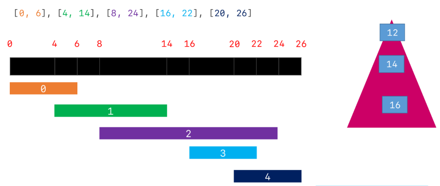
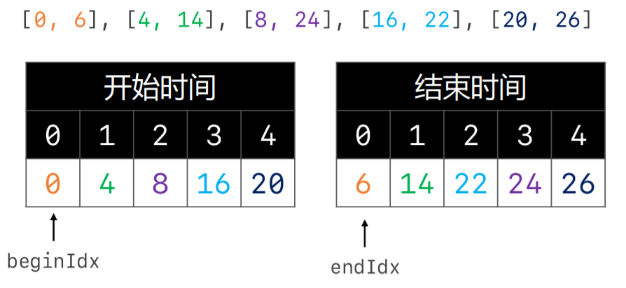

# 贪心算法

## 252.会议室

- 给定一个会议时间安排的数组，每个会议时间都会包括开始和结束的时间[[sl，e1]，[s2，e2]，...]（si < ei）请你判断一个人是否能够参加这里面的全部会议
- 示例一

```java
输入：[[0，30]，[5，10]，[15，20]]
输出：false
```

- 示例二

```java
输入：[[7，10]，[2，4]]
输出：true
```

- 思路

>- 先将会议的时间安装开始时间升序排列
>- 若第n个会议的开始时间大于第n-1个会议的结束时间就说明存在冲突

- 题解

```java
import java.util.Arrays;

public class Solution252 {
    public boolean canAttendMeetings(int[][] intervals) {
        if (intervals == null || intervals.length == 0) return true;

        //按照会议的开始时间,从小到大进行排序
        Arrays.sort(intervals, (m1, m2) -> m1[0] - m2[0]);
        //遍历每一个会议
        for (int i = 1; i < intervals.length; i++) {
            //排序后的第n个会议和第n-1个会议进行比较
            if (intervals[i][0] < intervals[i - 1][1]) return false;
        }
        return true;
    }
}
```

## 253.会议室II

- 给定一个会议时间安排的数组，每个会议时间都会包括开始和结束的时间[sl，el]，[s2，e2]，...]（si <  ei）为避免会议冲突，同时要考虑充分利用会议室资源，请你计算至少需要多少间会议室，才能满足这些会议安排
- 示例一

```java
输入：[[0，30]，[5，10]，[15，20]]
输出：2
```

- 示例二

```java
输入：[[7，10]，[2，4]]
输出：1
```

- 思路一：用小顶堆



>- 先把会议区间安装会议开始时间从小到大进行排序
>- 排序后的第一个区间作为初始值放入小顶堆中
>- 遍历剩下的区间 ，依次用区间的开始时间与堆顶区间的结束时间做比较
>- 若大于，说明会议室可以复用；若小于，说明会议时间有交集，有冲突，需要重开一个会议室

- 题解一

```java
import java.util.Arrays;
import java.util.PriorityQueue;

public class Solution253 {
    public int minMeetingRooms(int[][] intervals) {
        if (intervals == null || intervals.length == 0) return 0;

        //按照会议的开始 时间从小到大排序
        Arrays.sort(intervals, (m1, m2) -> m1[0] - m2[0]);
        //创建一个最小堆 存放每一个会议的结束时间
        PriorityQueue<Integer> heap = new PriorityQueue<>();
        //添加0号会议的结束时间
        heap.add(intervals[0][1]);

        //堆顶的含义 目前占用的会议室中最早结束的时间
        for (int i = 1; i < intervals.length; i++) {
            //i号会议室的开始时间 >= 堆顶
            if (!heap.isEmpty() && intervals[i][0] >= heap.peek()) {
                heap.remove();
            }
            heap.add(intervals[i][1]);
        }
        return heap.size();
    }
}
```

---

- 思路二：使用数组 



>- 将会议室区间的开始时间结束时间拆分并排序
>- 与思路一相同，需要比较第n和会议区间的开始时间与第n-1个会议区间的结束时间

- 题解二

```java
public class Solution253 {
    public int minMeetingRooms(int[][] intervals) {
         if (intervals == null || intervals.length == 0) return 0;

        //存放所有会议的开始时间
        int[] begins = new int[intervals.length];
        //存放所有会议的结束时间
        int[] ends = new int[intervals.length];
        for (int i = 0; i < intervals.length; i++) {
            begins[i] = intervals[i][0];
            ends[i] = intervals[i][0];
        }
        //排序
        Arrays.sort(begins);
        Arrays.sort(ends);

        //需要的会议室数量
        int room = 0;
        //结束时间索引
        int endIdx = 0;
        for (int begin : begins) {
            //会议的开始时间大于等于结束时间 说明能重复利用会议室
            if (begin >= ends[endIdx]) {
                endIdx++;
            } else {
                room++; //需要增加一个会议室
            }
        }
        return room;
    }
}
```

