# 链表

## 203.移除链表元素

- 删除链表中等于给定值 val 的所有节点。

- 示例:

```java
输入: 1->2->6->3->4->5->6, val = 6
输出: 1->2->3->4->5
```

- 思路

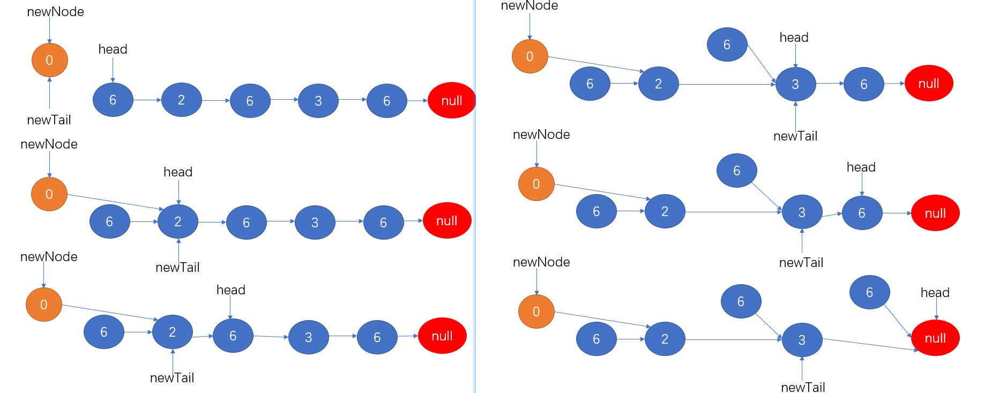

>- 创建一个虚拟头结点，用newNode和newTail构建一个新的链表
>- 删除的目标值是6，head作为指针对链表进行扫描，第一次遇到6则跳过；第二次遇到2则保存newNode的next指针域里，同时将2赋值newTail；第三次遇到6则将6的下一个结点保存到newTail的指针域里；第4次遇到3赋值给newTail；第5次遇到6则将6的下一个结点保存到newTail的指针域里；最后遇到null结点，newTail.next = null

- 题解

```java
public class Solution205 {
    public ListNode removeElements(ListNode head, int val) {
        if (head == null) return null;
        ListNode newNode = new ListNode(0); //创建虚拟头结点
        ListNode newTail = newNode; //虚拟头尾结点都不为空
        while (head != null){
            if (head.val != val){
                newTail.next = head;
                newTail = head;
            }
            head = head.next;
        }
        newTail.next = null;
        return newNode.next;
    }
}
```

## 2.两数相加

- 给出两个 非空 的链表用来表示两个非负的整数。其中，它们各自的位数是按照 逆序 的方式存储的，并且它们的每个节点只能存储 一位 数字
- 如果，我们将这两个数相加起来，则会返回一个新的链表来表示它们的和
- 您可以假设除了数字 0 之外，这两个数都不会以 0 开头
- 示例：

```java
输入：(2 -> 4 -> 3) + (5 -> 6 -> 4)
输出：7 -> 0 -> 8
原因：342 + 465 = 807
```

- 思路

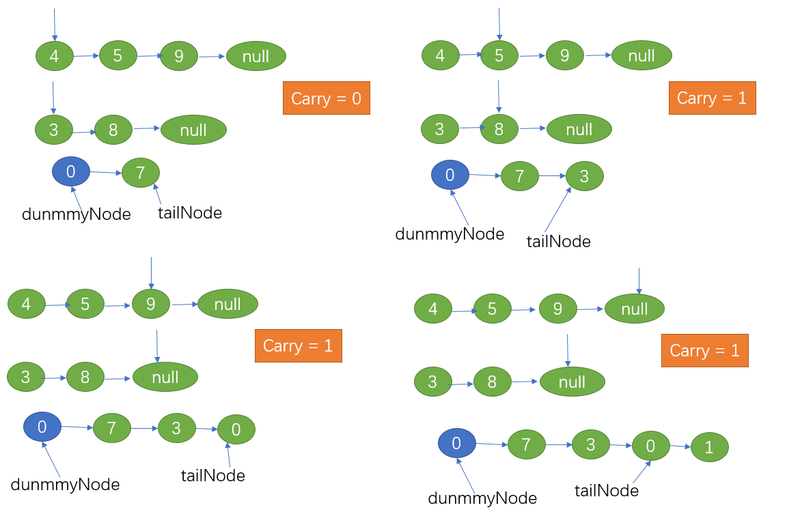

>- 创建一个虚拟头结点，若指针指向为null则默认为0，每次都需要对应指针所指向的值相加再加上之前的进位值
>- 对于新链表的值 = 和的余数
>- 进位值 = 和的个位数
>- 最后当两个链表的指针都指向为null，还需要再次判断进位是否大于0，大于0则再增加一个新结点

- 题解

```java
public class Solution2 {
    public ListNode addTwoNumbers(ListNode l1, ListNode l2) {
        if (l1 == null) return l2;
        if (l2 == null) return l1;
        ListNode dummyNode = new ListNode(0); //虚拟头结点
        ListNode tailNode = dummyNode; //新链表的尾结点

        int carry = 0; //存储进位值
        while (l1 != null || l2 != null){
            int val1 = 0; //若结点为null,默认值为0
            int val2 = 0;
            if (l1 != null){
                val1 = l1.val;
                l1 = l1.next; //指针向后移动
            }
            if (l2 != null){
                val2 = l2.val;
                l2 = l2.next;
            }
            int sum = val1 + val2 + carry; //结点值和进位值向加
            carry = sum / 10; //更新进位值 12 / 10 = 1
            tailNode.next = new ListNode(sum % 10); //取个位数作为新结点的值 12 % 10 = 2
            tailNode = tailNode.next;
        }
        //检查最后的进位值
        if (carry > 0){
            tailNode.next = new ListNode(carry);
        }
        return dummyNode.next;
    }
}
```

## 160.相交链表

- 编写一个程序，找到两个单链表相交的起始节点

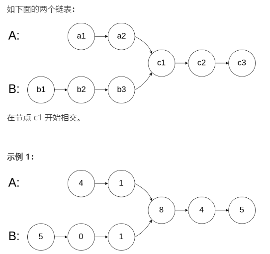

```java
输入：intersectVal = 8, listA = [4,1,8,4,5], listB = [5,0,1,8,4,5], skipA = 2, skipB = 3
输出：Reference of the node with value = 8
输入解释：相交节点的值为 8 （注意，如果两个链表相交则不能为 0）。从各自的表头开始算起，链表 A 为 [4,1,8,4,5]，链表 B 为 [5,0,1,8,4,5]。在 A 中，相交节点前有 2 个节点；在 B 中，相交节点前有 3 个节点。
```

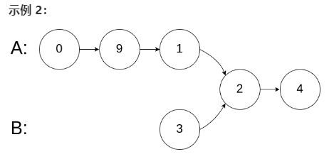

```java
输入：intersectVal = 2, listA = [0,9,1,2,4], listB = [3,2,4], skipA = 3, skipB = 1
输出：Reference of the node with value = 2
输入解释：相交节点的值为 2 （注意，如果两个链表相交则不能为 0）。从各自的表头开始算起，链表 A 为 [0,9,1,2,4]，链表 B 为 [3,2,4]。在 A 中，相交节点前有 3 个节点；在 B 中，相交节点前有 1 个节点。
```

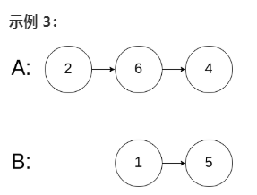

```java
输入：intersectVal = 0, listA = [2,6,4], listB = [1,5], skipA = 3, skipB = 2
输出：null
输入解释：从各自的表头开始算起，链表 A 为 [2,6,4]，链表 B 为 [1,5]。由于这两个链表不相交，所以 intersectVal 必须为 0，而 skipA 和 skipB 可以是任意值。
解释：这两个链表不相交，因此返回 null。
```

- 注意：

>- 如果两个链表没有交点，返回 null.
>- 在返回结果后，两个链表仍须保持原有的结构。
>- 可假定整个链表结构中没有循环。
>- 程序尽量满足 O(n) 时间复杂度，且仅用 O(1) 内存。

- 思路

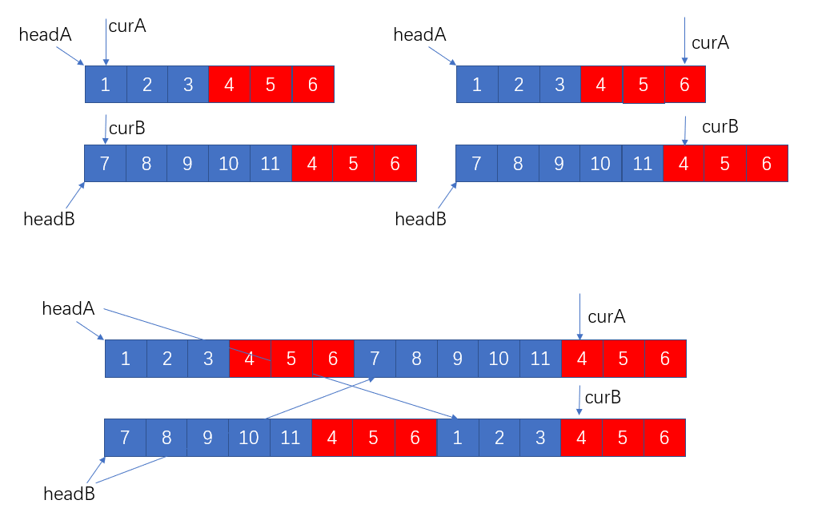

>- headA和headB指针不变，curA和curB指针同时向前移动，当其中一个指针指向为空时，则将另一个链表接上继续遍历
>- 这样的做法好似数学中的通分

- 题解

```java
public class Solution160 {
    public ListNode getIntersectionNode(ListNode headA, ListNode headB) {
        if (headA == null ||headB == null) return null;
        ListNode curA = headA;
        ListNode curB = headB;
        while (curA != curB){
            curA = (curA == null) ? headB : curA.next; //若curA指向空则拼接上headB链表
            curB = (curB == null) ? headA : curB.next; //若curB指向空则拼接上headA链表
        }
        return curA; //返回curA或curB都一样
    }
}
```

## 86.分隔链表

- 给定一个链表和一个特定值 x，对链表进行分隔，使得所有小于 x 的节点都在大于或等于 x 的节点之前
- 你应当保留两个分区中每个节点的初始相对位置
- 示例:

```java
输入: head = 1->4->3->2->5->2, x = 3
输出: 1->2->2->4->3->5
```

- 思路

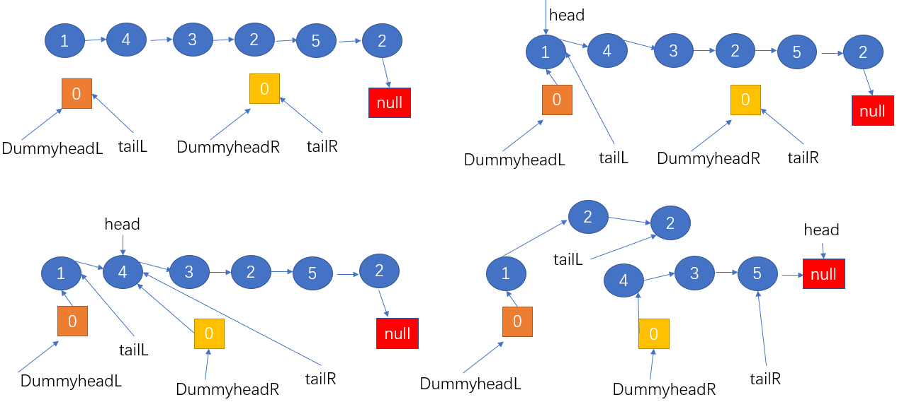

>- 创建两个虚拟头结点，将目标链表分成两段，一段是小于3的，一段是大于等于3的，最后将两段链表拼接起来
>- 注意右边链表的尾结点 tailR.next = null 要置空

- 题解

```java
public class Solution86 {
    public ListNode partition(ListNode head, int x) {
        if (head == null) return null;
        //创建两个虚拟头结点作为将目标链表分成两段
        ListNode dummyHeadL = new ListNode(0); 
        ListNode dummyHeadR = new ListNode(0);
        ListNode tailL = dummyHeadL;
        ListNode tailR = dummyHeadR;

        while (head != null){
            //小于x的放在左段,大于x的放在右段
            if (head.val < x){
                tailL.next = head;
                tailL = tailL.next;
            }else {
                tailR.next = head;
                tailR = tailR.next;
            }
            head = head.next;
        }
        //最后合并两段链表为一段全新的链表
        tailR.next = null;
        tailL.next = dummyHeadR.next;
        //虚拟头结点的next指针域中才存储着有效值
        return dummyHeadL.next;
    }
}
```

## 234.回文链表

- 请判断一个链表是否为回文链表。

- 示例 1:

```java
输入: 1->2
输出: false
```

- 示例 2:

```java
输入: 1->2->2->1
输出: true
```

- 思路

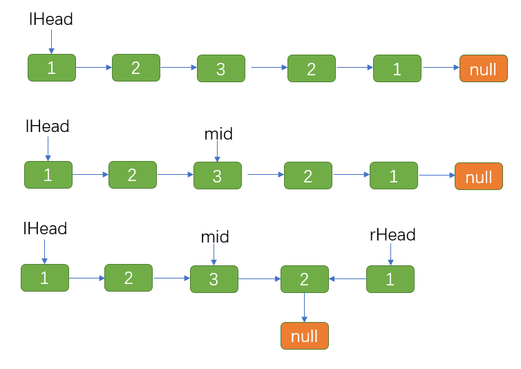

>- 先找到链表的中心结点
>- 把中心结点的下一位做为后半段链表的头结点进行翻转
>- 同时移动lHead何rHead指针，对他们所指向的值进行比较

- 题解

```java
public class Solution234 {
    /**
     * 判断是否为回文链表
     * 要求时间复杂度O(n),空间复杂度O(1)并且不破坏原来的链表结构
     * @return 返回true则为回文链表
     */
    public boolean isPalindrome(ListNode head) {
        if (head == null || head.next == null) return true; //链表为空或者只有一个数
        if (head.next.next == null) return head.val == head.next.val; //链表有两个数
        //链表至少有三个数,先找到中间结点
        ListNode mid = middleNode(head);
        //翻转右半部分(中间结点的右边部分)
        ListNode rHead = reverseList(mid.next); //右半部分新的头结点
        ListNode lHead = head; //左半部分的头结点
        ListNode rOldHead = rHead; //-----------------------------------------------1

        //从lHead何rHead一起出发,判断是否为回文链表
        boolean result = true;
        while (rHead != null){
            if (lHead.val != rHead.val){
                result = false;
                break;
            }
            lHead = lHead.next;
            rHead = rHead.next;
        }
        //恢复右半部分,即恢复原来的链表结构
        reverseList(rOldHead); //---------------------------------------------------2
        return result;
    }

    //翻转链表
    private ListNode reverseList(ListNode head) {
        ListNode newNode = null;
        while (head != null){
            ListNode temp = head.next;
            head.next = newNode;
            newNode = head;
            head = temp;
        }
        return newNode;
    }

    //用快慢指针寻找链表的中心结点
    private ListNode middleNode(ListNode head){
        ListNode fast = head;
        ListNode slow = head;
        while (fast.next != null && fast.next.next != null){
            fast = fast.next.next;
            slow = slow.next;
        }
        return slow;
    }
}
```

>- **若不需要保证原来的链表结构，1、2步可以省略**

- **快慢指针：慢指针走一步，快指针走两步**

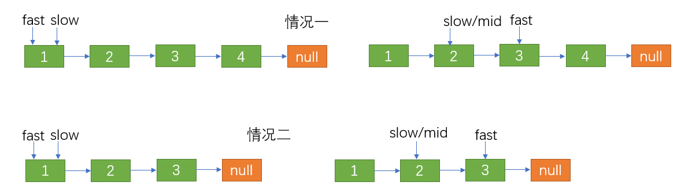

- **翻转链表**

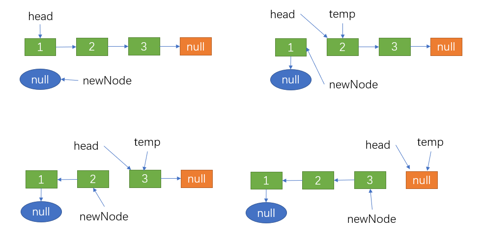

>- 翻转链表需要把原链表的头结点变为尾结点，把原链表的尾结点变为头结点
>- 原来的头结点要指向null，那么必要的一步就是head.next = null，如果那么做就遍历不到后面的结点，所以需要一个指针temp暂存head.next的结点
>- newNode每次都指向即将被翻转结点的next结点

# 练习

## 237.删除链表中的结点

- 请编写一个函数，使其可以删除某个链表中给定的（非末尾）节点，你将只被给定要求被删除的节点
- 现有一个链表 -- head = [4,5,1,9]，它可以表示为: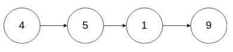

```java
示例 1:

输入: head = [4,5,1,9], node = 5
输出: [4,1,9]
解释: 给定你链表中值为 5 的第二个节点，那么在调用了你的函数之后，该链表应变为 4 -> 1 -> 9.
//---------------------------------------------------------------------------------
示例 2:

输入: head = [4,5,1,9], node = 1
输出: [4,5,9]
解释: 给定你链表中值为 1 的第三个节点，那么在调用了你的函数之后，该链表应变为 4 -> 5 -> 9.
```

- 说明:

>- 链表至少包含两个节点
>- 链表中所有节点的值都是唯一的
>- 给定的节点为非末尾节点并且一定是链表中的一个有效节点
>- 不要从你的函数中返回任何结果

- 思路

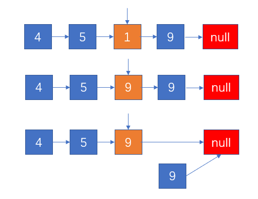

>- 目标删除的结点是1，按照常规来说，需要取到1的前一个结点5，再用5.next = 1.next.next
>- 题目只给了 我们要删除的结点作为已知条件，那么我们就可以用1.next的值覆盖掉1的值，再删除1.next
>- 实际上就是将删除node的问题转换为了删除node.next

- 题解

```java
public class Solution237 {
    public void deleteNode(ListNode node) {
        node.val = node.next.val;
        node.next = node.next.next;
    }
}
```

## 141.环形链表

- 给定一个链表，判断链表中是否有环
- 为了表示给定链表中的环，我们使用整数 pos 来表示链表尾连接到链表中的位置（索引从 0 开始）；如果 pos 是 -1，则在该链表中没有环

- 示例 1：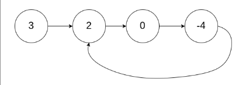

```java
输入：head = [3,2,0,-4], pos = 1
输出：true
解释：链表中有一个环，其尾部连接到第二个节点
```

- 示例 2：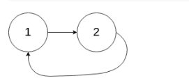

```java
输入：head = [1,2], pos = 0
输出：true
解释：链表中有一个环，其尾部连接到第一个节点
```

- 示例 3：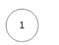

```java
输入：head = [1], pos = -1
输出：false
解释：链表中没有环
```

- 进阶：你能用 O(1)（即，常量）内存解决此问题吗？
- 思路

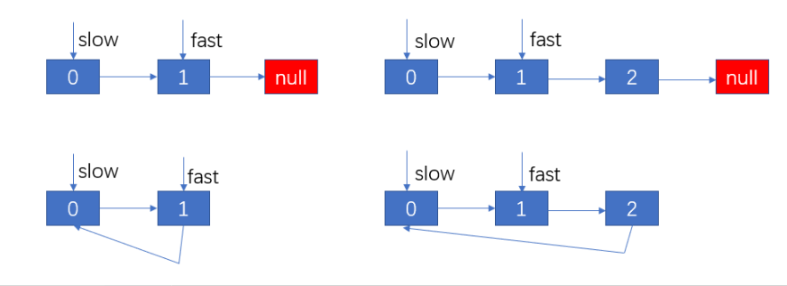

>- 使用快慢双指针
>- 当slow指针所指向的地址和fast指针所指向的地址相同时说明链表有环
>- slow每次走一步，fast指针每次都两步，只要有环fast指针必然会和slow指向相遇
>- 把环形指针想象成一个足球场的跑道，跑得快的人一定会和跑的慢的人再次相遇

- 题解

```java
public class Solution141 {
    public boolean hasCycle(ListNode head) {
        if (head == null || head.next == null) return false; //链表中只有一个结点,必然无环
        ListNode slow = head; //慢指针
        ListNode fast = head.next; //快指针
        while (slow != fast){
            if (fast == null || fast.next == null) return false; 
            slow = slow.next;
            fast = fast.next.next;
        }
        return true;
    }
}
```

## 206.反转链表

- 反转一个单链表
- 示例:

```java
输入: 1->2->3->4->5->NULL
输出: 5->4->3->2->1->NULL
```

- 进阶:你可以迭代或递归地反转链表。你能否用两种方法解决这道题？
- 思路：

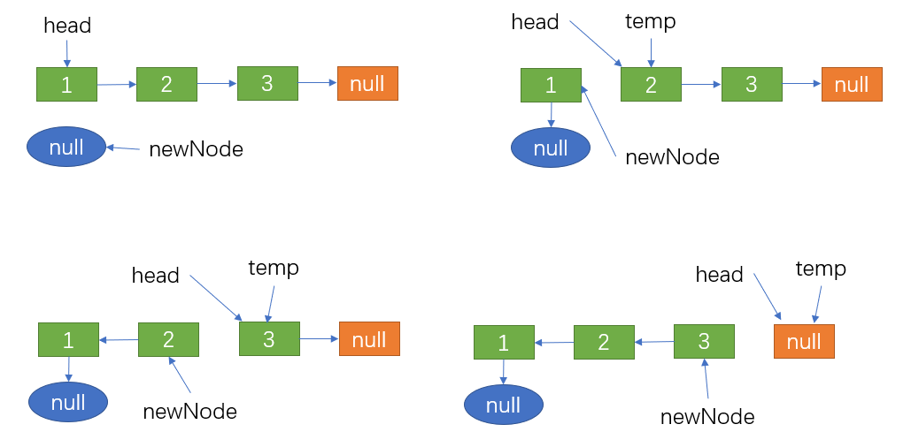

- 题解：

```java
public class Solution206 {
    public ListNode reverseList(ListNode head) {
        if (head == null || head.next == null) return head;
        ListNode newNode = null;
        ListNode temp;
        while (head != null){
            temp = head.next;
            head.next = newNode;
            newNode = head;
            head = temp;
        }
        return newNode;
    }
}
```

## 21.合并两个有序链表

- 将两个升序链表合并为一个新的升序链表并返回。新链表是通过拼接给定的两个链表的所有节点组成的
- 示例：

```java
输入：1->2->4, 1->3->4
输出：1->1->2->3->4->4
```

- 思路

>- 根据两个链表创建一个新链表
>- 分别遍历两个链表，比较结点中val的大小，再与新链表的虚拟头结点串起来

- 题解

```java
public class Solution21 {
    public ListNode mergeTwoLists(ListNode l1, ListNode l2) {
        if (l1 == null) return l2;
        if (l2 == null) return l1;
        ListNode dummyHead = new ListNode(0); //虚拟头结点
        ListNode tail = dummyHead; //新链表的的尾结点
        while (l1 != null || l2 != null){
           if (l1 == null){
               tail.next = l2;
               tail = tail.next;
               l2 = l2.next;
           }else if (l2 == null){
               tail.next = l1;
               tail = tail.next;
               l1 = l1.next;
           }else if (l1.val <= l2.val){
               tail.next = l1;
               tail = tail.next;
               l1 = l1.next;
           }else {
               tail.next = l2;
               tail = tail.next;
               l2 = l2.next;
           }
        }
        return dummyHead.next;
    }
}
```

## 23.合并k个排序链表

- 合并 *k* 个排序链表，返回合并后的排序链表。请分析和描述算法的复杂度。

- 示例:

```java
输入:
[
  1->4->5,
  1->3->4,
  2->6
]
输出: 1->1->2->3->4->4->5->6
```

