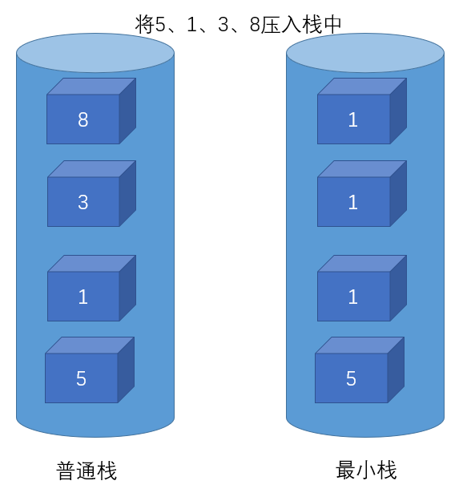
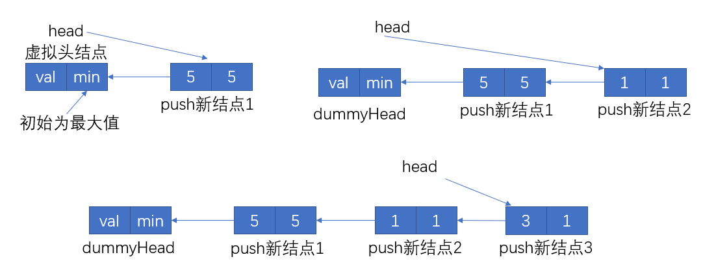
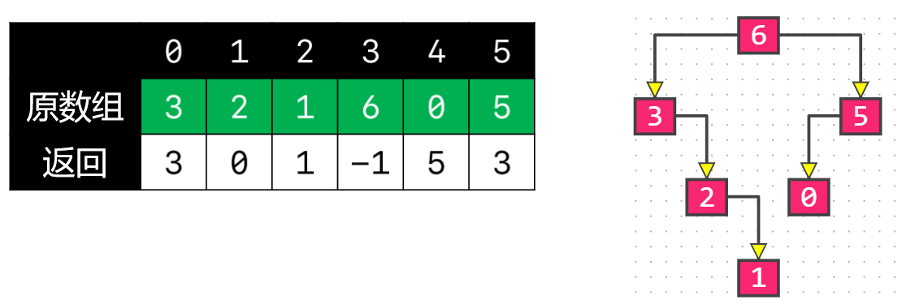
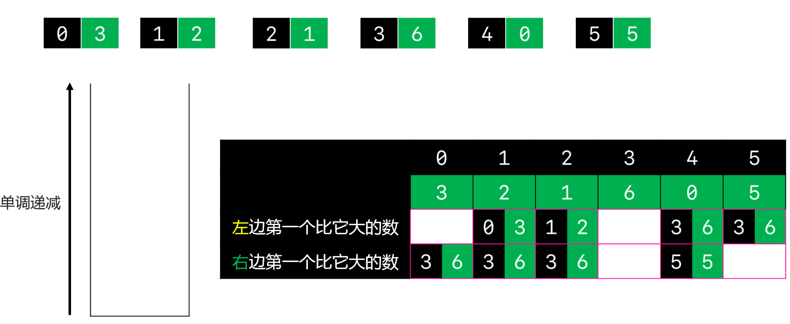
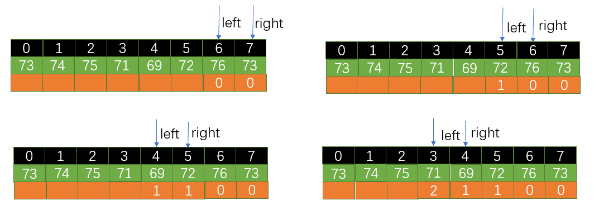
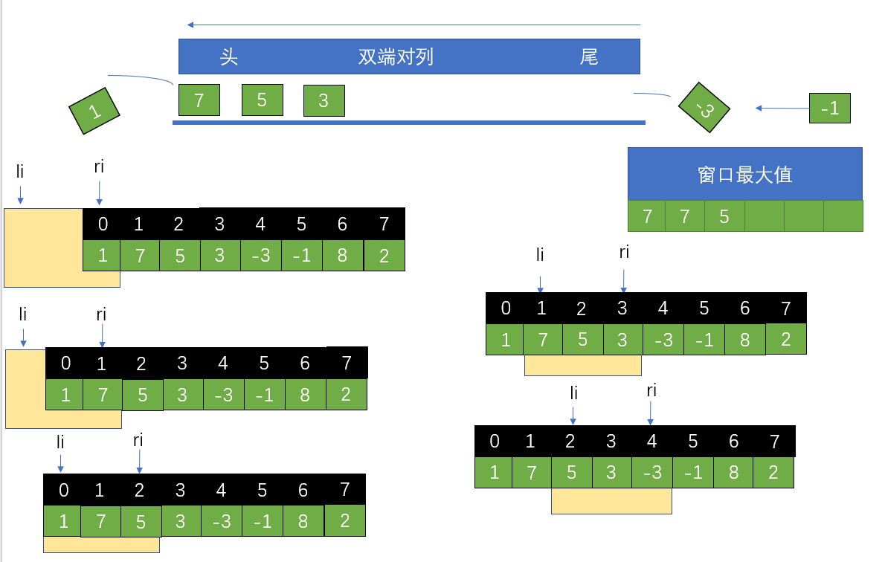
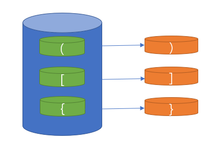
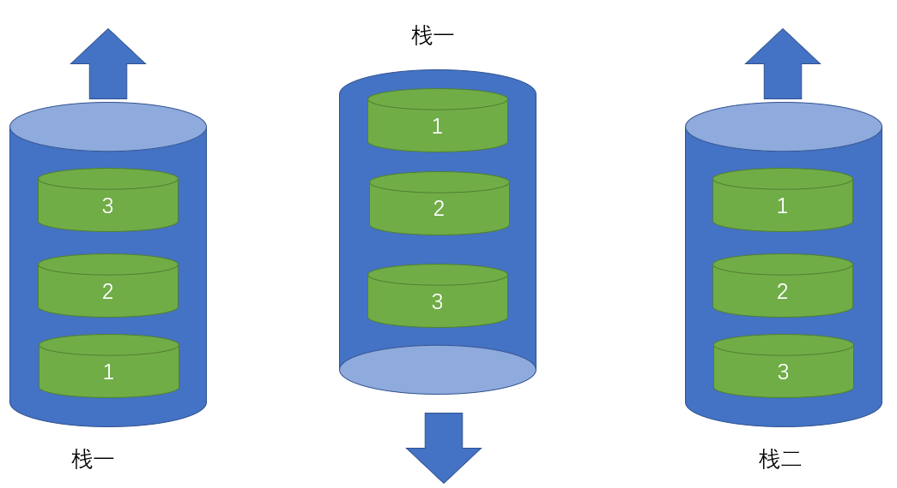

# 栈

## 155.最小栈

- 设计一个支持 push ，pop ，top 操作，并能在常数时间内检索到最小元素的栈
- push(x) —— 将元素 x 推入栈中
- pop() —— 删除栈顶的元素
- top() —— 获取栈顶元素
- getMin() —— 检索栈中的最小元素。
- 示例:

```java
输入：
["MinStack","push","push","push","getMin","pop","top","getMin"]
[[],[-2],[0],[-3],[],[],[],[]]

输出：
[null,null,null,null,-3,null,0,-2]

解释：
MinStack minStack = new MinStack();
minStack.push(-2);
minStack.push(0);
minStack.push(-3);
minStack.getMin();   --> 返回 -3.
minStack.pop();
minStack.top();      --> 返回 0.
minStack.getMin();   --> 返回 -2.
```

- 提示：pop、top 和 getMin 操作总是在 非空栈 上调用
- 思路一：



>- 将5压入普通栈时若最小栈为空则将5直接压入最小栈；将1压入普通栈，此时最小栈不为空，比较5和1的大小，将较小的1压入栈中；将3压入普通栈中，与最小栈中的1比较，再次将1压入栈中；以此类推
>- 当弹出栈顶元素8时也弹出最小栈的栈顶元素1，将3弹出栈时也将最小栈的1弹出栈，逐一对应，以此类推

- 题解一：利用JDK自带的栈

```java
import java.util.Stack;

class MinStack155 {
    Stack<Integer> stack;
    Stack<Integer> minStack;

    public MinStack155() {
        stack = new Stack<>();
        minStack = new Stack<>();
    }

    public void push(int x) { //压栈
        stack.push(x);
        if (minStack.empty()) {
            minStack.push(x);
        } else {
            minStack.push(Math.min(x, minStack.peek()));
        }
    }

    public void pop() { //弹栈
        stack.pop();
        minStack.pop();
    }

    public int top() { //查看栈顶元素
        return stack.peek();
    }

    public int getMin() { //返回栈中最小元素
        return minStack.peek();
    }
}
```

- 思路二：



>- 先创建一个虚拟头结点，val的值任意，min的值为Integer.MAX_VALUE
>- 每次创建一个新的结点在val存放push的值，在min存放与之前头结点相比较最小的值
>- 使用头插法将新结点插入链表中，这样新结点永远位于链表头，相当于位于栈顶

- 题解二：利用链表实现栈操作

```java
class MinStack155 {
    private Node head;

    private static class Node {
        int val;
        int min;
        Node next;

        public Node(int val, int min, Node next) {
            this.val = val;
            this.min = min;
            this.next = next;
        }
    }

    public MinStack155() {
        head = new Node(0, Integer.MAX_VALUE, null); //虚拟头结点
    }

    public void push(int x) {
        head = new Node(x,Math.min(x,head.min),head); //头插法
    }

    public void pop() {
        head = head.next;
    }

    public int top() {
        return head.val;
    }

    public int getMin() {
        return head.min;
    }
}
```

## 654.最大二叉树

- 给定一个不含重复元素的整数数组。一个以此数组构建的最大二叉树定义如下：
- 二叉树的根是数组中的最大元素
- 左子树是通过数组中最大值左边部分构造出的最大二叉树
- 右子树是通过数组中最大值右边部分构造出的最大二叉树
- 通过给定的数组构建最大二叉树，并且输出这个树的根节点
- 示例 ：

```java
输入：[3,2,1,6,0,5]
输出：返回下面这棵树的根节点：
   6
 /   \
3     5
\    / 
 2  0   
     \
      1
```

- 提示：给定的数组的大小在 [1, 1000] 之间

```java
public class Solution654 {
    public TreeNode constructMaximumBinaryTree(int[] nums) {
        if (nums == null) return null;
        return findRoot(nums,0,nums.length);

    }

    /**
     * [left,right) 规定范围是左闭右开
     * @param nums 二叉树的根是数组中的最大元素
     * @param left 左子树是通过数组中最大值左边部分构造出的最大二叉树
     * @param right 右子树是通过数组中最大值右边部分构造出的最大二叉树
     * @return 通过给定的数组构建最大二叉树，并且输出这个树的根节点
     */
    private TreeNode findRoot(int[] nums,int left,int right){
        if (left == right) return null; 

        int maxIdx = left;
        for (int ri = left + 1; ri < right; ri++) {
            if (nums[maxIdx] < nums[ri]) maxIdx = ri;
        }
        TreeNode root = new TreeNode(nums[maxIdx]);
        TreeNode leftChild = findRoot(nums,left,maxIdx);
        TreeNode rightChild = findRoot(nums,maxIdx+1,right);
        root.left = leftChild;
        root.right = rightChild;
        return root;
    }
}
```

## 654.题目变种

- 返回一个数组，数组里面存着每个节点的父节点的索引（如果没有父节点，就存 ）
- 二叉数的构造要求和上文相同



- 思路：利用栈求左、右边第一个比它大的数



>- 先将第一个数3压入栈中，接着压入2，那么3必然是左边第一个比2大的元素
>- 接着压入1，那么2必然是左边第一个比1大的元素
>- 当要压入6时发现栈再单调递减，此时弹出1，那么6必然是是第一个右边比1大的元素；为保存单调递减还有依次弹出2和3，那么也得到6是2和3右边第一个最大的元素
>- 接着压入0，此时6必然是0左边第一大的元素
>- 接着压入5，需要弹出0，得到5必然是0右边第一大的元素
>- 当5被压入后得到6必然是5左边第一大的元素

- **总结：只有弹栈时可以得到右边第一大，只有压栈时可以得到左边第一大，最后比较左边第一大与右边第一大，值较小的即为当前结点的父结点**

```java
/**
 * @return 返回nums数组的每个元素对应的父结点索引
 */
private int[] parentIndexes(int[] nums) {
    if (nums == null || nums.length == 0) return null;
    /*
     * 1.扫描一遍所有的元素
     * 2.保持栈从栈底到栈顶是单调递减的
     */
    int[] left = new int[nums.length];
    int[] right = new int[nums.length];
    Stack<Integer> stack = new Stack<>();
    //初始化,左右栈记录的是当前元素左边或右边第一大元素的索引值
    for (int i = 0; i < nums.length; i++) {
        left[i] = -1;
        right[i] = -1;
     }
    for (int i = 0; i < nums.length; i++) {
        //栈不为空并且即将压入的元素比栈顶元素大------弹出栈顶元素并记录,再继续比较栈顶元素,直到成功压入
        while (!stack.isEmpty() && nums[i] > nums[stack.peek()]){
            right[stack.pop()] = i;
        }
        //栈不为空并且即将压入的元素比栈顶元素小(此题没有等于条件)------记录并压栈
         if (!stack.isEmpty() && nums[i] < nums[stack.peek()]){
            left[i] = stack.peek();
        }
        stack.push(i); //包含栈为空的情况
    }
    
    int[] parent = new int[nums.length];
    //选择left和right中比较小的那个数就是父节点
    for (int i = 0; i < parent.length; i++) {
            if (left[i] == -1 && right[i] == -1){ //根节点
                parent[i] = -1;
            }else if (left[i] == -1 && right[i] != -1){ //为其父节点的左孩子
                parent[i] = right[i];
            }else if (left[i] != -1 && right[i] == -1){ //为其父节点的右孩子
                parent[i] = left[i];
            }else if (nums[left[i]] < nums[right[i]]){ //未知
                parent[i] = left[i];
            }else {
                parent[i] = right[i];
            }
        }
    return parent;
}
```

- 测试

```java
public static void main(String[] args) {
    Solution654 solution654 = new Solution654();
    int[] nums = { 3, 2, 1, 6, 0, 5 };
    System.out.println(Arrays.toString(solution654.parentIndexes(nums))); //[3, 0, 1, -1, 5, 3]
}
```

## 739.每日温度

- 根据每日 气温 列表，请重新生成一个列表，对应位置的输出是需要再等待多久温度才会升高超过该日的天数。如果之后都不会升高，请在该位置用 0 来代替。
- 例如，给定一个列表 temperatures = [73, 74, 75, 71, 69, 72, 76, 73]，你的输出应该是 [1, 1, 4, 2, 1, 1, 0, 0]。
- 提示：气温 列表长度的范围是 [1, 30000]。每个气温的值的均为华氏度，都是在 [30, 100] 范围内的整数。
- 思路一：

>利用栈找到当前元素右边的最大值

- 题解一：

```java
public class Solution739 {
    public int[] dailyTemperatures(int[] T) {
        if (T == null || T.length == 0) return null;
        int[] right = new int[T.length];
        Stack<Integer> stack = new Stack<>();
        for (int i = 0; i < T.length; i++) {
            while (!stack.isEmpty() && T[i] > T[stack.peek()]){ //如果温度相等(气温无变化)也不弹栈
                int temp = stack.pop();
                right[temp] = i - temp;
            }
            stack.push(i);
        }
        return right;
    }
}
```

- 思路二：倒推法



>- 最后一天的温度没有上升的空间，必然为0
>- 若前一天的温度较低，那么前一天的温度在right-left天之后上升
>- 若左边的温度较高则需要找到其右边最近的第一高温比较,否则找第二高温

- 题解二

```java
public int[] dailyTemperatures(int[] T) {
    if (T == null || T.length == 0) return null;
    int[] values = new int[T.length];
    for (int left = T.length - 2; left >= 0; left --) {
        int right = left + 1;
        while (true){
            if (T[left] < T[right]){ //左边温度比右边温度低
                values[left] = right - left;
                break;
            }else if (values[right] == 0){ //左边温度大于等于右边温度,且右边温度为最高温度的情况
                values[left] = 0;
                break;
            }
            //左边温度大于等于右边温度,且右边温度不是最高温度的情况
            right = right + values[right];
        }
    }
    return values;
}
```

# 对列

## 239.滑动窗口最大值

- 给定一个数组 nums，有一个大小为 k 的滑动窗口从数组的最左侧移动到数组的最右侧。你只可以看到在滑动窗口内的 k 个数字。滑动窗口每次只向右移动一位
- 返回滑动窗口中的最大值
- 进阶：你能在线性时间复杂度内解决此题吗？
- 示例:

```java
输入: nums = [1,3,-1,-3,5,3,6,7], 和 k = 3
输出: [3,3,5,5,6,7] 
解释: 

 滑动窗口的位置                最大值

---------------               -----

[1  3  -1] -3  5  3  6  7       3
 1 [3  -1  -3] 5  3  6  7       3
 1  3 [-1  -3  5] 3  6  7       5
 1  3  -1 [-3  5  3] 6  7       5
 1  3  -1  -3 [5  3  6] 7       6
 1  3  -1  -3  5 [3  6  7]      7


提示：
1 <= nums.length <= 10^5
-10^4 <= nums[i] <= 10^4
1 <= k <= nums.length
```

- 思路



>- li和ri两个指针确定滑动窗口的大小
>- 构建单调递减对列
>- ri指针遍历整个数组，将每次访问到的元素索引从队尾入队；若该元素大于当前队尾元素，则之前的队尾元素先出队再让该元素索引入队；若该元素小于当前队尾元素则直接入队
>- 当li指针进入合法范围时，若此时的队头元素索引在滑动窗口的范围则直接出队，必然是当前窗口中的最大值；若当前对头元素不合法则立即出队
>- 当ri遍历完整个数组后，每个窗口的最大值也全部获取成功了

- 题解一：用双端对列

```java
public class Solution239 {
    /**
     * @param k 可以看到在滑动窗口内的 k 个数字，动窗口每次只向右移动一位
     * @return 返回每次滑动窗口中的最大值数组集合
     */
    public int[] maxSlidingWindow(int[] nums, int k) {
        if (nums == null || nums.length == 0 || k < 1) return new int[]{};
        if (k == 1) return nums; //一个滑动窗口里只有一个数的情况

        Deque<Integer> deque = new LinkedList<>(); //双端对列
        int[] maxWindows = new int[nums.length - k + 1]; //滑动窗口个数 = 数据总数-(k-1)
        for (int ri = 0; ri < nums.length; ri++) {

            while (!deque.isEmpty() && nums[ri] >= nums[deque.peekLast()]){
                deque.pollLast(); //在对列不空且右指针指向元素大于队尾元素的情况下，对尾元素出队
            }
            //对列为空或右指针指向元素小于队尾元素的情况,添加到队尾
            deque.offerLast(ri);

            int li = ri - k + 1; //左指针的范围 = 右指针索引-(k-1)
            if (li < 0) continue; //若左指针索引还处于非法范围直接跳过

            assert !deque.isEmpty();
            if (deque.peekFirst() < li){
                deque.pollFirst(); //队头索引已经不再滑动窗口的范围直接出队
            }

            assert !deque.isEmpty();
            maxWindows[li] = nums[deque.peekFirst()];
        }
        return maxWindows;
    }
}
```

- 题解二：尽量减少比较次数的策略

```java
public class Solution239 {
    /**
     * @param k 可以看到在滑动窗口内的 k 个数字，动窗口每次只向右移动一位
     * @return 返回每次滑动窗口中的最大值数组集合
     */
    public int[] maxSlidingWindow(int[] nums, int k) {
        if (nums == null || nums.length == 0 || k < 1) return new int[]{};
        if (k == 1) return nums; //一个滑动窗口里只有一个数的情况

        int[] maxWindows = new int[nums.length - k + 1]; //滑动窗口个数 = 数据总数-(k-1)
        int maxId = 0; //先默认第一个数最大
        for (int ri = 1; ri < k; ri++) { //获得第一个窗口中最大的数
            if (nums[maxId] <= nums[ri]) maxId = ri;
        }
        maxWindows[0] = nums[maxId];
        for (int ri = k; ri < nums.length; ri++) { //从第二个窗口开始遍历
            int li = ri - k + 1; //窗口左边界限
            if (maxId < li){ //若最大值索引已过期则重新遍历获取当前窗口的最大值
                maxId = li;
                for (int i = li + 1; i <= ri; i++) {
                    if (nums[maxId] <= nums[i]) maxId = i;
                }
            }else if (nums[ri] >= nums[maxId]){ //若最大值索引没有过期,则与新遍历的到的窗口右边界元素比较
                    maxId = ri;
            }
            maxWindows[li] = nums[maxId]; //存放每个窗口的最大值
        }
        return maxWindows;
    }
}
```

# 练习

## 20.有效的括号

- 给定一个只包括 '('，')'，'{'，'}'，'['，']' 的字符串，判断字符串是否有效
- 有效字符串需满足：
  - 左括号必须用相同类型的右括号闭合
  - 左括号必须以正确的顺序闭合
  - 注意空字符串可被认为是有效字符串

```java
示例 1:

输入: "()"
输出: true
示例 2:

输入: "()[]{}"
输出: true
示例 3:

输入: "(]"
输出: false
示例 4:

输入: "([)]"
输出: false
示例 5:

输入: "{[]}"
输出: true
```

- 思路



>- 当遇到左括号时就入栈，遇到右括号时就让栈中的括号出栈并比对是否为一对括号
>- 特殊情况：需要的入栈的括号既不是左括号栈又为空时一定没有匹配的括号
>- 在弹栈pop时若栈为空会报异常
>- 最后若括号全部匹配那么栈一定为空栈

- 题解

```java
public class Solution20 {
    public boolean isValid(String s) {
        if (s.length() == 0) return true; //空字符串
        if (s.length() == 1) return false; //只有一个括号
        char[] chars = s.toCharArray();
        Stack<Character> stack = new Stack<>();
        for (char include : chars) {
            if (include == '{' || include == '[' || include == '(') stack.push(include);
            else if (stack.isEmpty()) return false;
            else if (include == '}' && '{' != stack.pop()) return false;
            else if (include == ']' && '[' != stack.pop()) return false;
            else if (include == ')' && '(' != stack.pop()) return false;
        }
        return stack.isEmpty();
    }
}
```

## 232.用栈实现对列

- 使用栈实现队列的下列操作：


```java
push(x) -- 将一个元素放入队列的尾部。
pop() -- 从队列首部移除元素。
peek() -- 返回队列首部的元素。
empty() -- 返回队列是否为空。
```

- 示例:

```java
MyQueue queue = new MyQueue();

queue.push(1);
queue.push(2);  
queue.peek();  // 返回 1
queue.pop();   // 返回 1
queue.empty(); // 返回 false
```

- 说明:
- 你只能使用标准的栈操作 -- 也就是只有 push to top, peek/pop from top, size, 和 is empty 操作是合法的
- 你所使用的语言也许不支持栈。你可以使用 list 或者 deque（双端队列）来模拟一个栈，只要是标准的栈操作即可
- 假设所有操作都是有效的 （例如，一个空的队列不会调用 pop 或者 peek 操作）
- 思路

>使用双端对列实现栈操作

- 题解

```java
import java.util.Deque;
import java.util.LinkedList;

public class MyQueue232 {
    Deque<Integer> queue;
    /** Initialize your data structure here. */
    public MyQueue232() {
        queue = new LinkedList<>();
    }

    /** Push element x to the back of queue. */
    public void push(int x) {
        queue.offerLast(x);
    }

    /** Removes the element from in front of queue and returns that element. */
    public int pop() {
        assert !queue.isEmpty();
        return queue.pollFirst();
    }

    /** Get the front element. */
    public int peek() {
        assert !queue.isEmpty();
        return queue.peekFirst();
    }

    /** Returns whether the queue is empty. */
    public boolean empty() {
        return queue.isEmpty();
    }
}
```

## 09.两个栈实现对列

- 用两个栈实现一个队列。队列的声明如下，请实现它的两个函数 appendTail 和 deleteHead ，分别完成在队列尾部插入整数和在队列头部删除整数的功能。(若队列中没有元素，deleteHead 操作返回 -1 )
- 示例 1：

```java
输入：
["CQueue","appendTail","deleteHead","deleteHead"]
[[],[3],[],[]]
输出：[null,null,3,-1]
示例 2：

输入：
["CQueue","deleteHead","appendTail","appendTail","deleteHead","deleteHead"]
[[],[],[5],[2],[],[]]
输出：[null,-1,null,null,5,2]
```

- 提示：
  - 1 <= values <= 10000
  - 最多会对 appendTail、deleteHead 进行 10000 次调用
- 思路



>- 在添加元素时将其push到栈一中
>- 在删除对头元素时，先将栈一的元素pop到栈二，再将栈二的栈顶元素pop
>- 注意：每次需要删除队头元素时都需要将栈一的元素全部pop直到栈一为空栈
>- 注意：只有在栈2为空的情况下才把栈1的元素倾倒在栈2中，这样才能保证栈2中最底部是队列的尾部元素

- 题解：

```java
import java.util.Stack;

public class CQueue09 {
    Stack<Integer> stack1;
    Stack<Integer> stack2;

    public CQueue09() {
        stack1 = new Stack<>();
        stack2 = new Stack<>();
    }

    //添加到队尾
    public void appendTail(int value) {
        stack1.push(value);
    }

    //队头元素出队
    public int deleteHead() {
        if (stack2.isEmpty()) { //只有在栈2为空的情况下才需要把栈1的元素倾倒在栈2中
            while (!stack1.isEmpty()) {
                stack2.push(stack1.pop());
            }
        }
        return stack2.isEmpty() ? -1 : stack2.pop();
    }
}
```

## 0304.划栈为对列

- 实现一个MyQueue类，该类用两个栈来实现一个队列
- 示例：

```java
MyQueue queue = new MyQueue();

queue.push(1);
queue.push(2);
queue.peek();  // 返回 1
queue.pop();   // 返回 1
queue.empty(); // 返回 false
```

- 说明：
- 你只能使用标准的栈操作 -- 也就是只有 push to top, peek/pop from top, size 和 is empty 操作是合法的
- 你所使用的语言也许不支持栈。你可以使用 list 或者 deque（双端队列）来模拟一个栈，只要是标准的栈操作即可
- 假设所有操作都是有效的 （例如，一个空的队列不会调用 pop 或者 peek 操作）
- 题解

```java
import java.util.Stack;

public class MyQueue0304 {
    Stack<Integer> stack1;
    Stack<Integer> stack2;
    /** Initialize your data structure here. */
    public MyQueue0304() {
        stack1 = new Stack<>();
        stack2 = new Stack<>();
    }

    /** Push element x to the back of queue. */
    public void push(int x) {
        stack1.push(x);
    }

    /** Removes the element from in front of queue and returns that element. */
    public int pop() {
        if (stack2.isEmpty()){
            while (!stack1.isEmpty()){
                stack2.push(stack1.pop());
            }
        }
        return stack2.pop();
    }

    /** Get the front element. */
    public int peek() {
        if (stack2.isEmpty()){
            while (!stack1.isEmpty()){
                stack2.push(stack1.pop());
            }
        }
        return stack2.peek();
    }

    /** Returns whether the queue is empty. */
    public boolean empty() {
        return stack1.isEmpty() && stack2.isEmpty();
    }
}
```

## 150.逆波兰表达式求值

- 根据逆波兰表示法，求表达式的值
- 有效的运算符包括 +, -, *, / 。每个运算对象可以是整数，也可以是另一个逆波兰表达式
- 说明：
  - 整数除法只保留整数部分
  - 给定逆波兰表达式总是有效的。换句话说，表达式总会得出有效数值且不存在除数为 0 的情况

```java
示例 1：

输入: ["2", "1", "+", "3", "*"]
输出: 9
解释: ((2 + 1) * 3) = 9
    
//-------------------------------------------------------------------    
示例 2：

输入: ["4", "13", "5", "/", "+"]
输出: 6
解释: (4 + (13 / 5)) = 6
    
//-------------------------------------------------------------------        
示例 3：

输入: ["10", "6", "9", "3", "+", "-11", "*", "/", "*", "17", "+", "5", "+"]
输出: 22
解释: 
  ((10 * (6 / ((9 + 3) * -11))) + 17) + 5
= ((10 * (6 / (12 * -11))) + 17) + 5
= ((10 * (6 / -132)) + 17) + 5
= ((10 * 0) + 17) + 5
= (0 + 17) + 5
= 17 + 5
= 22
```

- 思路

>- 当遇到运算符号时就弹出栈顶的两个元素进行相应的运算
>- 若为减法则第二个弹出的作为被减数，第一个弹出的为减数
>- 若为除法则第二个弹出的为被除数，第一个弹出的为除数
>- 进行相应运算后再把相应的结果压入栈顶

- 题解

```java
class Solution150 {
    public static int evalRPN(String[] tokens) {
        Stack<Integer> stack = new Stack<>();
        Integer op1, op2;
        for (String s : tokens) {
            switch (s) {
                case "+":
                    stack.push(stack.pop() + stack.pop());
                    break;
                case "-":
                    op2 = stack.pop();
                    op1 = stack.pop();
                    stack.push(op1 - op2);
                    break;
                case "*":
                    stack.push(stack.pop() + stack.pop());
                    break;
                case "/":
                    op2 = stack.pop();
                    op1 = stack.pop();
                    stack.push(op1 / op2);
                    break;
                default:
                    stack.push(Integer.valueOf(s)); //将字符串转换为Integer类型
                    break;
            }
        }
        return stack.pop();
    }
}
```

## 59.对列的最大值

- 请定义一个队列并实现函数 max_value 得到队列里的最大值，要求函数max_value、push_back 和 pop_front 的均摊时间复杂度都是O(1)
- 若队列为空，pop_front 和 max_value 需要返回 -1
- 示例一

```java
输入: 
["MaxQueue","push_back","push_back","max_value","pop_front","max_value"]
[[],[1],[2],[],[],[]]
输出: [null,null,null,2,1,2]
```

- 示例二

```java
输入: 
["MaxQueue","pop_front","max_value"]
[[],[],[]]
输出: [null,-1,-1]
```

- 思路

>- 用两个对列。一个对列为普通队列，实现正常的入队和出队操作，另一个使用优先级队列，主要用来得到最大值

- 题解

```java
import java.util.LinkedList;
import java.util.PriorityQueue;
import java.util.Queue;

public class MaxQueue59 {
    Queue<Integer> queue1;
    PriorityQueue<Integer> queue2;

    public MaxQueue59() {
        queue1 = new LinkedList<>();
        queue2 = new PriorityQueue<>((t1, t2) -> t2 - t1); //设置为大顶堆
    }

    public int max_value() {
        if (!queue2.isEmpty()) return queue2.peek();
        return -1;
    }

    public void push_back(int value) {
        queue1.offer(value); //正常队列
        queue2.offer(value); //优先级队列
    }

    public int pop_front() {
        int res = -1;
        if (!queue1.isEmpty()) { //队列1中的元素出队时也要把对列2中的备份删掉
            res = queue1.poll();
            queue2.remove(res);
        }
        return res;
    }
}
```

## 30.包含min函数的栈

- 定义栈的数据结构，请在该类型中实现一个能够得到栈的最小元素的 min 函数在该栈中，调用 min、push 及 pop 的时间复杂度都是 O(1)
- 示例

```java
MinStack minStack = new MinStack();
minStack.push(-2);
minStack.push(0);
minStack.push(-3);
minStack.min();   --> 返回 -3.
minStack.pop();
minStack.top();      --> 返回 0.
minStack.min();   --> 返回 -2.
```

- 提示：各函数的调用总次数不超过 20000 次
- 思路：使用栈和优先级对列
- 题解

```java
import java.util.PriorityQueue;
import java.util.Stack;

public class MinStack30 {

    Stack<Integer> stack;
    PriorityQueue<Integer> queue;
    /** initialize your data structure here. */
    public MinStack30() {
        stack = new Stack<>();
        queue = new PriorityQueue<>();
    }

    public void push(int x) { //压栈
        stack.push(x);
        queue.offer(x);
    }

    public void pop() { //弹栈
        if (!stack.isEmpty()){
            queue.remove(stack.pop());
        }
    }

    public int top() { //获取栈顶元素
        if (!stack.isEmpty()){
            return stack.peek();
        }
        return -1;
    }

    public int min() { //返回栈中最小值
        if (!queue.isEmpty()){
            return queue.peek();
        }
        return -1;
    }
}
```

## 946.栈的压入、弹出序列

- 输入两个整数序列，第一个序列表示栈的压入顺序，请判断第二个序列是否为该栈的弹出顺序。假设压入栈的所有数字均不相等。例如，序列 {1,2,3,4,5} 是某栈的压栈序列，序列 {4,5,3,2,1} 是该压栈序列对应的一个弹出序列，但 {4,3,5,1,2} 就不可能是该压栈序列的弹出序列
- 示例一

```java
输入：pushed = [1,2,3,4,5], popped = [4,5,3,2,1]
输出：true
解释：我们可以按以下顺序执行：
push(1), push(2), push(3), push(4), pop() -> 4,
push(5), pop() -> 5, pop() -> 3, pop() -> 2, pop() -> 1
```

- 示例二

```java
输入：pushed = [1,2,3,4,5], popped = [4,3,5,1,2]
输出：false
解释：1 不能在 2 之前弹出
```

- 提示

>- 0 <= pushed.length == popped.length <= 1000
>- 0 <= pushed[i], popped[i] < 1000
>- pushed 是 popped 的排列

- 思路：

>- 创建一个辅助栈，每次压入一个数据后就判断栈顶元素是否符合需要弹出数据，若相当则直接将元素弹出，不相等就继续向栈中压入数据
>- 最后若栈为空，说明符合弹栈的顺序，是可以实现的，若栈不为空，说明不存在该种弹栈序列

- 题解

```java
import java.util.Stack;

public class Solution946 {
    public boolean validateStackSequences(int[] pushed, int[] popped) {
        if (pushed.length == 0 || pushed.length == 1) return true;
        Stack<Integer> stack = new Stack<>();
        int idx = 0;
        for (int num : pushed) {
            stack.push(num); //压栈
            while (!stack.isEmpty() && stack.peek() == popped[idx]){ //是否符合弹栈序列
                stack.pop();
                idx++;
            }
        }
        return stack.isEmpty();
    }
}
```

