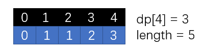
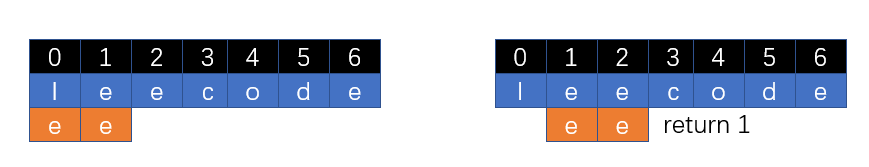
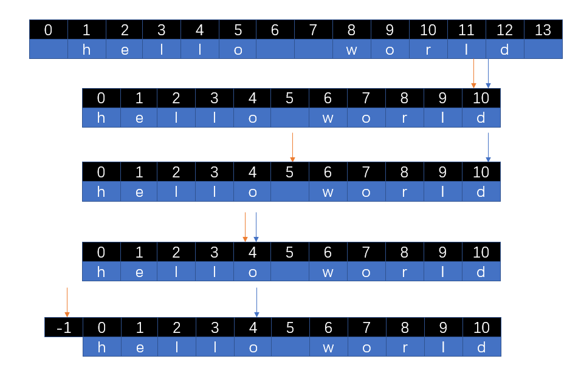
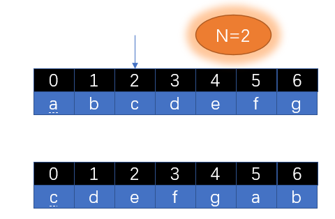

# 字符串

## 0901.字符串轮转

- 字符串轮转。给定两个字符串s1和s2，请编写代码检查s2是否为s1旋转而成（比如，waterbottle是erbottlewat旋转后的字符串）。

```java
示例1:

 输入：s1 = "waterbottle", s2 = "erbottlewat"
 输出：True
示例2:

 输入：s1 = "aa", "aba"
 输出：False
```

- 提示：
- 字符串长度在[0, 100000]范围内。
- 说明:你能只调用一次检查子串的方法吗？
- 思路


>- s1是原字符串，当s1和s1拼接后就包含了所有轮转字符串的情况
>- 只需要判断s2或s3或s4是否是s1+s1的子串即可


- 题解

```java
public class Solution0109 {
    public boolean isFlipedString(String s1, String s2) {
        if (s1.length() != s2.length()) return false;
        return (s1+s1).contains(s2);
    }
}
```

## 572.另一个数的子树

- 给定两个非空二叉树 s 和 t，检验 s 中是否包含和 t 具有相同结构和节点值的子树。s 的一个子树包括 s 的一个节点和这个节点的所有子孙。s 也可以看做它自身的一棵子树

- 示例 1：给定的树 s:

```java
   3
  / \
  4   5
 / \
1   2
```
- 给定的树 t：

```java
   4 
  / \
 1   2
```

- 返回 true，因为 t 与 s 的一个子树拥有相同的结构和节点值

- 示例 2：给定的树 s：

```java
     3
    / \
   4   5
  / \
 1   2
    /
   0  
```
- 给定的树 t：

```java
   4
  / \
 1   2
```

- 返回 false
- 思路：


>把两棵树都序列化，之后判断树 t 是否为数 s 的子串

- 题解

```java
public class Solution572 {
    public boolean isSubtree(TreeNode s, TreeNode t) {
        if (s == null || t == null) return false;
        return postSerialize(s).contains(postSerialize(t)); //序列化s数是否包含序列化t树
    }
    private String postSerialize(TreeNode root){
        StringBuilder builder = new StringBuilder();
        postSerialize(root,builder);
        return builder.toString();
    }
    private void postSerialize(TreeNode tree,StringBuilder builder){ //后序遍历序列化
        if (tree == null){ 
            builder.append("#!");
            return;
        }
        postSerialize(tree.left,builder);
        postSerialize(tree.right,builder);
        builder.append(tree.val).append("!");
    }
}
```

## 242.有效的字母异位词

- 给定两个字符串 s 和 t ，编写一个函数来判断 t 是否是 s 的字母异位词。

```java
示例 1:

输入: s = "anagram", t = "nagaram"
输出: true
示例 2:

输入: s = "rat", t = "car"
输出: false
```

- 说明:你可以假设字符串只包含小写字母。
- 进阶:如果输入字符串包含 unicode 字符怎么办？你能否调整你的解法来应对这种情况？
- 思路一：

>- 字母异位词：两个字符串中的每个字母出现的次数相同
>- 使用一个哈希表mapS记录字符串s中每个字母出现的次数，使用另一个哈希表mapT记录字符串t中每个字母出现的次数
>- 最后对比两张表中的数据是否相等

- 题解一：

```java
public class Solution242 {
    public boolean isAnagram(String s, String t) {
        if (s.length() != t.length()) return false;
        Map<Character,Integer> mapS = new HashMap<>();
        Map<Character,Integer> mapT = new HashMap<>();
        char[] charS = s.toCharArray();
        char[] charT = t.toCharArray();
        count(charS,mapS);
        count(charT,mapT);
        Set<Character> characters = mapS.keySet();
        for (Character character : characters) {
            if (!mapS.get(character).equals(mapT.get(character))) return false;
        }
        return true;
    }
    //将字符数组中对应字母出现的次数统计到map中
    private void count(char[] chars,Map<Character,Integer> map){
        for (char c : chars) {
            if (map.containsKey(c)) {
                map.put(c, map.get(c) + 1);
                continue;
            }
            map.put(c, 1);
        }
    }
}
```

- 思路二：根据题目说明，可以假设字符串全是小写字母

>- 根据ASCll码表得出 字符a  = 97; 
>- 字符 a 存放在数组索引 a - 'a' = 0中;
>- 字符 b 存放在数组索引 b - 'a' = 1中;

- 题解二：

```java
public class Solution242 {
    public boolean isAnagram(String s, String t) {
        char[] charS = s.toCharArray();
        char[] charT = t.toCharArray();
        if (charS.length != charT.length) return false;
        int[] counts = new int[26]; //最多是26个小写字母
        for (char c : charS) {
            counts[c - 'a']++;
        }
        for (char c : charT) {
            if (--counts[c - 'a'] < 0) return false;
        }
        return true;
    }
}
```

## 151.翻转字符串里的单词

- 给定一个字符串，逐个翻转字符串中的每个单词

```java
示例 1：

输入: "the sky is blue"
输出: "blue is sky the"
示例 2：

输入: "  hello world!  "
输出: "world! hello"
解释: 输入字符串可以在前面或者后面包含多余的空格，但是反转后的字符不能包括。
示例 3：

输入: "a good   example"
输出: "example good a"
解释: 如果两个单词间有多余的空格，将反转后单词间的空格减少到只含一个。
```

- 说明：

>- 无空格字符构成一个单词
>- 输入字符串可以在前面或者后面包含多余的空格，但是反转后的字符不能包括
>- 如果两个单词间有多余的空格，将反转后单词间的空格减少到只含一个

- 思路

1. **消除多余的空格：i指针遇到空格就跳过，遇到字符则填充到cur指针指向的位置**


2. **对有效的整体进行逆序**


3. **对指定范围内的字符进行逆序**


4. **最终效果**


- 题解

```java
public class Solution151 {
    public String reverseWords(String s) {
        char[] chars = s.toCharArray();
        int cur = 0;
        for (int i = 0; i < chars.length;) {
            if (chars[i] == ' ') { //若是空字符串直接跳过
                i++;
                continue;
            }
            while (i < chars.length && chars[i] != ' '){ //将遇到的非空字符串全部移动到cur指向的位置
                chars[cur++] = chars[i++];
            }
            if (cur < chars.length) chars[cur++] = ' '; //在cur位置放一个空串
        }
        if (cur - 1 < 0) return "";      //cur都没有移动必定为空串,如:""、" "、"   " 等情况
        
        int len = chars[cur - 1] == ' ' ? --cur : cur; //有效长度
        reversal(chars,0,len); //翻转[0,len)区间中的字符
        cur = -1;
        for (int i = 0; i < len; i++) {
            if (chars[i] == ' '){
                reversal(chars,cur+1,i);
                cur = i;
            }
        }
        reversal(chars,cur+1,len); //翻转最后一个单词
        return new String(chars,0,len); //截取有效部分生成字符串
    }

    private void reversal(char[] chars,int l,int r){
        --r;
        while (l < r){
            char temp = chars[l];
            chars[l++] = chars[r];
            chars[r--] = temp;
        }
    }
}
```

## 3.无重复字符的最长子串

- 给定一个字符串，请你找出其中不含有重复字符的 **最长子串** 的长度

```java
示例 1:

输入: "abcabcbb"
输出: 3 
解释: 因为无重复字符的最长子串是 "abc"，所以其长度为 3。
示例 2:

输入: "bbbbb"
输出: 1
解释: 因为无重复字符的最长子串是 "b"，所以其长度为 1。
示例 3:

输入: "pwwkew"
输出: 3
解释: 因为无重复字符的最长子串是 "wke"，所以其长度为 3。
     请注意，你的答案必须是 子串 的长度，"pwke" 是一个子序列，不是子串。
```

- 思路一：用集合

>- 从字符串最后往前遍历，依次加入到集合中
>- 获得以每个字符结尾的最长子串长度，最后取最大值

```java
public int lengthOfLongestSubstring(String s) {
    if (s == null || s.length() == 0) return 0;
    char[] chars = s.toCharArray();
    Set<Character> set = new HashSet<>();
    int[] result = new int[chars.length];

    for (int j = chars.length - 1; j >= 0; j--) {
        int count = 0;
        for (int i = j; i >= 0 ;i--) {
            if (set.contains(chars[i])) break; //若存在集合中说明重复了,找到了以该字符结尾的最大子串
            set.add(chars[i]);
            count++;
        }
        set.clear(); //一个新的集合进行新的判断
        result[j] = count;
    }
    Arrays.sort(result);
    return result[chars.length - 1];
}
```

- 思路二：用哈希表

# 练习

## 58.最后一个字符串的长度

- 给定一个仅包含大小写字母和空格 ' ' 的字符串 s，返回其最后一个单词的长度。如果字符串从左向右滚动显示，那么最后一个单词就是最后出现的单词
- 如果不存在最后一个单词，请返回 0 
- 说明：一个单词是指仅由字母组成、不包含任何空格字符的 最大子字符串
- 示例:

```java
输入: "Hello World"
输出: 5
```

- 思路


>- 先将字符串转化为字符数组，定义right和left两个指针
>- 从字符串数组的最后一个开始遍历，right指针一直移动到第一个遇到的非空格字符
>- 接着left直接从right所处位置开始移动，直到遇到第一个空格字符
>- 最终[left,right]所在区域大小就是最后一个字符串的大小

- 题解

```java
public class Solution58 {
    public int lengthOfLastWord(String s) {
        if (s == null || s.length() == 0) return 0;
        char[] chars = s.toCharArray();
        int right = chars.length - 1;
        while (right >= 0 && chars[right] == ' '){ //right指针遇到空格字符就右移
            right--;
        }
        int left = right;
        while (left >= 0 && chars[left] != ' '){ //left指针遇到非空格字符就右移
            left--;
        }
        return right - left;
    }
}
```

## 509.斐波那契数列

- 写一个函数，输入 n ，求斐波那契（Fibonacci）数列的第 n 项。斐波那契数列的定义如下：

```java
F(0) = 0,   F(1) = 1
F(N) = F(N - 1) + F(N - 2), 其中 N > 1
```

- 斐波那契数列由 0 和 1 开始，之后的斐波那契数就是由之前的两数相加而得出

- 答案需要取模 1e9+7（1000000007），如计算初始结果为：1000000008，请返回 1

- 示例 1：

```java
输入：n = 2
输出：1
```

- 示例 2：

```java
输入：n = 5
输出：5
```

- 提示：0 <= n <= 100
- 思路



>- dp[n]返回斐波那契数列的第n个数
>- dp[0]=0，dp[1]=1，dp[n]=dp[n-1]+dp[n-2]

- 题解：使用动态规划

```java
public class Solution509 {
    public int fib(int n) {
        if (n < 2) return n;
        int[] dp = new int[n+1]; //给n+1个空间
        dp[1] = 1;
        for (int i = 2; i <= n; i++) {
            dp[i] = dp[i-1] + dp[i-2];       
            dp[i] %= 1000000007; //题目要求取模,避免数太大超过了int型的存储范围
            System.out.println(dp[i]);
        }
        return dp[n];
    }
}
```

## 28.实现strStr()

- 实现 strStr() 函数
- 给定一个 haystack 字符串和一个 needle 字符串，在 haystack 字符串中找出 needle 字符串出现的第一个位置 (从0开始)。如果不存在，则返回  -1
- 示例一

```java
输入: haystack = "hello", needle = "ll"
输出: 2
```

- 示例二

```java
输入: haystack = "aaaaa", needle = "bba"
输出: -1
```

- 说明

>- 当 needle 是空字符串时，我们应当返回什么值呢？这是一个在面试中很好的问题
>- 对于本题而言，当 needle 是空字符串时我们应当返回 0 。这与C语言的 strstr() 以及 Java的 indexOf() 定义相符

- 思路一：使用jdk自带的API
- 题解一

```java
public class Solution28 {
    public int strStr(String haystack, String needle) {
        if (haystack.length() == 0 && needle.length() == 0) return 0;
        if (haystack.length() == 0) return -1;
        if (needle.length() == 0) return 0;
        return haystack.indexOf(needle);
    }
}
```

---

- 思路二：子串逐一比较



>- 沿着字符换逐步移动滑动窗口，将窗口内的子串与 needle 字符串比较
>- 滑动窗口的个数 = 数据总量 - (窗口大小 - 1) => 7-2+1=6

- 题解二

```java
public class Solution28 {
    public int strStr(String haystack, String needle) {
        int total = haystack.length();
        int k = needle.length();
        for (int i = 0; i < total - k + 1; i++) {
            if (haystack.substring(i, k + i).equals(needle)) return i; //"".substring(0,0) == (空字符串)""
        }
        return -1;
    }
}
```

## 151.翻转字符串单词顺序

- 输入一个英文句子，翻转句子中单词的顺序，但单词内字符的顺序不变。为简单起见，标点符号和普通字母一样处理。例如输入字符串"I am a student. "，则输出"student. a am I"
- 示例一

```java
输入: "the sky is blue"
输出: "blue is sky the"
```

- 示例二

```java
输入: "  hello world!  "
输出: "world! hello"
解释: 输入字符串可以在前面或者后面包含多余的空格，但是反转后的字符不能包括
```

- 示例三

```java
输入: "a good   example"
输出: "example good a"
解释: 如果两个单词间有多余的空格，将反转后单词间的空格减少到只含一个
```

- 说明

>- 无空格字符构成一个单词
>- 输入字符串可以在前面或者后面包含多余的空格，但是反转后的字符不能包括
>- 如果两个单词间有多余的空格，将反转后单词间的空格减少到只含一个

- 思路一：双指针



>- 先消除首尾空格
>- 定义两个指针记录单词的头和尾

- 题解一

```java
public class Solution151 {
    public String reverseWords(String s) {
        s = s.trim(); // 删除首尾空格
        int right = s.length() - 1, left = right;
        StringBuilder res = new StringBuilder();
        while (left >= 0) {
            while (left >= 0 && s.charAt(left) != ' ') left--; // 搜索首个空格
            res.append(s, left + 1, right + 1).append(" "); // 添加单词
            while (left >= 0 && s.charAt(left) == ' ') left--; // 跳过单词间空格
            right = left; // j 指向下个单词的尾字符
        }
        return res.toString().trim(); // 转化为字符串并返回
    }
}
```

---

- 思路二

>- 将字符串分割成字符串数组
>- 对字符串数据进行倒序遍历，将单词拼接起来

- 题解二

```java
public class Solution151 {
    public String reverseWords(String s) {
        String[] strs = s.trim().split(" "); // 删除首尾空格，分割字符串
        StringBuilder res = new StringBuilder();
        for (int i = strs.length - 1; i >= 0; i--) { // 倒序遍历单词列表
            if (strs[i].equals("")) continue; // 遇到空单词则跳过
            res.append(strs[i]).append(" "); // 将单词拼接至 StringBuilder
        }
        return res.toString().trim(); // 转化为字符串，删除尾部空格，并返回
    }
}
```

## 58.左旋转字符串

- 字符串的左旋转操作是把字符串前面的若干个字符转移到字符串的尾部。请定义一个函数实现字符串左旋转操作的功能。比如，输入字符串"abcdefg"和数字2，该函数将返回左旋转两位得到的结果"cdefgab"
- 示例一

```java
输入: s = "abcdefg", k = 2
输出: "cdefgab"
```

- 示例二

```java
输入: s = "lrloseumgh", k = 6
输出: "umghlrlose"
```

- 限制：1 <= k < s.length <= 10000
- 思路一



>- 先将字符串转换为字符数组，再创建一个和改字符数组相同大小的新数组
>- 从n=2处将后面的字符添加到新数组中，再将0到n-1处的字符添加到新数组中

- 题解一

```java
public class Solution58 {
    public String reverseLeftWords(String s, int n) {
        if (s.length() == 1) return s;
        char[] chars = s.toCharArray();
        char[] res = new char[chars.length];
        int j = 0;
        for (int i = n; i < chars.length; i++) {
            res[j++] = chars[i];
        }
        for (int i = 0; i < n; i++) {
            res[j++] = chars[i];
        }
        return new String(res);
    }
}
```

---

- 思路二：使用jdk自带的字符串API
- 题解二

```java
public class Solution58 {
    public String reverseLeftWords(String s, int n) {
        if (s.length() == 1) return s;
        return s.substring(n) + s.substring(0, n);
    }
}
```

## 05替换空格

- 请实现一个函数，把字符串 `s` 中的每个空格替换成"%20"
- 示例一

```java
输入：s = "We are happy."
输出："We%20are%20happy."
```

- 限制：0 <= s 的长度 <= 10000
- 思路一：直接使用JDK字符串自带API
- 题解一

```java
public class Solution05 {
    public String replaceSpace(String s) {
        return s.replace(" ", "%20");
    }
}
```

---

- 思路二：一次字符数组遍历

>- 字符数组中的每个位置只能放一个字符，%20拆解开来就是3个字符，所以我们需要申请一个比原字符数组大3倍的字符空间
>- 即应对全是空格的情况

- 题解二 

```java
public class Solution05 {
    public String replaceSpace(String s) {
        char[] chars1 = s.toCharArray();
        char[] chars2 = new char[s.length() + s.length() << 1];
        int size = 0;
        for (char c : chars1) {
            if (c == ' ') {
                chars2[size++] = '%';
                chars2[size++] = '2';
                chars2[size++] = '0';
            } else {
                chars2[size++] = c;
            }
        }
        return new String(chars2, 0, size);
    }
}
```

