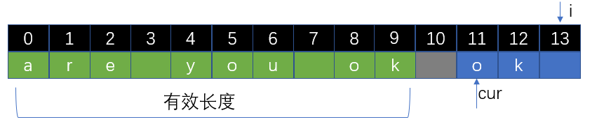

# 字符串

## 0901.字符串轮转

- 字符串轮转。给定两个字符串s1和s2，请编写代码检查s2是否为s1旋转而成（比如，waterbottle是erbottlewat旋转后的字符串）。

```java
示例1:

 输入：s1 = "waterbottle", s2 = "erbottlewat"
 输出：True
示例2:

 输入：s1 = "aa", "aba"
 输出：False
```

- 提示：
- 字符串长度在[0, 100000]范围内。
- 说明:你能只调用一次检查子串的方法吗？
- 思路


>- s1是原字符串，当s1和s1拼接后就包含了所有轮转字符串的情况
>- 只需要判断s2或s3或s4是否是s1+s1的子串即可


- 题解

```java
public class Solution0109 {
    public boolean isFlipedString(String s1, String s2) {
        if (s1.length() != s2.length()) return false;
        return (s1+s1).contains(s2);
    }
}
```

## 572.另一个数的子树

- 给定两个非空二叉树 s 和 t，检验 s 中是否包含和 t 具有相同结构和节点值的子树。s 的一个子树包括 s 的一个节点和这个节点的所有子孙。s 也可以看做它自身的一棵子树

- 示例 1：给定的树 s:

```java
   3
  / \
  4   5
 / \
1   2
```
- 给定的树 t：

```java
   4 
  / \
 1   2
```

- 返回 true，因为 t 与 s 的一个子树拥有相同的结构和节点值

- 示例 2：给定的树 s：

```java
     3
    / \
   4   5
  / \
 1   2
    /
   0  
```
- 给定的树 t：

```java
   4
  / \
 1   2
```

- 返回 false
- 思路：


>把两棵树都序列化，之后判断树 t 是否为数 s 的子串

- 题解

```java
public class Solution572 {
    public boolean isSubtree(TreeNode s, TreeNode t) {
        if (s == null || t == null) return false;
        return postSerialize(s).contains(postSerialize(t)); //序列化s数是否包含序列化t树
    }
    private String postSerialize(TreeNode root){
        StringBuilder builder = new StringBuilder();
        postSerialize(root,builder);
        return builder.toString();
    }
    private void postSerialize(TreeNode tree,StringBuilder builder){ //后序遍历序列化
        if (tree == null){ 
            builder.append("#!");
            return;
        }
        postSerialize(tree.left,builder);
        postSerialize(tree.right,builder);
        builder.append(tree.val).append("!");
    }
}
```

## 242.有效的字母异位词

- 给定两个字符串 s 和 t ，编写一个函数来判断 t 是否是 s 的字母异位词。

```java
示例 1:

输入: s = "anagram", t = "nagaram"
输出: true
示例 2:

输入: s = "rat", t = "car"
输出: false
```

- 说明:你可以假设字符串只包含小写字母。
- 进阶:如果输入字符串包含 unicode 字符怎么办？你能否调整你的解法来应对这种情况？
- 思路一：

>- 字母异位词：两个字符串中的每个字母出现的次数相同
>- 使用一个哈希表mapS记录字符串s中每个字母出现的次数，使用另一个哈希表mapT记录字符串t中每个字母出现的次数
>- 最后对比两张表中的数据是否相等

- 题解一：

```java
public class Solution242 {
    public boolean isAnagram(String s, String t) {
        if (s.length() != t.length()) return false;
        Map<Character,Integer> mapS = new HashMap<>();
        Map<Character,Integer> mapT = new HashMap<>();
        char[] charS = s.toCharArray();
        char[] charT = t.toCharArray();
        count(charS,mapS);
        count(charT,mapT);
        Set<Character> characters = mapS.keySet();
        for (Character character : characters) {
            if (!mapS.get(character).equals(mapT.get(character))) return false;
        }
        return true;
    }
    //将字符数组中对应字母出现的次数统计到map中
    private void count(char[] chars,Map<Character,Integer> map){
        for (char c : chars) {
            if (map.containsKey(c)) {
                map.put(c, map.get(c) + 1);
                continue;
            }
            map.put(c, 1);
        }
    }
}
```

- 思路二：根据题目说明，可以假设字符串全是小写字母

>- 根据ASCll码表得出 字符a  = 97; 
>- 字符 a 存放在数组索引 a - 'a' = 0中;
>- 字符 b 存放在数组索引 b - 'a' = 1中;

- 题解二：

```java
public class Solution242 {
    public boolean isAnagram(String s, String t) {
        char[] charS = s.toCharArray();
        char[] charT = t.toCharArray();
        if (charS.length != charT.length) return false;
        int[] counts = new int[26]; //最多是26个小写字母
        for (char c : charS) {
            counts[c - 'a']++;
        }
        for (char c : charT) {
            if (--counts[c - 'a'] < 0) return false;
        }
        return true;
    }
}
```

## 151.翻转字符串里的单词

- 给定一个字符串，逐个翻转字符串中的每个单词

```java
示例 1：

输入: "the sky is blue"
输出: "blue is sky the"
示例 2：

输入: "  hello world!  "
输出: "world! hello"
解释: 输入字符串可以在前面或者后面包含多余的空格，但是反转后的字符不能包括。
示例 3：

输入: "a good   example"
输出: "example good a"
解释: 如果两个单词间有多余的空格，将反转后单词间的空格减少到只含一个。
```

- 说明：

>- 无空格字符构成一个单词
>- 输入字符串可以在前面或者后面包含多余的空格，但是反转后的字符不能包括
>- 如果两个单词间有多余的空格，将反转后单词间的空格减少到只含一个

- 思路

1. **消除多余的空格：i指针遇到空格就跳过，遇到字符则填充到cur指针指向的位置**


2. **对有效的整体进行逆序**


3. **对指定范围内的字符进行逆序**


4. **最终效果**



- 题解

```java
public class Solution151 {
    public String reverseWords(String s) {
        char[] chars = s.toCharArray();
        int cur = 0;
        for (int i = 0; i < chars.length;) {
            if (chars[i] == ' ') { //若是空字符串直接跳过
                i++;
                continue;
            }
            while (i < chars.length && chars[i] != ' '){ //将遇到的非空字符串全部移动到cur指向的位置
                chars[cur++] = chars[i++];
            }
            if (cur < chars.length) chars[cur++] = ' '; //在cur位置放一个空串
        }
        if (cur - 1 < 0) return "";      //cur都没有移动必定为空串,如:""、" "、"   " 等情况
        
        int len = chars[cur - 1] == ' ' ? --cur : cur; //有效长度
        reversal(chars,0,len); //翻转[0,len)区间中的字符
        cur = -1;
        for (int i = 0; i < len; i++) {
            if (chars[i] == ' '){
                reversal(chars,cur+1,i);
                cur = i;
            }
        }
        reversal(chars,cur+1,len); //翻转最后一个单词
        return new String(chars,0,len); //截取有效部分生成字符串
    }

    private void reversal(char[] chars,int l,int r){
        --r;
        while (l < r){
            char temp = chars[l];
            chars[l++] = chars[r];
            chars[r--] = temp;
        }
    }
}
```

## 3.无重复字符的最长子串

- 给定一个字符串，请你找出其中不含有重复字符的 **最长子串** 的长度

```java
示例 1:

输入: "abcabcbb"
输出: 3 
解释: 因为无重复字符的最长子串是 "abc"，所以其长度为 3。
示例 2:

输入: "bbbbb"
输出: 1
解释: 因为无重复字符的最长子串是 "b"，所以其长度为 1。
示例 3:

输入: "pwwkew"
输出: 3
解释: 因为无重复字符的最长子串是 "wke"，所以其长度为 3。
     请注意，你的答案必须是 子串 的长度，"pwke" 是一个子序列，不是子串。
```

- 思路一：用集合

>- 从字符串最后往前遍历，依次加入到集合中
>- 获得以每个字符结尾的最长子串长度，最后取最大值

```java
public int lengthOfLongestSubstring(String s) {
    if (s == null || s.length() == 0) return 0;
    char[] chars = s.toCharArray();
    Set<Character> set = new HashSet<>();
    int[] result = new int[chars.length];

    for (int j = chars.length - 1; j >= 0; j--) {
        int count = 0;
        for (int i = j; i >= 0 ;i--) {
            if (set.contains(chars[i])) break; //若存在集合中说明重复了,找到了以该字符结尾的最大子串
            set.add(chars[i]);
            count++;
        }
        set.clear(); //一个新的集合进行新的判断
        result[j] = count;
    }
    Arrays.sort(result);
    return result[chars.length - 1];
}
```

- 思路二：用哈希表

# 练习

## 58.最后一个字符串的长度

- 给定一个仅包含大小写字母和空格 ' ' 的字符串 s，返回其最后一个单词的长度。如果字符串从左向右滚动显示，那么最后一个单词就是最后出现的单词
- 如果不存在最后一个单词，请返回 0 
- 说明：一个单词是指仅由字母组成、不包含任何空格字符的 最大子字符串
- 示例:

```java
输入: "Hello World"
输出: 5
```

- 思路


>- 先将字符串转化为字符数组，定义right和left两个指针
>- 从字符串数组的最后一个开始遍历，right指针一直移动到第一个遇到的非空格字符
>- 接着left直接从right所处位置开始移动，直到遇到第一个空格字符
>- 最终[left,right]所在区域大小就是最后一个字符串的大小

- 题解

```java
public class Solution58 {
    public int lengthOfLastWord(String s) {
        if (s == null || s.length() == 0) return 0;
        char[] chars = s.toCharArray();
        int right = chars.length - 1;
        while (right >= 0 && chars[right] == ' '){ //right指针遇到空格字符就右移
            right--;
        }
        int left = right;
        while (left >= 0 && chars[left] != ' '){ //left指针遇到非空格字符就右移
            left--;
        }
        return right - left;
    }
}
```

