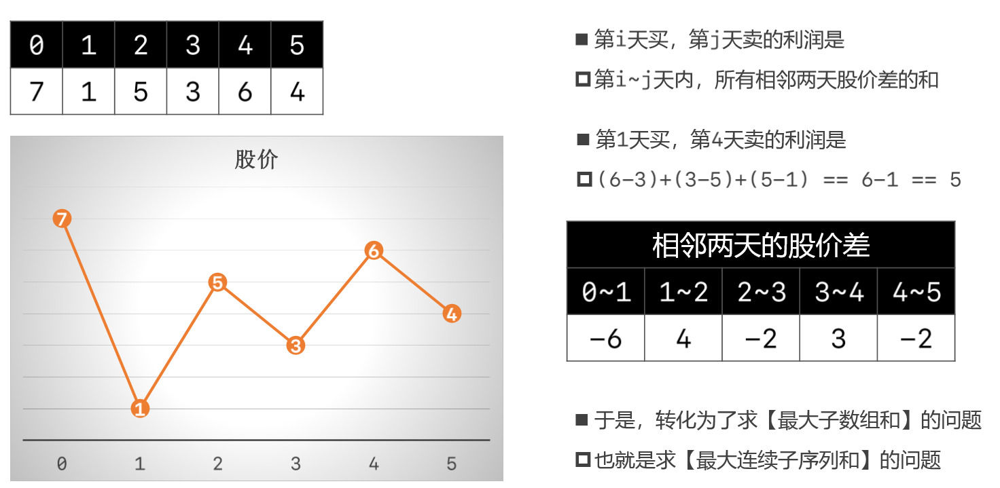
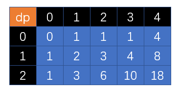

# 动态规划

## 47.礼物的最大值

- 在一个 m * n 的棋盘的每一格都放有一个礼物，每个礼物都有一定的价值（价值大于 0）。你可以从棋盘的左上角开始拿格子里的礼物，并每次向右或者向下移动一格、直到到达棋盘的右下角。给定一个棋盘及其上面的礼物的价值，请计算你最多能拿到多少价值的礼物？
- 示例 1:

```java
输入: 
[
  [1,3,1],
  [1,5,1],
  [4,2,1]
]
输出: 12
解释: 路径 1→3→5→2→1 可以拿到最多价值的礼物
```

- 提示：

>- `0 < grid.length <= 200`
>- `0 < grid[0].length <= 200`

- 思路


- 题解一：二维数组

```java
public class Solution47 {
    public int maxValue(int[][] grid) {
        int rows = grid.length; //行数
        int cols = grid[0].length; //列数
        int[][] dp = new int[rows][cols]; //动态规划二维数组
        dp[0][0] = grid[0][0]; //初始化第一行第一列的数据--------------------(特殊数据)
        for (int row = 1; row < rows; row++) { //初始化第一列的所有数据------(特殊数据)
            dp[row][0] = dp[row - 1][0] + grid[row][0];
        }
        for (int col = 1; col < cols; col++) { //初始化第一行的所有数据------(特殊数据)
            dp[0][col] = dp[0][col-1] + grid[0][col];
        }
        for (int row = 1; row < rows; row++) {
            for (int col = 1; col < cols; col++) {
                dp[row][col] = Math.max(dp[row - 1][col],dp[row][col - 1]) + grid[row][col];
            }
        }
        return dp[rows - 1][cols - 1];
    }
}
```

## 121.买卖股票的最佳时机

- 给定一个数组，它的第 i 个元素是一支给定股票第 i 天的价格
- 如果你最多只允许完成一笔交易（即买入和卖出一支股票一次），设计一个算法来计算你所能获取的最大利润
- 注意：你不能在买入股票前卖出股票

```java
示例 1:

输入: [7,1,5,3,6,4]
输出: 5
解释: 在第 2 天（股票价格 = 1）的时候买入，在第 5 天（股票价格 = 6）的时候卖出，最大利润 = 6-1 = 5 。
     注意利润不能是 7-1 = 6, 因为卖出价格需要大于买入价格；同时，你不能在买入前卖出股票。
//--------------------------------------------------------------------------------------------
示例 2:

输入: [7,6,4,3,1]
输出: 0
解释: 在这种情况下, 没有交易完成, 所以最大利润为 0。
```

- 思路：从卖的角度思考


>- 从第二天开始卖股票，指针i记录哪一天开始卖，指针minPrice记录在这之前的天数中哪一天买入股票所需的价格最低，指针max记录买卖的最大利润
>- 在卖的时候计算与买时候的差价，若大于之前得到的最大利润值则更新最大利润；若小于等于说明不能进行买卖，利润为负数，这时只需更新买入股票所需的最低价格
>- 把遍历的每一天都当成有可能要卖出去的当天

- 题解一：数组

```java
public class Solution121 {
    public int maxProfit(int[] prices) {
        if (prices.length == 0) return 0;
        int max = 0; //扫描过的最大利润
        int minPrice = prices[0]; //扫描过的最低价格
        for (int i = 1; i < prices.length; i++) { //把第i天的股票卖出
            int price = prices[i] - minPrice; //卖的钱 - 最低价格买入的钱 = 最大利润
            if (price <= 0){ //利润为负
                minPrice = prices[i]; //比之前买入的最低价格还要低,更新最低价格
            }else{
                max = Math.max(price, max); //利润为正则更新最大利润
            }
        }
        return max;
    }
}
```

- 思路二：



- 题解二：动态规划


## 72.编辑距离

- 给你两个单词 word1 和 word2，请你计算出将 word1 转换成 word2 所使用的最少操作数 
- 你可以对一个单词进行如下三种操作：

>- 插入一个字符
>- 删除一个字符
>- 替换一个字符

```java
示例 1：

输入：word1 = "horse", word2 = "ros"
输出：3
解释：
horse -> rorse (将 'h' 替换为 'r')
rorse -> rose (删除 'r')
rose -> ros (删除 'e')

//-------------------------------------------------
示例 2：

输入：word1 = "intention", word2 = "execution"
输出：5
解释：
intention -> inention (删除 't')
inention -> enention (将 'i' 替换为 'e')
enention -> exention (将 'n' 替换为 'x')
exention -> exection (将 'n' 替换为 'c')
exection -> execution (插入 'u')
```

- 思路


- 题解

```java
public class Solution72 {
    public int minDistance(String word1, String word2) {
        if (word1 == null || word2 == null) return 0;
        char[] charsOne = word1.toCharArray();
        char[] charsTwo = word2.toCharArray();
        int[][] dp = new int[charsOne.length + 1][charsTwo.length + 1];
        dp[0][0] = 0; 
        for (int row = 1; row < dp.length; row++) { //初始化每一行
            dp[row][0] = row;
        }
        for (int col = 1; col < dp[0].length; col++) { //初始化每一列
            dp[0][col] = col;
        }
        for (int row = 1; row < dp.length; row++) { //通过已知的行和列推导出未知的行和列
            for (int col = 1; col < dp[0].length; col++) {
                int top = dp[row - 1][col] + 1;
                int left = dp[row][col - 1] + 1;
                int leftTop = dp[row - 1][col - 1];
                if (charsOne[row - 1] != charsTwo[col - 1]){ //只有word1和word2最后一个字符相等的时候需要加1
                    leftTop++;
                }
                dp[row][col] = Math.min(Math.min(top,left),leftTop); //选择三种选择中所需次数最少的
            }
        }
        return dp[charsOne.length][charsTwo.length];
    }
}
```

## 5.最长回文子串

- 给定一个字符串 `s`，找到 `s` 中最长的回文子串。你可以假设 `s` 的最大长度为 1000

```java
示例 1：

输入: "babad"
输出: "bab"
注意: "aba" 也是一个有效答案。
    
//----------------------------------
示例 2：

输入: "cbbd"
输出: "bb"
```


# 练习

## 62.不同路径

- 一个机器人位于一个 m x n 网格的左上角 （起始点在下图中标记为“Start” ）
- 机器人每次只能向下或者向右移动一步。机器人试图达到网格的右下角（在下图中标记为“Finish”）
- 问总共有多少条不同的路径？

- 示例 1:

```java
输入: m = 3, n = 2
输出: 3
解释:
从左上角开始，总共有 3 条路径可以到达右下角。

1. 向右 -> 向右 -> 向下
2. 向右 -> 向下 -> 向右
3. 向下 -> 向右 -> 向右
```

- 示例 2:

```java
输入: m = 7, n = 3
输出: 28
```

- 思路



>- 从(0,0)处开始出发，一直往右走只有一种走法，一直往下走也只有一种走法
>- 走到(1,1)处可由(0,1)和(1,0)到达
>- 走到(2,2)处可由(2,1)和(1,2)到达
>- 结论：走到(x,y)处可由(x-1,y)和(x,y-1)到达

- 题解

```java
public class Solution62 {
    /**
     * @param m 总列数
     * @param n 总行数
     */
    public int uniquePaths(int m, int n) {
        if (m == 1 || n == 1) return 1;
        int[][] dp = new int[m][n];
        for (int col = 1; col < dp[0].length; col++) { //初始化第一行的所有列
            dp[0][col] = 1;
        }
        for (int row = 1; row < dp.length; row++) { //初始化第一列的所有行
            dp[row][0] = 1;
        }
        for (int row = 1; row < dp.length; row++) {
            for (int col = 1; col < dp[0].length; col++) {
                dp[row][col] = dp[row - 1][col] + dp[row][col - 1];
            }
        }
        return dp[m-1][n-1];
    }
}
```

## 70.爬楼梯

- 假设你正在爬楼梯。需要 n 阶你才能到达楼顶
- 每次你可以爬 1 或 2 个台阶。你有多少种不同的方法可以爬到楼顶呢？
- 注意：给定 n 是一个正整数

```java
示例 1：

输入： 2
输出： 2
解释： 有两种方法可以爬到楼顶

1.  1 阶 + 1 阶
2.  2 阶
    
//---------------------------
示例 2：

输入： 3
输出： 3
解释： 有三种方法可以爬到楼顶

1.  1 阶 + 1 阶 + 1 阶
2.  1 阶 + 2 阶
3.  2 阶 + 1 阶
```

- 思路


- 题解

```java
public class Solution70 {
    /**
     * @param n 有n阶梯子
     * @return 返回爬到楼顶的总方法数量
     */
    public int climbStairs(int n) {
        if (n <= 2) {
            return n;
        }
        //必然是2节阶梯以上
        int[] dp = new int[n + 1]; //不用dp[0],n+1取不到,dp[n]对应有n节台阶的方法
        dp[1] = 1;
        dp[2] = 2;
        for (int i = 3; i <= n; i++) {
            dp[i] = dp[i - 1] + dp[i - 2];
        }
        return dp[n];
    }
}
```

## 193.打家劫舍

- 你是一个专业的小偷，计划偷窃沿街的房屋。每间房内都藏有一定的现金，影响你偷窃的唯一制约因素就是相邻的房屋装有相互连通的防盗系统，如果两间相邻的房屋在同一晚上被小偷闯入，系统会自动报警
- 给定一个代表每个房屋存放金额的非负整数数组，计算你 不触动警报装置的情况下 ，一夜之内能够偷窃到的最高金额

```java
示例 1:

输入: [1,2,3,1]
输出: 4
解释: 偷窃 1 号房屋 (金额 = 1) ，然后偷窃 3 号房屋 (金额 = 3)
偷窃到的最高金额 = 1 + 3 = 4 
    
//------------------------------------------------------------    
示例 2:

输入: [2,7,9,3,1]
输出: 12
解释: 偷窃 1 号房屋 (金额 = 2), 偷窃 3 号房屋 (金额 = 9)，接着偷窃 5 号房屋 (金额 = 1)。
偷窃到的最高金额 = 2 + 9 + 1 = 12 。
```

- 思路


- 题解

```java
public class Solution198 {
    public int rob(int[] nums) {
        if (nums.length == 0) return 0;
        if (nums.length == 1) return nums[0];
        int[] dp = new int[nums.length];
        dp[0] = nums[0]; //如果只有一家
        dp[1] = Math.max(nums[0], nums[1]); //如果有两家
        for (int house = 2; house < nums.length; house++) { //如果有三家,要决定抢不抢第三家
            dp[house] = Math.max(dp[house - 2] + nums[house], dp[house - 1]);
        }
        return dp[nums.length - 1];
    }
}
```

## 322.零钱兑换

- 给定不同面额的硬币 coins 和一个总金额 amount。编写一个函数来计算可以凑成总金额所需的最少的硬币个数。如果没有任何一种硬币组合能组成总金额，返回 -1
- 示例一

```java
输入: coins = [1, 2, 5], amount = 11
输出: 3 
解释: 11 = 5 + 5 + 1
```

- 示例二

```java
输入: coins = [2], amount = 3
输出: -1
```

- 说明：你可以认为每种硬币的数量是无限的
- 思路：情况一


- 情况二


>- 若是退2块钱，等于dp[1]+1
>- 若是退5块钱，等于dp[4]+1或者是dp[0]+1
>- 若是退10块钱，等于dp[9]+1或者是dp[5]+1
>- 若是退25块钱，等于dp[19]+1或者是dp[20]+1或者是dp[5]+1
>- 若是退41块钱，等于dp[40]+1或者是dp[36]+1或者是dp[21]+1或者是dp[16]+1
>- 从dp[1]逐一推算到dp[n]，dp[n]就是n元钱所需硬币的最优解

- 题解：动态规划

```java
public class Solution322 {
    public int coinChange(int[] coins, int amount) {
        if (coins == null || coins.length == 0) return -1;
        int[] dp = new int[amount + 1]; //dp[n]定义为需要退n元钱所需的最少硬币数量
        for (int money = 1; money <= amount; money++) { //退1块钱需要?枚硬币,退2块钱需要?枚硬币......
            int minAmount = Integer.MAX_VALUE;
            for (int coin : coins) { 
                if (money < coin) continue; 
                int preNumber = dp[money - coin];
                if (preNumber < 0 || preNumber >= minAmount) continue;// 需要退的钱小,硬币面值大
                minAmount = preNumber;
            }
            if (minAmount == Integer.MAX_VALUE){
                dp[money] = -1;
            }else {
                dp[money] = minAmount + 1;
            }
        }
        return dp[amount];
    }
}
```

