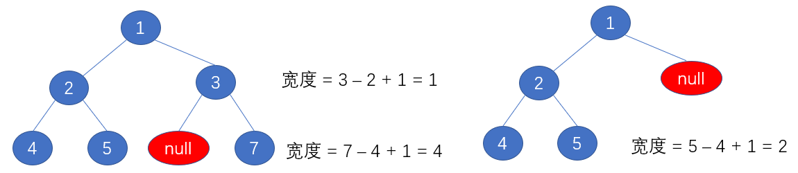

# 二叉树


>- 前序遍历：在未调用1.left函数和1.right函数的时候就访问数据
>- 中序遍历：等到1.left函数弹出后就访问数据
>- 后序遍历：等到1.left函数和1.right函数都弹出后就访问数据

## 144.二叉树的前序遍历

- 给定一个二叉树，返回它的前序遍历

- 示例:

```java
输入: [1,null,2,3]  
   1
    \
     2
    /
   3 

输出: [1,2,3]
```

- **进阶:** 递归算法很简单，你可以通过迭代算法完成吗？
- 题解一：递归

```java
public class Solution144 {
    List<Integer> list = new ArrayList<>();

    public List<Integer> preorderTraversal(TreeNode root) {
        if (root == null) return list;
        preorderTraversal(root, list);
        return list;
    }

    public void preorderTraversal(TreeNode root, List<Integer> list) {
        if (root == null) return;
        list.add(root.val);
        preorderTraversal(root.left, list);
        preorderTraversal(root.right, list);
    }
}
```

- 思路二：用栈迭代


>- 越先入栈的越后访问
>- 先将右结点入栈再将左结点入栈，左结点必然先被访问

- 题解二：

```java
public class Solution144 {
    List<Integer> list = new ArrayList<>();

    public List<Integer> preorderTraversal(TreeNode root) {
        if (root == null) return list;
        Stack<TreeNode> stack = new Stack<>();
        stack.push(root);
        while (!stack.isEmpty()) {
            TreeNode node = stack.pop();
            list.add(node.val);
            if (node.right != null) stack.push(node.right);
            if (node.left != null) stack.push(node.left);
        }
        return list;
    }
}
```

## 92.二叉树的中序遍历

- 给定一个二叉树，返回它的中序 遍历

- 示例:

```java
输入: [1,null,2,3]
   1
    \
     2
    /
   3
输出: [1,3,2]      
```

- **进阶:** 递归算法很简单，你可以通过迭代算法完成吗？
- 题解一：递归

```java
public class Solution94 {
    List<Integer> list = new ArrayList<>();

    public List<Integer> inorderTraversal(TreeNode root) {
        if (root == null) return list;
        inorderTraversal(root, list);
        return list;
    }

    public void inorderTraversal(TreeNode root, List<Integer> list) {
        if (root == null) return;
        inorderTraversal(root.left, list);
        list.add(root.val);
        inorderTraversal(root.right, list);
    }
}
```

- 题解二：用栈迭代


```java
public class Solution94 {
    List<Integer> list = new ArrayList<>();

    public List<Integer> inorderTraversal(TreeNode root) {
        if (root == null) return list;
        Stack<TreeNode> stack = new Stack<>();
        TreeNode node = root;
        while (true) {
            if (node != null) { //先将左子树全部入栈
                stack.push(node);
                node = node.left;
            } else if (stack.isEmpty()) { //在弹出前要确保栈不为空
                return list;
            } else {
                node = stack.pop(); //从最底层的左子树结点一一弹出
                list.add(node.val);
                node = node.right;
            }
        }
    }
}
```

## 145.二叉树的后序遍历

- 给定一个二叉树，返回它的后序遍历。

- 示例:

```java
输入: [1,null,2,3]  
   1
    \
     2
    /
   3 

输出: [3,2,1]
```

- **进阶:** 递归算法很简单，你可以通过迭代算法完成吗？
- 题解一：递归

```java
public class Solution145 {
    List<Integer> list = new ArrayList<>();

    public List<Integer> postorderTraversal(TreeNode root) {
        if (root == null) return list;
        postorderTraversal(root, list);
        return list;
    }

    public void postorderTraversal(TreeNode root, List<Integer> list) {
        if (root == null) return;
        postorderTraversal(root.left, list);
        postorderTraversal(root.right, list);
        list.add(root.val);
    }
}
```

- 题解二：用栈迭代


```java
public class Solution145 {
    public List<Integer> postorderTraversal(TreeNode root) {
        LinkedList<Integer> list = new LinkedList<>(); //保存最访问数据的双向列表
        LinkedList<TreeNode> stack = new LinkedList<>(); //双端栈
        if (root == null) return list;
        stack.add(root);
        while (!stack.isEmpty()){
            TreeNode node = stack.pollLast(); //栈中最后一个node出栈
            list.addFirst(node.val); //将value值插入到列表第一个,头插法
            if (node.left != null){
                stack.add(node.left);
            }
            if (node.right != null){
                stack.add(node.right);
            }
        }
        return list;
    }
}
```

## 102.二叉树的层序遍历

- 给你一个二叉树，请你返回其按 层序遍历 得到的节点值。 （即逐层地，从左到右访问所有节点）
-  示例：二叉树：[3,9,20,null,null,15,7]

```java
    3
   / \
  9  20
    /  \
   15   7
```

- 返回其层次遍历结果：

```java
[
  [3],
  [9,20],
  [15,7]
]
```

- 思路：利用队列先进先出的特点


>- 当前结点出队后它的左右结点入队
>- 用一个size来记录每一层的结点数量，遍历完一层后就更新size的大小

- 题解

```java
import java.util.ArrayList;
import java.util.LinkedList;
import java.util.List;
import java.util.Queue;

public class Solution102 {
    List<Integer> integerList = new ArrayList<>();
    List<List<Integer>> lists = new ArrayList<>();

    public List<List<Integer>> levelOrder(TreeNode root) {
        if (root == null) return lists;
        Queue<TreeNode> queue = new LinkedList<>();
        queue.offer(root);
        int size = 1; //当前对列中的元素,也是当前层结点的个数
        while (!queue.isEmpty()) {
            TreeNode node = queue.poll();
            integerList.add(node.val);
            size--; 
            if (node.left != null) queue.offer(node.left);
            if (node.right != null) queue.offer(node.right);

            if (size == 0) { //某一层遍历结束
                size = queue.size(); //下一层的结点个数
                lists.add(integerList);
                integerList = new ArrayList<>(); //重新创建一个新的集合
            }
        }
        return lists;
    }
}
```

## 104.二叉树的最大深度

- 给定一个二叉树，找出其最大深度
- 二叉树的深度为根节点到最远叶子节点的最长路径上的节点数
- 说明: 叶子节点是指没有子节点的节点
- 示例：给定二叉树 [3,9,20,null,null,15,7]

```java
    3
   / \
  9  20
    /  \
   15   7
```

- 返回它的最大深度3
- 思路一：迭代

>借助层序遍历的思想，每遍历完一层二叉树的高度加一

- 题解一

```java
import java.util.LinkedList;
import java.util.Queue;

public class Solution104 {
    public int maxDepth(TreeNode root) {
        if (root == null) return 0;
        Queue<TreeNode> queue = new LinkedList<>();
        queue.offer(root);
        int height = 0; //初始高度
        int size = 1; //当前层的结点数量
        while (!queue.isEmpty()) {
            TreeNode node = queue.poll();
            size--;
            if (node.left != null) queue.offer(node.left);
            if (node.right != null) queue.offer(node.right);
            if (size == 0) { //每遍历完一层二叉树的高度+1
                size = queue.size();
                height++;
            }
        }
        return height;
    }
}
```

---

- 思路二：递归


- 题解二

```java
public class Solution104 {
    public int maxDepth(TreeNode root) {
        if (root == null) return 0;
        if (root.left == null && root.right == null) return 1; //情况一
        if (root.left == null) return maxDepth(root.right) + 1; //情况二
        if (root.right == null) return maxDepth(root.left) + 1; //情况二
        return Math.max(maxDepth(root.left), maxDepth(root.right)) + 1; //情况三
    }
}
```

## 110.平衡二叉树

- 给定一个二叉树，判断它是否是高度平衡的二叉树
- 本题中，一棵高度平衡二叉树定义为：
- 一个二叉树每个节点 的左右两个子树的高度差的绝对值不超过1
- 示例 1:给定二叉树 [3,9,20,null,null,15,7]

```java
    3
   / \
  9  20
    /  \
   15   7
```

- 返回 true
- 思路：递归判断


- 题解

```java
public class Solution110 {
    public boolean isBalanced(TreeNode root) {
        if (root == null) return true;
        return Math.abs(height(root.left) - height(root.right)) < 2 //平衡因子是否小于2
                && isBalanced(root.left) //若node结点是平衡的就接着判断它的子结点
                && isBalanced(root.right);
    }

    private int height(TreeNode root) {
        if (root == null) return 0;
        return Math.max(height(root.left), height(root.right)) + 1; //当前结点的高度
    }
}
```

## 1161.最大层内元素和

- 给你一个二叉树的根节点 root。设根节点位于二叉树的第 1 层，而根节点的子节点位于第 2 层，依此类推。

  请你找出层内元素之和 最大 的那几层（可能只有一层）的层号，并返回其中 最小 的那个

- 示例：

```java
输入：[1,7,0,7,-8,null,null]
输出：2
解释：
第 1 层各元素之和为 1，
第 2 层各元素之和为 7 + 0 = 7，
第 3 层各元素之和为 7 + -8 = -1，
所以我们返回第 2 层的层号，它的层内元素之和最大
```

- 提示：

>1. 树中的节点数介于 `1` 和 `10^4` 之间
>2. `-10^5 <= node.val <= 10^5`

- 思路

>- 使用对列数据结构，利用层序遍历的思想
>- 需要记录当前层的结点和和所遍历过的某一层的最大结点和
>- 因为可能有多层的最大结点和都相同，而需要返回的是其中相同层的最小层，即2,3,4层都是最大的，返回第2层
>- 所以在判断当前层和最大层的大小时，要去除等于的条件

- 题解

```java
public class Solution1161 {
    public int maxLevelSum(TreeNode root) {
        if (root == null) return 0;
        Queue<TreeNode> queue = new LinkedList<>();
        queue.offer(root);
        int size = 1; //每一层的结点个数
        int maxSum = 0; //最大层的和
        int curSum = 0; //当前层的和
        int curLevel = 1; //整个二叉树的总层数
        int maxLevel = 0; //和最大的层数
        while (!queue.isEmpty()) {
            TreeNode node = queue.poll();
            curSum += node.val; //当前层的和
            size--;
            if (node.left != null) queue.offer(node.left);
            if (node.right != null) queue.offer(node.right);
            if (size == 0) { //当前层遍历结束
                size = queue.size();
                if (curSum > maxSum) {
                    maxSum = curSum; //更新最大层的和
                    maxLevel = curLevel; //最大层的层数
                }
                curLevel++; //遍历下一层
                curSum = 0; //记录下一层的和
            }
        }
        return maxLevel;
    }
}
```

## 662.二叉树最大宽度

- 给定一个二叉树，编写一个函数来获取这个树的最大宽度。树的宽度是所有层中的最大宽度。这个二叉树与满二叉树（full binary tree）结构相同，但一些节点为空
- 每一层的宽度被定义为两个端点（该层最左和最右的非空节点，两端点间的null节点也计入长度）之间的长度
- 示例一

```java
输入:
      1
    /   \
   3     2
  / \     \  
 5   3     9 
输出: 4
解释: 最大值出现在树的第 3 层，宽度为 4 (5,3,null,9)
```

- 示例二

```
输入: 

    1
   /  
  3    
 / \       
5   3     

输出: 2
解释: 最大值出现在树的第 3 层，宽度为 2 (5,3)
```

- 示例三

```java
输入: 

    1
   / \
  3   2 
 /        
5      

输出: 2
解释: 最大值出现在树的第 2 层，宽度为 2 (3,2)。
```

- 示例四

```java
输入: 

      1
     / \
    3   2
   /     \  
  5       9 
 /         \
6           7
输出: 8
解释: 最大值出现在树的第 4 层，宽度为 8 (6,null,null,null,null,null,null,7)
```

- 思路



>- 对二叉树进行层序遍历并标号，将第一个根节点标注为1，那么它的左子结点 = 1 * 2，它的右子结点 = 1 * 2 + 1，其他结点的子结点亦是如此
>- 若不为空我们就进行标号，最终当前层的宽度就 = (当前层的最后一个结点标号 - 第一个结点的标号 + 1)

- 题解

```java
import java.util.LinkedList;
import java.util.Queue;

public class Solution662 {
    public int widthOfBinaryTree(TreeNode root) {
        if (root == null) return 0;
        Queue<TreeNode> queue = new LinkedList<>();
        LinkedList<Integer> linkedList = new LinkedList<>();
        queue.offer(root);
        int size = 1; //每一层的结点个数
        int index = 1; //根节点标号
        int width = 1; //二叉树的最大宽度
        linkedList.addFirst(index);
        while (!queue.isEmpty()) {
            TreeNode node = queue.poll();
            size--;
            index = linkedList.removeFirst(); //得到当前出队结点对应的标号
            if (node.left != null) {
                queue.offer(node.left);
                linkedList.add(index * 2); //给当前入队结点添加对应的标号
            }
            if (node.right != null) {
                queue.offer(node.right);
                linkedList.add(index * 2 + 1);
            }
            if (size == 0) { //遍历完一层就可以计算出该层的宽度了
                size = queue.size();
                if (linkedList.size() >= 2) { //当前层宽度至少为2
                    width = Math.max(width, linkedList.getLast() - linkedList.getFirst() + 1);//当前遍历到的最大宽度
                }
            }
        }
        return width;
    }
}
```

## 101.对称的二叉树

- 请实现一个函数，用来判断一棵二叉树是不是对称的。如果一棵二叉树和它的镜像一样，那么它是对称的
- 例如，二叉树 [1,2,2,3,4,4,3] 是对称的

```java
    1
   / \
  2   2
 / \ / \
3  4 4  3
```

- 但是下面这个 [1,2,2,null,3,null,3] 则不是镜像对称的:

```java
    1
   / \
  2   2
   \   \
   3    3
```

- 示例一

```java
输入：root = [1,2,2,3,4,4,3]
输出：true
```

- 示例二

```java
输入：root = [1,2,2,null,3,null,3]
输出：false
```

- 限制：0 <= 节点个数 <= 1000
- 思路一：使用递归
- 题解一

```java
public class Solution101 {
    public boolean isSymmetric(TreeNode root) {
        if (root == null) return true;
        return symmetric(root.left, root.right);
    }

    private boolean symmetric(TreeNode leftTree, TreeNode rightTree) {
        if (leftTree == null && rightTree == null) return true;
        if (leftTree == null || rightTree == null || leftTree.val != rightTree.val) return false;
        return symmetric(leftTree.left, rightTree.right) && symmetric(leftTree.right, rightTree.left);
    }
}
```

## 226.二叉树的镜像

- 请完成一个函数，输入一个二叉树，该函数输出它的镜像
- 例如输入：

```java
     4
   /   \
  2     7
 / \   / \
1   3 6   9
```

- 镜像输出

```java
     4
   /   \
  7     2
 / \   / \
9   6 3   1
```

- 示例一

```java
输入：root = [4,2,7,1,3,6,9]
输出：[4,7,2,9,6,3,1]
```

- 限制：0 <= 节点个数 <= 1000
- 思路一：使用递归将二叉树翻转过来


- 题解一

```java
public class Solution226 {
    public TreeNode mirrorTree(TreeNode root) {
        if (root == null) return null;
        mirror(root);
        return root;
    }

    public void mirror(TreeNode root) {
        if (root == null) return;
        TreeNode temp = root.left;
        root.left = root.right;
        root.right = temp; //交换成功
        mirror(root.left);
        mirror(root.right);
    }
}
```

---

- 思路二：使用栈(没有递归方法效率高)

- 题解二

```java
import java.util.Stack;

public class Solution226 {
    public TreeNode mirrorTree(TreeNode root) {
        if (root == null) return null;
        Stack<TreeNode> stack = new Stack<>();
        stack.add(root);
        while (!stack.isEmpty()) {
            TreeNode node = stack.pop();
            if (node.left != null) stack.add(node.left); //先进后出
            if (node.right != null) stack.add(node.right); //后进先出
            TreeNode temp = node.left; //交换结点位置
            node.left = node.right;
            node.right = temp;
        }
        return root;
    }
}
```

## 21.合并两个排序的链表

- 输入两个递增排序的链表，合并这两个链表并使新链表中的节点仍然是递增排序的。
- 示例

```java
输入：1->2->4, 1->3->4
输出：1->1->2->3->4->4
```

- 限制：0 <= 链表长度 <= 1000

```java
public class Solution21 {
    public ListNode mergeTwoLists(ListNode l1, ListNode l2) {
        ListNode dummy = new ListNode(0); //虚拟头结点
        ListNode tail = dummy;
        while (l1 != null || l2 != null) {
            if (l1 == null) {
                tail.next = l2;
                l2 = l2.next;
            } else if (l2 == null) {
                tail.next = l1;
                l1 = l1.next;
            } else if (l1.val <= l2.val) {
                tail.next = l1;
                l1 = l1.next;
            } else {
                tail.next = l2;
                l2 = l2.next;
            }
            tail = tail.next;
        }
        return dummy.next;
    }
}
```

## 54.二叉树中第K大结点

- 给定一棵二叉搜索树，请找出其中第k大的节点
- 示例一

```java
输入: root = [3,1,4,null,2], k = 1
   3
  / \
 1   4
  \
   2
输出: 4
```

- 示例二

```java
输入: root = [5,3,6,2,4,null,null,1], k = 3
       5
      / \
     3   6
    / \
   2   4
  /
 1
输出: 4
```

- 限制：1 ≤ k ≤ 二叉搜索树元素个数
- 思路

>- 用一个队列层序遍历二叉树
>- 用一个优先级队列装载遍历到的二叉树值
>- 优先级队列的本质是堆，我们创建大顶堆的优先级队列，返回第k大的元素就出队k次

- 题解

```java
import java.util.PriorityQueue;
import java.util.Queue;
import java.util.concurrent.LinkedBlockingQueue;

public class Solution54 {
    public int kthLargest(TreeNode root, int k) {
        //系统默认是小顶堆,所以要传入一个比较器来更改设置为大顶堆
        PriorityQueue<Integer> queue = new PriorityQueue<>((t1, t2) -> t2 - t1);
        Queue<TreeNode> nodeQueue = new LinkedBlockingQueue<>();
        nodeQueue.offer(root);
        int size = 1;
        while (!nodeQueue.isEmpty()) {
            TreeNode node = nodeQueue.poll();
            queue.offer(node.val);
            size--;
            if (node.left != null) nodeQueue.offer(node.left);
            if (node.right != null) nodeQueue.offer(node.right);
            if (size == 0) size = nodeQueue.size();
        }
        while (k > 1) { //将k-1个元素出队
            queue.remove();
            k--;
        }
        return queue.remove(); //将第k个元素出队
    }
}
```

## 100.相同的树

- 给定两个二叉树，编写一个函数来检验它们是否相同
- 如果两个树在结构上相同，并且节点具有相同的值，则认为它们是相同的
- 示例一

```java
输入:       1         1
          / \       / \
         2   3     2   3

        [1,2,3],   [1,2,3]

输出: true
```

- 示例二

```java
输入:      1          1
          /           \
         2             2

        [1,2],     [1,null,2]

输出: false
```

- 示例三

```java
输入:       1         1
          / \       / \
         2   1     1   2

        [1,2,1],   [1,1,2]

输出: false
```

- 思路：利用前序遍历的递归思想


- 题解

```java
public class Solution100 {
    public boolean isSameTree(TreeNode p, TreeNode q) {
        //p 和 q 都是空结点
        if (p == null && q == null) return true;
        //p 和 q 其中一个结点是空结点
        if (p == null || q == null) return false;
        if (p.val != q.val) return false;
        //先序遍历的思路：根->左->右
        return isSameTree(p.left,q.left) && isSameTree(p.right,q.right);
    }
}
```

## 111.二叉树的最小深度

- 给定一个二叉树，找出其最小深度
- 最小深度是从根节点到最近叶子节点的最短路径上的节点数量
- 说明: 叶子节点是指没有子节点的节点
- 示例

```java
给定二叉树 [3,9,20,null,null,15,7]
   3
   / \
  9  20
    /  \
   15   7
返回它的最小深度 2
```

- 思路：这道题的关键是搞清楚递归结束条件


>- 叶子节点的定义是左孩子和右孩子都为 null 时叫做叶子节点
>- 当 root 节点左右孩子都为空时，返回 1
>- 当 root 节点左右孩子有一个为空时，返回不为空的孩子节点的深度
>- 当 root 节点左右孩子都不为空时，返回左右孩子较小深度的节点值

- 题解一：

```java
public class Solution111 {
    public int minDepth(TreeNode root) {
        if (root == null) return 0;
        //这道题递归条件里分为三种情况
        //1.左孩子和右孩子都为空的情况，说明到达了叶子节点，直接返回1即可
        if (root.left == null && root.right == null) return 1;
        //2.如果左孩子和右孩子其中一个为空，那么需要返回比较大的那个孩子的深度
        int leftHeight = minDepth(root.left);
        int rightHeight = minDepth(root.right);
        //这里其中一个节点为空，说明m1和m2有一个必然为0，所以可以返回m1 + m2 + 1;
        if (root.left == null || root.right == null) return leftHeight + rightHeight + 1;

        //3.最后一种情况，也就是左右孩子都不为空，返回最小深度+1即可
        return Math.min(leftHeight, rightHeight) + 1;
    }
}
```

- 代码简化

```java
public class Solution111 {
    public int minDepth(TreeNode root) {
        if (root == null) return 0;
        if (root.left == null && root.right == null) return 1; //情况一
        if (root.left == null) return minDepth(root.right) + 1; //情况二
        if (root.right == null) return minDepth(root.left) + 1; //情况二
        return Math.min(minDepth(root.left), minDepth(root.right)) + 1; //情况三
    }
}
```

## 107.二叉树的层序遍历II

- 给定一个二叉树，返回其节点值自底向上的层次遍历（即按从叶子节点所在层到根节点所在的层，逐层从左向右遍历）
- 示例

```java
给定二叉树 [3,9,20,null,null,15,7]
    3
   / \
  9  20
    /  \
   15   7
```

- 返回其自底向上的层次遍历为：

```java
[
  [15,7],
  [9,20],
  [3]
]
```

- 思路：使用双链表

>- 每次添加子集合的时候都使用头插法，这样最先添加的子集合会在链表最后

- 题解

```java
import java.util.ArrayList;
import java.util.LinkedList;
import java.util.List;
import java.util.Queue;

public class Solution107 {
    public List<List<Integer>> levelOrderBottom(TreeNode root) {
        Queue<TreeNode> queue = new LinkedList<>();
        LinkedList<List<Integer>> res = new LinkedList<>();
        List<Integer> temp = new ArrayList<>();
        if (root == null) return res;
        queue.offer(root);
        int size = 1;
        while (!queue.isEmpty()) {
            TreeNode node = queue.poll();
            size--;
            temp.add(node.val);
            if (node.left != null) queue.offer(node.left);
            if (node.right != null) queue.offer(node.right);
            if (size == 0) {
                size = queue.size();
                res.addFirst(temp); //头插法,最开始插入的在链表的最后
                temp = new ArrayList<>();
            }
        }
        return res;
    }
}
```

## 108.将有序数组转化为二叉搜索树

- 将一个按照升序排列的有序数组，转换为一棵高度平衡二叉搜索树
- 本题中，一个高度平衡二叉树是指一个二叉树每个节点的左右两个子树的高度差的绝对值不超过 1
- 示例一

```java
给定有序数组: [-10,-3,0,5,9],

一个可能的答案是：[0,-3,9,-10,null,5]，它可以表示下面这个高度平衡二叉搜索树：

      0
     / \
   -3   9
   /   /
 -10  5
```

- 思路：本质是把有序数组看做是中序遍历的结果安装中序遍历的规则重构二叉树


- 题解

```java
public class Solution108 {
    public TreeNode sortedArrayToBST(int[] nums) {
        if (nums.length == 0) return null;
        return sortedArrayToBST(nums, 0, nums.length); //左闭右开
    }

    private TreeNode sortedArrayToBST(int[] nums, int left, int right) {
        if (left >= right) return null;
        int mid = (left + right) >>> 1; //无符号右移
        TreeNode node = new TreeNode(nums[mid]);
        node.left = sortedArrayToBST(nums, left, mid);
        node.right = sortedArrayToBST(nums, mid + 1, right);
        return node;
    }
}
```