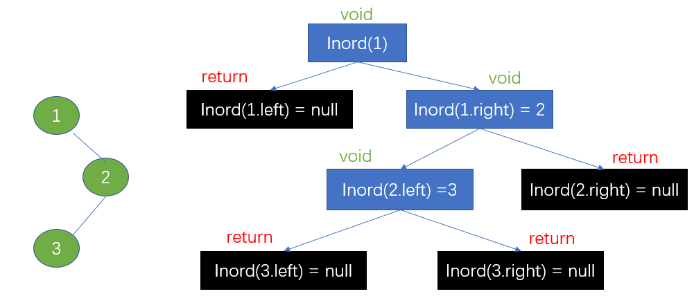
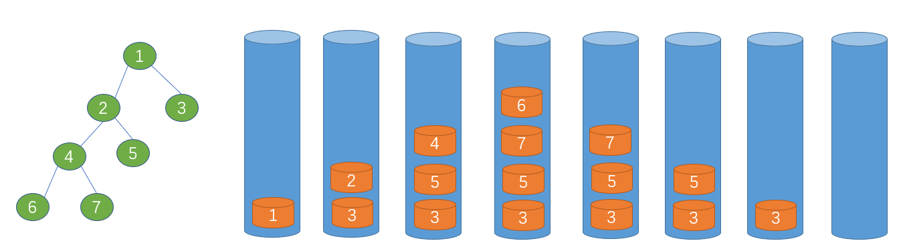
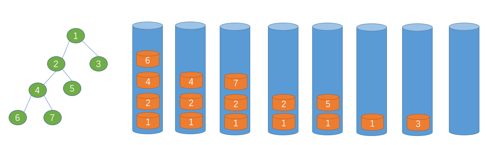
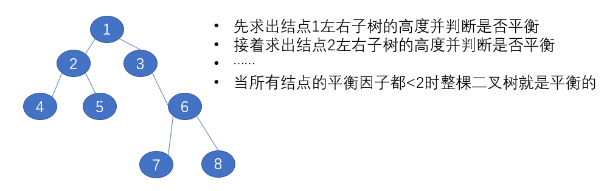

# 二叉树



>- 前序遍历：在未调用1.left函数和1.right函数的时候就访问数据
>- 中序遍历：等到1.left函数弹出后就访问数据
>- 后序遍历：等到1.left函数和1.right函数都弹出后就访问数据

## 144.二叉树的前序遍历

- 给定一个二叉树，返回它的前序遍历

- 示例:

```java
输入: [1,null,2,3]  
   1
    \
     2
    /
   3 

输出: [1,2,3]
```

- **进阶:** 递归算法很简单，你可以通过迭代算法完成吗？
- 题解一：递归

```java
public class Solution144 {
    List<Integer> list = new ArrayList<>();

    public List<Integer> preorderTraversal(TreeNode root) {
        if (root == null) return list;
        preorderTraversal(root, list);
        return list;
    }

    public void preorderTraversal(TreeNode root, List<Integer> list) {
        if (root == null) return;
        list.add(root.val);
        preorderTraversal(root.left, list);
        preorderTraversal(root.right, list);
    }
}
```

- 思路二：用栈迭代



>- 越先入栈的越后访问
>- 先将右结点入栈再将左结点入栈，左结点必然先被访问

- 题解二：

```java
public class Solution144 {
    List<Integer> list = new ArrayList<>();

    public List<Integer> preorderTraversal(TreeNode root) {
        if (root == null) return list;
        Stack<TreeNode> stack = new Stack<>();
        stack.push(root);
        while (!stack.isEmpty()) {
            TreeNode node = stack.pop();
            list.add(node.val);
            if (node.right != null) stack.push(node.right);
            if (node.left != null) stack.push(node.left);
        }
        return list;
    }
}
```

## 92.二叉树的中序遍历

- 给定一个二叉树，返回它的中序 遍历

- 示例:

```java
输入: [1,null,2,3]
   1
    \
     2
    /
   3
输出: [1,3,2]      
```

- **进阶:** 递归算法很简单，你可以通过迭代算法完成吗？
- 题解一：递归

```java
public class Solution94 {
    List<Integer> list = new ArrayList<>();

    public List<Integer> inorderTraversal(TreeNode root) {
        if (root == null) return list;
        inorderTraversal(root, list);
        return list;
    }

    public void inorderTraversal(TreeNode root, List<Integer> list) {
        if (root == null) return;
        inorderTraversal(root.left, list);
        list.add(root.val);
        inorderTraversal(root.right, list);
    }
}
```

- 题解二：用栈迭代



```java
public class Solution94 {
    List<Integer> list = new ArrayList<>();

    public List<Integer> inorderTraversal(TreeNode root) {
        if (root == null) return list;
        Stack<TreeNode> stack = new Stack<>();
        TreeNode node = root;
        while (true) {
            if (node != null) { //先将左子树全部入栈
                stack.push(node);
                node = node.left;
            } else if (stack.isEmpty()) { //在弹出前要确保栈不为空
                return list;
            } else {
                node = stack.pop(); //从最底层的左子树结点一一弹出
                list.add(node.val);
                node = node.right;
            }
        }
    }
}
```

## 145.二叉树的后序遍历

- 给定一个二叉树，返回它的后序遍历。

- 示例:

```java
输入: [1,null,2,3]  
   1
    \
     2
    /
   3 

输出: [3,2,1]
```

- **进阶:** 递归算法很简单，你可以通过迭代算法完成吗？
- 题解一：递归

```java
public class Solution145 {
    List<Integer> list = new ArrayList<>();

    public List<Integer> postorderTraversal(TreeNode root) {
        if (root == null) return list;
        postorderTraversal(root, list);
        return list;
    }

    public void postorderTraversal(TreeNode root, List<Integer> list) {
        if (root == null) return;
        postorderTraversal(root.left, list);
        postorderTraversal(root.right, list);
        list.add(root.val);
    }
}
```

- 题解二：用栈迭代


```java
public class Solution145 {
    public List<Integer> postorderTraversal(TreeNode root) {
        LinkedList<Integer> list = new LinkedList<>(); //保存最访问数据的双向列表
        LinkedList<TreeNode> stack = new LinkedList<>(); //双端栈
        if (root == null) return list;
        stack.add(root);
        while (!stack.isEmpty()){
            TreeNode node = stack.pollLast(); //栈中最后一个node出栈
            list.addFirst(node.val); //将value值插入到列表第一个,头插法
            if (node.left != null){
                stack.add(node.left);
            }
            if (node.right != null){
                stack.add(node.right);
            }
        }
        return list;
    }
}
```

## 102.二叉树的层序遍历

- 给你一个二叉树，请你返回其按 层序遍历 得到的节点值。 （即逐层地，从左到右访问所有节点）
-  示例：二叉树：[3,9,20,null,null,15,7]

```java
    3
   / \
  9  20
    /  \
   15   7
```

- 返回其层次遍历结果：

```java
[
  [3],
  [9,20],
  [15,7]
]
```

- 思路：利用队列先进先出的特点


>- 当前结点出队后它的左右结点入队
>- 用一个size来记录每一层的结点数量，遍历完一层后就更新size的大小

- 题解

```java
import java.util.ArrayList;
import java.util.LinkedList;
import java.util.List;
import java.util.Queue;

public class Solution102 {
    List<Integer> integerList = new ArrayList<>();
    List<List<Integer>> lists = new ArrayList<>();

    public List<List<Integer>> levelOrder(TreeNode root) {
        if (root == null) return lists;
        Queue<TreeNode> queue = new LinkedList<>();
        queue.offer(root);
        int size = 1; //当前对列中的元素,也是当前层结点的个数
        while (!queue.isEmpty()) {
            TreeNode node = queue.poll();
            integerList.add(node.val);
            size--; 
            if (node.left != null) queue.offer(node.left);
            if (node.right != null) queue.offer(node.right);

            if (size == 0) { //某一层遍历结束
                size = queue.size(); //下一层的结点个数
                lists.add(integerList);
                integerList = new ArrayList<>(); //重新创建一个新的集合
            }
        }
        return lists;
    }
}
```

## 104.二叉树的最大深度

- 给定一个二叉树，找出其最大深度
- 二叉树的深度为根节点到最远叶子节点的最长路径上的节点数
- 说明: 叶子节点是指没有子节点的节点
- 示例：给定二叉树 [3,9,20,null,null,15,7]

```java
    3
   / \
  9  20
    /  \
   15   7
```

- 返回它的最大深度3
- 思路

>借助层序遍历的思想，每遍历完一层二叉树的高度加一

- 题解

```java
import java.util.LinkedList;
import java.util.Queue;

public class Solution104 {
    public int maxDepth(TreeNode root) {
        if (root == null) return 0;
        Queue<TreeNode> queue = new LinkedList<>();
        queue.offer(root);
        int height = 0; //初始高度
        int size = 1; //当前层的结点数量
        while (!queue.isEmpty()) {
            TreeNode node = queue.poll();
            size--;
            if (node.left != null) queue.offer(node.left);
            if (node.right != null) queue.offer(node.right);
            if (size == 0) { //每遍历完一层二叉树的高度+1
                size = queue.size();
                height++;
            }
        }
        return height;
    }
}
```

## 110.平衡二叉树

- 给定一个二叉树，判断它是否是高度平衡的二叉树
- 本题中，一棵高度平衡二叉树定义为：
- 一个二叉树每个节点 的左右两个子树的高度差的绝对值不超过1
- 示例 1:给定二叉树 [3,9,20,null,null,15,7]

```java
    3
   / \
  9  20
    /  \
   15   7
```

- 返回 true
- 思路：递归判断



- 题解

```java
public class Solution110 {
    public boolean isBalanced(TreeNode root) {
        if (root == null) return true;
        return Math.abs(height(root.left) - height(root.right)) < 2 //平衡因子是否小于2
                && isBalanced(root.left) //若node结点是平衡的就接着判断它的子结点
                && isBalanced(root.right);
    }

    private int height(TreeNode root) {
        if (root == null) return 0;
        return Math.max(height(root.left), height(root.right)) + 1; //当前结点的高度
    }
}
```