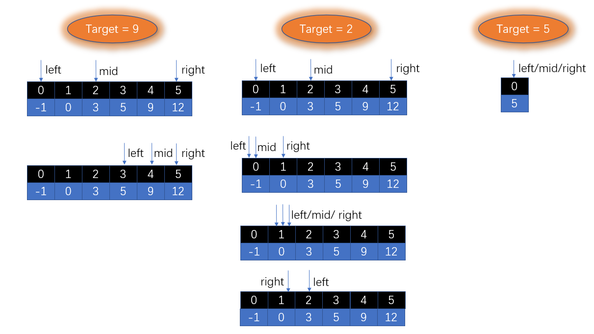
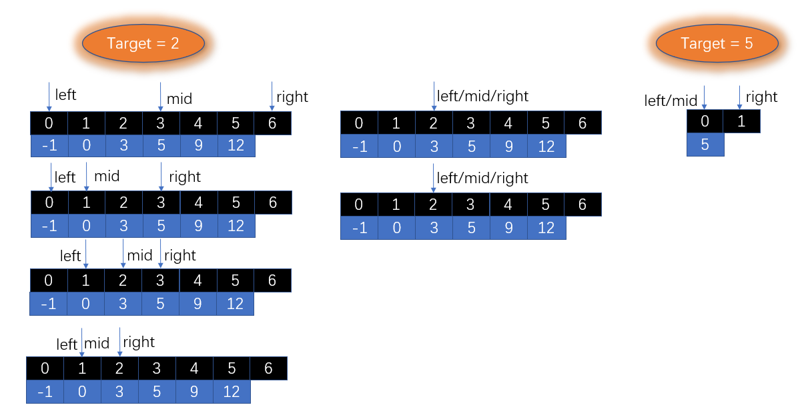

# 二分查找

## 704.二分查找

- 给定一个 n 个元素有序的（升序）整型数组 nums 和一个目标值 target  ，写一个函数搜索 nums 中的 target，如果目标值存在返回下标，否则返回 -1
- 示例一：

```java
输入: nums = [-1,0,3,5,9,12], target = 9
输出: 4
解释: 9 出现在 nums 中并且下标为 4
```

- 示例二

```java
输入: nums = [-1,0,3,5,9,12], target = 2
输出: -1
解释: 2 不存在 nums 中因此返回 -1
```

- 提示

>- 你可以假设 nums 中的所有元素是不重复的
>- n 将在 [1, 10000]之间
>- nums 的每个元素都将在 [-9999, 9999]之间

- 思路



- 题解

```java
public class Solution704 {
    public int search(int[] nums, int target) {
        if (nums.length == 0) return -1;
        int left = 0; //左指针(左闭)
        int right = nums.length - 1; //右指针(右闭)
        int mid;
        while (left <= right) { //只有当left > right 时才能确定没有查找到目标值
            mid = (left + right) >> 1;
            if (nums[mid] == target) {
                return mid;
            } else if (nums[mid] < target) {
                left = mid + 1; 
            } else {
                right = mid - 1;
            }
        }
        return -1;
    }
}
```

- 思路二



- 题解

```java
public class Solution704 {
    public int search(int[] nums, int target) {
        if (nums.length == 0) return -1;
        int left = 0; //左闭
        int right = nums.length; //右开
        int mid;
        while (left < right) { //right指针指向为空,当left>=right时必然查找失败
            mid = (left + right) >> 1;
            if (nums[mid] == target) {
                return mid;
            } else if (nums[mid] < target) {
                left = mid + 1;
            } else {
                right = mid;
            }
        }
        return -1;
    }
}
```

## 852.山脉数组的峰顶索引

- 我们把符合下列属性的数组 A 称作山脉：

>- A.length >= 3
>- 存在 0 < i < A.length - 1 使得A[0] < A[1] < ... A[i-1] < A[i] > A[i+1] > ... > A[A.length - 1]

- 给定一个确定为山脉的数组，返回任何满足 A[0] < A[1] < ... A[i-1] < A[i] > A[i+1] > ... > A[A.length - 1] 的 i 的值
- 示例一

```java
输入：[0,1,0]
输出：1
```

- 示例二

```java
输入：[0,2,1,0]
输出：1
```

- 思路

>- 山脉数组是一部分单调递增，一部分单调递减的，并且无相同重复的元素
>- 需要找到一个数target，它既比它左边的数大，也比它右边的数大，这个数就是山脉的山峰

- 题解

```java
public class Solution852 {
    public int peakIndexInMountainArray(int[] A) {
        int left = 0;
        int right = A.length - 1;
        int mid = 1; //因为A.length >= 3,直接就默认山峰为A[1]
        while (left <= right) {
            mid = (left + right) >> 1;
            if (A[mid] > A[mid + 1] && A[mid] > A[mid - 1]) { //山峰
                return mid;
            } else if (A[mid] < A[mid + 1]) { //往右峰找
                left = mid + 1;
            } else {
                right = mid - 1; //往左峰找
            }
        }
        return mid;
    }
}
```