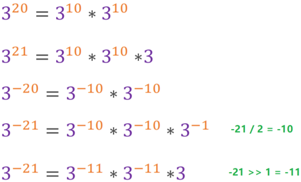

# 数学

## 7.整数反转

- 给出一个 32 位的有符号整数，你需要将这个整数中每位上的数字进行反转
- 示例一：

```java
输入: 123
输出: 321
```

- 示例二

```java
输入: -123
输出: -321
```

- 示例三

```java
输入: -123
输出: -321
```

- 思路一

>- 用比int类型大的long类型存储结果，判断是否溢出
>- 以为123为例，第一次循环res = 3, x = 12；第二次循环res = 32, x = 1；第三次循环res = 321, x = 0

- 题解一

```java
public class Solution7 {
    public int reverse(int x) {
        long res = 0;
        while (x != 0){
            res = res * 10 + x % 10;
            if (res > Integer.MAX_VALUE || res < Integer.MIN_VALUE) return 0;
            x /= 10;
        }
        return (int)res;
    }
}
```

>缺点：若int就是最大的类型，没有一个更大类型的能够接收溢出的数据，那么这种方法就失去了效果

---

- 思路二：

>- 对于溢出后的值会出现乱七八糟的数据
>- 若没有溢出，那么123翻转后等于321；321再翻转必然是123
>- 若溢出了，那么154554845,翻转后可能是4564561561，这个数再翻转回来也得不到原来的数

- 题解二

```java
public class Solution7 {
    public int reverse(int x) {
        int res = 0;
        int prev = 0;
        while (x != 0) {
            prev = res; //翻转前
            res = prev * 10 + x % 10; //翻转后
            int temp = (res - x % 10) / 10; //翻转后再翻转 == 翻转前,就没有溢出
            if (temp != prev) return 0;
            x /= 10;
        }
        return res;
    }
}
```

## 50.Pow(x,n)

- 示例一

```java
输入: 2.00000, 10
输出: 1024.00000
```

- 示例二

```java
输入: 2.10000, 3
输出: 9.26100
```

- 示例三

```java
输入: 2.00000, -2
输出: 0.25000
解释: 2^-2 = 1/2^2 = 1/4 = 0.25
```

- 说明

>- -100.0 < *x* < 100.0
>- *n* 是 32 位有符号整数，其数值范围是 [−231, 231 − 1] 

- 思路一：递归，分治思想



>- 如果是正整数幂，那么任何数的0次方等于1
>- 如果是负整数幂，那么任何数的-1次方等于该数的倒数
>- 注意：-21 / 2 = -10 但是 -21 >> 1 = -11

- 题解一

```java
public class Solution50 {
    public double myPow(double x, int n) {
        if (n == 0) return 1;
        if (n == 1) return x;
        if (n == -1) return 1 / x;
        //求2^10只需求出2^5
        double res = myPow(x, n >> 1);
        //2^5 * 2^5 = 2^10
        res *= res;
        //2^11 = 2^5 * 2^5 * 2
        return ((n & 1) == 1) ? (res * x) : res;
    }
}
```

---

- 思路二：快速幂


- 我们惊奇的发现竟然有如下规律：有效范围内，倒数第n位数等于倒数第n-1位数的两倍


- 详细解释

>- 对于${3^{21}}$这个数，21二进制数为10101，我们可以先把这串二进制数看作11111，那么结果就等于${3^1*3^2*3^4*3^8*3^{16}}$
>- 我们实际需要的是${3^1*3^4*3^{16}}$，即是二进制数中不为0的其他位数乘积之和
>- 如果二进制数最后一位为1，那么必然是1次方，这是起点

- 题解二

```java
public class Solution50 {
    public double myPow(double x, int n) {
        //判断是否为负的幂次方
        boolean negative = n < 0;
        //若为负幂则先转换为正幂
        long y = negative ? -((long) n) : n;
        double res = 1.0;
        while (y > 0) {
            if ((y & 1) == 1) { //判断幂的二进制的最后一位
                res *= x;
            }
            x *= x;
            y >>= 1;
        }
        return negative ? 1 / res : res;
    }
}
```

# 练习

## 191.二进制数中一的个数

- 请实现一个函数，输入一个整数，输出该数二进制表示中 1 的个数。例如，把 9 表示成二进制是 1001，有 2 位是 1。因此，如果输入 9，则该函数输出 2
- 示例一

```java
输入：00000000000000000000000000001011
输出：3
解释：输入的二进制串 00000000000000000000000000001011 中，共有三位为 '1'
```

- 示例二

```java
输入：00000000000000000000000010000000
输出：1
解释：输入的二进制串 00000000000000000000000010000000 中，共有一位为 '1'
```

- 示例三

```java
输入：11111111111111111111111111111101
输出：31
解释：输入的二进制串 11111111111111111111111111111101 中，共有 31 位为 '1'
```

- 思路一

>- 将整数n先转换为二进制字符串
>- 再统计二进制字符串中字符1的个数

- 题解一

```java
public class Solution191 {
    public int hammingWeight(int n) {
        String s = Integer.toBinaryString(n);
        System.out.println(s);
        char[] chars = s.toCharArray();
        int count = 0;
        for (char c : chars) {
            if (c == '1') count++;
        }
        return count;
    }
}
```

---

- 思路二：使用位运算，题目说明可以将n整数n看做无符号数，所以可以使用无符号右移


- 题解二：

```java
public class Solution191 {
    public int hammingWeight(int n) {
        int count = 0;
        while (n != 0) {
            if ((n & 1) == 1) count++;
            n = n >>> 1; //无符号右移,使用>>会超出时间限制!
        }
        return count;
    }
}
```

## 53.0~n-1中缺失的数字

- 一个长度为n-1的递增排序数组中的所有数字都是唯一的，并且每个数字都在范围0～n-1之内。在范围0～n-1内的n个数字中有且只有一个数字不在该数组中，请找出这个数字
- 示例一

```java
输入: [0,1,3]
输出: 2
```

- 示例二

```java
输入: [0,1,2,3,4,5,6,7,9]
输出: 8
```

- 限制：1 <= 数组长度 <= 10000
- 思路


>- 直接从头遍历数组，数组的下标和其对应的值是相等的，若出现不相等的情况就是缺失的数字
>- 对于情况一：我们只需要返回索引值即可
>- 对于情况二：我们只需要返回越界的索引值即可

- 题解

```java
public class Solution53 {
    public int missingNumber(int[] nums) {
        int i = 0;
        for (; i < nums.length - 1; i++) {
            if (nums[i] != i) return i; //满足情况一
        }
        return i; //满足情况二
    }
}
```

## 17.打印从1到最大的n位数数

- 输入数字 `n`，按顺序打印出从 1 到最大的 n 位十进制数。比如输入 3，则打印出 1、2、3 一直到最大的 3 位数 999
- 示例

```java
输入: n = 1
输出: [1,2,3,4,5,6,7,8,9]
```

- 说明

>- 用返回一个整数列表来代替打印
>- n 为正整数

- 思路

>- 关键是得到最大值是多少
>- 当输入1时最大值 = 10 - 1;
>- 当输入2时最大值 = 10 * 10 - 1;
>- 当输入3时最大值 = 10 * 10 * 10 - 1;

- 题解

```java
public class Solution17 {
    public int[] printNumbers(int n) {
        int max = 1;
        for (int i = 0; i < n; i++) {
            max = max * 10;
        }
        int[] res = new int[max - 1]; //最大值是10,只需要9个数组空间
        for (int i = 0; i < max - 1; i++) { //空数组值默认为0
            res[i] = i + 1;
        }
        return res;
    }
}
```

## 136.只出现一次的数字

- 给定一个非空整数数组，除了某个元素只出现一次以外，其余每个元素均出现两次。找出那个只出现了一次的元素。
- 说明：你的算法应该具有线性时间复杂度。 你可以不使用额外空间来实现吗？
- 示例一

```java
输入: [2,2,1]
输出: 1
```

- 示例二

```java
输入: [4,1,2,1,2]
输出: 4
```

- 思路一：两遍哈希表
- 题解一：

```java
public class Solution136 {
    public int singleNumber(int[] nums) {
        HashMap<Integer,Integer> map = new HashMap<>();
        for (int num : nums) {
            if (map.containsKey(num)){
                map.put(num,map.get(num)+1); //更新数字出现的次数
            }else {
                map.put(num,1); //数字第一次出现
            }
        }
        for (int num : nums) {
            if (map.get(num) == 1) return num; //返回只出现一次的数字
        }
        return -1;
    }
}
```

---

- 思路二：使用异或位运算

>- 任何数和 0做异或运算，结果仍然是原来的数，即 a⊕0=a
>- 任何数和其自身做异或运算，结果是 00，即a⊕a=0
>- 异或运算满足交换律和结合律，即 a⊕b⊕a=b⊕a⊕a=b⊕(a⊕a)=b⊕0=b

- 题解二：

```java
public class Solution136 {
    public int singleNumber(int[] nums) {
        int res = 0;
        for (int num : nums) {
            res ^= num;
        }
        return res;
    }
}
```

## 56.数组中数字出现的次数I

- 一个整型数组 nums 里除两个数字之外，其他数字都出现了两次。请写程序找出这两个只出现一次的数字。要求时间复杂度是O(n)，空间复杂度是O(1)
- 示例一

```java
输入：nums = [4,1,4,6]
输出：[1,6] 或 [6,1]
```

- 示例二

```java
输入：nums = [1,2,10,4,1,4,3,3]
输出：[2,10] 或 [10,2]
```

- 限制：2 <= nums.length <= 10000
- 思路


>- 先对所有数字进行一次异或，得到两个出现一次的数字的异或值，如1^6^4^4 = 111 即 001^110 = 111
>- 在异或结果中找到任意为 1 的位，这一位表示的是1和6二进制数中不相同的一位，为了简单我们找到第一位不相同的即可，即是001和110从右往左的第一位二进制数不同
>- 的到0001，根据这一位对所有的数字进行分组
>- 在每个组内进行异或操作，结果只有0或者是1，只要是两数相等那么必然被分到同一组，最终异或的结果也为了；若两数不不相等，则必然被分到不同的组，最终和0异或得到的结果还是自己本身的数字，最终得到两个数字即是我们想要的答案

- 题解

```java
public class Solution56 {
    public int[] singleNumbers(int[] nums) {
        int res = 0; //将所有的数异或起来的结果
        for (int num : nums) {
            res ^= num;
        }
        //获取res中最低位的1
        int mask = 1;
        while ((res & mask) == 0) {
            mask = (mask << 1);
        }
        //根据最低位的1将数组分为两组
        int first = 0;
        int second = 0;
        for (int num : nums) {
            if ((num & mask) == 0) {
                first ^= num;
            } else {
                second ^= num;
            }
        }
        return new int[]{first, second};
    }
}
```

## 231.2的幂

- 给定一个整数，编写一个函数来判断它是否是 2 的幂次方
- 示例一

```java
输入: 1
输出: true
解释: 2^0 = 1
```

- 示例二

```java
输入: 16
输出: true
解释: 2^4 = 16
```

- 示例三

```java
输入: 218
输出: false
```

- 思路

>- 若n 为 2 的幂，则一定满足以下条件：
>- 恒有 n & (n - 1) == 0，这是因为：n 二进制最高位为 1，其余所有位为 0
>- 一定满足 n > 0
>- 因此，通过 `n > 0` 且 `n & (n - 1) == 0` 即可判定是否满足2的幂


- 题解

```java
public class Solution231 {
    public boolean isPowerOfTwo(int n) {
        return n > 0 && (n & (n - 1)) == 0;
    }
}
```

