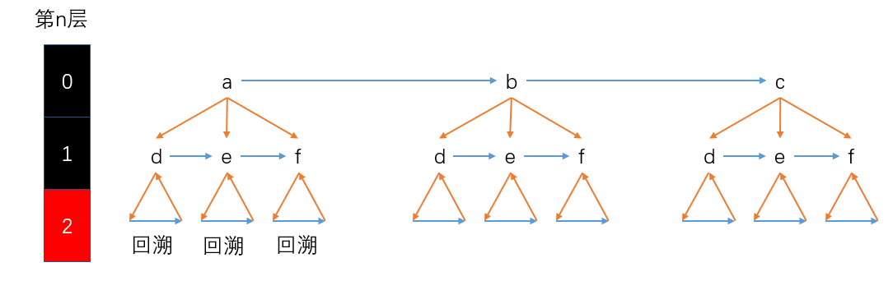

# 深度优先搜索

## 17.电话号码的字母组合

- 给定一个仅包含数字 `2-9` 的字符串，返回所有它能表示的字母组合
- 给出数字到字母的映射如下（与电话按键相同）。注意 1 不对应任何字母


- 示例

```java
输入："23"
输出：["ad", "ae", "af", "bd", "be", "bf", "cd", "ce", "cf"].
```

- 说明：尽管上面的答案是按字典序排列的，但是你可以任意选择答案输出的顺序
- 思路



- 题解

```java
import java.util.ArrayList;
import java.util.List;

public class Solution17 {
    private char[][] lettersArray = {
            {'a', 'b', 'c'}, {'d', 'e', 'f'}, {'g', 'h', 'i'},
            {'j', 'k', 'l'}, {'m', 'n', 'o'}, {'p', 'q', 'r', 's'},
            {'t', 'u', 'v'}, {'w', 'x', 'y', 'z'}
    };
    //将传入的字符串转换为字符数组
    private char[] chars;
    private char[] string;
    private List<String> list;

    public List<String> letterCombinations(String digits) {
        if (digits == null) return null;
        list = new ArrayList<>();
        if (digits.length() == 0) return list;
        chars = digits.toCharArray();
        string = new char[chars.length];
        dfs(0);
        return list;
    }

    /**
     * @param idx 表示正在搜索第idx层
     */
    private void dfs(int idx) {
        //进入了最后一层,不能再往下继续搜索
        if (idx == chars.length){
            list.add(new String(string));
            return; //回溯
        }

        //先枚举当前层可以做的所有选择,数字2对应'a','b','c'
        char[] letters = lettersArray[chars[idx] - '2'];
        for (char letter : letters) {
            string[idx] = letter;
            dfs(idx + 1); //向下一层搜索
        }
    }
}
```

- 将全局变量整合到方法中

```java
import java.util.ArrayList;
import java.util.List;

public class Solution17 {
    private char[][] lettersArray = {
            {'a', 'b', 'c'}, {'d', 'e', 'f'}, {'g', 'h', 'i'},
            {'j', 'k', 'l'}, {'m', 'n', 'o'}, {'p', 'q', 'r', 's'},
            {'t', 'u', 'v'}, {'w', 'x', 'y', 'z'}
    };
    //将传入的字符串转换为字符数组

    public List<String> letterCombinations(String digits) {
        if (digits == null) return null;
        List<String> list = new ArrayList<>();
        if (digits.length() == 0) return list;
        char[] chars = digits.toCharArray();
        char[] string = new char[chars.length];
        dfs(0, chars, string, list);
        return list;
    }

    /**
     * @param idx 表示正在搜索第idx层
     */
    private void dfs(int idx, char[] chars, char[] string, List<String> list) {
        //进入了最后一层,不能再往下继续搜索
        if (idx == chars.length) {
            list.add(new String(string));
            return; //回溯
        }

        //先枚举当前层可以做的所有选择
        char[] letters = lettersArray[chars[idx] - '2'];
        for (char letter : letters) {
            string[idx] = letter;
            dfs(idx + 1, chars, string, list);
        }
    }
}
```

## 46.全排列

- 给定一个 **没有重复** 数字的序列，返回其所有可能的全排列
- 示例

```java
输入: [1,2,3]
输出:
[
  [1,2,3],
  [1,3,2],
  [2,1,3],
  [2,3,1],
  [3,1,2],
  [3,2,1]
]
```

- 思路一


>- 从第0层开始往下钻，遍历到1，存储并标记
>- 到第1层，发现1被标记后则跳过该路径，遍历2，存储并标记
>- 到第2层，发现1和2都已经被标记，遍历3，存储并标记
>- 想要进入第3层，已经越界了，直接return函数，回溯到第2层，将3标记为未遍历状态
>- 第2层for循坏自然结束，回溯到第1层，将2标记为未遍历状态，接着执行for循坏，走到第1层的路径3开始往下钻

- 题解

```java
import java.util.ArrayList;
import java.util.List;

public class Solution46 {
    private ArrayList<List<Integer>> lists;
    //记录每层遍历的数据
    private int[] result;
    //将传入的nums变成全局变量
    private int[] nums;
    //记录数据是否被访问过
    private boolean[] used;

    public List<List<Integer>> permute(int[] nums) {
        if (nums == null) return null;
        lists = new ArrayList<>();
        if (nums.length == 0) return lists;
        this.nums = nums;
        used = new boolean[nums.length];
        result = new int[nums.length];
        dfs(0);
        return lists;
    }

    private void dfs(int idx) {
        //遍历到了最后一层
        if (idx == nums.length) {
            ArrayList<Integer> resultList = new ArrayList<>();
            for (int value : result) {
                resultList.add(value);
            }
            lists.add(resultList);
            return; //回溯
        }
        for (int i = 0; i < nums.length; i++) {
            if (used[i]) continue;
            result[idx] = nums[i];  //存储第idx层的访问元素
            used[i] = true;  //标记被访问过的元素
            dfs(idx + 1);  //访问下一层
            used[i] = false;  //还原现场
        }
    }
}
```

---

- 思路二


- 题解二

```java
import java.util.ArrayList;
import java.util.List;

public class Solution46_2 {

    public List<List<Integer>> permute(int[] nums) {
        ArrayList<List<Integer>> lists = new ArrayList<>();
        if (nums.length == 0) return lists;
        dfs(0, nums, lists);
        return lists;
    }

    private void dfs(int idx, int[] nums, ArrayList<List<Integer>> lists) {
        //遍历到了最后一层
        if (idx == nums.length) {
            ArrayList<Integer> resultList = new ArrayList<>();
            for (int value : nums) {
                resultList.add(value);
            }
            lists.add(resultList);
            return; //回溯
        }
        for (int i = idx; i < nums.length; i++) {
            swap(nums, idx, i);
            dfs(idx + 1, nums, lists);  //访问下一层
            swap(nums, idx, i);
        }
    }

    //交换数组中元素的位置
    private void swap(int[] nums, int i, int j) {
        int temp = nums[i];
        nums[i] = nums[j];
        nums[j] = temp;
    }
}
```

## 46.全排列II

- 给定一个可包含重复数字的序列，返回所有不重复的全排列
- 示例

```java
输入: [1,1,2]
输出:
[
  [1,1,2],
  [1,2,1],
  [2,1,1]
]
```

- 思路：在全排列一的基础上增加去重的功能


- 题解

```java
import java.util.ArrayList;
import java.util.List;

public class Solution46_II {
    
    public List<List<Integer>> permuteUnique(int[] nums) {
        ArrayList<List<Integer>> lists = new ArrayList<>();
        if (nums.length == 0) return lists;
        dfs(0, nums, lists);
        return lists;
    }

    private void dfs(int idx, int[] nums, ArrayList<List<Integer>> lists) {
        //遍历到了最后一层
        if (idx == nums.length) {
            ArrayList<Integer> resultList = new ArrayList<>();
            for (int value : nums) {
                resultList.add(value);
            }
            lists.add(resultList);
            return; //回溯
        }
        for (int i = idx; i < nums.length; i++) {
            //要保证一个数字在idx位置只出现一次
            if (isRepeat(nums, idx, i)) continue;
            swap(nums, idx, i);
            dfs(idx + 1, nums, lists);  //访问下一层
            swap(nums, idx, i);
        }
    }

    //去重
    private boolean isRepeat(int[] nums, int idx, int i) {
        for (int j = idx; j < i; j++) {
            if (nums[j] == nums[i]) return true;
        }
        return false;
    }

    //交换数组中元素的位置
    private void swap(int[] nums, int i, int j) {
        int temp = nums[i];
        nums[i] = nums[j];
        nums[j] = temp;
    }
}
```

## 22.括号生成

- 数字 *n* 代表生成括号的对数，请你设计一个函数，用于能够生成所有可能的并且 **有效的** 括号组合
- 示例

```java
输入：n = 3
输出：[
       "((()))",
       "(()())",
       "(())()",
       "()(())",
       "()()()"
     ]
```

- 思路：以n=2为例


- 题解

```java
import java.util.ArrayList;
import java.util.List;

public class Solution22 {
    public List<String> generateParenthesis(int n) {
        ArrayList<String> list = new ArrayList<>();
        dfs(0, n, n, new char[n << 1], list);
        return list;
    }

    /**
     * 深度优先搜索
     *
     * @param idx         当前搜索的层号,从0开始
     * @param leftRemain  左括号的剩余数量
     * @param rightRemain 有括号的剩余数量
     * @param string      存放每一层的选择
     * @param list        最后的结果集合
     */
    private void dfs(int idx, int leftRemain, int rightRemain, char[] string, List<String> list) {
        //包含了n=0的情况
        if (idx == string.length) {
            list.add(new String(string));
            return; //回溯
        }

        //当左括号的数量 > 0 时可以选择左括号
        if (leftRemain > 0) {
            string[idx] = '(';
            dfs(idx + 1, leftRemain - 1, rightRemain, string, list); //向下一层继续搜索
        }

        //当右括号数量 > 0 且右括号数量 ！= 左括号数量时可以选择右括号
        //注意：当右括号数量 = 左括号数量时只能选择左括号
        if (rightRemain > 0 && rightRemain != leftRemain) {
            string[idx] = ')';
            dfs(idx + 1, leftRemain, rightRemain - 1, string, list);
        }
    }
}
```

## 113.路径总和II

- 给定一个二叉树和一个目标和，找到所有从根节点到叶子节点路径总和等于给定目标和的路径
- 说明: 叶子节点是指没有子节点的节点。
- 示例：给定如下二叉树，以及目标和 sum = 22

```java
      5
     / \
    4   8
   /   / \
  11  13  4
 /  \    / \
7    2  5   1
```

- 返回:

```java
[
   [5,4,11,2],
   [5,8,4,5]
]
```

- 思路

 

- 题解

```java
import java.util.ArrayList;
import java.util.List;

public class Solution113 {
    public List<List<Integer>> pathSum(TreeNode root, int sum) {
        ArrayList<List<Integer>> lists = new ArrayList<>();
        if (root == null) return lists;
        dfs(root, sum, new ArrayList<>(), lists);
        return lists;
    }

    private void dfs(TreeNode node, int remain, List<Integer> result, List<List<Integer>> lists) {
        if (node == null) return; //往上层回溯
        remain -= node.val;
        result.add(node.val);
        //是叶子结点且当前路径的和等于sum
        if (node.left == null && node.right == null && remain == 0) {
            lists.add(new ArrayList<>(result));
        } else {
            dfs(node.left, remain, result, lists);
            dfs(node.right, remain, result, lists);
        }
        //回溯后需要还原现场
        result.remove(result.size() - 1);
    }
}
```

## 39.组合求和

- 给定一个**无重复元素**的数组 `candidates` 和一个目标数 `target` ，找出 `candidates` 中所有可以使数字和为 `target` 的组合
- `candidates` 中的数字可以无限制重复被选取
- **说明：**
  - 所有数字（包括 `target`）都是正整数
  - 解集不能包含重复的组合
- 示例一

```java
输入: candidates = [2,3,6,7], target = 7,
所求解集为:
[
  [7],
  [2,2,3]
]
```

- 示例二

```java
输入: candidates = [2,3,5], target = 8,
所求解集为:
[
  [2,2,2,2],
  [2,3,3],
  [3,5]
]
```

- 思路


- 题解

```java
import java.util.ArrayList;
import java.util.Arrays;
import java.util.List;

public class Solution39 {
    public List<List<Integer>> combinationSum(int[] candidates, int target) {
        ArrayList<Integer> resultList = new ArrayList<>();
        ArrayList<List<Integer>> lists = new ArrayList<>();
        //保证数字是从大到小进行选择的(用于去重)
        Arrays.sort(candidates);
        dfs(0, target, candidates, resultList, lists);
        return lists;
    }

    /**
     * @param begin  从哪个位置进行选取
     * @param remain 还剩多少凑够target
     */
    private void dfs(int begin, int remain, int[] candidates, List<Integer> resultList, List<List<Integer>> lists) {
        if (remain == 0) {
            lists.add(new ArrayList<>(resultList));
            return;
        }

        for (int i = begin; i < candidates.length; i++) {
            //如果candidates[i]超过remain,那么后面的数值必然超过remain
            if (remain < candidates[i]) return;
            resultList.add(candidates[i]);
            dfs(i, remain - candidates[i], candidates, resultList, lists);
            resultList.remove(resultList.size() - 1);
        }
    }
}
```


