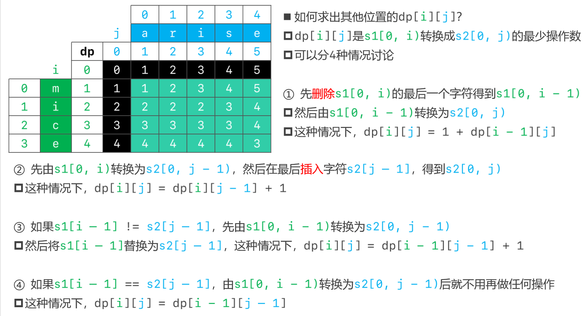

# 动态规划

## 47.礼物的最大值

- 在一个 m * n 的棋盘的每一格都放有一个礼物，每个礼物都有一定的价值（价值大于 0）。你可以从棋盘的左上角开始拿格子里的礼物，并每次向右或者向下移动一格、直到到达棋盘的右下角。给定一个棋盘及其上面的礼物的价值，请计算你最多能拿到多少价值的礼物？
- 示例 1:

```java
输入: 
[
  [1,3,1],
  [1,5,1],
  [4,2,1]
]
输出: 12
解释: 路径 1→3→5→2→1 可以拿到最多价值的礼物
```

- 提示：

>- `0 < grid.length <= 200`
>- `0 < grid[0].length <= 200`

- 思路


- 题解一：二维数组

```java
public class Solution47 {
    public int maxValue(int[][] grid) {
        int rows = grid.length; //行数
        int cols = grid[0].length; //列数
        int[][] dp = new int[rows][cols]; //动态规划二维数组
        dp[0][0] = grid[0][0]; //初始化第一行第一列的数据--------------------(特殊数据)
        for (int row = 1; row < rows; row++) { //初始化第一列的所有数据------(特殊数据)
            dp[row][0] = dp[row - 1][0] + grid[row][0];
        }
        for (int col = 1; col < cols; col++) { //初始化第一行的所有数据------(特殊数据)
            dp[0][col] = dp[0][col-1] + grid[0][col];
        }
        for (int row = 1; row < rows; row++) {
            for (int col = 1; col < cols; col++) {
                dp[row][col] = Math.max(dp[row - 1][col],dp[row][col - 1]) + grid[row][col];
            }
        }
        return dp[rows - 1][cols - 1];
    }
}
```

## 121.买卖股票的最佳时机

- 给定一个数组，它的第 i 个元素是一支给定股票第 i 天的价格
- 如果你最多只允许完成一笔交易（即买入和卖出一支股票一次），设计一个算法来计算你所能获取的最大利润
- 注意：你不能在买入股票前卖出股票

```java
示例 1:

输入: [7,1,5,3,6,4]
输出: 5
解释: 在第 2 天（股票价格 = 1）的时候买入，在第 5 天（股票价格 = 6）的时候卖出，最大利润 = 6-1 = 5 。
     注意利润不能是 7-1 = 6, 因为卖出价格需要大于买入价格；同时，你不能在买入前卖出股票。
//--------------------------------------------------------------------------------------------
示例 2:

输入: [7,6,4,3,1]
输出: 0
解释: 在这种情况下, 没有交易完成, 所以最大利润为 0。
```

- 思路：从卖的角度思考


>- 从第二天开始卖股票，指针i记录哪一天开始卖，指针minPrice记录在这之前的天数中哪一天买入股票所需的价格最低，指针max记录买卖的最大利润
>- 在卖的时候计算与买时候的差价，若大于之前得到的最大利润值则更新最大利润；若小于等于说明不能进行买卖，利润为负数，这时只需更新买入股票所需的最低价格
>- 把遍历的每一天都当成有可能要卖出去的当天

- 题解一：数组

```java
public class Solution121 {
    public int maxProfit(int[] prices) {
        if (prices.length == 0) return 0;
        int max = 0; //扫描过的最大利润
        int minPrice = prices[0]; //扫描过的最低价格
        for (int i = 1; i < prices.length; i++) { //把第i天的股票卖出
            int price = prices[i] - minPrice; //卖的钱 - 最低价格买入的钱 = 最大利润
            if (price <= 0){ //利润为负
                minPrice = prices[i]; //比之前买入的最低价格还要低,更新最低价格
            }else{
                max = Math.max(price, max); //利润为正则更新最大利润
            }
        }
        return max;
    }
}
```

- 思路二：


- 题解二：动态规划


## 72.编辑距离

- 给你两个单词 word1 和 word2，请你计算出将 word1 转换成 word2 所使用的最少操作数 
- 你可以对一个单词进行如下三种操作：

>- 插入一个字符
>- 删除一个字符
>- 替换一个字符

```java
示例 1：

输入：word1 = "horse", word2 = "ros"
输出：3
解释：
horse -> rorse (将 'h' 替换为 'r')
rorse -> rose (删除 'r')
rose -> ros (删除 'e')

//-------------------------------------------------
示例 2：

输入：word1 = "intention", word2 = "execution"
输出：5
解释：
intention -> inention (删除 't')
inention -> enention (将 'i' 替换为 'e')
enention -> exention (将 'n' 替换为 'x')
exention -> exection (将 'n' 替换为 'c')
exection -> execution (插入 'u')
```

- 思路



- 题解

```java
public class Solution72 {
    public int minDistance(String word1, String word2) {
        if (word1 == null || word2 == null) return 0;
        char[] charsOne = word1.toCharArray();
        char[] charsTwo = word2.toCharArray();
        int[][] dp = new int[charsOne.length + 1][charsTwo.length + 1];
        dp[0][0] = 0; 
        for (int row = 1; row < dp.length; row++) { //初始化每一行
            dp[row][0] = row;
        }
        for (int col = 1; col < dp[0].length; col++) { //初始化每一列
            dp[0][col] = col;
        }
        for (int row = 1; row < dp.length; row++) { //通过已知的行和列推导出未知的行和列
            for (int col = 1; col < dp[0].length; col++) {
                int top = dp[row - 1][col] + 1;
                int left = dp[row][col - 1] + 1;
                int leftTop = dp[row - 1][col - 1];
                if (charsOne[row - 1] != charsTwo[col - 1]){ //只有word1和word2最后一个字符相等的时候需要加1
                    leftTop++;
                }
                dp[row][col] = Math.min(Math.min(top,left),leftTop); //选择三种选择中所需次数最少的
            }
        }
        return dp[charsOne.length][charsTwo.length];
    }
}
```

## 5.最长回文子串

- 给定一个字符串 `s`，找到 `s` 中最长的回文子串。你可以假设 `s` 的最大长度为 1000

```java
示例 1：

输入: "babad"
输出: "bab"
注意: "aba" 也是一个有效答案。
    
//----------------------------------
示例 2：

输入: "cbbd"
输出: "bb"
```

