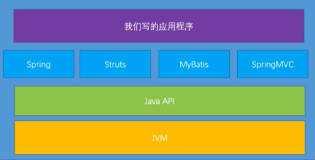
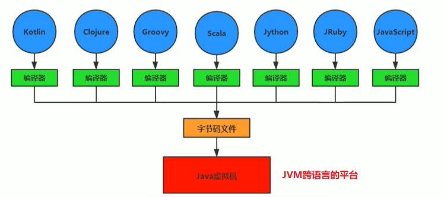
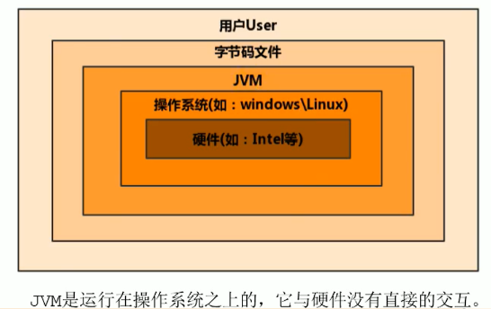
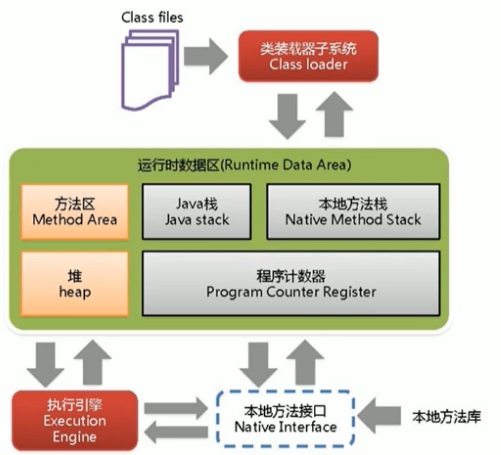

# JVM介绍

## 1.1 引言

- 随着Java7的正式发布，Java虚拟机的设计者们通过JSR-292规范基本实现在Java虚拟机平台上运行非Java语言编写的程序。
- Java虚拟机根本不关心运行在其内部的程序到底是使用何种编程语言编写的，它只关心“字节码”文件。也就是说Java虚拟机拥有语言无关性，并不会单纯地与Java语言“终身绑定”，只要其他编程语言的编译结果满足并包含Java虚拟机的内部指令集、符号表以及其他的辅助信息，它就是一个有效的字节码文件，就能够被虚拟机所识别并装载运行。

- Java不是最强大的语言，但是JVM是最强大的虚拟机。

## 1.2 字节码

- 我们平时说的java字节码，指的是用java语言编译成的字节码。准确的说任何能在jvm平台上执行的字节码格式都是一样的。所以应该统称为：
  - **jvm字节码**
- 不同的编译器，可以编译出相同的字节码文件，字节码文件也可以在不同的JVM上运行。
- Java虚拟机与Java语言并没有必然的联系，它只与特定的二进制文件格式—Class文件格式所关联，Class文件中包含了Java虚拟机指令集（或者称为字节码、Bytecodes）和符号表，还有一些其他辅助信息。

## 1.3 多语言混合编程

- Java平台上的多语言混合编程正成为主流，通过特定领域的语言去解决特定领域的问题是当前软件开发应对日趋复杂的项目需求的一个方向。
- 试想一下，在一个项目之中，并行处理用clojure语言编写，展示层使用JRuby/Rails，中间层则是Java，每个应用层都将使用不同的编程语言来完成，而且，接口对每一层的开发者都是透明的，各种语言之间的交互不存在任何困难，就像使用自己语言的原生API一样方便，因为它们最终都运行在一个虚拟机之上。
- 对这些运行于Java虚拟机之上、Java之外的语言，来自系统级的、底层的支持正在迅速增强，以JSR-292为核心的一系列项目和功能改进（如Da Vinci Machine项目、Nashorn引擎、InvokeDynamic指令、java.lang.invoke包等），推动Java虚拟机从“Java语言的虚拟机” 向 “多语言虚拟机” 的方向发展。

## 1.4 JAVA发展的重大事件

- 1990年，在Sun 计算机公司中，由Patrick Naughton、Mikesheridan及James Gosling 领导的小组Green Team，开发出的新的程序语言，命名为oak，后期命名为Java
- 1995年，Sun正式发布Java和HotJava产品，Java首次公开亮相。
- 1996年1月23日sun Microsystems发布了JDK1.0。
- 1998年，JDK1.2版本发布。同时，Sun发布了JSP/Servlet、EJB规范，以及将Java分成了J2EE、J2SE和J2ME。这表明了Java开始向企业、桌面应用和移动设备应用3大领域挺进。
- 2000年，JDK1.3发布，Java HotSpot Virtual Machine正式发布，成为Java的默认虚拟机。
- 2002年，JDK1.4发布，古老的Classic虚拟机退出历史舞台。
- 2003年年底，Java平台的scala正式发布，同年Groovy也加入了Java阵营。
- 2004年，JDK1.5发布。同时JDK1.5改名为JavaSE 5.0。
- 2006年，JDK6发布。同年，Java开源并建立了openJDK。顺理成章，Hotspot虚拟机也成为了OpenJDK中的默认虚拟机。
- 2007年，Java平台迎来了新伙伴clojure。
- 2008年，oracle收购了BEA，得到了JRockit虚拟机。
- 2009年，Twitter宣布把后台大部分程序从Ruby迁移到scala，这是Java平台的又一次大规模应用。|I
- 2010年，Oracle收购了sun，获得Java商标和最具价值的HotSpot虚拟机。此时，oracle拥有市场占用率最高的两款虚拟机HotSpot和JRockit，并计划在未来对它们进行整合：HotRockit
- 2011年，JDK7发布。在JDK1.7u4中，正式启用了新的垃圾回收器G1。
- 2017年，JDK9发布。将G1设置为默认Gc，替代CMS
  - 同年，IBM的J9开源，形成了现在的open J9社区
- 2018年，Android的Java侵权案判决，Google赔偿oracle计88亿美元
  - 同年，oracle宣告JavaEE成为历史名词，JDBC、JMS、Servlet赠予Eclipse基金会
  - 同年，JDK11发布，LTS版本的JDK，发布革命性的zGC，调整JDK授权许可
- 2019年，JDK12发布，加入RedHat领导开发的shenandoah GC

## 1.5 虚拟机

- 所谓虚拟机（Virtual Machine），就是一台虚拟的计算机。它是一款软件，用来执行一系列虚拟计算机指令。大体上，**虚拟机可以分为系统虚拟机和程序虚拟机。**

>- 大名鼎鼎的Visual、Box、VMware就属于系统虚拟机，它们完全是对物理计算机的仿真，提供了一个可运行完整操作系统的软件平台。
>- 程序虚拟机的典型代表就是Java虚拟机，它专门为执行单个计算机程序而设计，在Java虚拟机中执行的指令我们称为Java字节码指令。

- 无论是系统虚拟机还是程序虚拟机，在上面运行的软件都被限制于虚拟机提供的资源中。
- Java虚拟机是一台执行Java字节码的虚拟计算机，它拥有独立的运行机制，其运行的Java字节码也未必由Java语言编译而成。
- JVM平台的各种语言可以共享Java虚拟机带来的跨平台性、优秀的垃圾回器，以及可靠的即时编译器。
- **Java技术的核心就是Java虚拟机**（JVM，Java Virtual Machine），因为所有的Java程序都运行在Java虚拟机内部。

- 作用：

>- **Java虚拟机就是二进制字节码的运行环境，负责装载字节码到其内部，解释 / 编译为对应平台上的机器指令执行。**每一条Java指令，Java虚拟机规范中都有详细定义，如怎么取操作数，怎么处理操作数，处理结果放在哪里。

- 特点

>- 一次编译，到处运行
>- 自动内存管理
>- 自动垃圾回收功能

## 1.6 JVM的整体结构

- Hotspot VM是目前市面上高性能虚拟机的代表作之一。
- 它采用解释器与即时编译器并存的架构。
- 在今天，Java程序的运行性能早已脱胎换骨，已经达到了可以和C/C++程序一较高下的地步。
- 方法区和栈是多线程共享的，Java栈、本地方法栈和程序计数器是每个线程独有一份

## 1.7JVM架构原理

- Java编译器输入的指令流基本上是一种基于栈的指令集架构，另外一种指令集架构则是基于寄存器的指令集架构。
  具体来说：这两种架构之间的区别：

- 基于栈式架构的特点

>1. 设计和实现更简单，适用于资源受限的系统；
>2. 避开了寄存器的分配难题：使用零地址指令方式分配。
>3. 指令流中的指令大部分是零地址指令，其执行过程依赖于操作栈。指令集更小，编译器容易实现。
>4. 不需要硬件支持，可移植性更好，更好实现跨平台

- 基于寄存器架构的特点

>1. 典型的应用是x86的二进制指令集：比如传统的PC以及Android的Davlik虚拟机。
>2. 指令集架构则完全依赖硬件，可移植性差
>3. 性能优秀和执行更高效；
>4. 花费更少的指令去完成一项操作。
>5. 在大部分情况下，基于寄存器架构的指令集往往都以一地址指令、二地址指令和三地址指令为主，而基于栈式架构的指令集却是以零地址指令为主

## 1.8 JVM架构模型

- 由于跨平台性的设计，Java的指令都是根据栈来设计的。不同平台CPU架构不同，所以不能设计为基于寄存器的。优点是跨平台，指令集小，编译器容易实现，缺点是性能下降，实现同样的功能需要更多的指令。
- 时至今日，尽管嵌入式平台已经不是Java程序的主流运行平台了（准确来说应该是HotSpotVM的宿主环境已经不局限于嵌入式平台了），那么为什么不将架构更换为基于寄存器的架构呢?
- 栈：跨平台性、指令集小、指令多；执行性能比寄存器差

## 1.9 JVM的生命周期

- 虚拟机的启动

>- Java虚拟机的启动是通过引导类加载器（bootstrap class loader）创建一个初始类（initialclass）来完成的，这个类是由虚拟机的具体实现指定的

- 虚拟机的执行

>- 一个运行中的Java虚拟机有着一个清晰的任务：执行Java程序
>- 程序开始执行时他才运行，程序结束时他就停止
>- **执行一个所谓的Java程序的时候，真真正正在执行的是是一个叫做Java虚拟机的进程**

- 虚拟机的退出有如下的几种情况：

>- 程序正常执行结束
>- 程序在执行过程中遇到了异常或错误而异常终止
>- 由于操作系统出现错误而导致Java虚拟机进程终止
>- 某线程调用Runtime类或system类的exit方法，或Runtime类的halt方法，并且Java安全管理器也允许这次exit或halt操作
>- 除此之外，JNI（Java Native Interface）规范描述了用JNI Invocation API来加载或卸载Java虚拟机时，Java虚拟机的退出情况