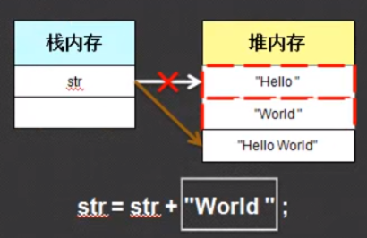
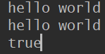
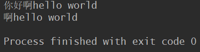

# StringBuffer类

String对象一经声明，便不能修改它的内容，修改的只是引用的地址；而StringBuffer对象是可以改变它的内容的

```java
  public static void main(String[] args) {
        String str= "hello ";
        System.out.println(System.identityHashCode(str));
        str=str+"world";
        System.out.println(System.identityHashCode(str));

        StringBuffer sb=new StringBuffer("hello ");
        System.out.println(System.identityHashCode(sb));
        sb.append("world");
        System.out.println(System.identityHashCode(sb));
    }
```


上面代码中的`System.identityHashCode()`返回的是对象的内存地址。可见，String字符串的内存地址改变了，而`StringBuffer`的内存地址并没有改变。说明修改String内容其实是引用关系的改变。原理如下图，其实是开辟了两个新的字符串堆内存，然后将String对象的内存地址改为"Hello world"字符串的地址，而旧的字符串并没有任何改变，也没有任何引用。这样就产生了两块垃圾空间。



### **StringBuffer的初始化**

`StringBuffer`不能像String那样直接用字符串赋值，所以也不能那样初始化。它需要通过构造方法来初始化，一共有4个构造方法

```java
public StringBuffer()
public StringBuffer(CharSequence seq)
public StringBuffer(int capacity)
public StringBuffer(String str)
```

### **StringBuffer和String的互换**

```java
1.String转换为StringBuffer有两种方法：

//（1）利用StringBuffer的构造方法：
public StringBuffer(String str)
    
//（2）利用StringBuffer的append()方法：
public StringBuffer append(String str)
   
2.StringBuffer转换为String也有两种方法：

//（1）利用StringBuffer的toString()方法：
public String toString()
    
//（2）利用String的构造方法：
public String(StringBuffer buffer)
```

**String类还提供了一个与StringBuffer对象作内容比较的方法**

```java
public boolean contentEquals(StringBuffer sb)
```



### StringBuffer的常用方法

```java
//1.将指定类型的数据追加到StringBuffer对象的末尾：
public StringBuffer append(T t)
    
//2.将指定类型的数据插入到StringBuffer序列指定位置：
public StringBuffer insert(int offset,T t)
    
//3.移除StringBuffer序列中的子字符串，从Start开始，到end-1的字符（注意不是字节，所以一个中文和一个英文都相当于一个字符）：
public StringBuffer delete(int start,int end)
```

测试

```java
   public static void main(String[] args) {
        StringBuffer sb=new StringBuffer("hello ");
        sb.append("world");
        sb.insert(0,"你好啊");
        System.out.println(sb);
        //删除[0,2)
        sb.delete(0,2);
        System.out.println(sb);
    }
```




# StringBuilder类

String类和StringBuffer类都是jdk1.0出现的，而StringBuilder是在jdk1.5出现的。StringBuilder拥有和StringBuilder一样的构造方法和方法函数，唯一不同的是StringBuffer是线程同步的安全操作，它的方法都被synchronized修饰，而StringBuilder是异步的。

## 总结
通常情况下涉及到字符串我们都使用String类，除非涉及到多次反复修改可以用StringBuffer或StringBuilder。

# Runtime类


# Runtime类与Process类


# Locale类


# System类


# 日期操作类


# Math类


# Random类


# NumberFormat类


# BigInteger类


# Bigdecimal类


# 对象克隆技术


# Arrays类


# Comparable接口


# Observable类和Observer接口


# 正则表达式


# 定时调度-Timer类、TimerTask类

