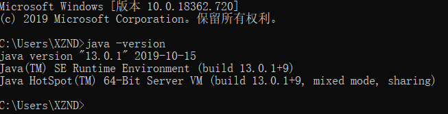
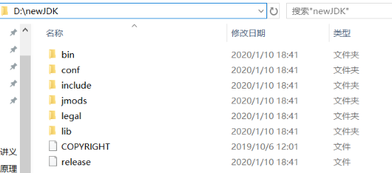
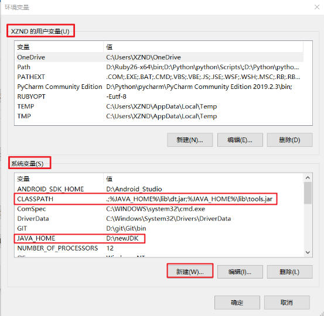
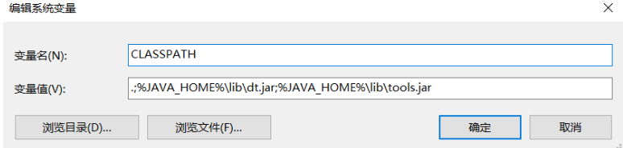
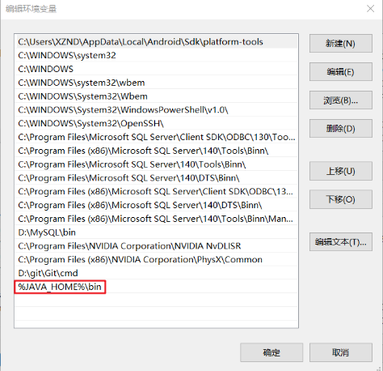
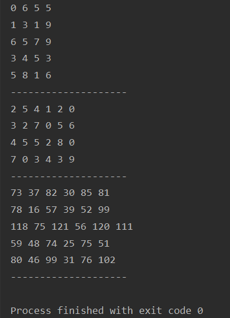

## JDK环境变量配置

- 查看JDK版本
  - `java -version`



- 注： -version是小写，不能使用大写，java后面有一个空格
- 配置成功后，会出现版本信息 **java version "13.0.1"**

### 下载，并解压到D:\newJDK



- 解压在一个自己喜欢的路径下都可以

### 环境变量配置

1. 右键我的电脑->属性->高级->环境变量->系统变量
   - 注意：是下面的**系统变量**，不是上面的用户变量
2. 新建变量名 JAVA_HOME，变量值:D:\newJDK



3. 点击新建如图

- 变量名：CLASSPATH
- 变量值：`.;%JAVA_HOME%\lib\dt.jar;%JAVA_HOME%\lib\tools.jar`
  - 注意不要少了前面的.和;



4. 找到Path点击编辑



- 在后面添加 `%JAVA_HOME%\bin ` 
  - 注意不需要添加;号，直接另起一行即点击新建添加即可

### 验证

- win+R键 输入cmd回车
- 分别输入`java` `javac` 查看安装是否完成

## Java入门

**8种基本数据类型和3种引用数据类型：**


**`public class XXX`和`class XXX`声明类的区别：**

-  如果一个类声明为public class，则文件名称必须和类名称一致，而且在一个类文件里只能有一个public class。如果使用class 声明一个类则文件名可以与类名称不一致，但是在执行时，必须执行生成的class文件名称。
-  除此之外，public class 和class还在包的访问上有所限制，如果一个类只在本包中访问不需要被外包访问，则直接声明成class即可，而如果一个类需要被外包访问则必须声明为public class。
-  

**字符类型：**

字符类型在内存中占两个字节，可以用来保存英文或其他字符，计算机处理字符时是把这些字符当作不同的整数来看待，所以字符也是整数类型的一种

```java
char ch1='a';
System.out.println((int)ch1); //97
char ch2=97;
System.out.println(ch2); //a
```

**逻辑运算符**

- 短路与：&&
  - 第一个条件为false后面的不再判断，第一个条件为true就继续判断第二个条件
  - 两个条件全真才真
- 短路或：||
  - 第一个条件为false继续判断第二个条件，第一个条件为true则不再判断
  - 两个条件一真则真
- 与：&
- 或：|

**区别：**

```java 
if (10!=10&10/0==0){
    System.out.println("条件满足");
}
```

与操作要把所有的条件进行判断，所以出现了报错


```java
if (10!=10&&10/0==0){
    System.out.println("条件满足");
}
```


短路与只对第一个情况判断后返回false就不再继续判断了，所以没报错

```java
if (10==10||10/0==0){
          System.out.println("条件满足");
      }
```


```java 
if (10==10|10/0==0){
          System.out.println("条件满足");
      }
```


原因同上

**快速计算2的3次方：位移计算**

```java
int x=2;
System.out.println(x<<2); //8
```

```java
int x=3;
System.out.println(x<<2); //12
```

**结论：每位移一次就要原来的数值就要乘2**

**循环的种类**：3种

1. do{}while{}

2. while{}

3. for{}

- 主要用后面两种循环，在不确定循环次数的情况下用while{}循环在确定循环次数的条件下用for{}循环

**循环的中断**

- break:
  - break语句可以强迫循环的中断，当程序执行到这个语句时就会离开循环继续执行循环外的下一个语句，如果break语句出现在嵌套循环中的内层循环则只会跳出当前循环

- continue语句：
  - continue语句可以强迫循环程序跳到循环的起始处，当程序运行到这个语句时即会停止循环的剩余主体回到循环的起点继续运行

**return语句的作用**

1.返回方法指定类型值

2.用于方法结束的标志,return被调用时后面的语句不会再执行，直接返回到函数调用处

```java
//无返回值类型的return语句
public static void main(String[] args)  {
    for (int i = 1; ; i++) {
        if (i == 4) {
            return;
        }
        System.out.println("i = " + i);
    }
}
```


```java
//有返回值的return语句
public static void main(String[] args)  {
    System.out.println(test());
}
//这里的方法必须声明为静态的，不然主函数不能调用
public static String test(){
    return "返回";
}
```


## 引用数据类型

- 引用数据类型为`java`两大数据类型之一，引用数据型在被床架时，首先要在栈上给其引用（句柄）分配一块内存，而对象的具体信息都存储在堆内存上，然后由栈上面的引用指向堆中对象的地址。

  **在栈内存中实际上是保存了堆内存的空间访问地址**

- 引用数据类型包括：类、接口类型、数组类型、枚举类型、注解类型，字符串型。


### 对象引用及对象赋值

 为便于说明，我们先定义一个简单的类： 

```java
class Vehicle {
    int passengers;      
    int fuelcap;
    int mpg;
}
```

 有了这个模板，就可以用它来创建对象：

- `Vehicle veh1 = new Vehicle();`

通常把这条语句的动作称之为创建一个对象，其实，它包含了四个动作。

1. 右边的“new Vehicle”，是以Vehicle类为模板，在堆空间里创建一个Vehicle类对象（也简称为Vehicle对象）
2. 末尾的()意味着，在对象创建后，立即调用Vehicle类的构造函数，对刚生成的对象进行初始化。构造函数是肯定有的。如果你没写，Java会给你补上一个默认的空构造函数。
3. 左边的`“Vehicle veh 1”`创建了一个Vehicle类引用变量。所谓Vehicle类引用，就是以后可以用来指向Vehicle对象的对象引用。
4. “=”操作符使对象引用指向刚创建的那个Vehicle对象。

- 我们可以把这条语句拆成两部分：

1.  ` Vehicle veh1;`

2. `veh1 = new Vehicle();`

>- 效果是一样的。这样写，就比较清楚了，有两个实体：一是对象引用变量，一是对象本身。
>
>- 在堆空间里创建的实体，与在数据段以及栈空间里创建的实体不同。尽管它们也是确确实实存在的实体，但是，我们看不见，也摸不着。不仅如此，我们仔细研究一下第二句，找找刚创建的对象叫什么名字？有人说，它叫“Vehicle”。不对，“Vehicle”是类（对象的创建模板）的名字。
>
>- 一个Vehicle类可以据此创建出无数个对象，这些对象不可能叫“Vehicle”。
>
>- 对象连名都没有，没法直接访问它。我们只能通过对象引用来间接访问对象。
>
>- 为了形象地说明对象、引用及它们之间的关系，可以做一个或许不很妥当的比喻。对象好比是一只很大的气球，大到我们抓不住它。引用变量是一根绳， 可以用来系汽球。
>
>- 如果只执行了第一条语句，还没执行第二条，此时创建的引用变量`veh1`还没指向任何一个对象，它的值是null。引用变量可以指向某个对象，或者为null。
>
>- 它是一根绳，一根还没有系上任何一个汽球的绳。执行了第二句后，一只新汽球做出来了，并被系在`veh1`这根绳上。我们抓住这根绳，就等于抓住了那只汽球。
>
>-    再来一句：
>
>  - ` Vehicle veh2;`
>
>  - 就又做了一根绳，还没系上汽球。如果再加一句：
>
>  - `veh2 = veh1;`
>
>- 系上了。这里，发生了复制行为。但是，要说明的是，对象本身并没有被复制，被复制的只是对象引用。结果是，`veh2`也指向了`veh1`所指向的对象。两根绳系的是同一只汽球。
>
>- 如果用下句再创建一个对象：
>  -  ` veh2 = new Vehicle();`则引用变量`veh2`改指向第二个对象。
>
>-  从以上叙述再推演下去，我们可以获得以下结论：
>  1. 一个对象引用可以指向0个或1个对象（一根绳子可以不系汽球，也可以系一个汽球）；
>  2. 一个对象可以有N个引用指向它（可以有N条绳子系住一个汽球）。
>
>- 如果再来下面语句：
>
>   ` veh1 = veh2;`
>
>- 按上面的推断，`veh1`也指向了第二个对象。这个没问题。问题是第一个对象呢？没有一条绳子系住它，它飞了。多数书里说，它被Java的垃圾回收机制回收了。这不确切。正确地说，它已成为垃圾回收机制的处理对象。至于什么时候真正被回收，那要看垃圾回收机制的心情了。
>
>- 由此看来，下面的语句应该不合法吧？至少是没用的吧？
>  - new Vehicle();
>
>- 不对。它是合法的，而且可用的。譬如，如果我们仅仅为了打印而生成一个对象，就不需要用引用变量来系住它。最常见的就是打印字符串：
>  -   ` System.out.println(“I am Java!”);`
>
>- 字符串对象“I am Java!”在打印后即被丢弃。有人把这种对象称之为临时对象。对象与引用的关系将持续到对象回收。

### 简要概括

>如下表达式： 
>A a1 = new A(); 
>它代表A是类，a1是引用，a1不是对象，new A()才是对象，a1引用指向new A()这个对象。 
>
>在JAVA里，“=”不能被看成是一个赋值语句，它不是在把一个对象赋给另外一个对象，它的执行过程实质上将右边对象的地址传给了左边的引用，使得左边的引用指向了右边的对象。JAVA表面上看起来没有指针，但它的引用其实质就是一个指针，引用里面存放的并不是对象，而是该对象的地址，使得该引用指向了对象。在
>
>JAVA里，“=”语句不应该被翻译成赋值语句，因为它所执行的确实不是一个赋值的过程，而是一个传地址的过程，被译成赋值语句会造成很多误解，译得不准确。 
>
>再如： 
>A a2; 
>它代表A是类，a2是引用，a2不是对象，a2所指向的对象为空null; 
>
>再如： 
>a2 = a1; 
>它代表，a2是引用，a1也是引用，a1所指向的对象的地址传给了a2(传址），使得a2和a1指向了同一对象。 
>
>综上所述，可以简单的记为，在初始化时，“=”语句左边的是引用，右边new出来的是对象。 
>在后面的左右都是引用的“=”语句时，左右的引用同时指向了右边引用所指向的对象。 
>
>再所谓实例，其实就是对象的同义词。

## 数组

数组属于引用数据类型，默认值为null，表示暂时还没有任何指向的内存空间，在`JDK1.5`后在声明数据变量时就不需要再给默认值了

```java 
方式一:
int arr[]=null;//声明数组
arr=new int[100];//分配内存给数组

方式二：
int[] arr =null;
```

**数据空间的堆栈解释**

数组操作中，在栈内存中保存的永远是数组的名称，只开辟了栈内存空间的数组是永远无法使用的，必须有指向堆内存的空间才可以使用，用new关键字开辟堆内存空间，而且一个堆内存空间可以被多个栈内存空间指向，堆内存空间就相当于人的实体，而栈内存空间就是一个人的名字，一个人可以有多个名字。


### **数组的冒泡排序法**

- **原理**
  比较两个相邻的元素，将值大的元素交换到右端。
- **思想**
  依此比较相邻两个数，小的数放在前面，大的数放在后面；
  第一趟比较第1，2个数，小前大后；比较第2，3个数，小前大后，直至比较到把其中最大数放到最右端；
  第一趟之后，最后一个一定最大，比较第二趟，第二趟第一个不参与，把第二大的数放到倒数第二个位置；
  第二趟之后，倒数第二个数第二大，第三趟最后两个数不参与；
  依此类推，每一趟比较次数-1


```java
public static void main(String[] args) {
    //数组的静态初始化，不用new关键字
    int score[] = {67, 88, 52, 43, 99, 34, 56};
    sort(score);
    print(score);
}
//从小到大输出数据
public static void sort(int temp[]){
    for (int i=0;i<temp.length;i++){
        for (int j=0;j<temp.length;j++){
            //数组第一个和第二个比较，要是大于就交换位置
            if (temp[j]>temp[j+1]){
                int x=temp[j];
                temp[j]=temp[j+1];
                temp[j+1]=x;
            }
        }
    }
}
public static void print(int temp[]){
    for (int i=0;i<temp.length;i++){
        System.out.print(temp[i]+" ");
    }
}
```


上面的比较算法存在问题，多比较了几次

```java
public static void sort(int temp[]){
    for (int i=0;i<temp.length-1;i++){
        for (int j=0;j<temp.length-1-i;j++){
            if (temp[i]<temp[j]){
                int x=temp[i];
                temp[i]=temp[j];
                temp[j]=x;
            }
        }
    }
}
```

**以6，3，8，2，9，1为例**


**总结前面的图解，数组长度设为n。外层共循环了n-1次，外层循环增加一次，对应内层循环就 减少一次。**
外层循环为：`for (int i = 0; i < arr.length-1; i++)`
内层循环为：`for (int j = 0; j < arr.length - 1 - i; j++)`

**备注**

- N个数字排序，进行 N-1趟排序
- 每趟排序次数为 N-i-1次
- 双重循环 外层控制趟数，内层控制每一趟排序次数

### 二维数组

- 根据给出的行和列分别生成两个随机的二维数组
- 将这两个二维数组当作矩阵相乘并输出结果

```java
public class Test {
    public final static int ROW_1 = 5;
    public final static int COL_1 = 4;
    public final static int ROW_2 = 4;
    public final static int COL_2 = 6;

    public static void main(String[] args) {
        //5行4列
        int[][] matrix_1 = initMatrix(ROW_1,COL_1);
        print(matrix_1);
        //4行6列
        int[][] matrix_2 = initMatrix(ROW_2,COL_2);
        print(matrix_2);
        //最终得到5行6列
        int[][] result = mulMatrix(matrix_1,matrix_2);
        print(result);
    }

    //初始化一个二维数组
    static int[][] initMatrix(int row, int col){
        int[][] matrix = new int[row][col];
        for (int i = 0; i < row; i++) {
            for (int j = 0; j < col; j++) {
                matrix[i][j] = (int) (Math.random()*10);
            }
        }
        return matrix;
    }

    //计算两个二维数组的乘积
    static int[][] mulMatrix(int[][] matrix_1, int[][] matrix_2){
        int[][] matrix = new int[matrix_1.length][matrix_2[0].length];

        //第一个二维数组的行
        for (int i = 0; i < matrix_1.length; i++) {
            //第二个二维数组的列
            for (int j = 0; j < matrix_2[0].length; j++) {
                //第一个二维数据的列或第二个二维数组的行都可以
                for (int k = 0; k < matrix_1[0].length; k++) {
                    //对应的行和列数据相乘的总和
                    matrix[i][j] += matrix_1[i][k] * matrix_2[k][j];
                }
            }
        }
        return matrix;
    }

    //打印二维数组
    static void print(int[][] matrix){
        for (int[] ints : matrix) {
            for (int anInt : ints) {
                System.out.print(anInt+" ");
            }
            System.out.println();
        }
        System.out.println("--------------------");
    }
}
```



## 面向对象

**三大特性：封装性、继承性、多态性**

1. 封装性：把描述对象属性的变量及实现功能的方法合在一起

2. 继承性：在拥有反映事物一般特性的类下在其基础上派生出反映特殊事物的类

3. 多态性：有方法重载和对象多态两种形式

### 多态

多态，简而言之就是同一个行为具有多个不同表现形式或形态的能力 。一个人可能是警察，可能是老师，也可能是学生，他们有共同点，但可以做不同的事

#### 向上转型

子类引用的对象转换为父类类型称为向上转型。通俗地说就是是将子类对象转为父类对象。此处父类对象可以是接口。 

```java
class Peopel {
    public void show(){
        System.out.println("我是人");
    }
}

class Teacher extends Peopel {
    public void show(){
        System.out.println("我是老师");
    }
}

class Student extends Peopel {
    public void show(){
        System.out.println("我是学生");
    }
    public void does(){
        System.out.println("打扫卫生");
    }
}

```

```java
public static void main(String[] args) {
    Peopel peopel=new Teacher();
    peopel.show();
    peopel=new Student();
    peopel.show();
}
//输出
//我是老师
//我是学生
```

也可以是

```java
public static void main(String[] args) {
    Peopel teacher=new Teacher();
    teacher.show();
    Peopel student=new Student();
    student.show();
    //向下转型后才能调用子类中定义的方法
    ((Student) student).does();
}
```

 这就是向上转型，`Peopel teacher=new Teacher()`;将子类对象Teacher转化为父类对象`Peopel`。这个时候`Peopel`这个引用调用的方法是子类方法。 

**转型过程中需要注意的问题**

- 向上转型时，子类单独定义的方法会丢失。
- 子类引用不能指向父类对象。`Teacher T = (Teacher)new Peopel()`这样是不行的

```java
Teacher T = (Teacher)new Peopel();
T.show();
```


**对象引用传递**

```java
Person p1=null;
Person p2=null;
p1=new Person();
p2=p1;
p1.name="刘坤龙";
p1.age=20;
System.out.println(p1);
System.out.println(p2);
}
```


所谓引用传递就将一个堆空间的使用权给多个栈空间，每个栈空间都可以修改堆内存的内容

**向上转型的好处**

- 减少重复代码，使代码变得简洁。
- 提高系统扩展性。


举个例子：比如我现在有很多种类的动物，要喂它们吃东西。如果不用向上转型，那我需要这样写： 

```java
public void eat(Cat c){
    c.eat();
}
public void eat(Dog d){
    d.eat();
}
//......
eat(new Cat());
eat(new Cat());
eat(new Dog());
//......
```

问题：

1. 一种动物写一个方法，如果我有一万种动物，我就要写一万个方法 

2. 突然又来了一种新的动物，又要单独为它写一个eat方法 

 **使用向上转型** 

```java
public void eat(Animal a){
    a.eat();
}
//...
eat(new Cat());
eat(new Cat());
eat(new Dog());
//.....
```

 这个时候，如果我又有一种新的动物加进来，我只需要实现它自己的类，让他继承Animal就可以了，而不需要为它单独写一个eat方法。提高了扩展性 

#### **向下转型**

- 向下转型的前提是父类对象指向的是子类对象（也就是说，在向下转型之前，它得先向上转型）
- 向下转型只能转型为本类对象（猫是不能变成狗的）。

```java
//喂动物吃饭，吃了饭做点什么呢？不同的动物肯定做不同的事
//调用的eat()一定是子类中覆写的方法
public void eat(Animal a){
    if(a instanceof Dog){  
        Dog d = (Dog)a;
        //狗有狗的吃法
        d.eat();
        d.run();//狗有一个跑的方法，必须向下转型后才能调用     
    } 
    if(a instanceof Cat){  
        Cat c = (Cat)a;
        //猫有毛的吃法
        c.eat();
        System.out.println("我也想跑，但是不会"); //猫会抱怨    
    } 
    a.eat();//动物都会吃，用牙齿嚼
}

eat(new Cat());
eat(new Dog());
eat(new Animal());
//.....
```

**多态实例分析**

```java
class Parent {
    public void show(Child child){
        System.out.println("parent and child");
    }

    public void show(){
        System.out.println("only parent");
    }
}

class Child extends Parent {
    public void show(Child c){
        System.out.println("child and child");
    }
    //向上转型后父类的引用不能调用该方法
    public void show(int i){

    }
}

class main{
    public static void main(String[] args) {
        Parent parent = new Child();
        parent.show(new Child());
        parent.show();
    }
}
//结果
//child and child
//only parent
```

Child继承了Parent，覆盖了Parent中的show（Child c)方法，但是没有覆盖show（）方法。

这个时候，引用类型为X的x指向的对象为Y，这个时候，调用的方法由Y决定，会先从Y中寻找。执行`parent.show(new Child());`，该方法在Y中定义了，所以执行的是Y里面的方法；

但是执行``parent.show();`的时候，有的人会说，Child中没有这个方法啊？它好像是去父类中找该方法了，因为调用了Parent中的方法。

事实上，Child类中是有show（）方法的，这个方法继承自Parent，只不过没有覆盖该方法，所以没有在Child中明确写出来而已，看起来像是调用了Parent中的方法，实际上调用的还是Child中的。

### 匿名对象

就是没有给出明确名字的对象，一般匿名对象只使用一次，而且匿名对象只在堆空间开辟空间，不存在栈的引用

```java 
//匿名对象
System.out.println(new Person("刘坤龙",20).toString());
```


### 内存区

- 常用内存区：

>- 栈内存空间：保存所有对象的名称，确切的说是保存引用的堆空间的地址
>- 堆内存空间：保存每个对象的具体属性内容
>- 全局数据区：保存static类型的属性
>- 全局代码区：保存所有的方法定义

## static关键字

1. static可以在声明属性的的时候使用，也可以用来声明方法，用它声明的方法叫类方法，可以由类名直接调用
2. static是不能调用任何非static内容的，因为在程序中所有的属性和方法都必须在对象开辟堆空间内存之后才可以调用，而static类型的方法在对象未被实例化时就可以被类名调用

**注意：**

由于被static修饰的变量和方法是不属于任何实例对象的，所以在这里，强烈建议不要通过对象的方式去访问静态的变量或者方法 

**总结：**

- 静态只能访问静态。
- 非静态既可以访问非静态的，也可以访问静态的。 

#### 特点

1. static可以修饰变量，方法。
2. 被static修饰的变量或者方法是独立于该类的任何对象，也就是说，这些变量和方法不属于任何一个实例对象，而是被类的实例对象所共享。
3. 在类被加载的时候，就会去加载被static修饰的部分。
4. 被static修饰的变量或者方法是优先于对象存在的，也就是说当一个类加载完毕之后，即便没有创建对象，也可以去访问。 

####  **static静态变量** 

- 被static修饰的成员变量叫做静态变量，也叫做类变量，说明这个变量是属于这个类的，而不是属于是对象，没有被static修饰的成员变量叫做实例变量，说明这个变量是属于某个具体的对象的。 

####  **静态变量和实例变量** 

**区别：**

- 实例变量：每次创建对象，都会为每个对象分配成员变量内存空间，实例变量是属于实例对象的，<u>在内存中，创建几次对象，就有几份成员变量</u>。

- 静态变量：静态变量由于不属于任何实例对象，是属于类的，所以在内存中只会有一份，在类的加载过程中，`JVM`为静态变量分配一次内存空间。


#### 理解main()方法

1. `public`：此方法可以被外部调用

2. `static`：此方法可以由类名直接调用

3. `void`：主方法是程序的起点所以不需要任何返回值

4. `main`：系统规定好默认调用方法的名称，执行的时候默认找到main()方法名称

5. `String[] args`：表示的是运行时的参数，参数的传递形式为“`java` 类名称 参数1 参数2 参数3...”

```java
public class Demo {
    public static void main(String[] args) {
        if (args.length!=3){
            System.out.println("输入三个参数");
            //查看java器的默认字符集
            //在输出框显示的是UTF-8，在命令框显示GBK
            System.out.println(Charset.defaultCharset());

            System.exit(1);
        }
        else {
            System.out.println("right");
        }
    }
}
```


直接运行是不行的，需要在命令框窗口运行

1. 打开`cmd`窗口，切换到该`Demo.java`所在文件路径下

2. 运行```javac Demo.java -encoding UTF-8```,如果该文件目录里出现`Demo.class`文件则编译成功

3. 运行`java Demo lkl jjj ppp`后面三个是要输入的参数，用空格隔开

## javac和java命令 

`javac`是`java compiler`(`java`编译器)的命令，是将`.java`文件编译成`.class`文件的过程。我们需要先将文件读入内存，才能进行编译 

 读入内存需要知道文件的编码格式，才能正确的将文件读取。我们查看一下`java`源文件的编码，发现是`UTF-8`。而`java`编译器默认的字符集可以通过如下代码查看。 

```java
System.out.println(Charset.defaultCharset());
```

问题：

如果没有使用`-encoding UTF-8`，那么输出的数据中则不能有中文符号，否则会出现乱码的情况。


出现了中文乱码

` java`编译器认为文件采用`GBK`编码，而实际上文件是采用`UTF-8`编码。然后“你确”两个字的`UTF-8`码值，转换成`GBK`就是"姝 g ‘ "

` javac`只会按照默认的系统编码来编，这个时候如果文件编码不同，就出现这个问题了。 

解决：

1. 如果文件是`UTF-8`编码的，我们使用`-encoding UTF-8 `来显式指定为`UTF-8`的编码格式 
2. 将文件改为`GBK`编码，如果使用windows自带的记事本，保存为ANSI，中国区域会使用`GBK`编码。如果使用其它高级文本编辑工具，如：`notepad++、Emeditor、UE`这样的，另存为指定格式。 


**参数传递的形式：**

`java` 类名称 参数1 参数2 参数3.....


## 代码块

四种代码块

代码块是指用{}括起来的一段代码

**构造块：**优先于构造方法执行，而且每次实例化对象的时候都会执行构造块中的代码

```java
{
    System.out.println("1.我是代码块");
}
public Person(String name,int age){
    this.name=name;
    this.age=age;
    System.out.println("2.我是构造函数");
}
//Person person0=new Person("lkl",20);
```

**普通代码块：**进行程序分割

**静态代码块**：优先于主方法执行，在类中定义的静态代码块优先于代码块执行，而且不管有多少对象产生，只执行一次

```java
public class Demo {
    static {
        System.out.println("1. I am Tom");
    }
    public static void main(String[] args) {
        System.out.println("2. I am Tom");
   }
}
```

**同步代码块：**

## 单例设计模式

只要将构造函数私有化了就可以控制函数的产生

```java
private  String name;
private int age;
//用private将构造方法进行封装
private Person(String name,int age){
    this.name=name;
    this.age=age;
    System.out.println("我是构造函数");
}
//在内部产生本类的实例化对象，将属性进行封装
private static Person superman=new Person("刘坤龙",20);
//通过静态方法取得Person实例
public static Person getSuperman() {
    return superman;
}
```

```java
public static void main(String[] args) {
    Person p1=Person.getSuperman();
    Person p2=Person.getSuperman();
    Person p3=Person.getSuperman();
    System.out.println(p1);
    System.out.println(p2);
    System.out.println(p3);
}
```


意义：

随时上面的程序声明了3个Person的对象，但实际上所有的对象都只使用了superman一个引用，也就是说不管外面如何使用最终结果也只是有一个实例化对象存在

## 内部类

内部类可以方便的访问外部类中的私有属性，同时，外部类也可以方便的访问内部类中的私有属性，这样就可以避免封装所带来的操作结构复杂的问题

```java
//外部类
class Outer {
    private String info="hello";
    //内部类
    class Inner{
        //内部类方法
        public void print(){
            System.out.println(info);
        }
    }
    //外部类方法
    public void  fun(){
        new Inner().print();
    }
}
```

```java
public static void main(String[] args) {
    new Outer().fun();
}
```

**输出：**hello


不能直接通过外部类直接访问内部类的方法，但是可以通过外部类创建内部类，再由内部类调用自己的方法

**在外部访问内部类**

```java
Outer outer=new Outer();
Outer.Inner inner=outer.new Inner();
inner.print();
```

1.先创建外部类实例

2.由外部类实例new出内部类实例

外部类.内部类 内部类对象名=外部类实例.new 内部类();

**使用static定义内部类**

static可以声明属性和方法，也可以声明内部类

用static声明的内部类则变成外部类，用static声明的内部类不能访问非static的外部类属性

## 继承

- 构造方法用来初始化类的对象，与父类的其它成员不同，它不能被子类继承（子类可以继承父类所有的成员变量和成员方法，但不继承父类的构造方法）。因此，在创建子类对象时，为了初始化从父类继承来的数据成员，系统需要调用其父类的构造方法。

- 如果没有显式的构造函数，编译器会给一个默认的构造函数，并且该默认的构造函数仅仅在没有显式地声明构造函数情况下创建。

**注意：**

**显示继承**：所有非私有操作属于显示继承（可以直接调用）。
**隐式继承**：所有私有操作属于隐式继承（不可以直接调用，需要通过其它形式调用（get或者set））。

 Java中不允许多重继承，但是允许多层继承！多层继承一般不会超过三层  

父类

```java
public Person(String name,int age){
    this.name=name;
    this.age=age;
    System.out.println("我是构造函数");
}
```

子类

```java
class Boy extends Person {
    Boy(String name, int age) {
        //如果删除父类的调用就报错
        super(name, age);
        System.out.println("haha");
    }
}
```

如果父类构造函数带参数，那必须在子类构造函数中调用以初始化父类属性，而父类中构造函数没有带参数也需要在子类中调用，但不需要显示调用，系统会自动调用

```java
//不报错
class Boy extends Person {
    Boy(String name, int age) {
        //可加可不加
        //super();
        System.out.println("haha");
    }
}
```

此时父类中的属性以及方法均被子类所继承，但是发现子类能够使用的是所有非private操作，而所有的private操作无法被直接使用，所以称为隐式继承。 

### 经典例子

```java
class A{
    public A()
    {
        System.out.println("1.A类的构造方法");
    }
    {
        System.out.println("2.A类的构造块");
    }
    static{
        System.out.println("3.A类的静态方法");
    }
}
```

```java
public class B extends A {
    public B() {
        System.out.println("4.B类的构造方法");
    }

    {
        System.out.println("5.B类的构造块");
    }

    static {
        System.out.println("6.B类的静态方法");
    }

    public static void main(String[] args) {
        System.out.println("7.start......");
        new B();
        new B();
        System.out.println("8.end.....");
    }
}
```


### this和super

| 区别点   | this                                   | super                            |
| -------- | -------------------------------------- | -------------------------------- |
| 属性访问 | 访问本类的属性，如果没有则从父类中查找 | 访问父类的属性                   |
| 方法     | 访问本类的放法，如果没有则从父类中查找 | 访问父类中的方法                 |
| 调用构造 | 调用本类函数的构造，必须放在首行       | 调用父类函数的构造，必须放在首行 |
| 特殊     | 表示当前对象                           | 无                               |

两者都可以调用构造方法而且必须放在首行，所以不能同时出现

### final

1. 使用final声明的类不能有子类
2. 使用final声明的方法不能被子类所复写
3. 使用final声明的变量即成为常量，常量不可以被修改

用final标记的东西都成为唯一的，只能用不能改

```java
public final void print(){
    System.out.println("输出");
}
```


### 抽象类

1. 包含一个抽象方法的类必须是抽象类
2. 抽象类和抽象方法都要使用abstract关键字声明
3. 抽象方法只需声明而不需要实现
4. 抽象类必须被子类继承，子类如果不是抽象类必须覆写抽象类中的全部抽象方法

**普通类与抽象类的最大区别：**

在普通类中可以子类选择性的覆写父类的方法，但抽象类中子类**必须覆写全部**的父类的方法

> 抽象类中不能用final关键字声明，抽象类也有类的结构，可以有构造方法
>
> 抽象类和普通类比较只是多了抽象方法

**提示：**子类继承父类，也会继承下父类的访问权限为公有的方法，然后子类使用同样的方法名，而执行自己的方法体，我们称为方法的重写(override)，这里我们就注意到，子类在继承抽象类后，我们来完成方法体，**用的是“实现”而不是“重写”** 

**抽象类的作用和意义：**

当在抽象业务代码的时候，就很有用了。比如说，我们抽象出一个功能给其他人用，假如功能里我们要用到上面的Parent类，我只需要直接使用Parent类就好，而其中具体的实现我们自己也不知道，就可以定义成抽象方法让使用者去实现

### 接口

接口可以理解为一种特殊的类，里面全是由**全局变量和公共的抽象方法**所组成的

```java
interface  A {
    public static final String NAME="刘坤龙";
    public abstract void print();
}
```

可简化为：

```java
interface  A {
    String NAME="刘坤龙";
    void print();
}
```

接口里的抽象方法必须定义成public访问权限，这是绝对不可能改变的，在接口中如果不写public权限，则也是public访问权限

## 抽象类和接口

| **参数**           | **抽象类**                                                   | **接口**                                                     |
| ------------------ | ------------------------------------------------------------ | ------------------------------------------------------------ |
|                    | 模板设计                                                     | 工厂设计、代理设计                                           |
| 实际               | 作为一个模板                                                 | 作为一个标准或是表达一种能力                                 |
| 默认的方法实现     | 它可以有默认的方法实现                                       | 接口完全是抽象的。它根本不存在方法的实现                     |
| 实现               | 子类使用**extends**关键字来继承抽象类。如果子类不是抽象类的话，它需要提供抽象类中所有声明的方法的实现。 | 子类使用关键字**implements**来实现接口。它需要提供接口中所有声明的方法的实现 |
| 构造器             | 抽象类可以有构造器                                           | 接口不能有构造器                                             |
| 与正常Java类的区别 | 除了你不能实例化抽象类之外，它和普通Java类没有任何区别       | 接口是完全不同的类型                                         |
| 访问修饰符         | 抽象方法可以有**public**、**protected**和**default**这些修饰符 | 接口方法默认修饰符是**public**。你不可以使用其它修饰符。     |
| main方法           | 抽象方法可以有main方法并且我们可以运行它                     | 接口没有main方法，因此我们不能运行它。（java8以后接口可以有default和static方法，所以可以运行main方法） |
| 多继承             | 抽象方法可以继承一个类和实现多个接口                         | 接口只可以继承一个或多个其它接口                             |
| 速度               | 它比接口速度要快                                             | 接口是稍微有点慢的，因为它需要时间去寻找在类中实现的方法。   |
| 添加新方法         | 如果你往抽象类中添加新的方法，你可以给它提供默认的实现。因此你不需要改变你现在的代码。 | 如果你往接口中添加方法，那么你必须改变实现该接口的类。       |

**什么时候使用抽象类和接口**

- 如果你拥有一些方法并且想让它们中的一些有默认实现，那么使用抽象类吧。
- 如果你想实现多重继承，那么你必须使用接口。由于**Java不支持多继承**，子类不能够继承多个类，但可以实现多个接口。因此你就可以使用接口来解决它。
- 如果基本功能在不断改变，那么就需要使用抽象类。如果不断改变基本功能并且使用接口，那么就需要改变所有实现了该接口的类。

**抽象类和接口的使用时机**

- 要解决上面的问题，我们先从弄清楚抽象类和接口之间的关系。首先，我们都知道类对事物的抽象，定义了事物的属性和行为。而抽象类是不完全的类，具有抽象方法。接口则比类的抽象层次更高。所以，我们可以这样理解它们之间的关系：**类是对事物的抽象，抽象类是对类的抽象，接口是对抽象类的抽象。** 

- 在设计类的时候，首先考虑用接口抽象出类的特性，当你发现某些方法可以复用的时候，可以使用抽象类来复用代码。简单说，**接口用于抽象事物的特性，抽象类用于代码复用**。 

**实例运用**

```java
abstract class People {
    private String name;
    private int age;
    People (){
    }
    public void say(){
        sayContent();
    }
    abstract void sayContent();
}

class Student extends People {
    @Override
    void sayContent() {
        System.out.println("好好学习，天天向上");
    }
}

class Work extends People {
    @Override
    void sayContent() {
        System.out.println("赚钱养家");
    }
}

public class Demo {
    public static void main(String[] args) {
        //通过子类对象为抽象类实例化
        People student=new Student();
        student.say();
        Student stu=new Student();
        stu.sayContent();
        People work=new Work();
        work.say();
    }
}
```


人和工人都可以说话这是具体的，但是说话的内容是什么不知道，这是抽象的，就知道他们可以说话，具体说话内容由他们确定，只需要实现后抽象类实例化后就可以调用子类中覆写的方法，就可以知道说的内容

```java
People student=new Student();
student.say();
Student stu=new Student();
stu.sayContent();
```

不转换为父类的引用也可以获得说话的内容，但抽象类其实是思想的表达，我把我想要得到的动作表示出来，就像这个我想要得到说话的内容，那么你具体的子类就给我去实现，然后我就可以知道我到底是什么身份，我具体的说话内容是什么，向上转型不是必须的，但是一直抽象类思想的体现，而且我们也应该这么做

这是一种**模板设计**，在Person中就相当于定义了一个模板，在主方法调用的就是普通方法，而子类只需要实现父类中的抽象方法就可以取得一个具体的信息

### 接口类定义的加强

从`JDK1.8`开始可以在接口中定义普通方法（使用default声明）与静态方法（使用static声明）

```java
interface  Msg {
    static void say(){
        System.out.println("我是接口静态方法");
    }
    default void fun(){
        System.out.println("我是普通方法");
    }
    void info();
    String name="lkl";
}
```

```java
public class My implements Msg {
    @Override
    public void info() {
        System.out.println("我是重写的抽象方法");
    }
}
```

```java
public class Demo {
    public static void main(String[] args) {
        My my=new My();
        my.info();
        my.fun();
        Msg.say();
        System.out.println(Msg.name);
    }
}

```


### 工厂设计模式

**简单了解**

 水果接口 

```csharp
public interface Fruit {
    void whatIm();
}
```

 具体类 苹果 

```java
public class Apple implements Fruit {
    @Override
    public void whatIm() {
        //苹果
    }
}
```

 具体类 梨 

```java
public class Pear implements Fruit {
    @Override
    public void whatIm() {
        //梨
    }
}
```

 具体工厂 水果工厂 

```csharp
public class FruitFactory {

    public Fruit createFruit(String type) {

        if (type.equals("apple")) {//生产苹果
            return new Apple();
        } else if (type.equals("pear")) {//生产梨
            return new Pear();
        }

        return null;
    }
}
```

 产品使用 

```cpp
 FruitFactory mFactory = new FruitFactory();
 Apple apple = (Apple) mFactory.createFruit("apple");//获得苹果
 Pear pear = (Pear) mFactory.createFruit("pear");//获得梨
```

就这样，一个非常简单的工厂设计模式就完成了，但是有没有发现什么问题呢？
对，那就是如果我想吃香蕉，想吃橘子呢，我万一什么都想吃呢？？所以，以上的这种方式，每当我想添加一种水果，就必然要修改工厂类，这显然违反了开闭原则，亦不可取；所以简单工厂只适合于产品对象较少，且产品固定的需求，对于产品变化无常的需求来说显然不合适

### 代理模式

## Object类

Object类常用方法

```java
public class Object {
    //构造方法
    @HotSpotIntrinsicCandidate
    public Object() {}

    //对象比较
    public boolean equals(Object obj) {
        return (this == obj);
    }

    //取得Hash码
    @HotSpotIntrinsicCandidate
    public native int hashCode();

    //对象打印时调用
    public String toString() {
        return getClass().getName() + "@" + Integer.toHexString(hashCode());
    }

    public final native void notify();

    public final native void notifyAll();
```

**主要方法**

```java
public static void main(String[] args) {
    My my = new My();
    System.out.println(my);
    System.out.println(my.toString());
}
```


从输出结果来看加`toString()`与不加效果都一样，也就是说对象输出的时候一定会调用Object类得`toString()`方法打印内容

所以对这个方法进行重写后就能打印出我们想要输出的对象格式

**Object类提供的equals()方法默认是比较地址**

实际是String类也是Object类的子类，String类中已经实现好了此方法用于内容的比较，在Object中的equals()实际上也是可以使用的，但是其默认使用是按地址比较，并不能对内容进行比较

**可以接收任意引用类型的对象**

## 包装类

在`java`的设计思想中提倡一切皆对象，这样就会出现一个矛盾，从数据类型的划分来看，`java`中的数据类型分为基本数据类型和引用数据类型，但是基本数据类型怎么能够成为对象呢，那么就需要把`java`中的八种基本数据类型变成一个类的形式， 在设计类时为每个基本数据类型设计了一个对应的包装类， （**`Wrapper Class`**），他们之间的对应关系如下表 

| 基本数据类型 | 包装类    | 基本数据类型 | 包装类  |
| ------------ | --------- | ------------ | ------- |
| int          | Integer   | float        | Float   |
| char         | Character | double       | Double  |
| short        | Short     | boolean      | Boolean |
| long         | Long      | byte         | Byte    |

**装箱与拆箱**


 在`Java SE5`之前，如果要生成一个数值为10的Integer对象 

```java
Integer i = new Integer(10);
```

 从`Java SE5`开始就提供了**自动装箱**的特性，如果生成一个数值为10的Integer对象 

```java
Integer i = 10;
```

 这个过程中会自动根据数值创建对应的Integer对象，这就是**装箱**。那么什么是**拆箱**呢，顾名思义，跟装箱对应，就是自动将包装器类型转换为基本数据类型： 

```java
Integer i = 10 //装箱
int n = i; //拆箱
```

 简单一点说，**装箱就是自动将基本数据类型转换为包装器类型**；**拆箱就是自动将包装器类型转换为基本数据类型**。 


 **要点：在装箱的时候调用的是`Integer`的`valueOf(int)`方法。而在拆箱的时候自动调用的是`Integer`的`intValue`方法** 

#### 第一个例子

```java
public class Demo {
    public static void main(String[] args) {
        //Java SE5开始就提供了自动装箱的特性
        Integer i1 = 100;
        Integer i2 = 100;
        Integer i3 = 200;
        Integer i4 = 200;

        System.out.println(i1==i2);
        System.out.println(i3==i4);
    }
}
```


why？

```java
//Integer中的静态内部类
private static class IntegerCache {
    static final int low = -128;
    static final int high;
    static final Integer cache[];

    static {
        // high value may be configured by property
        int h = 127;
        String integerCacheHighPropValue =
            VM.getSavedProperty("java.lang.Integer.IntegerCache.high");
        if (integerCacheHighPropValue != null) {
            try {
                int i = parseInt(integerCacheHighPropValue);
                i = Math.max(i, 127);
                // Maximum array size is Integer.MAX_VALUE
                h = Math.min(i, Integer.MAX_VALUE - (-low) -1);
            } catch( NumberFormatException nfe) {
                // If the property cannot be parsed into an int, ignore it.
            }
        }
        high = h;

        cache = new Integer[(high - low) + 1];
        int j = low;
        for(int k = 0; k < cache.length; k++)
            cache[k] = new Integer(j++);

        // range [-128, 127] must be interned (JLS7 5.1.7)
        assert Integer.IntegerCache.high >= 127;
    }

    private IntegerCache() {}
}

public static Integer valueOf(int i) {
    if (i >= IntegerCache.low && i <= IntegerCache.high)
        return IntegerCache.cache[i + (-IntegerCache.low)];
    return new Integer(i);
}
```

从源码中我们可以得知，在**通过`valueOf`方法创建`Integer`对象的时候，如果数值在[`-128`,`127`]之间，便返回指向`IntegerCache.cache`中已经存在的对象的引用，否则创建一个新的`Integer`对象**。

 所以上面例子中`i1`和`i2`指向的是同一个对象，而`i3`和`i4`则分别指向不同的对象。 

#### 第二个例子

```java
public class Demo {
    public static void main(String[] args) {
        Double i1 = 100.0;
        Double i2 = 100.0;
        Double i3 = 200.0;
        Double i4 = 200.0;

        System.out.println(i1 == i2);
        System.out.println(i3 == i4);
    }
}
```


```java
public static Double valueOf(double d) {
    return new Double(d);
}
```

double类型进行装箱操作是直接创建并返回一个新的Double对象，每个对象的内存地址都是不相同的。

#### 第三个例子

```java
public class Main {
    public static void main(String[] args) {
        Boolean b1 = false;
        Boolean b2 = false;
        Boolean b3 = true;
        Boolean b4 = true;

        System.out.println(b1 == b2);
        System.out.println(b3 == b4);
    }
}
```


```java
public static final Boolean TRUE = new Boolean(true);
public static final Boolean FALSE = new Boolean(false);

public static Boolean valueOf(boolean b) {
    return (b ? TRUE : FALSE);
}
```

#### 自动装箱与非自动装箱

`Integer i = new Integer(xxx)`和 `Integer i = xxx`两种方式的区别
 这个题目可以从多个角度切入，但是**自动装/拆箱**的要点一定要答上，例如：

1. 第一种方式不会触发自动装箱的过程；而第二种方式会触发；
2. 在执行效率和资源占用上的区别。第二种方式的执行效率和资源占用在一般情况下要优于第一种情况（注意这并不是绝对的）。

#### 练习

- 当**`==`**运算符的两个操作数**都是包装类的引用时比较的是它们是否指向同一个引用**，而如果**其中有一个操作数是表达式（包含算术运算）则比较的是数值**（即触发自动拆箱的过程）。

- 对于包装类，**`equals`方法并不会进行类型转换**。

```java
public static void main(String[] args) {

    Integer a = 1;
    Integer b = 2;
    Integer c = 3;
    Integer d = 3;
    Integer e = 321;
    Integer f = 321;
    Long g = 3L;
    Long h = 2L;


    System.out.println(c == d);//true
    System.out.println(e == f);//false
    System.out.println(c == (a + b));//true
    System.out.println(c.equals(a + b));//true
    System.out.println(g == (a + b));//true
    System.out.println(g.equals(a + b));//false
    System.out.println(g.equals(a + h));//true
}
```


**分析：**

1. 首先前两个结果相信没有什么异议。第三个由于`a+b`是一个算术运算，因此会触发自动拆箱，最终比较的是数值，所以结果为`true`，`g == (a + b)`同理。
2. 再来说下第四个，首先`a+b`最终得到的是一个`Integer`类型的值，然后再执行`equals`方法，后面两个同理。

#### 总结

-  **装箱**就是自动将基本数据类型转换为包装器类型；**拆箱**就是自动将包装器类型转换为基本数据类型。
-  **装箱过程是通过调用包装器的`valueOf`方法实现的，二拆箱是通过调用包装器的`xxxValue`方法实现的**。（`xxx`代表对应的基本数据类型）
-  **`Integer`、`Short`、`Byte`、`Character`、`Long`**这几个类的**`valueOf`**方法的实现是**类似的**，**`Double`、`Float`**的`valueOf`方法的实现是类似的。**`Boolean`**定义了两个静态常量当做缓存。
-  `xxxCache`存在的意义：提高效率，避免多次重复创建相同对象了。
-  当**`==`**运算符的两个操作数**都是包装类的引用时比较的是它们是否指向同一个引用**，而如果**其中有一个操作数是表达式（包含算术运算）则比较的是数值**（即触发自动拆箱的过程）。
-  对于包装类，**`equals`方法并不会进行类型转换**

#### 包装类的应用

```java
public static void main(String[] args) {
    //由数字组成的字符串
    String str1="20";
    String str2="20.0";
    //将字符串变为int型
    int i=Integer.parseInt(str1);
    //将字符串变为float型
    float j=Float.parseFloat(str2);
    System.out.println("乘法="+i*i);
    System.out.println("加法="+(j+j));
}
```


## 匿名内部类 

匿名内部类也就是没有名字的内部类

正因为没有名字，所以匿名内部类只能使用一次，它通常用来简化代码编写

但使用匿名内部类还有个前提条件：必须继承一个父类或实现一个接口

注意事项：

**1、**使用匿名内部类时，我们必须是继承一个类或者实现一个接口，但是两者不可兼得，同时也只能继承一个类或者实现一个接口。

**2、**匿名内部类中是不能定义构造函数的。

**3、**匿名内部类中不能存在任何的静态成员变量和静态方法。

**4、**匿名内部类为局部内部类，所以局部内部类的所有限制同样对匿名内部类生效。

**5、**匿名内部类不能是抽象的，它必须要实现继承的类或者实现的接口的所有抽象方法

#### 实例1:不使用匿名内部类来实现抽象方法

```java
abstract class Person {
    public abstract void eat();
}

class Child extends Person {
    public void eat() {
        System.out.println("eat something");
    }
}

public class Demo {
    public static void main(String[] args) {
        Person p = new Child();
        p.eat();
    }
}

//运行结果：eat something
```

可以看到，我们用Child继承了Person类，然后实现了Child的一个实例，将其向上转型为Person类的引用

但是，如果此处的Child类只使用一次，那么将其编写为独立的一个类岂不是很麻烦？

这个时候就引入了匿名内部类 

#### 实例2：匿名内部类的基本实现

```java
abstract class Person {
    public abstract void eat();
}

public class Demo {
    public static void main(String[] args) {
        Person p = new Person() {
            public void eat() {
                System.out.println("eat something");
            }
        };
        p.eat();
    }
}

//运行结果：eat something
```

可以看到，我们直接将抽象类Person中的方法在大括号中实现了

这样便可以省略一个类的书写

并且，匿名内部类还能用于接口上

 #### 实例3：在接口上使用匿名内部类 

 ```java
interface Person {
    public void eat();
}


public class Demo {
    public static void main(String[] args) {
        Person p = new Person() {
            public void eat() {
                System.out.println("eat something");
            }
        };
        p.eat();
    }
}

//运行结果：eat something
 ```

由上面的例子可以看出，只要一个类是抽象的或是一个接口，那么其子类中的方法都可以使用匿名内部类来实现

最常用的情况就是在多线程的实现上，因为要实现多线程必须继承Thread类或是继承Runnable接口

 #### 实例4：`Thread`类的匿名内部类实现 

```java
public class Demo {
    public static void main(String[] args) {
        Thread t=new Thread(){
            public void run(){
                for (int i=0;i<5;i++){
                    System.out.println(Thread.currentThread().getName()+i);
                }
            }
        };
        t.setName("线程A");
        t.start();
    }

}
```


####  实例5：`Runnable`接口的匿名内部类实现 

直接实例化接口对象 

形如

```java
New A{...}
```

```java
public class Demo {
    public static void main(String[] args){
        //匿名内部类
        Runnable t=new Runnable() {
            @Override
            public void run() {
                for (int i=0;i<5;i++){
                    System.out.println(Thread.currentThread().getName()+i);
                }
            }
        };
        Thread thread=new Thread(t,"线程A");
        thread.start();
    }
}
```


# Scanner类

- 创建Scanner对象的基本语法

```java
Scanner input = new Scanner(System.in);
```

- 两个常用方法

````java
String str1 = input.next();
String str2 = input.nextLine();
````

- next():

>1. 一定要读取到有效字符后才可以结束输入。以空格、回车、Tab键都会视为结束符。
>2. 对输入有效字符之前遇到的空白，next() 方法会自动将其去掉。
>3. 只有输入有效字符后才将其后面输入的空白作为分隔符或者结束符。        
>4.  next() 不能得到带有空格的字符串。

- nextLine()：


>1. 以Enter为结束符,也就是说 nextLine()方法返回的是输入回车之前的所有字符。
>2. 可以获得空白。

- 注意：建议能不使用就尽量不要使用nextLine()。尽量使用next。因为有时会出现吃回车现象。

```java
Scanner input = new Scanner(System.in);
String str1 = input.next(); //不会吃回车符,只是把回车符之前的有效数据赋值给str1
String str2 = input.nextLine(); //上个方法的回车符留下来了,nextLine()方法检测到结束标准直接退出,这个回车符被吃掉,不会再往下传
System.out.println(str1); //会输出
System.out.println(str2); //不会输出
```

- 修改

```java
Scanner input = new Scanner(System.in);
String str1 = input.next();
input.nextLine();//吃掉上个方法留下来的回车符
String str2 = input.nextLine();//没有检测到方法结束标准，正常运行
System.out.println(str1);//正常输出
System.out.println(str2);//正常输出
```

# JAVA命名规范

1. 类：所有的首字母大写。如MyTest
2. 方法：第一个单词的字母小写，之后每个单词的首字母大写。如`getName()`
3. 属性：第一个单词的字母小写，之后每个单词的首字母大写.如`studentName`
4. 包：所有的单词字母小写
5. 常量：所有单词字母大写

# 面向对象思想

- 类（Class）和对象（Object）是面向对象的核心概念。
- 类是对一类事物的描述，是抽象的、概念上的定义
- 对象是实际存在的该类事物的每个个体，因而也称为实例（instance）。
- “万事万物皆对象”

## 理解“万事万物皆对象”

1. 在Java语言范畴中，我们都将功能、结构等封装到类中，通过类的实例化，来调用具体的功能结构
2. 涉及到Java语言与前端Htm1、后端的数据库交互时，前后端的结构在Java层面交互时，都体现为类、对象。

# JavaBean

- JavaBean是一种Java语言写成的可重用组件。
- 所谓javaBean，是指符合如下标准的Java类：

>- 类是公共的
>- 有一个无参的公共的构造器
>- 有属性，且有对应的get、set方法

- 用户可以使用JavaBean将功能、处理、值、数据库访问和其他任何可以用Java代码创造的对象进行打包，并且其他的开发者可以通过内部的JSP页面、Servlet、其他JavaBean、applet程序或者应用来使用这些对象。用户可以认为JavaBean提供了一种随时随地的复制和粘贴的功能，而不用关心任何改变。

# 关于进制

- 所有数字在计算机底层都以二进制形式存在。
- 对于整数，有四种表示方式：

>- 二进制（binary）：0，1，满2进1
> - 以Ob或0B开头。
>- 十进制（decimal）：0-9，满10进1。
>- 八进制（octal）：0-7，满8进1
> - 以数字0开头表示。
>- 十六进制（hex）：0-9及A-F，满16进1
> - 以0x或0X开头表示。此处的A-F不区分大小写。如：0x21AF+1=0X21B0

## 二进制

- Java整数常量默认是int类型，当用二进制定义整数时，其第32位是符号位；当是long类型时，二进制默认占64位，第64位是符号位
- 二进制的整数有如下三种形式：

>- 原码：直接将一个数值换成二进制数。最高位是符号位
>- 负数的反码：是对原码按位取反，只是最高位（符号位）确定为1
>- 负数的补码：其反码加1

- 计算机以二进制补码的形式保存所有的整数

>- 正数的原码、反码、补码都相同
>- 负数的补码是其反码+1