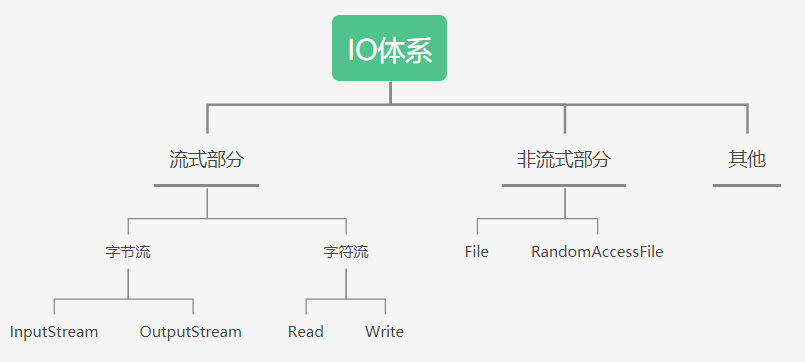
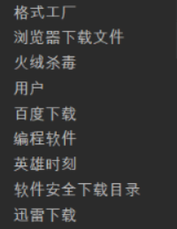

# IO流

- 流的概念和作用：
  - 流：代表任何有能力产出数据的数据源对象或者是有能力接受数据的接收端对象
  - 流的本质：数据传输，根据数据传输特性将流抽象为各种类，方便更直观的进行数据操作。
  - 流的作用：为数据源和目的地建立一个输送通道。

>Java中将输入输出抽象称为流，就好像水管，将两个容器连接起来。流是一组有顺序的，有起点和终点的字节集合，是对数据传输的总称或抽象。即数据在两设备间的传输称为流。



## IO流常用到的五类一接口

>在整个Java.io包中最重要的就是5个类和一个接口。5个类指的是File、OutputStream、InputStream、Writer、Reader；一个接口指的是Serializable.掌握了这些IO的核心操作那么对于Java中的IO体系也就有了一个初步的认识了。

|        类        |      说明      |    操作特点    |
| :--------------: | :------------: | :------------: |
|       File       |     文件类     | 文件特征与管理 |
| RandomAccessFile | 随机存取文件类 |  随机文件操作  |
|   InputStream    |   字节输入流   | 二进制格式操作 |
|   OutputStream   |   字节输出流   | 二进制格式操作 |
|      Reader      |   字符输入流   |  文件格式操作  |
|      Writer      |   字符输出流   |  文件格式操作  |

1. File：用于文件或者目录的描述信息，例如生成新目录，修改文件名，删除文件，判断文件所在路径等。
2. InputStream：抽象类，基于字节的输入操作，是所有输入流的父类。定义了所有输入流都具有的共同特征。
3. OutputStream：抽象类。基于字节的输出操作。是所有输出流的父类。定义了所有输出流都具有的共同特征。
4. Reader：抽象类，基于字符的输入操作。
5. Writer：抽象类，基于字符的输出操作。
6. RandomAccessFile：一个独立的类，直接继承至Object.它的功能丰富，可以从文件的任意位置进行存取（输入输出）操作。

## IO所采用的模型

- Java的IO模型设计非常优秀，它使用Decorator(装饰者)模式，按功能划分Stream，您可以动态装配这些Stream，以便获得您需要的功能。
- 例如，您需要一个具有缓冲的文件输入流，则应当组合使用FileInputStream和BufferedInputStream。

## IO流的分类

1. 按数据流的方向分为 输入流、输出流

- 此输入、输出是相对于我们写的代码程序而言，
- 输入流：从别的地方(本地文件，网络上的资源等)获取资源 输入到 我们的程序中
- 输出流：从我们的程序中 输出到 别的地方(本地文件)， 将一个字符串保存到本地文件中，就需要使用输出流。


2. 按处理数据单位不同分为 字节流、字符流 

- 1字符 = 2字节 、 1字节(byte) = 8位(bit) 、 一个汉字占两个字节长度
- 字节流：每次读取(写出)一个字节，当传输的资源文件有中文时，就会出现乱码
- 字符流：每次读取(写出)两个字节，有中文时，使用该流就可以正确传输显示中文


3. 按功能不同分为 节点流、处理流

- 节点流：以从或向一个特定的地方（节点）读写数据。如FileInputStream　
- 处理流：是对一个已存在的流的连接和封装，通过所封装的流的功能调用实现数据读写。如BufferedReader。处理流的构造方法总是要带一个其他的流对象做参数。一个流对象经过其他流的多次包装


4. 4个基本的抽象流类型，所有的流都继承这四个。

|        | 输出流      | 输入流       |
| ------ | ----------- | ------------ |
| 字节流 | InputStream | outputStream |
| 字符流 | Reader      | Writer       |


## 使用场景

- 什么时候用字节流，什么时候该用输出流呢？

>1. 首先自己要知道是选择输入流还是输出流，这就要根据自己的情况而定，如果你想从程序写东西到别的地方，那么就选择输出流，反之用输入流.
>2. 然后考虑你传输数据时，是选择使用字节流传输还是字符流，也就是每次传1个字节还是2个字节，有中文肯定就选择字符流了。
>3. 前面两步就可以选出一个合适的节点流了，比如字节输入流inputStream，如果要在此基础上增强功能，那么就在处理流中选择一个合适的即可。
>4. 对于文本文件，使用字符流处理，如
>   - .txt、.java、.c、.cpp文件等
>5. 对于非文本文件，使用字符流处理，如
>   - .jpg、,mp3、.mp4、.avi、.doc、.ppt文件等

- 字符流的由来： Java中字符是采用Unicode标准，一个字符是16位，即一个字符使用两个字节来表示。为此，JAVA中引入了处理字符的流。因为数据编码的不同，而有了对字符进行高效操作的流对象。本质其实就是基于字节流读取时，去查了指定的码表。

## File类

>- java.io.File类：文件和文件目录路径的抽象表示形式，与平台无关
>- File 能新建、删除、重命名文件和目录，但File不能访问文件内容本身。如果需要访问文件内容本身，则需要使用输入/输出流
>- 想要在Java程序中表示一个真实存在的文件或目录，那么必须有一个File对象，但是Java程序中的一个File对象，可能没有一个真实存在的文件或目录
>- File对象可以作为参数传递给流的构造器

- File类的常用构造器

>- 绝对路径：是一个固定的路径，从盘符开始
>- 相对路径：是相对于某个位置开始

```java
//以pathname为路径创建File对象，可以是绝对路径或者相对路径，如果pathname是相对路径，则默认的当前路径在系统属性user.dir中存储。
public File（String pathname）
```

```java
//以parent为父路径，child为子路径创建File对象。
public File（String parent，String child）
```

```java
//根据一个父File对象和子文件路径创建File对象
public File（File parent，String child）
```

### 常用方法一

```java
- public String getAbsolutePath（）：//获取绝对路径
- public string getPath（）：//获取路径
- public string getName（）：//获取名称
- public string getParent（）：//获取上层文件目录路径。若无，返回nulL 
- public long Length（）：//获取文件长度（即：字数）。不能获取目录的长度。
- public Long LastModified（）：//获取最后一次的修改时间，毫秒值
- public string[]List（）：//获取指定目录下的所有文件或者文件目录的名称数组
- public File[]listFiles（）：//获取指定目录下的所有文件或者文件目录的File数组
- public boolean rename To（File dest）：// 把文件重命名为指定的文件路径比如：以file1.renameTo(file2)为例，要想保证返回true，需要file1在硬盘中是存在的，且file2不能在硬盘中存在。相当于是剪切粘贴后重命名
```

### 常用方法二

```java
public boolean isDirectory（）：//判断是否是文件目录
public boolean isFile（）：//判断是否是文件
public boolean exists（）：//判断是否存在
public boolean canRead（）：//判断是否可读
public boolean canwrite（）：//判断是否可写
public boolean isHidden（）：//判断是否隐藏
```

### File类的创建功能

```java
public boolean createNewFile（）：//创建文件。若文件存在，则不创建，返回false 
public boolean mkdir（）：//创建文件目录。如果此文件目录存在，就不创建了。如果此文件目录的上层目录不存在，也不创建。
public boolean mkdirs（）：//创建文件目录。如果上层文件目录不存在，一并创建意事项：如果你创建文件或者文件目录没有写盘符路径，那么，默认在项目径下。
```

### File类的删除功能

```java
public boolean delete（）：//删除文件或者文件夹
```

- 删除注意事项：

>- Java中的删除不走回收站
>- 要删除一个文件目录，请注意该文件目录内不能包含文件或者文件目录

### 1.创建一个text.txt文件夹

- File类对象代表一个文件或文件目录(俗称：文件夹)

```java
public class demo {
    public static void main(String[] args) {
        File file=new File("d:\\test.txt");//实例化File类对象，必须给出文件完整路径
        try {
            //根据给定的路径创建一个新文件
            //1.如果d盘下test.txt这个文件夹之前并不存在，运行后则创建，返回true
            //2.如果已经该路径下已经存在该文本则不再重复创建，返回flase           
             System.out.println(file.createNewFile());/
        } catch (IOException e) {
            e.printStackTrace();
        }
    }
}
```

因为在不同的操作系统中文件的分隔符不一样,把上述操作方式改为：更合适,File.separator这个函数就是取得本机操作系统的分隔符

```java
//组合出符合操作系统的路径
String path="d:"+File.separator+"test.txt";
//给出路径实例化File对象
File file=new File(path);
```

### 2.关于转义字符

- **右斜杠需要转义**

```java
System.out.println("\\");//  输出 \        
System.out.println("/"); //  输出 /        
System.out.println("//");//  输出 //     
System.out.println("\'");//  输出 '       
System.out.println("\"");//  输出 "
//   \n 换行
//   \r 回车
//   \t 水平制表（调到下一个TAB位置）
```

### 3.删除文件

判断文件是否存在exists()，然后delete()删除文件

```java
if (file.exists()){
    file.delete();
}
```

### 4.创建文件夹

```java
file.getParentFile() //就是取得最后一个目录的上级目录路径
```

```java
String path="d:"+File.separator+"mldn";
File file=new File(path);
//判断父目录是否存在   d:\
if (file.getParentFile().exists()){
    //创建文件夹
    file.mkdir();
}
```

- mkdir()和mkdirs()的区别

>- mkdir()是创建单级目录：必须要在父目录存在的情况下才会创建文件夹
>  - 如果mldn文件夹不存在那lkl文件夹就不会被创建

```java
String path="d:"+File.separator+"mldn"+File.separator+"lkl";
File file=new File(path);
file.mkdir();
```

>- mkdirs()是创建多级目录：mldn文件夹不存在也有效,会创建d:\mldn\lkl的分级目录

```java
String path="d:"+File.separator+"mldn"+File.separator+"lkl";
File file=new File(path);
file.mkdirs();
```

### 5.列出目录文件

1.先找到一个文件路径，再把这个文件路径下的所有子路径找到

2.调用list()方法列出目录文件

```java
File file = new File("d:"+File.separator);
String[] list = file.list();
if (list!=null){
    for (String s : list) {
        //只列出文件名，没有文件路径的详细信息
        System.out.println(s);
    }
}
```



**列出文件路径**

```java
File file = new File("d:"+File.separator);
File[] files = file.listFiles();
if (files != null){
    for (File file1 : files) {
        //打印的是File对象
        System.out.println(file1);
    }
}
```


**判断给定的路径是不是目录**

```java
File file=new File("d:"+File.separator);
if (file.isDirectory()){
    System.out.println(file.getPath()+"是目录");
}
else {
    System.out.println(file.getPath()+"不是");
}
```

**输出：** d:\是目录

```java
File file=new File("d:/text.txt");
```

**输出**： d:\text.txt不是目录

### 6.列出指定目录的全部内容

* 要求：把给定路径下的所有非目录文件全部输出

* 采用了递归调用，判断为目录时就继续调用自身函数继续往下找目录，若判断不是目录就打印输出

  ```java
public class demo {
      public static void main(String[] args) {
          File file=new File("F:"+File.separator+"小软件");
          print(file);
  
      }
      public static void print(File file){
          if (file!=null && file.isDirectory()){
              File[] files = file.listFiles();
              if (files != null){
                  for (File value : files) {
                      //递归
                      print(value);
                  }
              }
          }
          System.out.println(file);
      }
  }
  
  ```

### 7.统计一个工程文件下代码的行数

```java
public static int countAll(File file) {
    int count = 0;
    if (file != null && file.isDirectory()) {
        File[] files = file.listFiles();
        if (files != null) {
            for (File value : files) {
                //递归
                countAll(value);
            }
        }
    }
    //判断后缀是否为.java文件
    if (file != null && file.getName().endsWith("java")) {
        try (BufferedReader reader = new BufferedReader(new FileReader(file))) {
            while (reader.readLine() != null) {
                count++;
            }
        } catch (IOException e) {
            e.printStackTrace();
        }
        System.out.println(file + " 有效行数=" + count);
        countAll += count;
    }
    return countAll;
}
```

---

```java
public class Test {
    private static int countAll = 0;
    public static void main(String[] args) throws Exception {
        File fileA = new File("D:\\MyJavaProject\\课程需要\\src");
        System.out.println("总行数 = " + countAll(fileA));
    }
}
```


### 8.利用File构造器，new一个文件目录file

>1. 在其中创建多个文件和目测
>2. 编写方法，实现删除file中指定文件的操作


### 9.判断指定目录下是否有后缀名为.jpg的文件，如果有，就输出该文件名称


### 10.遍历指定目录所有文件名称，包括子文件目录中的文件

>- 拓展1：并计算指定目录占用空间的大小
>- 拓展2：删除指定文件目录及其下的所有文件


### File类小结

>- File类的一个对象，代表一个文件或一个文件目录（俗称：文件夹）
>- File类声明在java.io包下
>- File类中涉及到关于文件或文件目录的创建、删除、重命名、修改时间、文件大小等方法，并未涉及到写入或读取文件内容的操作。如果需要读取或写入文件内容，必须使用IO流来完成。
>- 后续File类的对象常会作为参数传递到流的构造器中，指明读取或写入的"终点"

## IO流原理

>- I/O是Input/Output的缩写，I/O技术是非常实用的技术，用于处理设备之间的数据传输。如读/写文件，网络通讯等。
>- Java程序中，对于数据的输入/输出操作以"流（stream）"的方式进行。
>-  java.io包下提供了各种“流”类和接口，用以获取不同种类的数据，并通过标准的方法输入或输出数据。

- 输入input：读取外部数据（磁盘、光盘等存储设备的数据）到程序（内存）中。
- 输出output：将程序（内存）数据输出到磁盘、光盘等存储设备中。

## 流的分类

- 按操作数据单位不同分为：字节流（8bit），字符流（16bit）
- 按数据流的流向不同分为：输入流，输出流
- 按流的角色的不同分为：节点流(直接作用在文件上的流)，处理流(在节点流的基础上在加一层修饰流)

>- 输入流(抽象基类)
>  - 字节流 InputStream
>  - 字符流 Reader
>- 输出流(抽象基类)
>  - 字节流 OutputStream 
>  - 字符流 Writer

- Java的IO流共涉及40多个类，实际上非常规则，都是从如下4个抽象基类派生的。
- 由这四个类派生出来的子类名称都是以其父类名作为子类名后缀。

## 字节流和字符流

>- 程序中的所有数据都是以流的方式进行传输和保存的
>- 字节流：数据流中最小的数据单元是字节
>- 字符流：数据流中最小的数据单元是字符， Java中的字符是Unicode编码，一个字符占用两个字节

### 常用方法

#### Inputstream

```java
//一次读取一个字节
int read()

// 从输入流中读取b.lenght()数量的字节，并将其存储在缓冲区数组b中;返回每次读入b数组的字节的个数;如果达到文件末尾，返回-1
int read(byte[] b)

// 将输入流中最多 len 个数据字节读入 byte 数组
int read(byte[] b, int off, int len)

// 跳过和丢弃此输入流中数据的 n个字节
long skip(long n)

// 关闭此输入流并释放与该流关联的所有系统资源
    void close()
```

---

```java
static void test(File file) throws IOException {
    File file = new File("test.txt");
    //test.txt里是able刘
    InputStream in = new FileInputStream(file);
    int len; 
    while ((len = in.read()) != -1) {
        System.out.println(len + " " + (char) len);
    }
    System.out.println(len);  //最后输出-1
}
```


- 由输出情况我们可以看到in.read()是逐个字节读取的，一个单词占一个字节，所以总共读取了4次。
- 返回的结果是字符对应的ASCLL码数值
- 因为有一个中文字符，一个中文字符可能由几个字节组成，这里是一个字节一个字节的读取，所以出现了乱码的现象

---

```java
static void test1(File file) throws IOException {
    InputStream in = new FileInputStream(file);
    byte[] bytes = new byte[(int) file.length()];
    if (in.read(bytes) != -1) {
        System.out.println(new String(bytes));
    }
}
```


- in.read(bytes)方法只执行了一次，就是一次性读取bytes大小的字节，由于我们创建的bytes的大小就是文件的大小，所以一次性就读取结束了，方法运行一次，这样的方式中文字符也能成功读取

---

```java
static void test1(File file) throws IOException {
    //File file = new File("test.txt");
    //test.txt里是车轮滚滚
    InputStream in = new FileInputStream(file);
    //一次性读取3个字节
    byte[] bytes = new byte[3];
    while (in.read(bytes) != -1) {
        System.out.println(new String(bytes));
    }
}
```


- 总共读取了四次，每一次都成功读取，说明该操作系统下一个中文字符占3个字节
- 修改`byte[] bytes = new byte[2];`一次只读两个字节，满足不了中文字符的情况，必然出现乱码


- 修改`byte[] bytes = new byte[4];`


- 总结：最好的方式还是 `byte[] bytes = new byte[(int) file.length()];`进行一次性读取，避免乱码的情况

#### Outputstream

```java
    //将 b.length 个字节从指定的 byte 数组写入此输出流
    void write(byte[] b)
        
    // 将指定 byte 数组中从偏移量 off 开始的 len 个字节写入此输出流
    void write(byte[] b, int off, int len)
        
    // 将指定的字节写入此输出流
    abstract void write(int b)

    // 关闭此输出流并释放与此流有关的所有系统资源
    void close()

    // 刷新此输出流并强制写出所有缓冲的输出字节
    void flush()
```

#### FileInputStream

- **异常的处理：为了保证流资源一定可以执行关闭操作。需要使用try-catch-finally**
- **读入的文件一定要存在，否则就会报FileNotFoundException。**

- 字节文件输入流，从文件系统中的某个文件中获得输入字节，用于读取诸如图像数据之类的原始字节流。

-  构造方法：

```java
// 通过打开一个到实际文件的连接来创建一个FileInputStream，该文件通过文件系统中的File对象file指定
FileInputStream(File file)
// 通过打开一个到实际文件的连接来创建一个FileInputStream，该文件通过文件系统中的路径name指定
FileInputStream(String name)
```

- 常用方法：read()

```java
// 读取f盘下该文件f://hell/test.txt，里面存储着ABCD
//构造方法1
InputStream inputStream = new FileInputStream(new File("f://hello//test.txt"));
int i = 0;
//一次读取一个字节
while ((i = inputStream.read()) != -1) {

    // System.out.print(i + " ");// 65 66 67 68
    //为什么会输出65 66 67 68？因为字符在底层存储的时候就是存储的数值。即字符对应的ASCII码。
    System.out.print((char) i + " ");// A B C D
}
//关闭IO流
inputStream.close();
```

- 常用方法：read(byte[] b)

---

```java
@Test
public void byteTest() throws IOException {
    FileInputStream in = new FileInputStream(new File("src\\test.txt"));
    byte[] bytes =new byte[3];
    int len;
    //一次性最多读取3个字节长度的字节数据到bytes数组中
    while ((len = in.read(bytes)) != -1){
        System.out.println("len的长度 = "+len); //len最多返回3
        System.out.println(new String(bytes,0,len)); //把bytes中0-len的数据转换为字符串
    }
    in.close();
}
```

- 注： 一次读取一个字节数组，提高了操作效率,IO流使用完毕一定要关闭。

#### FileOutputStream

- 说明：

>1. 输出操作，对应的File可以不存在的。并不会报异常
>2. File对应的硬盘中的文件如果不存在，在输出的过程中，会自动创建此文件。
>3. File对应的硬盘中的文件如果存在：
>   - 如果流使用的构造器是：Filewriter(file,false) / Filewriter(file)：原文件会被覆盖
>   - 如果流使用的构造器是：Filewriter(file,true)：不会对原有文件覆盖，而是在原有文件的基础上追加内容

- 字节文件输出流是用于将数据写入到File，从程序中写入到其他位置。

- 构造方法：

```java
    // 创建一个向指定File对象表示的文件中写入数据的文件输出流
    FileOutputStream(File file)
    // 创建一个向指定File对象表示的文件中写入数据的文件输出流
    FileOutputStream(File file, boolean append)
    // 创建一个向具有指定名称的文件中写入数据的输出文件流
    FileOutputStream(String name)
    // 创建一个向具有指定name的文件中写入数据的输出文件流
    FileOutputStream(String name, boolean append)
```

- 常用方法：覆盖和重写了父类的的常用方法。

```java
OutputStream outputStream = new FileOutputStream(new File("test.txt"));
// 写出数据
outputStream.write("ABCD".getBytes());
// 关闭IO流
outputStream.close();

// 内容追加写入
OutputStream outputStream2 = new FileOutputStream("test.txt", true);
// 输出换行符
outputStream2.write("\r\n".getBytes());
// 输出追加内容
outputStream2.write("hello".getBytes());
// 关闭IO流
outputStream2.close();
```

- 注；输出的目的地文件不存在，则会自动创建，不指定盘符的话，默认创建在项目目录下;输出换行符时一定要写\r\n不能只写\n,因为不同文本编辑器对换行符的识别存在差异性。

#### BufferedInputStream（高效流）

- 字节缓冲输入流，提高了读取效率。
- 构造方法：

```java
// 创建一个 BufferedInputStream并保存其参数，即输入流in，以便将来使用。
BufferedInputStream(InputStream in)
// 创建具有指定缓冲区大小的 BufferedInputStream并保存其参数，即输入流in以便将来使用
BufferedInputStream(InputStream in, int size)
```

---

```java
InputStream in = new FileInputStream("test.txt");
// 字节缓存流
BufferedInputStream bis = new BufferedInputStream(in);
byte[] bs = new byte[20];
int len = 0;
while ((len = bis.read(bs)) != -1) {

    System.out.print(new String(bs, 0, len));
    // ABCD
    // hello
}
// 关闭流
bis.close();
```

#### BufferedOutputStream

- 字节缓冲输出流，提高了写出效率。
-  构造方法：

```java
// 创建一个新的缓冲输出流，以将数据写入指定的底层输出流
BufferedOutputStream(OutputStream out)
// 创建一个新的缓冲输出流，以将具有指定缓冲区大小的数据写入指定的底层输出流
BufferedOutputStream(OutputStream out, int size)
```

-  常用方法：

```java
// 将指定 byte 数组中从偏移量 off 开始的 len 个字节写入此缓冲的输出流
void write(byte[] b, int off, int len)
// 将指定的字节写入此缓冲的输出流
void write(int b)
// 刷新此缓冲的输出流
void flush()
```

---

```java
BufferedOutputStream bos = new BufferedOutputStream(new FileOutputStream("test.txt", true));
// 输出换行符
bos.write("\r\n".getBytes());
// 输出内容
bos.write("Hello Android".getBytes());
// 刷新此缓冲的输出流
bos.flush();
// 关闭流
bos.close();
```

#### Reader

- 读取字符流的抽象类.
-  常用方法：

```java
    // 读取单个字符
    int read()
    // 将字符读入数组
    int read(char[] cbuf)
    // 将字符读入数组的某一部分
    abstract int read(char[] cbuf, int off, int len)
    // 跳过字符
    long skip(long n)
    // 关闭该流并释放与之关联的所有资源
    abstract void close()
```

---

```java
static void test2(File file) throws IOException {
    Reader reader = new FileReader(file);
    int len;
    while ((len = reader.read()) != -1) {
        System.out.println(len + " " + (char) len);
    }
    reader.close();
    System.out.println(len);
}
```

- reader.read()：一次读取一个字符
- 返回的结果是字符对应的ASCLL码数值


- 总共读取了5次，无乱码现象

---

```java
static void test3(File file) throws IOException {
    Reader reader = new FileReader(file);
    char[] chars = new char[(int) file.length()];
    if (reader.read(chars) != -1) {
        System.out.println(new String(chars));
    }
    reader.close();
}
```

- reader.read(chars)：一次性读取chars数值大小的字符


#### Writer

- 写入字符流的抽象类.
-  常用方法：

```java
    // 写入字符数组
    void write(char[] cbuf)
    // 写入字符数组的某一部分
    abstract void write(char[] cbuf, int off, int len)
    // 写入单个字符
    void write(int c)
    // 写入字符串
    void write(String str)
    // 写入字符串的某一部分
    void write(String str, int off, int len)

    // 将指定字符添加到此 writer
    Writer append(char c)
    // 将指定字符序列添加到此 writer
    Writer append(CharSequence csq)
    // 将指定字符序列的子序列添加到此 writer.Appendable
    Writer append(CharSequence csq, int start, int end)

    // 关闭此流，但要先刷新它
    abstract void close()
    // 刷新该流的缓冲
    abstract void flush()
```

#### InputStreamReader

- 字节流转字符流，它使用的字符集可以由名称指定或显式给定，否则将接受平台默认的字符集。
-  构造方法：

```java
   // 创建一个使用默认字符集的 InputStreamReader
    InputStreamReader(InputStream in)
    // 创建使用给定字符集的 InputStreamReader
    InputStreamReader(InputStream in, Charset cs)
    // 创建使用给定字符集解码器的 InputStreamReader
    InputStreamReader(InputStream in, CharsetDecoder dec)
    // 创建使用指定字符集的 InputStreamReader
    InputStreamReader(InputStream in, String charsetName)
```

- 特有方法：

```java
//返回此流使用的字符编码的名称 
String getEncoding() 
```

---

```java
//使用默认编码        
InputStreamReader reader = new InputStreamReader(new FileInputStream("test.txt"));
int len;
while ((len = reader.read()) != -1) {
    System.out.print((char) len);//爱生活，爱Android

}
reader.close();

//指定编码 
InputStreamReader reader = new InputStreamReader(new FileInputStream("test.txt"),"utf-8");
int len;
while ((len = reader.read()) != -1) {
    System.out.print((char) len);//????????Android
}
reader.close();
```

#### OutputStreamWriter

- 字节流转字符流。
- 构造方法：

```java
    // 创建使用默认字符编码的 OutputStreamWriter
    OutputStreamWriter(OutputStream out)
    // 创建使用给定字符集的 OutputStreamWriter
    OutputStreamWriter(OutputStream out, Charset cs)
    // 创建使用给定字符集编码器的 OutputStreamWriter
    OutputStreamWriter(OutputStream out, CharsetEncoder enc)
    // 创建使用指定字符集的 OutputStreamWriter
    OutputStreamWriter(OutputStream out, String charsetName)
```

- 特有方法：

```java
//返回此流使用的字符编码的名称 
String getEncoding() 
```

#### BufferedReader（高效流）

- 字符缓冲流，从字符输入流中读取文本，缓冲各个字符，从而实现字符、数组和行的高效读取。
-  构造方法：

```java
    // 创建一个使用默认大小输入缓冲区的缓冲字符输入流
    BufferedReader(Reader in)
    // 创建一个使用指定大小输入缓冲区的缓冲字符输入流
    BufferedReader(Reader in, int sz)
```

- 特有方法

```java
// 读取一个文本行
String readLine()
```

---

```java
//生成字符缓冲流对象
BufferedReader reader = new BufferedReader(new InputStreamReader(new FileInputStream("test.txt")));
String str;
//一次性读取一行
while ((str = reader.readLine()) != null) {
    System.out.println(str);// 爱生活，爱Android
}

//关闭流
reader.close();
```

#### BufferedWriter

- 字符缓冲流，将文本写入字符输出流，缓冲各个字符，从而提供单个字符、数组和字符串的高效写入。
-  构造方法：

```java
// 创建一个使用默认大小输出缓冲区的缓冲字符输出流
BufferedWriter(Writer out)
// 创建一个使用给定大小输出缓冲区的新缓冲字符输出流
BufferedWriter(Writer out, int sz)
```

- 特有方法

```java
// 写入一个行分隔符
 void newLine() 
```

### 输入流和输出流

- 根据数据的输入、输出方向的不同对而将流分为输入流和输出流。
- 把自己当成程序， 当你从外边读数据到自己这里就用输入（InputStream/Reader）， 向外边写数据就用输出（OutputStream/Writer）。

#### 1.输入流

- 程序从输入流读取数据源。数据源包括外界(键盘、文件、网络…)，即是将数据源读入到程序的通信通道


#### 2.输出流

- 程序向输出流写入数据。将程序中的数据输出到外界（显示器、打印机、文件、网络…）的通信通道。


#### 3.特性

- 相对于程序来说，输出流是往存储介质或数据通道写入数据，而输入流是从存储介质或数据通道中读取数据，一般来说关于流的特性有下面几点：
  1. 先进先出，最先写入输出流的数据最先被输入流读取到。
  2. 顺序存取，可以一个接一个地往流中写入一串字节，读出时也将按写入顺序读取一串字节，不能随机访问中间的数据。（RandomAccessFile可以从文件的任意位置进行存取（输入输出）操作）
  3. 只读或只写，每个流只能是输入流或输出流的一种，不能同时具备两个功能，输入流只能进行读操作，对输出流只能进行写操作。在一个数据传输通道中，如果既要写入数据，又要读取数据，则要分别提供两个流。

### IO操作的步骤

>1.使用File类打开一个文件
>
>2.通过字节流或字符流的子类指定输出的位置
>
>3.进行读/写操作
>
>4.关闭输入/输出

### 字节流

#### 字节输出流OutputStream

```java
public abstract class OutputStream implements Closeable, Flushable {
    public abstract void write(int b) throws IOException;
    public void write(byte b[]) throws IOException {
        write(b, 0, b.length);
    }
    public void flush() throws IOException {
    }
    public void close() throws IOException {
    }
}
```

- 继承了关闭和刷新的接口，里面带有写，关闭和刷新的方法，又是抽象类，必须通过子类来实例化

**通过write(byte b[])写入文件内容**

```java
//通过File类找到了一个文件
File file=new File("d:"+File.separator+"test.txt");
//准备好一个输出的对象
OutputStream out=null;
try {
    //通过对象的多态性向上转型进行实例化
    out=new FileOutputStream(file);
    //要输出的数据
    String str="Hello World";
    //只能输出byte[]数组
    byte b[]=str.getBytes();
    //讲内容输入
    out.write(b);
    //关闭输出流
    out.close();
} catch (FileNotFoundException e) {
    e.printStackTrace();
} catch (IOException e) {
    e.printStackTrace();
}
```

- 简化代码

```java
public static void main(String[] args) throws Exception {
    File file = new File("d:" + File.separator + "test.txt");
    OutputStream out = null;
    out = new FileOutputStream(file);
    String str = "Hello World!";
    byte[] b = str.getBytes();
    out.write(b);
    out.close();
}
```

- 上述代码在实例化，写，关闭的时候都有异常发生，为了方便，直接在主方法使用throws关键字抛出异常可以减小try...catch...的使用。但是不建议使用，抛出异常后会导致流关闭操作不能执行，导致资源的浪费 。

**通过write(int b)写入文件**

```java
File file = new File("d:" + File.separator + "test.txt");
OutputStream out = null;
out = new FileOutputStream(file);
String str = "Hello World";
byte b[] = str.getBytes();
//与上面的代码唯一不同之处，只是换成将byte[]数值里的数据一个一个的写入文件中，最终的实现效果是相同的
for (int i=0;i<b.length;i++){
    out.write(b[i]);
}
out.close();
```

#### 追加新内容：

>- 按上述方法进行文件操作新内容的输入会默认覆盖旧内容

- FileOutputStream有多种构造方法

```java
public FileOutputStream(String name) throws FileNotFoundException {
    this(name != null ? new File(name) : null, false);
}
```

```java
public FileOutputStream(String name, boolean append)
    throws FileNotFoundException
{
    this(name != null ? new File(name) : null, append);
}
```

- 使用第二种构造方法将append的值设置为true即可实现追加新数据

```java
File file = new File("d:" + File.separator + "test.txt");
OutputStream out = null;
//仅仅需要在后面再加一个参数true即可
out = new FileOutputStream(file,true);
String str = "Hello World!!!";
byte b[] = str.getBytes();
out.write(b);
out.close();
```

- 如何写入换行:都可以

```java
String str = "\r Hello World!!!";
```

```java 
String str = "\n Hello World!!!";
```

#### 字节输入流InputStream


- ByteArrayInputStream：字节数组输入流，该类的功能就是从字节数组(byte[])中进行以字节为单位的读取，也就是将资源文件都以字节的形式存入到该类中的字节数组中去，我们拿也是从这个字节数组中拿
- PipedInputStream：管道字节输入流，它和PipedOutputStream一起使用，能实现**多线程间的管道通信**
- FilterInputStream ：装饰者模式中处于装饰者，具体的装饰者都要继承它，所以在该类的子类下都是用来装饰别的流的，也就是处理类。具体装饰者模式在下面会讲解到，到时就明白了
- **BufferedInputStream**：缓冲流，对处理流进行装饰，增强，内部会有一个缓存区，用来存放字节，每次都是将缓存区存满然后发送，而不是一个字节或两个字节这样发送。效率更高
- **DataInputStream**：数据输入流，它是用来装饰其它输入流，它“允许应用程序以与机器无关方式从底层输入流中读取基本 Java 数据类型”
- FileInputSream：文件输入流。它通常用于对文件进行读取操作
- File：对指定目录的文件进行操作，具体可以查看讲解File的博文。注意，该类虽然是在IO包下，但是并不继承自四大基础类。
- ObjectInputStream：对象输入流，用来提供对“基本数据或对象”的持久存储。通俗点讲，也就是能直接传输对象（反序列化中用）

**测试：**

```java
//先找到文件
File file = new File("d:" + File.separator + "test.txt");
//准备好输入对象
InputStream inputStream=null;
//实例化输入对象
inputStream=new FileInputStream(file);
//准备字节数组把所有内容读到此数组中
byte b[]=new byte[80];
//把内容取出装进数组里面
inputStream.read(b);
//关闭输入流
inputStream.close();
//把字节数组转换为字符串输出
System.out.println(new String(b));
```


开辟的byte数组空间有80，但是实际却用不了这么多，最后再转换为字符串输出时也把空出来的多余空间转换为字符串了

**修改**

```java
File file = new File("d:" + File.separator + "test.txt");
InputStream inputStream=null;
inputStream=new FileInputStream(file);
byte b[]=new byte[80];
//InputStream类里重载了3个read()函数，这个read()方法返回的是数据中写入的数据大小，和上面的read()方法不一样
int len=inputStream.read(b);
inputStream.close();
System.out.println(len);
System.out.println(new String(b,0,len));
```


new String(b,0,len)方法

```java 
public String(byte bytes[], int offset, int length) {
    checkBoundsOffCount(offset, length, bytes.length);
    StringCoding.Result ret = StringCoding.decode(bytes, offset, length);
    this.value = ret.value;
    this.coder = ret.coder;
}
```

作用： 简单的来说就是byte数组b从下标为n开始前进m个下标的那一段数组变为字符串item 

**最优解**

```java
File file = new File("d:" + File.separator + "test.txt");
InputStream inputStream=null;
inputStream=new FileInputStream(file);
//直接确定好文件的大小然后给定数组空间的大小
byte b[]=new byte[(int) file.length()];
inputStream.read(b);
inputStream.close();
System.out.println(new String(b));
```

循环读取

```java
File file = new File("d:" + File.separator + "test.txt");
InputStream inputStream=null;
inputStream=new FileInputStream(file);
byte b[]=new byte[(int) file.length()];
for (int i=0;i<b.length;i++){
    b[i]= (byte) inputStream.read();
}
inputStream.close();
System.out.println(new String(b));
```

逐个字节读取

```java
File file = new File("d:" + File.separator + "test.txt");
InputStream inputStream=null;
inputStream=new FileInputStream(file);
int len=0;
byte b[]=new byte[1024];
int temp;
//当读取的返回值为-1时即表示文件读取结束
while ((temp=inputStream.read())!=-1){
    //方法返回值为int型,所以需要类型转换
    b[len]= (byte) temp;
    len++;
}
inputStream.close();
System.out.println(new String(b,0,len));
```

源码如下,可看出返回值为int型

```java
public int read(byte b[], int off, int len) throws IOException {
    Objects.requireNonNull(b);
    Objects.checkFromIndexSize(off, len, b.length);
    if (len == 0) {
        return 0;
    }

    int c = read();
    if (c == -1) {
        return -1;
    }
    b[off] = (byte)c;

    int i = 1;
    try {
        for (; i < len ; i++) {
            c = read();
            if (c == -1) {
                break;
            }
            b[off + i] = (byte)c;
        }
    } catch (IOException ee) {
    }
    return i;
}
```

### 字符流

- 在程序中通常一个字符等于两个字节，使用Reader和Writer两个类来操作字符流
- 在IDEA中就是一个字符等于三个字节，不同操作系统的规定不一样

#### 字符输出流

输出数据到文件

```java
File file = new File("d:" + File.separator + "test.txt");
//准备输出对象
Writer out=null;
//对象的多态，实例化输出对象
out=new FileWriter(file);
String str="Hello world";
//将内容输出
out.write(str);
out.close();
```

与OutputStream的区别就是可以直接输出而不用再转换为byte[]数组了

#### 追加内容

```java
out=new FileWriter(file,true);
```

#### 字符输入流

- 从文件里读取数据
- 异常的处理：为了保证流资源一定可以执行关闭操作。需要使用try-catch-finally

```java
public class FileReadTest {
    public static void main(String[] args)  {
        File file = new File("src\\test.txt");
        FileReader reader = null;
        try {
            reader = new FileReader(file);
            char[] chars = new char[3];
            int len;
            while ((len = reader.read(chars)) != -1) {
                System.out.print(len + "---"); //len记录每次读入到chars数组中的字符个数 
                System.out.println(new String(chars, 0, len));
            }
        } catch (IOException e) {
            e.printStackTrace();
        }
        try {
            if (reader!=null){
                reader.close();
            }
        } catch (IOException e) {
            e.printStackTrace();
        }
    }
}
//输出:
3---我是超
3---人lk
1---l
```

### 字节和字符

1. **计算机存储信息的最小单位，称之为位(bit)，音译为比特**
     - 二进制的一个“0”或一个“1”叫一位。
2. **计算机存储容量基本单位是字节(Byte)，音译为拜特**
     - 8个二进制位组成1个字节。一般而言：一个标准英文字母占一个字节位置，一个标准汉字占二个字节位置。
3. **计算机存储容量大小以字节数来度量，1024进位制：**

>- 1024B=1K(千)B　　
>   - 1024KB=1M(兆)B　　
>   - 1024MB=1G(吉)B
>   - 1024GB=1T(太)B
>   - 以下还有PB、EB、ZB、YB 、NB、DB，一般人不常使用了。

5. **字符是一种符号**，同以上说的存储单位不是一回事。 

- “字节”的定义

>- 字节（Byte）是一种计量单位
>- 表示数据量多少，它是计算机信息技术用于计量存储容量的一种计量单位。

- “字符”的定义

>- 字符是指计算机中使用的文字和符号，比如1、2、3、A、B、C、~！·#￥%……—*（）——+、等等。

- “字节”与“字符”的区别

>- 它们完全不是一个位面的概念，所以两者之间没有“区别”这个说法。

### 字节流和字符流的区别

>节流没有缓冲区，是直接输出的，而字符流是输出到缓冲区的。因此在输出时，字节流不调用colse()方法时，信息已经输出了，而字符流只有在调用close()方法关闭缓冲区时，信息才输出。要想字符流在未关闭时输出信息，则需要手动调用flush()方法。


- 使用字节流读写文件时不用关闭输出流也可以成功，但字符流操作不关闭输出流就会失败

```java
File file = new File("d:" + File.separator + "test.txt");
OutputStream out=null;
out=new FileOutputStream(file);
String str="Hello World!!!";
byte[] b=str.getBytes();
//还是能够输出到文件里
out.write(b);
// out.close();
```

```java
File file = new File("d:" + File.separator + "test.txt");
Writer writer=null;
writer=new FileWriter(file);
String str="Hello World";
writer.write(str);
//输出失败
//writer.close();
```

>字符流操作的时候使用到了缓冲区，在关闭字符流的时候会强制性的将缓冲区的内容进行输出，但是如果程序没有关闭则缓冲区的内容无法输出

- **Write里有一个flush()冲洗的方法可以强制清空缓冲区**，此时不关闭输出流也能成功

```java
public void flush() throws IOException {
}
```

```java
File file = new File("d:" + File.separator + "test.txt");
Writer writer=null;
writer=new FileWriter(file);
String str="Hello World!!";
writer.write(str);
//强制清空缓冲区，让内容输出
writer.flush();
//writer.close();
```

**使用哪一张方式操作文件较好？**

>- 只要是处理纯文本数据，就优先考虑使用字符流。除此之外都使用字节流。

### 文件复制1

- 命令框的复制功能，将D盘下的test.txt文件内容复制到D盘下的lkl.txt

**程序不知道怎么运行?**


```java
public static void main(String[] args) throws Exception {
    if (args.length!=2){
        System.out.println("输入的参数不正确");
        System.out.println("例：java Copy 源文件路径 目标文件路径");
        System.exit(1);
    }
    File f1=new File(args[0]);
    File f2=new File(args[1]);
    if (!f1.exists()){
        System.out.println("源文件不存在！");
        System.exit(1);
    }
    InputStream inputStream=null;
    OutputStream outputStream=null;
    inputStream=new FileInputStream(f1);
    outputStream=new FileOutputStream(f2);
    if (inputStream!=null&&outputStream!=null){
        int temp=0;
        byte data[] =new byte[1024];
        while ((temp=inputStream.read())!=-1){
            outputStream.write(data,0,temp);
        }
        System.out.println("复制完成");
        inputStream.close();
        outputStream.close();
    }
}
```

### 文件复制2

- 以字节流的方式进行复制

```java
static void copy(File fileA, File fileB) throws IOException {
    InputStream in = null;
    OutputStream out = null;
    String content = "";
    in = new FileInputStream(fileA);
    byte[] bytes = new byte[(int) fileA.length()];
    //读取fileA内容到bytes数组里
    if (in.read(bytes) != -1) {
        //得到文件内容
        content = new String(bytes);
    }
    //将fileA内容写到fileB中
    out = new FileOutputStream(fileB);
    out.write(content.getBytes());

    in.close();
    out.close();
}
```

- 逐个读取fileA内容并写入fileB

```java
static void copy2(File fileA, File fileB) throws IOException {
    InputStream in = null;
    OutputStream out = null;
    in = new FileInputStream(fileA);
    out = new FileOutputStream(fileB);
    int result;
    while ((result = in.read()) != -1) {
        out.write(result);
    }
    in.close();
    out.close();
}
```

### 文件复制3

- 以字符流的方式进行复制

```java
static void copy3(File fileA, File fileB) {
    //在try(---申请流---){} ---这样就不用手动调用close()关闭流，系统会自动关闭
    try (Reader reader = new FileReader(fileA);
         Writer writer = new FileWriter(fileB)) {
        int result;
        while ((result = reader.read()) != -1) {
            writer.write(result);
        }
        //将缓冲区的数据冲刷到文件中
        writer.flush();
    } catch (IOException e) {
        e.printStackTrace();
    }
}
```

### 文件复制4

- BufferedReader：字符缓冲流
- reader.readLine()：读取一个文本行
-  writer.newLine()：写入一个换行符

```java
static void copy4(File fileA, File fileB) {
    try (BufferedReader reader = new BufferedReader(new FileReader(fileA));
         BufferedWriter writer = new BufferedWriter(new FileWriter(fileB))) {
        String line;
        boolean isFirstLine = true;
        while ((line = reader.readLine()) != null) {
            if (isFirstLine) {
                isFirstLine = false;
            } else {
                writer.newLine();
                writer.write(line);
            }
        }
    } catch (IOException e) {
        e.printStackTrace();
    }
}
```

### 统计代码行数

```java
static int countLine(File file) {
    int count = 0;
    try (BufferedReader reader = new BufferedReader(new FileReader(file))) {
        while (reader.readLine() != null) {
            count++;
        }
        return count;
    } catch (IOException e) {
        e.printStackTrace();
    }
    return 0;
}
```


### 转换流

- 何时使用转换流？
  - 当字节和字符之间有转换动作时；
  - 流操作的数据需要编码或解码时。

#### OutputStreamWriter类

- 字符到字节的桥梁
- 这个类是Writer的子类，将字符的输出流转换为字节的输出流：编码
- 字符数组、字符串 ---> 字节、字节数组

```java
File file = new File("d:" + File.separator + "test.txt");
Writer writer = null;
//字节流变为字符流
writer = new OutputStreamWriter(new FileOutputStream(file));
writer.write("Hello World");
writer.close();
```

#### InputStreamReader类

- 字节到字符的桥梁
- 这个类是Reader的子类，将字节的输入流转换为字符的输入流：解码
- 字节、字节数组 ---> 字符数组、字符串

```java
File file = new File("d:" + File.separator + "test.txt");
Reader reader=null;
//字节流变为字符流
reader=new InputStreamReader(new FileInputStream(file));
char c[]=new char[1024];
int len=reader.read(c);
reader.close();
System.out.println(new String(c,0,len));
```

### 内存操作流

假设有某一种应用需要进行IO操作，但又不希望在磁盘上产生新的文件，这时就可以将内存当作一个临时文件进行操作

```java
String str="HELLO WORLD";
//内存输入流
ByteArrayInputStream bis=null;
//内存输出流
ByteArrayOutputStream bos=null;
//向内存中输出内容
bis=new ByteArrayInputStream(str.getBytes());
bos=new ByteArrayOutputStream();
int temp=0;
while ((temp=bis.read())!=-1){
    //将读取的数字变为字符
    char c= (char) temp;
    //将字符变为小写
    bos.write(Character.toLowerCase(c));
}
//取出内容
String newStr=bos.toString();
bis.close();
bos.close();
System.out.println(newStr);
```

### 管道流

管道流的主要作用是可以进行两个线程间的通信


```java
public class Send implements Runnable   {

    PipedOutputStream pos=null;
    public Send(){
        pos=new PipedOutputStream();
    }
    @Override
    public void run() {
        String str="Hello World";
        try {
            //输出信息
            pos.write(str.getBytes());
            pos.close();
        } catch (IOException e) {
            e.printStackTrace();
        }

    }
    //通过线程类得到输出流
    public PipedOutputStream getPos() {
        return pos;
    }
}
```

```java
public class Receive implements Runnable {
    PipedInputStream pis=null;
    public Receive(){
        pis=new PipedInputStream();
    }

    @Override
    public void run() {
        byte b[]=new byte[1024];
        int len=0;
        try {
            //接收数据
            len=this.pis.read(b);
            pis.close();
        } catch (IOException e) {
            e.printStackTrace();
        }
        System.out.println(new String(b,0,len));
    }

    public PipedInputStream getPis() {
        return pis;
    }
}
```

```java
public class Demo {
    public static void main(String[] args) {
        Send send=new Send();
        Receive receive=new Receive();
        try {
            //连接管道
            send.getPos().connect(receive.getPis());
        } catch (IOException e) {
            e.printStackTrace();
        }
        //启动线程
        new Thread(send).start();
        new Thread(receive).start();
    }
}
//输出：Hello World
```

### 打印流

- **整个IO包中，打印流是输出信息最方便的类**

>- 实现将基本数据类型的数据格式转化为字符串输出打印流：PrintStream和PrintWritern
>- PrintStream是OutputStream的子类，打印流把输出流重新装饰了一下，就像送别人礼物时要包装一下，这样的设计模式叫装饰设计模式
>- 提供了一系列重载的print()和println()方法，用于多种数据类型的输出
>- PrintStream和PrintWriter的输出不会抛出IOException异常
>- PrintStream和PrintWriter有自动flush功能
>- PrintStream打印的所有字符都使用平台的默认字符编码转换为字节。在需要写入字符而不是写入字节的情况下，应该使用PrintWriter类。
>- System.out返回的是PrintStream的实例

```java
File file=new File("d://test.txt");
PrintStream stream=null;
//通过FileOutputStream实例化，意味着所有的输出是向文件之中打印
stream=new PrintStream(new FileOutputStream(file));
stream.print("Hello");
stream.println("\nWorld!!!");
stream.print("1+1=2");
stream.close();
```

- 直接就输出到了文件里面，与OutputStream相比方便了很多

- 格式化输出:

```java
File file=new File("d://test.txt");
PrintStream stream=null;
stream=new PrintStream(new FileOutputStream(file));
String name="刘坤龙";
int age=20;
char sex='M';
float GAP=3.0f;
stream.printf("%s,%d,%f,%c",name,age,GAP,sex);
stream.close();
```


| 字符 | 描述             |
| ---- | ---------------- |
| %s   | 表示内容为字符串 |
| %d   | 表示内容为整数   |
| %f   | 表示内容为小数   |
| %c   | 表示内容为字符   |

输出：


### 数据流

- 为了方便地操作Java语言的基本数据类型和String的数据，可以使用数据流。
- 作用：用于读取或写出基本数据类型的变量或字符争
- 数据流有两个类：（用于读取和写基本数据类型、String类的数据）
  - DatalnputStream和DataOutputStream

- 分别“套接”在InputStream和OutputStream子类的流上DatalnputStream中的方法

>- boolean readBoolean()
>- byte readByte()
>- char readChar()
>- float readFloat()
>- double readDouble()
>- short readShort()
>- long readLong()
>- int readlnt()
>- String readUTF()
>- void readFully(byte[] b)

- DataOutputStream中的方法：将上述的方法的read改为相应的write即可。

```java
@Test
public void write(){
    try(DataOutputStream dos = new DataOutputStream(new FileOutputStream(new File("person.txt")))) {
        dos.writeUTF("张三");
        dos.flush(); //将内存中的数据写入文件
        dos.writeDouble(175.5);
        dos.flush(); 
        dos.writeInt(30);
        dos.flush(); 
    } catch (IOException e) {
        e.printStackTrace();
    }
}

@Test
public void read(){
    //注意：读取不同类型的数据的顺序要与当初写入文件时，保存的数据的顺序一致！
    try(DataInputStream dis = new DataInputStream(new FileInputStream(new File("person.txt")))) {
        final String name = dis.readUTF();
        final double height = dis.readDouble();
        final int age = dis.readInt();
        System.out.println("name =" + name); //name =张三
        System.out.println("height = "+height); //height = 175.5
        System.out.println("age = "+age); //age = 30
    } catch (IOException e) {
        e.printStackTrace();
    }
}
```

### 对象流


## 节点流和缓冲流(处理流)的效率对比

>- 作用：提供流的读取、写入的速度是高读写速度的原因：内部提供了一个缓冲区。默认情况下是8kb

- **计算时间的类**

```java
public class Task {
    interface Major {
        void execute();
    }

    public static void countTime(Major...majors) {
        for (Major major : majors) {
            if (major == null) return;
            long begin = System.currentTimeMillis();
            major.execute();
            long end = System.currentTimeMillis() - begin;
            System.out.println("---花费时间" + end + "---");
        }
    }
}
```

- **测试类**

```java
public class Test {
    public static void main(String[] args) {
        Task.countTime(Test::normalIOTest, Test::bufferedIOTest);
    }
    
    // ---花费时间406---
    static void normalIOTest(){
        try(FileInputStream in = new FileInputStream(new File("D:\\百度下载\\百度网盘下载\\油管\\funny.mp4"));
            FileOutputStream out = new FileOutputStream(new File("D:\\用户\\桌面\\funny2.mp4"))) {
            byte[] bytes = new byte[1024];
            int len;
            while ((len = in.read(bytes)) != -1){
                out.write(bytes,0,len);
            }
        } catch (IOException e) {
            e.printStackTrace();
        }
    }

    //---花费时间79---
    static void bufferedIOTest(){
        try(FileInputStream in = new FileInputStream(new File("D:\\百度下载\\百度网盘下载\\油管\\funny.mp4"));
            FileOutputStream out = new FileOutputStream(new File("D:\\用户\\桌面\\funny2.mp4"));
            BufferedInputStream bis = new BufferedInputStream(in);
            final BufferedOutputStream bos = new BufferedOutputStream(out)) {
            byte[] bytes = new byte[1024];
            int len;
            while ((len = bis.read(bytes)) != -1){
                bos.write(bytes,0,len);
            }
        } catch (IOException e) {
            e.printStackTrace();
        }
    }
}
```

## 标准输入输出

- 输入过程

>1. 创建File类的对象，指明读取的数据的来源。（要求此文件一定要存在）
>2. 创建相应的输入流，将File类的对象作为参数，传入流的构造器中
>3. 具体的读入过程：创建相应的byte[]或char[]
>4. 关闭流资源
>
>- 说明：程序中出现的异常需要使用try-catch-finally处理

- 输出过程

>1. 创建File类的对象，指明写出的数据的位置。（不要求此文件一定要存在）
>2. 创建相应的输出流，将File类的对象作为参数，传入流的构造器中
>3. 具体的写出过程：
>4. 关闭流资源

- 从内存中写出数据到硬盘的文件望。

>1. 输出出操作，对应的File可以不存在的。并不会报异常
>2. FiLe对应的硬盘中的文件如果不存在，在输出的过程中，会自动创建此文件。
>3. File对应的硬盘中的文件如果存在：
>   - 如果流使用的构造器是：FileWriter(file，false) / Filewriter(file)：对原文件的覆盖
>   - 如果流使用的构造器是：Fileriter(file，true)：不会对原文件覆盖，而是在原文件基础上追加内容

# 字符编码

- 编码表的由来I计算机只能识别二进制数据，早期由来是电信号。为了方便应用计算机，让它可以识别各个国家的文字。就将各个国家的文字用数字来表示，并一一对应，形成一张表。这就是编码表。
- 常见的编码表：

>- ASCII：美国标准信息交换码。
>  - 用一个字节的7位可以表示。
>- ISO8859-1：拉丁码表。欧洲码表
>  - 用一个字节的8位表示。
>- GB2312：中国的中文编码表。最多两个字节编码所有字符
>- GBK：中国的中文编码表升级，融合了更多的中文文字符号。最多两个字节编码
>- Unicode：国际标准码，融合了目前人类使用的所有字符。为每个字符分配唯一的字符码。所有的文字都用两个字节来表示。
>- UTF-8：变长的编码方式，可用1-4个字节来表示一个字符。

- Unicode字符集

>- Unicode不完美，这里就有三个问题
>  - 一个是，我们已经知道，英文字母只用一个字节表示就够了
>  - 第二个问题是如何才能区别Unicode和ASCIl？计算机怎么知道两个字节表示一个符号，而不是分别表示两个符号呢？
>  - 第三个，如果和GBK等双字节编码方式一样，用最高位是1或0表示两个字节和一个字节，就少了很多值无法用于表示字符，不够表示所有字符。
>- Unicode在很长一段时间内无法推广，直到互联网的出现。
>- 面向传输的众多UTF（UCS Transfer Format）标准出现了，顾名思义，UTF-8就是每次8个位传输数据，而UTF-16就是每次16个位。这是为传输而设计的编码，并使编码无国界，这样就可以显示全世界上所有文化的字符了。
>- Unicode只是定义了一个庞大的、全球通用的字符集，并为每个字符规定了唯一确定的编号，具体存储成什么样的字节流，取决于字符编码方案。推荐的Unicode编码是UTF-8和和UTF-16。

# System类对IO的支持

## System.out

>- System.out是PrintStream的对象，System.out.print()实际上调用的就是PrintStream类的方法，而PrintStream又是OutputStream的子类

```java
public static void main(String[] args) throws Exception {
    //此时的输出流是向屏幕上输出
    OutputStream out=System.out;
    //输出数据
    out.write("hello world".getBytes());
    out.close();
}
```

>- OutputStream的那个子项为其实例化就具备向哪里输出的能力，如果是使用FileOutputStream则表示向文件输出，如果使用System.out则表示向显示器输出

## System.err

>- 表示错误信息的输出，但是实际的输出效果和System.out的完全一样
>- 只能从概念的上解释他们的差别，System.out打印的内容是希望用户看到的，是正常的显示信息，而System.err相反

## System.in

>- System.in是一个键盘输入流，是InputStream的对象，可以利用此方法读取键盘输入数据

- 测试：从键盘输入字符，要求将读取到的整行字符事转成大写输出。然后继续进行输入操作，直至当输入“e”或者“exit”时，退出程序。

>- 方法一：使用Scanner实现，调用next()返回一个字符有
>- 方法二：使用System.in实现。System.in--->转换流--->BufferedReader 的readLine()
>  - System.in返回的是一个字节流InputStream

### BufferedReader类

- 有两个构造函数

```java
public BufferedReader(Reader in)
public BufferedReader(Reader in, int sz)
```

```java
public class Main {
    public static void main(String[] args) {
      
        //最原始的字节输入流
        try(final InputStream in = System.in;
            //字节输入流转换为普通字符流
            final InputStreamReader reader = new InputStreamReader(in);
            //普通字符流转换为缓冲字符流:1.可以提高效率 2.可以使用readLine()方法
            final BufferedReader bRead = new BufferedReader(reader)) {
            
            //简写：BufferedReader bRead = new BufferedReader(new InputStreamReader(System.in)
            
            System.out.println("请输入字符串");
            while (true){
                String s = bRead.readLine();
                if ("e".equalsIgnoreCase(s) || "exit".equalsIgnoreCase(s)){
                    System.out.println("程序结束");
                    break;
                }
                //字符串转换为大写
                final String result = s.toUpperCase();
                System.out.println(result);
            }
        } catch (IOException e) {
            e.printStackTrace();
        }
    }
}
```

- **缺点: 如果要获取的是int,float等类型的仍然需要转换**


### Scanner类

>- Scanner是一个扫描器，我们录取到键盘的数据，先存到缓存区等待读取，它判断读取结束的标示是  空白符；比如空格，回车，tab 等等。 

```java
Scanner scanner=new Scanner(System.in);
System.out.println("输入数据");
String str=scanner.next();
System.out.println(str);
```


- 空格之后的数据没有了，这是因为 scanner.next() 将空格当作了一个分隔符，Scanner对象将首先跳过输入流开头的所有空白分隔符，然后对输入流中的信息进行检查，直到遇到空白分隔符为止 

```java
//修改输入数据的分隔符，把分隔符修改为"\n回车"或其他字符
scanner.useDelimiter("\n");
```


#### next()和nextLine()的区别

>- next():只读取输入直到空格。它不能读两个由空格或符号隔开的单词。此外，next()在读取输入后将光标放在同一行中。(next()只读空格之前的数据,并且光标指向本行)，不论多少个空格都算一个空格。
>- nextLine():读取输入，包括单词之间的空格和除回车以外的所有符号(即。它读到行尾)。读取输入后，nextLine()将光标定位在下一行。

```java
Scanner scanner=new Scanner(System.in);
//不修改默认分隔符
//scanner.useDelimiter("\n");
System.out.println("输入数据");
String str=scanner.nextLine();
System.out.println(str);
```

#### hasNext()

>- hasNext()这个方法是如果此扫描器的输入中有另一个标记，则返回 true。在等待要扫描的输入时，此方法可能阻塞。扫描器将不执行任何输入。所以循环会一直下去。
>  你可以设置一个终止符，调用hasNext()的重载方法hasNext(String patten)：如果下一个标记与从指定字符串构造的模式匹配，则返回 true。扫描器不执行任何输入。

```java 
System.out.println("请输入若干单词，以空格作为分隔");
Scanner sc = new Scanner(System.in);
while(sc.hasNext())
{
    System.out.println("键盘输入的内容是："

                       + sc.nextLine());
}
System.out.println("执行?");
```


```java
System.out.println("请输入若干单词，以空格作为分隔");
Scanner sc = new Scanner(System.in);
while(sc.hasNext())
{
    System.out.println("键盘输入的内容是："

                       + sc.next());
}
System.out.println("执行?");
```


- 利用他的重载函数添加分隔符，规定遇到符号#时停止扫描，如果没有分隔符这个方法就不会停止，会阻塞等待下一次输入

```java
while(sc.hasNext("#"))
```


- 读取文件内容

```java 
File file=new File("d://test.txt");
Scanner scanner=null;
scanner=new Scanner(file);
StringBuffer str=new StringBuffer();
//判断是否还有内容
while (scanner.hasNext()){
    str.append(scanner.next()).append("\n");
}
System.out.println(str);
```


- 文件中有空格的地方就被换行输出了，scanner.hasNext()执行了三次

# 对象序列化

- **序列化机制：**

>- 对象序列化机制允许把内存中的Java对象转换成平台无关的二进制流，从而允许把这种二进制流持久地保存在磁盘上，或通过网络将这种二进制流传输到另一个网络节点。当其它程序获取了这种二进制流，就可以恢复成原来的Java对象
>- 序列化的好处在于可将任何实现了Serializable接口的对象转化为字节数据，使其在保存和传输时可被还原
>- 序列化是RMI（Remote Method Invoke-远程方法调用）过程的参数和返回值都必须实现的机制，而RMI是JavaEE的基础。因此序列化机制是JavaEE平台的基础
>- 如果需要让某个对象支持序列化机制，则必须让对象所属的类及其属性是可序列化的，为了让某个类是可序列化的，该类必须实现如下两个接口之一。否则，会抛出NotSerializableException异常
>  - Serializable
>  - Externalizable

## 对象流

>- ObjectinputStream 和OjbectOutputSteam
>- 用于存储和读取基本数据类型数据或对象的处理流。它的强大之处就是可以把Java中的对象写入到数据源中，也能把对象从数据源中还原回来。
>- 序列化：用ObjectOutputStream类保存基本类型数据或对象的机制
>  - 写入文件
>- 反序列化：用ObjectlnputStream类读取基本类型数据或对象的机制
>  - 从文件读出
>- ObjectOutputStream和ObjectinputStream不能序列化static和transient修饰的成员变量

## 测试：将内存中的java对象保存到磁盘中或通过网络传输出去

>- 使用ObjectOutputStream实现

- **实现Person类作为序列化对象**

- Person 需要满足如下的要求，方可序列化

>1. 需要实现接口：Serializable
>2. 当前类提供一个全局常量：serialVersionUID
>3. 除了当前Person类需要实现Serializable接口之外，还必须保证其内部所有属性也必须是可序列化的。
>   - 默认情况下，基本数据类型都是可序列化的

```java
public class Person implements Serializable {
    //序列版本号：就相当于这个类的身份证，用于标识该类的唯一性
    private final static long serialVersionUID = 545646L;
    private int age;
    private String name;

    public Person(int age, String name) {
        this.age = age;
        this.name = name;
    }

    public int getAge() {
        return age;
    }

    public void setAge(int age) {
        this.age = age;
    }

    public String getName() {
        return name;
    }

    public void setName(String name) {
        this.name = name;
    }
}
```

- 凡是实现Serializable接口的类都有一个表示序列化版本标识符的静态变量：

>- private static final long serialVersionUID；
>- serialVersionUID用来表明类的不同版本间的兼容性。简言之，其目的是以序列化对象进行版本控制，有关各版本反序列化时是否兼容。
>- 如果类没有显示定义这个静态变量，它的值是Java运行时环境根据类的内部细节自动生成的。若类的实例变量做了修改，serialVersionUID可能发生变化。故建议，显式声明。
>- 简单来说，Java的序列化机制是通过在运行时判断类的serialVersionUID来验证版本一致性的。在进行反序列化时，JVM会把传来的字节流中的serialVersionUID与本地相应实体类的serialVersionUID进行比较，如果相同就认为是一致的，可以进行反序列化，否则就会出现序列化版本不一致的异常。（InvalidCastException）

```java
public interface Serializable {
} //一个没有任何方法的接口，这样的接口被称为标识接口
```

- **序列化与反序列化测试**

```java
public class Test {

    @org.junit.Test
    public void serializableTest(){
        //指定的输出文件后缀为.dat，暗示是不可直接读的文件，里面都是二进制数据
        try(ObjectOutputStream out = new ObjectOutputStream(new FileOutputStream(new File("object.dat")))){
            final Person p = new Person(20, "张三");
            out.writeObject(p);
        } catch (IOException e) {
            e.printStackTrace();
        }
    }

    @org.junit.Test
    public void unSerializableTest(){
        try(ObjectInputStream in = new ObjectInputStream(new FileInputStream(new File("object.dat")))){
            final Object o = in.readObject();
            Person p = (Person) o;
            System.out.println(p); //输出：Person{age=20, name='张三'}--->反序列化成功！
        } catch (IOException | ClassNotFoundException e) {
            e.printStackTrace();
        }
    }
}
```

# 随机存取文件流

- RandomAccessFile 声明在java.io包下，但直接继承于java.lang.Object类。并且它实现了Datalnput、DataOutput这两个接口，也就意味着这个类既可以读也可以写。
- RandomAccessFile类支持“随机访问”的方式，程序可以直接跳到文件的任意地方来读、写文件

>- 支持只访问文件的部分内容
>- 可以向已存在的文件后追加内容

- RandomAccessFile对象包含一个记录指针，用以标示当前读写处的位置。
- RandomAccessFile类对象可以自由移动记录指针：

```java
- long getFilePointer()：//获取文件记录指针的当前位置
- void seek(long pos)：//将文件记录指针定位到pos位置
```

- 构造器

```java
- public RandomAccessFile（File file，String mode）
- public RandomAccessFile（String name，String mode）
```

- 创建 RandomAccessFile类实例需要指定一个mode参数，该参数指定RandomAccessFile的访问模式：

>- r：以只读方式打开
>- rw：打开以便读取和写入
>- rwd：打开以便读取和写入；同步文件内容的更新
>- rws：打开以便读取和写入；同步文件内容和元数据的更新

- 如果模式为只读r。则不会创建文件，而是会去读取一个已经存在的文件，如果读取的文件不存在则会出现异常。如果模式为rw读写。如果文件不存在则会去创建文件，如果存在则不会创建
- 如果RandomAccessFile作为输出流时，写出到的文件如果不存在，则在执行过程中自动创建；如果写出到的文件存在，则会对原有对件内容进行覆盖。（默认情况下，从头覆盖）

# Java NIO概述

- Java NIO（New IO，Non-Blocking IO）是从Java1.4版本开始引入的一套新的IOAPI，可以替代标准的Java IOAPl。NIO与原来的I0有同样的作用和目的，但是使用的方式完全不同，NIO支持面向缓冲区的（IO是面向流的）、基于通道的IO操作。NIO将以更加高效的方式进行文件的读写操作。
- JavaAPl中提供了两套NIO，一套是针对标准输入输出NIO，另一套就是网络编程NIO。

- java.nio.channels.Channel
  - FileChannel：处理本地文件
  - SocketChannel:TCP网络编程的客户端的Channel
  - ServerSocketChannel:TCP网络编程的服务器端的Channel
  - DatagramChannel:UDP网络编程中发送端和接收端的Channel
- 早期的Java只提供了一个File类来访问文件系统，但File类的功能比较有限，所提供的方法性能也不高。而且，大多数方法在出错时仅返回失败，并不会提供异常信息。
- NIO.2为了弥补这种不足，引入了Path接口，代表一个平台无关的平台路径，描述了目录结构中文件的位置。Path可以看成是File类的升级版本，实际引用的资源也可以不存在。
- 在以前IO操作都是这样写的：

```java
import java.io.File;
File file=new File("index.html");
```

- 但在Java7中，我们可以这样写：

```java
import java. nio. file. Path;
import java. nio. file. Paths;
Path path=Paths. get("index. html");
```

- 同时，NIO.2在java.nio.file包下还提供了Files、Paths工具类，Files包含了大量静态的工具方法来操作文件；
  - Paths则包含了两个返回Path的静态工厂方法。
- Paths 类提供的静态get（）方法用来获取Path对象：

```java
static Path get（String first，String...more）：//用于将多个字符串串连成路径
static Path get（URI uri）：//返回指定uri对应的Path路径
```

