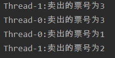

# 多线程

- **程序：Program**

>是为了完成特定任务，用某种编程语言编写的一组指令的集合。即指一段静态的代码。

- **进程：Process**

>是程序的一次执行过程或是正在运行的一个程序。是一个动态的过程：它有自身的产生、存在和消亡的过程。即是生命周期
>
>- 如运行中的QQ，运行中的音乐播放器
>- 程序是静态的，进程是动态的
>- 进程作为资源分配的单位，系统在运行时会为每个进程分配不同的内存区域

- **线程：Thread**

>进程可进一步细化为线程，是一个程序内部的一条执行路径
>
>- 若一个进程同一时间并行执行多个线程，就是支持多线程的
>- 线程作为调度和执行的单位，每个线程拥有独立的运行栈和程序计数器(PC)，线程切换的开销
>- 一个进程中的多个线程共享相同的内存单元/内存地址空间，他们从同一个堆中分配对象，可以访问相同的变量和对象。这就使线程间的通信更简洁、高效。但多个线程操作共享的系统资源可能就会带来安全隐患
>- 在Java中要想实现多线程，有两种手段，一种是继续Thread类，另外一种是实现Runable接口.(**其实准确来讲，应该有三种，还有一种是实现Callable接口**，并与Future、线程池结合使用

- **单核CPU和多核CPU**

>- 单核多线程实际上是一种假的多线程，因为在一个时间单元内，也只能执行一个线程任务。只是因为CPU的切换速度非常快，感觉不出来
>- 多核CPU才能更好的发挥多线程的效率。现在的服务器都是多核的

- **并行与并发**

>- 并行：多个CPU同时执行多个任务：如在篮球场上一个人占一个篮板练球，多个人同时做不同的事
>- 并发：一个CPU同时执行多个任务：如在篮球上上多个人一起组队打比赛，多个人同时做相同的事

- **线程的分类：用户线程和守护线程**

>- 如main()主线程就是用户线程，gc()垃圾回收线程就是守护线程。守护线程依赖于用户线程。
>
>- 守护线程是用来服务用户线程的，通过在start()方法前调用thread.setDaemon(true)可以把一个用户线程变成一个守护线程
>- 他们几乎每个方面都是相同的，唯一的区别是判断JVM何时离开

## Thread类

- java.lang.Thread
- 如果说你只是想起一条线程。没有什么其它特殊的要求，那么可以使用Thread.

```java
public class MyThreadA extends Thread {
    @Override
    public void run() {
        for (int i = 0; i < 3; i++) {
            try {
                Thread.sleep(1000);
            } catch (InterruptedException e) {
                e.printStackTrace();
            }
            System.out.println(Thread.currentThread().getName() + " "+i);
        }
    }
}
```

```java
public class Main {
    public static void main(String[] args) {
        MyThreadA t1 = new MyThreadA();
        MyThreadA t2 = new MyThreadA();
        t1.start();
        t2.start();
    }
}
```


- 程序启动运行main时候，java虚拟机启动一个进程，主线程main在main()调用时候被创建。随着调用MyThreadA的两个对象的start方法，另外两个线程也启动了，这样，整个应用就在多线程下运行。
- 注意：start()方法的调用后并不是立即执行多线程代码，而是使得该线程变为可运行态（Runnable），什么时候运行是由操作系统决定的。
- 从程序运行的结果可以发现，多线程程序是乱序执行。因此，只有乱序执行的代码才有必要设计为多线程。
- Thread.sleep()方法调用目的是不让当前线程独自霸占该进程所获取的CPU资源，以留出一定时间给其他线程执行的机会。
- 实际上所有的多线程代码执行顺序都是不确定的，每次执行的结果都是随机的。
- 但是start方法重复调用的话，会出现`java.lang.IllegalThreadStateException`异常。

```java
t1.start();
t2.start();
//重复调用start()
t1.start();
```


## Runnable接口

- java.lang.Runnable
- 采用Runnable也是非常常见的一种，只需要重写run方法即可。

```java
public class MyThreadB implements Runnable {
    @Override
    public void run() {
        for (int i = 0; i < 3; i++) {
            try {
                Thread.sleep(1000);
            } catch (InterruptedException e) {
                e.printStackTrace();
            }
            System.out.println(Thread.currentThread().getName() + " "+i);
        }
    }
}
```

```java
public class Main {
    public static void main(String[] args) {
        new Thread(new MyThreadB(), "t1").start();
        new Thread(new MyThreadB(), "t2").start();
    }
}
```


- MyThreadB类通过实现Runnable接口，使得该类有了多线程类的特征。run() 方法是多线程程序的一个约定。所有的多线程代码都在run() 方法里面。Thread类实际上也是实现了Runnable接口的类。
- 在启动的多线程的时候，需要先通过Thread类的构造方法Thread(Runnable target) 构造出对象，然后调用Thread对象的start()方法来运行多线程代码。
- 实际上所有的多线程代码都是通过运行Thread的start()方法来运行的。因此，不管是扩展Thread类还是实现Runnable接口来实现多线程，最终还是通过Thread的对象的API来控制线程的，熟悉Thread类的API是进行多线程编程的基础。

## Thread和Runnable的区别

- 如果一个类继承Thread，则不适合资源共享。但是如果实现了Runable接口的话，则很容易的实现资源共享。
- **实现Runnable接口比继承Thread类所具有的优势**
  1. 适合多个相同的程序代码的线程去处理同一个资源
  2. 可以避免java中的单继承的限制
     - 若是通过继承Thread的方法开启线程，那么这个类就不能再继承其他类了。所以实现线程的时候尽量使用实现Runnable接口的方式来完成
  3. 增加程序的健壮性，代码可以被多个线程共享，代码和数据独立
  4. 线程池只能放入实现Runable或callable类线程，不能直接放入继承Thread的类

>- **main方法其实也是一个线程。在java中所以的线程都是同时启动的，至于什么时候，哪个先执行，完全看谁先得到CPU的资源。**
>- **在java中，每次程序运行至少启动3个线程。一个是main线程，一个是垃圾收集线程，一个异常处理线程。如果发生了异常，会影响主线程。**
>- **每当使用java命令执行一个类的时候，实际上都会启动一个JVM，每一个JVM实际在就是在操作系统中启动了一个进程。**

### 卖票

>情景：有2个窗口卖3张票

- **Thread类实现**

```java
public class MyThreadA extends Thread {
    private int ticket = 3;
    @Override
    public void run() {
        while (true){
            if (ticket > 0){
                System.out.println(Thread.currentThread().getName() + "卖出的票号为" + ticket--);
            }else {
                return;
            }
        }
    }
}
```

```java
public class Main {
    public static void main(String[] args) {
        MyThreadA t1 = new MyThreadA();
        MyThreadA t2 = new MyThreadA();
        t1.setName("窗口一");
        t2.setName("窗口二");
        t1.start();
        t2.start();
    }
}
```


- 从结果可以看出两个窗口各自卖了三张票，总的卖了六张票，规定只有三张票可卖，所以这种做法不符合要求

- **Thread类实现改进**
  - 把ticket改为静态的

```java
private static int ticket = 10;
```


- 这样看上去似乎就符合要求了，但实际上不是的。把run()方法中的卖票逻辑修改成下面这种：

```java
System.out.println(Thread.currentThread().getName() + ":卖出的票号为" + ticket);
ticket--;
```


- 出现了脏数据，所以是线程不安全的。

---

- **Runnable接口**

```java
public class MyThreadB implements Runnable {
    private int ticket = 5;
    @Override
    public void run() {
        while (true){
            if (ticket > 0){
                System.out.println(Thread.currentThread().getName() + ":卖出的票号为" + ticket--);
            }else {
                return;
            }
        }
    }
}
```

```java
public class Main {
    public static void main(String[] args) {
        Runnable t1 = new MyThreadB();
        new Thread(t1,"窗口一").start();
        new Thread(t1,"窗口二").start();
    }
}
```


- ticket没有设置成静态类型的也实现了资源共享
- 关键：用同一个Runnable对象构建了两个线程，两个线程使用的都是同一个Runnable对象，ticket是两个线程共有的
- 问题：为什么传入了Runnable对象构建的两个线程会调用的是Runnable对象里实现的方法？源码如下：

```java
//---Thread---类中的run()方法
public void run() {
    if (this.target != null) {
        this.target.run();
    }
}

public Thread(Runnable target, String name) {
    this((ThreadGroup)null, target, name, 0L);
}
```

- 调用run()方法时会先判断target是否存在，如果存在则调用target的run方法，即Runnable的run方法。这就是为什么实现Runnable接口可以实现资源共享的根本原因。
- 问题：线程不安全，从上面的结果看出似乎没有什么问题，两个线程总的卖了3张票，如果把run()方法中的卖票逻辑改成这样：

```java
System.out.println(Thread.currentThread().getName() + ":卖出的票号为" + ticket);
ticket--;
```


- 出现了脏数据，这就是线程不安全的表现

## 线程的生命周期


1. 新建状态（New）：当一个Thread类或其子类对象被声明或者创建时，新生的线程对象就处于新建状态
2. 就绪状态（Runnable）：线程对象创建后，其他线程调用了该对象的start()方法。该状态的线程位于可运行线程池中，变得可运行，等待获取CPU的使用权。
3. 运行状态（Running）：就绪状态的线程获取了CPU资源时，执行程序代码，进入运行状态。
4. 阻塞状态（Blocked）：阻塞状态是线程因为某种原因放弃CPU使用权，暂时停止运行。直到线程进入就绪状态，才有机会转到运行状态。阻塞的情况分三种：

>**（一）、等待阻塞：运行的线程执行wait()方法，JVM会把该线程放入等待池中。(wait会释放持有的锁)**
>**（二）、同步阻塞：运行的线程在获取对象的同步锁时，若该同步锁被别的线程占用，则JVM会把该线程放入锁池中。**
>**（三）、其他阻塞：运行的线程执行sleep()或join()方法，或者发出了I/O请求时，JVM会把该线程置为阻塞状态。当sleep()状态超时、join()等待线程终止或者超时、或者I/O处理完毕时，线程重新转入就绪状态。（注意,sleep是不会释放持有的锁）**

5. 死亡状态（Dead）：线程执行完了或者因异常退出了run()方法，该线程结束生命周期。

## 线程调度

1. 调整线程优先级：Java线程有优先级，优先级高的线程会获得较多的运行机会。
   - 注：优先级高的线程只是代表被运行的可能性更大，并非优先级高的线程一定在优先级低的线程之前运行

- Java线程的优先级用整数表示，取值范围是1~10，Thread类有以下三个静态常量：

>- **static int MAX_PRIORITY**
>  - 线程可以具有的最高优先级，取值为10。
>- **static int MIN_PRIORITY**
>  - 线程可以具有的最低优先级，取值为1。
>- **static int NORM_PRIORITY**
>  -  分配给线程的默认优先级，取值为5。

- Thread类的setPriority()和getPriority()方法分别用来设置和获取线程的优先级。
- 每个线程都有默认的优先级。主线程的默认优先级为Thread.NORM_PRIORITY。
- 线程的优先级有继承关系，比如A线程中创建了B线程，那么B将和A具有相同的优先级。
- JVM提供了10个线程优先级，但与常见的操作系统都不能很好的映射。如果希望程序能移植到各个操作系统中，应该仅仅使用Thread类有以下三个静态常量作为优先级，这样能保证同样的优先级采用了同样的调度方式。


2. 线程睡眠：Thread.sleep(long millis)方法，使线程转到阻塞状态。millis参数设定睡眠的时间，以毫秒为单位。当睡眠结束后，就转为就绪（Runnable）状态。sleep()平台移植性好。


3. 线程等待：Object类中的wait()方法，导致当前的线程等待，直到其他线程调用此对象的 notify() 方法或 notifyAll() 唤醒方法。这个两个唤醒方法也是Object类中的方法，行为等价于调用 wait(0) 一样。


4. 线程让步：Thread.yield() 方法，暂停当前正在执行的线程对象，把执行机会让给相同或者更高优先级的线程。


5. 线程加入：join()方法，等待其他线程终止。在当前线程中调用另一个线程的join()方法，则当前线程转入阻塞状态，直到另一个进程运行结束，当前线程再由阻塞转为就绪状态。


6. 线程唤醒：Object类中的notify()方法，唤醒在此对象监视器上等待的单个线程。如果所有线程都在此对象上等待，则会选择唤醒其中一个线程。

>选择是任意性的，并在对实现做出决定时发生。线程通过调用其中一个 wait 方法，在对象的监视器上等待。 直到当前的线程放弃此对象上的锁定，才能继续执行被唤醒的线程。被唤醒的线程将以常规方式与在该对象上主动同步的其他所有线程进行竞争；例如，唤醒的线程在作为锁定此对象的下一个线程方面没有可靠的特权或劣势。类似的方法还有一个notifyAll()，唤醒在此对象监视器上等待的所有线程。


-  注意：Thread中suspend()和resume()两个方法在JDK1.5中已经废除，因为有死锁倾向。

## 常用函数说明

>- sleep(): 强迫调用此方法的线程睡眠Ｎ毫秒。 　　
>- isAlive(): 判断一个线程是否存活。 　　
>- join(): 等待线程终止。 　　
>- setName(): 为线程设置一个名称。 　　
>- wait(): 强迫调用此方法的线程等待。 　　
>- notify(): 通知在等待的线程继续运行。 　　
>- setPriority(): 设置一个线程的优先级。
>- activeCount(): 程序中活跃的线程数。 
>- enumerate(): 枚举程序中的线程。   
>- currentThread(): 得到当前线程。 　
>- isDaemon(): 一个线程是否为守护线程。 　　
>- setDaemon(): 设置一个线程为守护线程。(用户线程和守护线程的区别在于，是否等待主线程依赖于主线程结束而结束) 　　


### sleep(long millis)

- **在指定的毫秒数内让当前正在执行的线程休眠（暂停执行）**

>sleep() 方法需要指定等待的时间，它可以让当前正在执行的线程在指定的时间内暂停执行，进入阻塞状态，该方法既可以让其他同优先级或者高优先级的线程得到执行的机会，也可以让低优先级的线程得到执行机会。但是 sleep() 方法不会释放“锁标志”，也就是说如果有 synchronized 同步块，其他线程仍然不能访问共享数据。 

```java
public static native void sleep(long millis) throws InterruptedException;
```

### join()

-  join() 方法会使当前线程等待调用 join() 方法的线程结束后才能继续执行 

>- 在a线程中调用b.join()，a线程被阻塞。必须要的等b线程执行完才执行a线程

```java
public final void join() throws InterruptedException {
    join(0);
}
```

- **为什么要用join()方法**

>在很多情况下，主线程生成并起动了子线程，如果子线程里要进行大量的耗时的运算，主线程往往将于子线程之前结束，但是如果主线程处理完其他的事务后，需要用到子线程的处理结果，也就是主线程需要等待子线程执行完成之后再结束，这个时候就要用到join()方法了。

- **测试一：不加join**

```java
public class MyThreadC extends Thread {
    @Override
    public void run() {
        System.out.println(Thread.currentThread().getName()+"线程运行开始!");
        for (int i = 0; i < 3; i++) {
            System.out.println("子线程"+Thread.currentThread().getName()+"---"+ i);
            try {
                sleep(1000);
            } catch (InterruptedException e) {
                e.printStackTrace();
            }
        }
        System.out.println("子线程"+Thread.currentThread().getName()+"运行结束!");
    }
}
```

```java
public class Main {
    public static void main(String[] args) {
        System.out.println(Thread.currentThread().getName()+"主线程运行开始!");
        MyThreadC t1 = new MyThreadC();
        MyThreadC t2 = new MyThreadC();
        t1.start();
        t2.start();
        System.out.println(Thread.currentThread().getName()+ "主线程运行结束!");
    }
}
```


- 从运行结果可以发现主线程比子线程早结束
- **测试二：加join**

```java
public class Main {
    public static void main(String[] args) {
        System.out.println(Thread.currentThread().getName()+"主线程运行开始!");
        MyThreadC t1 = new MyThreadC();
        MyThreadC t2 = new MyThreadC();
        t1.start();
        t2.start();
        try {
            t1.join();
            t2.join();
        } catch (InterruptedException e) {
            e.printStackTrace();
        }
        System.out.println(Thread.currentThread().getName()+ "主线程运行结束!");
    }
}
```


- 从运行结果可以看出主线程一定会等子线程都结束了才结束


### yield()

- **暂停当前正在执行的线程对象，并执行其他线程。**

>yield() 方法和 sleep() 方法类似，也不会释放“锁标志”，区别在于，它没有参数，即 yield() 方法只是使当前线程重新回到可执行状态，所以执行 yield() 的线程有可能在进入到可执行状态后马上又被执行，另外 yield() 方法只能使同优先级或者高优先级的线程得到执行机会，这也和 sleep() 方法不同。 

```java
public static native void yield();
```

- 结论：yield()从未导致线程转到等待/睡眠/阻塞状态。在大多数情况下，yield()将导致线程从运行状态转到可运行状态，但有可能没有效果。可看上面的图。

```java
public class MyThreadD extends Thread {
    @Override
    public void run() {
        for (int i = 0; i < 10; i++) {
            System.out.println(Thread.currentThread().getName()+" "+i);
            //当i为5时，该线程就会把CPU时间让掉，让其他或者自己的线程执行（也就是谁先抢到谁执行）
            if (i == 5){
                yield();
            }
        }
    }
}
```

```java
public class Main {
    public static void main(String[] args) {
        MyThreadD t1 = new MyThreadD();
        MyThreadD t2 = new MyThreadD();
        t1.start();
        t2.start();
    }
}
```

- 运行结果：

1. 第一种情况：当 Thread-1(线程) 执行到5时会CPU时间让掉，这时 Thread-0(线程)  抢到CPU时间并执行。
2. 第二种情况：当 Thread-1(线程) 执行到5时会CPU时间让掉，这时 Thread-1(线程)  抢到CPU时间并执行。


### setPriority()

- **更改线程的优先级。**

- MIN_PRIORITY = 1
- NORM_PRIORITY = 5
- MAX_PRIORITY = 10 　　 

- 使用

```java
MyThreadD t1 = new MyThreadD();
MyThreadD t2 = new MyThreadD();
MyThreadD t3 = new MyThreadD();
t1.setPriority(Thread.MAX_PRIORITY);
t2.setPriority(Thread.MIN_PRIORITY);
t3.setPriority(Thread.NORM_PRIORITY);
```


### interrupt()

- **不要以为它是中断某个线程！它只是线线程发送一个中断信号，让线程在无限等待时（如死锁时）能抛出抛出，从而结束线程，但是如果你吃掉了这个异常，那么这个线程还是不会中断的！**


### wait()

>- **wait()：一旦执行此方法，当前线程就进入阻塞状态并释放同步监视器**
>- **wait()、notify()、notifyAll()这三个方法的调用者必须是同步代码块或同步方法中的同步监视器，否则会出现IllegalMonitorStateException异常**
>- **这三个方法是定义在Object类中的方法**

```java
public class MyThreadB implements Runnable {
    private int ticket = 100;

    @Override
    public void run() {
        while (true){
            synchronized (this) {
                this.notifyAll();
                if (ticket > 0){
                    System.out.println(Thread.currentThread().getName() + ":卖出的票号为" + ticket);
                    ticket--;
                    try {
                        this.wait();
                    } catch (InterruptedException e) {
                        e.printStackTrace();
                    }
                }else {
                    break;
                }
            }
        }
    }
}
```

- 测试

```java
public class MyThreadB implements Runnable {
    private int ticket = 100;
    final Object obj = new Object();

    @Override
    public void run() {
        while (true){
            synchronized (obj) {
                this.notifyAll();
                // ......
                this.wait();
                // ......
}
```


- 修改

```java
public class MyThreadB implements Runnable {
    private int ticket = 100;
    final Object obj = new Object();

    @Override
    public void run() {
        while (true){
            //正确调用
            synchronized (obj) {
                obj.notifyAll();
                // ......
                obj.wait();
                // ......
}
```

## sleep和yield的区别

- sleep()和yield()的区别):sleep()使当前线程进入停滞状态，所以执行sleep()的线程在指定的时间内肯定不会被执行；yield()只是使当前线程重新回到可执行状态，所以执行yield()的线程有可能在进入到可执行状态后马上又被执行。
-  sleep 方法使当前运行中的线程睡眼一段时间，进入不可运行状态，这段时间的长短是由程序设定的，yield 方法使当前线程让出 CPU 占有权，但让出的时间是不可设定的。实际上，yield()方法对应了如下操作：先检测当前是否有相同优先级的线程处于同可运行状态，如有，则把 CPU  的占有权交给此线程，否则，继续运行原来的线程。所以yield()方法称为“退让”，它把运行机会让给了同等优先级的其他线程。
-   另外，sleep 方法允许较低优先级的线程获得运行机会，但 yield()  方法执行时，当前线程仍处在可运行状态，所以，不可能让出较低优先级的线程些时获得 CPU 占有权。在一个运行系统中，如果较高优先级的线程没有调用 sleep 方法，又没有受到 I\O 阻塞，那么，较低优先级线程只能等待所有较高优先级的线程运行结束，才有机会运行。

## wait和sleep区别

- **共同点：**

>- 一旦执行都可以使当前的线程进入阻塞状态

- **不同点：**

>1. 两个方法声明的位置不同: sleep()在Thread类中，wait()在Object类中
>2. 调用的要求不同: sleep()可以在任何需要的场景下调用，wait()必须使用在同步代码块或同步方法中由当前监视器调用
>3. 关于是否释放同步监视器：如果两个方法都使用在同步代码块或同步方法中，sleep()不会释放锁，wait()会释放锁

## 常见线程名词解释

- 主线程：JVM调用程序main()所产生的线程。
- 当前线程：这个是容易混淆的概念。一般指通过Thread.currentThread()来获取的进程。
- 后台线程：指为其他线程提供服务的线程，也称为守护线程。JVM的垃圾回收线程就是一个后台线程。用户线程和守护线程的区别在于，是否等待主线程依赖于主线程结束而结束
- 前台线程：是指接受后台线程服务的线程，其实前台后台线程是联系在一起，就像傀儡和幕后操纵者一样的关系。傀儡是前台线程、幕后操纵者是后台线程。由前台线程创建的线程默认也是前台线程。可以通过isDaemon()和setDaemon()方法来判断和设置一个线程是否为后台线程。

## 线程安全与同步

```java
public class MyThreadB implements Runnable {
    private int ticket = 5;
    @Override
    public void run() {
        while (true){
            if (ticket > 0){
                try {
                    Thread.sleep(100);
                    System.out.println(Thread.currentThread().getName() + ":卖出的票号为" + ticket--);
                } catch (InterruptedException e) {
                    e.printStackTrace();
                }
            }else {
                return;
            }
        }
    }
}

```

```java
public class Main {
    public static void main(String[] args) {
        Runnable t1 = new MyThreadB();
        new Thread(t1,"窗口一").start();
        new Thread(t1,"窗口二").start();
    }
}
```


>- 以上面实现的卖票测试为代表说明：出现了重票或错票的情况--->线程安全问题
>- 问题出现的原因：当某个线程操作线程的过程中，尚未操作完成时，其他线程参与进来也操作车票ticket
>- 如何解决：当一个线程在操作ticket的时候其他线程不能参与进来，知道线程a操作完ticket后其他线程才可以操作ticket。这种情况即使线程a出现了阻塞也不能被改变
>- 在Java中通过同步机制来解决线程安全问题

---

### synchronized

- 对象锁：使用 synchronized 修饰非静态的方法以及 synchronized(this) 同步代码块使用的锁是对象锁。
- 类锁：使用 synchronized 修饰静态的方法以及 synchronized(class) 同步代码块使用的锁是类锁。
- 私有锁：在类内部声明一个私有属性如private Object lock，在需要加锁的同步块使用 synchronized(lock）

- 特性：

>- 对象锁具有可重入性:
>  - 当一个线程获得了某个对象的对象锁，则该线程仍然可以调用其他任何需要该对象锁的 synchronized 方法或 synchronized(this) 同步代码块。
>- 当一个线程访问某个对象的一个 synchronized(this) 同步代码块时，其他线程对该对象中所有其它 synchronized(this) 同步代码块的访问将被阻塞，因为访问的是同一个对象锁。
>- 每个类只有一个类锁，但是类可以实例化成对象，因此每一个对象对应一个对象锁。
>- 类锁和对象锁不会产生竞争，私有锁和对象锁也不会产生竞争。
>  - 因为是两把不同的锁
>- 使用私有锁可以减小锁的细粒度，减少由锁产生的开销。

#### 方式一：同步代码块

- 关键字：synchronized

```java
sychronized(同步监视器){
    //需要被同步的代码
}
//操作共享数据的代码即为需要被同步的代码
//共享数据:多个线程共同操作的变量。比如ticket就是共享数据
//同步监视器：俗称锁。任何一个类的对象都可以充当锁。
//要求：多个线程必须要共用一把锁
```

>好处：解决了线程安全同步问题
>
>局限性：效率低。操作同步代码块时只能有一个线程参与，其他线程等待，相当于是一个单线程的过程

- **测试一：同步实现Runnable接口的run()方法**

```java
public class MyThreadB implements Runnable {
    private int ticket = 5;
    //---锁对象---
    final Object obj = new Object();
    @Override
    public void run() {
        while (true){ 
            //也可以用this当前对象作为锁
            synchronized(obj){
                if (ticket > 0){
                    try {
                        Thread.sleep(100);
                    } catch (InterruptedException e) {
                        e.printStackTrace();
                    }
                    System.out.println(Thread.currentThread().getName() + ":卖出的票号为" + ticket--);
                }else {
                    return;
                }
            }
        }
    }
}
```


```java
public class MyThreadB implements Runnable {
    private int ticket = 5;
    @Override
    public void run() {
        while (true){ 
            //也可以用this当前对象作为锁，因为MyThreadB是唯一的，所以同样线程安全
            synchronized(this){
                //......
            }
        }
    }
}
```

- 解决了同步安全问题
- 注意：

```java
public class MyThreadB implements Runnable {
    private int ticket = 5;
    @Override
    public void run() {
        //这样的锁对象不唯一，还是会存在线程安全问题
        Object obj = new Object();
        while (true){ 
            synchronized(obj){
 //......
}
```

- **测试二：同步继承Thread类的run()方法**

```java
public class MyThreadA extends Thread {
    private static int ticket = 3;
    @Override
    public void run() {
        while (true){
            synchronized(this){
                if (ticket > 0){
                    System.out.println(Thread.currentThread().getName() + ":卖出的票号为" + ticket);
                    ticket--;
                }else {
                    return;
                }
            }
        }
    }
}
```

```java
public class Main {
    public static void main(String[] args) {
        MyThreadA t1 = new MyThreadA();
        MyThreadA t2 = new MyThreadA();
        t1.start();
        t2.start();
    }
}
```



- 虽然加了同步锁依然是线程不安全的，为什么？
  - 开启线程的时候new了两个MyThreadA对象，所以锁住的this是不同的两个对象，所以锁无效，线程不安全

- **修改1**

```java
public class MyThreadA extends Thread {
    private static int ticket = 3;
    private static final Object obj = new Object();
    @Override
    public void run() {
        while (true){
           synchronized(obj){
   //......
}
```

- 这里的obj对象是静态且不可改变的，属于MyThreadA类共享唯一的，可以作为锁，此时线程安全

- **修改2**

```java
public class MyThreadA extends Thread {
    private static int ticket = 5;
    @Override
    public void run() {
        while (true){
           synchronized(MyThreadA.class){
               //......
}
```

- 类也是对象，并且MyThreadA.class只被加载一次，也是唯一的，可以作为锁对象


- **小结**

>1. 在实现Runnable接口创建多线程的方式中，考虑使用this充当同步监视器
>2. 在实现Thread类创建多线程的方式中，慎用this充当同步监视器。考虑使用当前类充当同步监视器

#### 方式二：同步方法

>- 如果共享数据的代码完整的声明在一个方法中，我们不妨将此方法设置为同步方法
>
>- 同步方法仍然涉及到同步监视器，只是不需要我们显示声明
>- 非静态的同步方法，同步监视器是：this
>- 静态的同步方法，同步监视器是：当前类本身

- **测试1：继承Thread类的线程**

```java
public class MyThreadA extends Thread {
    private static int ticket = 3;
    private static final Object obj = new Object();
    @Override
    public void run() {
        while (ticket > 0){
            show();
        }
    }
    private static synchronized void show(){ //锁对象，当前类本身，是线程安全的
    //private synchronized void show(){  //锁对象，this，不唯一，是线程不安全的
        if (ticket > 0) {
            System.out.println(Thread.currentThread().getName() + ":卖出的票号为" + ticket);
            ticket--;
        }
    }
}
```

- **测试2：实现Runnable接口**

```java
public class MyThreadB implements Runnable {
    private int ticket = 10;
    Object obj = new Object();
    @Override
    public void run() {
        while (ticket > 0){
            show();
        }
    }
    private  synchronized void show(){ //锁对象，this，MyThreadB类本身，唯一，是线程安全的
        if (ticket > 0) {
            System.out.println(Thread.currentThread().getName() + ":卖出的票号为" + ticket);
            ticket--;
        }
    }
}
```

### ReentrantLock

- ReentrantLock 是一个独占/排他锁。相对于 synchronized，它更加灵活。但是需要自己写出加锁和解锁的过程。它的灵活性在于它拥有很多特性。
- ReentrantLock 需要显示地进行释放锁。特别是在程序异常时，synchronized 会自动释放锁，而 ReentrantLock 并不会自动释放锁，所以必须在 finally 中进行释放锁。
- 特性：

>- 公平性：支持公平锁和非公平锁。默认使用了非公平锁。
>- 可重入
>- 可中断：相对于 synchronized，它是可中断的锁，能够对中断作出响应。
>- 超时机制：超时后不能获得锁，因此不会造成死锁。

- ReentrantLock 是很多类的基础，例如 ConcurrentHashMap 内部使用的 Segment 就是继承 ReentrantLock，CopyOnWriteArrayList 也使用了 ReentrantLock。

```java
public class MyThreadB implements Runnable {
    private int ticket = 100;
    private ReentrantLock lock = new ReentrantLock();

    @Override
    public void run() {
        while (true){
            try {
                lock.lock();
                if (ticket > 0){
                    try {
                        Thread.sleep(100);
                    } catch (InterruptedException e) {
                        e.printStackTrace();
                    }
                    System.out.println(Thread.currentThread().getName() + ":卖出的票号为" + ticket);
                    ticket--;
                }else {
                    break;
                }
            } finally {
                lock.unlock();
            }
        }
    }
}
```

### 区别

- 相同点：两者都可以解决线程安全问题
- 不同的：synchronized机制在执行完相应代码后会自动释放同步监视器
- lock需要手动启动同步 (lock()) 和手动结束同步 (unlock())
- 建议优先使用lock

## 停止线程

- 在java中有以下3种方法可以终止正在运行的线程：

>1. 线程正常退出，当run方法完成后线程终止。
>   - 使用退出标志
>     - 使用return
>2. 使用stop方法强行终止，但是不推荐这个方法，因为stop和suspend及resume一样都是过期作废的方法。
>3. 使用interrupt方法中断线程。

- `interrupt（）`是给线程设置中断标志；
- `interrupted（）`是检测中断并清除中断状态；
- `isInterrupted（）`只检测中断。
- 还有重要的一点就是`interrupted（）`作用于当前线程，`interrupt（）`和`isInterrupted（）`作用于此线程，即代码中调用此方法的实例所代表的线程。

---

- **测试一：**

>interrupt()设置中断标记+isInterrupted()检测标记位+return/break

```java
public class SonThread extends Thread{
    @Override
    public void run() {
        while (true){
            //子线程一旦检测到中断标志就退出run()方法
            if (this.isInterrupted()){
                 System.out.println("---结束---");
                return; //break;
            }
            System.out.println("---运行---");
        }
    }
}
```

```java
public class Main {
    public static void main(String[] args) throws InterruptedException {
        SonThread son = new SonThread();
        son.start();
        //主线程休眠一秒后调用子线程的interrupt()方法设置中断标志
        Thread.sleep(1000);
        son.interrupt();
    }
}
```


- **测试二：**

>设置flag标记位

```java
public class SonThread extends Thread{
    private  boolean flag = true;
    @Override
    public void run() {
        while (flag){
            System.out.println("---运行---");
        }
        System.out.println("---结束---");
    }

    public void stopThread(){
        flag = false;
    }
}
```

```java
public class Main {
    public static void main(String[] args) throws InterruptedException {
        SonThread son = new SonThread();
        son.start();
        //主线程休眠一秒后调用子线程的stopThread()方法将flag设置为flase
        Thread.sleep(1000);
        son.stopThread();
    }
}
```


## 线程的死锁

>- 不同的线程分别占用对方需要的同步资源不放弃，都在等待对方放弃自己需要的同步资源，就形成了线程的死锁
>- 解决办法:
>  - 专门的算法、原则
>  - 尽量减少同步资源的定义
>  - 尽量避免嵌套同步

## 生产者和消费者问题

>店长做好一杯奶茶，一个顾客就取走一杯，然后店长继续做奶茶，其他的顾客就等着店长做，店长做好后又喊顾客来拿。
>
>- 是否有多线程问题？是，生产者线程和消费者线程
>- 是否有共享数据？是，店员或产品
>- 如何解决线程的安全问题？同步机制，有三种方法
>- 是否涉及线程的通信？是

- 共享资源：奶茶

```java
public class ShareArticles {
    private int amount;
    //产品是否可获得
    private boolean available = false;
    //是否允许消费者消费
    public static boolean isInterrupt = false;


    public synchronized void produce(int amount) {
        if (available) {
            try {
                wait();
            } catch (InterruptedException e) {
                e.printStackTrace();
            }
        }
        this.amount = amount;
        System.out.println(Thread.currentThread().getName()+"---生产出了第" + amount + "件产品");
        //已产出，产品可获得
        available = true;
        notifyAll();
    }

    public synchronized void cost() {
        //在产品不可获得并且允许消费者还能消费的条件下才需要等待
        if (!available && !isInterrupt) {
            try {
                wait();
            } catch (InterruptedException e) {
                e.printStackTrace();
            }
        }
        System.out.println(Thread.currentThread().getName()+"---消费了第" + amount + "件产品");
        //已消费，产品不可获得
        available = false;
        notifyAll();
    }
}
```

- 店长开始做奶茶

```java
public class Producer implements Runnable {
    private ShareArticles shareArticles;

    public Producer(ShareArticles shareArticles){
        this.shareArticles = shareArticles;
    }
    @Override
    public void run() {
        for (int i = 1; i <= 20; i++) {
            shareArticles.produce(i);
        }
        //让消费者停止消费
        ShareArticles.isInterrupt = true;
    }
}
```

- 顾客取奶茶

```java
public class Customer implements Runnable{
    private ShareArticles shareArticles;

    public Customer(ShareArticles shareArticles){
        this.shareArticles = shareArticles;
    }
    @Override
    public void run() {
        //生产者结束生成，消费者就结束消费
        while (!ShareArticles.isInterrupt){
            shareArticles.cost();
        }
    }
}
```

- 店铺开始营业

```java
public class Test {
    public static void main(String[] args) {
        ShareArticles articles = new ShareArticles();
        Producer producer = new Producer(articles);
        Customer customer = new Customer(articles);
        final Thread p = new Thread(producer, "生产者");
        final Thread c1 = new Thread(customer, "消费者");
        p.start();
        c1.start();
        try {
            p.join();
            c1.join();
        } catch (InterruptedException e) {
            e.printStackTrace();
        }
        System.out.println("---结束生产和消费---");
    }
}

```

- 输出：

>生产者---生产出了第18件产品
>消费者---消费了第18件产品
>生产者---生产出了第19件产品
>消费者---消费了第19件产品
>生产者---生产出了第20件产品
>消费者---消费了第20件产品
>---结束生产和消费---

## Callable接口

- 与使用Runnable接口相比，Callable功能更强大

>- 相比run()方法，可以有返回值
>- 方法可以抛出异常，捕获异常信息
>- 支持泛型的返回值
>- 需要借助FutureTask类，比如获取返回结果

- Future接口

>- 可以对具体的Runnable、Callable任务的执行结果进行取消、查询是否完成、获取结果等
>- FutureTask是Future接口的唯一实现类
>- FutureTask同时执行了Runnable、Future接口。它即可作为Runnbale被线程执行，又可以作为Future得到Callable的返回值

- 实现：计算1-100的和

```java
//1.创建一个实现Callable接口的实现类
public class MyThreadC implements Callable<Integer> {
    private int sum = 0;
    //2.实现call()方法，将需要执行的操作声明在call()方法中
    @Override
    public Integer call() throws Exception {
        for (int i = 0; i <= 100; i++) {
            sum += i;
        }
        return sum;
    }
}

```

```java
public class Main {
    public static void main(String[] args) throws ExecutionException, InterruptedException {
        //3.创建Callable接口的实现类对象
        MyThreadC threadC = new MyThreadC();
        //4.将此Callable接口实现类对象作为参数传递到FutureTask构造器中创建FutureTask对象
        FutureTask<Integer> task = new FutureTask<>(threadC);
        //5.将FutureTask对象作为参数传递到Thread类构造器中
        new Thread(task).start();

        //6.若需要返回值：调用FutureTask类中的get()方法
        //get()方法的返回值为FutureTask构造器参数Callable实现类重写的call()的返回值
        Integer sum = task.get();
        System.out.println(sum);
    }
}
//输出：5050
```

## 使用线程池

- 背景：经常创建和销毁、使用量特别大的资源、比如并发情况下的线程，对性能影响很大
- 思路：提前创建好多个线程放入线程池中，使用时直接获取，使用完又放回池中。可以避免频繁创建销毁、实现重复利用、类似生活中的公共交通工具
- 好处：
  - 提高了响应速度（减少了创建新线程的时间）
  - 降低了资源消耗（重复利用线程池中的线程，不需要每次都创建）
  - 便于线程管理

```java
public class Main {
    public static void main(String[] args) throws ExecutionException, InterruptedException {
        //1.提供指定线程数量的线程池
        ExecutorService service = Executors.newFixedThreadPool(10);
        //2.执行指定线程的操作，需要提供实现Runnable接口或Callable接口实现类的对象
        service.execute(new MyThreadB());
        service.execute(new MyThreadA());
        //3.关闭连接池
        service.shutdown();
    }
}
```

