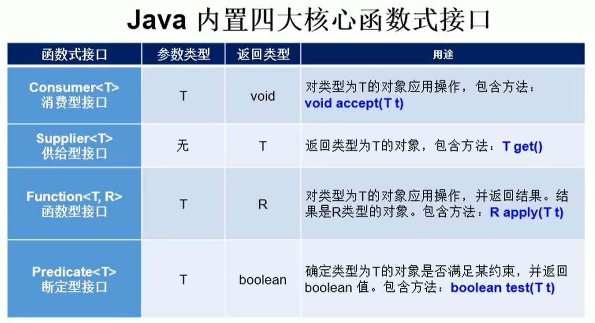

# Lambda表达式

>Lambda是一个匿名函数，我们可以把Lambda表达式理解为是一段可以传递的代码（将代码像数据一样进行传递）。使用它可以写出更简洁、更灵活的代码。作为一种更紧凑的代码风格，使Java的语言表达能力得到了提升。

1. 举例：（o1，02）->Integer.compare（o1，o2）；
2. 格式：

>- ->：Lambda操作符或箭头操作符
>- 箭头左边：Lambda形参列表（其实就是接口中的抽象方法的形参列表）
>- 箭头右边：Lambda体（其实就是重写的抽象方法的方法体）

3. Lambda表达式的使用：（分为6种情况介绍）

>- 箭头左边：Lambda形参列表的参数关型可以略（关型推断）；如果lambda形参列表只有一个参数，括号可以省略
>- 箭头右边：Lambda体应该使用一对{ }包裹；如果Lambda体只有一条执行语句（可能是return语句）,{ }可以省略

3. Lambda表达式的实质：作为函数式接口的实例

>- 如果一个接口中只有一个抽象方法，这样的接口就叫函数式接口

# Lambda语法实例

- **语法格式一：无参，无返回值的函数**

```java
@Test
public void test1() {
    Runnable r1 = new Runnable() {
        @Override
        public void run() {
            System.out.println("---测试1---");
        }
    };
    r1.run();
    System.out.println("-------Lambda表达式---------");
    Runnable r2 = () -> System.out.println("---测试2---");
    r2.run();
}
```

- **语法格式二：需要一个参数，无返回值**

```java
@Test
public void test2(){
    Consumer<String> c1 = new Consumer<String>() {
        @Override
        public void accept(String s) {
            System.out.println(s);
        }
    };
    c1.accept("这是一个消费者接口实现");

    System.out.println("-------Lambda表达式---------");
    Consumer<String> c2 = (String s) -> {
        System.out.println(s);
    };
    c2.accept("这也是一个消费者接口实现");
}
```

- **语法格式三：数据类型可以省略，因为可由编译器推断得出，称为“类型推断”**

```java
@Test
public void test4(){
    System.out.println("-------Lambda表达式---------");
    Consumer<String> c1 = (s) -> {
        System.out.println(s);
    };
    c1.accept("这也是一个消费者接口实现");
}
```

- **语法格式四：Lambda 若只需要一个参教时，参教的小括号可以省略**

```java
@Test
public void test5() {
    System.out.println("-------Lambda表达式---------");
    Consumer<String> c2 = s -> {
        System.out.println(s);
    };
    c2.accept("这是一个消费者接口实现");
}
```

- **语法格式五：Lambda 需要两个或以上的参数，多条执行语句，并且可以有返回值**

```java
@Test
public void test6() {
    Comparator<Integer> c1 = new Comparator<Integer>() {
        @Override
        public int compare(Integer t1, Integer t2) {
            System.out.println(t1);
            System.out.println(t2);
            return t1 - t2;
        }
    };
    System.out.println(c1.compare(10, 20));

    System.out.println("-------Lambda表达式---------");
    Comparator<Integer> c2 = (t1, t2) -> {
        System.out.println(t1);
        System.out.println(t2);
        return t1 - t2;
    };
    System.out.println(c2.compare(20, 10));

    System.out.println("---方法的引用---");
    Comparator<Integer> c3 = Integer::compare;
    System.out.println(c3.compare(1, 2));
}
```

- **语法格式六：当Lambda 体只有一条语句时，return与大括号若有，都可以省略**

```java
@Test
public void test2() {
    Comparator<Integer> c1 = new Comparator<Integer>() {
        @Override
        public int compare(Integer t1, Integer t2) {
            return t1 - t2;
        }
    };
    System.out.println(c1.compare(10, 20));

    System.out.println("-------Lambda表达式---------");
    Comparator<Integer> c2 = (t1, t2) -> t1 - t2;
    System.out.println(c2.compare(20, 10));

    System.out.println("---方法的引用---");
    Comparator<Integer> c3 = Integer::compare;
    System.out.println(c3.compare(1,2));
}
```

# 函数式接口

>- 只包含一个抽象方法的接口，称为函数式接口。
>- 你可以通过Lambda表达式来创建该接口的对象。（若Lambda表达式抛出一个受检异常（即：非运行时异常），那么该异常需要在目标接口的抽象方法上进行声明）。
>- 我们可以在一个接口上使用@Functionallnterface注解，这样做可以检查它是否是一个函数式接口。同时javadoc也会包含一条声明，说明这个接口是一个函数式接口。
>- 在java.util.function包下定义了Java8的丰富的函数式接口

- **如何理解函数式接口**

>- Java从诞生日起就是一直倡导“一切皆对象”，在Java里面面向对象（OOP）编程是一切。但是随着python、scala等语言的兴起和新技术的挑战，Java不得不做出调整以便支持更加广泛的技术要求，也即java不但可以支持OOP还可以支持OOF（面向函数编程）
>- 在函数式编程语言当中，函数被当做一等公民对待。在将函数作为一等公民的编程语言中，Lambda表达式的类型是函数。但是在Java8中，有所不同。在Java8中，Lambda表达式是对象，而不是函数，它们必须依附于一类特别的对象类型——函数式接口。
>- 简单的说，在Java8中，Lambda表达式就是一个函数式接口的实例。这就是Lambda表达式和函数式接口的关系。也就是说，只要一个对象是函数式接口的实例，那么该对象就可以用Lambda表达式来表示。
>- 所以以前用匿名实现类表示的现在都可以用Lambda表达式来写。



- **一：消费型接口测试** 

````java
@Test
public void test1(){
    passValue(100,x -> System.out.println("得到"+x+"元"));
}
public void passValue(int money , Consumer<Integer> consumer){
    consumer.accept(money);
}
````

- **二：断定型接口测试**

```java
@Test
public void test2() {
    List<String> arrayList = Arrays.asList("大西洋","太平洋","印度洋","北冰洋","冬天","夏天");
    final List<String> filter = filter(arrayList, s -> s.contains("洋"));
    System.out.println(filter); //[大西洋, 太平洋, 印度洋, 北冰洋]
}

//根据给定的规则去过滤集合中的字符串
public List<String> filter(List<String> list, Predicate<String> predicate) {
    List<String> arrayList = new ArrayList<>();
    for (String s : list) {
        //符合测试规则就添加到新的集合中
        if (predicate.test(s)){
            arrayList.add(s);
        }
    }
    return arrayList;
}
```

# 方法引用

>- 当要传递给Lambda体的操作，已经有实现的方法了，可以使用方法引用！
>- 方法引用可以看做是Lambda表达式深层次的表达。换句话说，方法引用就是Lambda表达式，也就是函数式接口的一个实例，通过方法的名字来指向一个方法，可以认为是Lambda表达式的一个语法糖。
>- 要求：实现接口的抽象方法的参数列表和返回值类型，必须与方法引用的方法的参数列表和返回值类型保持一致！
>- 格式：使用操作符 “：：” 将类（或对象）与方法名分隔开来。
>- 如下三种主要使用情况：
>  - 对象：：实例方法名
>  - 类：：静态方法名
>  - 类：：实例方法名

- **情况一：对象：：实例方法**

>- Consumer 中void accept（T t）
>- PrintStream中的void printin（T t）

```java
@Test
public void test1(){
    //方法体实现
    Consumer<String> c1 = x -> System.out.println(x);
    c1.accept("传递一个参数并打印");

    System.out.println("---方法引用---");
    final PrintStream out = System.out; //输出流
    Consumer<String> c2 = out::println; //调用PrintStream对象已经实现的打印方法，由于打印方法也是传入一个参数且无返回值，所以调用此方法参数也可以省略
    c2.accept("传递一个参数并打印");
}
```

- 方法引用使用的要求：
  - 要求接口中的抽象方法的形参列表和返回值类型与方法引用的方法的形参列表和返回值类型相同！
  - 不包括（类：：实例方法名）这种情况

- **情况二：类：：静态方法**

>- Comparator 中的int compare（T t1，T t2）
>- Integer 中的int compare（T t1，T t2）

```java
@Test
public void test2(){
    Comparator<Integer> c1 = (t1,t2) -> Integer.compare(t1,t2);
    System.out.println(c1.compare(10,20));

    System.out.println("---方法引用---");
    Comparator<Integer> c2 = Integer::compareTo; //比较器和Integer类中的比较方法参数一致，可以省略
    System.out.println(c2.compare(10,20));
}
```

- **情况三：类：：实例方法（有难度）**

>- Comparator 中的int comapre（T t1，T t2）
>- String 中的int t1.compareTo（t2）

```java
@Test
public void test3(){
    Comparator<String> c1 = (t1,t2) -> t1.compareTo(t2);
    System.out.println(c1.compare("boy","girl"));

    System.out.println("---方法引用---");
    Comparator<String> c2 = String::compareTo; //第一个参数作为调用者调用方法与第二个参数比较
    System.out.println(c2.compare("boy","girl"));
}
```

- 测试

>- Function中的R appLy（T t）
>- Employee 中的String getName（）；

```java
@Test
public void test6(){
    final Person p = new Person("张三");
    Function<Person,String> f1 = x -> x.getName();
    System.out.println(f1.apply(p));

    System.out.println("---方法引用---");
    Function<Person,String> f2 = Person::getName;
    System.out.println(f2.apply(p)); //就是对象p调用了getName()方法
}
```

