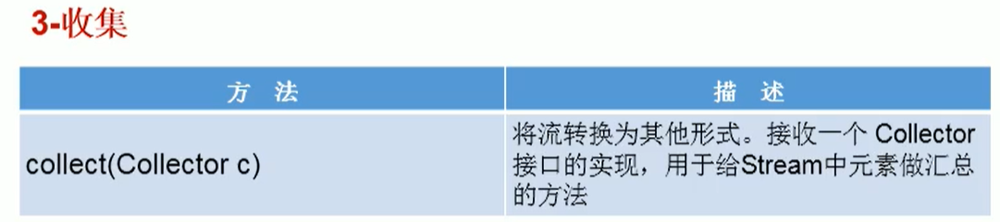

# Stream API

>- Java8中有两大最为重要的改变。第一个是Lambda表达式；另外一个则是StreamAPl。
>- Stream API（java.util.stream）把真正的函数式编程风格引入到Java中。这是目前为止对Java类库最好的补充，因为StreamAPI可以极大提供Java程序员的生产力，让程序员写出高效率、干净、简洁的代码。
>- Stream是Java8中处理集合的关键抽象概念，它可以指定你希望对集合进行的操作，可以执行非常复杂的查找、过滤和映射数据等操作。使用Stream API对集合数据进行操作，就类似于使用SQL执行的数据库查询。也可以使用StreamAPI来并行执行操作。简言之，StreamAPl提供了一种高效且易于使用的处理数据的方式。

# 为什么要使用Stream API

>- 实际开发中，项目中多数数据源都来自于Mysql，Oracle等。但现在数据源可以更多了，有MongDB，Radis等，而这些NoSQL的数据就需要Java层面去处理。
>- Stream和Collection集合的区别：Collection是一种静态的内存数据结构，而Stream是有关计算的。前者是主要面向内存，存储在内存中，后者主要是面向CPU，通过CPU实现计算。

# Stream的解释

- Stream到底是什么呢？

>- 是数据渠道，用于操作数据源（集合、数组等）所生成的元素序列。
>- 集合讲的是数据，Stream讲的是计算！

- 注意：

>- Stream自己不会存储元素。
>- Stream 不会改变源对象。相反，他们会返回一个持有结果的新Stream。
>- Stream操作是延迟执行的。这意味着他们会等到需要结果的时候才执行。

# Stream操作步骤

1. 创建 Stream 
   - 一个数据源（如：集合、数组），获取一个流
2. 中间操作
   - 一个中间操作链，对数据源的数据进行处理
3. 终止操作（终端操作）
   - 一旦执行终止操作，就执行中间操作链，并产生结果。之后，不会再被使用


# 创建Stream

- **创建 Stream方式一：通过集合**
- Java8中的Collection接口被扩展，提供了两个获取流的方法：

```java
default Stream<E>stream ()：//返回一个顺序流
default Stream<E>parallelStream ()：//返回一个并行流
```

- **方式一：通过集合方式创建**

```java
@Test
public void test1(){
    List<String> list = Arrays.asList("北京","上海","广州","深圳");
    final Stream<String> stream = list.stream(); //返回一个顺序流
    final Stream<String> parallelStream = list.parallelStream(); //返回一个并行流
}
```

- Java8中的Arrays的静态方法stream（）可以获取数组流：

```java
static <T> Stream<T> stream（T array）：//返回一个流
```

- 重载形式，能够处理对应基本类型的数组：

```java
public static IntStream stream(int[]array)
public static LongStream stream(long[]]array)
public static DoubleStream stream(double[]array)
```

- **方式二：通过数组方式创建**

```java
@Test
public void test2(){
    int[] ints = {1,2,3,4,5,6};
    final IntStream stream = Arrays.stream(ints);

    final Person p1 = new Person("张三");
    final Person p2 = new Person("李四");
    Person[] people = {p1,p2};
    final Stream<Person> personStream = Arrays.stream(people);
}
```

- **方式三：通过Stream的of()**

```java
@Test
public void test3(){
    final Stream<Integer> stream = Stream.of(1, 2, 3, 4, 5, 6);
}
```

# Stream的中间操作

>- **多个中间操作可以连接起来形成一个流水线，除非流水线上触发终止操作，否则中间操作不会执行任何的处理！而在终止操作时一次性全部处理，称为“惰性求值”。**


- **员工类**

```java
public class Employee {
    private String name;
    private int age;

    public Employee(String name) {
        this.name = name;
    }
    public Employee(String name, int age){
        this(name);
        this.age = age;
    }

    public String getName() {
        return name;
    }
    public int getAge() {
        return age;
    }

    public static List<Employee> getPersonList(){
        List<Employee> list = new ArrayList<>();
        list.add(new Employee("唐僧",60));
        list.add(new Employee("孙悟空",500));
        list.add(new Employee("猪八戒",200));
        list.add(new Employee("沙和尚",222));
        list.add(new Employee("白骨精",330));
        list.add(new Employee("蜘蛛精",320));
        return list;
    }

    @Override
    public boolean equals(Object o) {
        if (this == o) return true;
        if (o == null || getClass() != o.getClass()) return false;
        Employee employee = (Employee) o;
        return age == employee.age &&
            Objects.equals(name, employee.name);
    }

    @Override
    public int hashCode() {
        return Objects.hash(name, age);
    }

    @Override
    public String toString() {
        return "Person{" +
            "name='" + name + '\'' +
            ", age=" + age +
            '}';
    }
}
```

## 1.筛选与切片

- **实例一：查询员工中年龄大于300岁的人**

```java
@Test
public void test1(){
    final List<Employee> list = Employee.getPersonList();
    final Stream<Employee> stream = list.stream();
    //过滤掉年龄小于30岁的
    stream.filter(p -> p.getAge() > 300).forEach(System.out::println);
}
```


- **查询年龄大于300岁的最前面两个人**

```java
@Test
public void test1(){
    final List<Employee> list = Employee.getPersonList();
    final Stream<Employee> stream = list.stream();
    //过滤掉年龄小于30岁的
    stream.filter(p -> p.getAge() > 300).forEach(System.out::println);

    System.out.println("-----截断流，使元素不超过指定数量----");
    //注意：Stream是惰性流，使用完就会关闭，所以需要使用的时候又要重新开
    list.stream().filter(p -> p.getAge() > 300).limit(2).forEach(System.out::println);
}
```


- **跳过前两个人不访问**

```java
@Test
public void test1(){
    final List<Employee> list = Employee.getPersonList();
    final Stream<Employee> stream = list.stream();

    System.out.println("----跳过元素，返回一个扔掉了前n个元素的流。若流中元素不足n个则返回一个空流，与limit()互补---");
    list.stream().skip(2).forEach(System.out::println);
}
```


- **去除重复元素**

```java
@Test
public void test1(){
    final List<Employee> list = Employee.getPersonList();
    final Stream<Employee> stream = list.stream();
    
    System.out.println("---distinct()一筛选，通过流所生成元素的 hashcode()和equals()去除重复元素---");
    list.add(new Employee("芭蕉精",150));
    list.add(new Employee("芭蕉精",150));
    list.add(new Employee("芭蕉精",150));
    list.add(new Employee("芭蕉精",150));
    list.add(new Employee("芭蕉精",150));
    list.stream().distinct().forEach(System.out::println);
}
```


## 2.映射

>- **map（Function f）—接收一个函数作为参数，将元素转换成其他形式或提取信息，该函数会被应用到每个元素上，并将其映射成一个新的元素。**

```java
@Test
public void test2(){
    final List<String> list = Arrays.asList("apple", "banana", "pear", "peach", "watermelon");
    //map里就是一个映射,把集合中的对象都转换(映射)为大写
    list.stream().map(x -> x.toUpperCase()).forEach(System.out::println);
}
/*输出：
APPLE
BANANA
PEAR
PEACH
WATERMELON
*/
```

- **练习：获取员工姓名长度大于3的员工的姓名。**

```java
@Test
public void test2(){
    final List<Employee> personList = Employee.getPersonList();
    personList.add(new Employee("释迦牟尼",1000));
    personList.add(new Employee("南海观世音",800));
    //map里面放一个函数
    //自变量通过函数映射得到因变量的一个集合
    final Stream<String> stringStream = personList.stream().map(Employee::getName);
    stringStream.filter(x -> x.length() > 3).forEach(System.out::println);
}
/*输出：
释迦牟尼
南海观世音
*/
```

>- **flatMap（Function fl)一接收一个函数作为参数，将流中的每个值都换成另一个流，将流中的每个值都换成另一个流，然后把所有流连接成一个流。**

- 测试

```java
@Test
public void test3(){
    final List<String> list = Arrays.asList("apple", "banana", "pear", "peach", "watermelon");
    final Stream<Stream<Character>> streamStream = list.stream().map(StreamTest::fromStringToStream);
    streamStream.forEach(s -> s.forEach(System.out::print));
    System.out.println();
    System.out.println("---一层遍历即可---");
    final Stream<Character> characterStream = list.stream().flatMap(StreamTest::fromStringToStream);
    characterStream.forEach(System.out::print);
}

public static Stream<Character> fromStringToStream(String str){
    ArrayList<Character> list = new ArrayList<>();
    for (char c : str.toCharArray()) {
        list.add(c);
    }
    return list.stream();
}
```

## 3.排序

```java
@Test
public void test4(){
    final List<Integer> list = Arrays.asList(15, 14, 59, 48, 36, 20, 89, -1, -8);
    //sorted()自然排序：默认从小到大进行排序
    list.stream().sorted().forEach(System.out::println);

    final List<Employee> personList = Employee.getPersonList();
    //定制排序，传入一个比较器
    personList.stream().sorted((t1,t2) -> t1.getAge() - t2.getAge()).forEach(System.out::println);
}
```

# Stream的终止操作

- 终端操作会从流的流水线生成结果。其结果可以是任何不是流的值，例如：List、Integer，甚至是void。
- 流进行了终止操作后，不能再次使用。


## 1.匹配与查找

- **练习1：是否所有员工的年龄都大于300岁**

```java
@Test
public void test1(){
    final List<Employee> personList = Employee.getPersonList();
    //allMatch（Predicate p）—检查是否匹配所有元素。
    final boolean b = personList.stream().allMatch(p -> p.getAge() > 300);
    System.out.println(b);
}
```

- **练习2：是否存在员工年龄小于100岁**

```java
  @Test
   public void test2(){
        final List<Employee> personList = Employee.getPersonList();
       //anyMatch（Predicate p）—检查是否至少匹配一个元素。
        final boolean b1 = personList.stream().anyMatch(p -> p.getAge() < 100);
        System.out.println(b1);
    }
```

- **练习3：是否存在员工“孙”**

```java
@Test
public void test3(){
    final List<Employee> personList = Employee.getPersonList();
    //noneMatch（Predicate p）—检查是否没有匹配的元素。
    final boolean noneMatch = personList.stream().noneMatch(p -> p.getName().startsWith("孙"));
    System.out.println(noneMatch); //如果有员工姓孙就返回flase
}
```

- **练习4**

```java
@Test
public void test4(){
    final List<Employee> personList = Employee.getPersonList();
    //findFirst()返回第一个元素
    final Optional<Employee> first = personList.stream().findFirst();
    System.out.println(first);

    //findAny()返回流中的任意一个元素
    final Optional<Employee> any = personList.parallelStream().findAny();
    System.out.println(any);

    //count()返回指定流中的元素总数
    final long count = personList.stream().filter(p -> p.getAge() <300).count();
    System.out.println(count);

    //max()返回流中最大值
    //返回最高工资的员工
    final Optional<Employee> maxP = personList.stream().max((p1, p2) -> p1.getAge() - p2.getAge());
    System.out.println(maxP); 

    //返回员工中的最高工资
    final Stream<Integer> stream = personList.stream().map(Employee::getAge);
    final Optional<Integer> max = stream.max((t1, t2) -> t1 - t2);
    System.out.println(max); 

    //min()返回流中最小值
    final Optional<Employee> min = personList.stream().min((p1, p2) -> p1.getAge() - p2.getAge());
    System.out.println(min);

    //内部迭代：迭代输出
    personList.stream().forEach(System.out::println);
    //personList集合也有forEach()方法：这种叫外部迭代
    personList.forEach(System.out::println);
}
```

## 2.规约


- **备注：map和reduce的连接通常称为map-reduce模式，因Google用它来进行网络搜索而出名。**

- **练习一：计算1-10自然数的和**

```java
@Test
public void test1(){
    List<Integer> list = Arrays.asList(1,2,3,4,5,6,7,8,9,10);
    //第一个参数为开始做加号运算的初始值
    //引用Integer类的两数相加的sum()方法
    final Integer sum = list.stream().reduce(0, Integer::sum);
    System.out.println(sum);
}
```

- **练习二：计算所有员工的年龄和**

```java
@Test
public void test2(){
    final List<Employee> list = Employee.getPersonList();
    //1.得到所有员工年龄的集合
    final Stream<Integer> stream = list.stream().map(Employee::getAge);
    //2.对所有的年龄进行归约
    final Integer ageSum = stream.reduce(0, Integer::sum);
    System.out.println(ageSum);

    //---也可以：不加初始值0返回的是一个Optional对象
    final Optional<Integer> ageSum = stream.reduce(Integer::sum);
    System.out.println(ageSum); 

    //也可以自己定义归约的方法，这里设置为减法
    final Optional<Integer> ageSum = stream.reduce((p1, p2) -> p1 - p2);
    System.out.println(ageSum);
}
```

## 3.收集



- Collector 接口中方法的实现决定了如何对流执行收集的操作（如收集到List、Set、Map）。
- 另外，Collectors实用类提供了很多静态方法，可以方便地创建常见收集器实例，具体方法与实例如下表：


- **收集年龄大于300岁的员工信息**

```java
@Test
public void test1(){
    final List<Employee> list = Employee.getPersonList();
    final List<Employee> collectList = list.stream().filter(p -> p.getAge() > 300).collect(Collectors.toList());
    collectList.forEach(System.out::println);

    System.out.println("-------------------");
    final Set<Employee> collectSet = list.stream().filter(p -> p.getAge() > 300).collect(Collectors.toSet());
    collectSet.forEach(System.out::println);
}
```

# Optional类

>- 到目前为止，臭名昭的空指针异常是导致Java应用程序失败的最常见原因。以前，为了解决空指针异常，Google公司著名的Guava项目引入了Optional类，Guava通过使用检查空值的方式来防止代码污染，它鼓励程序员写更干净的代码。受到Google Guava的启发，Optional类已经成为Java8类库的一部分。
>- Optional< T >类（java.util.Optional）是一个容器类，它可以保存类型T的值，代表这个值存在。或者仅仅保存null，表示这个值不存在。原来用null表示一个值不存在，现在Optional可以更好的表达这个概念。并且可以避免空指针异常。
>- Optional类的Javadoc描述如下：这是一个可以为null的容器对象。如果值存在则isPresen()方法会返回true，调用get()方法会返回该对象。