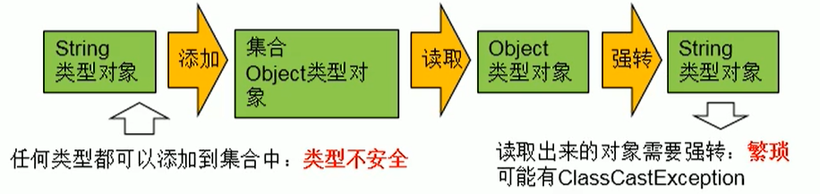

# 引入

- 泛型：标签

- 举例：

>- 中药店，每个抽屉外面贴着标签
>
>- 超市购物架上很多瓶子，每个瓶子装的是什么，有标签

- 泛型设计背景：

>- 集合容器类在设计阶段/声明阶段不能确定这个容器到底实际存的是什么类型的对象，所以在JDK1.5之前只能把元素类型设计为object，JDK1.5之后使用泛型来解决。因为这个时候除了元素的类型不确定，其他的部分是确定的，例如关于这个元素如何保存，如何管理等是确定的，因此此时把元素的类型设计成一个参数，这个类型参数叫做泛型。
>- Collection< E >，List< E >，ArrayList< E >这个< E >就是类型参数，即泛型。

# 泛型的概念

- 所谓泛型，就是允许在定义类、接口时通过一个标识表示类中某个属性的类型或者是某个方法的返回值及参数类型。这个类型参数将在使用时（例如，继承或实现这个接口，用这个类型声明变量、创建对象时）确定（即传入实际的类型参数，也称为类型实参）。
- 从JDK1.5以后，Java引入了“参数化类型（Parameterized type）”的概念，允许我们在创建集合时再指定集合元素的类型，正如：List< String >，这表明该List只能保存字符串类型的对象。
- JDK1.5改写了集合框架中的全部接口和类，为这些接口、类增加了泛型支持，从而可以在声明集合变量、创建集合对象时传入类型实参。

# 使用泛型的原因

- 为什么要有泛型呢，直接Object不是也可以存储数据吗？
  1. 解决元素存储的安全性问题，好比商品、药品标签，不会弄错。
  2. 解决获取数据元素时，需要类型强制转换的问题，好比不用每回拿商品、药品都要辨别。



# 自定义泛型结构

1. 泛型类可能有多个参数，此时应将多个参数一起放在尖括号内。比如：<E1，E2，E3>
2. 泛型类的构造器如下：

```java
public GenericClass(){} //正确
public GenericClass<E>(){} //错误
```

3. 实例化后，操作原来泛型位置的结构必须与指定的泛型类型一致。

4. 泛型不同的引用不能相互赋值。

>- 尽管在编译时ArrayList< String >和ArrayList< lnteger >是两种类型，但是，在运行时只有一个ArrayList被加载到JVM中。

5. 泛型如果不指定，将被擦除，泛型对应的类型均按照Object处理，但不等价于Object。

   - 经验：泛型要使用一路都用。要不用，一路都不要用。

6. 如果泛型结构是一个接口或抽象类，则不可创建泛型类的对象。

7. jdk1.7，泛型的简化操作：ArrayList< Fruit > fruit = new ArrayList<>()；

8. 泛型的指定中不能使用基本数据类型，可以使用包装类替换。

9. 在类/接口上声明的泛型，在本类或本接口中即代表某种类型，可以作为非静态属性的类型、非静态方法的参数类型、非静态方法的返回值类型。但在静态方法中不能使用类的泛型。

10. 异常类不能是泛型的

11. 不能使用new E[ ]。但是可以：E[ ] elements=(E[ ])new Object[capacity]；

    - 参考：ArrayList源码中声明：Object[ ] elementData，而非泛型参数类型数组。

12. 父类有泛型，子类可以选择保留泛型也可以选择指定泛型类型：

    - 子类不保留父类的泛型：按需实现

    >- 没有类型 擦除
    >- 具体类型

    - 子类保留父类的泛型：泛型子类

    >- 全部保留
    >- 部分保留

- 结论：子类必须是“富二代”，子类除了指定或保留父类的泛型，还可以增加自己的泛型

# 泛型方法

- 泛型方法：在方法中出现了泛型的结构，泛型参数与类的泛型参数没有任何关系。
- 换句话说，泛型方法所属的类是不是泛型类都没有关系。
- 泛型方法，可以声明为静态的。
  - 原因：泛型参数是在调用方法时确定的。并非在实例化类时确定。

```java
//在一个类中创建泛型方法
@Test
public void test1() {
    Integer[] list = {1,2,3,4,5,6};
    final List<Integer> desc = getList(list);
    System.out.println(desc);
}

//<E> 告诉编译器是泛型方法 
//List<E> 返回List对象
public static <E> List<E> getList(E[] list){
    ArrayList<E> desc = new ArrayList<>();
    Collections.addAll(desc, list);
    return desc;
}
```

# 通配符

-  G< String >和 G< Integer >是没有关系的，二者共同的父类是：G<?>

```java
@Test
public void test(){
    List<String> list1 = new ArrayList<>();
    List<Integer> list2 = new ArrayList<>();
    list1.add("Tom");
    list2.add(1);
    print(list1);
    print(list2);
}
public void print(List<?> list){
    for (Object o : list) {
        System.out.println(o);
    }
}
```

# 有限制的通配符

- <?>：允许所有泛型的引用调用
- 通配符指定上限
  - 上限extends：使用时指定的类型必须是继承某个类，或者实现某个接口，即<=
- 通配符指定下限
  - 下限super：使用时指定的类型不能小于操作的类，即>=
- 举例：
  - <？extends Number>（无穷小，Number ]
    - 只允许泛型为Number及Number子类的引用调用
  - <？super Numlber>[Number，无穷大）
    - 只允许泛型为Number及Number父类的引用调用
  - <？extends Comparable>
    - 只允许泛型为实现Comparable接口的实现类的引用调用