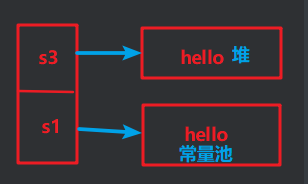
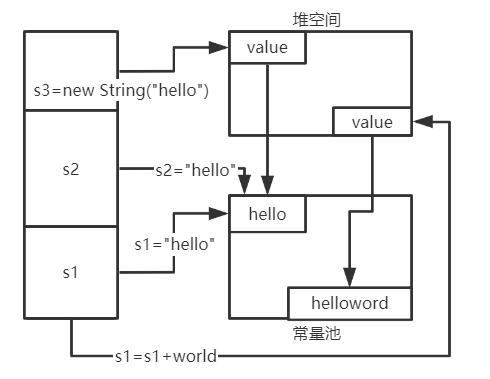
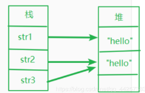
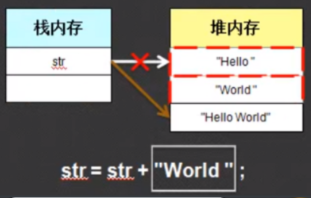
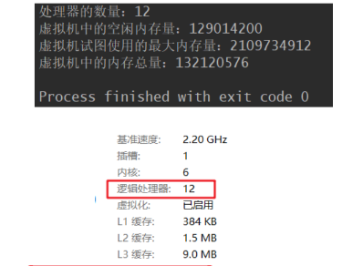
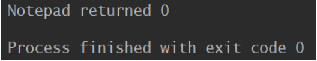

# String类

```java
public final class String implements Serializable, Comparable<String>, CharSequence {
    @Stable
    private final byte[] value;
    private final byte coder;
    private int hash;
    //......
}
```

>- 字符串用一对" "引起来表示
>- String实现了Serializable接口：表示字符串是支持序列化的，即可以传输
>- String实现了Comparable接口，表示可以比较大小
>- String内部定义了final byte[] value用于存储字符串数据，说明了String是不可变的

- String具有不可变性:

> 1. 当堆字符串重新赋值时，需要重写指定内存区域赋值，不能使用原有的value进行赋值
> 2. 当对现有的字符串进行连接操作时，也需要重新指定内存区域，不能使用原有的value
> 3. 当调用String的replace()方法修改指定的字符或字符串时，也需要重新指定内存区域赋值
>- 通过字面量的方式（区别new）给一个字符串赋值，此时的字符串值声明在字符串常量池中
>- 字符串常量池中是不会存储相同内容的字符串的

- **String对象的创建**

>1. 通过字面量的方式创建
>   - 以下面测试的s1为例，s1的数据hello声明在方法区的字符串常量中
>2. 通过new + 构造器的方式
>   - 以下面测试的s3为例，s3的保存的地址值是数据在堆区开辟空间以后对应的值

```java
String s1 = "hello"; 
String s2 = new String(); //等同于String s2 ="";  
String s3 = new String("hello");
public String(char[] value) {
    //...
}
public String(char[] value, int offset, int count) {
   //...
}
```



>String str2 = new String("hello");方式创建对象，在内存中创建了几个对象？
>
>- 两个：一个是堆空间中new结构，另一个是byte[ ]对应的常量池中的数据："hello"。



- **测试1：**

```java
String str1="Hello"; //字面量的定义方式
String str2=new String("hello");
String str3=str2;
//比较地址值
System.out.println(str1==str2); // false
System.out.println(str2==str3); // true
```



>- == 是用来比较数值的，地址不同数值就不同，比较内容用equals方法

- **测试2：字符串常量池**

```java
String s1 = "abc";
String s2 = "abc";
String s3 = new String("abc");
System.out.println(s1 == s2); // true
System.out.println(s1 == s3); // false
```

>- JVM在运行到字符串字面量时，会从字符串常量池中查找是否有字符序列相同的对象，如果有，取现成的对象，如果没有，在字符串常量池中创建一个对象，并返回。使用new String()都是创建一个新对象。
>- 对象池使用的基本思路是：将用过的对象保存起来，等下一次需要这种对象的时候，再拿出来重复使用，从而在一定程度上减少频繁创建对象所造成的开销

- **测试3:**

```java
public class Main {
    public static void main(String[] args) {
         String final s0 = "hello"; //常量
        String s1 = "hello";
        String s2 = "world";
        String s3 = "hello" + "world";
        String s4 = s1 + "world"; //有1个变量
        String s5 = "hello" + s2; //有1个变量
        String s6 = s1 + s2; //有2个变量
        String s7 = (s1 + s2).intern();
        String s8 = "helloworld";
        String s9 = s0 + s2; //常量和常量的拼接结果还是在常量池
     
        System.out.println(s3 == s4); //flase
        System.out.println(s3 == s5); //flase
        System.out.println(s3 == s6); //flase
        System.out.println(s3 == s7); //true
        System.out.println(s3 == s8); //true
        System.out.println(s3 == s9); //true
    }
}
```

结论：

>- 常量与常量的拼接结果在常量池，且常量池不会存放相同类型的常量
>- 只要其中有一个是变量，结果就在堆中
>- 如果拼接的结果调用intern()方法，返回值就在常量池中

- **测试4**

```java
public class Main {
    String s = new String("hello");
    char[] chars = {'b', 'e', 'l', 'l'};

    public void change(String s, char[] chars) {
        s = "world";
        chars[0] = 'p';
    }

    public static void main(String[] args) {
        Main main = new Main();
        main.change(main.s, main.chars);
        System.out.println(main.s); //hello
        System.out.println(main.chars); //pell
    }
}
//String比较特殊，再次证明了String的不可变性。调用方法时虽然传入了的是地址引用s，但是本质内容没有被修改
```

- **测试5：String与byte[ ]之间的转换**

>- 编码：String ---> byte[ ]：调用String的getBytes()
>  - 字符串到字节，看得懂 ---> 看不懂的二进制数据
>- 解码： byte[ ] ---> String：调用String的构造器
>  - 编码的逆过程。字节到字符，看不懂的二进制数据 ---> 看得懂

```java
public class Main {
    public static void main(String[] args) throws UnsupportedEncodingException {
        String s = "China中国";
        byte[] b1 = s.getBytes(); //使用默认字符集进行编码，UTF-8
        System.out.println(Arrays.toString(b1)); //编码结果：[67, 104, 105, 110, 97, -28, -72, -83, -27, -101, -67]
        byte[] b2 = s.getBytes("GBK"); //使用GBK字符集进行编码
        System.out.println(Arrays.toString(b2)); //编码结果：[67, 104, 105, 110, 97, -42, -48, -71, -6]

        //使用默认字符集进行解码
        String s1 = new String(b1); 
        String s2 = new String(b2);
        //使用GBK字符集进行解码
        String s3 = new String(b2, "GBK");
        
        System.out.println(s1); //输出：China中国
        System.out.println(s2); //输出：China�й� --- 出现乱码：因为使用GBK进行的编码，但使用UTF-8进行的解码。编码与解码的字符集必须统一，否则就会出现乱码
        System.out.println(s3); //输出：China中国
    }
}
```

# StringBuffer类

- String对象一经声明，便不能修改它的内容，修改的只是引用的地址
- 而StringBuffer对象是可以改变它的内容的，是线程安全的，效率低

```java
 byte[] value; //底层数组并没有像String类中加了final,说明是可变的
```

- 如果要添加的底层数组盛不下了，那就需要扩容底层的数组。默认情况下扩容为原来容量的2倍+2，同时将原有数组的元素复制到新数组中

```java
int newCapacity = (oldCapacity << 1) + 2;
```

```java
public static void main(String[] args) {
    String str= "hello ";
    //通过地址值生成的哈希码
    System.out.println(System.identityHashCode(str)); //输出：257895351
    str=str+"world";
    System.out.println(System.identityHashCode(str)); //输出：1134712904

    StringBuffer sb=new StringBuffer("hello ");
    System.out.println(System.identityHashCode(sb)); //输出：1435804085
    sb.append("world");
    System.out.println(System.identityHashCode(sb)); //输出：1435804085
}
```

>上面代码中的System.identityHashCode()返回的是对象的内存地址。可见，String字符串的内存地址改变了，而StringBuffer的内存地址并没有改变。说明修改String内容其实是引用关系的改变。原理如下图，其实是开辟了两个新的字符串堆内存，然后将String对象的内存地址改为"Hello world"字符串的地址，而旧的字符串并没有任何改变，也没有任何引用。这样就产生了两块垃圾空间。



### **StringBuffer的初始化**

`StringBuffer`不能像String那样直接用字符串赋值，所以也不能那样初始化。它需要通过构造方法来初始化，一共有4个构造方法

```java
public StringBuffer()
public StringBuffer(CharSequence seq)
public StringBuffer(int capacity) //指定容量大小，推荐使用，避免扩容操作，提升效率
public StringBuffer(String str)
```

### **StringBuffer和String的互换**

```java
1.String转换为StringBuffer有两种方法：

//（1）利用StringBuffer的构造方法：
public StringBuffer(String str)
    
//（2）利用StringBuffer的append()方法：
public StringBuffer append(String str)
   
2.StringBuffer转换为String也有两种方法：

//（1）利用StringBuffer的toString()方法：
public String toString()
    
//（2）利用String的构造方法：
public String(StringBuffer buffer)
```

**String类还提供了一个与StringBuffer对象作内容比较的方法**

```java
public boolean contentEquals(StringBuffer sb)
```

### StringBuffer的常用方法

```java
//1.将指定的字符串追加到此字符序列。：增
public StringBuffer append(T t)
    
//2.移除此序列的子字符串(从[start,end))中的字符。（注意不是字节，所有一个中文和一个英文都相当于一个字符）：删
public StringBuffer delete(int start,int end)
    
//3.将指定类型的数据插入到StringBuffer序列指定位置：改
public StringBuffer insert(int offset,T t)
//使用给定String中的字符替换此序列的子字符串中的字符。
public replace(int start, int end, String str)
    
//4.返回此序列中指定索引处的char值：查
char charAt(int index)
```

测试

```java
public static void main(String[] args) {
    StringBuffer sb=new StringBuffer("hello ");
    sb.append("world");
    sb.insert(0,"你好啊");
    System.out.println(sb); //输出：你好啊hello world
    //删除[0,2)
    sb.delete(0,2);
    System.out.println(sb); //输出 啊hello world
}
```

# StringBuilder类

>**String类和StringBuffer类都是jdk1.0出现的，而StringBuilder是在jdk1.5出现的。StringBuilder拥有和StringBuilder一样的构造方法和方法函数，唯一不同的是StringBuffer是线程同步的安全操作，它的方法都被synchronized修饰，而StringBuilder是异步的。**

- 小结：通常情况下涉及到字符串我们都使用String类，除非涉及到多次反复修改可以用StringBuffer或StringBuilder。

# Runtime类

1. Runtime类封装了运行时的环境。每个 Java 应用程序都有一个 Runtime 类实例，使应用程序能够与其运行的环境相连接。
2. 一般不能实例化一个Runtime对象，应用程序也不能创建自己的 Runtime 类实例，但可以通过 getRuntime 方法获取当前Runtime运行时对象的引用。
3. 一旦得到了一个当前的Runtime对象的引用，就可以调用Runtime对象的方法去控制Java虚拟机的状态和行为。 
4. 当Applet和其他不被信任的代码调用任何Runtime方法时，常常会引起SecurityException异常。


## runtime（运行时机制）是什么

>- runtime是属于OC的底层，是一套比较底层的纯C语言API, 属于1个C语言库, 包含了很多底层的C语言API，可以进行一些非常底层的操作(用OC是无法现实的, 不好实现)。 在我们平时编写的OC代码中, 程序运行过程时, 其实最终都是转成了runtime的C语言代码, runtime算是OC的幕后工作者。
>
>- OC代码： OC是C的超集，所有C语言的特性，在OC上都可以使用。

## 常见的运用

### 1.得到系统内存的一些信息

```java
public class RuntimeTest {
    public static void main(String[] args) {
        Runtime runtime = Runtime.getRuntime();
        int processors = runtime.availableProcessors();
        long freeMemory = runtime.freeMemory();
        long maxMemory = runtime.maxMemory();
        long totalMemory = runtime.totalMemory();

        System.out.println("处理器的数量：" + processors);
        System.out.println("虚拟机中的空闲内存量：" + freeMemory);
        System.out.println("虚拟机试图使用的最大内存量：" + maxMemory);
        System.out.println("虚拟机中的内存总量：" + totalMemory);
    }
}

```



### 2.内存管理

>Java提供了无用单元自动收集机制。通过totalMemory()和freeMemory()方法可以知道对象的堆内存有多大，还剩多少。
>Java会周期性的回收垃圾对象（未使用的对象），以便释放内存空间。但是如果想先于收集器的下一次指定周期来收集废弃的对象，可以通过调用gc()方法来根据需要运行无用单元收集器。一个很好的试验方法是先调用gc()方法，然后调用freeMemory()方法来查看基本的内存使用情况，接着执行代码，然后再次调用freeMemory()方法看看分配了多少内存。下面的程序演示了这个构想。

# Runtime类与Process类

### 3.执行其他程序

在安全的环境中，可以在多任务操作系统中使用Java去执行其他特别大的进程（也就是程序）。exec()方法有几种形式命名想要运行的程序和它的输入参数。**exec()方法返回一个Process对象**，可以使用这个对象控制Java程序与新运行的进程进行交互。exec()方法本质是依赖于环境。
下面的例子是**使用exec()方法启动windows的记事本notepad**。这个例子必须在Windows操作系统上运行。

```java
public class RuntimeTest {
    public static void main(String[] args)  {
        Runtime rt = Runtime.getRuntime();
        Process p = null;
        try{
            p = rt.exec("notepad");
        }catch(IOException e)
        {
            System.out.println("Execute error!");
        }
    }
}
```

exec()还有其他几种形式，例子中演示的是最常用的一种。exec()方法返回Process对象后，在新程序开始运行后就可以使用Process的方法了。可以用destory()方法杀死子进程，也可以使用waitFor()方法等待程序直到子程序结束，exitValue()方法返回子进程结束时返回的值。如果没有错误，将返回0，否则返回非0。

```java
public class RuntimeTest {
    public static void main(String[] args)  {
        Runtime r = Runtime.getRuntime();
        Process p = null;
        try{
            p = r.exec("notepad");
            p.waitFor();
        } catch (Exception e) {
            System.out.println("Error executing notepad.");
        }
        System.out.println("Notepad returned " + p.exitValue());
    }
}
```

运行结果：（当关闭记事本后，会接着运行程序，打印信息）



当子进程正在运行时，可以对标准输入输出进行读写。getOutputStream()方法和getInPutStream()方法返回对子进程的标准输入和输出。

# Locale类

### Java国际化

我们使用java.lang.Locale来构造Java国际化的情境。

java.lang.Locale代表特定的地理、政治和文化。需要Locale来执行其任务的操作叫语言环境敏感的操作。

构造一个系统默认的Locale

**构造一个系统默认的Locale**

`Locale defaultLocale = Locale.getDefault();`

```java
  public static void main(String[] args) {
        Locale defaultLocale = Locale.getDefault();//获得此Java虚拟机当前线程默认的语言环境值

        String country = defaultLocale.getCountry();//返回国家地区代码

        String language = defaultLocale.getLanguage();//返回国家的语言

        String displayCountry = defaultLocale.getDisplayCountry();//返回适合向用户显示的国家信息

        String displayLanaguage = defaultLocale.getDisplayLanguage();//返回适合向用户展示的语言信息

        String displayName = defaultLocale.getDisplayName();//返回适合向用户展示的语言环境名

        System.out.println("国家地区代码："+country); //CN
        System.out.println("国家的语言："+language); //zh
        System.out.println("国家信息："+displayCountry); //中国
        System.out.println("语言信息："+displayLanaguage); //中文
        System.out.println("语言环境名："+displayName); //中文(中国)
    }
```

# System类

## **1.获取系统当前毫秒值（public static long currentTimeMillis()）**

- 返回当前时间与1970年1月1日0时0分0秒之间以毫秒为单位的时间差
  - 称为时间戳
  - 通常用来计算时间差

```java
public static void main(String[] args) {
    long start = System.currentTimeMillis();
    for(int i=1;i<=9;i++) {
        for(int j=1;j<=i;j++) {
            System.out.printf("%d x %d = %d \t",j,i,(j*i));

        }
        System.out.println();
    }
    long end = System.currentTimeMillis();
    System.out.printf("程序运行时间为[%d]毫秒！",(end-start));
}
```

## **2.结束正在运行的Java程序（public staitc void exit(int status)）**

参数传入一个数字即可。通常传入0记为正常状态，其它为异常状态。

```java
  public static void main(String[] args) {
        int counts = 0;
        while (true) {
            System.out.println(counts+" 测试counts=3后是否退出");
            if (counts == 3) {
                System.exit(0);
            }
            counts++;
        }
    }
```

## **3.垃圾回收器（public static void gc()）**

用来运行JVM中的垃圾回收器，完成内存中垃圾的清除。

```java
class Student{
    //清除垃圾时，会默认调用被清空对象的finalize方法。
    public void finalize() {
        System.out.println("垃圾已经被收取啦！");
    }
}

public class SystemTest {
    public static void main(String[] args) {
        new Student();
        new Student();
        new Student();
        System.gc();
    }
}
```

**finalize()是在java.lang.Object里定义的，也就是说每一个对象都有这么个方法。这个方法在gc启动，该对象被回收的时候被调用。**


## **4.确定当前的系统属性（public static getProperties `**getProperties**()` ）**

```java
public static void main(String[] args) {
        System.out.println(System.getProperties());
    }
```

## **5.System类方法复制数组**

**（`public static notive void  arraycopy (Object src, int srcPos, Object dest, int destPos, int length)`）**

**【notive 是可以调用当前操作系统来实现数组拷贝的】**

用来实现将源数组部分元素复制到目标数组的指定位置。各个参数功能如下：

>- Object src：要复制的原数组；
>
>- Int srcPos：数组源的起始索引；
>
>- Object dest：复制后的目标数组；
>
>- int destPos：目标数组起始索引；
>
>- int length，指定复制的长度；

**测试**

```java
public static void main(String[] args) {
    int[] src = {1,22,333,4444,5555,666666,7777777};
    int[] dest = {10,20,30};
    System.arraycopy(src, 2, dest, 0, 2);

    for(int i=0;i<dest.length;i++) {
        System.out.println(dest[i]);
    }
}
```

