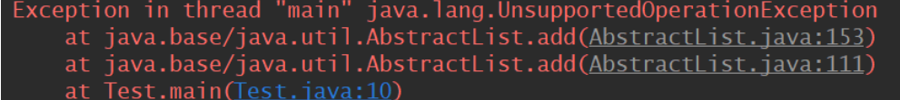
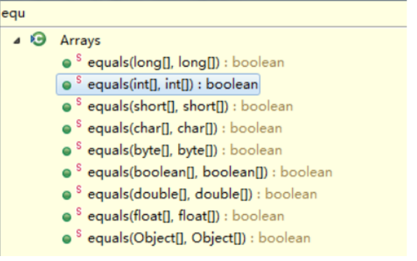

# Arrays类

- Arrays类位于 **java.util** 包中，主要包含了操纵数组的各种方法

### Arrays 类的常用方法

- adList

- sort

- binarySearch
- copyOf
- equals和deepEquals
- toString和deepToString

## Arrays.asList(T… data)

```java
 public static <T> List<T> asList(T... a) {
        return new ArrayList<>(a);
    }
```

作用是返回由指定数组支持的**固定大小列表**。

注意：该方法返回的是 Arrays 内部静态类 ArrayList，而不是我们平常使用的 ArrayList,，该静态类 ArrayList 没有覆盖父类的 add(), remove() 等方法，所以如果直接调用，会报 UnsupportedOperationException 异常

**1.  返回的 ArrayList 数组是一个定长列表，我们只能对其进行查看或者修改，但是不能进行添加或者删除操作**

通过源码我们发现该类是没有add()或者remove() 这样的方法的，如果对其进行增加或者删除操作，都会调用其父类 AbstractList 对应的方法，而追溯父类的方法最终会抛出 UnsupportedOperationException 异常。如下：

```java
  public static void main(String[] args) {
         String[] str = {"a","b","c"};
         List<String> listStr = Arrays.asList(str);
         listStr.set(1, "e");//可以进行修改
         System.out.println(listStr.toString());//[a, e, c]
    }
```

倘若加上

```java
listStr.add("a");//添加元素会报错 java.lang.UnsupportedOperationException 
```



**2. 引用类型的数组和基本类型的数组区别**

```java
  public static void main(String[] args) {
        String[] str = {"a","b","c"};
        List listStr = Arrays.asList(str);
        System.out.println(listStr.size());//3

        int[] i = {1,2,3};
        List listI = Arrays.asList(i);
      //如果将基本数据类型的数组作为参数传入，该方法会把整个数组当作一个元素
        System.out.println(listI.size());//1
    }
```

上面的结果第一个listStr.size()==3，而第二个 listI.size()==1。这是为什么呢？

我们看源码，在 Arrays.asList 中，方法声明为 <T> List<T> asList(T... a)。该方法接收一个可变参数，并且这个可变参数类型是作为泛型的参数。我们知道基本数据类型是不能作为泛型的参数的，但是数组是引用类型，所以数组是可以泛型化的，于是 int[] 作为了整个参数类型，而不是 int 作为参数类型。

```java
 public static void main(String[] args) {
        String[] str = {"a","b","c"};
        List<String> listStr = Arrays.asList(str);
        System.out.println(listStr.size());//3

        int[] i = {1,2,3};
        List<int[]> listI = Arrays.asList(i);//注意这里List参数为 int[] ，而不是 int
        System.out.println(listI.size());//1

        Integer[] in = {1,2,3};
        //这里参数为int的包装类Integer，所以集合长度为3
        List<Integer> listIn = Arrays.asList(in);
        System.out.println(listIn.size());//3
     }
```

**3. 已知数组数据，如何快速获取一个可进行增删改查的列表List？**

用ArrayList 集合类

```java
   public static void main(String[] args) {
        String[] str = {"a","b","c"};
         List<String> listStr = new ArrayList<>(Arrays.asList(str));
        listStr.add("d");
         System.out.println(listStr.size());//4
    }
```

**4. Arrays.asList() 方法使用场景**

Arrays工具类提供了一个方法asList, 使用该方法可以将一个变长参数或者数组转换成List 。但是，所以 **Arrays.asList 比较适合那些已经有数组数据或者一些元素，而需要快速构建一个List，只用于读取操作，而不进行添加或删除操作的场景。**（比如，修改某个位置的元素）；不能执行影响长度的操作（如add、remove等操作），否则会抛出UnsupportedOperationException异常。

所以 **Arrays.asList 比较适合那些已经有数组数据或者一些元素，而需要快速构建一个List，只用于读取操作，而不进行添加或删除操作的场景。**


## sort

该方法是用于数组排序，在 Arrays 类中有该方法的一系列重载方法，能对7种基本数据类型，包括 byte,char,double,float,int,long,short 等都能进行排序，还有 Object 类型（实现了Comparable接口），以及比较器 Comparator 。

**基本类型的数组**

这里我们以 int[ ] 为例看看：

```java
 public static void main(String[] args) {
        int[] num = {1,3,8,5,2,4,6,7};
        Arrays.sort(num);
        System.out.println(Arrays.toString(num));//[1, 2, 3, 4, 5, 6, 7, 8]
    }
```

通过调用 sort(int[] a) 方法，将原数组按照升序的顺序排列。

**对象类型数组**

该类型的数组进行排序可以实现 Comparable 接口，重写 compareTo 方法进行排序。

```java
 public static void main(String[] args) {
        String[] str = {"a","f","c","d"};
        Arrays.sort(str);
        System.out.println(Arrays.toString(str));//[a, c, d, f]
    }
```

String 类型实现了 Comparable 接口，内部的 compareTo 方法是按照字典码进行比较的。

**没有实现Comparable接口的，可以通过Comparator实现排序**

## binarySearch

用二分法查找数组中的某个元素。该方法和 sort 方法一样，**适用于各种基本数据类型以及对象。**

注意：二分法是对以及**有序的数组**进行查找（比如先用Arrays.sort()进行排序，然后调用此方法进行查找）。找到元素返回下标，没有则返回 -1

实例：

```java
  public static void main(String[] args) {
        int[] num = {1,3,8,5,2,4,6,7};
         Arrays.sort(num);
         System.out.println(Arrays.toString(num));//[1, 2, 3, 4, 5, 6, 7, 8]
         System.out.println(Arrays.binarySearch(num, 2));//返回元素的下标 1
    }
```


## copyOf

拷贝数组元素。底层采用 System.arraycopy() 实现，这是一个native方法。

```java
 public static native void arraycopy(Object src,  int  srcPos,
                                        Object dest, int destPos,
                                        int length);
```

src:源数组

srcPos:源数组要复制的起始位置

dest:目的数组

destPos:目的数组放置的起始位置

length:复制的长度

**注意：src 和 dest都必须是同类型或者可以进行转换类型的数组。**

```java
  public static void main(String[] args) {
        int[] num1 = {1,2,3};
        int[] num2 = new int[3];
        System.arraycopy(num1, 0, num2, 0, num1.length);
        System.out.println(Arrays.toString(num2));//[1, 2, 3]
    }
```


## equals 和 deepEquals

**1. equals**

equals 用来比较两个数组中对应位置的每个元素是否相等。



八种基本数据类型以及对象都能进行比较。

- 判断两个数组是否相等

  - 数组元素为基本数据类型时，依次比较值

  - 数组元素为引用数据类型时，依次调用元素的 equals() 方法进行比较

- 即如果两个数组被认为是相等的，则两个数组中应包含相同顺序的相同元素

```java
Integer[] data1 = {1, 2, 3};
Integer[] data2 = {1, 2, 3};
System.out.println(Arrays.equals(data1, data2)); // true
```

**deepEquals**

- 判断两个多维数组是否相等
  - 数组元素为基本数据类型时，依次比较值
  - 数组元素为引用数据类型时，依次调用元素的 equals() 方法进行比较
- 即如果两个多维数组被认为是相等的，则两个多维数组中应包含相同顺序的相同元素

```java
 public static void main(String[] args) {
        String[][] name1 = {{ "G","a","o" },{ "H","u","a","n"},{ "j","i","e"}};
        String[][] name2 = {{ "G","a","o" },{ "H","u","a","n"},{ "j","i","e"}};
        System.out.println(Arrays.equals(name1,name2));// false
        System.out.println(Arrays.deepEquals(name1,name2));// true
    }
```


## toString

返回数组元素的字符串形式

```java
Integer[] data = {1, 2, 3};
System.out.println(Arrays.toString(data)); // [1, 2, 3]
```

## deepToString

返回多维数组元素的字符串形式
