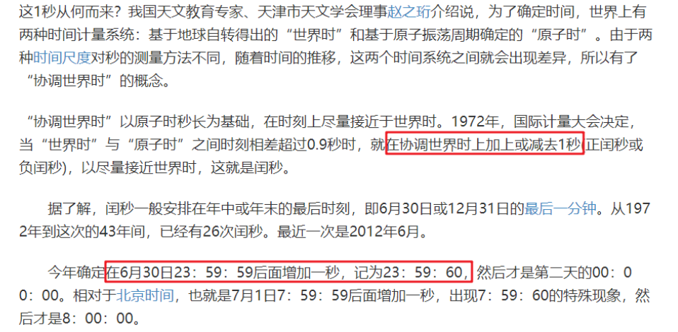
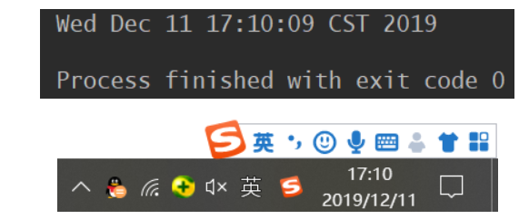
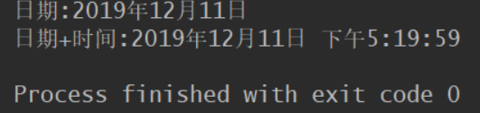
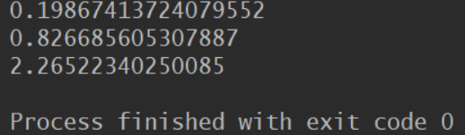
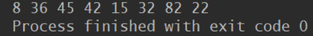
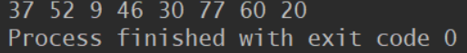
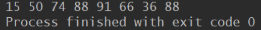
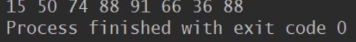
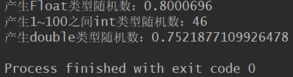

# 日期操作类

## Date类

表示特定的瞬间，精确到毫秒（因为闰秒的原因，所以其实结果并不是特别的准确，但是如果要求不是特别严格，影响并没有很大。）

**什么是闰秒？**



1. java.util.Date类两个构造器的使用
   - 空参
   - 传入当前时间戳作为构造器参数
2. 两个方法的使用
   - toString：显示当前的年月日，时分秒
   - getTime：获取当前Date对象的时间戳
3. java.sql.Date对应着数据库中的日期类型变量
   - 如何实例化
   - 如何将java.util.Date对象转换为java.sql.Date对象

```java
public static void main(String[] args) {
    Date date1 = new Date1(); //创建了一个对应当前时间的Date对象
    System.out.println(date.toString());
    System.out.println(date1.getTime()); //输出：1586674536216

    Date date2 = new Date(1576674536216L); //创建指定毫秒数的Date对象
    System.out.println(date2); //输出：Wed Dec 18 21:08:56 CST 2019

    java.sql.Date date2 = new java.sql.Date(1576674536216L);
    System.out.println(date2);  //输出：2019-12-18

    //将java.util.Date对象转换为java.sql.Date对象
    Date date3 = new Date();
    java.sql.Date date4 = new java.sql.Date(date3.getTime());
    System.out.println(date4); //输出：2019-12-18
}
```




## Calendat类

```java
//是一个抽象类，必须要其子类才能实例化
public abstract class Calendar
```

- 需要使用子类对象进行实例化。使用此类可以将日期精确到毫秒。以下取得一个完整日期。

>- 方式一：创建其子类GregorianCalendar
>- 方式二：调用其静态方法getInstance()

```java
public class Main {
    public static void main(String[] args) throws ParseException {
        Calendar calendar = new GregorianCalendar();
        Calendar instance = Calendar.getInstance();
        System.out.println(instance.getClass()); //输出：class java.util.GregorianCalendar
    }
}
```

- 不论哪种方法实际上都是由其子类GregorianCalendar创建
- **测试：常用方法**

```java
public class CalendarTest {
    public static void main(String[] args) {
        //方式
        Calendar calendar = new GregorianCalendar();
        //取得年份
        System.out.println("年:" + calendar.get(Calendar.YEAR)); //2019
        //取得月份
        System.out.println("月:" + (calendar.get(Calendar.MONTH) + 1)); //12
        //取得日
        System.out.println("日：" + calendar.get(Calendar.DAY_OF_MONTH)); //11
        //取得时
        System.out.println("时：" + calendar.get(Calendar.HOUR_OF_DAY)); //17
        //取得分
        System.out.println("分：" + calendar.get(Calendar.MINUTE)); //13
        //取得秒
        System.out.println("秒：" + calendar.get(Calendar.SECOND)); //50
        //取得毫秒
        System.out.println("毫秒：" + calendar.get(Calendar.MILLISECOND)); //750

        //getTime():日历类 ---> 日期类
        Date time = calendar.getTime();
        System.out.println(time);

        //setTime():日期类 ---> 日历类
        Date date = new Date();
        calendar.setTime(date);
        System.out.println(calendar.get(Calendar.DAY_OF_MONTH));
    }
}
```

- **注意:**

> - 获取月份时：一月是0，二月是1......十二月是11
> - 获取星期时：周日是1，周二是2.......周六是7

- **Calendar类面临的问题**

>1. 可变性：像日期和时间这样的类应该是不可变的
>2. 偏移性：Date中的年份是从1900年开始的，而月份都从0开始
>3. 格式化：格式化只对Date有用，而Calender不行
>4. 此外，它们也不是线程安全的；不能处理闰秒

## DateFormat类

```java
public abstract class DateFormat extends Format 
```

>- 此类是一个日期的格式化类，专门用来格式化日期。由于Date类已经包含了完整的日期，只需要将此日期进行格式化操作即可。
>- 此类是一个抽象类，需要子类进行实例化，但是该类本身提供了实例化操作。

1. 获取DateFormat对象：

```java
public static final DateFormat getDateInstance() //返回只格式化日期的类
public static final DateFormat getDateTimeInstance()  //返回格式化日期和时间的类
```

2. 格式转换：public final String format(Date date)将一个 Date 格式化为日期/时间字符串

```java
public static void main(String[] args) {
    DateFormat df1 = null;
    DateFormat df2 = null;
    //返回只格式化日期的类
    df1 = DateFormat.getDateInstance();
    //返回格式化日期和时间的类
    df2 = DateFormat.getDateTimeInstance();
    System.out.println("日期:" + df1.format(new Date()));
    System.out.println("日期+时间:" + df2.format(new Date()));
}
```



## SimpleDateFormat类

>- 两个操作：
>
>1. 格式化：日期 ---> 字符串
>2. 解析：格式化的逆过程，字符串 ---> 日期

- **第一种构造方法：空参**

```java
public class Main {
    public static void main(String[] args) throws ParseException {
        //实例化SimpleDateFormat对象：使用默认的构造器
        SimpleDateFormat sdf = new SimpleDateFormat();
        Date date = new Date();
        //格式化:日期 ---> 字符串
        String format = sdf.format(date);
        System.out.println(format); //2020/4/12 下午11:40

        //解析:格式化的逆过程，字符串 ---> 日期
        String str ="2020/4/12 下午11:39"; //默认解析模板
        Date parse = sdf.parse(str); //要抛异常。对解析的格式有严格要求，默认格式就是这样，不能乱改
        System.out.println(parse); //Sun Apr 12 23:39:00 CST 2020
    }
}
```

- **第二种构造方法：带参构造器**

```java
public class Main {
    public static void main(String[] args) throws ParseException {
        //安装指定的方法进行格式化和解析
        //因为月份和分钟都是m的开头，为了区分月末的用大写的M
        SimpleDateFormat sdf = new SimpleDateFormat("yyyy-MM-dd hh:mm:ss");
        Date date = new Date();
        //格式化
        String format = sdf.format(date);
        System.out.println(format); //2020-04-12 11:47:36

        //解析：要求字符串必须是符合SimpleDateFormat识别的格式(通过构造器参数体现)
        String str = "2020-04-12 11:47:36";
        Date parse = sdf.parse(str);
        System.out.println(parse); //Sun Apr 12 11:47:36 CST 2020
    }
}
```

- **测试：以XXXX年XX月XX日的形式输出**

```java
public class Main {
    public static void main(String[] args) throws ParseException {
        //需要解析的字符串格式一定要和SimpleDateFormat构成参数中的格式一样，否则将抛出异常
        String s ="2020年4月13日"; 
        SimpleDateFormat sdf = new SimpleDateFormat("yyyy年MM月dd日");
        //只要满足上面条件解析就成功，得到的一定是系统默认的Data格式日期
        Date parse = sdf.parse(s);
        System.out.println(parse); //Mon Apr 13 00:00:00 CST 2020 
        // 将日期安装参数形式格式化输出
        System.out.println(sdf.format(parse)); //2020年04月13日
    }
}
```

小结：一般情况下，DateFormat类很少直接使用，而是使用SimpleDateFormat完成。

## Local系列

- LocalDate、LocalTime、LocalDateTime的使用
- LocalDateTime使用频率要高些

```java
public class Main {
    public static void main(String[] args) throws ParseException {
        //now()获取当前的日期、时间、日期+时间
        LocalDate localDate = LocalDate.now();
        LocalTime localTime = LocalTime.now();
        LocalDateTime localDateTime = LocalDateTime.now();
        System.out.println(localDate); //2020-04-13
        System.out.println(localTime); //10:55:36.745303900
        System.out.println(localDateTime); //2020-04-13T10:55:36.745303900

        //of():设置指定的年、月、日、时、分、秒。没有偏移量
        LocalDateTime of = LocalDateTime.of(2020, 4, 1, 12, 2, 2);
        System.out.println(of); //2020-04-01T12:02:02

        //getX()
        System.out.println(localDateTime.getDayOfMonth()); //13
        System.out.println(localDateTime.getDayOfWeek()); //MONDAY
        System.out.println(localDateTime.getDayOfYear()); //104
        System.out.println(localDateTime.getMonth()); //APRIL
        System.out.println(localDateTime.getMonthValue()); //4
        System.out.println(localDateTime.getMinute()); //2

        //设置。体现不可变性
        //withX()：相关属性
        LocalDate ld = localDate.withDayOfMonth(15);
        System.out.println(ld); //修改后的日期：2020-04-15
        System.out.println(localDate); //localDate没有被改变：2020-04-13

        LocalDateTime ldt = localDateTime.withHour(12);
        System.out.println(ldt); //2020-04-13T12:07:34.291870
        System.out.println(localDateTime); //2020-04-13T11:07:34.291870

        //在当前时间上进行加操作
        LocalDateTime ldt1 = localDateTime.plusDays(10); //当前时间：2020-04-13T11:09:19.365681200
        System.out.println(ldt1); //2020-04-23T11:09:19.365681200

        //在当前时间上进行减操作
        LocalDateTime ldt2 = localDateTime.minusDays(12);
        System.out.println(ldt2); //2020-04-01T11:10:42.481178500
    }
}
```

# Math类

Math类是一个很有用的数学帮助类，使用也非常简单，这个类比较特殊，首先他和String类一样都是用final修饰，所以不能有子类，还有就是它的构造方法是私有的，也就是我们不能通过new的方法在其它类中构造Math对象，那么我们怎样调用它的方法，原来它的所有的方法都是静态方法，也就是可以直接使用类名就可以访问方法了。

## 1.算术计算

- `Math.sqrt()` : 计算平方根
- `Math.cbrt()` : 计算立方根
- `Math.pow(a, b)` : 计算a的b次方
- `Math.max( , )` : 计算最大值
- `Math.min( , )` : 计算最小值
- `Math.abs()` : 取绝对值

```java
public static void main(String[] args) {
    System.out.println(Math.sqrt(16)); // 4.0 计算平方根
    System.out.println(Math.cbrt(8)); // 2.0 计算立方根
    System.out.println(Math.pow(3, 2)); // 9.0 计算a的b次方
    System.out.println(Math.max(2.3, 4.5));// 4.5 计算最大值
    System.out.println(Math.min(2.3, 4.5));// 2.3 计算最小值
    /**
     * abs求绝对值
     */
    System.out.println(Math.abs(-10.4)); // 10.4 取绝对值
    System.out.println(Math.abs(10.1)); // 10.1 取绝对值
}
```

## 2.进位

- `Math.ceil()`: 天花板的意思，向上取整
- `Math.floor()` : 地板的意思，向下取整
- `Math.rint()`: 四舍五入，返回double值。注意.5的时候会取偶数
- `Math.round()`: 四舍五入，float时返回int值，double时返回long值

```java
public static void main(String[] args) {
      /**
       * ceil天花板的意思，向上取整
       */
    System.out.println(Math.ceil(-10.1)); // -10.0
    System.out.println(Math.ceil(10.7)); // 11.0
    System.out.println(Math.ceil(-0.7)); // -0.0
    System.out.println(Math.ceil(0.0)); // 0.0
    System.out.println(Math.ceil(-0.0)); // -0.0
    System.out.println(Math.ceil(-1.7)); // -1.0

    System.out.println("-------------------");

    /**
     * floor地板的意思，向下取整
     */
    System.out.println(Math.floor(-10.1)); // -11.0
    System.out.println(Math.floor(10.7)); // 10.0
    System.out.println(Math.floor(-0.7)); // -1.0
    System.out.println(Math.floor(0.0)); // 0.0
    System.out.println(Math.floor(-0.0)); // -0.0

    System.out.println("-------------------");

    /**
     * rint 四舍五入，返回double值 注意.5的时候会取偶数 异常的尴尬=。=!
     */
    System.out.println(Math.rint(10.1)); // 10.0
    System.out.println(Math.rint(10.7)); // 11.0
    System.out.println(Math.rint(11.5)); // 12.0
    System.out.println(Math.rint(10.5)); // 10.0
    System.out.println(Math.rint(10.51)); // 11.0
    //返回最接近这个数的整数,如果刚好居中，则取偶数
    //按理来说是取-11.0，但-11.0是奇数，所以取-10.0
    System.out.println(Math.rint(-10.5)); // -10.0
    System.out.println(Math.rint(-11.5)); // -12.0
    System.out.println(Math.rint(-10.51)); // -11.0
    System.out.println(Math.rint(-10.6)); // -11.0
    System.out.println(Math.rint(-10.2)); // -10.0

    System.out.println("-------------------");
    /**
     * round 四舍五入，float时返回int值，double时返回long值
     */
    System.out.println(Math.round(10)); // 10
    System.out.println(Math.round(10.1)); // 10
    System.out.println(Math.round(10.7)); // 11
    System.out.println(Math.round(10.5)); // 11
    System.out.println(Math.round(10.51)); // 11
    System.out.println(Math.round(-10.5)); // -10
    System.out.println(Math.round(-10.51)); // -11
    System.out.println(Math.round(-10.6)); // -11
    System.out.println(Math.round(-10.2)); // -10
}
```

【注意】这里有一个非常需要注意的一点是：这里所有进位的方法的入参都要保证是float或者double类型，否则进位方法将毫无意义。例如如下我们经常犯的错误：

```java
int a = 1300, b = 1000;
System.out.println(Math.ceil(a / b));  // 1  表达式A(错误使用)
System.out.println(Math.ceil(a / (float)b));  // 2 表达式B(正确使用)
```

看上去表达式A和表达式B没有什么区别，可仔细分析可知：a / b = 1 ，而 a / (float)b = 1.3， 实际上表达式A的Math.ceil()根本起不了任何作用。

## 3.随机数

- `Math.random()`: 取得一个[0, 1)范围内的随机数
- 公式：`Math.random()*(max-min)+min`，生成大于等于m小于n的随机数；
- 例如：定义一个随机1到5(取不到5)的变量 [1,5)

```java
int number=(int)(Math.random()*(5-1)+1)；
int number = (int)(Math.random()*4+1)；取值正好是[1,5)
```

**测试：**

```java
public static void main(String[] args) {
    System.out.println(Math.random()); // [0, 1)的double类型的数
    System.out.println(Math.random() * 2);//[0, 2)的double类型的数
    System.out.println(Math.random() * 2 + 1);// [1, 3)的double类型的
}
```



这是一段程序中的代码：

`int randomNumber=(int)(Math.random()*8)+1;`

所给出的注释是：得到一个1到8之间的随机整数。

`Math.random()`的作用是得到0-1之间的随机数。那么是如何实现的呢？

仔细想一想其实并不是很复杂：`Math.random()`的取值应该是0-1（事实上取不到0和1）之间的随机小数，乘以8

之后应该是0-8之间的随机小数，也就是0.到7.之间的小数（大于0而小于8），经过int类型转换之后，系统默认向下取整，应该是0-7之间的随机整数，所以"+1"之后就会得到1－8之间的

# Random类

Java中存在两个随机函数，它们分别来自`java.long.Math.random()`和   `java.util.Random();`其中前者的适用范围比较小，完全可以被后者取代。

在Random类中有两种构造方法

- Random（）  无参构造方法，用于创建一个伪随机数生成器。

- Random（long seed） 有参构造方法，使用一个long类型的seed种子创建伪随机数生成器。


1.第一个构造函数(无参)

```java
  public static void main(String[] args) {
        Random r=new Random();   //不传入种子
        for(int i=0;i<8;i++){
            System.out.print(r.nextInt(100)+" ");
        }
    }
```

第一次运行



第二次运行



上边两个截图说明同样的程序运行两次得到的结果并不相同，是因为在创建Random对象时没有传入种子参数，程序会自动以当前时间为时间戳。所以每一次的运行结果都是不同的


2.有参构造函数

```java
  public static void main(String[] args) {
        Random r=new Random();   //不传入种子
        for(int i=0;i<8;i++){
            System.out.print(r.nextInt(100)+" ");
        }
    }
```

第一次运行



第二次运行



两次运行结果完全相同，那是因为创建Random对象时传入了参数，两次运行时种子相同

Random类中还有更多的方法，其中，**Random类的nextDouble()方法返回的是0.0至1.0之间的double类型值，nextFloat()方法返回的是0.0至1.0之间的float类型值，nextInt（int n）返回的是0（包括）至n（不包括）之间的int值**

```java
  public static void main(String[] args) {
        Random r=new Random();
        System.out.println("产生Float类型随机数："+r.nextFloat());
        System.out.println("产生1~100之间int类型随机数："+r.nextInt(100));
        System.out.println("产生double类型随机数："+r.nextDouble());
    }
```



## 随机数的范围

以下代码产生的是500-1000之间的随机数，`int temp = r.nextInt(500)+500`;其中括号内的（500）是一个随机范围，外面的+500则是起始下标，如果后面是+100，则是从100-（100+500）之间产生随机数。

```java
public static void main(String[] args) {
    Random r = new Random();
    int temp = r.nextInt(500)+500;
    System.out.println(temp);
}
```

# 时间戳（timestamp）

**通常是一个字符序列，唯一地标识某一刻的时间。数字时间戳技术是数字签名技术一种变种的应用。**

**定义：   时间戳是指格林威治时间1970年01月01日00时00分00秒(北京时间1970年01月01日08时00分00秒)起至现在的总秒数。**

```java
 public static void main(String[] args) {
        // 精确到毫秒
        // 获取当前时间戳
        System.out.println(System.currentTimeMillis()); //1576067976243
        System.out.println(Calendar.getInstance().getTimeInMillis()); //1576067976284
        System.out.println(new Date().getTime()); //1576067976316
        System.out.println("---------------------------");
        // 精确到秒
        // 获取当前时间戳
        System.out.println(System.currentTimeMillis() / 1000); //1576067976
        System.out.println(Calendar.getInstance().getTimeInMillis() / 1000); //1576067976
        System.out.println(new Date().getTime() / 1000); //1576067976
        System.out.println("---------------------------");

        // 精确到毫秒
        // 获取指定格式的时间
        SimpleDateFormat df = new SimpleDateFormat("yyyy-MM-dd HH:mm:ss:SSS");
        // 输出字符串
        System.out.println(df.format(new Date())); //2019-12-11 20:39:36:327
        // 获取指定时间Date对象，参数是时间戳，只能精确到秒
        System.out.println(new Date()); //Wed Dec 11 20:39:36 CST 2019
        df.getCalendar();
        // 获取指定时间的时间戳
        try {
            System.out.println(new SimpleDateFormat("yyyy/MM/dd HH:mm:ss:SSS").parse("2019/12/11 20:39:12:792").getTime()); //1876067952792
        } catch (ParseException e) {
            e.printStackTrace();
        }
    }
```

