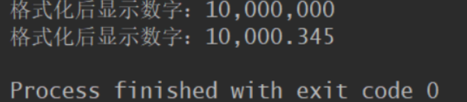
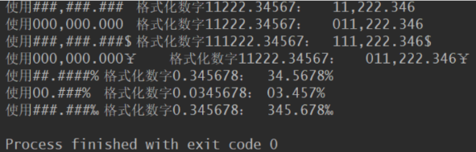
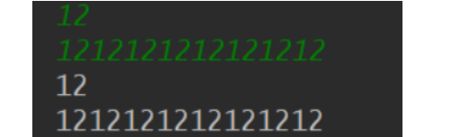
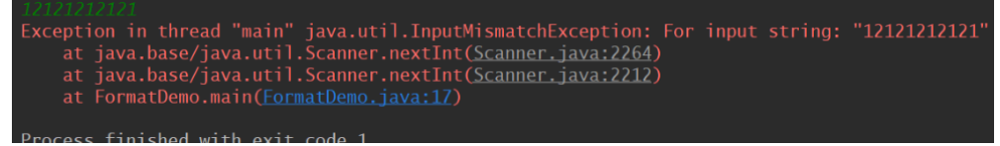
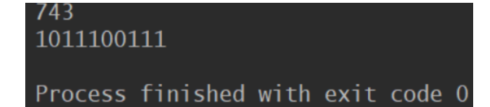
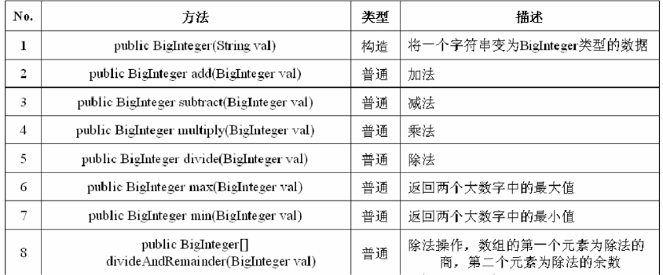
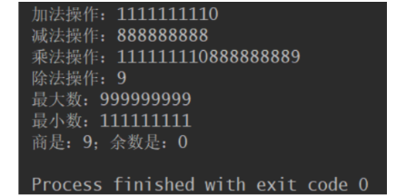
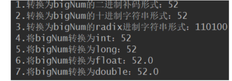
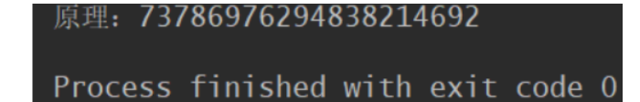
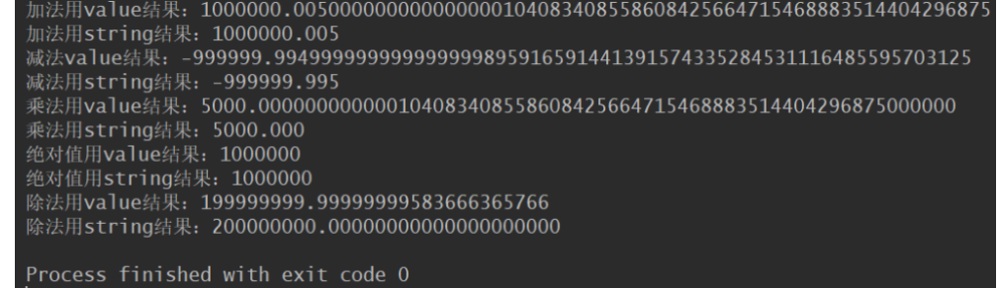

# NumberFormat类

NumberFormat是Format的子类，Format三个子类都是与国际化相关的。在NumberFormat中包含一个子类，

DecimalFormat，通过此类可以完成进一步的数字格式化操作。从国际化的角度来看，不光只有语言需要进行国

际化，对于日期、货币以及数字的显示也同样需要进行格式化的操作。

通过`public final String format(double number)`完成数字的格式化

通过`public static finalNumerFormat getInstance()`取得`NumberFormat`的实例，如下所示：

```java
public static void main(String[] args) {
        NumberFormat nf=NumberFormat.getInstance();
        System.out.println("格式化后显示数字："+nf.format(10000000));
        System.out.println("格式化后显示数字："+nf.format(10000.345));
    }
```



因为系统设置的区域是中国，所以数字之间用“,”分割

# DecimalFormat

DecimalFormat也是Format的一个子类，主要的作用是用来格式化数字使用，当然，在格式化数字的时候要比直接使用NumberFormat更加方便，因为可以直接指定按用户自定义的方式进行格式化操作，与SimpleDateFormat类似，如果要想进行自定义格式化操作，则必须指定格式化操作的模板。

| **No.** | **标记** | **位置**   | **描述**                                                     |
| ------- | -------- | ---------- | ------------------------------------------------------------ |
| 1       | 0        | 数字       | 代表阿拉伯数字，每一个0表示一位阿拉伯数字，如果该位不存在则显示0 |
| 2       | #        | 数字       | 代表阿拉伯数字，每一个#表示一位阿拉伯数字，如果该位不存在则不显示 |
| 3       | .        | 数字       | 小数点分隔符或货币的小数分隔符                               |
| 4       | -        | 数字       | 代表负号                                                     |
| 5       | ,        | 数字       | 分组分隔符                                                   |
| 6       | E        | 数字       | 分隔科学计数法中的尾数和指数                                 |
| 7       | ;        | 子模式边界 | 分隔正数和负数子模式                                         |
| 8       | %        | 前缀或后缀 | 数字乘以100并显示为百分数                                    |
| 9       | \u2030   | 前缀或后缀 | 乘以1000并显示为千分数                                       |
| 10      | ¤\u00A4  | 前缀或后缀 | 货币记号，由货币号替换。如果两个同时出现，则用国际货币符号替换。如果出现在某个模式中，则使用货币小数分隔符，而不使用小数分隔符。 |
| 11      | ,        | 前缀或后缀 | 用于在前缀或或后缀中为特殊字符加引号，例如 "'#'#" 将 123 格式化为 "#123"。要创建单引号本身，请连续使用两个单引号："# o''clock"。 |

```java
public class FormatDemo {
    public void format(String pattern,double value){
        DecimalFormat df=new DecimalFormat(pattern);
        String str=df.format(value);
        System.out.println("使用" + pattern+ "\t格式化数字"+value+"：\t" + str);
    }
    public static void main(String[] args) {
        FormatDemo demo=new FormatDemo();
        demo.format("###,###.###", 11222.34567);
        demo.format("000,000.000", 11222.34567);
        demo.format("###,###.###$", 111222.34567);
        demo.format("000,000.000￥", 11222.34567);
        demo.format("##.####%", 0.345678);        // 使用百分数形式
        demo.format("00.###%", 0.0345678);        // 使用百分数形式
        demo.format("###.###\u2030", 0.345678);    // 使用千分数形式

    }
}

```



# 大数操作

正常情况下一个整数最多只能放在long类型之中，但是如果现在有如下的一个数字：
        1111111111111111111111111111111111111111111111111
根本就是无法保存的，所以为了解决这样的问题，在java中引入了两个大数的操作类：
        操作整型：BigInteger
        操作小数：BigDecimal
当然了，这些大数都会以字符串的形式传入。

## BigInteger类

- 在 Java 中，有许多数字处理的类，比如 Integer类，但是Integer类有一定的局限性。

- 我们都知道 Integer 是 Int 的包装类，int 的最大值为 2^31-1。若希望描述更大的整数数据时，使用Integer 数据

类型就无法实现了，所以Java中提供了BigInteger 类。

- BigInteger类型的数字范围较Integer，Long类型的数字范围要大得多，它支持任意精度的整数，也就是说在

  运算中 BigInteger 类型可以准确地表示任何大小的整数值而不会丢失任何信息。

### 读入方法

nextBigInteger()：控制台读入一个BigInteger型数据，类似于int型的nextInt()；

```java
 public static void main(String[] args) {
        Scanner cin=new Scanner(System.in);// 读入
        while(cin.hasNext())   //等同于!=EOF
        {
            int n;
            BigInteger m;
            n=cin.nextInt(); //读入一个int;
            m=cin.nextBigInteger();//读入一个BigInteger;
            System.out.println(n);
            System.out.print(m.toString());
        }
    }
```



能够读取比`nextInt()`更大的数，如果在读Int时输入太大的数就会报错，而nextBigInteger不会



### 构造方法

```java
  public static void main(String[] args) {
        //在构造将函数时，把radix进制的字符串转化为BigInteger
        String str = "1011100111";
        int radix = 2;
        BigInteger interNum1 = new BigInteger(str,radix);	//743
        System.out.println(interNum1);

        //我们通常不写，则是默认成10进制转换，如下：
        BigInteger interNum2 = new BigInteger(str);			//1011100111
        System.out.println(interNum2);
    }
```



### 基本运算

BigInteger是在java.math包中。

`import java.math.BigInteger;`



```java
 public static void main(String[] args) {
        BigInteger bi1 = new BigInteger("111111111") ;	// 声明BigInteger对象
        BigInteger bi2 = new BigInteger("999999999") ;	// 声明BigInteger对象
        System.out.println("加法操作：" + bi2.add(bi1)) ;	// 加法操作
        System.out.println("减法操作：" + bi2.subtract(bi1)) ;	// 减法操作
        System.out.println("乘法操作：" + bi2.multiply(bi1)) ;	// 乘法操作
        System.out.println("除法操作：" + bi2.divide(bi1)) ;	// 除法操作
        System.out.println("最大数：" + bi2.max(bi1)) ;	 // 求出最大数
        System.out.println("最小数：" + bi2.min(bi1)) ;	 // 求出最小数
        BigInteger result[] = bi2.divideAndRemainder(bi1) ;	// 求出余数的除法操作
        System.out.println("商是：" + result[0] +
                "；余数是：" + result[1]) ;
    }
```



发现divide()方法本身只是把最终的商保存下来了，但是这样的两个数字相除的时候肯定是无法整除，肯定存在余

数，所以我们在上面代码中还用到了`divideAndRemainder()`方法来获得结果和余数。

`divideAndRemainder()`方法会返回一个`BigInteger`类型的数组，数组的第一个数存放商，第二个数存放余数

### 类型转换

```java
 public static void main(String[] args) {
        BigInteger bigNum = new BigInteger("52");
        int radix = 2;


        byte[] num1 = bigNum.toByteArray();
        System.out.print("1.转换为bigNum的二进制补码形式：");
        for (byte aNum1 : num1) {
            System.out.println(aNum1);
        }
        
        String num2 = bigNum.toString();		//52
        System.out.println("2.转换为bigNum的十进制字符串形式："+num2);

        String num3 = bigNum.toString(radix);	//110100
        System.out.println("3.转换为bigNum的radix进制字符串形式："+num3);

        int num4 = bigNum.intValue();
        System.out.println("4.将bigNum转换为int："+num4);

        long num5 = bigNum.longValue();
        System.out.println("5.将bigNum转换为long："+num5);

        float num6 = bigNum.floatValue();
        System.out.println("6.将bigNum转换为float："+num6);

        double num7 = bigNum.doubleValue();
        System.out.println("7.将bigNum转换为double："+num7);
    }
```



### 权限控制

setBit()，testBit()：可用于菜单的权限控制

```java
public static void main(String[] args) {
        //1.封装数据(setBit的值需 >= 0，否则出现异常：ArithmeticException("Negative bit address"))
        BigInteger permission = new BigInteger("0");
        BigInteger numBig = permission.setBit(2);
        numBig = numBig.setBit(5);
        numBig = numBig.setBit(13);
        numBig = numBig.setBit(66);
        System.out.println("原理：" + numBig);
        // 原理：73786976294838214692 = 2^2+2^5+2^13+2^66 次方的和；
        // 看！！即使这么大的数也不会溢出，而int最大值只有2147483647；

        //2.取值验证（返回Boolean型）
        boolean flag1 = numBig.testBit(2);		//true
        boolean flag2 = numBig.testBit(5);		//true
        boolean flag3 = numBig.testBit(13);		//true
        boolean flag4 = numBig.testBit(66);		//true
        boolean flag5 = numBig.testBit(27);		//false
    }
```



## Bigdecimal类

Java中提供了大数字(超过16位有效位)的操作类,即 java.math.BinInteger 类和 java.math.BigDecimal 类,用于高精度计算

**其中 BigInteger 类是针对大整数的处理类,而 BigDecimal 类则是针对大小数的处理类.**

BigDecimal 类的实现用到了 BigInteger类,不同的是 BigDecimal 加入了小数的概念.

float和Double只能用来做科学计算或者是工程计算;在商业计算中,对数字精度要求较高,必须使用 BigInteger 类和 BigDecimal 类,它支持任何精度的定点数,可以用它来精确计算货币值.

**BigDecimal类创建的是对象,不能使用传统的+、-、\*、/等算术运算符直接对其进行数学运算,而必须调用其对应的方法.方法的参数也必须是BigDecimal类型的对象.**


### 构造常用方法

　　**1、方法一**

```java
BigDecimal BigDecimal(double d); //不允许使用
```

　　**2、方法二**

```java
BigDecimal BigDecimal(String s); //常用,推荐使用
```

　　**3、方法三**

```java
static BigDecimal valueOf(double d); //常用,推荐使用
```

```java
 public static void main(String[] args) {
        BigDecimal num1 = new BigDecimal(0.005);
        BigDecimal num2 = new BigDecimal(1000000);
        BigDecimal num3 = new BigDecimal(-1000000);
        //尽量用字符串的形式初始化
        BigDecimal num12 = new BigDecimal("0.005");
        BigDecimal num22 = new BigDecimal("1000000");
        BigDecimal num32 = new BigDecimal("-1000000");

        //加法
        BigDecimal result1 = num1.add(num2);
        BigDecimal result12 = num12.add(num22);
        //减法
        BigDecimal result2 = num1.subtract(num2);
        BigDecimal result22 = num12.subtract(num22);
        //乘法
        BigDecimal result3 = num1.multiply(num2);
        BigDecimal result32 = num12.multiply(num22);
        //绝对值
        BigDecimal result4 = num3.abs();
        BigDecimal result42 = num32.abs();
        //除法
        BigDecimal result5 = num2.divide(num1,20,BigDecimal.ROUND_HALF_UP);
        BigDecimal result52 = num22.divide(num12,20,BigDecimal.ROUND_HALF_UP);

        System.out.println("加法用value结果："+result1);
        System.out.println("加法用string结果："+result12);

        System.out.println("减法value结果："+result2);
        System.out.println("减法用string结果："+result22);

        System.out.println("乘法用value结果："+result3);
        System.out.println("乘法用string结果："+result32);

        System.out.println("绝对值用value结果："+result4);
        System.out.println("绝对值用string结果："+result42);

        System.out.println("除法用value结果："+result5);
        System.out.println("除法用string结果："+result52);
        
    }
```



**※ 注意：**

1. System.out.println()中的数字默认是double类型的，double类型小数计算不精准。

2. 使用BigDecimal类构造方法传入double类型时，计算的结果也是不精确的！

- 因为不是所有的浮点数都能够被精确的表示成一个double 类型值，有些浮点数值不能够被精确的表示成 double 类型值，因此它会被表示成与它最接近的 double 类型的值。必须改用传入String的构造方法。这一点在BigDecimal类的构造方法注释中有说明。

