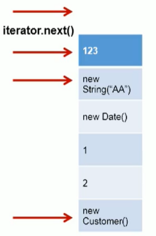
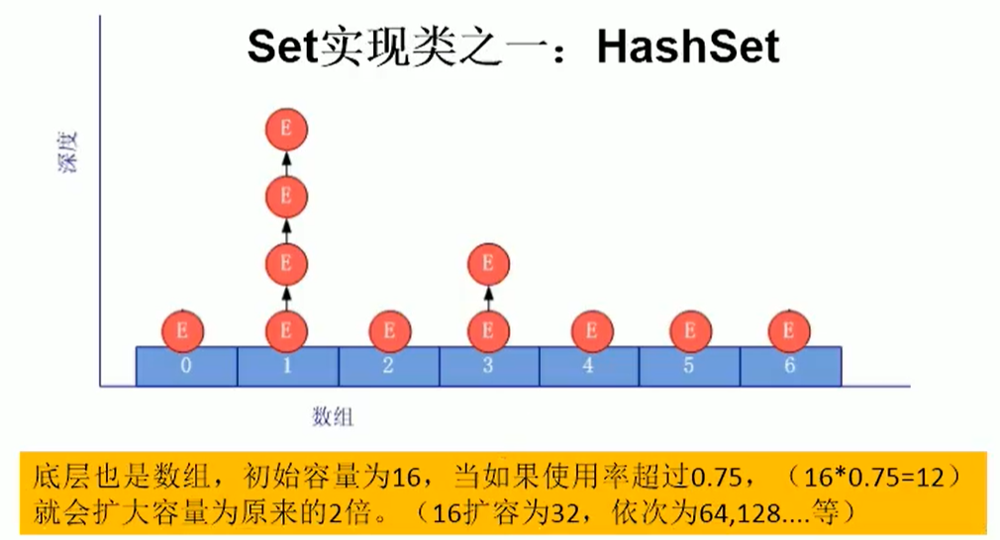
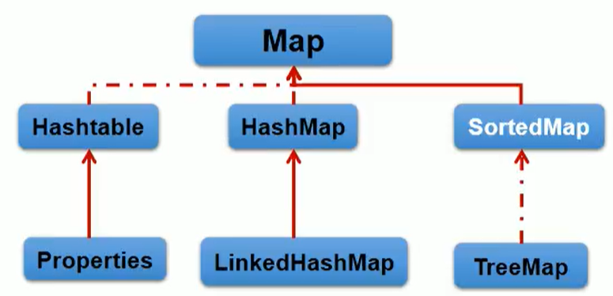
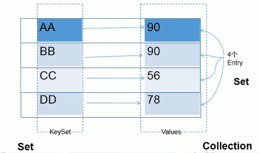
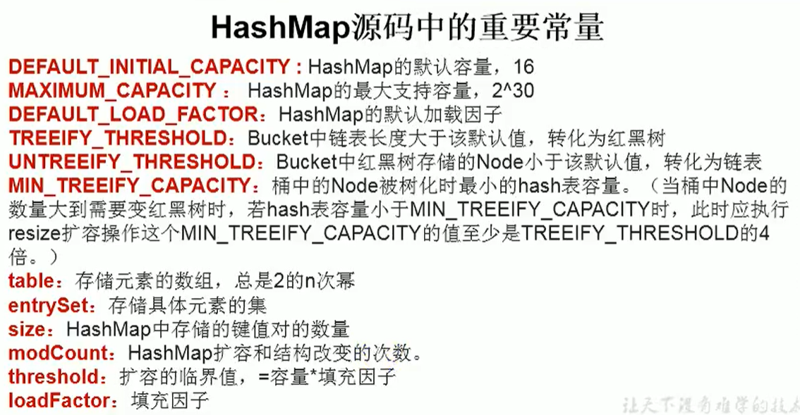

# 第1节 概述

- 一方面，面向对象语言对事物的体现都是以对象的形式，为了方便对多个对象的操作，就要对对象进行存储。另一方面，使用Array存储对象方面具有一些弊端，而Java集合就像一种容器，可以动态地把多个对象的引用放入容器中。
- 此时的存储，主要指的是内存层面的存储，不涉及到持久化的存储。
- 数组在内存存储方面的特点：

>- 数组初始化以后，长度就确定了。
>- 数组声明的类型，就决定了进行元素初始化时的类型

- 数组在存储数据方面的弊端：

>- 数组初始化以后，长度就不可变了，不便于扩展
>- 数组中提供的属性和方法少，不便于进行添加、删除、插入等操作，且效率不高。同时无法直接获取存储元素的个数
>- 获取数组中实际元素的个数的需求，数组没有现成的属性或方法可用
>- 数组存储教据的特点：有序、可重复。对于无序、不可重复的需求，不能满足。

- Java集合类可以用于存储数量不等的多个对象，还可用于保存具有映射关系的关联数组。

# 第2节 Collection集合

- Java集合可分为Collection和Map两种体系：

>- Collection接口：单列数据，定义了存取一组对象的方法的集合
>  - List：元素有序、可重复的集合---------------“动态”数组
>  - Set：元素无序、不可重复的集合----------------和高中"集合"一样的概念
>- Map接口：双列数据
>  - 保存具有映射关系“key-value对”的集合----------------高中函数：y=f(x) x可以多对一，不能一对多 

## 2.1 Collection

- Collection接口中声明的方法的测试
- 向Collection接口的实现类的对象中添加数据obj时，要求obj所在类要重写equals().

```java
@Test
public void test1(){
    //Collection是作为一个接口,具体由其子类来实现
    Collection<Object> collection = new Collection<Object>() {
        @Override
        public int size() {
            return 0;
        }

        @Override
        public boolean isEmpty() {
            return false;
        }

        @Override
        public boolean contains(Object o) {//判断对象o是否存在集合中
            return false;
        }

        @Override
        public Iterator<Object> iterator() {//返回此集合中的元素的迭代器。 
            return null;
        }

        @Override
        public Object[] toArray() {//返回一个包含此集合中所有元素的数组。
            return new Object[0];
        }

        @Override
        public <T> T[] toArray(T[] ts) {//返回包含此集合中所有元素的数组; 返回的数组的运行时类型是指定数组的运行时类型。 
            return null;
        }

        @Override
        public boolean add(Object o) {
            return false;
        }

        @Override
        public boolean remove(Object o) {
            return false;
        }

        @Override
        public boolean containsAll(Collection<?> collection) {//如果此集合包含指定 集合中的所有元素，则返回true。
            return false;
        }

        @Override
        public boolean addAll(Collection<?> collection) {//将指定集合中的所有元素添加到此集合（可选操作）。 
            return false;
        }

        @Override
        public boolean removeAll(Collection<?> collection) {//删除指定集合中包含的所有此集合的元素（可选操作）。 
            return false;
        }

        @Override
        public boolean retainAll(Collection<?> collection) {//仅保留此集合中包含在指定集合中的元素（可选操作）。 
            return false;
        }

        @Override
        public void clear() {
        }
    };
}
```

## 2.2 迭代器

- Iterator对象称为迭代器（设计模式的一种），主要用于遍历Collection集合中的元素。
- GOF给迭代器模式的定义为：提供一种方法访问一个容器（container）对象中各个元素，而又不需暴露该对象的内部细节。迭代器模式，就是为容器而生。类似于“公交车上的售票员”、“火车上的乘务员”、“空姐”。
-  Collection接口继承了java.lang.lterable接口，该接口有一个iterator（）方法，那么所有实现了Collection接口的集合类都有一个iterator() 方法，用以返回一个实现了lterator接口的对象。
- Iterator仅用于遍历集合，lterator本身并不提供承装对象的能力。如果需要创建lterator对象，则必须有一个被迭代的集合。
- 集合对象每次调用iterator() 方法都得到一个全新的迭代器对象，默认游标都在集合的第一个元素之前。
- 内部定义了remove()，可以在德历的时候，删除集合中的元素。此方法不同于集合直接调用remove()


- **遍历集合示例**

```java
@Test
public void test2(){
    Collection<Object> collection = new ArrayList<>();
    collection.add(123);
    collection.add("Jack");
    collection.add(new Person("Tom"));
    collection.add(true);
    Iterator<Object> iterator = collection.iterator();

    //遍历集合方式一:不推荐
    for (int i = 0; i < collection.size(); i++) {
        System.out.println(iterator.next());
    }

    //方式二：使用迭代器
    //hasNext判断是否还有下一个元素
    while (iterator.hasNext()){
        //next:①指针下移 ②将下移后以后集合位置上的元素返回
        System.out.println(iterator.next());
    }
}
```

- 迭代器执行原理：



- **测试迭代器中的remove()方法**

>- Iterator可以删除集合的元素，但是是遍历过程中通过迭代器对象的remove方法，不是集合对象的remove方法。
>- 如果还未调用next() 或在上一次调用next 方法之后已经调用了remove 方法，再调用remove都会报llegalStateException

```java
@Test
public void test2() {
    Collection<Object> collection = new ArrayList<>();
    collection.add(123);
    collection.add("Jack");
    collection.add(new Person("Tom"));
    collection.add(true);
    //获取集合的迭代器实例
    Iterator<Object> iterator = collection.iterator();
    while (iterator.hasNext()) {
        Object next = iterator.next();
        if ("Jack".equals(next)) {
            //next指针下移后才调用删除方法
            iterator.remove();
        }
    }
    //得到一个全新的迭代器对象
    iterator = collection.iterator();
    while (iterator.hasNext()) {
        System.out.println(iterator.next());
    }
}
```

## 2.3  foreach

* Java5.0提供了foreach 循环迭代访问Collection和数组。
* 遍历操作不需获取Collection或数组的长度，无需使用索引访问元素。
* 遍历集合的底层调用lterator完成操作。
* foreach还可以用来遍历数组。

```java
@Test
public void test1() {
    Collection<Object> collection = new ArrayList<>();
    collection.add(123);
    collection.add("Jack");
    collection.add(new Person("Tom"));
    collection.add(true);
    //for(集合元素的类型 局部变量 : 集合对象)
    //内部仍然调用了迭代器
    for (Object o : collection) {
        System.out.println(o);
    }
}
```

- 测试

```java
@Test
public void test3() {
    String[] arr = {"MM", "MM", "MM"};
    for (int i = 0; i < arr.length; i++) {
        arr[i] = "GG"; //修改成功
    }
    for (String value : arr) {
        System.out.println(value);
    }

    for (String s : arr) {
        s = "MM"; //修改失败,s是局部变量
    }
    for (String s : arr) {
        System.out.println(s);
    }
}
```

## 2.4  List

- 鉴于Java中数组用来存储数据的局限性，我们通常使用List替代数组
-  List集合类中元素有序、且可重复，集合中的每个元素都有其对应的顺序索引。
- List容器中的元素都对应一个整数型的序号记载其在容器中的位置，可以根据序号存取容器中的元素。
- JDKAPI中List接口的实现类常用的有：ArrayList、LinkedList和Vector。

---

- collection接口：单列集合，用来存储一个一个的对象
  - List接口：存储有序的、可重复的数据。被称为“动态”数组，替换原有的数组
    - Arraylist：作为List接口的主要实现类；线程不安全的，效率高；底层使用0bject[ ] elementData存储
    - Linkedlist：对于频繁的插入、删除操作，使用此类效率比ArrayList高；底层使用双向链表存储
    - Vector：作为ist接口的古老实现类；我程安全的，效率低；底层使用0bject[ ] elementData存储

- Arraylist、Linkedlist、Vector三者的异同？
  - 三个类都是实现了List接口，存储数据的特点相同：存储有序的、可重复的数据

## 2.4.1 ArrayList

- ArrayList的源码分析：jdk7情况下
  - ArrayList list=new ArrayList（）；//底层创建了长度是10的0bject[ ]数组elementData 
  - 如果此次的添加号致底层elementData数组容量不够，则扩容。
  - 默认情况下，扩容为原来的容量的1.5倍，同时需要将原有数组中的数据复制到新的数组中。
- 结论：建议开发中使用带参的构造器：Arraylist list=new Arraylist（int capacity)

---

- jdk8中Arraylist的变化：
  - 底层0bject[ ]elementData初始化为{ }，并没有创建长度
  - 第一次调用add() 时，底层才创建了长度10的数组，并将数据添加到elementData
- 小结：jdk7 中的ArrayList的对象的创建类似于单例的饿汉式，而jdk8中的Arraylist的对象的创建类似于单例的懒汉式，延迟了数组的创建，节省内存。

- 示例：区分List 中remove(int index) 和 remove(Object obj)

```java
@Test
public void test3() {
    ArrayList<Integer> list = new ArrayList<>();
    list.add(1);
    list.add(2);
    list.add(3);
    list.remove(2); //删除数组下标为2的元素
    list.remove(Integer.valueOf(2)); //删除等于2的元素
}
```

## 2.5 Set

- Set接口的框架：
  - ColLection接口：单列集合，用来存储一个一个的对象
  - Set接口中没有额外定义新的方法，使用的都是Collection中声明过的方法。
- Set接口：存储无序的、不可重复的数据）高中讲的“集合”
  - HashSet：作为set接口的主要实现类；线程不安全的；可以存储null值
  - LinkedHashSet：作为HashSet的子类；遍历其内部数据时，可以按用添加
  - TreeSet：可以按照添加对象的指定属性，进行排序

---

- Set：存储无序的、不可重复的数据
- 以HashSet为例说明：
  1. 无序性：不等于随机性。存储的数据在底层数组中并非按照数组索引的顺字添加，而是根据数据的哈希值进行添加的
  2. 不可重复性：保证添加的元素按equals() 判断时，不能返回true。即：相同的元素只能添加一个

```java
@Test
public void test3() {
    Set<Object> set = new HashSet<>();
    set.add(123);
    set.add(123);
    set.add("Tom");
    set.add("Tom");
    for (Object o : set) {
        System.out.println(o); //只输出一个123和Tom
    }
}
```

- **添加元素的过程：以hashSet为例：**

1. 我们向HashSet中添加元素a，首先调用元素a所在类的hashCode() 方法，计算元素a的哈希值，此哈希值接着通过某种算法计算出在HashSet底层数组中的存放位置（即为：索引位置）
2. 判断数组此位置上是否已经有元素：
   3. 如果此位置上没有其他元素，则元素a添加成功。
   4. 如果此位置上有其他元素b（或以链表形式存在的多个元素），则比较元素a与元素b的hash值：
      5. 如果hash值不相同，则元素a添加成功。
      6. 如果hash值相同，进而需要调用元素a所在类的equlas() 方法：
         7. equals() 返回true，元素a添加失败
         8. equals() 返回false，则元素a添加成功。

>- 对于添加成功的情况3,5,8而言：元素a与已经存在指定索引位置上数据以链表的方式存储。
>  - jdk7：元素a放到数组中，指向原来的元素。
>  - jdk8：原来的元素在数组中，指向元素a
>  - 总结：七上八下



- HashSet底层：数组+链表+红黑树的结构

## 2.5.1 HashSet

- HashSet是Set接口的典型实现，大多数时候使用Set集合时都使用这个实现类。
- HashSet按Hash算法来存储集合中的元素，因此具有很好的存取、查找、删除性能。
- HashSet具有以下特点：

>- 不能保证元素的排列顺序
>- HashSet不是线程安全的
>- 集合元素可以是null 

- HashSet 集合判断两个元素相等的标准：两个对象通过hashCode() 方法比较相等，并且两个对象的equals() 方法返回值也相等。
- **对于存放在Set容器中的对象，对应的类一定要重写equals() 和hashCode(Object obj) 方法，以实现对象相等规则。即：“相等的对象必须具有相等的散列码”。**

- 小技巧：重写两个方法的小技巧：对象中用作 equals() 方法比较的Field，都该用来计算 hashCode()

- 示例

```java
@Test
public void test3() {
    Set<Object> set = new HashSet<>();
    set.add(123);
    set.add("Tom");
    set.add(new Person("Jack"));
    set.add(456);
    for (Object o : set) {
        System.out.println(o);
    }
}
/*
Person{name='Jack'}
Tom
456
123
*/
```

>- 添加是无序的，并且输出的数据也是"无序的"，没有按照添加顺序进行输出

## 2.5.2 LinkedHashSet

```java
@Test
public void test3() {
    Set<Object> set = new LinkedHashSet<>();
    set.add(123);
    set.add("Tom");
    set.add(new Person("Jack"));
    set.add(456);
    for (Object o : set) {
        System.out.println(o);
    }
}
/*
123
Tom
Person{name='Jack'}
456
*/
```

>- 输出的顺序和添加的顺序保存一致，在添加数据时还增加了前后数据指针
>- 对于频繁的遍历操作，LinkedHashSet效率高于HashSet

## 2.5.3 TreeSet

1. 向TreeSet中添加的数据，要求是相同类的对象。
2. 两种排序方式：自然排序和定制排序
3. 自然排序中，比较两个对象是否相同的标准为：compare To（）返回e.不再是equals（）.

- 自然排序示例

```java
@Test
public void test1() {
    Set<Object> set = new TreeSet<>();
    set.add(56);
    set.add(45);
    set.add(66);
    for (Object o : set) {
        System.out.println(o);
    }
}
//输出:45 56 66 默认为从小到大进行排序
```

- 定制排序

```java
@Test
public void test3() {
    Set<Integer> set = new TreeSet<>(new Comparator<Integer>() {
        @Override
        public int compare(Integer t1, Integer t2) {
            return t2 - t1;
        }
    });
    // Set<Integer> set = new TreeSet<>((t1,t2) -> t2 -t1);
    set.add(56);
    set.add(45);
    set.add(66);
    for (Object o : set) {
        System.out.println(o);
    }
}
//输出:66 56 44 设置为从大到小进行排序
```

# 第3节 Map集合

- Map继承树



- **一、Map实现类的结构情况：**
- Map：双列数据，存储key-value对的数据—-类似于高中的函数：y = f(x)
  - HashMap：作为Map的主要实现类；线程不安全，效率高。存储null的key-value
    - LinkedHashMap：HashMap的子类，保证在遍历map元素时，可以按照添加的顺序实现遍历。
      - 原因：在原有的HashMap底层结构基础上，添加了一对指针，指向前一个和后一个元素。
      - 对于频繁的遍历操作，此类执行效率高HashMap。
  - TreeMap：保证按照添加的key-value对进行排序，若实现排序遍历。此时考虑key的自然排序或定制排序
    - 底层使用红黑树
  - Hashtable：作为古老的实现类；线程安全，效率低。不能存储null的key-value
    - Properties：常用来处理配置文件。key 和 value都是string类型

- HashMap的底层：
  - 数组+链表（jdk7及之前）
  - 数组+链表+红黑树（jdk 8)



- **二、Map结构的理解：**
- Map 中的key：无序的、不可重复的，使用Set存储所有的key 
  - 以HashMap为例：key所在的类要重写equals()和hashcode()
  - value所在的类要重写equals()
- Map 中的value：无序的、可重复的，使用collection存储所有的value
- 一个键值对：添加时把 key-value 封装成一个Entry对象。
- Map 中的entry：无序的、不可重复的，使用Set 存储所有的entry

---

- **三、Map中的常用方法：**
- 添加、删除、修改操作：

```java
Object put(Object key，Object value)：//将指定key-value添加到（或修改）当前map对象中
void putAll(Map m)：//将m中的所有key-value对存放到当前map中
Object remove(Object key)：//移除指定key的key-value对，并返回value 
void clear()：//清空当前map中的所有数据
```

- 元素查询的操作：

```java
Object get(Object key)：//获取指定key对应的value 
boolean containsKey(Object key)：是否包含指定的key 
boolean containsValue(Object value)：//是否包含指定的value 
int size()：返回map中key-value对的个数
boolean isEmpty()：//判断当前map是否为空
boolean equals(Object obj)：//判断当前map和参数对象obj是否相等
```

- 元视图操作的方法：

```java
Set keySet()：//返回所有key构成的Set集合
Collection values()：//返回所有value构成的Collection集合
Set entrySet()：//返回所有key-value对构成的Set集合
```

## 2.6 HashMap

- **HashMap的底层实现原理？以idk7为例说明：**
- HashMap map=new HashMap()：在实例化以后，底层创建了长度是16的一维数组Entry[ ] table。
- 在执行添加操作 map.put(key1,value1) 时，首先，调用key1所在类i的hashcode() 计算 key1 哈希值，此哈希值经过某种算法计算以后，得到在Entry数组中的存放位置。
  - 如果此位置上的数据为空，此时的key1-value1添加成功。**------情况1**
  - 如果此位置上的数据不为空，(意味着此位置上存在一个或多个数据（以链表形式存在))，比较key1和已经存在的一个或多个数据的哈希值：
    - 如果key1的哈希值与已经存在的数据的哈希值都不相同，此时key1-value1添加成功。**------情况二**
    - 如果key1的哈希值和已经存在的某一个数据（key2-value2）的哈希值相同，继续比较：调用key1所在类的equals(key2)方法
      - 如果equals() 返回false：此时key1-value1添加成功。**------情况三**
      - 如果equals() 返回true：使用value1替换value2。

- 补充：关于情况2和情况3：此时key1-value1和原来的数据以链表的方式存储。
- 在不断的添加过程中，会涉及到扩容问题，默认的扩容方式：扩容为原来容量的2倍，并将原有的数据复制过来。

---

- **jdk8 相较于jdk7在底层实现方面的不同：**
  1. new HashMap()：底层没有创建一个长度为16的数组
  2. jdk 8底层的数组是：Node[ ]，而非Entry[ ]
  3. 首次调用put() 方法时，底层创建长度为16的数组
  4. jdk7底层结构只有：数组+链表。jdk8中底层结构：数组+链表+红黑树。
  5. 当数组的某一个索引位置上的元素以链表形式存在的数据个数 > 8且当前数组的长度 < 64时，此时此索引位置上的所有数据改为使用红黑树存储



- 示例

```java
@Test
public void test1() {
    Map<Object,Object> map = new HashMap<>();
    map.put(null,null); //可以添加null值
    map.put("Tom",20);
    map.put("boy",new Person("Tom"));
    map.put("hobby","basketball");

    //返回所有key构成的Set集合
    Set<Object> set = map.keySet();
    for (Object o : set) {
        System.out.println(o); 
    }

    //返回所有value构成的Collection集合
    Collection<Object> values = map.values();
    for (Object value : values) {
        System.out.println(value);
    }

    //返回所有key-value对构成的Set集合
    Set<Map.Entry<Object, Object>> entries = map.entrySet();
    //得到key-value的遍历方式一：foreach
    for (Map.Entry<Object, Object> entry : entries) {
        System.out.print(entry.getKey()+" ");
        System.out.print(entry.getValue());
        System.out.println();
    }
    
    //得到key-value的遍历方式二：迭代器
    Iterator<Map.Entry<Object, Object>> iterator = entries.iterator();
    while (iterator.hasNext()){
        Map.Entry<Object, Object> next = iterator.next();
        Object key = next.getKey();
        Object value = next.getValue();
    }

    //得到key-value的遍历方式三：用key得到value
    Set<Object> set2 = map.keySet();
    for (Object o : set2) {
        Object value = map.get(o); //根据key值取出对应value的值
        System.out.println("key="+o+",value="+value);
    }
}
```

## 2.7 TreeMap

- 自然排序

```java
@Test
public void test1() {
    Map<Integer, String> map = new TreeMap<>();
    map.put(20, "Tom");
    map.put(12, "Jack");
    map.put(21, "Marry");
    Set<Integer> set = map.keySet();
    for (Integer integer : set) {
        System.out.println("key=" + integer + " ,value=" + map.get(integer));
    }
}
/*
key=12 ,value=Jack
key=20 ,value=Tom
key=21 ,value=Marry
*/
```

- 定制排序

```java
@Test
public void test3() {
    //从大到小进行排序
    Map<Integer, String> map = new TreeMap<>((t1,t2) -> t2 - t1); //传入一个比较器并实现比较方法
    map.put(20, "Tom");
    map.put(12, "Jack");
    map.put(21, "Marry");
    Set<Integer> set = map.keySet();
    for (Integer integer : set) {
        System.out.println("key=" + integer + " ,value=" + map.get(integer));
    }
}
/*
key=21 ,value=Marry
key=20 ,value=Tom
key=12 ,value=Jack
*/
```

## 2.8 Properties 

- Properties Properties类是Hashtable的子类，该对象用于处理属性文件
- 由于属性文件里的key、value都是字符串类型，所以Properties里的key和value都是字符串类型
- 存取数据时，建议使用setProperty（String key，String value）方法和getProperty（String key）方法

```java
Properties pros=new Properties(); 
pros.load(new FileInputstream("jdbc.properties"));
string user=pros.getProperty("user");
System.out.println(user);
```

# 第4节 collections工具类

- 操作数组的工具类：Arrays
- Collections是一个操作Set、List和Map等集合的工具类
- Collections中提供了一系列静态的方法对集合元素进行排序、查询和修改等操作，还提供了对集合对象设置不可变、对集合对象实现同步控制等方法
- 排序操作：（均为static方法）

>- reverse（List）：反转List中元素的顺序
>- shuffle（List）：对List集合元素进行随机排序
>- sort（List）：根据元素的自然顺序对指定List集合元素按升序排序
>- sort（List，Comparator）：根据指定的Comparator产生的顺序对List集合元素进行排序
>- swap（List，int，int）：将指定list集合中的 i 处元素和 j 处元素进行交换
>- Object max（Collection）：根据元素的自然顺序，返回给定集合中的最大元素
>- Object max（Collection，Comparator）：根据 Comparator指定的顺序，返回给定集合中的最大元素
>- Object min（Collection）
>- Object min（Collection，Comparator）
>- int frequency（Collection，Object）：返回指定集合中指定元素的出现次数
>- void copy（List dest，List src）：将src中的内容复制到dest中
>- boolean replaceAll（List list，Object oldVal，Object newVal）：使用新值替换List对象的所有旧值

- 示例1

```java
@Test
public void test1() {
    List<Integer> list = new ArrayList<>();
    list.add(12);
    list.add(33);
    list.add(5);
    list.add(8);
    System.out.println(list); // [12, 33, 5, 8]

    Collections.reverse(list);
    System.out.println(list); // [8, 5, 33, 12]

    Collections.sort(list);
    System.out.println(list); // [5, 8, 12, 33]

    Collections.sort(list, (integer, t1) -> t1 - integer);
    System.out.println(list); // [33, 12, 8, 5]

    Collections.swap(list,0,3);
    System.out.println(list); // [5, 12, 8, 33]

    Integer max = Collections.max(list);
    System.out.println(max); // 33
}
```

- 示例2

```java
@Test
public void test2() {
    List<Integer> list = new ArrayList<>();
    list.add(12);
    list.add(33);
    list.add(5);
    list.add(8);
    list.add(8);
    list.add(8);
    int frequency = Collections.frequency(list,8);
    System.out.println(frequency); // 3

    //注意，需要list1的大小和list数组的大小相同才能复制
    List<Object> list1 = Arrays.asList(new Object[list.size()]);
    Collections.copy(list1,list);
    System.out.println(list1); // [12, 33, 5, 8, 8, 8]
}
```

