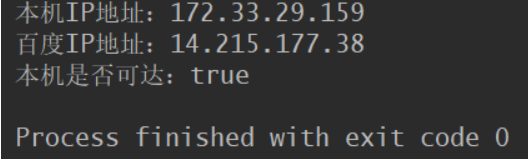
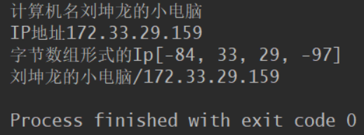
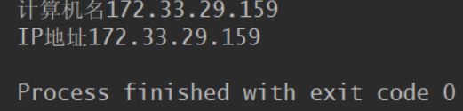
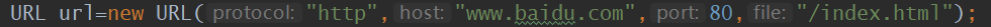
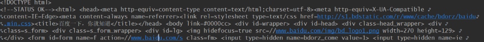
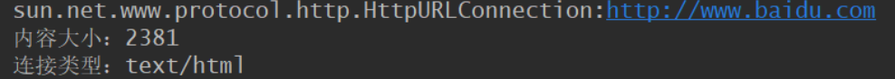
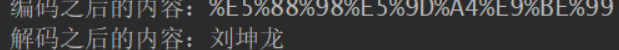

最最重要的概念：

网络编程分为服务端和客户端。服务端就相当于我们平时说的服务器，有固定的IP地址，随时等待服务器连接并出响应；而客户端相当于各种端系统，找到服务端进行连接获取服务（我们下面的程序也是这样，首先启动服务端等待连接，然后启动客户端连接服务端。如果先启动客户端再启动服务端则会报错）。       

说到java的网络编程倒不如说是Java的I/O编程，因为整个过程中关于服务端和客户端的socket创建也就那么两三行代码，其余的都是操作字节流，字符流等。


# InetAddress类

测试

```java
 public static void main(String[] args) throws Exception{
        //声明InetAddress对象
        InetAddress locAdd=null;
        InetAddress remAdd=null;
        //得到本机InetAddress对象
        locAdd=InetAddress.getLocalHost();
        //得到百度InetAddress对象
        remAdd=InetAddress.getByName("www.baidu.com");
        System.out.println("本机IP地址："+locAdd.getHostAddress());
        System.out.println("百度IP地址："+remAdd.getHostAddress());
        //判断地址是否可达，同时指定超时时间
        System.out.println("本机是否可达："+locAdd.isReachable(5000));
    }
```



# InetAddress类的总结

1. `InetAddress`类没有构造方法，所以不能直接new出一个对象

   可以通过`InetAddress`类的静态方法获得`InetAddress`的对象；

   -  `InetAddress.getLocalHost()`;

   -  `InetAddress.getByName("")`;

2. 获取本机的`InetAddress`实例 

```java
  public static void main(String[] args) throws Exception{
        InetAddress address = InetAddress.getLocalHost();

        System.out.println("计算机名" + address.getHostName());

        System.out.println("IP地址" + address.getHostAddress());
        byte[] bytes = address.getAddress();//获取字节数组形式的IP地址  

        System.out.println("字节数组形式的Ip" + Arrays.toString(bytes));

        System.out.println(address);//直接输出InetAddress对象  
    }
```



3. 根据机器名获取`InetAddress`实例  

```java
 public static void main(String[] args) throws Exception{
     //通过主机名称得到InetAddress对象
        InetAddress address = InetAddress.getByName("172.33.29.159");
     //得到IP地址
        System.out.println("计算机名" + address.getHostName());
      //得到IP地址
        System.out.println("IP地址" + address.getHostAddress());
    }
```



为什么`address.getHostName()`输出的是`IP`地址，而没有输出电脑的名字？

**因为网络通信过程中客户端的主机名是不会带到服务器端的**


# URL

```java
  public static void main(String[] args) throws Exception{
        URL url=new URL("http","www.baidu.com",80,"/index.html");
        InputStream input=url.openStream();
        Scanner scanner=new Scanner(input);
        scanner.useDelimiter("\n");
        while (scanner.hasNext()){
            System.out.println(scanner.next());
        }
    }
```



输出：



# URLConnection类

`URLConnection`是封装访问远程网络资源的一般方法的类，通过他可以建立与远程服务器的连接，检查远程资源的一些属性

URLConnection是一个抽象类，表示指向URL指定资源的活动连接。

URLConnection类本身依赖于Socket类实现网络连接。一般认为，URLConnection类提供了比Socket类更易于使用、更高级的网络连接抽象。但实际上，大多数程序员都会忽略它。因为URLConnection太贴近HTTP协议。它假定传输的内容前面都有MIME首部或类似的东西。但大多数协议（如FTP和SMTP）并不使用MIME首部。

URLConnection类声明为抽象类，除了connect()方法，其他方法都已经实现。URLConnection的三个实现子类都位于sun.net.www包下。

URLConnection类的保护类型的构造方法：

```java
protected URLConnection(URL url)
```

构造一个到指定 URL 的 URL 连接。


connect()方法由子类实现本地与服务器的连接方式。一般使用TCP socket，但也可以使用其他其他机制来建立。

```java
abstract void connect()
```

打开到此 URL 引用的资源的通信链接（如果尚未建立这样的连接）。

 当派生URLConnection子类时，通常会覆盖URLConnection的其他方法，使其返回有意义的值。

**例：获URLConnection实例对象。**

```java
public class Test {
    public static void main(String[] args) throws Exception{
            URL url = new URL("http://www.baidu.com");
            URLConnection uc = url.openConnection();
            System.out.println(uc);
        System.out.println("内容大小："+uc.getContentLength());
        System.out.println("连接类型："+uc.getContentType());
    }
}
```



# URLEncoder类和URLDecoder类

在使用URL访问的时候经常会看见地址后面有很多其他的附带信息，例如在我的github里我找我的总结博客

```java
https://github.com/superlkl/MyNotes/blob/master/Reading-Note/%E6%80%BB%E7%BB%93.md
```

总结两个字没有显示出来，而是转换成了`%E6%80%BB%E7%BB%93`这堆字符

对于英文单词可以正常显示，但是对于其中的中文的话，则会进行一系列的编码操作，在Java中如果想要完成这样的编码和解码操作就必须使用这个两个类，`URLEncoder`可以为传递的内容进行编码，而`URLDecoder`则对应着为传递的内容解码

测试

```java
 public static void main(String[] args) {
        String str="刘坤龙";
        //进行编码
        String encode= URLEncoder.encode(str, StandardCharsets.UTF_8);
        System.out.println("编码之后的内容："+encode);
        //进行解码
        String decode=URLDecoder.decode(encode, StandardCharsets.UTF_8);
        System.out.println("解码之后的内容："+decode);
    }
```



上面程序将内容通过URLEncoder编码成UTF-8的形式，然后再通过URLDecoder按照UTF-8进行解码