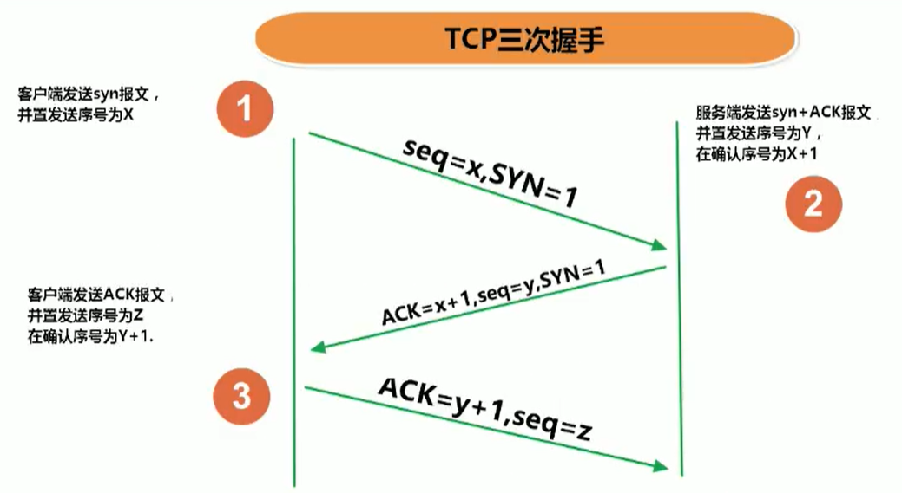
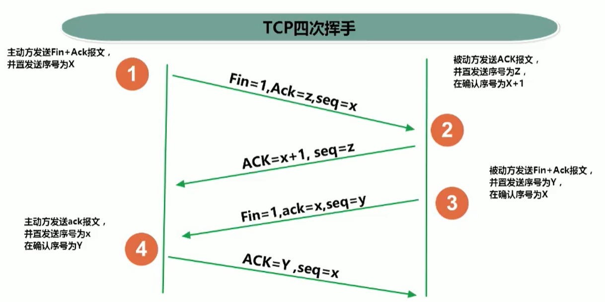
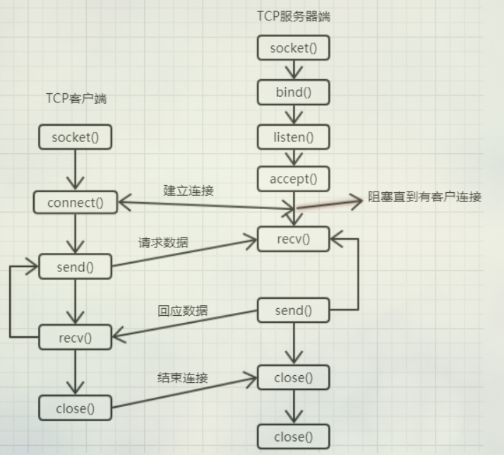
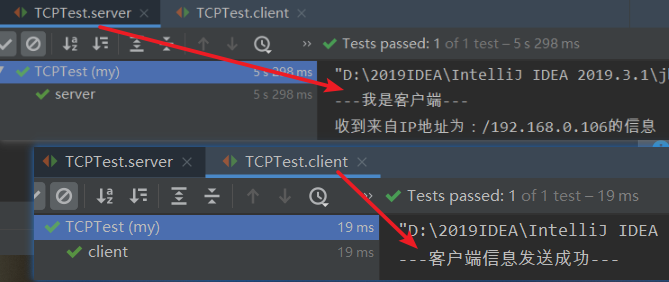

# 网络基础

>- 计算机网络：
>  - 把分布在不同地理区域的计算机与专门的外部设备用通信线路互连成一个规模大、功能强的网络系统，从而使众多的计算机可以方便地互相传递信息、共享硬件、软件、数据信息等资源。
>- 网络编程的目的：
>  - 直接或间接地通过网络协议与其它计算机实现数据交换，进行通讯。
>- 网络编程中有两个主要的问题：
>  1. 如何准确地定位网络上一台或多台主机；定位主机上的特定的应用
>  2. 找到主机后如何可靠高效地进行数据传输

# 通信要素

- 通信双方地址

>- IP
>- 端口号
>- 域名：www.baidu.com 、www.bilibili.com......

- 一定的规则（即：网络通信协议。有两套参考模型）

>- OSI参考模型：模型过于理想化，未能在因特网上进行广泛推广
>- TCP/IP参考模型（或TCP/IP协议）：事实上的国际标准

- TCP/IP参考模型

>- 应用层
>  - HTTP、FTP、Telnet......
>- 传输层
>  - TCP、UDP......
>- 网络层
>  - IP、ICMP、ARP......
>- 物理+数据链路层
>  - Link

## IP地址

- IP地址：InetAddress

>- 唯一的标识Internet上的计算机（通信实体)
>- 本地回环地址（hostAddress）：127.0.0.1
>  - 对应主机名（hostName）：localhost

- IP地址分类方式1：IPV4和IPV6

>- IPV4：4个字节组成，4个0—255，大约42亿,30亿都在北美，亚洲4亿。2011年初已经用尽。以点分十进制表示，如192.168.0.1
>- IPV6：128位（16个字节），写成8个无符号整数，每个整数用四个十六进制位表示，数之间用冒号（：）分开，
>  - 如：3ffe：3201：1401：1280：c8ff:fe4d:db39：1984

- IP地址分类方式2：公网地址（万维网使用）和私有地址（局域网使用）。

>- 192.168.开头的就是私有址址，范围即为192.168.0.0—192.168.255.255，专门为组织机构内部使用

- 特点：不易记忆

## 测试InetAddress

- 实例化InetAddress对象的两个方法：InetAddress类没有构造方法，所以不能直接new出一个对象
- 可以通过InetAddres类的静态方法获得InetAddress的对象；


>1. getByName(String str)
>2. getLocalHost()

- 常用方法

>- getHostAddress()：获取IP地址
>- getHostName()：获取域名

```java
public class Main {
    public static void main(String[] args) throws UnknownHostException {
        //一个IP地址或者一个域名对应一个InetAddress对象:包含域名和IP地址
        //就像File file = new File("d:text.txt"),一个文件路径对应一个真实的file文件
        InetAddress address = InetAddress.getByName("www.baidu.com");
        
        //获取IP地址
        String hostAddress = address.getHostAddress();
        //获取域名
        String hostName = address.getHostName();
        System.out.println(hostAddress); //183.232.231.172
        System.out.println(hostName); //www.baidu.com

        InetAddress localHost = InetAddress.getLocalHost();
        System.out.println(localHost); //  刘坤龙的小电脑/192.168.0.106

        InetAddress byName = InetAddress.getByName("172.0.0.1");
        System.out.println(byName); //  /172.0.0.1
    }
}
```

## 端口号

- 端口号标识正在计算机上运行的进程（程序）

>- 不同的进程有不同的端口号
>
>- 被规定为一个16位的整数0—65535

- 端口分类：

>- 公认端口：0~1023。被预先定义的服务通信占用（如：HTTP占用端口80，FTP占用端口21，Telnet占用端口23）
>- 注册端口：1024~49151。分配给用户进程或应用程序。
>  - 如：Tomcat占用端口8080，MySQL占用端口3306，Oracle占用端口1521等
>- 动态/私有端口：49152~65535

- 端口号与IP地址的组合得出一个网络套接字：Socket

# 网络通信协议

>计算机网络中实现通信必须有一些约定，即通信协议，对速率、传输代码、代码结构、传输控制步骤、出错控制等制定标准。

- 通信协议分层的思想

>在制定协议时，把复杂成份分解成一些简单的成份，再将它们复合起来。最常用的复合方式是层次方式，即同层间可以通信、上一层可以调用下一层，而与再下一层不发生关系。各层互不影响，利于系统的开发和扩展。

## TCP/IP协议簇

- 传输层协议中有两个非常重要的协议：

>- 传输控制协议TCP（Transmission Control Protocol）
>- 用户数据报协议UDP（User Datagram Protocol）

- TCP/IP以其两个主要协议：传输控制协议（TCP）和网络互联协议（IP）而得名，实际上是一组协议，包括多个具有不同功能且互为关联的协议。
- IP（Internet Protocol）协议是网络层的主要协议，支持网间互连的数据通信。
- TCP/IP协议模型从更实用的角度出发，形成了高效的四层体系结构

>- 即物理链路层
>- IP层
>- 传输层
>- 应用层

## TCP/UDP

- TCP协议：

>- 使用TCP协议前，须先建立TCP连接，形成传输数据通道
>- 传输前，采用“三次握手”方式，点对点通信，是可靠的
>- TCP协议进行通信的两个应用进程：客户端、服务端。
>- 因为可靠，所以在连接中可进行大数据量的传输
>- 传输完毕，需释放已建立的连接，效率低
>- 生活案例：打电话

- UDP协议：

>- 将数据、源、目的封装成数据包，不需要建立连接
>- 每个数据报的大小限制在64K内
>- 发送不管对方是否准备好，接收方收到也不确认，故是不可靠的
>- 可以广播发送
>- 发送数据结束时无需释放资源，开销小，速度快
>- 生活案例：发短信、发电报

## TCP三次握手

- 针对在建立连接的时候



## TCP四次挥手

- 针对在退出连接的时候
- 客户端或服务端均可主动发起挥手动作
- 在Socket编程中，任何一方执行close()即可产生挥手操作



# TCP网络编程



## 测试1：客户端发送给服务器一句话

- 要先运行服务端再运行客户端保证客户端发出的连接有效

```java
public class TCPTest {
    @Test
    public void client() throws IOException {
        //0.把本机当作服务器进行通讯。获取本机IP地址
        InetAddress address = InetAddress.getLocalHost();
        //1.创建Socket对象，指明服务器的IP和端口号
        Socket socket = new Socket(address,8888);
        //2.获取输出流用于输出数据
        OutputStream out = socket.getOutputStream();
        String content = "---我是客户端---";
        out.write(content.getBytes());

        System.out.println("---客户端信息发送成功---");
        //3.关闭资源
        out.close();
        socket.close();
    }
    @Test
    public void server() throws IOException {
        //1.创建服务器端的ServerSocket，指明自己的端口号
        ServerSocket ss = new ServerSocket(8888);
        //2.调用accept()接收来自客户端的Socket
        Socket socket = ss.accept();
        //3.获取输入流读取数据
        InputStream in = socket.getInputStream();
        ByteArrayOutputStream stream = new ByteArrayOutputStream();
        int len;

        byte[] bytes = new byte[5];
        while ((len = in.read(bytes)) != -1){
            //先将全部数据读到ByteArrayOutputStream字节数组里面，最后统一输出，避免字节读取不完整，中文出现乱码的情况
            stream.write(bytes,0,len);
        }
        System.out.println(stream.toString());

        System.out.println("收到来自IP地址为："+socket.getLocalAddress()+"的信息");
        //关闭资源
        ss.close();
        socket.close();
        in.close();
        stream.close();
    }
}
```



- 可改写获取输入流读取数据

```java
//3.获取输入流读取数据
InputStream in = socket.getInputStream();
//4.用缓冲流再做一层包装
BufferedReader reader = new BufferedReader(new InputStreamReader(in));
String content;
//BufferedReader的特有方法，一行一行的读取，效率更好
while ((content = reader.readLine()) != null){
    System.out.println(content);
}
```

## 测试2：客户端发送文件给服务端，服务端保存文件到本地

```java
public class TCPFile {
    @Test
    public void client() throws IOException {
        //以自己主机的IP地址作为服务器的IP地址
        InetAddress address = InetAddress.getByName("192.168.0.106");
        try(
            Socket socket = new Socket(address, 6666);
            OutputStream stream = socket.getOutputStream();
            BufferedOutputStream out = new BufferedOutputStream(stream);
            InputStream in = new FileInputStream(new File("D:\\用户\\桌面\\图片\\1.png"))){
            
            byte[] bytes = new byte[1024];
            int len;
            //将图片信息读出并输出到服务器
            while ((len = in.read(bytes))!=-1){
                out.write(bytes,0,len);
            }
        }
    }

    @Test
    public void server() throws IOException {
        try (ServerSocket serverSocket = new ServerSocket(6666);
             Socket socket = serverSocket.accept();
             InputStream in = socket.getInputStream();
             //输入到指定文件中
             OutputStream out = new FileOutputStream(new File("2.png"))){
            
            byte[] bytes = new byte[1024];
            int len;
            //读取客户端发送来的文件数据并输入到指定文件路径中
            while ((len = in.read(bytes)) != -1){
                out.write(bytes,0,len);
            }
        }
    }
}
```

- 在读取图片信息的时候我使用字符流做读取测试时，经过验证拷贝图片是不行的。发现丢失了信息，为什么呢？

>- 计算机中的所有信息都是以二进制形式进行的存储（1010）图片中的也都是二进制在读取文件的时候
>- 字符流自动对这些二进制按照码表进行了编码处理，但是图片本来就是二进制文件，不需要进行编码。
>- 有一些巧合在码表中有对应，就可以处理，并不是所有的二进制都可以找到对应的。信息就会丢失。
>- 所以字符流只能拷贝以字符为单位的文本文件

- 在一个文件中既有图片又有文字，那么就只能使用字节流进行读写操作

## 测试3：客户端发送文件给服务端，服务端保存文件到本地，并返回发送成功并关闭相应的连接

```java
public class TCPFile {

    @Test
    public void client() throws IOException {
        InetAddress address = InetAddress.getByName("192.168.0.106");
        try (
            Socket socket = new Socket(address, 6666);
            OutputStream stream = socket.getOutputStream();
            BufferedOutputStream out = new BufferedOutputStream(stream);
            InputStream in = new FileInputStream(new File("D:\\用户\\桌面\\图片\\1.png"))) {
            byte[] bytes = new byte[1024];
            int len;
            while ((len = in.read(bytes)) != -1) {
                out.write(bytes, 0, len);
            }
            //注意这里，一定要flush()
            out.flush();
            //关闭socket的输出流
            socket.shutdownOutput();

            //接收服务器反馈消息
            InputStream input = socket.getInputStream();
            byte[] b = new byte[100];
            ByteArrayOutputStream contain = new ByteArrayOutputStream();
            while ((len = input.read(b)) != -1) {
                contain.write(b, 0, len);
            }
            System.out.println(contain.toString());
            input.close();
            contain.close();
        }
    }

    @Test
    public void server() throws IOException {
        //方法结束自动关闭流
        try (ServerSocket serverSocket = new ServerSocket(6666);
             Socket socket = serverSocket.accept();
             InputStream in = socket.getInputStream();
             OutputStream out = new FileOutputStream(new File("3.png"))) {
            
            byte[] bytes = new byte[1024];
            int len;
            //read(byte[] b)是一个阻塞式的方法
            while ((len = in.read(bytes)) != -1) {
                out.write(bytes, 0, len);
            }
            //6.服务器给予客户端反馈
            OutputStream output = socket.getOutputStream();
            output.write("图片已接收(*￣︶￣)".getBytes());
            output.close();
        }
    }
}
```

- socket.shutdownOutput()的作用

>即当一方写入完成后，调用shutdownOutput关闭输出流，这时候对方的read方法就会返回-1，这时候对方就知道你写完了，对方可以关闭输入流，然后等待对方写入完成调用shutdownOutput后己方再调用shutdownInput，双方就正常关闭了输入输出流，这时候socket就不会出现异常了。

- w为什么一定要out.flush()

>- 我使用的输出流是BufferedOutputStream，带缓冲的，要么out.close()要么out.flush()才能把缓冲区的数据输出。而客户端还要进行读取服务端消息的操作，必须要关闭客户端socket的输出流才能让服务端的输入流得到执行，在这之前就必须要把数据全部输入到服务端
>- 如果直接就用一般的OutputStream就需要out.flush()这一步，因为OutputStream是没有缓冲区这一概念的

# 客户端-服务端

- 客户端

>- 自定义
>- 浏览器

- 服务端

>- 自定义
>- Tomcat服务器

# UDP网络通信

>- 类DatagramSocket和DatagramPacket实现了基于UDP协议网络程序。
>- UDP数据报通过数据报套接字DatagramSocket发送和接收，系统不保证UDP数据报一定能够安全送到目的地，也不能确定什么时候可以抵达。
>- DatagramPacket对象封装了UDP数据报，在数据报中包含了发送端的IP地址和端口号以及接收端的IP地址和端口号。
>- UDP协议中每个数据报都给出了完整的地址信息，因此无须建立发送方和接收方的连接。如同发快递包裹一样。

```java
public class UDPTest {

    //发送端
    @Test
    public void sender() throws IOException {
        //1.实例化UDP的DatagramSocket对象
        DatagramSocket socket = new DatagramSocket();
        String content = "UDP方式发送数据";
        byte[] bytes = content.getBytes();
        InetAddress host = InetAddress.getLocalHost();
        //2.将数据打包到DatagramPacket对象中
        //参数说明：1.字节数组 2.偏移量 3.需要发送的数据长度 4.服务器IP地址 5.服务器端口号
        DatagramPacket packet = new DatagramPacket(bytes,0,bytes.length,host,5555);
        //3.通过socket发送数据报
        socket.send(packet);
        socket.close();
    }

    //接收端
    @Test
    public void receiver() throws IOException {
        //1.实例化服务器的DatagramSocket对象
        DatagramSocket socket = new DatagramSocket(5555);
        byte[] bytes = new byte[100];
        //2.准备接收发送端的数据包
        //参数说明：1.存放接收的数据的数组 2.接收的偏移量 3.需要接收的数据长度
        DatagramPacket packet = new DatagramPacket(bytes,0,bytes.length);
        //3.拿到数据包
        socket.receive(packet);
        //4.把数据包中的数据解析成字符串
        //参数说明：1.packet.getData()得到的就是字节数组 2.偏移量 3.需要解析的数据长度
        System.out.println(new String(packet.getData(),0,packet.getLength()));
        socket.close();
    }
}
```

# URL 网络编程

- URL（Uniform Resource Locator）：统一资源定位符，它表示Internet上某一资源的地址
- 它是一种具体的URI，即URL可以用来标识一个资源，而且还指明了如何locate这个资源。
- 通过URL我们可以访问Internet上的各种网络资源
  - 比如最常见的www，ftp站点。浏览器通过解析给定的URL可以在网络上查找相应的文件或其他资源。
- URL的基本结构由5部分组成：
  - <传输协议>：//<主机名>：<端口号>/<文件名>#片段名？参数列表
- 例如：

>- http://192.168.1.100：8080/helloworld/index.jsp#a？username=shkstart&password=123
>- #片段名：即锚点，例如看小说，直接定位到章节
>- 参数列表格式：参数名=参数值&参数名=参数值…
>- http://Localhost：8080/examples/beauty.jpg？username=Tom
>  - 协议 // 主机名：端口号 // 资源地址 ? 参数列表

```java
public class URLTest {
    public static void main(String[] args) throws MalformedURLException {
        URL url = new URL("http://Localhost:8080/examples/beauty.jpg？username=Tom");
        //获取改URL的协议名
        System.out.println(url.getProtocol()); //http
        //获取改URL的主机名
        System.out.println(url.getHost()); //Localhost
        //获取改URL的端口号
        System.out.println(url.getPort()); //8080
        //获取改URL的文件路径
        System.out.println(url.getPath()); // /examples/beauty.jpg？username=Tom
        //获取改URL的文件名
        System.out.println(url.getFile()); // /examples/beauty.jpg？username=Tom
        //获取改URL的查询名
        System.out.println(url.getQuery());// username=Tom
    }
}
```

# URL编程实现数据下载

```java
public class URLTest {
    public static void main(String[] args) throws IOException {
        //要下载的图片地址
        URL url = new URL("https://img-blog.csdnimg.cn" +
                          "/20200414231422836.png?x-oss-process=image/watermark" +
                          ",type_ZmFuZ3poZW5naGVpdGk" +
                          ",shadow_10" +
                          ",text_aHR0cHM6Ly9ibG9nLmNzZG4ubmV0L3FxXzQ0MjU3Mzgz" +
                          ",size_16,color_FFFFFF,t_70");
        //获取能与图片地址进行连接的HttpsURLConnection对象
        HttpsURLConnection urlConnection = (HttpsURLConnection) url.openConnection();
        //进行网络连接
        urlConnection.connect();
        //获取输入流
        InputStream in = urlConnection.getInputStream();
        //打开输出流，输出到指定路径下的文件中
        OutputStream out = new FileOutputStream(new File("picture2.jpg"));
        byte[] bytes = new byte[1024];
        int len;
        while ((len = in.read(bytes)) != -1){
            out.write(bytes,0,len);
        }
        //断开网络连接
        urlConnection.disconnect();
        //关闭流资源
        in.close();
        out.close();
    }
}
```

# URLEncoder和URLDecoder

- 在使用URL访问的时候经常会看见地址后面有很多其他的附带信息，例如在我的github里我找我的总结博客

```java
https://github.com/superlkl/MyNotes/blob/master/Reading-Note/%E6%80%BB%E7%BB%93.md
```

>- 总结两个字没有显示出来，而是转换成了`%E6%80%BB%E7%BB%93`这堆字符
>
>- 对于英文单词可以正常显示，但是对于其中的中文的话，则会进行一系列的编码操作，在Java中如果想要完成这样的编码和解码操作就必须使用这个两个类，URLEncoder可以为传递的内容进行编码，而URLDecoder则对应着为传递的内容解码

# TCP实现多人聊天

## 服务端

```java
package my;

import java.io.BufferedReader;
import java.io.IOException;
import java.io.InputStreamReader;
import java.io.PrintWriter;
import java.net.ServerSocket;
import java.net.Socket;
import java.util.ArrayList;
import java.util.List;
import java.util.Scanner;

//服务端
class server implements Runnable {
    //接收来自客户端的Socket信息集合
    static List<Socket> socketList = new ArrayList<>();
    //接收的客户端套接字
    static Socket socket = null;
    //服务器端套接字
    static ServerSocket serverSocket = null;

    public server() {
        try {
            //监听端口9999
            serverSocket = new ServerSocket(9999);
        } catch (IOException e) {
            e.printStackTrace();
        }
    }
    public static void main(String[] args) {
        System.out.println("************服务端*************");
        server serverObj = new server();
        //记录连接的客户端数量
        int count = 0;
        while (true) {
            try {
                //接收当前客户端socket并存入集合
                socket = serverSocket.accept();
                count++;
                System.out.println("第" + count + "个客户已连接");
                socketList.add(socket);
            } catch (IOException e) {
                e.printStackTrace();
            }
            //Print类的构造函数：把已经连接上的客户端Socket添加到集合中
            Print printObj = new Print(socket);
            //read线程用来读取当前客户端发送的消息，并将这些消息告知其他客户端
            Thread read = new Thread(serverObj);
            //print线程用来向所有客户端发送来自服务端的消息
            Thread print = new Thread(printObj);
            read.start();
            print.start();
        }
    }

    /*
    服务器的解析客户端Socker信息的线程
     */
    @Override
    public void run() {
        // 重写run方法
        try {
            Thread.sleep(1000);
            //打开当前客户端的输出流并包装成缓冲字符流进行高效读取
            BufferedReader in = new BufferedReader(new InputStreamReader(socket
                                                                         .getInputStream()));
            while (true) {
                //接收数据并打印在服务器端的控制台上,没有读取到回车符就会阻塞
                String receive = in.readLine();
                System.out.println(receive);
                //把当前客户端的信息向其他客户端发送
                for (Socket socket : socketList) {
                    //使用打印流方便直接输出到控制台
                    PrintWriter out = new PrintWriter(socket.getOutputStream());
                    out.println(receive);
                    out.flush();
                }
            }
        } catch (Exception e) {
            e.printStackTrace();
        }
    }
}

/*
服务器向所有客户端发送消息的线程
*/
class Print implements Runnable {
    static List<Socket> socketList = new ArrayList<>();
    Scanner input = new Scanner(System.in);

    public Print(Socket s) {
        try {
            socketList.add(s);
        } catch (Exception e) {
            e.printStackTrace();
        }
    }

    @Override
    public void run() {
        try {
            Thread.sleep(1000);
            while (true) {
                //服务端发送消息：阻塞方法
                String msg = input.nextLine();
                //打开每一个客户端的Socket输出流进行消息发送
                for (Socket socket : socketList) {
                    //使用打印流方便直接输出到控制台
                    PrintWriter out = new PrintWriter(socket.getOutputStream());
                    out.println("服务端说：" + msg);
                    out.flush();
                }
            }
        } catch (Exception e) {
            e.printStackTrace();
        }
    }
}
```

## 客户端

```java
package my;

import java.io.BufferedReader;
import java.io.InputStreamReader;
import java.io.PrintWriter;
import java.net.Socket;
import java.util.Scanner;

//客户端
public class client implements Runnable {
    //客户端套接字：传输信息
    static Socket socket = null;
    //在控制台输出信息并读取
    Scanner input = new Scanner(System.in);
    //客户端的名字
    static String name = null;

    public static void main(String[] args) {
        //当有客户端连接上服务器后就随机生成一个代号
        int x = (int) (Math.random() * 100);
        client.name = "client" + x;
        System.out.println("************客户端" + x + "*************");
        try {
            socket = new Socket("127.0.0.1", 9999);
            System.out.println("已经连上服务器了");
        } catch (Exception e) {
            e.printStackTrace();
        }
        //客户端对象
        client clientObj = new client();
        //
        Read readObj = new Read(socket);
        Thread print = new Thread(clientObj);
        Thread read = new Thread(readObj);
        print.start();
        read.start();
    }
/*
客户端向其他地方发送消息的线程
*/
    @Override
    public void run() {
        try {
            Thread.sleep(1000);
            PrintWriter out = new PrintWriter(socket.getOutputStream());
            while (true) {
                String msg = input.next();
                out.println(name + "说:" + msg);
                out.flush();
            }
        } catch (Exception e) {
            e.printStackTrace();
        }
    }
}

class Read implements Runnable {
    static Socket socket = null;

    public Read(Socket socket) {
        Read.socket = socket;
    }
    
/*
读取信息的线程：客户端接收其他地方发送来的消息
*/
    @Override
    public void run() {
        try {
            Thread.sleep(1000);
            BufferedReader in = new BufferedReader(new InputStreamReader(socket
                                                                         .getInputStream()));
            while (true) {
                System.out.println(in.readLine());
            }
        } catch (Exception e) {
            e.printStackTrace();
        }
    }
}
```

