# TCP程序设计

在`Java`中使用`Socket`(即套接字)完成`TCP`程序的开发，使用此类可以方便的建立可靠的，双向的，持续的，点对点的通信连接。

在`Socket`的程序开发中，服务器段使用`SeverSocket`等待客户端的连接，对于`Java`的网络编程，每一个客户端都使用一个`Socket`对象表示,如下图所示。

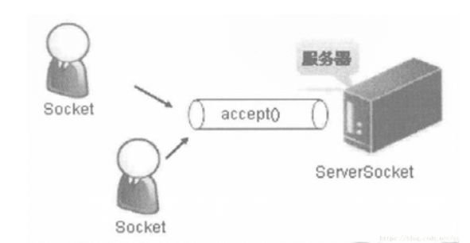

## SeverSocket类与Socket类

`SeverSocket`类主要用于在服务器端程序的开发上，用于接收客户端的连接请求。`SeverSocket`类的常用方法如下表所示。

| 序号 | 方法                           | 描述                                                         |
| ---- | ------------------------------ | ------------------------------------------------------------ |
| 1    | `ServerSocket(int port)`       | 创建`SeverSocket`实例，并制定监听窗口                        |
| 2    | `Socket accept()`              | 侦听并接受到此套接字的连接。等待客户端的连接，此方法之前一直阻塞 |
| 3    | `InetAddress getInetAddress()` | 返回服务器的`IP`地址                                         |
| 4    | `boolean isClosed()`           | 返回 `ServerSocket `的关闭状态。                             |
| 5    | `void close()`                 | 关闭此套接字。                                               |

在服务器端每次运行时都要使用`accept()`方法等待客户端连接，此方法发执行之后服务器段将进入到阻塞状态，直到客户端连接之后程序才能向下继续执行。此方法的返回值是`Socket`,每一个`Socket`都表示一个客户端对象，`Socket`的常用方法如下表所示。

| 序号 | 方法                             | 描述                                                 |
| ---- | -------------------------------- | ---------------------------------------------------- |
| 1    | `Socket(String host, int port)`  | 创建一个流套接字并将其连接到指定主机上的指定端口号。 |
| 2    | `InputStream getInputStream()`   | 返回此套接字的输入流。                               |
| 3    | `OutputStream getOutputStream()` | 返回此套接字的输出流。                               |
| 4    | `boolean isClosed()`             | 判断此套接字是否被关闭                               |
| 5    | `void close()`                   | 关闭此套接字。                                       |

在客户端，程序可以通过`Socket`类的`getInputStream()`方法取得服务器的输出信息，在服务端可以通过`getOutputStream()`方法取得客户端的输出信息,如下图所示：

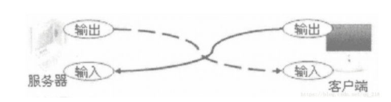

在网络编程中需要使用输入及输出流的形式完成信息的传递，所以在开发时需要导入`java.io`包。

## 第一个TCP程序

下面通过`ServerSocket`类及`Socket`类完成 一个服务器的程序开发，此服务向客户端输出"`hello` `world`!"的字符串信息。

### 服务端代码

```java
public static void main(String args[]) throws Exception
	{ 

		ServerSocket server = null; // 定义ServerSocket类
		Socket client = null; // 表示客 户端
		PrintStream out = null; // 打印流输出最方便
		server = new ServerSocket(8888); // 服务器在8888端口上监听
		System.out.println("服务器运行，等待客户端连接。");
		client = server.accept(); // 得到连接，程序进入到阻塞状态
		String str = "hello world"; // 表示要输出的信息
		//在服务端可以通过Socket类的getOutputStream()得到对客户端的输出流
		out = new PrintStream(client.getOutputStream());
		//向客户端输出信息
		out.println(str); 
		client.close();
		server.close();
	}
```

启动输出：服务器运行，等待客户端连接。

### 客户端代码

直接用Socket类指定连接的地址及端口号，并通过输入流读取服务器的输出信息

```java
public static void main(String args[]) throws Exception
	{
		//表示客 户端
		Socket client = null; 
		client = new Socket("localhost", 8888);
		BufferedReader buf = null; 
		//客户端 可以通过getInputStream()方法获取服务器的输出
		buf = new BufferedReader(
				new InputStreamReader(client.getInputStream()));
		String str = buf.readLine();
		System.out.println("接收到服务器端输出内容：" + str);
		buf.close();
		client.close();
	}
```

启动输出：接收到服务器端输出内容：hello world


从上面的程序的运行结果可以发现，服务器程序在执行到accept()方法后，程序进入到阻塞状态，此阻塞状态会在客户端连接后改变

## TCP实例：Echo程序

`Echo`程序是一个网络编程通信交互的一个经典案例，称为回应程序，即客户端输入什么内容，服务器端就会在这些内容前面加上"`Echo:`"，然后把这些信息发回给客户端，下面实现这样的一个程序。
在上面的代码中，服务器端每次执行完毕后服务器都会退出，这是因为服务器端指定接收一个客户端的连接，主要是由于`accpet()`方法只能使用一次。下面的程序中将通过循环的方式使用`accpt()`,这样每一个客户端执行完毕后，服务器端都可以重新等待用户连接。

### 实例：EchoServer

```java
 public static void main(String args[]) throws Exception
    {
        //定义服务器引用
        ServerSocket server = null;
        //定义客户端引用
        Socket client = null;
        BufferedReader buf = null;
        PrintStream out = null;
        //创建服务器，监听6666端口
        server = new ServerSocket(6666);
        //
        boolean f = true; // 定义个标记位
        while (f)
        {
            System.out.println("服务器运行，等待客户端连接。");
            //等待客户端连接
            client = server.accept();
            //连接成功之后
            //生成对客户端的输出流
            out = new PrintStream(client.getOutputStream());
            //获取客户端对本服务器的输入流
            buf = new BufferedReader(
                    new InputStreamReader(client.getInputStream()));
            boolean flag = true; // 标志位，表示可以一直接收并回应信息
            while (flag)
            {
                //从客户端读入一条消息
                String str = buf.readLine();
                //如果有读到消息，或者没有读到
                if (str == null || "".equals(str))
                { // 表示没有内容
                    flag = false; // 退出循环
                } else
                {
                    if ("exit".equals(str))
                    { // 如果输入的内容为exit表示结束
                        flag = false;
                    } else
                    {
                        out.println("ECHO : " + str); // 回应信息
                    }
                }
            }
            //关闭客户端
            client.close();
        }
        System.out.println("结束了吗？");
        //关闭服务端
        server.close();
    }
```

### 实例：EchoClient

```java
public static void main(String args[]) throws Exception
	{
		//定义客户端引用
		Socket client = null;
		//创建客户端监听本机的6666端口
		client = new Socket("localhost", 6666);
		
		BufferedReader buf = null;
		
		PrintStream out = null;
		BufferedReader input = null;
		//获取键盘输入流
		input = new BufferedReader(new InputStreamReader(System.in));
		//获取服务器对本客户端的输入流
		buf = new BufferedReader(
				new InputStreamReader(client.getInputStream()));
		//获取对服务器的输出流
		out = new PrintStream(client.getOutputStream());
		
		boolean flag = true; // 定义标志位
		while (flag)
		{
			System.out.print("输入信息：");
			//接收键盘输入
			String str = input.readLine();
			//把键盘输入的字符串，打印到输出流，也就是打印到服务器端
			out.println(str);
			if ("exit".equals(str))
			{
				flag = false;
			} else
			{
				//接收服务端的输入流
				String echo = buf.readLine(); // 接收返回结果
				System.out.println(echo); // 输出回应信息
			}
		}
		//关闭服务器对本客户端的输入流
		buf.close();
		//关闭客户端
		client.close();
	}
```

客户端输入输出

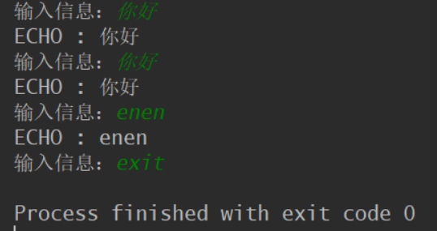

服务端输出

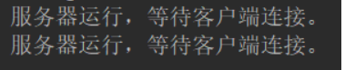

从程序运行的结果中可以发现，所有的输入信息最终都会通过回显的方式发回给客户端，并且在前面加上了"`ECHO：`"的信息。另外在本程序用，当一个客户端结束之后服务器端并并不会退出，而是继续等待下一个用户连接，下一个用户连接上了之后，服务器端会继续执行。


但是在本程序中有一个问题，就是现在的服务器端每次只能有一个用户能连接，属于单线程的处理机制，如果现在有其他客户端要连接到客户端，由于现在已经有一个客户端连接到服务器端了，其他客户端是无法连接的，要等待服务器出现空闲才可以连接。


为了能保证服务器可以同时连接多个客户端，可以加入多线程机制，即每一个客户端连接之后都启动一个线程，这样一个服务器就可以同时支持多个客户端的连接。

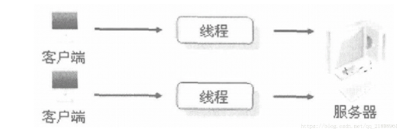

## 在服务器上应用多线程

对于服务器端来说，如果要加入多线程机制，则应该在每个用户连接之后启动一个新的线程提供服务。下面先建立一个EchoThread类，EchoThread类是专门用于提供服务的多线程操作，这里的多线程使用Runnable接口的方式实现。

把EchoSever.java中的accpet()之后的服务代码打包成线程，这样客户端连接上之后服务器就启动一个线程为该客户端提供服务，然后等待下一个客户端的连接。这样就能接收多个客户端的连接，并同时为多个客户端提供服务。
具体的做法是，把EchoSever.java中的accpet()之后的提供服务的代码，放到EchoThread.java的run()方法中。

### 实例：EchoThread

```java
import java.net.*;
import java.io.*;
public class EchoThread implements Runnable
{
    //客户端引用
    private Socket client = null;
    //构造函数
    public EchoThread(Socket client)
    {
        this.client = client;
    }
    //线程执行体
    public void run()
    {
        //表示来着客户端的输入
        BufferedReader clientIn = null;
        //对客户端的输出
        PrintStream outToClient = null;
        try
        {
            //获取对客户端的输出流
            outToClient = new PrintStream(client.getOutputStream());
            //获取来自客户端的输入流
            clientIn = new BufferedReader(
                    new InputStreamReader(client.getInputStream()));
            boolean flag = true; // 标志位，表示可以一直接收并回应信息
            while (flag)
            {
                //读取来自客户端的输入
                String str = clientIn.readLine();
                if (str == null || "".equals(str))
                { // 表示没有内容
                    flag = false; // 退出循环
                } else
                {
                    if ("exit".equals(str))
                    { // 如果输入的内容为bye表示结束
                        flag = false;
                    } else
                    {
                        //输出到客户端
                        outToClient.println("ECHO : " + str); // 回应信息
                    }
                }
            }
            client.close();
        } catch (Exception ignored)
        {
        }
    }
    public static void main(String[] args) throws Exception {
        //定义客户端引用
        Socket client = null;
        //创建客户端监听本机的6666端口
        client = new Socket("localhost", 6666);
        EchoThread echoThread=new EchoThread(client);
        System.out.println("我是客户端");
        echoThread.run();
    }
}
```

EchoThread.java的主要功能就是接受一个客户端的Socket，并通过循环的方式接受客户端的输入信息，然后向客户端回送刚才输入的信息。
下面创建EchoThreadServer类，使用上面的EchoThread来为客户端提供服务。

### 实例：EchoThreadServer类

```java
import java.net.*;
public class EchoThreadServer
{
    public static void main(String args[]) throws Exception
    {
        //定义服务器的引用
        ServerSocket server = null;
        //客户端的引用
        Socket client = null;
        //建立服务器，监听本地6666端口
        server = new ServerSocket(6666);
        boolean f = true;
        while (f)
        {
            System.out.println("服务器运行，等待客户端连接。");
            //取得连接，客户端没连接之前先等待连接。
            client = server.accept();
            //一个客户端连接之后，为该客户端启动一个服务线程进行服务
            new Thread(new EchoThread(client)).start();
        }
        server.close();
    }
}
```

还是对比上面的EchoServer.java，我们发现把EchoServer.java的**接受连接的部分**和**提供服务功能部分**分割出来成两个类，即可得到接受连接部分EchoThreadServer.java，和提供服务功能部分：EchoThread.java

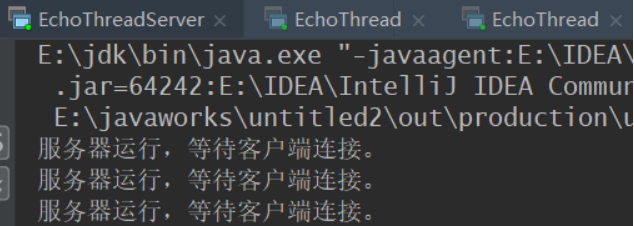

可以看到此时已经成功连接上两个客户端了，这两个客户端都正常运行，且服务器端已经准备等待第三个客户端的连接。这样，在服务端，每一个连接到服务器的客户端Socket都会以一个线程的方式运行，无论有多少个客户端连接都可以同时完成操作。

## 使用回调函数

如果想知道到底有多少个客户端正在和服务器进行通讯,可以通过回调函数来实现.

### 回调函数

假设A线程创建了B线程,B线程运行过程中调用了A线程的方法,则该方法就叫回调方法.

## 如何通过客户端关闭服务器

### EchoThreadServer

```java
package tcp;
import java.net.*;
public class EchoThreadServer
{
	// 静态变量,可以更改该标记以便停止服务端
	private static boolean isServerAlive = true;
	private static int clientNum = 0;
	public static void main(String args[]) throws Exception
	{
		// 定义服务器的引用
		ServerSocket server = null;
		// 客户端的引用
		Socket client = null;
		// 建立服务器，监听本地6666端口
		server = new ServerSocket(6666);
		while (isServerAlive)
		{
			System.out.println("等待客户端连接...");
			// 取得连接，客户端没连接之前先等待连接。
			client = server.accept();
			System.out.println("    客户端连接成功,当前客户端数量:" + clientNum);
			if (isServerAlive)
			{
				// 一个客户端连接之后，为该客户端启动一个服务线程进行服务
				new Thread(new EchoThread(client)).start();
			}
		}
		server.close();
		client.close();
		System.out.println("服务端已经停止...");
	}
	public static void addClientNum()
	{
		clientNum = clientNum + 1;
		// 注意了,下面的赋值方法错误
		// 后++:先取值,再增加,这将达不到增加的效果
		// clientNum = clientNum ++;
	}
	public static void minusClientNum()
	{
		clientNum = clientNum - 1;
	}
	public static int getClientNum()
	{
		return clientNum;
	}
	public static void shutdownServer()
	{
		isServerAlive = false;
	}
	public static boolean isServerAlive()
	{
		return isServerAlive;
	}
}

```

`EchoThreadServer`这个类中的,`minusClientNum`,`getClientNum`,`shutdownServer`这三个方法都是给子线程调用的方法,也就是所谓的回调方法.

### EchoThread

```java
package tcp;
import java.net.*;
import java.io.*;
public class EchoThread implements Runnable
{
	// 客户端引用
	private Socket client = null;
	int clienId;
	// 构造函数
	public EchoThread(Socket client)
	{
		this.client = client;
		// 设置服务线程编号
		this.clienId = EchoThreadServer.getClientNum();
		// 服务线程数量加1
		EchoThreadServer.addClientNum();
	}
	// 线程执行体
	public void run()
	{
		// 表示来着客户端的输入
		BufferedReader inByclient = null;
		// 对客户端的输出
		PrintStream outToClient = null;
		try
		{
			// 获取对客户端的输出流
			outToClient = new PrintStream(client.getOutputStream());
			// 获取来自客户端的输入流
			inByclient = new BufferedReader(
					new InputStreamReader(client.getInputStream()));
			boolean isClientAlive = true; // 标志位，表示可以一直接收并回应信息
			while (isClientAlive)
			{
				// 读取来自客户端的输入
				String str = inByclient.readLine();
				// 表示客户端要退出
				if ("exit".equals(str))
				{
					// 结束循环不再接收客户端的输入.
					isClientAlive = false;
					// 服务线程数目减1
					EchoThreadServer.minusClientNum();
				}
				// 关闭服务端
				else if ("shutdownServer".equals(str))
				{
					EchoThreadServer.shutdownServer();
					System.out.println("关闭服务器");
					break;
				} else
				{
					// 输出到客户端
					outToClient.println(
							"服务线程 " + this.clienId + " ECHO to client: " + str); // 回应信息
				}
			}
		} catch (Exception e)
		{
		}
	}
}

```

当`EchoThread`的一个线程启动时,将会调用主线程的`addClientNum`方法对主线程中的计数器`加1`,该线程结束时调用`minusClientNum`方法对主线程中的计数器`减1`.
当服务线程收到`shutdownServer`这个字符串的时候,将调用主线程的`shutdownServer`方法关闭服务器的主线程,这样服务器就不能响应新的客户端连接了.等到之前连接过的客户端都结束后客户端将会真正结束。

### EchoClient

```java
package tcp;
import java.net.*;
import java.io.*;
public class EchoClient
{
	public static void main(String args[]) throws Exception
	{
		// 定义客户端引用
		Socket client = null;
		// 创建客户端监听本机的6666端口
		client = new Socket("localhost", 6666);
		BufferedReader inputByServer = null;
		PrintStream outToServer = null;
		BufferedReader input = null;
		// 获取键盘输入流
		input = new BufferedReader(new InputStreamReader(System.in));
		// 获取服务器对本客户端的输入流
		inputByServer = new BufferedReader(
				new InputStreamReader(client.getInputStream()));
		// 获取对服务器的输出流
		outToServer = new PrintStream(client.getOutputStream());
		boolean flag = true; // 定义标志位
		// 如果服务器没死
		while (flag && EchoThreadServer.isServerAlive())
		{
			System.out.print("输入信息：");
			// 接收键盘输入
			String str = input.readLine();
			// 把键盘输入的字符串，打印到输出流，也就是打印到服务器端
			outToServer.println(str);
			// 客户端退出或者关闭服务器
			if ("exit".equals(str))
			{
				flag = false;
			} else if ("shutdownServer".equals(str))
			{
				flag = false;
				// 无效连接,用来抵消服务端的监听连接请求,
				// 不然服务端会一直阻塞造成无法关闭
				new Socket("localhost", 6666);
			} else
			{
				// 接收服务端的输入流
				String echo = inputByServer.readLine(); // 接收返回结果
				System.out.println(echo); // 输出回应信息
			}
		}
		// 关闭服务器对本客户端的输入流
		inputByServer.close();
		// 关闭客户端
		client.close();
	}
}
```

### 运行效果

打开两个客户端,并各自发送两个字符串,显示效果如下图:

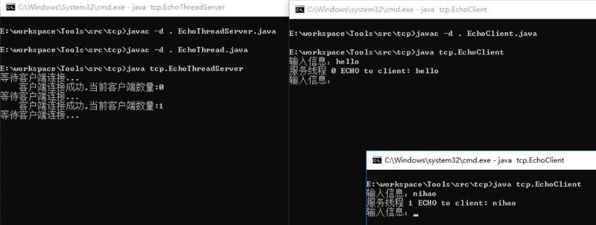

关闭一个客户端,然后再打开,则此时服务线程的数量先减一后加一,服务线程(等于客户端数量)数量不变.

在客户端输入exit关闭一个客户端

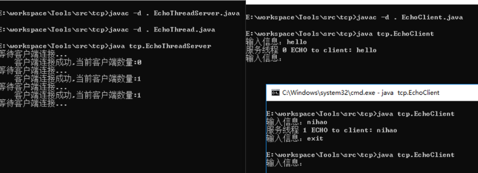

现在输入shutdownServer关闭服务器,效果如下:

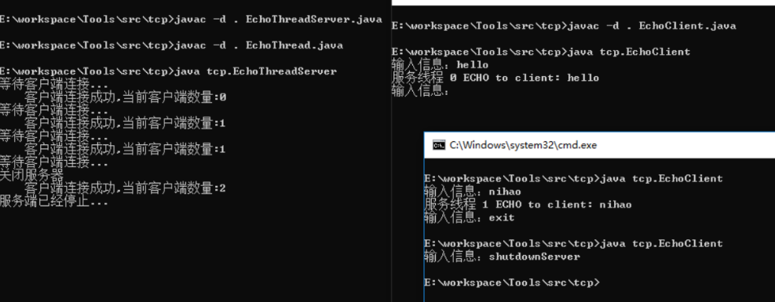

这只对新的客户端有影响,对已经连接的客户端并没有影响.

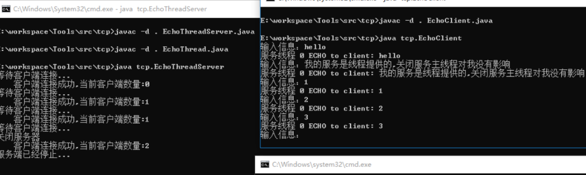

当所有连接过的客户端都结束后,服务端没有任何线程在运行,此时服务器才真正的结束:

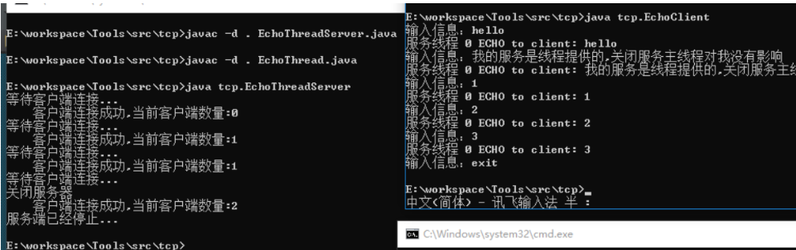