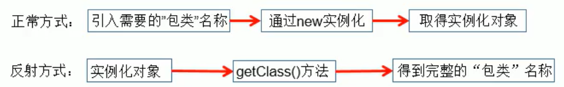
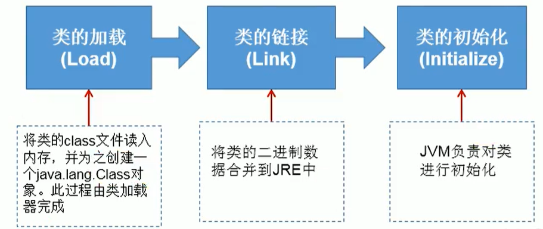
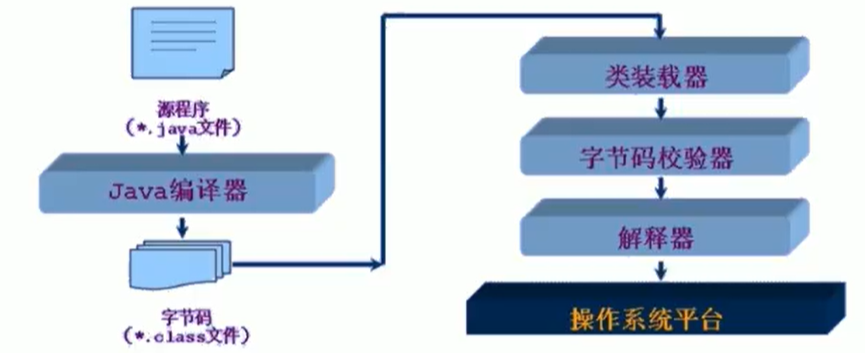
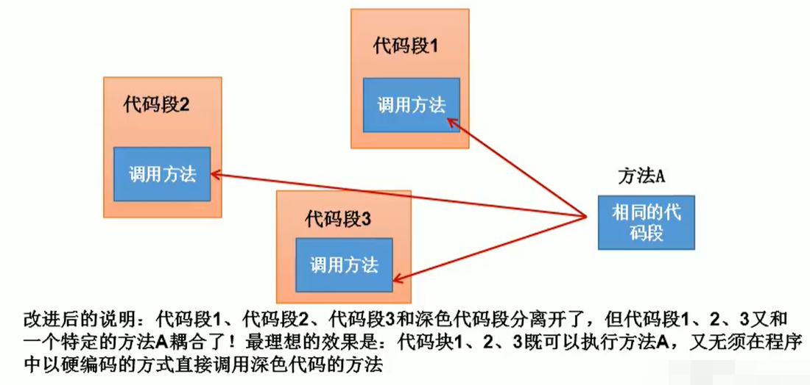
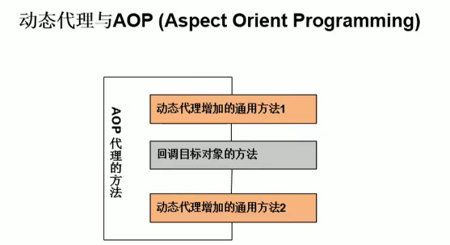

# 反射概述

- Reflection（反射）是被视为动态语言的关键，反射机制允许程序在执行期借助于ReflectionAPI取得任何类的内部信息，并能直接操作任意对象的内部属性及方法。
- 框架=反射+注解+设计模式。
- 加载完类之后，在堆内存的方法区中就产生了一个Class类型的对象（一个类只有一个Class对象），这个对象就包含了完整的类的结构信息。我们可以通过这个对象看到类的结构。这个对象就像一面镜子，透过这个镜子看到类的结构，所以，我们形象的称之为：反射。



## 1.1动态语言和静态语言

- **动态语言：**

>- 是一类在运行时可以改变其结构的语言：例如新的函数、对象、甚至代码可以被引进，已有的函数可以被删除或是其他结构上的变化。通俗点说就是在运行时代码可以根据某些条件改变自身结构。|
>- 主要动态语言：Object-C、C#、JavaScript、PHP、Python、Erlang。

- **静态语言：**

>- 与动态语言相对应的，运行时结构不可变的语言就是静态语言。如Java、C、C++。

- Java不是动态语言，但Java可以称之为“准动态语言”。即Java有一定的动态性，我们可以利用反射机制、字节码操作获得类似动态语言的特性。Java的动态性让编程的时候更加灵活！

## 1.2Java反射机制提供的功能

>- 在运行时判断任意一个对象所属的类
>- 在运行时构造任意一个类的对象
>- 在运行时判断任意一个类所具有的成员变量和方法
>- 在运行时获取泛型信息
>- 在运行时调用任意一个对象的成员变量和方法
>- 在运行时处理注解
>- 生成动态代理

## 1.3反射相关的主要API

```java
java.lang.Class：//代表一个类
java.lang.reflect.Method：//代表类的方法
java.lang.reflect.Field：//代表类的成员变量
java.lang.reflect.Constructor：//代表类的构造器
```

# 使用反射

## 2.0准备测试对象

```java
public class Person {
    //私有属性
    private String name;
    public int age;

    public String getName() {
        return name;
    }

    public void setName(String name) {
        this.name = name;
    }

    public int getAge() {
        return age;
    }

    public void setAge(int age) {
        this.age = age;
    }

    public Person(String name, int age) {
        this.name = name;
        this.age = age;
    }
    //私有构造函数
    private Person(String name) {
        this.name = name;
    }
    public Person(){}

    public void show(){
        System.out.println("---这是一个public方法---");
    }

    //私有带参的方法
    private void showNation(String nation){
        System.out.println("---这是一个private方法---");
        System.out.println(name + "国籍是"+nation);
    }

    @Override
    public String toString() {
        return "Person{" +
            "name='" + name + '\'' +
            ", age=" + age +
            '}';
    }
}
```

## 2.1未使用反射前对象的实例化和方法属性的调用

```java
@Test
public void test1() {
    //1.创建Person对象
    Person kobe = new Person("Kobe", 41);
    //2.通过对象调用其内部的属性和方法
    kobe.show();
    kobe.age = 42;
    System.out.println(kobe);
}
```

>- 在Person类外部，不可以通过Person类的对象调用其内部私有结构。
>- 比如：name、showNation（）以及私有的构造器

## 2.2使用反射进行对象的实例化和方法属性的调用

```java
@Test
public void test2() throws Exception {
    //1.通过反射，创建Person类的Class对象
    Class<Person> aClass = Person.class;
    Constructor<Person> constructor = aClass.getConstructor(String.class, int.class);
    Person kobe = constructor.newInstance("Kobe", 41);
    System.out.println(kobe); //Person{name='Kobe', age=41}
    //2.通过反射，调用对象指定的属性、方法
    Field age = aClass.getDeclaredField("age"); //调用属性:参数为要调用的属性名
    age.set(kobe,50);
    System.out.println(kobe); //Person{name='Kobe', age=50}
    Method show = aClass.getDeclaredMethod("show"); //调用方法:参数为要调用的方法名
    show.invoke(kobe); //---这是一个public方法---
}
```

## 2.3通过反射，可以调用Person类的私有结构的。

- **比如：私有的构造器、方法、属性**

```java
@Test
public void test3() throws Exception {
    final Class<Person> aClass = Person.class;
    final Constructor<Person> constructor = aClass.getDeclaredConstructor(String.class);
    constructor.setAccessible(true);
    final Person kobe = constructor.newInstance("Kobe");
    System.out.println(kobe); //Person{name='Kobe', age=0}

    final Field name = aClass.getDeclaredField("name");
    name.setAccessible(true);
    name.set(kobe, "James");
    System.out.println(kobe); //Person{name='James', age=0}

    final Method showNation = aClass.getDeclaredMethod("showNation", String.class);
    showNation.setAccessible(true);
    //相当于kobe.showNation()的方法调用
    showNation.invoke(kobe, "美国"); //---这是一个private方法---,James的国籍是美国
}
```

## 2.4对于反射的疑问

- 疑问：通过直接new的方式或反射的方式都可以调用公共的结构，开发中到底用那个？

>- 建议：直接new的方式。
>- 什么时候会使用：反射的方式。反射的特征：动态性

- 疑问：反射机制与面向对象中的封装性是不是矛盾的？如何看待两个技术？

>- 不矛盾
>- private、public这些访问修饰符只是起到一个提示和一般的限制的作用，例如，声明为private的方式表示建议不要调用，声明为public的方法则表示建议调用。如果在特殊场合就是需要调用private修饰的方法就需要反射。所以不矛盾。

# java.Lang.Class类的理解

## 3.0代码执行的三个阶段


1. 源代码阶段：

>- 我们一般都是先创建一个类文件，例如Person.java，当我们把代码写好，也就是写好基本的类属性，类构造函数，类成员函数之后，就要进行系统编译，如果没有语法错误，就把Java文件里面的类属性，类构造函数，类成员函数一一编译为字节码文件
>- 虽然把Java文件编译成了字节码文件，但想要运行还是不够的，当我们在main函数里创建一个对象时，这个对象是在内存当中的，但字节码文件还储存在硬盘上，所以必须先加载进内存

2. Class类对象阶段：

>- Java中有一个类就叫Class，这个类是用来描述所有字节码文件共同特征的一个类，这个类里面有三个对象数组，也就是用来分别描述类属性，类构造函数和类成员函数的。Java语言的特点就是万物皆对象，现在我终于明白这句话是什么意思了，不论是类属性，类构造函数，还是类成员函数，通过类加载器加载之后他们都会进入对应的对象数组里面，进入内存中。
>- 类的属性可以取值，可以设值，而且也许不止一个，就封装在Fileld[]对象数组中
>- 类的构造函数可以构造出类对象，也会有多个，就封装在constructor[]对象数组中
>- 构造出类对象后用成员方法来表现类的动作，就封装在Method[]对象数组中

3. Runtime运行时阶段：

>- 创建对象并运行，所有真正的类对象其实都是通过Class类对象来创建出来的

## 3.1对于该类的理解

1. 类的加载过程：

>- 程序经过javac.exe命令以后，会生成一个或多个字码文件（.class结尾）。接着我们使用java.exe命令对某个字节码文件进行解释运行。相当于将某个字节码文件加载到内存中。此过程就称为类的加载。**加载到内存中的类，我们就称为运行时类，此运行时类，就作为Class的一个实例。**
>- 类本身也是对象，类是Class的对象

2. Class的实例对应着一个运行时类

3. 加载到内存中的运行时类，会缓存一定的时间。在此时间之内，我们可以通过不同的方式来获取此运行时类

## 3.2获取Class实例的方式

- 第一种方式：将字节码文件加载进内存，返回Class对象

>- 只有Java字节码文件，还没有进内存，我们需要手动的把字节码文件加载进入内存 【class.forName("全类名")】，生成一个字节码文件对象，就是Class类对象
>- 多用于配置文件，将类名定义在配置文件中，加载类

- 第二种方式：通过类名的属性class获取

>- 字节码文件已经被我们加载一次了，已经进入内存了，那么就可以通过类名来获取【类名.class】，类有一个属性就是class
>- 多用于参数传递

- 第三种方式：对象.getClass()，get方法是封装在Object类中的

>- 已经在运行时阶段了，那么就已经有对象了，就可以通过该对象的get方法来获取【对象.getClass()】
>- 多用于对象的获取字节码的方式

- 测试示例：

```java
@Test
public void test4() throws ClassNotFoundException {
    //方式一：调用运行时类的属性(.class)
    //注：若Person类中有静态代码块不会执行
    final Class<Person> c1 = Person.class;
    System.out.println(c1); //class reflection.Person

    //方式二：通过运行时类的对象,调用getclass（）
    //注：若Person类中有静态代码块会执行
    final Person person = new Person();
    final Class<? extends Person> c2 = person.getClass();
    System.out.println(c2);

    //方式三：调用class的静态方法,forName(String classPath),传入全类名
    //注：若Person类中有静态代码块会执行
    final Class<?> c3 = Class.forName("reflection.Person");
    System.out.println(c3);

    System.out.println(c1 == c2); //true
    System.out.println(c1 == c3); //true
    System.out.println(c2 == c3); //true

    //方式四：使用类的加载器：CLassLoader
    //注：若Person类中有静态代码块不会执行
    final ClassLoader classLoader = ReflectTest.class.getClassLoader();
    final Class<?> c4 = classLoader.loadClass("reflection.Person");
    System.out.println(c4);
    System.out.println(c1 == c4); //true
}
```

- 从示例代码三种创建Class对象的比较都为true可得出以下结论：

>- 同一个字节码文件(*.class)在一次程序运行过程中只会被加载一次，不论通过哪一种方式获取的Class对象都是同一个

## 3.3哪些类型可以有class对象？

- class：类，成员（成员内部类，静态内部类），局部内部类，匿名内部类
- interface：接口
- [ ]：数组
- enum：枚举
- annotation：注解@interface 
- primitive type：基本数据类型
- void

# 类的加载

- 当程序主动使用某个类时，如果该类还未被加载到内存中，则系统会通过如下三个步骤来对该类进行初始化。



- **加载：**

>- 将class文件字节码内容加载到内存中，并将这些静态数据转换成方法区的运行时数据结构，然后生成一个代表这个类的java.lang.Class对象，作为方法区中类数据的访问入口（即引用地址）。所有需要访问和使用类数据只能通过这个Class对象。这个加载的过程需要类加载器参与

- **链接：将Java类的二进制代码合并到JVM的运行状态之中的过程。**

>- 验证：确保加载的类信息符合JVM规范，例如：以cafe开头，没有安全方面的问题
>- 准备：正式为类变量（static）分配内存并设置类变量默认初始值的阶段，这些内存都将在方法区中进行分配
>- 解析：虚拟机常量池内的符号引用（常量名）替换为直接引用（地址）的过程

- **初始化：**

>- 执行类构造器< clinit >（）方法的过程。类构造器< clinit >() 方法是由编译期自动收集类中所有类变量的赋值动作和静态代码块中的语句合并产生的（类构造器是构造类信息的，不是构造该类对象的构造器）
>- 当初始化一个类的时候，如果发现其父类还没有进行初始化，则需要先触发其父类的初始化
>- 虚拟机会保证一个类的< clinit >（）方法在多线程环境中被正确加锁和同步

# ClassLoader类加载器



- **类加载器的作用：**

>- 类加载的作用：将class文件字节码内容加载到内存中，并将这些静态数据转换成方法区的运行时数据结构，然后在堆中生成一个代表这个类的java.lang.Class对象，作为方法区中类数据的访问入口。
>- 类缓存：标准的JavaSE类加载器可以按要求查找类，但一旦某个类被加载到类加载器中，它将维持加载（缓存）一段时间。不过JVM垃圾回收机制可以回收这些Class对象。

- **类加载器的分类：**

>- 引导类加载器：
>  - 用C++编写的，是JVM自带的类加载器，负责Java平台核心库，用来装载核心类库。该加载器无法直接获取
>- 扩展类加载器：
>  - 负责jre/lib/ext目录下的jar包或-Djava.ext.dirs 指定目录下的jar包装入工作库
>- 系统类加载器：
>  - 负责java-classpath或-D java.class.path所指的目录下的类与jar包装入工作，是最常用的加载器

```java
public class ClassLoaderTest {
    @Test
    public void test() {
        //对于自定义类，使用系统类加载器进行加载
        final ClassLoader cl1 = ClassLoaderTest.class.getClassLoader();
        System.out.println(cl1); //jdk.internal.loader.ClassLoaders$AppClassLoader@78308db1

        //调用系统类加载器的getParent（）：获取扩展类加载器
        final ClassLoader cl2 = cl1.getParent();
        System.out.println(cl2);  //jdk.internal.loader.ClassLoaders$PlatformClassLoader@6bdf28bb

        //调用扩展类加载器的getParent（）：无法获取引导类加载器
        //引导类加载器主要负责加载java的核心类库，无法加载自定义类的。
        final ClassLoader cl3 = cl2.getParent();
        System.out.println(cl3); //null
    }
}
```

# Properties类

>- Properties 类表示了一个持久的属性集。Properties可保存在流中或从流中加载
>- Properties集合是一个唯一和IO流相结合的集合可以使用Properties集合中的方法store，把集合中的临时数据，持久化写入到硬盘中存储可以使用Properties集合中的方法load，把硬盘中保存的文件（键值对），读取到集合中使用属性列表中每个键及其对应值都是一个字符串
>- Properties集合是一个双列集合，key和value默认都是字符串

## 常用方法解释

- Properties集合有一些操作字符串的特有方法

```java
Object setProperty(String key，String value) //实质是调用Hashtable的put()方法。
String getProperty(string key) //通过key找到value值，此方法相当于Map集合中的get(key)方法
Set<string> stringPropertyNames() //返回此属性列表中的键集，其中该键及其对应值是字符串，此方法相当于Map集合中的keyset方法
```

- 可以使用Properties集合中的方法store，把集合中的临时数据，持久化写入到硬盘中存储

```java
void stor(OutputStream out，String comments) //不能写入中文
void store(writer writer，String comments) //可以写入中文
//String comments的含义: 注释，用来解释说明保存的文件是做什么用的,不能使用中文，会产生乱码，默认是Unicode编码若无解释说明,一般使用空字符串
```

- 使用步骤：

>1. 创建Properties集合对象，添加数据
>2. 创建字节输出流/字符输出流对象，构造方法中绑定要输出的目的地
>3. 使用Properties集合中的方法store，把集合中的临时数据，持久化写入到硬盘中存储
>4. 释放资源

- 可以使用Properties集合中的方法Load，把硬盘中保存的文件（键值对），读取到集合中

```java
void Load(InputStream instream)
void Load(Reader reader)
//Inputstream instream:字节输入流，不能读取含有中文的键值对
//Reader reader:字符输入流，能读取含有中文的键值对
```

- 使用步骤：

>1. 创建Properties集合对象
>2. 使用Properties集合对象中的方法Load读取保存键值对的文件
>3. 遍历Properties集合

- 注意：

>1. 存储键值对的文件中，键与值默认的连接符号可以使用=，空格（其他符号）
>2. 存储键值对的文件中，可以使用进行注释，被注释的键值对不会再被读取
>3. 存储键值对的文件中，键与值默认都是字符串，不用再加引号

## JDBC使用场景

- **方式一：使用文件输入流读取配置文件**

```java
@Test
public void test1() throws IOException {
    final Properties properties = new Properties();
    //此时的文件默认在当前的Project下
    final FileInputStream in = new FileInputStream("src\\jdbc.properties");
    properties.load(in);
    final String user = properties.getProperty("user");
    final String password = properties.getProperty("password");
    System.out.println("user=" + user + " " + "password=" + password); //user=root password=root
}
```

- **方式二：使用ClassLoader读取配置文件**

```java
@Test
public void test2() throws IOException {
    final Properties properties = new Properties();
    //配置文件默认识别为：当前Project的src下
    final ClassLoader classLoader = ClassLoaderTest.class.getClassLoader();
    final InputStream in = classLoader.getResourceAsStream("jdbc.properties");
    if (in != null){
        properties.load(in);
        final String user = properties.getProperty("user");
        final String password = properties.getProperty("password");
        System.out.println("user=" + user + " " + "password=" + password);
    }
}
```

# 创建运行时类的对象

- newInstance()：调用此方法，创建对应的运行时类的对象。内部调用了运行时类的空参构造器。

>- 要想此方法正常的创建运行时类的对象，要求：
>  1. 运行时类必须提供空参的构造器
>  2. 空参的构造器的访问权限得够。通常，设置为public

- 在javabean中要求提供一个public的空参构造器。原因：

>1. 便于通过反射，创建运行时类的对象
>2. 便于子类继承此运行时类时，默认调用super()时，保证父类有此构造器

**测试一：创建一个空参构造函数的对象**

```java
@Test
public void test1() throws IllegalAccessException, InstantiationException {
    final Class<Person> pClass = Person.class;
    final Person person = pClass.newInstance(); //此方法已废弃
    System.out.println(person);
}
```

- **测试二：使用反射动态创建对象**

```java
@Test
public void test6() throws IllegalAccessException, InstantiationException, ClassNotFoundException {
    Random random = new Random();
    final int i = random.nextInt(3);
    String classPath = "";
    switch (i){
        case 0:
            classPath = "java.lang.Object";
            break;
        case 1:
            classPath = "java.util.Date";
            break;
        case 2:
            classPath = "java.util.Random";
            break;
    }
    final Object o = getInstanceObject(classPath);
    System.out.println(o);
}

//创建一个对象
public Object getInstanceObject(String classPath) throws ClassNotFoundException, IllegalAccessException, InstantiationException {
    //根据全类名得到一个运行时类对象
    final Class<?> aClass = Class.forName(classPath);
    //创建该对象实例
    return aClass.newInstance();
}
```

# 获取运行时类的完整结构

- **示例一：获取属性结构**

```java
@Test
public void test1() {
    final Class<Person> aClass = Person.class;
    
    //getFields()：获取当前运行时类及其父类中声明为public访问权限的属性
    final Field[] f1 = aClass.getFields();
    for (Field field : f1) {
        System.out.println(field);
    }

    //getDeclaredFields()：获取当前运行时类中声明的所有属性(不包含父类中声明的属性)
    final Field[] fields = aClass.getDeclaredFields();
    for (Field field : fields) {
        System.out.println(field);
    }
}
```

- **示例二：访问修饰符、数据类型、变量名**

```java
@Test
public void test2() {
    final Class<Person> aClass = Person.class;
    final Field[] fields = aClass.getDeclaredFields();
    for (Field field : fields) {
        //1.获取访问修饰符
        final int modifiers = field.getModifiers(); //得到的是访问修饰符对应的数字常量
        System.out.println(modifiers);
        System.out.println(Modifier.toString(modifiers)); //将该数字常量输出为对应的访问修饰符字符串

        //2.获取数据类型
        final Class<?> type = field.getType();
        System.out.println(type);

        //3.获取变量名
        final String name = field.getName();
        System.out.println(name);
    }
}
```

- **示例三：获取运行时类的方法结构**

```java
@Test
public void test3(){
    final Class<Person> aClass = Person.class;

    //getMethods（）：获取当前运行时类及其所有父类中声明public权限的方法
    final Method[] methods = aClass.getMethods();
    for (Method method : methods) {
        System.out.println(method);
    }
    System.out.println();
    //getDeclaredMethods()：获取当前运行时类中声明的所有方法(不包含父类中声明的方法)
    final Method[] declaredMethods = aClass.getDeclaredMethods();
    for (Method declaredMethod : declaredMethods) {
        System.out.println(declaredMethod);
    }
}
```

- **示例四：获取方法返回值、返回名、参数列表**

```java
@Test
public void test4(){
    final Class<Person> aClass = Person.class;

    //权限修饰符返回值类型方法名（参数类型1形参名1，...）throws XxxException
    final Method[] methods = aClass.getMethods();
    for (Method method : methods) {
        //获取方法注解
        final Annotation[] annotations = method.getAnnotations();
        for (Annotation annotation : annotations) {
            System.out.println(annotation);
        }

        System.out.println("------------");
        final int i = method.getModifiers();
        System.out.println(Modifier.toString(i));

        //获取方法返回值
        System.out.println("------------");
        final Class<?> returnType = method.getReturnType();
        System.out.println(returnType);

        //获取方法名
        final String name = method.getName();
        System.out.println(name);

        //获取方法参数列表
        final Parameter[] parameters = method.getParameters();
        System.out.print("(");
        for (Parameter parameter : parameters) {
            System.out.print(parameter.getName() +"___"+ parameter);
        }
        System.out.print(")");
        System.out.println();

    }
}
```

# 调用运行时类的指定结构

- **调用运行时类的指定属性**

```java
@Test
public void test10(){
    //1.获取运行时类
    final Class<Person> personClass = Person.class;
    try {
        //2.创建运行时类的对象
        final Person person = personClass.getConstructor().newInstance();
        //3.获取运行时类指定变量名的属性
        final Field name = personClass.getDeclaredField("name");
        //4.确保该属性是可访问的
        name.setAccessible(true);
        //5.设置当前属性的值,参数1:指明设置哪个对象的属性 参数2:将此属性值设置为多少
        name.set(person,"Tom");
        //获取属性的值,参数1:获取哪个对象属性的值
        final Object o = name.get(person);
        System.out.println(o); //Tom
        System.out.println(person); //Person{name='Tom', age=0}
    } catch (Exception e) {
        e.printStackTrace();
    }
}
```

- **调用运行时类的指定方法**

```java
@Test
public void test9(){
    //1.获取运行时类
    Class<Person> personClass = Person.class;
    try {
        //2.创建一个运行时类的对象
        Person person = personClass.getConstructor().newInstance();
        //3.获取指定的某个方法,参数1:指明获取的方法的名称 参数2:指明获取的方法的参数列表
        Method showNation = personClass.getDeclaredMethod("showNation", String.class);
        //4.保证当前方法是可访问的
        showNation.setAccessible(true);
        //5.调用方法,参数1:方法的调用者 参数2:给方法赋值的实参
        Object o = showNation.invoke(person, "中国"); //输出:null的国籍是中国
        //invoke方法的返回值就对应类中所调用方法的返回值,如果类中的方法是void则返回值为null
        System.out.println(o);

        System.out.println("------调用静态方法------");
        Method desc = personClass.getDeclaredMethod("desc");
        desc.setAccessible(true);
        desc.invoke(person); //等同于desc.invoke(null);本来就是通过当前运行时类得到的方法，就不必显示指定方法的调用者了
    } catch (Exception e) {
        e.printStackTrace();
    }
}
```

- **示例：调用运行时类的指定构造器**

```java
    @Test
    public void test3(){
        Class<Person> personClass = Person.class;
        try {
            //1.获取指定的构造器,参数:指明构造器的参数列表
            Constructor<Person> constructor = personClass.getDeclaredConstructor(String.class);
            //2.确保此构造器是可访问的
            constructor.setAccessible(true);
            //3.调用此构造器创建运行时类的对象
            Person batman = constructor.newInstance("Batman");
            System.out.println(batman); //Person{name='Batman', age=0}
        } catch (Exception e) {
            e.printStackTrace();
        }
    }
```

# 反射的应用：动态代理

- 代理设计模式的原理：
  - 使用一个代理将对象包装起来，然后用该代理对象取代原始对象。任何对原始对象的调用都要通过代理。代理对象决定是否以及何时将方法调用转到原始对象上。
- 静态代理，特征是代理类和目标对象的类都是在编译期间确定下来，不利于程序的扩展。同时，每一个代理类只能为一个接口服务，这样一来程序开发中必然产生过多的代理。最好可以通过一个代理类完成全部的代理功能。
- 动态代理是指客户通过代理类来调用其它对象的方法，并且是在程序运行时根据需要动态创建目标类的代理对象。
- 动态代理使用场合：

>- 调试
>- 远程方法调用

- 动态代理相比于静态代理的优点：
  - 抽象角色中（接口）声明的所有方法都被转移到调用处理器一个集中的方法中处理，这样，我们可以更加灵活和统一的处理众多的方法。

- **静态代理举例：**
  - 特点：代理类和被代理类在编译期间，就确定下来了。

```java
interface ClothesFactory {
    void produceClothes();
}

//代理类
class proxyClothedFactory implements ClothesFactory {

    private ClothesFactory factory; //用被代理类进行实例化

    public proxyClothedFactory(ClothesFactory factory) {
        this.factory = factory;
    }

    @Override
    public void produceClothes() {
        System.out.println("代理工程做一些准备工作");
        factory.produceClothes();
        System.out.println("代理工厂做一些收尾工作");

    }
}

//被代理类
class NikeClothesFactory implements ClothesFactory {
    @Override
    public void produceClothes() {
        System.out.println("Nike工厂生产一堆AJ运动鞋");
    }
}

public class StaticProxyTest {
    public static void main(String[] args) {
        //创建被代理类对象
        NikeClothesFactory nike = new NikeClothesFactory();
        //创建代理类对象
        proxyClothedFactory proxyClothedFactory = new proxyClothedFactory(nike);
        proxyClothedFactory.produceClothes();
    }
}

/*
代理工程做一些准备工作
Nike工厂生产一堆AJ运动鞋
代理工厂做一些收尾工作
*/
```

- 动态代理实例

```java
interface Human{
    String getBelief();
    void eat(String food);
}

//被代理类
class Superman implements Human{

    @Override
    public String getBelief() {
        return "I am a hero in the world";
    }

    @Override
    public void eat(String food) {
        System.out.println("超人喜欢吃"+food);
    }
}

/*
要想实现动态代理，需要解决的问题？
问题一：如何根据加载到内存中的被代理类，动态的创建一个代理类及其对象。
问题二：当通过代理类的对象调用方法时，如何动态的去调用被代理类中的同名方法。
 */
class ProxyFactory{
    //调用此方法，返回一个代理类的对象。解决问题一
    public static Object getProxyInstance(Object obj){ //obj 被代理的对象

        MyInvocationHandler handler = new MyInvocationHandler();
        handler.bind(obj);
        return Proxy.newProxyInstance(obj.getClass().getClassLoader(),obj.getClass().getInterfaces(),handler);
    }
}
//当我们通过代理类的对象，调用方法a时，就会自动的调用如下的方法：invoke()
//将被代理类要执行的方法a的功能就声明在invoke()中
class MyInvocationHandler implements InvocationHandler{
    Object obj;

    public void bind(Object obj){
        this.obj = obj;
    }
    @Override
    public Object invoke(Object o, Method method, Object[] args) throws Throwable {
        //method：即为代理类对象调用的方法，此方法也就作为了被代理类对象要调用的方法
        //obj：被代理类的对象
        return method.invoke(obj,args); //方法的返回值作为当前invoke方法的返回值
    }
}
public class ProxyTest {
    public static void main(String[] args) {
        final Superman superman = new Superman();
        //proxyInstance:代理类的对象
        final Human proxyInstance = (Human) ProxyFactory.getProxyInstance(superman);
        //当通过代理类对象调用方法时，会自动的调用被代理类中同名的方法
        String belief = proxyInstance.getBelief();
        System.out.println(belief);
        proxyInstance.eat("重庆火锅");
    }
}
/*
I am a hero in the world
超人喜欢吃重庆火锅
*/
```

# 动态代理与AOP

- Aspect Orient Programming
- 前面介绍的Proxy和InvocationHandler，很难看出这种动态代理的优势，下面介绍一种更实用的动态代理机制





# 程序的运行过程

```java
//MainApp.java  
public class AppMain {  
    public static void main(String[] args) {  
        Animal animal = new Animal("Puppy");  
        animal.printName();  
    }  
}  
//Animal.java  
public class Animal {  
    public String name;  
    public Animal(String name) {  
        this.name = name;  
    }  
    public void printName() {  
        System.out.println("Animal ["+name+"]");  
    }  
}  
```

## 第一步(编译)

- 创建完源文件之后，程序会先被编译为.class文件。Java编译一个类时，如果这个类所依赖的类还没有被编译，编译器就会先编译这个被依赖的类，然后引用，否则直接引用，这个有点象make。如果java编译器在指定目录下找不到该类所其依赖的类的.class文件或者.java源文件的话，编译器话报“cant find symbol”的错误。

- 编译后的字节码文件格式主要分为两部分：常量池和方法字节码。常量池记录的是代码出现过的所有token(类名，成员变量名等等)以及符号引用（方法引用，成员变量引用等等）；方法字节码放的是类中各个方法的字节码。下面是MainApp.class通过反汇编的结果，我们可以清楚看到.class文件的结构：

## 第二步（运行）

- java类运行的过程大概可分为两个过程：

>1. 类的加载 
>2. 类的执行

- 需要说明的是：JVM主要在程序第一次主动使用类的时候，才会去加载该类。也就是说，JVM并不是在一开始就把一个程序就所有的类都加载到内存中，而是到不得不用的时候才把它加载进来，而且只加载一次。

- 下面是程序运行的详细步骤：

>1. 在编译好java程序得到MainApp.class文件后，在命令行上敲java AppMain。系统就会启动一个jvm进程，jvm进程从classpath路径中找到一个名为AppMain.class的二进制文件，将MainApp的类信息加载到运行时数据区的方法区内，这个过程叫做MainApp类的加载。
>2. 然后JVM找到AppMain的主函数入口，开始执行main函数。
>3. main函数的第一条命令是Animal  animal = new Animal("Puppy");就是让JVM创建一个Animal对象，但是这时候方法区中没有Animal类的信息，所以JVM马上加载Animal类，把Animal类的类型信息放到方法区中。
>4. 加载完Animal类之后，Java虚拟机做的第一件事情就是在堆区中为一个新的Animal实例分配内存, 然后调用构造函数初始化Animal实例，这个Animal实例持有着指向方法区的Animal类的类型信息（其中包含有方法表，java动态绑定的底层实现）的引用。
>5. 当使用animal.printName()的时候，JVM根据animal引用找到Animal对象，然后根据Animal对象持有的引用定位到方法区中Animal类的类型信息的方法表，获得printName()函数的字节码的地址。
>6. 开始运行printName()函数。