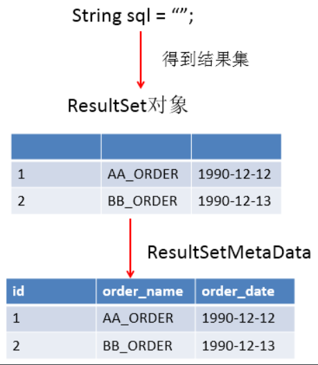

# 第1节:JDBC概述

>- 引言：有谦和、愉快、诚恳的态度，而同时又加上忍耐精神的人，是非常幸运的。
>- JDBC是JAVA访问数据库的基石。

## 1.1数据的持久化

>- 持久化（persistence）：把数据保存到可掉电式存储设备中以供之后使用。大多数情况下，特别是企业级应用，数据持久化意味着将内存中的数据保存到硬盘上加以“固化”，而持久化的实现过程大多通过各种关系数据库来完成。
>- 持久化的主要应用是将内存中的数据存储在关系型数据库中，当然也可以存储在磁盘文件、XML数据文件中。


## 1.2Java中的数据存储技术

- 在Java中，数据库存取技术可分为如下几类：

>- JDBC直接访问数据库
>- JDO（Java Data Object）技术
>- 第三方0/R工具，如Hibernate，Mybatis等

- JDBC是java访问数据库的基石，JDO、Hibernate、MyBatis等只是更好的封装了JDBC。

## 1.3JDBC介绍

- JDBC（Java Database Connectivity）是一个独立于特定数据库管理系统、通用的SQL数据库存取和操作的公共接口（一组API），定义了用来访问数据库的标准Java类库，（java.sql，javax.sql）使用这些类库可以以一种标准的方法、方便地访问数据库资源。
- JDBC为访问不同的数据库提供了一种统一的途径，为开发者屏蔽了一些细节问题。
- JDBC的目标是使Java程序员使用JDBC可以连接任何提供了JDBC驱动程序的数据库系统，这样就使得程序员无需对特定的数据库系统的特点有过多的了解，从而大大简化和加快了开发过程。
- 如果没有JDBC，那么Java程序访问数据库时是这样的：


- 有了JDBC，Java程序访问数据库时是这样的：


- 总结如下


## 1.4JDBC体系结构

- JDBC接口（API）包括两个层次：

>- 面向应用的APl:JavaAPl，抽象接口，供应用程序开发人员使用（连接数据库，执行SQL语句，获得结果）。
>- 面向数据库的API:Java Driver APl，供开发商开发数据库驱动程序用。

- **JDBC是sun公司提供一套用于数据库操作的接口，java程序员只需要面向这套接口编程即可。不同的数据库厂商，需要针对这套接口，提供不同实现。不同的实现的集合，即为不同数据库的驱动。-———面向接口编程**


- 安装的驱动就是对应的厂家实现了的相关抽象方法的集合

## 1.5JDBC程序编写步骤


>- **补充：ODBC（Open Database Connectivity，开放式数据库连接），是微软在Windows平台下推出的。使用者在程序中只需要调用ODBCAPI，由ODBC驱动程序将调用转换成为对特定的数据库的调用请求。**

# 第2节:获取数据库连接

## 2.1要素一：Driver接口实现类

### 2.1.1 Driver接口介绍

- java.sql.Driver 接口是所有JDBC驱动程序需要实现的接口。这个接口是提供给数据库厂商使用的，不同数据库厂商提供不同的实现。
- 在程序中不需要直接去访问实现了Driver 接口的类，而是由驱动程序管理器类（java.sql.DriverManager）去调用这些Driver实现

>- Oracle的驱动：oracle.jdbc.driver.OracleDriver
>- mysql的驱动：com.mysql.jdbc.Driver

- 导入驱动jar包 mysql-connector-java-5.1.37-bin.jar到 Java 工程的一个目录中、习惯上新建一个lib文件夹

>- 复制mysql-connector-java-5.1.37-bin.jar到项目的libs目录下
>- 右键—>Add As Library

- 注意：如果是Dynamic Web Project（动态的web项目）话，则是把驱动jar放到WebContent（有的开发工具叫WebRoot）目录中的WEB-INF目录中的lib目录下即可

### 2.1.2加载与注册JDBC驱动

- 加载驱动：加载JDBC驱动需调用Class类的静态方法forName()，向其传递要加载的JDBC驱动的类名
  - Class.forName（“com.mysql.jdbc.Driver"）；
- 注册驱动：DriverManager 类是驱动程序管理器类，负责管理驱动程序

>- 使用DriverManager.registerDriver（com.mysql.jdbc.Driver）来注册驱动
>- 通常下不用显式调用DriverManager 类的 registerDriver() 方法来注册驱动程序类的实例，因为Driver接口的驱动程序类都包含了静态代码块，在这个静态代码块中，会调用DriverManager.registerDriver() 方法来注册自身的一个实例

## 2.2要素二：URL

- JDBC URL用于标识一个被注册的驱动程序，驱动程序管理器通过这个URL选择正确的驱动程序，从而建立到数据库的连接。
- JDBC URL的标准由三部分组成，各部分间用冒号分隔。

>- 格式：( jdbc：子协议：子名称 )
>- 协议：JDBC URL中的协议总是jdbc
>- 子协议：子协议用于标识一个数据库驱动程序
>- 子名称：一种标识数据库的方法。子名称可以依不同的子协议而变化，用子名称的目的是为了定位数据库提供足够的信息。包含主机名（对应服务端的ip地址），端口号，数据库名

- 举例：


- 几种常用数据库的JDBC URL
  - MySQL的连接URL编写方式：
    - jdbc:mysql://主机名称：mysql服务端口号/数据库名称？参数=值&参数=值

## 2.3 要素三：用户名和密码

- user，password可以用“属性名=属性值”方式告诉数据库
- 可以调用 DriverManager 类的 getConnection() 方法建立到数据库的连接

## 2.4连接示例

### 2.4.1连接方式一

```java
public class ConnectionTest {
    @Test
    public void test1() throws SQLException {
        //1.获取Driver的实现类对象
        Driver driver = new com.mysql.jdbc.Driver();
        //协议:子协议://域名:端口号:要连接的数据库名称
        String url = "jdbc:mysql://localhost:3306/db3";  //固定写法
        //2.将用户名和密码封装在Properties对象中
        Properties info = new Properties();
        //输入用户名和密码
        info.setProperty("user","root");
        info.setProperty("password","root");
        //3.进行数据库连接：URL+自己的用户名和密码
        Connection connect = driver.connect(url, info);
        System.out.println(connect); //输出:com.mysql.jdbc.JDBC4Connection@23e028a9
    }
}
```

>- 说明：上述代码中显式出现了第三方数据库的API

### 2.4.2连接方式二

```java
@Test
public void test2() throws Exception {
    //1.获取Driver类实现对象：使用反射
    Class<?> aClass = Class.forName("com.mysql.jdbc.Driver");
    Driver driver = (Driver) aClass.getDeclaredConstructor().newInstance();
    //2.提供要连接的数据库
    String url = "jdbc:mysql://localhost:3306/db3";
    //3.提供需要的用户名和密码
    Properties info = new Properties();
    info.setProperty("user","root");
    info.setProperty("password","root");
    //4.获取连接
    Connection connect = driver.connect(url, info);
    System.out.println(connect); //输出:com.mysql.jdbc.JDBC4Connection@23e028a9
}
```

>说明：相较于方式一，这里使用反射实例化Driver，不在代码中体现第三方数据库的API。体现了面向接口编程思想。

### 2.4.3连接方式三

- 使用DriverManager替换Driver


```java
@Test
public void test3() throws Exception {
    //1.获取Driver类实现对象
    Class<?> aClass = Class.forName("com.mysql.jdbc.Driver");
    Driver driver = (Driver) aClass.newInstance(); //已废弃
    //2.注册驱动
    DriverManager.registerDriver(driver);

    //3.提供必需的信息
    String url = "jdbc:mysql://localhost:3306/db3";
    String user = "root";
    String password = "root";
    //4.获取连接
    Connection connection = DriverManager.getConnection(url, user, password);
    System.out.println(connection);
}
```

>- 说明：使用DriverManager实现数据库的连接。体会获取连接必要的4个基本要素。
>- 第5行和第7行代码实际上是可以省略的

### 2.4.4连接方式四

```java
@Test
public void test4() throws Exception {
    //1.隐式注册驱动
    Class.forName("com.mysql.jdbc.Driver");
    //2.提供必需的信息
    String url = "jdbc:mysql://localhost:3306/db3";
    String user = "root";
    String password = "root";
    //3.获取连接
    Connection connection = DriverManager.getConnection(url, user, password);
    System.out.println(connection);
}
```

>说明：不必显式的注册驱动了。因为在DriverManager的源码中已经存在静态代码块，实现了驱动的注册。

- 为什么可以省略注册驱动的代码？
  - Driver类的实现：

```java
public class Driver extends NonRegisteringDriver implements java.sql.Driver {
    public Driver() throws SQLException {
    }

    //静态代码块在类加载的时候就执行，此时已经帮我们注册驱动了，所以不用在显示调用注册驱动的方法
    static {
        try {
            DriverManager.registerDriver(new Driver());
        } catch (SQLException var1) {
            throw new RuntimeException("Can't register driver!");
        }
    }
}
```

### 2.4.5最终版

- **方式五(终极版本)：将数据库需要的基本信息声明在配置文件中，通过读取配置文件的方式来获取连接**

>- 在src目录下新建一个File文件
>- 文件名后缀一般要为.properties

- **此种方式的好处？**

>1. 实现了数据与代码的分离。实现了解耦
>2. 如果需要修改配置文件信息，可以避免程序重新打包。

```properties
user=root 
password=root
url=jdbc:mysql://localhost:3306//db3
driver=com.mysql.jdbc.Driver 
```

- **注意：**

>- 等号两边不要有空格，避免歧义
>- 对于第4行，driver这个名字不是非要取成这样，也可以叫driverClass或者其他的。

```java
@Test
public void test5() throws Exception {
    //类加载器默认从src文件下找配置文件路径
    //1.获取关联配置文件的输入流
    InputStream in = ConnectionTest.class.getClassLoader().getResourceAsStream("jdbc.properties");
    if (in == null){
        throw new IOException();
    }
    //2.通过Properties类读取数据文件中的4个基本信息
    Properties properties = new Properties();
    properties.load(in);
    in.close(); //关闭资源
    String url = properties.getProperty("url");
    String user = properties.getProperty("user");
    String password = properties.getProperty("password");
    String driver = properties.getProperty("driver");
    //3.加载驱动
    Class.forName(driver);
    //4.获取连接
    Connection connection = DriverManager.getConnection(url, user, password);
    System.out.println(connection);
}
```

- **实质就是两个步骤：**

```java
@Test
public void test6() throws ClassNotFoundException, SQLException {
    //1.加载驱动
    Class.forName("com.mysql.jdbc.Driver");
    //2.获取连接
    Connection connection = DriverManager.getConnection("jdbc:mysql://localhost:3306/db3"
                                                        , "root", "root");
    System.out.println(connection);
}
```

- **可简化为一步**

```java
@Test
public void test7() throws SQLException {
    //无需再显示加载驱动，系统去自动去找，但前提是必须得导入了mysql jar包
    Connection connection = DriverManager.getConnection("jdbc:mysql://localhost:3306/jdbc"
                                                        , "root", "root");
    System.out.println(connection);
}
```

# 第3节:PreparedStatement

>- 使用PreparedStatement实现CRUD操作
>- Statement对象就像一个信使，把在Java里编写的string类型的sql语句送到mysql数据库中执行

## 3.1操作和访问数据库

- 数据库连接被用于向数据库服务器发送命令和SQL 语句，并接受数据库服务器返回的结果。其实一个数据库连接就是一个Socket连接。
- 在java.sql包中有3个接口分别定义了对数据库的调用的不同方式：

>- Statement：用于执行静态SQL语句并返回它所生成结果的对象。
>- PrepatedStatement:SQL 语句被预编译并存储在此对象中，可以使用此对象多次高效地执行该语句。
>- CallableStatement：用于执行SQL存储过程


## 3.2使用Statement操作数据表的弊端

- 通过调用Connection 对象的createStatement（）方法创建该对象。该对象用于执行静态的SQL语句，并且返回执行结果。
- Statement 接口中定义了下列方法用于执行SQL语句：

```java
int excuteUpdate(String sql)：//执行更新操作INSERT、UPDATE、DELETE
Resultset executeQuery(String sql)：//执行查询操作SELECT
```

- 但是使用Statement操作数据表存在弊端：

>- **问题一：存在拼串操作，繁琐**
>- **问题二：存在SQL注入问题**

- SQL注入是利用某些系统没有对用户输入的数据进行充分的检查，而在用户输入数据中注入非法的SQL语句段或命令，如：从而利用系统的SQL引擎完成恶意行为的做法。

```java
SELECT user，password FROM user_table WHERE user= '1' or ' AND password = '=1 or '1'='1'
```

>- 这段代码在Java中表达用户名是`a'OR1=`，表达的密码是`OR'1'='1`

- 当这段代码被传到数据库后

```sql
SELECT user，password FROM user_table WHERE user= '1' OR ' AND password = '=1 OR '1'='1'
```

>- sql变成了OR语句，也就是只有有一个条件成立就返回true，最后的1=1就恒为真。这就是sql注入问题

- 对于Java而言，要防范SQL注入，只要用PreparedStatement（从Statement扩展而来）取代Statement就可以了。代码演示：

```java
public class StatementTest {

    // 使用Statement的弊端：需要拼写sql语句，并且存在SQL注入的问题
    @Test
    public void testLogin() {
        Scanner scan = new Scanner(System.in);
        System.out.print("用户名：");
        String userName = scan.nextLine();
        System.out.print("密   码：");
        String password = scan.nextLine();
        
        // SELECT user,password FROM user_table WHERE USER = '1' or ' AND PASSWORD = '='1' or '1' = '1';
        String sql = "SELECT user,password FROM user_table WHERE USER = '" + userName + "' AND PASSWORD = '" + password
            + "'";
        User user = get(sql, User.class);
        if (user != null) {
            System.out.println("登陆成功!");
        } else {
            System.out.println("用户名或密码错误！");
        }
    }

    // 使用Statement实现对数据表的查询操作
    public <T> T get(String sql, Class<T> clazz) {
        T t = null;
        Connection conn = null;
        Statement st = null;
        ResultSet rs = null;
        try {
            // 1.加载配置文件
            InputStream is = StatementTest.class.getClassLoader().getResourceAsStream("jdbc.properties");
            Properties pros = new Properties();
            pros.load(is);
            // 2.读取配置信息
            String user = pros.getProperty("user");
            String password = pros.getProperty("password");
            String url = pros.getProperty("url");
            String driverClass = pros.getProperty("driverClass");
            // 3.加载驱动
            Class.forName(driverClass);
            // 4.获取连接
            conn = DriverManager.getConnection(url, user, password);
            st = conn.createStatement();
            rs = st.executeQuery(sql);
            // 获取结果集的元数据
            ResultSetMetaData rsmd = rs.getMetaData();
            // 获取结果集的列数
            int columnCount = rsmd.getColumnCount();
            if (rs.next()) {
                t = clazz.newInstance();
                for (int i = 0; i < columnCount; i++) {
                    // //1. 获取列的名称
                    // String columnName = rsmd.getColumnName(i+1);
                    // 1. 获取列的别名
                    String columnName = rsmd.getColumnLabel(i + 1);
                    // 2. 根据列名获取对应数据表中的数据
                    Object columnVal = rs.getObject(columnName);
                    // 3. 将数据表中得到的数据，封装进对象
                    Field field = clazz.getDeclaredField(columnName);
                    field.setAccessible(true);
                    field.set(t, columnVal);
                }
                return t;
            }
        } catch (Exception e) {
            e.printStackTrace();
        } finally {
            // 关闭资源
            if (rs != null) {
                try {
                    rs.close();
                } catch (SQLException e) {
                    e.printStackTrace();
                }
            }
            if (st != null) {
                try {
                    st.close();
                } catch (SQLException e) {
                    e.printStackTrace();
                }
            }
            if (conn != null) {
                try {
                    conn.close();
                } catch (SQLException e) {
                    e.printStackTrace();
                }
            }
        }
        return null;
    }
}
```

- 综上所示，操作数据库的正确动作为：


## 3.3prepareStatement的使用

>- 增删改：void
>- 查：return result

### 3.3.1插入数据示例

```java
@Test
public void test1() {
    String url;
    String user;
    String password;
    String driver;
    //1.获取关联配置文件的输入流
    try (InputStream in = ClassLoader.getSystemClassLoader().getResourceAsStream("jdbc.properties")){
        //2.通过Properties类读取数据文件中的4个基本信息
        final Properties properties = new Properties();
        assert in != null;
        properties.load(in);
        in.close();
        url = properties.getProperty("url");
        user = properties.getProperty("user");
        password = properties.getProperty("password");
        driver = properties.getProperty("driver");
        //3.加载驱动
        Class.forName(driver);
        //4.获取连接
        try (Connection connection = DriverManager.getConnection(url, user, password)) {
            //5.预编译sq1语句，返回PreparedStatement的实例
            String sql = "insert into employee(name,email,birthday)values(?,?,?)";
            try(PreparedStatement ps = connection.prepareStatement(sql)) {
                //6.填充占位符
                ps.setString(1, "二郎神");
                ps.setString(2, "er@163.com");
                final SimpleDateFormat sdf = new SimpleDateFormat("yyyy-MM-dd");
                final Date date = sdf.parse("1880-2-2");
                ps.setDate(3, new java.sql.Date(date.getTime()));
                //7.执行操作
                ps.execute();
            }
        }
    } catch (IOException | ClassNotFoundException | SQLException | ParseException e) {
        e.printStackTrace();
    }
}
```

>- 上面的代码写法太冗杂了，基于每次我们都要执行获取连接和关闭连接操作，我们可以把这两个操作封装到两个方法中以方便后序使用，也能使代码更简洁清晰

### 3.3.2封装获取连接和关闭连接的方法

```java
public class JdbcUtil {
    public static Connection getConnection() throws ClassNotFoundException, IOException, SQLException {
        //1.获取关联配置文件的输入流
        final InputStream in = ClassLoader.getSystemClassLoader().getResourceAsStream("jdbc.properties");
        //2.通过Properties类读取数据文件中的4个基本信息
        final Properties properties = new Properties();
        assert in != null;
        try {
            properties.load(in);
        } catch (IOException e) {
            e.printStackTrace();
        }finally {
            in.close();
        }
        final String url = properties.getProperty("url");
        final String user = properties.getProperty("user");
        final String password = properties.getProperty("password");
        final String driver = properties.getProperty("driver");
        //3.加载驱动
        Class.forName(driver);
        //4.获取连接
        return DriverManager.getConnection(url, user, password);
    }

    public static void closeResource(Connection connection, Statement statement){
        if (connection != null){
            try {
                connection.close();
            } catch (SQLException e) {
                e.printStackTrace();
            }
        }
        if (statement !=null){
            try {
                statement.close();
            } catch (SQLException e) {
                e.printStackTrace();
            }
        }
    }

    public static void closeResource(Connection connection, Statement statement, ResultSet set){
        closeResource(connection,statement);
        if (set !=null){
            try {
                set.close();
            } catch (SQLException e) {
                e.printStackTrace();
            }
        }
    }
}
```

### 3.3.3更新数据示例

```java
@Test
public void test2() {
    Connection conn = null;
    PreparedStatement ps = null;
    try {
        //1.获取数据库连接
        conn = JdbcUtil.getConnection();
        //2.预编译sql语句,返回PreparedStatement实例
        String sql = "update employee set name = ? where id = ?";
        ps = conn.prepareStatement(sql);
        //3.填充占位符
        ps.setObject(1, "唐三藏"); //填充第一个占位符，第一个参数为1;第二个参数为要填充的实际值
        ps.setObject(2, 1); //填充第二个占位符，第一个参数为2
        //4.执行sql语句
        ps.execute();
    } catch (ClassNotFoundException | IOException | SQLException e) {
        e.printStackTrace();
    } finally {
        //5.关闭资源
        JdbcUtil.closeResource(conn, ps);
    }
}
```

### 3.3.4通用的增删改操作示例

```java
@Test
public void test3(){
    String sql = "update employee set name = ? where id = ?";
    generalUpdate(sql,"齐天大圣",2);
}

public void generalUpdate(String sql,Object...args){
    Connection conn = null;
    PreparedStatement ps = null;
    try {
        //1.获取数据库连接
        conn = JdbcUtil.getConnection();
        //2.预编译sql语句,返回PreparedStatement实例
        ps = conn.prepareStatement(sql);
        //3.填充占位符
        for (int i = 0; i < args.length; i++) {
            ps.setObject(i+1,args[i]); //注意，数据库中的参数下标从1开始
        }
        //4.执行sql语句
        //如果执行的是查询操作，有返回结果，则此方法返回true；
        //如果执行的是增、删、改操作，没有返回结果，则此方法返回false.
        ps.execute();
    } catch (ClassNotFoundException | IOException | SQLException e) {
        e.printStackTrace();
    } finally {
        JdbcUtil.closeResource(conn, ps);
    }
}
```

### 3.3.5查询示例

```java
@Test
public void test1() {
    Connection conn = null;
    PreparedStatement ps = null;
    ResultSet resultSet = null;
    try {
        //1.获取数据库连接
        conn = JdbcUtil.getConnection();
        //2.预编译sql语句
        String sql = "select id,name,email,birthday from employee where id = ?";
        ps = conn.prepareStatement(sql);
        //3.填充占位符
        ps.setObject(1, 1);
        //4.查询，返回结果集
        resultSet = ps.executeQuery();
        //如果next()的下一个指针有数据就返回ture,并且指针自动下移
        //5.取出结果集数据
        while (resultSet.next()) {
            int id = resultSet.getInt(1);
            String name = resultSet.getString(2);
            String email = resultSet.getString(3);
            Date birthday = resultSet.getDate(4);
            //6.将结果封装到JavaBean对象中
            Employee e = new Employee(id, name, email, birthday);
            System.out.println(e);
        }
    } catch (ClassNotFoundException | IOException | SQLException e) {
        e.printStackTrace();
    } finally {
        //7.关闭所有资源
        JdbcUtil.closeResource(conn, ps, resultSet);
    }
}
```

### 3.3.6基于employee表的通用查询示例


```java
@Test
public void test2(){
    String sql = "select id,name,email,birthday from employee where id = ?";
    Employee employee = generalQuery(sql,1);
    System.out.println(employee); //Employee{id=1, name='唐三藏', email='tang@163.com', birthday=2000-01-01}
    String sql2 = "select name,email from employee where id = ?";
    final Employee e2 = generalQuery(sql2, 2);
    System.out.println(e2); //Employee{id=0, name='齐天大圣', email='sun@163.com', birthday=null}
}

public Employee generalQuery(String sql,Object...args){
    Connection conn = null;
    PreparedStatement ps = null;
    ResultSet resultSet = null;
    try {
        //1.获取数据库连接对象
        conn = JdbcUtil.getConnection();
        //2.预加载sql语句
        ps = conn.prepareStatement(sql);
        //3.填充占位符
        for (int i = 0; i < args.length; i++) {
            ps.setObject(i+1,args[i]); //填充第(i+1)个占位符,值为args[i]
        }
        //4.查询，返回结果集
        resultSet = ps.executeQuery();

        if (resultSet.next()){
            //5.获取结果集中的元数据
            ResultSetMetaData metaData = resultSet.getMetaData();
            //6.获取元数据中的列数
            int columnCount = metaData.getColumnCount();
            //创建JavaBean对象
            Employee employee = new Employee();
            //处理结果集一行数据中的每一个列
            for (int i = 0; i < columnCount; i++) {
                //获取列值
                Object columnValue = resultSet.getObject(i + 1);
                //获取每个列的列名
                String columnName = metaData.getColumnName(i + 1);
                //给Employee指定columnName属性，通过反射对Employee类中的对应属性赋值
                Field field = Employee.class.getDeclaredField(columnName);
                field.setAccessible(true);
                field.set(employee,columnValue);
            }
            return employee;
        }
    } catch (ClassNotFoundException | IOException | SQLException | NoSuchFieldException | IllegalAccessException e) {
        e.printStackTrace();
    } finally {
        JdbcUtil.closeResource(conn,ps,resultSet);
    }
    return null;
}
```

- **ORM编程思想（object relational mapping）:对象关系映射**

  >- 一个数据表对应一个java类
  >- 表中的一条记录对应java类的一个对象
  >- 表中的一个字段对应java类的一个属性

### 3.3.6基于oreder表的查询示例


- **针对于表的字段名与类的属性名不相同的情况：**

>1. 必须声明sql时，使用类的属性名来命名字段的别名
>2. 使用ResultSetMetaData时，需要使用getcolumnLabel() 替换getcolumnName() 获取列的别名。
>3. 说明：如果sql中没有给字段其别名，getcolumnLabel() 获取的就是列名

- Order类的字段设计

```java
public class Order {
    private int orderId;
    private String orderName;
    private Date orderDate;
    //...........
}
```

- Order类中声明的属性和数据库表中的列名不一样，那么在反射的时候用order_id就对应不上orderId
- 解决方案：

>1. 在编写sql语句的时候给每一列取别名
>2. 在获取列名的时候也获取表中列的别名
>
>- 注意：order表的表名order是数据库中的关键字，对应这种情况在指定表查询的时候要加上引号

```java
@Test
public void test() {
    String sql0 = "select order_id ,order_name ,order_date from `order` where order_id = ?";
    String sql = "select order_id orderId,order_name orderName,order_date orderDate from `order` where order_id = ?";
    final Order order = queryOfOrder(sql, 1);
    System.out.println(order);
}

public Order queryOfOrder(String sql, Object... args) {
    Connection conn = null;
    PreparedStatement ps = null;
    ResultSet resultSet = null;
    try {
        conn = JdbcUtil.getConnection();
        ps = conn.prepareStatement(sql);
        for (int i = 0; i < args.length; i++) {
            ps.setObject(i + 1, args[i]);
        }
        resultSet = ps.executeQuery();
        if (resultSet.next()) {
            ResultSetMetaData metaData = resultSet.getMetaData();
            int columnCount = metaData.getColumnCount();
            Order order = new Order();
            //处理结果集一行数据中的每一个列
            for (int i = 1; i <= columnCount; i++) {
                Object columnValue = resultSet.getObject(i);

                //获取列的列名:final String columnName = metaData.getColumnName(i);---不推荐使用
                String columnLabel = metaData.getColumnLabel(i); //获取列到的别名
                //通过反射，将对象中名为columnLabel的属性赋值为指定的值columnValue
                Field field = Order.class.getDeclaredField(columnLabel);
                field.setAccessible(true);
                field.set(order, columnValue);
            }
            return order;
        }
    } catch (Exception e) {
        e.printStackTrace();
    } finally {
        JdbcUtil.closeResource(conn, ps, resultSet);
    }
    return null;
}
```

### 3.3.7针对不同表的通用查询示例

- **返回表中的一条记录**

```java
public class GeneralQuery {
    @Test
    public void test() {
        String sql = "select id,name,birthday from employee where id = ?";
        final Employee instance = getInstance(Employee.class, sql, 1);
        System.out.println(instance);
        String sql2 = "select order_id orderId,order_name orderName,order_date orderDate from `order` where order_id = ?";
        final Order order = getInstance(Order.class, sql2, 1);
        System.out.println(order);
    }

    public <T> T getInstance(Class<T> tClass, String sql, Object... args) {
        Connection conn = null;
        PreparedStatement ps = null;
        ResultSet resultSet = null;
        try {
            conn = JdbcUtil.getConnection();
            ps = conn.prepareStatement(sql);
            for (int i = 0; i < args.length; i++) {
                ps.setObject(i + 1, args[i]);
            }
            resultSet = ps.executeQuery();
            if (resultSet.next()) {
                ResultSetMetaData metaData = resultSet.getMetaData();
                int columnCount = metaData.getColumnCount();
                T t = tClass.getDeclaredConstructor().newInstance();
                for (int i = 1; i <= columnCount; i++) {
                    Object columnValue = resultSet.getObject(i);
                    String columnLabel = metaData.getColumnLabel(i);
                    Field field = tClass.getDeclaredField(columnLabel);
                    field.setAccessible(true);
                    field.set(t, columnValue);
                }
                return t;
            }
        } catch (Exception e) {
            e.printStackTrace();
        } finally {
            JdbcUtil.closeResource(conn, ps, resultSet);
        }
        return null;
    }
}
```

- **返回表中的多条记录**

```java
@Test
public void test2() {
    String sql = "select id,name,birthday from employee where id <= ?";
    final List<Employee> list = getListObject(Employee.class, sql, 5);
    list.forEach(System.out::println);
}
public <T> List<T> getListObject(Class<T> tClass, String sql, Object... args) {
    Connection conn = null;
    PreparedStatement ps = null;
    ResultSet resultSet = null;
    try {
        conn = JdbcUtil.getConnection();
        ps = conn.prepareStatement(sql);
        for (int i = 0; i < args.length; i++) {
            ps.setObject(i + 1, args[i]);
        }
        resultSet = ps.executeQuery();

        //存储对象的动态数组
        ArrayList<T> list = new ArrayList<>();
        //将结果集中的数据全部转换为对象添加到动态数组中
        while (resultSet.next()){
            ResultSetMetaData metaData = resultSet.getMetaData();
            int columnCount = metaData.getColumnCount();
            T t = tClass.getDeclaredConstructor().newInstance();
            //数据库中表的索引从1开始
            for (int i = 1; i <= columnCount; i++) {
                Object columnValue = resultSet.getObject(i);
                String columnLabel = metaData.getColumnLabel(i);
                Field field = tClass.getDeclaredField(columnLabel);
                field.setAccessible(true);
                field.set(t, columnValue);
            }
            list.add(t);
        }
        return list;
    } catch (Exception e) {
        e.printStackTrace();
    } finally {
        JdbcUtil.closeResource(conn, ps, resultSet);
    }
    return null;
}
```

### 3.3.8JDBC API小结

- **除了解决Statement的拼串、sq1问题之外，PreparedStatement还有哪些好处呢？**

>1. PreparedStatement操作Blob的数据，而Statement做不到。
>2. PreparedStatement可以实现更高效的批量操作。

- **两种思想**

>1. 面向接口编程的思想
>
>2. ORM思想（object relational mapping）
>   - 一个数据表对应一个java类
>   - 表中的一条记录对应java类的一个对象
>   - 表中的一个字段对应java类的一个属性
>
>- **注意：sql是需要结合列名和表的属性名来写。注意起别名。**

- **两种技术**

>- JDBC结果集的元数据：ResultSetMetaData
>  - 获取列数：getColumnCount()
>  - 获取列的别名：getColumnLabel()
>- 通过反射，创建指定类的对象，获取指定的属性并赋值

### 3.3.9Java与SQL对应数据类型转换表

|      Java类型      |         SQL类型          |
| :----------------: | :----------------------: |
|      boolean       |           BIT            |
|        byte        |         TINYINT          |
|       short        |         SMALLINT         |
|        int         |         INTEGER          |
|        long        |          BIGINT          |
|       String       | CHAR,VARCHAR,LONGVARCHAR |
|    byte   array    | BINARY  ,    VAR BINARY  |
|   java.sql.Date    |           DATE           |
|   java.sql.Time    |           TIME           |
| java.sql.Timestamp |        TIMESTAMP         |

##  3.4ResultSet

- 查询需要调用PreparedStatement 的 executeQuery() 方法，查询结果是一个ResultSet 对象

- ResultSet 对象以逻辑表格的形式封装了执行数据库操作的结果集，ResultSet 接口由数据库厂商提供实现
- ResultSet 返回的实际上就是一张数据表。有一个指针指向数据表的第一条记录的前面。

- ResultSet 对象维护了一个指向当前数据行的**游标**，初始的时候，游标在第一行之前，可以通过 ResultSet 对象的 next() 方法移动到下一行。调用 next()方法检测下一行是否有效。若有效，该方法返回 true，且指针下移。相当于Iterator对象的 hasNext() 和 next() 方法的结合体。
- 当指针指向一行时, 可以通过调用 getXxx(int index) 或 getXxx(int columnName) 获取每一列的值。

  - 例如: getInt(1), getString("name")
  - **注意：Java与数据库交互涉及到的相关Java API中的索引都从1开始。**

- ResultSet 接口的常用方法：
  - boolean next()
  - getString()
  - …


## 3.5ResultSetMetaData

- 可用于获取关于 ResultSet 对象中列的类型和属性信息的对象
- ResultSetMetaData meta = rs.getMetaData();

```java
getColumnName(int column)：//获取指定列的名称
getColumnLabel(int column)：//获取指定列的别名
getColumnCount()：//返回当前 ResultSet 对象中的列数。 
getColumnTypeName(int column)：//检索指定列的数据库特定的类型名称。 
getColumnDisplaySize(int column)：//指示指定列的最大标准宽度，以字符为单位。 
isNullable(int column)：//指示指定列中的值是否可以为 null。 
isAutoIncrement(int column)：//指示是否自动为指定列进行编号，这样这些列仍然是只读的。 
```



- 问题1：得到结果集后, 如何知道该结果集中有哪些列 ？ 列名是什么？

>- 需要使用一个描述 ResultSet 的对象， 即 ResultSetMetaData

- 问题2：关于ResultSetMetaData

>1. 如何获取 ResultSetMetaData： 调用 ResultSet 的 getMetaData() 方法即可
>2. 获取 ResultSet 中有多少列：调用 ResultSetMetaData 的 getColumnCount() 方法
>3. 获取 ResultSet 每一列的列的别名是什么：调用 ResultSetMetaData 的getColumnLabel() 方法


## 3.6资源的释放

- 释放ResultSet, Statement,Connection。
- 数据库连接（Connection）是非常稀有的资源，用完后必须马上释放，如果Connection不能及时正确的关闭将导致系统宕机。Connection的使用原则是**尽量晚创建，尽量早的释放。**
- 可以在finally中关闭，保证及时其他代码出现异常，资源也一定能被关闭。

# 第4节:操作BLOB类型字段

## 4.1 MySQL BLOB类型

- MySQL中，BLOB是一个二进制大型对象，是一个可以存储大量数据的容器，它能容纳不同大小的数据。
- 插入BLOB类型的数据必须使用PreparedStatement，因为BLOB类型的数据无法使用字符串拼接写的。
- MySQL的四种BLOB类型（除了在存储的最大信息量上不同外，他们是等同的）


- 实际使用中根据需要存入的数据大小定义不同的BLOB类型。
- 需要注意的是：如果存储的文件过大，数据库的性能会下降。
- 如果在指定了相关的Blob类型以后，还报错：xxx too large，那么在mysq的安装目录下，找my.ini文件加上如下的配置参数：max_allowed_packet=16M。同时注意：修改了my.ini文件之后，需要重新启动mysq服务。

## 4.2 向数据表中插入大数据类型

```java
//获取连接
Connection conn = JDBCUtils.getConnection();	
String sql = "insert into customers(name,email,birth,photo)values(?,?,?,?)";
PreparedStatement ps = conn.prepareStatement(sql);
// 填充占位符
ps.setString(1, "徐海强");
ps.setString(2, "xhq@126.com");
ps.setDate(3, new Date(new java.util.Date().getTime()));
// 操作Blob类型的变量
FileInputStream fis = new FileInputStream("xhq.png");
ps.setBlob(4, fis);
//执行
ps.execute();	
fis.close();
JDBCUtils.closeResource(conn, ps);
```

## 4.3 修改数据表中的Blob类型字段

```java
Connection conn = JDBCUtils.getConnection();
String sql = "update customers set photo = ? where id = ?";
PreparedStatement ps = conn.prepareStatement(sql);
// 填充占位符
// 操作Blob类型的变量
FileInputStream fis = new FileInputStream("coffee.png");
ps.setBlob(1, fis);
ps.setInt(2, 25);
ps.execute();
fis.close();
JDBCUtils.closeResource(conn, ps);
```

## 4.4 从数据表中读取大数据类型

```java
String sql = "SELECT id, name, email, birth, photo FROM customer WHERE id = ?";
conn = getConnection();
ps = conn.prepareStatement(sql);
ps.setInt(1, 8);
rs = ps.executeQuery();
if(rs.next()){
	Integer id = rs.getInt(1);
    String name = rs.getString(2);
	String email = rs.getString(3);
    Date birth = rs.getDate(4);
	Customer cust = new Customer(id, name, email, birth);
    System.out.println(cust); 
    //读取Blob类型的字段
	Blob photo = rs.getBlob(5);
	InputStream is = photo.getBinaryStream();
	OutputStream os = new FileOutputStream("c.jpg");
	byte [] buffer = new byte[1024];
	int len = 0;
	while((len = is.read(buffer)) != -1){
		os.write(buffer, 0, len);
	}
    JDBCUtils.closeResource(conn, ps, rs);		
	if(is != null){
		is.close();
	}
	if(os !=  null){
		os.close();
	}   
}
```

# 第5节:批量插入数据

## 5.1prepareStatement  VS Statement 

- 代码的可读性和可维护性。
- PreparedStatement 能最大可能提高性能：

>- DBServer会对预编译语句提供性能优化。因为预编译语句有可能被重复调用，所以语包在被DBServer的编译器编译后的执行代码被缓存下来，那么下次调用时只要是相同的硕编译语句就不需要编译，只要控参数直接传入编译过的语句执行代码中就会得到执行。
>- 在statement语句中，即使是相同操作但因为数据内容不一样，所以整个语句本身不能匹配，没有缓存语句的意义。事实是没有数据库会对普通语句编译后的执行代码缓存。这样每执行一次都要对传入的语句编译一次。
>- 语法检查，语义检查，翻译成二进制命令，缓存

- PreparedStatement 可以防止SQL注入

## 5.1使用Statement进行批量插入

```java
@Test
public void test1() {
    Connection conn = null;
    Statement s = null;
    try {
        conn = JdbcUtil.getConnection();
        s = conn.createStatement();
        final long begin = System.currentTimeMillis();
        //批量插入2万条数据
        for (int i = 1; i <= 20000; i++) {
            String sql = "insert into staff(name)values('name_" + i + "')";
            s.execute(sql);
        }
        final long end = System.currentTimeMillis() - begin;
        System.out.println("耗时：" + end); //耗时：14261
    } catch (ClassNotFoundException | IOException | SQLException e) {
        e.printStackTrace();
    } finally {
        JdbcUtil.closeResource(conn, s);
    }
}
```

## 5.2使用prepareStatement 进行批量插入

```java
@Test
public void test2() {
    Connection conn = null;
    PreparedStatement ps = null;
    try {
        conn = JdbcUtil.getConnection();
        String sql = "insert into staff(name)values(?)";
        ps = conn.prepareStatement(sql);
        final long begin = System.currentTimeMillis();
        //批量插入2万条数据
        for (int i = 1; i <= 20000; i++) {
            ps.setObject(1, "name_" + i);
            ps.execute();
        }
        final long end = System.currentTimeMillis() - begin;
        System.out.println("耗时：" + end); //耗时：54571
    } catch (ClassNotFoundException | IOException | SQLException e) {
        e.printStackTrace();
    } finally {
        JdbcUtil.closeResource(conn, ps);
    }
}
```

>- 额...看似使用Statement比prepareStatement的耗时更少，但是prepareStatement可以继续优化

## 5.3优化prepareStatement 方式

>- 思想类似于IO流中将数据输入缓冲区，再将缓冲区的数据一并输出

- 修改1： 使用 

>- addBatch() 
>- executeBatch() 
>- clearBatch()

 * 修改2：mysql服务器默认是关闭批处理的，我们需要通过一个参数，让mysql开启批处理的支持。

>- 参数：?rewriteBatchedStatements=true 写在配置文件的url后面

 * 修改3：使用mysql驱动版本：mysql-connector-java-5.1.37-bin.jar

```properties
user=root
password=root
url=jdbc:mysql://localhost:3306/jdbc?rewriteBatchedStatements=true
driver=com.mysql.jdbc.Driver
```

```java
@Test
public void test3(){
    Connection conn = null;
    PreparedStatement ps = null;
    try {
        conn = JdbcUtil.getConnection();
        String sql = "insert into staff(name)values(?)";
        ps = conn.prepareStatement(sql);
        final long begin = System.currentTimeMillis();
        for (int i = 1; i <= 20000; i++) {
            ps.setObject(1, "name_" + i);
            //1."攒"sql
            ps.addBatch();
            if (i % 500 == 0){
                //2.达到条件才执行sql
                ps.executeBatch();
                //3.清空sql
                ps.clearBatch();
            }
        }
        final long end = System.currentTimeMillis() - begin;
        System.out.println("耗时：" + end); //耗时：291
    } catch (ClassNotFoundException | IOException | SQLException e) {
        e.printStackTrace();
    } finally {
        JdbcUtil.closeResource(conn, ps);
    }
}
```

>- 可以明显看到速度大大提高，远远超过了Statement方式

## 继续优化prepareStatement 方式

>- 设置连接不允许自动提交数据

```java
@Test
public void test4(){
    Connection conn = null;
    PreparedStatement ps = null;
    try {
        conn = JdbcUtil.getConnection();
        //设置不允许自动提交数据
        conn.setAutoCommit(false);
        String sql = "insert into staff(name)values(?)";
        ps = conn.prepareStatement(sql);
        final long begin = System.currentTimeMillis();
        for (int i = 1; i <= 20000; i++) {
            ps.setObject(1, "name_" + i);
            //1."攒"sql
            ps.addBatch();
            if (i % 500 == 0){
                //2.达到条件才执行sql
                ps.executeBatch();
                //3.清空sql
                ps.clearBatch();
            }
        }
        //统一提交数据
        conn.commit();
        final long end = System.currentTimeMillis() - begin;
        System.out.println("耗时：" + end); //耗时：222
    } catch (ClassNotFoundException | IOException | SQLException e) {
        e.printStackTrace();
    } finally {
        JdbcUtil.closeResource(conn, ps);
    }
}
```

# 第6节:事务

>引入：模拟银行转账功能，唐三藏向齐天大圣转账1千元

- 以下操作在没有发生网络异常的时候转账成功，没有数据问题。但出现了网络异常就会导致唐三藏钱转了1000，但是齐天大圣没有收到，余额不变。这就意味着有1000元凭空消失了！

```java
//-----------------------未考虑数据库事务的操作--------------------------------
@Test
public void test1() throws SQLException, IOException, ClassNotFoundException {
    String sql1 = "update employee set salary = salary - 1000 where name = ?";
    generalUpdate(sql1,"唐三藏");
    String sql2 = "update employee set salary = salary + 1000 where name = ?";
    //模拟网络异常
    int a = 10 / 0;
    generalUpdate(sql2,"齐天大圣");
    System.out.println("---转账成功---");
}

public void generalUpdate(String sql, Object... args) {
    Connection conn = null;
    PreparedStatement ps = null;
    try {
        //1.获取数据库连接
        conn = JdbcUtil.getConnection();
        //2.预编译sql语句,返回PreparedStatement实例
        ps = conn.prepareStatement(sql);
        //3.填充占位符
        for (int i = 0; i < args.length; i++) {
            ps.setObject(i + 1, args[i]); //注意，数据库中的参数下标从1开始
        }
        //4.执行sql语句
        //如果执行的是查询操作，有返回结果，则此方法返回true；
        //如果执行的是增、删、改操作，没有返回结果，则此方法返回false.
        ps.execute();
    } catch (ClassNotFoundException | IOException | SQLException e) {
        e.printStackTrace();
    } finally {
        JdbcUtil.closeResource(conn, ps);
    }
}
```

## 6.1 数据库事务介绍

- 事务：一组逻辑操作单元,使数据从一种状态变换到另一种状态。

>- 一组逻辑操作单元：一个或多个DML(增删改查)操作。

- **事务处理（事务操作）：事务处理的原则**

>- 保证所有事务都作为一个工作单元来执行，即使出现了故障，都不能改变这种执行方式。
>- 当在一个事务中执行多个操作时，要么所有的事务都被提交(commit)，那么这些修改就永久地保存下来
>- 要么数据库管理系统将放弃所作的所有修改，整个事务回滚(rollback)到最初状态。

- 为确保数据库中数据的一致性，数据的操纵应当是离散的成组的逻辑单元：

>- 当它全部完成时，数据的一致性可以保持，而当这个单元中的一部分操作失败，整个事务应全部视为错误，所有从起始点以后的操作应全部回退到开始状态。

## 6.2JDBC事务处理

- 数据一旦提交，就不可回滚。
- 哪些操作会导致数据的自动提交？

>- 注：当一个连接对象被创建时，默认情况下是自动提交事务
>  - 每次执行一个 SQL 语句时，如果执行成功，就会向数据库自动提交，而不能回滚。
>- 关闭数据库连接，数据就会自动的提交。
>- 如果多个操作，每个操作使用的是自己单独的连接，则无法保证事务。即同一个事务的多个操作必须在同一个连接下。

- JDBC程序中为了让多个 SQL 语句作为一个事务执行：


>- 调用 Connection 对象的 setAutoCommit(false); 以取消自动提交事务
>  - DDL操作一旦执行，都会自动提交。set autocommit=(false) 对DDL操作失效
>  - DML默认情况下，一旦执行，就会自动提交。通过set autocommit=false的方式取消DML操作的自动提交。
>- 在所有的 SQL 语句都成功执行后，调用 commit();方法提交事务
>- 在出现异常时，调用 rollback();方法回滚事务

- 注意：

>- 若此时 Connection 没有被关闭，还可能被重复使用，则需要恢复其自动提交状态 setAutoCommit(true)。
>- 尤其是在使用数据库连接池技术时，执行close()方法前，建议恢复自动提交状态。

## 6.3事务应用示例

>- 唐三藏向齐天大圣转账1000元

```java
//-----------------------考虑数据库事务的操作--------------------------------
@Test
public void test2() {
    //对于要关闭资源的情况就不用再向外抛出异常了
    Connection conn = null;
    try {
        //1.获取连接
        conn = JdbcUtil.getConnection();
        //2.取消数据的自动提交功能
        conn.setAutoCommit(false); //默认为true
        String sql1 = "update employee set salary = salary - 1000 where name = ?";
        generalUpdate(conn, sql1, "唐三藏");
        String sql2 = "update employee set salary = salary + 1000 where name = ?";
        //模拟网络异常
        int a = 10 / 0;
        generalUpdate(conn, sql2, "齐天大圣");
        System.out.println("---转账成功---");
        //3.提交数据
        conn.commit();
    } catch (Exception e) {
        e.printStackTrace();
        //4.出现异常，回滚数据
        try {
            //一开始就申请了连接必然不为null
            assert conn != null;
            conn.rollback();
        } catch (SQLException ex) {
            ex.printStackTrace();
        }
    } finally {
        //5.关闭连接资源
        JdbcUtil.closeResource(conn, null);
    }
}
//-----------------------考虑事务通用的增删改操作----------------------------
public void generalUpdate(Connection conn, String sql, Object... args) {
    PreparedStatement ps = null;
    try {
        //1.预编译sql语句,返回PreparedStatement实例
        ps = conn.prepareStatement(sql);
        //2.填充占位符
        for (int i = 0; i < args.length; i++) {
            ps.setObject(i + 1, args[i]); //注意，数据库中的参数下标从1开始
        }
        //3.执行sql语句
        //如果执行的是查询操作，有返回结果，则此方法返回true；
        //如果执行的是增、删、改操作，没有返回结果，则此方法返回false.
        ps.execute();
    } catch (Exception e) {
        e.printStackTrace();
    } finally {
        //恢复默认,主要针对于数据库连接池的使用
         conn.setAutoCommit(true);
        //4.关闭方法内部自己申请的资源即可
        JdbcUtil.closeResource(null, ps);
    }
}
```

## 6.4事务的ACID属性

1. **原子性（Atomicity）**

>- 原子性是指事务是一个不可分割的工作单位，事务中的操作要么都发生，要么都不发生。 

2. **一致性（Consistency）**

>- 事务必须使数据库从一个一致性状态变换到另外一个一致性状态。
>- 如：A和B总共200元，A向B转账100元，A和B总共还是200元

3. **隔离性（Isolation）**

>- 事务的隔离性是指一个事务的执行不能被其他事务干扰，即一个事务内部的操作及使用的数据对并发的其他事务是隔离的，并发执行的各个事务之间不能互相干扰。

4. **持久性（Durability）**

>- 持久性是指一个事务一旦被提交，它对数据库中数据的改变就是永久性的，接下来的其他操作和数据库故障不应该对其有任何影响。

## 6.5数据库的并发问题

- 对于同时运行的多个事务, 当这些事务访问数据库中相同的数据时, 如果没有采取必要的隔离机制, 就会导致各种并发问题:


>- **脏读**: 对于两个事务 T1, T2, T1 读取了已经被 T2 更新但还**没有被提交**的字段。之后, 若 T2 回滚, T1读取的内容就是临时且无效的。
>- **不可重复读**: 对于两个事务T1, T2, T1 读取了一个字段, 然后 T2 **更新**了该字段。之后, T1再次读取同一个字段, 值就不同了。
>- **幻读**: 对于两个事务T1, T2, T1 从一个表中读取了一个字段, 然后 T2 在该表中**插入**了一些新的行。之后, 如果 T1 再次读取同一个表, 就会多出几行。

- 数据库事务的隔离性: 

>- 数据库系统必须具有隔离并发运行各个事务的能力, 使它们不会相互影响, 避免各种并发问题。

- 一个事务与其他事务隔离的程度称为隔离级别。

>- 数据库规定了多种事务隔离级别, 不同隔离级别对应不同的干扰程度
>
>- **隔离级别越高, 数据一致性就越好, 但并发性越弱。**

## 6.6四种隔离级别

- 数据库提供的4种事务隔离级别：


- Oracle 支持的 2 种事务隔离级别：**READ COMMITED**, SERIALIZABLE。 
  - Oracle 默认的事务隔离级别为: **READ COMMITED** 。


- Mysql 支持 4 种事务隔离级别。
  - Mysql 默认的事务隔离级别为: **REPEATABLE READ。**

## 6.7在MySql中设置隔离级别

- 每启动一个 mysql 程序, 就会获得一个单独的数据库连接. 每个数据库连接都有一个全局变量 @@tx_isolation, 表示当前的事务隔离级别。
- 查看当前的隔离级别: 

```mysql
SELECT @@tx_isolation;
```

- 设置当前 mySQL 连接的隔离级别:  

```mysql
set transaction isolation level read committed;
```

- 设置数据库系统的全局的隔离级别:

```mysql
set global transaction isolation level read committed;
```

## 6.8数据库相关操作

- 登录数据库

```mysql
mysql -uroot -proot
```

- 创建mysql数据库用户

```mysql
#by后面为设置的识别密码
create user tom identified by 'abc123';
```

- 显示当前能够识别操作的数据库

```mysql
show databases;
```

- 授予权限

```mysql
#授予通过网络方式登录的tom用户，对所有库所有表的全部权限，密码设为abc123.
grant all privileges on *.* to tom@'%'  identified by 'abc123'; 

#给tom用户使用本地命令行方式，授予jdbc这个数据库下的所有表的增删改查的权限。
grant select,insert,delete,update on jdbc.* to tom@localhost identified by 'abc123'; 
```

- 使用名为jdbc的数据库

```mysql
use jdbc;
```

- 退出数据库

```mysql
Ctrl + c
```

## 6.9READ_UNCOMMITTED示例

>1. 先查询：齐天大圣的工资是5000
>2. 再修改数据，改为6000。注意，这时未关闭连接，也未提交事务
>3. 再查询：齐天大圣的工资是6000。出现了脏读的现象
>4. 当线程结束后，由于没有提交事务，数据自动回滚到5000
>5. 再查询，齐天大圣的工资是5000。出现了不可重复读的现象

```java
@Test
public void testTransactionSelect() throws Exception {
    Connection conn = JdbcUtil.getConnection();
    //设置当前连接的隔离级别:读,未提交：会导致脏读
    //注:当前的隔离级别设置只针对当前会话层的,不设置此方法数据库层依旧保持默认隔离级别
    conn.setTransactionIsolation(Connection.TRANSACTION_READ_UNCOMMITTED);
    //取消自动提交数据
    conn.setAutoCommit(false);
    String sql = "select name,salary from employee where name = ?";
    final Employee employee = getInstance(conn, Employee.class, sql, "齐天大圣");
    System.out.println(employee);
    //未关闭连接------
}

@Test
public void testTransactionUpdate() throws Exception{
    Connection conn = JdbcUtil.getConnection();
    String sql = "update employee set salary = ? where name = ?";
    //取消自动提交数据
    conn.setAutoCommit(false);
    generalUpdate(conn,sql,6000,"齐天大圣");
    //模拟操作以修改，但未提交数据
    Thread.sleep(10000);
    System.out.println("修改结束");
    //未关闭连接------
}

//--------------------考虑事务通用的查询操作(返回一条数据--------------------------------)
public <T> T getInstance(Connection conn,Class<T> tClass, String sql, Object... args) {
    PreparedStatement ps = null;
    ResultSet resultSet = null;
    try {
        ps = conn.prepareStatement(sql);
        for (int i = 0; i < args.length; i++) {
            ps.setObject(i + 1, args[i]);
        }
        resultSet = ps.executeQuery();
        if (resultSet.next()) {
            ResultSetMetaData metaData = resultSet.getMetaData();
            int columnCount = metaData.getColumnCount();
            T t = tClass.getDeclaredConstructor().newInstance();
            for (int i = 1; i <= columnCount; i++) {
                Object columnValue = resultSet.getObject(i);
                String columnLabel = metaData.getColumnLabel(i);
                Field field = tClass.getDeclaredField(columnLabel);
                field.setAccessible(true);
                field.set(t, columnValue);
            }
            return t;
        }
    } catch (Exception e) {
        e.printStackTrace();
    } finally {
        JdbcUtil.closeResource(null, ps, resultSet);
    }
    return null;
}
```

- Java代码中对应隔离级别的常量

```java
public interface Connection extends Wrapper, AutoCloseable {
    int TRANSACTION_NONE = 0;
    int TRANSACTION_READ_UNCOMMITTED = 1;
    int TRANSACTION_READ_COMMITTED = 2;
    int TRANSACTION_REPEATABLE_READ = 4;
    int TRANSACTION_SERIALIZABLE = 8;
    //-----------------
}
```

>- 上述问题将隔离级别设置为"读,已提交"即可解决

# 第7节：DAO

- DAO：Data Access Object访问数据信息的类和接口，包括了对数据的CRUD（Create、Retrival、Update、Delete），而不包含任何业务相关的信息。有时也称作：BaseDAO
- 作用：为了实现功能的模块化，更有利于代码的维护和升级。

# 第8节:数据库连接池

## 8.1 JDBC数据库连接池的必要性

- 在使用开发基于数据库的web程序时，传统的模式基本是按以下步骤：　　


>- **在主程序（如servlet、beans）中建立数据库连接**
>- **进行sql操作**
>- **断开数据库连接**

- 这种模式开发，存在的问题:

>- 普通的JDBC数据库连接使用 DriverManager 来获取，每次向数据库建立连接的时候都要将 Connection 加载到内存中，再验证用户名和密码(得花费0.05s～1s的时间)。需要数据库连接的时候，就向数据库要求一个，执行完成后再断开连接。这样的方式将会消耗大量的资源和时间。**数据库的连接资源并没有得到很好的重复利用。**若同时有几百人甚至几千人在线，频繁的进行数据库连接操作将占用很多的系统资源，严重的甚至会造成服务器的崩溃。
>- **对于每一次数据库连接，使用完后都得断开。**否则，如果程序出现异常而未能关闭，将会导致数据库系统中的内存泄漏，最终将导致重启数据库。（回忆：何为Java的内存泄漏？内存中的对象不能被回收的情况）
>- **这种开发不能控制被创建的连接对象数**，系统资源会被毫无顾及的分配出去，如连接过多，也可能导致内存泄漏，服务器崩溃。 

## 8.2 数据库连接池技术

- 为解决传统开发中的数据库连接问题，可以采用数据库连接池技术。
- **数据库连接池的基本思想**：就是为数据库连接建立一个“缓冲池”。预先在缓冲池中放入一定数量的连接，当需要建立数据库连接时，只需从“缓冲池”中取出一个，使用完毕之后再放回去。

- **数据库连接池**负责分配、管理和释放数据库连接，它**允许应用程序重复使用一个现有的数据库连接，而不是重新建立一个**。
- 数据库连接池在初始化时将创建一定数量的数据库连接放到连接池中，这些数据库连接的数量是由**最小数据库连接数来设定**的。无论这些数据库连接是否被使用，连接池都将一直保证至少拥有这么多的连接数量。连接池的**最大数据库连接数量**限定了这个连接池能占有的最大连接数，当应用程序向连接池请求的连接数超过最大连接数量时，这些请求将被加入到等待队列中。


- 工作原理：


- **数据库连接池技术的优点**

  **1. 资源重用**

  由于数据库连接得以重用，避免了频繁创建，释放连接引起的大量性能开销。在减少系统消耗的基础上，另一方面也增加了系统运行环境的平稳性。

  **2. 更快的系统反应速度**

  数据库连接池在初始化过程中，往往已经创建了若干数据库连接置于连接池中备用。此时连接的初始化工作均已完成。对于业务请求处理而言，直接利用现有可用连接，避免了数据库连接初始化和释放过程的时间开销，从而减少了系统的响应时间

  **3. 新的资源分配手段**

  对于多应用共享同一数据库的系统而言，可在应用层通过数据库连接池的配置，实现某一应用最大可用数据库连接数的限制，避免某一应用独占所有的数据库资源

  **4. 统一的连接管理，避免数据库连接泄漏**

  在较为完善的数据库连接池实现中，可根据预先的占用超时设定，强制回收被占用连接，从而避免了常规数据库连接操作中可能出现的资源泄露

## 8.3 多种开源的数据库连接池

- JDBC 的数据库连接池使用 javax.sql.DataSource 来表示，DataSource 只是一个接口，该接口通常由服务器(Weblogic, WebSphere, Tomcat)提供实现，也有一些开源组织提供实现：

>- **DBCP** 是Apache提供的数据库连接池。tomcat 服务器自带dbcp数据库连接池。**速度相对c3p0较快**，但因自身存在BUG，Hibernate3已不再提供支持。
>- **C3P0** 是一个开源组织提供的一个数据库连接池，**速度相对较慢，稳定性还可以。**hibernate官方推荐使用
>- **Proxool** 是sourceforge下的一个开源项目数据库连接池，有监控连接池状态的功能，**稳定性较c3p0差一点**
>- **BoneCP** 是一个开源组织提供的数据库连接池，速度快
>- **Druid** 是阿里提供的数据库连接池，据说是集DBCP 、C3P0 、Proxool 优点于一身的数据库连接池，但是速度不确定是否有BoneCP快

- DataSource 通常被称为数据源，它包含连接池和连接池管理两个部分，习惯上也经常把 DataSource 称为连接池
- **DataSource用来取代DriverManager来获取Connection，获取速度快，同时可以大幅度提高数据库访问速度。**
- 特别注意：

>- 数据源和数据库连接不同，数据源无需创建多个，它是产生数据库连接的工厂，因此**整个应用只需要一个数据源即可。**
>- 当数据库访问结束后，程序还是像以前一样关闭数据库连接：conn.close(); 但conn.close()并没有关闭数据库的物理连接，它仅仅把数据库连接释放，归还给了数据库连接池。

## 8.4 C3P0数据库连接池

- **获取连接方式一：使用C3P0数据库连接池的方式，获取数据库的连接：不推荐**

```java
@Test
public void testC3p0() throws PropertyVetoException, SQLException {
    //获取C3p0数据库连接池
    ComboPooledDataSource source = new ComboPooledDataSource();
    source.setDriverClass("com.mysql.jdbc.Driver");
    source.setJdbcUrl("jdbc:mysql://localhost:3306/jdbc");
    source.setUser("root");
    source.setPassword("root");
    //通过设置相关的参数对数据库连接池进行管理
    //设置初始时数据库连接池中的连接数
    source.setInitialPoolSize(10);
    Connection conn = source.getConnection();
    System.out.println(conn);
    //销毁数据库连接池:一般不会做该操作
    DataSources.destroy(source);
}
```

- **获取连接方式二：使用C3P0数据库连接池的配置文件方式，获取数据库的连接：推荐**

```java
@Test
public void test() throws SQLException {
    ComboPooledDataSource source = new ComboPooledDataSource("helloC3p0");
    Connection conn = source.getConnection();
    System.out.println(conn);
}
```

其中，src下的配置文件为：【c3p0-config.xml】

```xml
<?xml version="1.0" encoding="UTF-8"?>
<c3p0-config>
    <!--自己设置配置的文件名-->
    <named-config name="helloC3p0">
        <!-- 获取连接的4个基本信息 -->
        <property name="user">root</property>
        <property name="password">root</property>
        <property name="jdbcUrl">jdbc:mysql:///test</property>
        <property name="driverClass">com.mysql.jdbc.Driver</property>

        <!-- 涉及到数据库连接池的管理的相关属性的设置 -->
        <!-- 若数据库中连接数不足时, 一次向数据库服务器申请多少个连接 -->
        <property name="acquireIncrement">5</property>
        <!-- 初始化数据库连接池时连接的数量 -->
        <property name="initialPoolSize">5</property>
        <!-- 数据库连接池中的最小的数据库连接数 -->
        <property name="minPoolSize">5</property>
        <!-- 数据库连接池中的最大的数据库连接数 -->
        <property name="maxPoolSize">10</property>
        <!-- C3P0 数据库连接池可以维护的 Statement 的个数 -->
        <property name="maxStatements">20</property>
        <!-- 每个连接同时可以使用的 Statement 对象的个数 -->
        <property name="maxStatementsPerConnection">5</property>

    </named-config>
</c3p0-config>
```

## 8.5 DBCP数据库连接池

- DBCP 是 Apache 软件基金组织下的开源连接池实现，该连接池依赖该组织下的另一个开源系统：Common-pool。如需使用该连接池实现，应在系统中增加如下两个 jar 文件：
  - Commons-dbcp.jar：连接池的实现
  - Commons-pool.jar：连接池实现的依赖库
- **Tomcat 的连接池正是采用该连接池来实现的。**该数据库连接池既可以与应用服务器整合使用，也可由应用程序独立使用。
- 数据源和数据库连接不同，数据源无需创建多个，它是产生数据库连接的工厂，因此整个应用只需要一个数据源即可。
- 当数据库访问结束后，程序还是像以前一样关闭数据库连接：conn.close(); 但上面的代码并没有关闭数据库的物理连接，它仅仅把数据库连接释放，归还给了数据库连接池。
- 配置属性说明

| 属性                       | 默认值 | 说明                                                         |
| -------------------------- | ------ | ------------------------------------------------------------ |
| initialSize                | 0      | 连接池启动时创建的初始化连接数量                             |
| maxActive                  | 8      | 连接池中可同时连接的最大的连接数                             |
| maxIdle                    | 8      | 连接池中最大的空闲的连接数，超过的空闲连接将被释放，如果设置为负数表示不限制 |
| minIdle                    | 0      | 连接池中最小的空闲的连接数，低于这个数量会被创建新的连接。该参数越接近maxIdle，性能越好，因为连接的创建和销毁，都是需要消耗资源的；但是不能太大。 |
| maxWait                    | 无限制 | 最大等待时间，当没有可用连接时，连接池等待连接释放的最大时间，超过该时间限制会抛出异常，如果设置-1表示无限等待 |
| poolPreparedStatements     | false  | 开启池的Statement是否prepared                                |
| maxOpenPreparedStatements  | 无限制 | 开启池的prepared 后的同时最大连接数                          |
| minEvictableIdleTimeMillis |        | 连接池中连接，在时间段内一直空闲， 被逐出连接池的时间        |
| removeAbandonedTimeout     | 300    | 超过时间限制，回收没有用(废弃)的连接                         |
| removeAbandoned            | false  | 超过removeAbandonedTimeout时间后，是否进 行没用连接（废弃）的回收 |

- **获取连接方式一：硬编码，不推荐**

```java
@Test
public void test1() throws SQLException {
    BasicDataSource source = new BasicDataSource();
    source.setDriverClassName("com.mysql.jdbc.Driver");
    source.setUrl("jdbc:mysql:///db3");
    source.setUsername("root");
    source.setPassword("root");
    source.setInitialSize(10);
    Connection conn = source.getConnection();
    System.out.println(conn);
}
```

- **获取连接方式二：使用dbcp数据库连接池的配置文件方式，获取数据库的连接：推荐**

```java
//只需要创建一个数据库连接池即可
private static DataSource source = null;
//读取配置文件内容并生成数据库连接池
static{
    try {
        Properties pros = new Properties();
        InputStream is = DBCPTest.class.getClassLoader().getResourceAsStream("dbcp.properties");
        assert is != null;
        pros.load(is);
        //根据提供的BasicDataSourceFactory创建对应的DataSource对象
        source = BasicDataSourceFactory.createDataSource(pros);
    } catch (Exception e) {
        e.printStackTrace();
    }

}
//获取连接
public static Connection getConnection() throws Exception {
    return source.getConnection();
}
@Test
public void test2() throws Exception {
    Connection conn = getConnection();
    System.out.println(conn);
}
```

其中，src下的配置文件为：【dbcp.properties】

```properties
driverClassName=com.mysql.jdbc.Driver
url=jdbc:mysql://localhost:3306/test?rewriteBatchedStatements=true&useServerPrepStmts=false
username=root
password=abc123
```

## 8.6 Druid（德鲁伊）数据库连接池

- Druid是阿里巴巴开源平台上一个数据库连接池实现，它结合了C3P0、DBCP、Proxool等DB池的优点，同时加入了日志监控，可以很好的监控DB池连接和SQL的执行情况，可以说是针对监控而生的DB连接池，**可以说是目前最好的连接池之一**

```java
//每次连接获取连接的时候都会创建一个连接池,我们应该保证有一个连接池即可
public Connection getConnection() throws Exception {
    Properties properties = new Properties();
    InputStream stream = ClassLoader.getSystemClassLoader().
        getResourceAsStream("druid.properties");
    assert stream != null;
    properties.load(stream);
    DataSource source = DruidDataSourceFactory.createDataSource(properties);
    return source.getConnection();
}
@Test
public void test1() throws Exception {
    System.out.println(getConnection());
}
```

其中，src下的配置文件为：【druid.properties】

```properties
username=root
password=root
url=jdbc:mysql://localhost:3306/db3
driverClassName=com.mysql.jdbc.Driver
initialSize = 10
maxActive = 10
```

- **改进**

```java
//保证druid数据库连接池的唯一
private static DataSource source = null;
//创建druid数据库连接池
static {
    try {
        //读取并加载配置文件
        Properties pros = new Properties();
        InputStream is =ClassLoader.getSystemClassLoader().getResourceAsStream("druid.properties");
        assert is != null;
        pros.load(is);
        //根据提供的DruidDataSourceFactory创建对应的DataSource对象
        source = DruidDataSourceFactory.createDataSource(pros);
    } catch (Exception e) {
        e.printStackTrace();
    }
}

public static Connection getConnection() throws Exception {
    return source.getConnection();
}
@Test
public void test2() throws Exception {
    System.out.println(getConnection());
}
```

- 详细配置参数：

|           **配置**            | **缺省** | **说明**                                                     |
| :---------------------------: | -------- | :----------------------------------------------------------- |
|             name              |          | 配置这个属性的意义在于，如果存在多个数据源，监控的时候可以通过名字来区分开来。   如果没有配置，将会生成一个名字，格式是：”DataSource-” +   System.identityHashCode(this) |
|              url              |          | 连接数据库的url，不同数据库不一样。例如：mysql :   jdbc:mysql://10.20.153.104:3306/druid2      oracle :   jdbc:oracle:thin:@10.20.149.85:1521:ocnauto |
|           username            |          | 连接数据库的用户名                                           |
|           password            |          | 连接数据库的密码。如果你不希望密码直接写在配置文件中，可以使用ConfigFilter。详细看这里：<https://github.com/alibaba/druid/wiki/%E4%BD%BF%E7%94%A8ConfigFilter> |
|        driverClassName        |          | 根据url自动识别   这一项可配可不配，如果不配置druid会根据url自动识别dbType，然后选择相应的driverClassName(建议配置下) |
|          initialSize          | 0        | 初始化时建立物理连接的个数。初始化发生在显示调用init方法，或者第一次getConnection时 |
|           maxActive           | 8        | 最大连接池数量                                               |
|            maxIdle            | 8        | 已经不再使用，配置了也没效果                                 |
|            minIdle            |          | 最小连接池数量                                               |
|            maxWait            |          | 获取连接时最大等待时间，单位毫秒。配置了maxWait之后，缺省启用公平锁，并发效率会有所下降，如果需要可以通过配置useUnfairLock属性为true使用非公平锁。 |
|    poolPreparedStatements     | false    | 是否缓存preparedStatement，也就是PSCache。PSCache对支持游标的数据库性能提升巨大，比如说oracle。在mysql下建议关闭。 |
|   maxOpenPreparedStatements   | -1       | 要启用PSCache，必须配置大于0，当大于0时，poolPreparedStatements自动触发修改为true。在Druid中，不会存在Oracle下PSCache占用内存过多的问题，可以把这个数值配置大一些，比如说100 |
|        validationQuery        |          | 用来检测连接是否有效的sql，要求是一个查询语句。如果validationQuery为null，testOnBorrow、testOnReturn、testWhileIdle都不会其作用。 |
|         testOnBorrow          | true     | 申请连接时执行validationQuery检测连接是否有效，做了这个配置会降低性能。 |
|         testOnReturn          | false    | 归还连接时执行validationQuery检测连接是否有效，做了这个配置会降低性能 |
|         testWhileIdle         | false    | 建议配置为true，不影响性能，并且保证安全性。申请连接的时候检测，如果空闲时间大于timeBetweenEvictionRunsMillis，执行validationQuery检测连接是否有效。 |
| timeBetweenEvictionRunsMillis |          | 有两个含义： 1)Destroy线程会检测连接的间隔时间2)testWhileIdle的判断依据，详细看testWhileIdle属性的说明 |
|    numTestsPerEvictionRun     |          | 不再使用，一个DruidDataSource只支持一个EvictionRun           |
|  minEvictableIdleTimeMillis   |          |                                                              |
|      connectionInitSqls       |          | 物理连接初始化的时候执行的sql                                |
|        exceptionSorter        |          | 根据dbType自动识别   当数据库抛出一些不可恢复的异常时，抛弃连接 |
|            filters            |          | 属性类型是字符串，通过别名的方式配置扩展插件，常用的插件有：   监控统计用的filter:stat日志用的filter:log4j防御sql注入的filter:wall |
|         proxyFilters          |          | 类型是List，如果同时配置了filters和proxyFilters，是组合关系，并非替换关系 |

# 第9节：Apache-DBUtils实现CRUD操作

## 9.1 Apache-DBUtils简介

- commons-dbutils 是 Apache 组织提供的一个开源 JDBC工具类库，它是对JDBC的简单封装，学习成本极低，并且使用dbutils能极大简化jdbc编码的工作量，同时也不会影响程序的性能。
- API介绍：
  - org.apache.commons.dbutils.QueryRunner
  - org.apache.commons.dbutils.ResultSetHandler
  - 工具类：org.apache.commons.dbutils.DbUtils   
- API包说明：


## 9.2 DbUtils

- DbUtils ：提供如关闭连接、装载JDBC驱动程序等常规工作的工具类，里面的所有方法都是静态的。主要方法如下：
  - **public static void close(…) throws java.sql.SQLException**：　
    - DbUtils类提供了三个重载的关闭方法。这些方法检查所提供的参数是不是NULL，如果不是的话，它们就关闭Connection、Statement和ResultSet。
  - public static void closeQuietly(…): 
    - 这一类方法不仅能在Connection、Statement和ResultSet为NULL情况下避免关闭，还能隐藏一些在程序中抛出的SQLEeception。
  - public static void commitAndClose(Connection conn)throws SQLException： 
    - 用来提交连接的事务，然后关闭连接
  - public static void commitAndCloseQuietly(Connection conn)：
    - 用来提交连接，然后关闭连接，并且在关闭连接时不抛出SQL异常。 
  - public static void rollback(Connection conn)throws SQLException：
    - 允许conn为null，因为方法内部做了判断
  - public static void rollbackAndClose(Connection conn)throws SQLException
    - 回滚事务且关闭资源，会抛异常
  - rollbackAndCloseQuietly(Connection)
    - 回滚事务且关闭资源，不会抛异常，系统内部已处理异常
  - public static boolean loadDriver(java.lang.String driverClassName)：
    - 这一方装载并注册JDBC驱动程序，如果成功就返回true。使用该方法，你不需要捕捉这个异常ClassNotFoundException。

## 9.3 QueryRunner类

- **该类简单化了SQL查询，它与ResultSetHandler组合在一起使用可以完成大部分的数据库操作，能够大大减少编码量。**
- QueryRunner类提供了两个构造器：
  - 默认的构造器
  - 需要一个 javax.sql.DataSource 来作参数的构造器
- QueryRunner类的主要方法：
  - **更新**
  - **插入**
  - **批处理**
  - **查询**

## 9.3 ResultSetHandler接口及实现类

- 该接口用于处理 java.sql.ResultSet，将数据按要求转换为另一种形式。

- ResultSetHandler 接口提供了一个单独的方法：Object handle (java.sql.ResultSet .rs)。

- 接口的主要实现类：

  - ArrayHandler：把结果集中的第一行数据转成对象数组。

  - ArrayListHandler：把结果集中的每一行数据都转成一个数组，再存放到List中。

  - **BeanHandler：**将结果集中的第一行数据封装到一个对应的JavaBean实例中。

  - **BeanListHandler：**将结果集中的每一行数据都封装到一个对应的JavaBean实例中，存放到List里。

  - ColumnListHandler：将结果集中某一列的数据存放到List中。

  - KeyedHandler(name)：将结果集中的每一行数据都封装到一个Map里，再把这些map再存到一个map里，其key为指定的key。

  - **MapHandler：**将结果集中的第一行数据封装到一个Map里，key是列名，value就是对应的值。

  - **MapListHandler：**将结果集中的每一行数据都封装到一个Map里，然后再存放到List

  - **ScalarHandler：**查询单个值对象


## 9.4 操作示例

### 封装获取连接和关闭连接类

```java
public class JDBCUtils {
    //保证druid数据库连接池的唯一
    private static DataSource source = null;
    //创建druid数据库连接池
    static {
        try {
            //读取并加载配置文件
            Properties pros = new Properties();
            InputStream is =ClassLoader.getSystemClassLoader().getResourceAsStream("druid.properties");
            assert is != null;
            pros.load(is);
            //根据提供的DruidDataSourceFactory创建对应的DataSource对象
            source = DruidDataSourceFactory.createDataSource(pros);
        } catch (Exception e) {
            e.printStackTrace();
        }
    }

    //使用DbUtils工具类来关闭资源
    public static Connection getConnection() throws Exception {
        return source.getConnection();
    }

    public static void closeResource(Connection connection){
        DbUtils.closeQuietly(connection);
    }

    public static void closeResource(Connection connection, Statement statement){
        DbUtils.closeQuietly(connection, statement , null);
    }

    public static void closeResource(Connection connection, Statement statement, ResultSet set){
        DbUtils.closeQuietly(connection, statement, set);
    }
}
```

### 增删改查示例

```java
public class QueryRunnerTest {
    //测试插入
    @Test
    public void testInsert() {
        Connection conn = null;
        try {
            //QueryRunner,提供数据库操作的一系列重载的update()和query()操作
            QueryRunner runner = new QueryRunner();
            conn = JDBCUtils.getConnection();
            String sql = "insert into employee(name,email,birthday)values(?,?,?)";
            int i = runner.update(conn, sql, "蔡徐坤", "cai@163.com", "1995-5-5");
            System.out.println("添加了" + i + "条数据");
        } catch (Exception e) {
            e.printStackTrace();
        } finally {
            JDBCUtils.closeResource(conn, null);
        }
    }

    //测试查询:
    //BeanHandler：是ResultSetHandler接口的实现类，用于封装表中的一条记录。
    @Test
    public void testQueryOne() {
        Connection conn = null;
        try {
            QueryRunner runner = new QueryRunner();
            conn = JDBCUtils.getConnection();
            String sql = "select id,name,email,birthday,salary from employee where id = ?";
            final BeanHandler<Employee> handler = new BeanHandler<>(Employee.class);
            Employee employee = runner.query(conn, sql, handler, 1);
            System.out.println(employee);
        } catch (Exception e) {
            e.printStackTrace();
        } finally {
            JDBCUtils.closeResource(conn, null);
        }
    }

    //BeanListHandler：是ResultSetHandler接口的实现类，用于封装表中的多条记录构成的集合。
    @Test
    public void testQueryTwo() {
        Connection conn = null;
        try {
            final QueryRunner runner = new QueryRunner();
            conn = JDBCUtils.getConnection();
            String sql = "select id,name,email,birthday,salary from employee where id < ?";
            final BeanListHandler<Employee> handler = new BeanListHandler<>(Employee.class);
            final List<Employee> employeeList = runner.query(conn, sql, handler, 5);
            System.out.println(employeeList);
        } catch (Exception e) {
            e.printStackTrace();
        } finally {
            JDBCUtils.closeResource(conn, null);
        }
    }

    //MapHandler：是ResultSetHandler接口的实现类，对应表中的一条记录。
    //将字段及相应字段的值作为map中的key和value
    @Test
    public void testQueryThree() {
        Connection conn = null;
        try {
            QueryRunner runner = new QueryRunner();
            conn = JDBCUtils.getConnection();
            String sql = "select id,name,email,birthday,salary from employee where id = ?";
            final MapHandler mapHandler = new MapHandler();
            final Map<String, Object> map = runner.query(conn, sql, mapHandler, 1);
            System.out.println(map);
            //{birthday=2000-01-01, name=唐三藏, id=1, salary=4000, email=tang@163.com}
        } catch (Exception e) {
            e.printStackTrace();
        } finally {
            JDBCUtils.closeResource(conn, null);
        }
    }

    //MapListHandler：是ResultSetHandler接口的实现类，对应表中的多条记录。
    //将字段及相应字段的值作为map中的key和value。这些map添加到List中
    @Test
    public void testQueryFour() {
        Connection conn = null;
        try {
            QueryRunner runner = new QueryRunner();
            conn = JDBCUtils.getConnection();
            String sql = "select id,name,email,birthday,salary from employee where id < ?";
            final MapListHandler mapListHandler = new MapListHandler();
            final List<Map<String, Object>> mapList = runner.query(conn, sql, mapListHandler, 3);
            mapList.forEach(System.out::println);
            //{birthday=2000-01-01, name=唐三藏, id=1, salary=4000, email=tang@163.com}
            //{birthday=1200-01-01, name=齐天大圣, id=2, salary=5000, email=sun@163.com}
        } catch (Exception e) {
            e.printStackTrace();
        } finally {
            JDBCUtils.closeResource(conn, null);
        }
    }

    //ScalarHandler：用于查询特殊值,查询结果为一行一列
    @Test
    public void testQueryFive() {
        Connection conn = null;
        try {
            QueryRunner runner = new QueryRunner();
            conn = JDBCUtils.getConnection();
            final ScalarHandler handler = new ScalarHandler();
            String sql = "select count(*) from employee";
            Long query = (Long) runner.query(conn, sql, handler);
            System.out.println("表中的记录总共有" + query + "条"); //表中的记录总共有5条
        } catch (Exception e) {
            e.printStackTrace();
        } finally {
            JDBCUtils.closeResource(conn, null);
        }
    }

    @Test
    public void testQuerySix() {
        Connection conn = null;
        try {
            QueryRunner runner = new QueryRunner();
            conn = JDBCUtils.getConnection();
            ScalarHandler handler = new ScalarHandler();
            String sql = "select max(birthday) from employee";
            final Object query = runner.query(conn, sql, handler);
            System.out.println("年龄最大是:"+query); //年龄最大是:2005-03-03。只是数值最大
        } catch (Exception e) {
            e.printStackTrace();
        } finally {
            JDBCUtils.closeResource(conn, null);
        }
    }

    //实现ResultSetHandler接口，实现查询一条数据
    @Test
    public void testQuerySeven() {
        Connection conn = null;
        try {
            QueryRunner runner = new QueryRunner();
            conn = JDBCUtils.getConnection();
            String sql = "select * from employee where id = ?";
            ResultSetHandler<Employee> handler = new ResultSetHandler<>() {
                @Override
                public Employee handle(ResultSet resultSet) throws SQLException {
                    if (resultSet.next()) {
                        final int id = resultSet.getInt("id");
                        final String name = resultSet.getString("name");
                        final String email = resultSet.getString("email");
                        final Date date = resultSet.getDate("data");
                        final int salary = resultSet.getInt("salary");
                        return new Employee(id, name, email, date, salary);
                    }
                    return null;
                }
            };
            final Object query = runner.query(conn, sql, handler,1);
            System.out.println(query);
        } catch (Exception e) {
            e.printStackTrace();
        } finally {
            JDBCUtils.closeResource(conn, null);
        }
    }
}
```