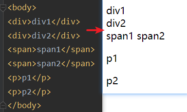

# HTML

>Hyper Text Markup Language（超文本标记语言）简写：HTML HTML通过标签来标记要显示的网页中的各个部分。网页文件本身是一种文本文件，通过在文本文件中添加标记符，可以告诉浏览器如何显示其中的内容（如：文字如何处理，画面如何安排，图片如何显示等）

## 页面介绍

```html
<!DOCTYPE html> <!-- 约束，声明该文档为html文档-->
<html lang="en"> <!--html标签表示html的开始  lang="en"表示英文 lang="zh_CN表示中文-->

    <!--html标签中一般分为两部分，分别是：head和body-->
    <head> <!--表示头部信息，一般包含三部分内容，title标签，css样式，js代码-->
        <meta charset="UTF-8"> <!--表示当前页面使用UTF-8字符集-->
        <title>标题</title> <!--表示标题-->
    </head>
    <body> <!--body标签是整个html页面显示的主体内容-->
        hello
    </body>
</html>
```

## 标签介绍

1. 标签的格式：
   - <标签名>封装的数据</标签名>
2. 标签名大小写不敏感。
3. 标签拥有自己的属性。
   - 分为基本属性：bgcolor="red”   可以修改简单的样式效果
   - 事件属性：onclick="alert(' 你好! ');"   可以直接设置事件响应后的代码
4. 标签又分为，单标签和双标签。
   - 单标签格式：<标签名/>
   - 双标签格式：<标签名>...封装的数据...</标签名>

## 字符实体


- 通常情况下，HTML会裁掉文档中的空格。假如你在文档中连续输入10个空格，那么HTML会去掉其中的9个。
  如果使用&nbsp；就可以在文档中增加空除，俗称牛逼的空格(nb的blankspace)

## 超链接a

```html
<body>
    <!--a标签是超链接
href属性设置连接的地址
target属性设置服个目标进行跳转
_self表示当前页面(默认值)
_blank表示打开新页面来进行路转
-->
    <a href="http://www.baidu.com" target="_self">百度</a><br/>
    <a href="http://www.baidu.com" target="_blank">百度</a>
</body>
```

## 列表标签ul/ol

```html
<body>
    <!--
ul是无序列表 un_order_list
ol是有序列表 order_list
type属性可以修改列表项前面的符号
li是列表项 list_item
-->
    <ul type="none">
        <li>派大星</li>
        <li>海绵宝宝</li>
        <li>蟹老板</li>
    </ul>
    <ol>
        <li>派大星</li>
        <li>海绵宝宝</li>
        <li>蟹老板</li>
    </ol>
</body>
```

## img标签

- 在JavaSE中路径也分为相对路径和绝对路径。
  - 相对路径：从工程名开始
  - 绝对路径：盘符：/目录/文件名
- 在Web中路径分为相对路径和绝对路径两种相对路径：
- 相对路径：

>- . 表示，当前文件所在的目录
> - .. 表示，当前文件所在的上一级目录
>- 文件名表示，当前文件所在目录的文件，相当于./文件名，而./可以省略

- 绝对路径：

>- 正确格式是：http://ip:port/工程名/资源路径
>- 错误格式：盘符：/目录/文件名

```HTML
<!--
img标签是图片标签，用来显示图片
src属性可以设置图片的路径
width属性设置图片的宽度
height属件设置图片的高度
border属性设置图片边框大小
alt属性设置当指定路径能不到图片时，用来代替显示的文本内容
-->
<body>
    
</body>
```

## 表格标签table

```html
<!--
table 标签是表格标签
border设置表格标签
width 设置表格宽度
height 设置表格高度
align 设置表格相对于页面的对齐方式
cellspacing 设置单元格间距

tr是行标签
th是表头标签
td是单元格标签 colspan跨行 rowspan跨列
align设置单元格文本对齐方式
b是加粗标签
-->
```

## 表单标签form

```html
<!--form标签就是表单
input type=text是文件输入框   value设置默认显示内容
input type=password 是密码输入框   value设置默认显示内容
input type=radio是单选框 checked="checked"表示默认选中 想要实现单选功能,每组单选表单控件的名称必须保持一致,其中的value为真正要提交给处理页的内容
input type=checkbox是复选框 checked="checked”表示默认选中 复选框的内容可以同时选择多个,但是要求每组复选框的名称name必须保持相同
input type=reset 是重置按钮,将表单内容恢复到默认显示   value属性修改按钮上的文本
input type=submit 是提交按钮,当用户输入完数据之后通过此按钮可以直接将表单提交到<from>元素的action属性所指定的页面   value属性修改按钮上的文本
input type=button是按钮   value属性修改按钮上的文本
input type=file是文件上传域
input type=hidden是隐藏域 当我们要发送某些信息，而这些信息，不需要用户参与，就可以使用隐藏域（提交的时候同时发送给服务器）

select标签是下拉列表框
option标签是下拉列表框中的选项   elected="selected“设置默认选中

textarea表示多行文本输入框（起始标签和结束标签中的内容是默认值
rows属性设置可以显示几行的高度
co1s属性设置每行可以显示几个字符宽度
-->
```

```html
<!--form标签是表单标签
action属性设置提交的服务器地址
method属性设置提交的方式GET(默认值)或POST表单提交的时候，数据没有发送给服务器的三种情况：
  1.表单项没有name属性值
  2.单选、复选（下拉列表中的option标签）都需要添加value属性，以便发送给服务器
  3.表单项不在提交的form标签中
-->
```

```html
<!--
GET请求的特点是：
  1、浏览器地址栏中的地址是：action属性[+?+请求参数]
     请求参数的格式是：name1=value1&name2=value2
  2、不安全
  3、它有数据长度的限制
POST请求的特点是：
  1、浏览器地址栏中只有action属性值
  2、相对于GET请求要安全
  3、理论上没有数据长度的限制
-->
```

## 其他标签

```html
<!--
div标签 默认独占一行
span标签 它的长度是封装数据的长度
p段落标签 默认会在段落的上方或下方各空出一行来（如果已有就不再空）
-->
```



# CSS

>CSS是[层叠样式表单」。是用于（增强）控制网页样式并允许将样式信息与网页内容分离的一种标记性语言。

## 语法规则


- 选择器：浏览器根据“选择器”决定受CSS样式影响的HTML元素（标签）

- 属性（property）是你要改变的样式名，并且每个属性都有一个值。属性和值被冒号分开，并由花括号包围，这样就组成了一个完整的样式声明（declaration）

  - 例如：

  ```css
  p{
      color:blue
  }
  ```

- 多个声明：如果要定义不止一个声明，则需要用分号将每个声明分开。虽然最后一条声明的最后可以不加分号（但尽量在每条声明的末尾都加上分号）

## CSS与HTML结合 

- **第一种：在标签的style 属性上设置"key:value value;"，修改标签样式。**

```html
<body>
    <div style="border: 1px solid red">div1</div>
    <div style="border: 1px solid red">div2</div>
    <span style="border: 1px solid red">span1</span>
    <span style="border: 1px solid red">span2</span>
</body>
```

- 问题：这种方式的缺点：

>1. 如果标签多了。样式多了。代码量非常庞大
>2. 可读性非常差
>3. CSS代码没什么复用性

- **第二种：在head标签中，使用style标签来定义各种自己需要的css样式。**

```html
<!DOCTYPE html>
<html lang="en">
    <head>
        <meta charset="UTF-8">
        <title>标题</title>
        <!--style标签专门用来定义css样式代码-->
        <style type="text/css">
            /*css代码注释不同于html代码注释*/
            div{
                border: red 1px solid;
            }
            span{
                border: red 1px solid;
            }
        </style>
    </head>
    <body>
        <!--分别定义两个div、span标签，分别修改每个div标签的样式为：边框1个像素，实线，红色-->
        <div >div1</div>
        <div >div2</div>
        <span >span1</span>
        <span >span2</span>
    </body>
</html>
```

- 问题：这种方式的缺点：

>1. 只能在同一页面内复用代码，不能在多个页面中复用css代码。
>2. 维护起来不方便，实际的项目中会有成千上万的页面，要到每个页面中去修改。工作量太大了。

- **第三种：把css样式写戴一个单独的css文件，再通过link标签引入即可复用。**

```html
<!DOCTYPE html>
<html lang="en">
<head>
    <meta charset="UTF-8">
    <title>标题</title>
    <!--link标签专门用来引入CSS样式代码,rel和type属性值是固定写法,href是需要引入的css文件路径-->
    <link rel="stylesheet" type="text/css" href="1.css"/>
</head>
<body>
<!--分别定义两个div、span标签，分别修改每个div标签的样式为：边框1个像素，实线，红色-->
<div >div1</div>
<div >div2</div>
<span >span1</span>
<span >span2</span>
</body>
</html>
```

- 1.css文件

```css
div{
    border: red 1px solid;
}
span{
    border: aqua 1px solid;
}
```

## CSS选择器

- 标签名选择器

- 标签名选择器的格式是：

  ```html
  标签名{
  属性:值
  };
  ```

- 标签名选择器，可以决定哪些标签被动的使用这个样式。

```html
<!DOCTYPE html>
<html lang="en">
    <head>
        <meta charset="UTF-8">
        <title>css选择器</title>
        <style>
            div{
                border: yellow 1px solid;
                font-size: 30px;
                color: blue;
            }
            span{
                border: blue 1px dashed;
                font-size: 20px;
                color: yellow;
            }
        </style>
    </head>
    <body>
        <!--在所有div标签上修改字体颜色为蓝色，字体大小30个像素。边框为1像素 黄色实线。
并且修改所有span标签的字体颜色为黄色，字体大小20个像素。边框为1像素 蓝色虚线-->
        <div >div1</div>
        <div >div2</div>
        <span >span1</span>
        <span >span2</span>
    </body>
</html>
```

## id选择器

- id选择器的格式是：

- ```css 
  #id属性值
  {
    属性:值;
  }
  ```

- id 选择器，可以让我们通过id属性选择性的去使用这个样式。

```html
<!DOCTYPE html>
<html lang="en">
    <head>
        <meta charset="UTF-8">
        <title>css选择器</title>
        <style>
            #div1{
                color: blue;
                font-size: 30px;
                border: 1px yellow solid;
            }
            #div2{
                color: red;
                font-size: 20px;
                /*dotted 点线*/
                border: 5px blue dotted;
            }
        </style>
    </head>
    <body>
<!--分别定义两个div标签
第一个div 标签定义id为idv1，然后根据id属性定义css样式修改字体颜色为蓝色，字体大小30个像素。边框为1像素黄色实线。
第二个div 标签定义id为idv2，然后根据id属性定义css样式修改的字体颜色为红色，字体大小20个像素。边框为5像素蓝色点线。
-->
        <div id="div1">div标签1</div>
        <div id="div2">div标签2</div>
    </body>
</html>
```

## class选择器(类选择器)

- class类型选择器的格式是：

- ```html
  .class属性值
  {
  属性:值;
  }
  ```

- class 类型选择器，可以通过class属性有效的选择性地去使用这个样式

```html
<!DOCTYPE html>
<html lang="en">
    <head>
        <meta charset="UTF-8">
        <title>css选择器</title>
        <style>
            .class1{
                color: blue;
                font-size: 30px;
                border: 1px yellow solid;
            }
            .class2{
                color: gray;
                font-size: 26px;
                /*dotted 点线*/
                border: 5px red solid;
            }
        </style>
    </head>
    <body>
        <!--分别定义两个div标签
修改class属性值为class1的span或div标签，字体颜色为蓝色，字体大小30个像素。边框为1像素黄色实线。
修改class属性值为class2的div标签，字体颜色为灰色，字体大小26个像素。边框为1像素红色实线。
-->
        <div class="class1">div标签1</div>
        <div class="class2">div标签2</div>
    </body>
</html>
```

## 组合选择器

- 组合选择器的格式是：

- ```css
  选择器1，选择器2，选择器n
  {
  属性:值;
  }
  ```

- 组合选择器可以让多个选择器共用同一个css代码。

```html
<!DOCTYPE html>
<html lang="en">
    <head>
        <meta charset="UTF-8">
        <title>css选择器</title>
        <style>
            .class1,#id1{
                color: blue;
                font-size: 30px;
                border: 1px yellow solid;
            }
        </style>
    </head>
    <body>
        <div class="class1">div标签1</div>
        <div id="id1">div标签2</div>
    </body>
</html>
```

# JavaScript

- Javascript语言诞生主要是完成页面的数据验证。因此它运行在客户端，需要运行浏览器来解析执行Javascript代码。
- JS是Netscape 网景公司的产品，最早取名为Livescript；为了吸引更多java程序员。更名为Javascript。
- JS是弱类型，Java是强类型。

>- 弱类型就是类型可变
>- 强类型，就是定义变量的时候。类型已确定。而且不可变

- 特点：

>1. 交互性（它可以做的就是信息的动态交互）
>2. 安全性（不允许直接访问本地硬盘）
>3. 跨平台性（只要是可以解释JS的浏览器都可以执行，和平台无关）

## JS和HTML结合

- 第一种方式：只需要在head标签中，或者在body标签中，使用script 标签来书写Javascript代码

```HTML
<!DOCTYPE html>
<html lang="en">
    <head>
        <meta charset="UTF-8">
        <title>JS</title>
        <!--固定写法-->
        <script type="text/javascript">
            alert("hello world")
        </script>
    </head>
    <body>
    </body>
</html>
```

- 第二种方式：使用script 标签引入单独的JavaScript代码文件
  - 先File---new---JavaScript File创建一个.js文件，在该文件中编写JS代码

```html
<head>
    <meta charset="UTF-8">
    <title>JS</title>
    <!--现在需要使用script引入外部的js文件来执行src属性专门用来引入js文件路径（可以是相对路径，也可以是绝对路径）script标签可以用来定义js代码，也可以用来引入js文件但是，两个功能二选一使用。不能同时使用两个功能-->
    <script type="text/javascript" src="1.js"></script>
</head>
```

## 变量

- 什么是变量？变量是可以存放某些值的内存的命名。
- JavaScript的变量类型：
- 数值类型：

>- number字符串类型：
>- string对象类型：
>- object布尔类型：
>- boolean函数类型：

- function JavaScript里特殊的值：

>- undefined未定义，所有s变量未赋于初始值的时候，默认值都是undefined
>- null空值
>- NAN全称是：Not a Number。非数字。非数值

## 关系运算

- 等于：==   等于是简单的做字面值的比较
- 全等于：===   除了做字面值的比较之外，还会比较两个变量的数据类型

```javascript
<script type="text/javascript">
    const a = 1;
    const b = "1";
    alert(a == b); //true
    alert(a === b); //flase
</script>
```

## 逻辑运算

- 且运算：&&

>- 第一种：当表达式全为真的时候。返回最后一个表达式的值。
>- 第二种：当表达式中，有一个为假的时候。返回第一个为假的表达式的值

- 或运算：||

>- 第一种情况：当表达式全为假时，返回最后一个表达式的值
>- 第二种情况：只要有一个表达式为真。就会把回第一个为真的表达式的值

- 取反运算：！
- 在Javascript 语言中，所有的变量，都可以做为一个boolean类型的变量去使用。
  - 0、null、undefined、""（空串）都认为是false；

## 数组

```javascript
<script type="text/javascript">
     const arr = [];//0,空数组定义
     const arr1 = [true,"water",1,null];//数组的静态初始化
     alert(arr.length);
     arr[2] = 2;
     alert(arr.length);//3
     arr[1]="apple";

     //javaScript语言中的数细，只要我们通过数组下标厨值，那么最大的下标值，就会自动的给数组微扩容操作。
     alert(arr[8]); //undefined
     alert(arr.length);//3

    //数组的遍历
    for (let i = 0; i < arr.length; i++){
        alert(arr[i]);
    }
</script>
```

## 函数

- **函数的第一种定义方式**

```javascript
<script type="text/javascript">
    //1.无参函数的定义
    function fun1() {
        alert("这是一个无参函数")
    }

    //函数调用
    fun1();

    //2.有参函数的定义
    function fun2(a, b) {
        alert("有参函数被调用" + "a = " + a + "b = " + b)
    }

    fun2(true, "apple");

    //3.有返回值的函数定义
    function fun3(a, b) {
        return a + b;
    }
    
    alert(fun3(5, 5));
</script>
```

- **函数的第二种定义格式如下**

```javascript
<script type="text/javascript">
    //无参函数的定义
    fun1 = function() {
        alert("这是一个无参函数")
    };
    //函数调用
    fun1();

    //有参函数的定义
    fun2 = function(a, b) {
        alert("有参函数被调用" + "a = " + a + "b = " + b)
    };
    fun2(true, "apple");

    //有返回值的函数定义
    fun3 = function(a, b) {
        return a + b;
    };
    alert(fun3(5, 5));
</script>
```

- **函数的arguments隐形参数（只在function函数内）**

>- 就是在function函数中不需要定义，但却可以直接用来获取所有参数的变量。我们管它叫隐形参数
>- 隐形参数特别像Java基础的可变长参数一样。public void fun（Object...args）
>- 可变长参数其实是一个数组
>- 那么JS中的隐形参数也跟Java的可变长参数一样。操作类似数组

```javascript
 <script type="text/javascript">
      fun1 = function () {
          alert(arguments.length); //3
      };
      fun1(1,"apple",true);

      fun2 = function (num1,num2) {
          let result = 0;
          for (let i = 0; i < arguments.length; i++) {
              result += arguments[i];
          }
          return result;
      };
      alert(fun2(1,2,3,4,5,6,7,8,9)); //形参设置的是两个也可以传多个
    </script>
</head>
```

## 自定义对象

- Object的形式

```javascript
<script type="text/javascript">
    object = new Object();//定义一个空对象,等同于object = {}
    object.name = "对象名";
    object.age = 20;
    object.height = 180;
    object.fun = function(){
        alert("对象中定义的函数")
    };
    alert(typeof(object)); //判断类型:Object
    alert(object.name); //调用对象属性
    object.fun(); //调用对象的函数
</script>
```

- 花括号的形式

```javascript
<script type="text/javascript">
   penson = { // ------空对象
       name : "蔡徐坤", //属性名 : 值 ------定义一个属性
       age : 25,
       height : 180,
       fun : function () { //函数名 : 函数体 ------定义一个函数
           alert("坤坤打篮球好帅")
       }
   };
   //访问对象内部属性和方法
   alert(penson.name);
   penson.fun();
</script>
```

## JS事件

- 什么是事件？事件是电脑输入设备与页面进行交互的响应。我们称之为事件。
- **常用的事件：**

>- onload 加载完成事件：
>   - 页面加载完成之后，常用于做页面js代码初始化操作；
>- onclick 单击事件：
>   - 常用于按钮的点击响应操作；
>- onblur 失去焦点事件：
>   - 常用于输入框失去焦点后验证其输入内容是否合法；
>- onchange 内容发生改变事件：
>   - 常用于下拉列表和输入框内容发生改变后操作；
>- onsubmit 表单提交事件：
>   - 常用于表单提交前，验证所有表单项是否合法。

- 事件的注册又分为静态注册和动态注册两种：
- **什么是事件的注册（绑定）？**
  - 其实就是告诉浏览器，当事件响应后要执行哪些操作代码，叫事件注册或事件绑定。

>- 静态注册事件：通过html标签的事件属性直接赋于事件响应后的代码，这种方式我们叫静态注册。
>- 动态注册事件：是指先通过 js 代码得到标签的dom对象，然后再通过dom对象.事件名=function() {} 这种形式赋于事件响应后的代码，叫动态注册。
>  - 动态注册基本步骤：
>    1. 获取标签对象
>    2. 标签对象事件名=fucntion(){}

## onLoad事件

- 静态事件

```html
<head>
    <meta charset="UTF-8">
    <title>JS</title>
    <script type="text/javascript">
        loadFun = function () {
            alert("静态事件方法")
        }
    </script>
</head>
<!--静态注册onload真件，onload事件是浏览器解析完页面之后就会自动触发的真件-->
<body onload="loadFun()">
</body>
```

- 动态事件

```javascript
<head>
    <meta charset="UTF-8">
        <title>JS</title>
<script type="text/javascript">
    //固定写法
    window.onload = function () {
    alert("动态注册事件")
}
</script>
</head>
<body>
    </body>
```

## onClick事件

- 静态注册

```JavaScript
<head>
    <meta charset="UTF-8">
        <title>JS</title>
<script type="text/javascript">
    clickFun = function () {
    alert("静态注册onClick事件")
}
</script>
</head>
<body>
    <button onclick="clickFun()">按钮</button>
</body>
```

- 动态注册

```javascript
<head>
    <meta charset="UTF-8">
    <title>JS</title>
    <script type="text/javascript">
        //固定写法:动态注册onClick事件
      window.onload = function () {
          //1.获取标签对象
          /*
          document 是JavaScript语言提供的一个对录（文档）
          get获取
          element元素（就是标签）
          By通过...由...经...
          Id      id属件
          getElementById      通过id属性获取标签对象
          */
          let idObj = document.getElementById("btn");
          //alert(idObj); //[object HTMLButtonElement]
          //2.标签对象.事件名 = function(){}
          idObj.onclick = function () {
              alert("动态注册onClick事件");
          }
      }

    </script>
</head>
<body>
<button id="btn">按钮</button>
</body>
```

## onBulr事件

- 静态注册

```JavaScript
<head>
    <meta charset="UTF-8">
    <title>JS</title>
    <script type="text/javascript">
        blurFun = function () {
            //console是控制台对象,由javaScript提供，用于向浏览器的控制台打印信息，通常用于测试
            console.log("静态注册失去焦点事件")
        }
    </script>
</head>
<body>
输入用户名：<input onblur="blurFun()">
</body>
```

- 动态注册

```javascript
<head>
    <meta charset="UTF-8">
    <title>JS</title>
    <script type="text/javascript">
        window.onload = function () {
            let id = document.getElementById("username");
            id.onblur = function () {
                console.log("动态注册失去焦点事件")
            };
        }
    </script>
</head>
<body>
输入用户名：<input id="username">
</body>
```

## onChange事件

- 静态注册

```html
<head>
    <meta charset="UTF-8">
    <title>JS</title>
    <script type="text/javascript">
       changeFun = function () {
           alert("爱好已经改变")
       }
    </script>
</head>
<body>
<select onchange="changeFun()">
    <option>--爱好--</option>
    <option>篮球</option>
    <option>足球</option>
    <option>排球</option>
</select>
</body>
```

- 动态注册

```javascript
<head>
    <meta charset="UTF-8">
    <title>JS</title>
    <script type="text/javascript">
       window.onload = function () {
           let id = document.getElementById("change");
           id.onchange = function () {
               alert("爱好已经改变")
           }
       }
    </script>
</head>
<body>
<select id="change">
    <option>--爱好--</option>
    <option>篮球</option>
    <option>足球</option>
    <option>排球</option>
</select>
</body>
```

## onSubmit事件

- 静态注册

```javascript
<head>
    <meta charset="UTF-8">
    <title>JS</title>
    <script type="text/javascript">
        submitFun  = function () {
            alert("发现表单错误");
            return false;
        }
    </script>
</head>
<body>
<!--onsubmit返回false的时候表单就不会提交-->
<form action="http://localhost:8080" method="get" onsubmit="return submitFun()">
    <!--输入结果按回车就会自动提交表单-->
    用户名：<input type="text" value="静态注册">
</form>
</body>
```

- 动态注册

```javascript
<head>
    <meta charset="UTF-8">
    <title>JS</title>
    <script type="text/javascript">
        window.onload = function () {
            let id = document.getElementById("submit");
            id.onsubmit = function () {
                alert("动态注册表单提交事件")
            };
            return true;
        }
    </script>
</head>
<body>
<!--onsubmit返回false的时候表单就不会提交-->
<form action="http://localhost:8080" method="get" id="submit">
    <!--输入结果按回车就会自动提交表单-->
    用户名：<input type="text" value="动态注册">
</form>
</body>
```

## DOM模型

- DOM全称是bocument Object Model 文档对象模型
- 大白话就是把文档中的标签，属性，文本，转换成为对象来管理。
- 那么它们是如何实现把标签，属性，文本转换成为对象来管理呢？


- **Document对象的理解：**

>- 第一点：Document 它管理了所有的HTML文档内容。
>- 第二点：document它是一种树结构的文档。有层级关系。
>- 第三点：它让我们把所有的标签都对象化
>- 第四点：我们可以通过document访间所有的标签对象。

- 举例：有一个人有年龄：18岁，性别：女，名字：张某某我们要把这个人的信息对象化怎么办！

```java
Class Person{
    private int age;
    private String sex;
    private Strirk name;
}
```

- 那么html标签要对象化怎么办？

```html
<body>
    <div id="div1">div标签</div>
</body>
```

- 模拟对象化，相当于：

```java
class Dom{
    private String id;//id 属性
    private String tagName;//表示标签名
    private Dom parentNode;//父亲
    private List<Dom>children;//孩子结点
    private String innerHTML;//起始标签和结束标签中间的内容
}
```

### Document对象中的常用方法

```javascript
document.getElementById (elementId) //通过标签的id属性查找标签dom对象，elementId是标签的id属性
document.getElementsByName (elementName) //通过标签的 name 属性查找标签dom对象 elementName 标签的name属性值
document.getElementsByTagName (tagname) //通过标签名查找标签dom对象,tagname是标签名
document.createElement (tagName) //通过给定的标签名，创建一个标签对象。tagName是要创建的标签名
```

**注意：**

>- document 对象的三个查询方法，如果有id属性，优先使用getElementById方法来进行查询如果没有id属性，则优先使用getElementsByName 方法来进行查询如果id属性和name属性都没有最后再按标签名查 getElementsByTagName
>- 以上三个方法，一定要在页面加载完成之后执行，才能查询到标签对象

### getElementById

- 返回带有指定值的 ID 属性的元素。如果不存在这样的元素，则返回 null。

```html
<!DOCTYPE html>
<html lang="en">
<head>
    <meta charset="UTF-8">
    <title>JS</title>
   <script type="text/javascript">
       /*当用户点击了校验按钮，要获取输出框中的内容。然后验证其是否合法。
         验证的规则则是：必须由字母，数字。下划线组成。并且长度是5到12位。*/
       
       const examFun = function () {
           //1.当我们要操作一个标签的时候，一定要先获取这个标签对象。
           let username = document.getElementById("username");
           //alert(username); //[object HTMLInputElement]
           let value = username.value;
           ////2.验证字符串是否符合某个规则，需要使用正则表达式按术
           let rule = /^\w{5,12}$/;
           let nameCheck = document.getElementById("usernameCheck");
           //test()方法用于测试某个字符串，是不是匹配制定舰则，匹配就返回true。不匹配就返回false.
           if (rule.test(value)) {
               //1.弹窗的方式：不推荐使用
               //alert("用户名合法");
               
               //2.在输入框后进行文字提示
               // nameCheck.innerHTML = "用户名合法";
               // nameCheck.style.color = "green";
               
               //3.在输入框后进行图片提示
               nameCheck.innerHTML = "";
           } else {
               //alert("用户名不合法");
               
               // nameCheck.innerHTML = "用户名不合法";
               // nameCheck.style.color = "red";
               nameCheck.innerHTML = "";
           }
       };
   </script>
</head>
<body>
请输入用户名：<input type="text" id="username" value="lkl">
<span id="usernameCheck"></span>
<button onclick="examFun()">校验</button>
</body>
</html>
```


### getElementsByName

- 返回带有指定名称的所有元素的 NodeList。

```html
<!DOCTYPE html>
<html lang="en">
    <head>
        <meta charset="UTF-8">
        <title>JS</title>
        <script type="text/javascript">
            //全选
            function chooseAll() {
                //1.获得dom对象的集合
                let name = document.getElementsByName("hobby");
                for (let i = 0; i < name.length; i++) {
                    //2.对dom对象的属性值进行判断并修改
                    if (!name[i].checked) {
                        //checked表示复选框的选中状态。如果送中是true，不选中是
                        //false checked 这个属性可读，可写
                        name[i].checked = true;
                    }
                }
            }

            //全不选
            function chooseNone() {
                let name = document.getElementsByName("hobby");
                for (let i = 0; i < name.length; i++) {
                    if (name[i].checked) {
                        name[i].checked = false;
                    }
                }
            }

            //反选
            function chooseReverse() {
                let name = document.getElementsByName("hobby");
                for (let i = 0; i < name.length; i++) {
                    name[i].checked = !name[i].checked;
                }
            }

        </script>
    </head>
    <body>
        爱好:<input type="checkbox" name="hobby">java
        <input type="checkbox" name="hobby">c++
        <input type="checkbox" name="hobby">javascript<br/>
        <button onclick="chooseAll()">全选</button>
        <button onclick="chooseNone()">全不选</button>
        <button onclick="chooseReverse()">反选</button>
    </body>
</html>
```


### getElementsByTagName

- 返回带有指定名称的所有元素的 NodeList。

```html
<script type="text/javascript">
    //document.getELementsBy TagName("input")；
    //是按照省定标签名来进行查询并返回集合
    //这个集合的操作跟数组一样
    //集合中都是dom对象
    //集合中元素顺序是他们在html页面中从上到下的顺序。
    
    function chooseAll() { //全选
        let byTagName = document.getElementsByTagName("input");
        for (let i = 0; i < byTagName.length; i++) {
            if (!byTagName[i].checked) {
                byTagName[i].checked = true;
            }
        }
    }
</script>
```

### 节点的常用属性和方法

- 节点就是标签对象
- 方法：通过具体的元素节点调用

```javascript
getElementsByTagName() //获取当前节点的指定标签名孩子节点
appendChild (oChildNode) //可以添加一个子节点，oChildNode是要添加的孩子节点
```

- 属性

```javascript
childNodes //属性，获取当前节点的所有子节点
firstChild //属性，获取当前节点的第一个子节点
lastChild //属性，获取当前节点的最后一个子节点
parentNode //属性，获取当前节点的父节点
nextSibling //属性，获取当前节点的下一个节点
previousSibling //属性，获取当前节点的上一个节点
className //用于获取或设置标签的class属性值
innerHTML //属性，表示获取/设置起始标签和结束标签中的内容
innerText //属性，表示获取/设置起始标签和结束标签中的文本
```

