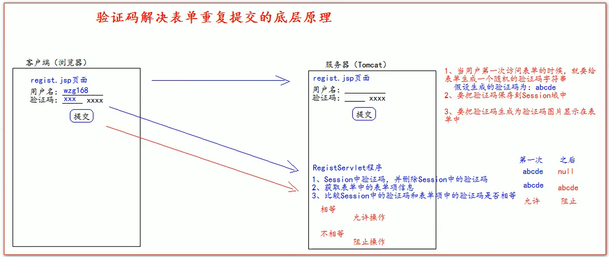

# 验证码

## 解决表单重复提交

- 表单重复提交有三种常见的情况：
  1. 提交完表单。服务器使用请求转来进行页面跳转。这个时候，用户按下功能键 F5，就会发起最后一次的请求。 造成表单重复提交问题。解决方法：使用重定向来进行跳转
  2. 用户正常提交服务器，但是由于网络延迟等原因，迟迟未收到服务器的响应，这个时候，用户以为提交失败， 就会着急，然后多点了几次提交操作，也会造成表单重复提交
  3. 用户正常提交服务器。服务器也没有延迟，但是提交完成后，用户回退浏览器。重新提交。也会造成表单重复 提交
- 第2种和第3种情况都需要验证码来解决



## 谷歌 kaptcha 图片验证码的使用

- 谷歌验证码 kaptcha 使用步骤如下： 
  1. 导入谷歌验证码的 jar 包 kaptcha-2.3.2.jar
  2. 在 web.xml 中去配置用于生成验证码的 Servlet 程序

```xml
<servlet>
    <servlet-name>KaptchaServlet</servlet-name>
    <servlet-class>com.google.code.kaptcha.servlet.KaptchaServlet</servlet-class>
</servlet>
<servlet-mapping>
    <servlet-name>KaptchaServlet</servlet-name>
    <url-pattern>/kaptcha.jpg</url-pattern>
</servlet-mapping>
```

3. 在表单中使用 img 标签去显示验证码图片并使用它

```jsp
<body>
<form action="http://localhost:8080/code/loginServlet" method="get">
  用户名<input type="text" name="username">
  验证码<input type="text" name="code">
  
  <input type="submit" value="登录">
</form>
</body>
```

4. 在服务器获取谷歌生成的验证码和客户端发送过来的验证码比较使用

```java
public class LoginServlet extends HttpServlet {
    @Override
    protected void doGet(HttpServletRequest req, HttpServletResponse resp) throws ServletException, IOException {
        //获取验证码
        String code = (String) req.getSession().getAttribute(KAPTCHA_SESSION_KEY);
        //立即删除验证码
        req.getSession().removeAttribute(KAPTCHA_SESSION_KEY);
        String userCode = req.getParameter("code");

        //主要对验证码进行测试,不需要用户名信息!!!
        if (userCode != null && userCode.equalsIgnoreCase(code)){
            System.out.println("登录成功");
            //跳转到另一个页面
            resp.sendRedirect(req.getContextPath()+"/ok.jsp");
        }else {
            System.out.println("登录失败");
            //跳回主页
            resp.sendRedirect(req.getContextPath());
        }
    }
}
```

5. 切换验证码：引入jquery文件为验证码图片设置点击事件

```jsp
<title>$Title$</title>
<script type="text/javascript" src="script/jquery-1.7.2.js"></script>
<script type="text/javascript">
  $(function () {
    $("#code_img").click(function () {
      this.src = "http://localhost:8080/code/kaptcha.jpg";
    })
  })
</script>
```