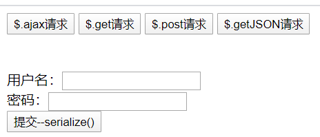

# json

>- JSON (JavaScript Object Notation) 是一种轻量级的数据交换格式。 易于人阅读和编写。同时也易于机器解析 和生成
>- 它基于 JavaScript Programming Language, Standard ECMA-262 3rd Edition - December 1999 的一 个子集
>- JSON 采用完全独立于语言的文本格式，但是也使用了类似于 C 语言家族的习惯（包括 C, C++, C#, Java, JavaScript, Perl, Python 等）
>- 这些特性使 JSON 成为理想的数据交换语言

## JSON 对象定义

- 在标准的 json 格式中，json 对象由括号括起来，对象中的属性也就是 json 的 key 是一个字符串，所以一定要使用 双引号引起来，每组 key 之间使用逗号进行分隔

```html
<script type="text/javascript">
    // json的定义
    let jsonObj = {
        "key1": 520,
        "key2": "apple",
        "key3": true,
        "key4": ["batman", 20, false],
        "key5": {
            "key5_1": 20,
            "key5_2": "value"
        },
        "key6": [
            {
                "key6_1": 20,
                "key6_2": "value1"
            },
            {
                "key_3": 30,
                "key_4": "value2"
            }]
    };
    // json的访问
    alert(typeof(jsonObj)); //object ===> json就是一个对象
    alert(jsonObj.key1);    //520    ===>访问json对象中key1属性的值
    alert(jsonObj.key2);    //apple
    alert(jsonObj.key3);    //true
    alert(jsonObj.key4);    //batman,20,false  ===>[]得到的是一个数组
    alert(jsonObj.key5);    //[object Object]  ===>{}得到的是一个对象
    alert(jsonObj.key6);    //[object Object],[object Object]   ===>[{},{}]得到的是一个对象数组
</script>
```

## JSON的访问

```html
<script type="text/javascript">
    //json定义如上---------------------省略
   
    // json的访问
    alert(typeof(jsonObj)); //object ===> json就是一个对象
    alert(jsonObj.key1);    //520    ===>访问json对象中key1属性的值
    alert(jsonObj.key2);    //apple
    alert(jsonObj.key3);    //true
    alert(jsonObj.key4);    //batman,20,false  ===>[]得到的是一个数组
    alert(jsonObj.key5);    //[object Object]  ===>{}得到的是一个对象
    alert(jsonObj.key6);    //[object Object],[object Object]   ===>[{},{}]得到的是一个对象数组

    //遍历数组
    for (let i = 0; i < jsonObj.key4.length; i++) {
        alert(jsonObj.key4[i]); //遍历输出batman, 20, false
    }
    //访问对象属性
    alert(jsonObj.key5.key5_1); //20
    alert(jsonObj.key5.key5_2); //value
    //访问对象数组
    for (let i = 0; i < jsonObj.key6.length; i++) {
        alert(jsonObj.key6[i]); //遍历输出[object Object],[object Object]
    }
</script>
```

## json 的两个常用方法

- json 的存在有两种形式

>-  一种是：对象的形式存在，我们叫它 json 对象
>- 一种是：字符串的形式存在，我们叫它 json 字符串 

- 一般我们要操作 json 中的数据的时候，需要 json 对象的格式
- 一般我们要在客户端和服务器之间进行数据交换的时候，使用 json 字符串

>- JSON.stringify() 把 json 对象转换成为 json 字符串
>- JSON.parse() 把 json 字符串转换成为 json 对象

```html
<script type="text/javascript">
    //json定义如上---------------------省略
    
    // json对象转字符串
    let jsonObjString = JSON.stringify(jsonObj);
    alert(jsonObjString); //弹出字符串
    // json字符串转json对象
    let jsonObj2 = JSON.parse(jsonObjString);
    alert(jsonObj2.key1); //520
    alert(jsonObj2.key2); //apple
</script>
```


## JSON 在 java 中的使用

- 导入谷歌提供的gson-2.2.4.jar包
- 测试类

```java
public class Person {
    private Integer age;
    private String name;
    
    //有参、无参、getter/setter、toString方法---------------省略
}
```

### JavaBean 和 json 的互转

```java
public class JSONTest {
    @Test
    public void test1(){
        Person batman = new Person(20, "batman");
        //1.创建 Gson 实例
        Gson gson = new Gson();
        //toJson 方法可以把java对象转换为json字符串
        String s = gson.toJson(batman);
        System.out.println(s); //{"age":20,"name":"batman"}

        //fromJson 方法可以把json字符串转换为 Java 对象实例
        Person person = gson.fromJson(s, Person.class);
        System.out.println(person); //Person{age=20, name='batman'}
    }
}
```

### List 和 json 的互转

```java
@Test
public void tes2(){
    List<Person> personList = new ArrayList<>();
    personList.add(new Person(20,"BatMan"));
    personList.add(new Person(30,"IronMan"));
    Gson gson = new Gson();
    //把list集合转化为json字符串
    String s = gson.toJson(personList);
    System.out.println(s); //[{"age":20,"name":"BatMan"},{"age":30,"name":"IronMan"}]
}
```

- list转换为json没有问题，但是json转换为list就需要注意

```java
//把json字符串转换为list集合
List<Person> list = gson.fromJson(s, personList.getClass());
System.out.println(list); //[{age=20.0, name=BatMan}, {age=30.0, name=IronMan}]
Person person = list.get(0);
System.out.println(person); //直接报错，类转换异常！！！
```

- 结论：json转换为list不能直接调用formJson(String jsonString,Class<?> class)方法
- 需要另外一个重载函数formJson(String jsonString,Type<?> type)

---

- **方式一：创建一个类继承TypeToken并指定需要转换的泛型即可**

```java
public class PersonList extends TypeToken<ArrayList<Person>> {
}
```

- 使用示例

```java
@Test
public void tes2(){
    List<Person> personList = new ArrayList<>();
    personList.add(new Person(20,"BatMan"));
    personList.add(new Person(30,"IronMan"));
    Gson gson = new Gson();
    //把list集合转化为json字符串
    String s = gson.toJson(personList);
    System.out.println(s); //[{"age":20,"name":"BatMan"},{"age":30,"name":"IronMan"}]

    List<Person> list = gson.fromJson(s, new PersonList().getType());
    System.out.println(list); //[{age=20.0, name=BatMan}, {age=30.0, name=IronMan}]
    Person person = list.get(0);
    System.out.println(person); //Person{age=20, name='BatMan'}

}
```

- 对于方式一如果创建一个新的泛型类型不同的集合就需要创建一个类来继承TypeToken，很麻烦
- **方式二：使用匿名内部类**

```java
List<Person> list = gson.fromJson(s, new TypeToken<ArrayList<Person>>(){}.getType());
System.out.println(list); //[{age=20.0, name=BatMan}, {age=30.0, name=IronMan}]
Person person = list.get(0);
System.out.println(person); //Person{age=20, name='BatMan'}
```

### Map 和 json的互转

- **方式一：**
- 创建一个类继承TypeToken

```java
import com.google.gson.reflect.TypeToken;
import java.util.HashMap;
public class PersonMap extends TypeToken<HashMap<Integer,Person>> {
}
```

- 使用示例

```java
@Test
public void test3() {
    Map<Integer, Person> personMap = new HashMap<>();
    personMap.put(1, new Person(20, "BatMan"));
    personMap.put(2, new Person(30, "IronMan"));
    Gson gson = new Gson();
    String s = gson.toJson(personMap);
    System.out.println(s); //{"1":{"age":20,"name":"BatMan"},"2":{"age":30,"name":"IronMan"}}

    //json字符串转化为map
    Map<Integer, Person> map = gson.fromJson(s, new PersonMap().getType());
    System.out.println(map); //{1=Person{age=20, name='BatMan'}, 2=Person{age=30, name='IronMan'}}
}
```

- **方式二：匿名内部类**

```java
Map<Integer, Person> map = gson.fromJson(s, new TypeToken<HashMap<Integer,Person>>(){}.getType());
System.out.println(map);
```

# AJAX

- AJAX 即“Asynchronous Javascript And XML”（异步 JavaScript 和 XML），是指一种创建交互式网页应用的网页开发 技术
- AJAX 是一种浏览器通过 js 异步发起请求，局部更新页面的技术。
- Ajax 请求的局部更新，浏览器地址栏不会发生变化 局部更新不会舍弃原来页面的内容

- 测试页面

```html
<!DOCTYPE html>
<html lang="en">
<head>
    <meta charset="UTF-8">
    <title>Title</title>
    <script type="text/javascript" src="script/jquery-1.7.2.js"></script>
    <script type="text/javascript">
    //...................下面详解.......................
    </script>
</head>
<body>
<div>
    <button id="ajaxBtn">$.ajax请求</button>
    <button id="getBtn">$.get请求</button>
    <button id="postBtn">$.post请求</button>
    <button id="getJSONBtn">$.getJSON请求</button>
</div>
<div id="msg"></div>
<br/><br/>
<form id="form01">
    用户名：<input name="username" type="text"/><br/>
    密码：<input name="password" type="password"/><br/>
</form>
<button id="submit">提交--serialize()</button>
</body>
</html>
```



## 原生 AJAX 请求的示例

- servlet程序

```java
public class AjaxServlet extends BaseServlet {

    protected void javaScriptAjax(HttpServletRequest req, HttpServletResponse resp) throws ServletException, IOException {
        System.out.println("访问原始的AJAX");
        Person person = new Person(20,"IronMan");
        Gson gson = new Gson();
        String personJsonString = gson.toJson(person);
        resp.getWriter().write(personJsonString);
        System.out.println("访问结束");
    }
}
```

- AJAX实验程序—ajax.html

```html
<!DOCTYPE html>
<html lang="en">
<head>
    <meta charset="UTF-8">
    <title>Title</title>
    <script type="text/javascript">
        function ajaxRequest() {
            //1.我们首先要创建XMLHttpRequest
         let xmlHttpRequest = new XMLHttpRequest();
            //2.调用open方法设置请求参数
            xmlHttpRequest.open("GET","http://localhost:8080/code/ajaxServlet?action=javaScriptAjax",true);
            //3.在send方法前绑定onreadystatechange事件，处理请求完成后的操作
            xmlHttpRequest.onreadystatechange = function () {
                if (xmlHttpRequest.readyState === 4 && xmlHttpRequest.status === 200){
                    let jsonObj = JSON.parse(xmlHttpRequest.responseText);
                    //把响应的数据显示在页面上
                    document.getElementById("div1").innerHTML = "编号：" + jsonObj.age + ",姓名：" + jsonObj.name;
                }
            };
            //4.调用send方法发送请求
            xmlHttpRequest.send();
        }
    </script>
</head>
<body>
<!--给按钮绑定点击事件-->
<button onclick="ajaxRequest()">ajax request</button>
<div id="div1">
</div>
</body>
</html>
```

## jQuery 中的 AJAX 请求

- 导入jQuery函数文件
- **回传网页程序的信息的使用方法**

```java
public class AjaxServlet extends BaseServlet {

    //填充需要调用的方法名即可
    protected void XXXX(HttpServletRequest req, HttpServletResponse resp) throws ServletException, IOException {
        System.out.println("XXXX 的 AJAX");
        Person person = new Person(20,"IronMan");
        Gson gson = new Gson();
        String personJsonString = gson.toJson(person);
        resp.getWriter().write(personJsonString);
        System.out.println("访问结束");
    }
}
```

- **$.ajax 方法** 

  - url 表示请求的地址 
  - type 表示请求的类型 GET 或 POST 请求 
  - data 表示发送给服务器的数据格式有两种： 

  >1. name=value&name=value 
  >2. {key:value} 

  - success 请求成功，响应的回调函数 
  - dataType 响应的数据类型，常用的数据类型有：

  >- text 表示纯文本 
  >- xml 表示 xml 数据 
  >- json 表示 json 对象

```html
<script type="text/javascript">
    $(function(){
        // ajax请求
        $("#ajaxBtn").click(function(){
            $.ajax({
                url:"http://localhost:8080/code/ajaxServlet",
                data:{action:"jQueryAjax"},
                type:"GET",
                success:function (data) {
                    $("#msg").html("编号:"+data.age+",姓名"+data.name);
                },
                dataType:"json"
            });
        });
</script>
```

- **get 方法和​post 方法** 
  - url 请求的url地址 
  - data 发送的数据 
  - callback 成功的回调函数 
  - type 返回的数据类型

```html
<script type="text/javascript">
    $(function(){
        // ajax--get请求
        $("#getBtn").click(function(){
            $.get("http://localhost:8080/code/ajaxServlet","action=jQueryGet",function (data) {
                $("#msg").html("年龄2:"+data.age+",姓名2:"+data.name);
            },"json");
        });

        // ajax--post请求
        $("#postBtn").click(function(){
            $.get("http://localhost:8080/code/ajaxServlet","action=jQueryPost",function (data) {
                $("#msg").html("年龄3:"+data.age+",姓名3:"+data.name);
            },"json");
        });
</script>
```

- **getJSON 方法** 
  - url 请求的 url 地址 
  - data 发送给服务器的数据 
  - callback 成功的回调函数

```html
<script type="text/javascript">
    $(function(){
        // ajax--getJson请求
        $("#getJSONBtn").click(function(){
            $.getJSON("http://localhost:8080/code/ajaxServlet","action=jQueryPost",function (data) {
                $("#msg").html("年龄4:"+data.age+",姓名4:"+data.name);
            });
        });
</script>
```

- **表单序列化 serialize()**
- serialize()可以把表单中所有表单项的内容都获取到，并以 name=value&name=value 的形式进行拼接

```java
<script type="text/javascript">
    $(function(){
        // ajax请求
        $("#submit").click(function(){
            // 把参数序列化
            $.getJSON("http://localhost:8080/code/ajaxServlet","action=jQuerySerialize&"
                      + $("#form01").serialize()
                      ,function (data) { $("#msg").html(" Serialize 姓名：" + data.age + " , 姓名：" + data.name); });
        });
        </script>
```

- 测试

```java
protected void jQuerySerialize(HttpServletRequest req, HttpServletResponse resp) throws ServletException, IOException {
    System.out.println("jQuerySerialize AJAX");
    String username = req.getParameter("username"); 
    String password = req.getParameter("password"); 
    System.out.println(username);//正常输出
    System.out.println(password);//正常输出
}
```