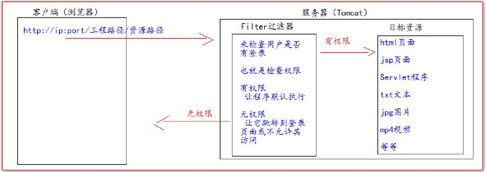
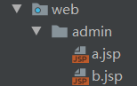
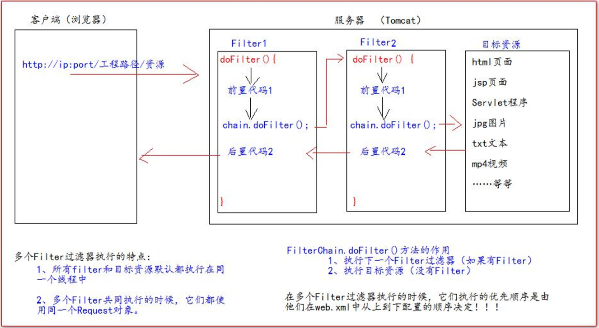
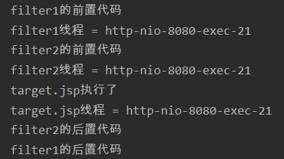
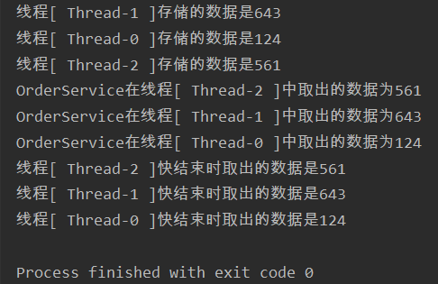

# Filter

- Filter 过滤器它是 JavaWeb 的三大组件之一；三大组件分别是：Servlet 程序、Listener 监听器、Filter 过滤器 
- Filter 过滤器它是 JavaEE 的规范，也就是接口 
- Filter 过滤器它的作用是：拦截请求，过滤响应
- 拦截请求常见的应用场景有： 

>1. 权限检查 
>2. 日记操作 
>3. 事务管理 ……等等

## Filter 的初体验

- 要求：在你的 web 工程下，有一个 admin 目录。这个 admin 目录下的所有资源（html 页面、jpg 图片、jsp 文件、等等）都必须要用户登录之后才允许访问，如果用户直接访问，就拒绝并跳转到登录页面
- 思考：根据之前我们学过内容。我们知道，用户登录之后都会把用户登录的信息保存到 Session 域中。所以要检查用户是否登录，可以判断 Session 中否包含有用户登录的信息即可！！！

```jsp
<body>
<%
  Object user = request.getSession().getAttribute("user");
  if (user == null){
    request.getRequestDispatcher("login.jsp").forward(request, response);
    return; //一般请求转换之后就不需要做其他事情
  }
%>
</body>
```

>**以上做法具有局限性，只能在jsp页面使用，如果遇到html页面或者是图片资源则无能为力！！！**

- **工作流程**



- **Filter 过滤器的使用步骤：** 

>1. 编写一个类去实现 Filter 接口 
>2. 实现过滤方法 doFilter() 
>3. 到 web.xml 中去配置 Filter 的拦截路径

- 创建一个类AdminFilter继承Filter

```java
//---------------------------------实现javax.servlet包下的Filter--------------------------------------
public class AdminFilter implements Filter {
    @Override
    public void init(FilterConfig filterConfig) throws ServletException {

    }

    //专门用户做拦截请求和权限检查
    @Override
    public void doFilter(ServletRequest servletRequest, ServletResponse servletResponse, FilterChain filterChain) throws IOException, ServletException {
        HttpServletRequest request = (HttpServletRequest) servletRequest;
        HttpSession session = request.getSession();
        Object user = session.getAttribute("user");
        //如果等于null 说明用户还没有登陆
        if (user == null){
            request.getRequestDispatcher("/login.jsp").forward(servletRequest, servletResponse);
        }else {
            //让程序继续往下访问用户的目标资源
            filterChain.doFilter(servletRequest, servletResponse);
        }
    }

    @Override
    public void destroy() {
    }
}

```

>- **上面init和destory方法必须重写，即使是空方法，否则服务器部署失败**

- 经过过滤器的过滤作用，如果用户没有登录，就会回到登录页面而无法直接访问/admin/a.jsp页面

- 在web.xml中进行过滤器的配置

```xml
<!--filter用于配置一个Filter过滤器-->
<filter>
    <!--给filter起一个别名-->
    <filter-name>AdminFilter</filter-name>
    <!--配置filter的全类名-->
    <filter-class>filter.AdminFilter</filter-class>
</filter>
<!--filter-mapping标签 配置filter过滤器的拦截路径-->
<filter-mapping>
    <!--表示当前的拦截 路径给哪个filter使用-->
    <filter-name>AdminFilter</filter-name>
    <!--
    配置拦截路径
    / ===> 表示请求地址为 http://localhost:8080/工程路径/ ===> 映射到IDEA的web目录
    /admin/* ===> 表示请求地址为 http://localhost:8080:工程路径/admin/*
    -->
    <url-pattern>/admin/*</url-pattern>
</filter-mapping>
```

- **完整的用户登录**
- 登录页面

```jsp
<body>
<h1>欢迎登陆</h1><br/>
<form action="loginServlet" method="get">
    用户名<input type="text" name="username"><br/>
    密 码<input type="password" name="password"><br/>
    <input type="submit" value="确定">
</form>
</body>
```

- LoginServlet 程序

```java
public class LoginServlet extends HttpServlet {
    protected void doPost(HttpServletRequest request, HttpServletResponse response) throws ServletException, IOException {
    }
    protected void doGet(HttpServletRequest request, HttpServletResponse response) throws ServletException, IOException {
        System.out.println("进入");
        final String username = request.getParameter("username");
        final String password = request.getParameter("password");
        if ("jack".equals(username) && "123".equals(password)){
            request.getSession().setAttribute("username", username);
            //跳转到管理页面,并且将用户名放入session域中,下一次可直接访问管理页面
            request.getRequestDispatcher("/admin/b.jsp").forward(request,response);
        }else {
            request.getRequestDispatcher("/login.jsp").forward(request,response);
        }
    }
}
```

## Filter 的生命周期

- Filter 的生命周期包含几个方法:\：第1、2 步，在 web 工程启动的时候执行（Filter 已经创建）

  1. 构造器方法 
  2. init 初始化方法 
3. doFilter 过滤方法 第 3 步，每次拦截到请求，就会执行
  4. destroy 销毁 第 4 步，停止 web 工程的时候，就会执行（停止 web 工程，也会销毁 Filter 过滤器）

>在IDEA中创建构造器方法服务器不能部署成功？？？

## FilterConfig 类

- FilterConfig 类见名知义，它是 Filter 过滤器的配置文件类。 Tomcat 每次创建 Filter 的时候，也会同时创建一个 
- FilterConfig 类，这里包含了 Filter 配置文件的配置信息
- FilterConfig 类的作用是获取 filter 过滤器的配置内容 

>1. 获取 Filter 的名称 filter-name 的内容
>2. 获取在 Filter 中配置的 init-param 初始化参数 
>3. 获取 ServletContext 对象

```java
public class AdminFilter implements Filter {

    @Override
    public void init(FilterConfig filterConfig){
        System.out.println("初始化方法");

        String filterName = filterConfig.getFilterName();
        String username = filterConfig.getInitParameter("username");
        String password = filterConfig.getInitParameter("password");
        ServletContext servletContext = filterConfig.getServletContext();


        System.out.println("filter-name的值 = "+filterName); //AdminFilter
        System.out.println("初始化参数username的值 = "+username); //root
        System.out.println("初始化参数password的值 = "+password); //root
        System.out.println("ServletContext对象 =  "+servletContext); //org.apache.catalina.core.ApplicationContextFacade@18336c46
    }
    
}
```

## FilterChain 过滤器链

- Filter 过滤器 
- Chain 链，链条
-  FilterChain 就是过滤器链（多个过滤器如何一起工作）



- 示例：创建Filter1和Filter2过滤器

```java
public class Filter1 implements Filter {
    @Override
    public void init(FilterConfig filterConfig) throws ServletException {
    }

    @Override
    public void doFilter(ServletRequest servletRequest, ServletResponse servletResponse, FilterChain filterChain) throws IOException, ServletException {
        System.out.println("filter1的前置代码");
         System.out.println("filter1线程 = "+ Thread.currentThread().getName());
        filterChain.doFilter(servletRequest, servletResponse);
        System.out.println("filter1的后置代码");
    }

    @Override
    public void destroy() {
    }
}
```

---

```java
public class Filter2 implements Filter {
    @Override
    public void init(FilterConfig filterConfig) throws ServletException {
    }

    @Override
    public void doFilter(ServletRequest servletRequest, ServletResponse servletResponse, FilterChain filterChain) throws IOException, ServletException {
        System.out.println("filter2的前置代码");
         System.out.println("filter2线程 = "+ Thread.currentThread().getName());
        filterChain.doFilter(servletRequest, servletResponse);
        System.out.println("filter2的后置代码");
    }

    @Override
    public void destroy() {
    }
}
```

- 在web.xml中配置

```xml
<filter>
    <filter-name>Filter1</filter-name>
    <filter-class>com.kl.filter.Filter1</filter-class>
</filter>
<filter-mapping>
    <filter-name>Filter1</filter-name>
    <url-pattern>/target.jsp</url-pattern>
</filter-mapping>

<filter>
    <filter-name>Filter2</filter-name>
    <filter-class>com.kl.filter.Filter2</filter-class>
</filter>
<filter-mapping>
    <filter-name>Filter2</filter-name>
    <url-pattern>/target.jsp</url-pattern>
</filter-mapping>
```

- 当访问工程目录下的target.jsp页面时执行顺序为:

## Filter 的拦截路径

- **精确匹配**
- 以下配置的路径，表示请求地址必须为：http://ip:port/工程路径/target.jsp

```xml
<url-pattern>/target.jsp</url-pattern> 
```

---

- **目录匹配**
- 以下配置的路径，表示请求地址必须为：http://ip:port/工程路径/admin/*

```xml
<url-pattern>/admin/*</url-pattern> 
```

---

- **后缀名匹配**
- 以下配置的路径，表示请求地址必须以.html 结尾才会拦截到 

```xml
<url-pattern>*.html</url-pattern> 
```

- 以下配置的路径，表示请求地址必须以.do 结尾才会拦截到 

```xml
<url-pattern>*.action</url-pattern> 
```

- 以下配置的路径，表示请求地址必须以.action 结尾才会拦截到

```xml
<url-pattern>*.action</url-pattern>
```

>- **Filter 过滤器它只关心请求的地址是否匹配，不关心请求的资源是否存在！！！**

# ThreadLocal 

- ThreadLocal 的作用，它可以解决多线程的数据安全问题
- ThreadLocal 它可以给当前线程关联一个数据（可以是普通变量，可以是对象，也可以是数组，集合）
- ThreadLocal 的特点： 

>1. ThreadLocal 可以为当前线程关联一个数据。（它可以像 Map 一样存取数据，key 为当前线程）
>2. 每一个 ThreadLocal 对象，只能为当前线程关联一个数据，如果要为当前线程关联多个数据，就需要使用多个 ThreadLocal 对象实例
>3. 每个 ThreadLocal 对象实例定义的时候，一般都是 static 类型
>4. ThreadLocal 中保存数据，在线程销毁后。会由 JVM 虚拟自动释放

- 测试实例

```java
package com.kl.localthread;
import java.util.Random;

public class LocalThreadTest {
    private static Random random = new Random();
    //public static Map<String, Integer> map = new Hashtable<>();
    public static ThreadLocal<Integer> threadLocal = new ThreadLocal<>();

    public static class Task implements Runnable {
        @Override
        public void run() {
            Integer i = random.nextInt(1000);
            String name = Thread.currentThread().getName();
            System.out.println("线程[ " + name + " ]存储的数据是" + i);
            //map.put(name, i);
            threadLocal.set(i);

            try {
                Thread.sleep(2000);
            } catch (InterruptedException e) {
                e.printStackTrace();
            }

            OrderService.creatOrder();
            //Integer j = map.get(name);
            Integer j = threadLocal.get();
            System.out.println("线程[ " + name + " ]块结束时取出的数据是" + j);
        }
    }

    public static void main(String[] args) {
        Task task = new Task();
        for (int i = 0; i < 3; i++) {
            new Thread(task).start();
        }
    }
}
```

---

```java
public class OrderService {
    public static void creatOrder(){
        String name = Thread.currentThread().getName();
        System.out.println("OrderService在线程[ "+ name +" ]中取出的数据为"+LocalThreadTest.threadLocal.get());
    }
}
```

