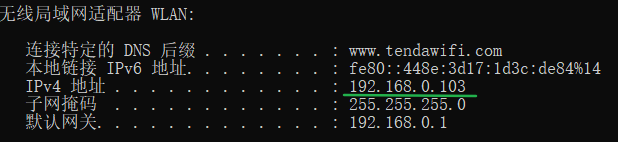
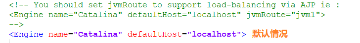
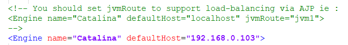
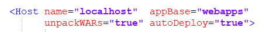
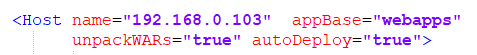

# 同一个局域网下访问WEB工程

- 在控制台下使用ipconfig查询自己电脑的IP地址

- 打开自己的Tomcat服务器的server.xml（在conf文件下）

- 修改上面的XML文件内容，"localHost"改成自己的IP地址

- 修改后保存，这样会在Tomcat启动后，会在work文件夹下创建一个以IP地址为目录的文件夹，里面的文件夹都是空的
- 注：这里的启动是在bin文件下点击startip.bat启动或者用命令行启动

- 接着修改server.xml（在conf文件下）

- "localHost"改成自己的IP地址

- 再起启动Tomcat，同在一个局域网中的小伙伴通过ip地址和端口便可以顺利访问都自己的项目

# 如何使他人访问本地的Java Web应用

## 1.同一局域网下

- 注意：此种情况下，本机（运行Java Web服务的PC机）和客户机（想要访问Java Web服务）必须在同一局域网内，例如都连着同一个无线路由器
- 将项目部署到Tomcat上并启动，并在命令行通过ipconfig命令查看无线局域网适配器WLAN下的IPv4地址，如下图：

- 在客户机上只要输入：http://ipv4地址:8080/项目名，本例为：http://192.168.0.103:8080/chat/pages/user/login.jsp
- 8080为Tomcat的端口号，HTTP协议默认的端口号为80，所以在这里要加上端口号。也可以通过在Tomcat的配置文件中修改端口号为80，将默认的项目名改为想要别人访问的项目，就可以直接通过IP地址访问了，如http://192.168.0.103

## 2.通过外网访问

- 注意：此方法下建议将笔记本直接接上网线，以下将默认笔记本直接接入外网网线
- 这个方法非常简单，直接在百度搜索IP ，就可以知道本机的外网IP，也就是ISP分配给你的IP地址，如图：

- 在客户机上只要输入：http://本机IP:8080/项目名，本例为：http://210.41.98.150:8080/chat/pages/user/login.jsp
- 8080为Tomcat的端口号，HTTP协议默认的端口号为80，所以在这里要加上端口号。也可以通过在Tomcat的配置文件中修改端口号为80，将默认的项目名改为想要别人访问的项目，就可以直接通过IP地址访问了，如http://210.41.98.150

## 3.部署到服务器上

- 部署到阿里云之类的云服务器上，随时随地都可以访问

# 局域网

## 1.无线局域网

- 线局域网，简称WLAN，是在几千米范围内的公司楼群或是商场内的计算机互相连接所组建的计算机网络，一个无线局域网能支持几台到几千台计算机的使用。现如今无线局域网的应用已经越来越多。现在的校园、商场、公司以及高铁都在应用。无线局域网的应用为我们的生活和工活都带来很大的帮助，不仅能够快速传输人们所需要的信息，还能让人们在到联网中的联系更加快捷方便

## 2.有线局域网

- 有线局域网使用了各种不同的传输技术。它们大多使用铜线作为传输介质，但也有一些使用光纤。局域网的大小受到限制，这意味着最坏情况下的传输时间也是有界的，并且事先可以知道。了解这些界限有助于网络协议的设计。通常情况下，有线局域网的运行速度在100Mbps到1Gbps之间，延迟很低（微秒或者纳秒级），而且很少发生错误。较新的局域网可以工作在高达10Gbps的速率。和无线网络相比，有线局域网在性能的所有方面都超过了它们