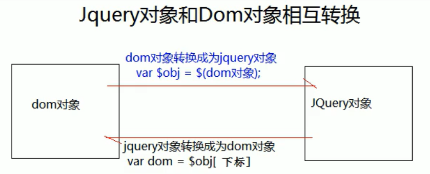

# jQuery

- 什么是jauery？
  - jQuery，顾名思义，也就是JavaScript和查询（Query），它就是辅助JavaScript开发的js类库。
- jQuery核心思想：
  - 它的核心思想是write less，do more（写得更少，做得更多），所以它实现了很多浏览器的兼容问题。
- jQuery 流行程度
  - jQuery 现在已经成为最流行的JavaScript库，在世界前10000个访问最多的网站中，有超过55%在使用jQuery。
- jQuery好处：
  - jQuery是免费、开源的，jQuery的语法设计可以使开发更加便捷，例如操作文档对象、选择DOK元素、制作动画效果、事件处理、使用Aiax以及其他功能

## jQuery使用示例

```javascript
<!DOCTYPE html>
<html lang="en">
<head>
    <meta charset="UTF-8">
    <title>jQuery</title>
    <script type="text/javascript" src="script/jquery-3.4.1.js"></script>
    <script type="text/javascript">
        $(function () { //表示页面加载完成之后再执行，相当于window.onload = function(){}
            let $btn = $("#btn"); //表示按id查询对象
            $btn.click(function () { //绑定单击事件
                alert("jQuery的单击事件")
            })
        })
    </script>
</head>
<body>
<button id="btn">按钮</button>
</body>
</html>
```

- 常见问题：

>- 使用jQuery一定要引入jQuery库吗？答案：是，必须
>- jQuery中的$到底是什么？答案：它是一个函数
>- 怎么为按钮添加点击响应函数的？答案：
>    1. 使用jQuery 查询到标签对象
>    2. 使用标签对象.click(function())

## jQuery核心函数

- $是jQuery的核心函数，能完成jQuery的很多功能
- $()就是调用这个函数

1. 传入参数为 [ 函数 ] 时：表示页面加载完成之后。相当于window.onload=function() { }

```javascript
<script type="text/javascript" src="script/jquery-3.4.1.js"></script>
<script type="text/javascript">
   $(function () {
       alert("打开页面就弹出来了")
   })
</script>
```

2. 传入参数为[ HTML字符串 ]时：会对我们创建这个html标签对象

```javascript
<script type="text/javascript" src="script/jquery-3.4.1.js"></script>
<script type="text/javascript">
   $(function () {
       //在页面创建出一个按钮
       $("<button id=\"btn\">按钮</button>").appendTo("body");
   });
</script>
```

3. 传入参数为[ 选择器字符串 ]时：

>- $(“#id属性值”)；id选择器，根据id查询标签对象
>- $(“标签名”)；标签名选择器，根据指定的标签名查询标签对象
>- $(“.class属性值”)；类型选择器，可以根据class属性查询标签对象

```javascript
<head>
    <meta charset="UTF-8">
    <title>jQuery</title>
    <script type="text/javascript" src="script/jquery-3.4.1.js"></script>
    <script type="text/javascript">
      $(function () {
          let $btn = $("button");
          alert($btn.length); //3
      })
    </script>
</head>
<body>
<button name="btn">按钮1</button>
<button name="btn">按钮2</button>
<button name="btn">按钮3</button>
</body>
```

4. 传入参数为[ DOM对象 ]时：会把这个dom对象转换为jQuery对象

```javascript
<head>
    <meta charset="UTF-8">
    <title>jQuery</title>
    <script type="text/javascript" src="script/jquery-3.4.1.js"></script>
    <script type="text/javascript">
        let domObj = document.getElementsByName("btn");
        alert(domObj); //[object NodeList]------dom对象
        let $jQueryObj = $(domObj);
        alert($jQueryObj); //[object Object]------jQuery对象
    </script>
</head>
<body>
<button name="btn">按钮1</button>
<button name="btn">按钮2</button>
<button name="btn">按钮3</button>
</body>
```

## jQuery对象和dom对象

- Dom对象
  1. 通过getElementByld() 查询出来的标签对象是Dom对象
  2. 通过 getElementsByName() 查询出来的标签对象是Dom对象
  3. 通过 getElementsByTagName() 查询出来的标签对象是Dom对象
  4. 通过createElement() 方法创建的对象，是Dom对象
- jQuery 对象
  5. 通过Query提供的APl创建的对象，是JQuery对象
  6. 通过Query包装的Dom对象，也是JQuery对象
  7. 通过JQuery提供的API查询到的对象，是JQuery对象

- 问题：jQuery对象的本质是什么？
  - jauery对象是dom对象的数组+jQuery提供的一系列功能函数
- jQuery对象不能使用DOM对象的属性和方法
- DOM对象也不能使用jQuery对象的属性和方法



## 基本选择器

- #D选择器：根据id查找标签对象
- .class 选择器：根据class查找标签对象element 选择器：根据标签名查找标签对象
- *选择器：表示任意的，所有的元素
- selector1，selector2组合选择器：合并选择器1，选择器2的结果并返回

## 属性操作

- html() 它可以设置和获取起始标签和结束标签中的内容。跟dom 属性innerHTML一样。
- text() 它可以设置和获取起始标签和结束标签中的文本。跟dom属性innerText一样。
- val() 它可以设置和获取表单项的value属性值。跟dom 属性value一样

# XML

- xml是可扩展的标记性语言
- xml的主要作用有：

>1. 用来保存数据，而且这些数据具有自我描述性
>2. 它还可以做为项目或者模块的配置文件
>3. 还可以做为网络传输数据的格式（现在JSON为主）

- xml可扩展的标记语言。不管是html文件还是xml文件它们都是标记型文档，都可以使用W3c组织制定的dom技术来解析

## xml解析

- 早期JDK为我们提供了两种xml 解析技术DOM和Sax简介（已经过时，但我们需要知道这两种技术）
- dom解析技术是W3c组织制定的，而所有的编程语言都对这个解析技术使用了自己语言的特点进行实现。
- Java对dom技术解析标记也做了实现。
- Sun 公司在JDK5版本对dom 解析技术进行升级：SAX（Simple API for XML）SAX解析，它跟W3C制定的解析不太一样。它是以类似事件机制通过回调告诉用户当前正在解析的内容。是一行一行的读取xml文件进行解析的。不会创建大量的dom对象。以它在解析xml的时候，在内存的使用上。和性能上。都优于Dom解析。
- 第三方的解析：

>- jdom 在dom基础上进行了封装
>- dom4j 又对 jdom 进行了封装
>- pull 主要用在Android 手机开发，是在跟sax非常类似都是事件机制解析xml文件

## dom4j解析技术

- 由于dom4j它不是sun公司的技术，而属于第三方公司的技术，我们需要使用dom4j就需要到dom4j官网下载 dom4j的jar包，导入dom4j-1.6.1
- 解析下列的xml文件：

```xml
<?xml version="1.0" encoding="UTF-8"?>
<books>
    <book sn="SN12341232">
        <name>辟邪剑谱</name>
        <price>9.9</price>
        <author>班主任</author>
    </book>
    <book sn="SN12341231">
        <name>葵花宝典</name>
        <price>99.99</price>
        <author>班长</author>
    </book>
</books>
```

- 使用示例：

```java
@SuppressWarnings("unchecked")
@Test
public void test2() throws Exception {
    //1.创建一个SaxReader输入流，去读取 xml配置文件，生成Document对象
    SAXReader saxReader = new SAXReader();
    Document document = saxReader.read("src/books.xml");
    //2.通过document对象获取根元素
    Element rootElement = document.getRootElement();
    //3.通过根元素获取book标签对象
    List<Element> books = rootElement.elements("book");
    //4.遍历处理每个book标签,封装为Book类
    for (Element book : books) {
        //直接根据标签名取出标签中的内容信息
        String name = book.elementText("name");
        String price = book.elementText("price");
        String author = book.elementText("author");
        //取出标签中的属性值
        String sn = book.attributeValue("sn");
        //5.封装到javabean中
        Book aBook = new Book(sn, name, Double.parseDouble(price), author);
        System.out.println(aBook);
    }
}
/*
Book{sn='SN12341232', name='辟邪剑谱', price=9.9, author='班主任'}
Book{sn='SN12341231', name='葵花宝典', price=99.99, author='班长'}
*/
```