# Web概念

- 什么是JavaWeb 
  - JavaWeb是指，所有通过Java语言编写可以通过浏览器访问的程序的总称，叫JavaWeb。
  - JavaWeb是基于请求和响应来开发的。
- 什么是请求
  - 请求是指客户端给服务器发送数据，叫请求Request。
- 什么是响应
  - 响应是指服务器给客户端回传数据，叫响应Response。
- 请求和响应的关系
  - 请求和响应是成出现的，有请求就有响应。

# Web资源的分类

- web资源按实现的技术和呈现的效果的不同，又分为静态资源和动态资源两种。
  - 静态资源：html、css、js、txt、mp4视频，jpg图片等
  - 动态资源：jsp页面、servlet程序等

# 常用的Web服务器

- Tomcat：由Apache 组织提供的一种Web服务器，提供对jsp和Servlet的支持。
  - 它是一种轻量级的javaWeb容器（服务器），也是当前应用最广的JavaWeb服务器（免费）。
- Jboss：是一个遵从JavaEE规范的、开放源代码的、纯Java的ElB服务器
  - 它支持所有的JavaEE规范（免费）。
- GlassFish：由oracle公司开发的一款JavaWeb服务器，是一款强健的商业服务器，达到产品级质量（应用很少）。
- Resin：是CAUCHO公司的产品，是一个非常流行的服务器，对servlet和JSP提供了良好的支持，性能也比较优良，resin自身采用JAVA语言开发（收费，应用比较多）。
- Weblogic：是oracle公司的产品，是目前应用最广泛的Web 服务器，支持JavaEE规范，而且不断的完善以适应新的开发要求，适合大型项目（收费，用的不多，适合大公司）。

# Tomcat介绍和使用

- **安装：**
  - 找到你需要用的Tomcat版本对应的zip压缩包，解压到需要安装的目录即可。
- **目录介绍**
  - bin 专门用来存放Tomcat服务器的可执行程序
  - conf专门用来存放Tomcat服务器的配置文件
  - lib 专门用来存放Tomcat服务器的jar包
  - logs 专门用来存放Tomcat服务器运行时输出的日记信息
  - temp 专门用来存放Tomcat运行时产生的临时数据
  - webapps 专门用来存放部署的Web工程。
- work 是Tomcat工作时的目录，用来存放Tomcat运行时jsp翻译为servlet的源码，和Session 钝化的目录。
  
- **如何启动Tomcat服务器**
  - 找到Tomcat目录下的bin目录下的startup.bat文件，双击，就可以启动Tomcat服务器。
- **另一种启动tomcat服务器的方式**
  1. 打开命令行
  2. cd到你的Tomcat的bin目录下
  3. 敲入启动命令：catalina run
- **如何测试Tomcat服务器启动成功?** 打开浏览器，在浏览器地址栏中输入以下地址测试：
  1. http://localhost:8080
  2. http://127.0.0.1:8080
  3. http://自己电脑的真实ip：8080

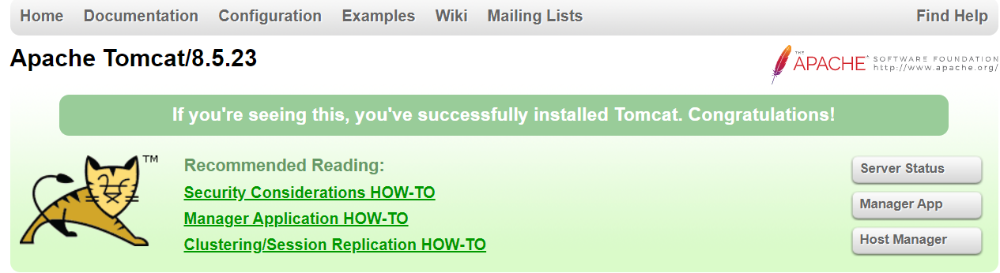

>- 当出现上面的界面说明启动成功!!!

- 常见的启动失败的情况有，双击 startup.bat文件，就会出现一个小黑窗口一闪而来。这个时候，失败的原因基本上都是因为没有配置好JAVA_HOME环境变量。
- 常见的JAVA_HOME配置错误有以下几种情况：
  1. JAVA_HOME必须全大写。
  2. JAVA_HGME中间必须是下划线，不是减号
  3. JAVA_HOME配置的路径只需要配置到jdk的安装目录即可。不需要带上bin目录。

- **Tomcat的3种停止方式**
  1. 点击tomcat服务器窗口的x关闭按钮
  2. 把Tomcat服务器窗口置为当前窗口，然后按快捷键 Ctrl+C
  3. 找到Tomcat的bin 目录下的shutdown.bat 双击，就可以停止Tomcat 服务器（主要方式）
- **如何修改Tomcat的端口号**
  - Mysql 的默认的端口号是：3306
  - Tomcat的默认的端口号是：8080
    1. 找到Tomcat目录下的conf目录，找到server.xml配置文件。
    2. 找到Connector标签，修改port属性为你需要的端口号。
       - 端口号范园：1-65535修改完端口号
       - 一定要重启Tomcat服务器才能生效

```xml
<Connector port="8080" protocol="HTTP/1.1"
           connectionTimeout="20000"
           redirectPort="8443" />
```

* 平时上百度：http://www.baidu.com:80 没有看见后面有端口号
  - HTTP协议默认的端口号是：80所以可以省略不写

- **如何部暑web工程到Tomcat中**
  
  - 第一种方法：只需要把web工程的目录拷贝到Tomcat的web apps目录下即可。
  
  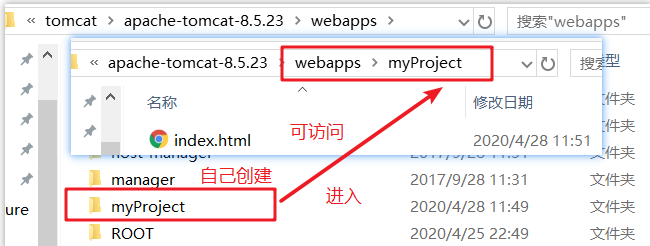
  
  - 第二种部署方法：找到Tomcat下的conf目录 \ Catalina \ localhost \下，创建如下的配置文件：
  
  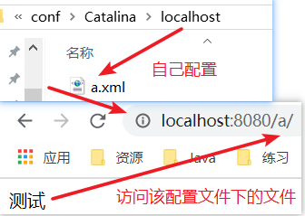

```xml
<!--Context表示一个工程上下文
    path表示工程的访问路径：/a  
    docBase表示你的工程目录在哪里 
-->               
<Context 
         path="/a" 
         docBase="D:\myProject"
         />
```

# 手拖页面和输入地址访问的区别

- 直接拖到html文件到浏览器中

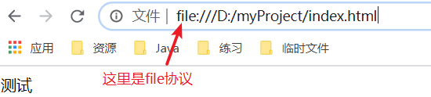

>- file 协议表示告诉浏览器直接读取file：协议后面的路径，解析展示在浏览器上即可，不走网络

- 如果是在浏览器地址栏中输入访问地址格式如下：http://ip:port/工程名/资源名

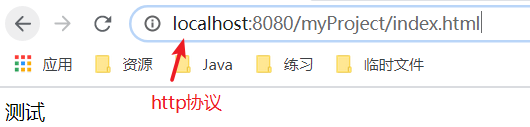

- Http协议的过程

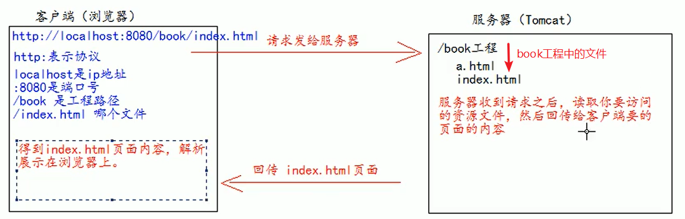

# ROOT的工程以及默认index.html页面的访问

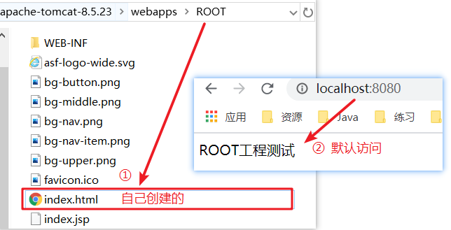

- 当我们在浏览器地址栏中输入访问地址如：http://ip:port/
  - 没有工程名的时候，默认访问的是ROOT工程。
- 当我们在浏览器地址栏中输入的访问地址如：http://ip:iport/工程名/
  - 没有资源名，默认访问index.html页面

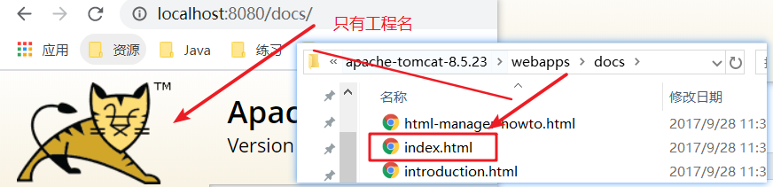

# IDEA整合Tomcat

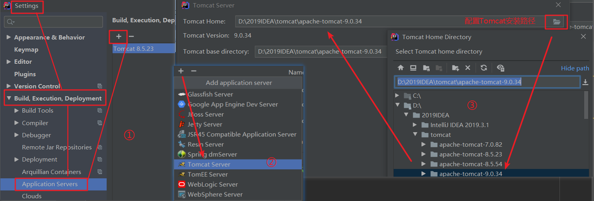

- 创建一个Project

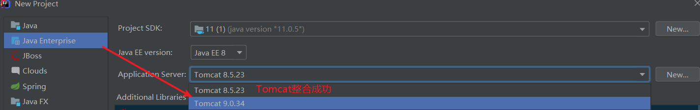


# Web工程目录介绍

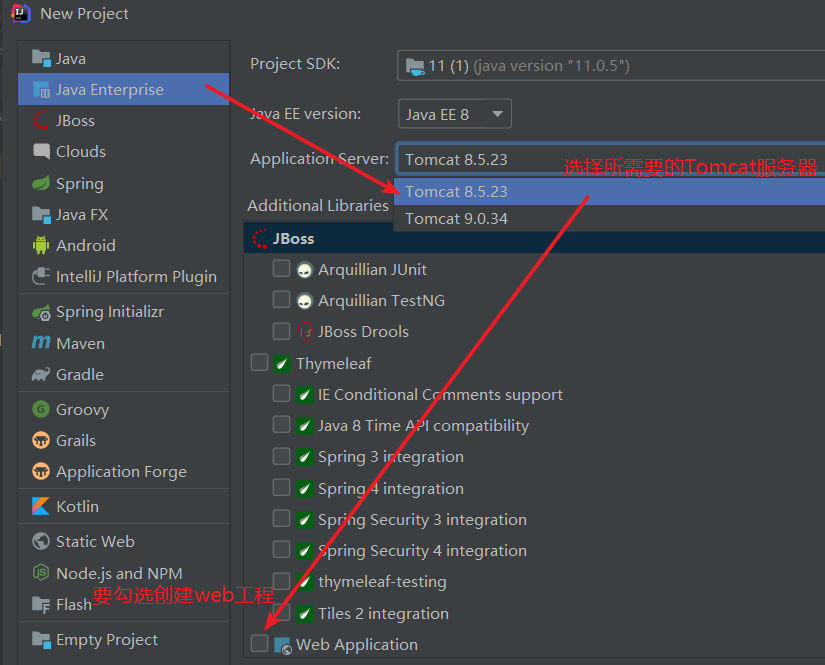

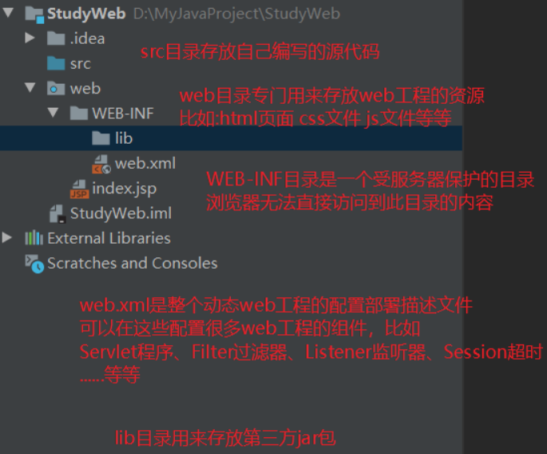

# 部署工程到Tomcat上运行

1. 建议修改web工程对应的Tomcat运行实例名称：
2. 确认你的Tomcat 实例中有你要部署运行的web工程模块：
3. 你还可以修改你的Tomcat实例启动后默认的访问地址：

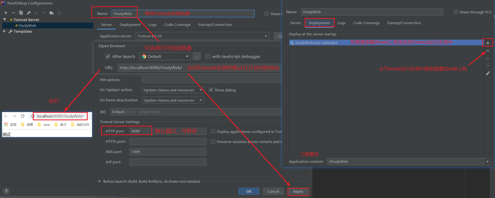

- 点击重启时的菜单选项

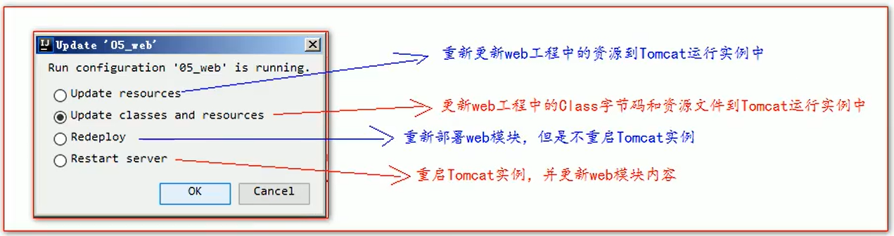

# Tomcat使用细节

- 修改工程访问路径

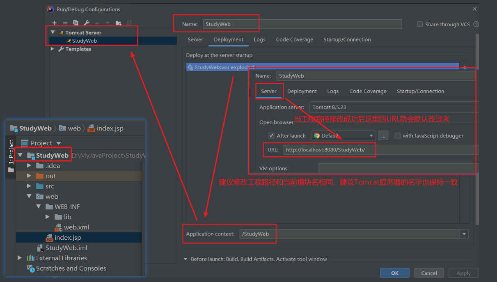

- 修改运行时的端口号

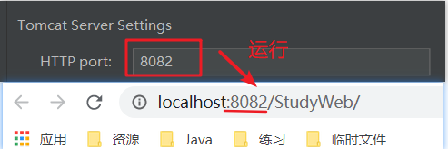

- 修改运行时的默认浏览器
- 配置资源热部署

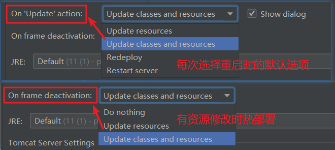