# Servlet

## Servlet的创建

- 什么是Servlet
  1. Servlet是JavaEE规范之一。规范就是接口
  2. Servlet 就JavaWeb三大组件之一。三大组件分别是：Servlet 程序、Filter过滤器、Listener监听器。
  3. Servlet 是运行在服务器上的一个java小程序，它可以接收客户端发送过来的请求，并响应数据给客户端。

- 手动实现Servlet程序
  1. 编写一个类去实现 Servlet 接口
  2. 实现service方法，处理请求，并响应数据
  3. 到web.xml中去配置 servlet 程序的访问地址

```java
public class HelloServlet implements Servlet {
    @Override
    public void init(ServletConfig servletConfig) throws ServletException { }
    @Override
    public ServletConfig getServletConfig() { return null; }

    //service方法是专门用来处理请求和响应的
    //当访问http://localhost:8080/StudyWeb/hello配置文件中的资源文件时该方法被调用,该路径在配置文件中进行配置
    @Override
    public void service(ServletRequest servletRequest, ServletResponse servletResponse) throws ServletException, IOException {
        System.out.println("访问HelloServlet");
    }

    @Override
    public String getServletInfo() { return null; }
    @Override
    public void destroy() { }
}

```

web.xml文件配置

```xml
<?xml version="1.0" encoding="UTF-8"?>
<web-app xmlns="http://xmlns.jcp.org/xml/ns/javaee"
         xmlns:xsi="http://www.w3.org/2001/XMLSchema-instance"
         xsi:schemaLocation="http://xmlns.jcp.org/xml/ns/javaee http://xmlns.jcp.org/xml/ns/javaee/web-app_4_0.xsd"
         version="4.0">

    <servlet>
        <!--servlet-name标签 给Servlet程序起一个别名(一般是类名) -->
        <servlet-name>HelloServlet</servlet-name>
        <!--servlet-class是Servlet程序的全类名 -->
        <servlet-class>test.HelloServlet</servlet-class>
    </servlet>

    <!--servlet-mapping标签 给Servlet程序程序配置访问地址-->
    <servlet-mapping>
        <!-- Servlet程序使用-->
        <servlet-name>HelloServlet</servlet-name>
        <!--
        1. url-pattern标签配置访问地址
        2. /斜杠在服务器解析的时候，表示地址为：http://ip:port/工程路径
        3. /hello表示地址为：http://ip:port/工程路径/资源路径
        -->
        <url-pattern>/hello</url-pattern> <!--url-pattern的地址是可以自定义的，根据自己的需要进行设置，一般情况下根据当前的Servlet程序类名有一个对应关系就好了，约定大于配置，最好不要随便瞎写一个-->
     
    </servlet-mapping>
</web-app>
```

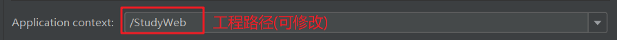

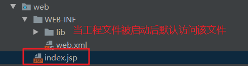

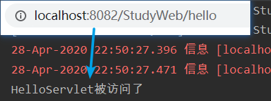

## 三种常见错误

1. url-pattern中配置的路径没有以斜杠打头;
   - 错误原因：无效的URL地址

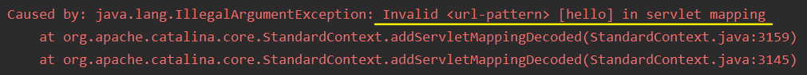

2. servlet-name配置的值不存在;

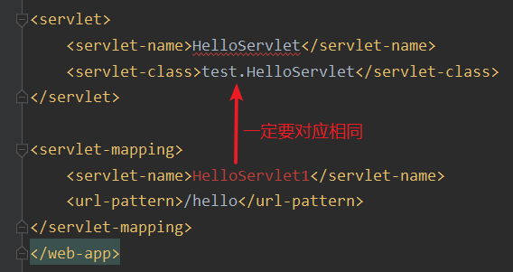

3. servlet-class标签的全类名配置错误

## Server的URL定位原理

- http://localhost:8082/StudyWeb/hello，该URL地址如何定位到Server程序去访问

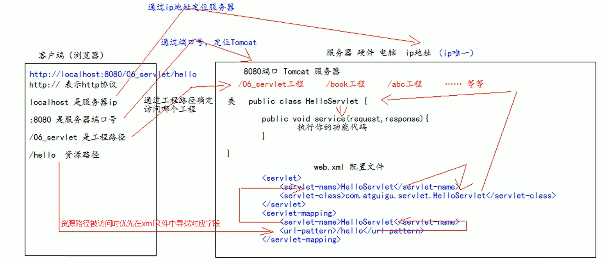

## Servlet的生命周期

```java
public class HelloServlet implements Servlet {
    public HelloServlet() {
        System.out.println("1.构造器调用");
    }
    
    @Override
    public void init(ServletConfig servletConfig) throws ServletException {
        System.out.println("2.初始化方法被调用");
    }

    @Override
    public ServletConfig getServletConfig() {
        return null;
    }

    @Override
    public void service(ServletRequest servletRequest, ServletResponse servletResponse) throws ServletException, IOException {
        System.out.println("3.service方法被调用");
    }

    @Override
    public String getServletInfo() {
        return null;
    }

    @Override
    public void destroy() {
        System.out.println("4.销毁方法被调用");
    }
}
```

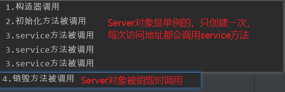

- **小结:**

>1. 执行 Servlet 构造器方法
>2. 执行 init 初始化方法
>   - 第1、2步，是在第一次访问，的时候创建 Servlet 程序会调用。
>3. 执行 service 方法
>   - 第3步，每次访问都会调用。
>4. 执行 destroy 销毁方法
>   - 第4步，在web工程停止的时候调用。

## 请求的分发处理

- 分别处理get和post请求

```java
@Override
public void service(ServletRequest servletRequest, ServletResponse servletResponse) throws ServletException, IOException {
    //类型转换(因为它有getMethod()方法)
    HttpServletRequest request = (HttpServletRequest) servletRequest;//Crtl+H可以查看类继承关系
    //获取请求方法
    String method = request.getMethod();
    //处理不同的请求方式
    if ("GET".equals(method)){
        System.out.println("执行GET请求");
    }
    if ("POST".equals(method)){
        System.out.println("执行POST请求");
    }
}
```

## 继承HttpServlet 

- 一般在实际项目开发中，都是使用继承 HttpServlet 类的方式去实现Servlet程序。
  1. 编写一个类去继承 Httpservlet 类
  2. 根据业务需要重写doGet() 或 doPost()方法
  3. 到web.xml中的配置Servlet程序的访问地址

```java
public class HelloServlet extends HttpServlet {
    //在get请求时调用
    @Override
    protected void doGet(HttpServletRequest req, HttpServletResponse resp) throws ServletException, IOException {
        super.doGet(req, resp);
    }

    //在post请求时调用
    @Override
    protected void doPost(HttpServletRequest req, HttpServletResponse resp) throws ServletException, IOException {
        super.doPost(req, resp);
    }
}
```

## IDEA创建Servlet 

- 所在包下new------>create new Servlet

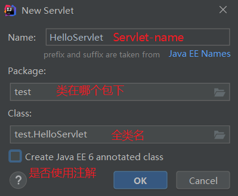

- 配置mapping

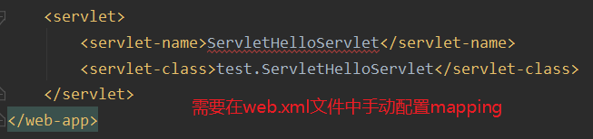

```xml
<?xml version="1.0" encoding="UTF-8"?>
<web-app xmlns="http://xmlns.jcp.org/xml/ns/javaee"
         xmlns:xsi="http://www.w3.org/2001/XMLSchema-instance"
         xsi:schemaLocation="http://xmlns.jcp.org/xml/ns/javaee http://xmlns.jcp.org/xml/ns/javaee/web-app_4_0.xsd"
         version="4.0">

    <servlet>
        <servlet-name>HelloServlet</servlet-name>
        <servlet-class>test.HelloServlet</servlet-class>
    </servlet>
    <!--手动配置即可-->
    <servlet-mapping>
        <servlet-name>HelloServlet</servlet-name>
        <url-pattern>/hello</url-pattern>
    </servlet-mapping>
</web-app>
```

- 创建效果

```java
public class HelloServlet extends HttpServlet {
    protected void doPost(HttpServletRequest request, HttpServletResponse response){
    }

    protected void doGet(HttpServletRequest request, HttpServletResponse response) {
    }
}
```

## Servlet类的继承体系

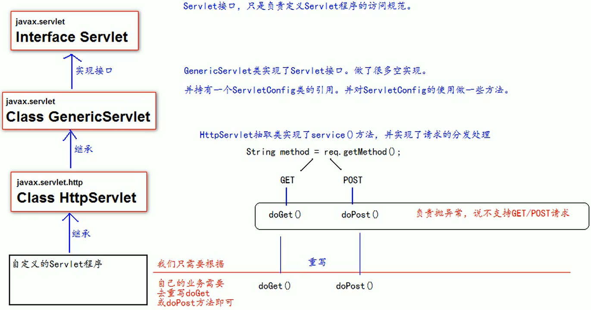

## ServletConfig类

- servletConfig类从类名上来看，就知道是Servlet程序的配置信息类。
- Servlet 程序和ServletConfig 对象都是由Tomcat负责创建，我们负责使用。
- Servlet 程序默认是第一次访问的时候创建，ServletConfig是每个Servlet程序创建时，就创建一个对应的ServletConfig
- ServletConfig类的三大作用
  1. 可以获取 Servlet 程序的别名：servlet-name的值
  2. 获取初始化参数init-param
  3. 获取ServletContext对象

---

1. 在web.xml里进行参数配置

```xml
<servlet>
    <servlet-name>HelloServlet</servlet-name>
    <servlet-class>test.HelloServlet</servlet-class>
    <!--init-param是初始化参数,就在所需要的servlet程序里进行配置，可配置多个-->
    <init-param>
        <!--param-name是参数名-->
        <param-name>username</param-name>
        <!--param-value是参数值-->
        <param-value>root</param-value>
    </init-param>
    <init-param>
        <param-name>password</param-name>
        <param-value>123456</param-value>
    </init-param>
</servlet>
```

2. 在主程序中读出配置文件的值

```java
public class HelloServlet implements Servlet {
    @Override
    public void init(ServletConfig servletConfig) throws ServletException {
        //可以获取HelloServlet程序的别名servlet-name的值
        String servletName = servletConfig.getServletName();
        //获取初始化参数init-param的值，以键值对方式获取
        String username = servletConfig.getInitParameter("username");
        String password = servletConfig.getInitParameter("password");
        //获取ServletContext对象
        ServletContext servletContext = servletConfig.getServletContext();
        System.out.println("HelloServlet程序的别名" + servletName);
        System.out.println("初始化参数username = " + username);
        System.out.println("password = " + password);
        System.out.println(servletContext);
    }
}
```

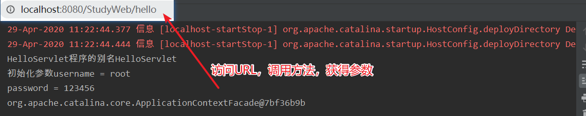

- **通过继承的方式获取ServletConfig**

```java
public class HelloServlet extends HttpServlet {
    @Override
    public void init(ServletConfig config) throws ServletException {
        //如果重写init则一定要调用父类的方法，否则在下面方法中获取不到ServletConfig对象
        super.init(config);
        System.out.println("做一些初始化方法init...");
    }

    @Override
    protected void doGet(HttpServletRequest req, HttpServletResponse resp){
        ServletConfig servletConfig = getServletConfig();
        System.out.println(servletConfig);
    }
}
```

## ServletContext类

- 什么是ServletContext？
  1. SerletContext是一个接口，它表示Servlet上下文对象
  2. 一个web工程，只有一个ServletContext对象实例。
     - 在同一个web工程中获取ServletContext对象打印出的地址值是相同的
  3. ServletContext对象是一个域对象。
  4. ServletContext是在web工程部署启动的时候创建。在web工程停止的时候销毁。
- 什么是域对象？
  - 域对象，是可以像Map一样存取数据的对象，叫域对象。
  - 这里的域指的是存取数据的操作范围，整个web工程

|        |     存数据     |     取数据     |     删除数据      |
| :----: | :------------: | :------------: | :---------------: |
|  Map   |     put()      |     get()      |     remove()      |
| 域对象 | setAttribute() | getAttribute() | removeAttribute() |

- ServletContext类的四个作用：
  1. 获取web.xml中配置的上下文参数context-param
  2. 获取当前的工程路径，格式：/工程路径
  3. 获取工程部署后在服务器硬盘上的绝对路径
  4. 像Map一样存取数据

- **示例**

```java
public class ContextServlet extends HttpServlet {
    protected void doGet(HttpServletRequest request, HttpServletResponse response) throws ServletException, IOException {
        //获web.xml中配置的上下文参数context-param
        ServletContext servletContext = getServletContext();//直接getServletContext()调用是因为内部封装了getServletConfig().getServletContext();这一步
        String username = servletContext.getInitParameter("username");
        String password = servletContext.getInitParameter("password");
        System.out.println("context-param中的username = " + username);
        System.out.println("context-param中的password = " + password);
        //获段当前的工程路径，格式：/工程路径
        String contextPath = servletContext.getContextPath();
        System.out.println("当前工程路径：" + contextPath);
        //获段工程部器后在服务器硬盘上的绝对路径
        /*
        / 科红鼓服务器解析地址为：http://ip:port/工程名/ 映射到IDEA代码的veb目录
         */
        String realPath = servletContext.getRealPath("/");
        System.out.println("绝对路径：" + realPath);
    }
}
```

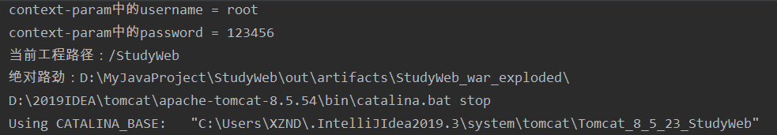

- web.xml配置文件

```xml
<?xml version="1.0" encoding="UTF-8"?>
<web-app xmlns="http://xmlns.jcp.org/xml/ns/javaee"
         xmlns:xsi="http://www.w3.org/2001/XMLSchema-instance"
         xsi:schemaLocation="http://xmlns.jcp.org/xml/ns/javaee http://xmlns.jcp.org/xml/ns/javaee/web-app_4_0.xsd"
         version="4.0">

    <!--是上下文参数(它属于整个web工程),可根据需要配置多组-->
    <context-param>
        <param-name>username</param-name>
        <param-value>root</param-value>
    </context-param>

    <context-param>
        <param-name>password</param-name>
        <param-value>123456</param-value>
    </context-param>

    <servlet>
        <servlet-name>ContextServlet</servlet-name>
        <servlet-class>test.ContextServlet</servlet-class>
    </servlet>
    <servlet-mapping>
        <servlet-name>ContextServlet</servlet-name>
        <url-pattern>/context</url-pattern>
    </servlet-mapping>
</web-app>
```

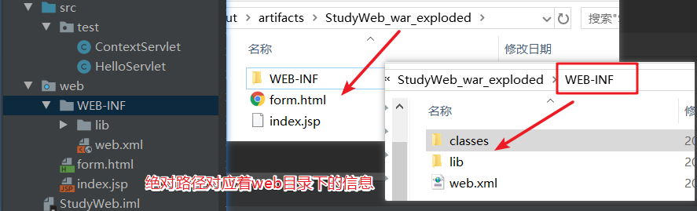

- 像Map一样存储数据示例：
  - 分别创建两个ContextServlet程序并在web.xml进行配置

```java
public class ContextServlet extends HttpServlet {
    protected void doGet(HttpServletRequest request, HttpServletResponse response) throws ServletException, IOException {
        ServletContext servletContext = getServletContext();
        //未进行配置前
        System.out.println("context1：" +servletContext.getAttribute("key"));
        //配置key-value键值对
        servletContext.setAttribute("key", "value");
        //取出数据，测试两次
        System.out.println("context1：" +servletContext.getAttribute("key"));
        System.out.println("context1：" +servletContext.getAttribute("key"));
    }
}
```

```java
public class ContextServlet2 extends HttpServlet {
    protected void doGet(HttpServletRequest request, HttpServletResponse response) throws ServletException, IOException {
        ServletContext servletContext = getServletContext();
        System.out.println("context2：" + servletContext.getAttribute("key"));
    }
}
```

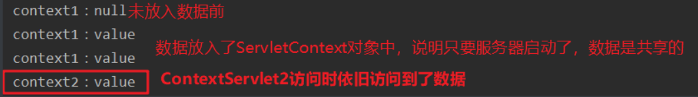

# Http协议

- 协议是指双方或多方相互约定好，大家都需要遵守的规则叫做协议
- 所谓HTTP协议就是指客户端和服务器之间通信时发送的数据，需要遵循的规则叫HTTP协议
- HTTP协议中的数据又叫报文

- 协议格式

>- 客户端给服务器发送数据叫请求。服务器给客户端回传数据叫响应。
>- 请求又分为GET请求，和POST 请求两种

## GET请求

- 请求行
  1. 请求的方式GET
  2. 请求的资源路径[+？+请求参数]
  3. 请求的协议的版本号HTTP/1.1
- 请求头
  - key:value   组成不同的键值对，表示不同的含义。

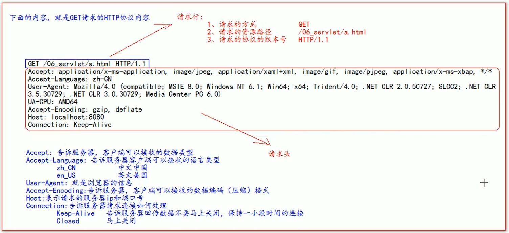

## POST请求

- 请求行
  1. 请求的方式poST
  2. 请求的资源路径[+？+请求参数]
  3. 请求的协议的版本号HTTP/1.1
- 请求头
  - key:value   不同的请求头，有不同的含义
  - 有一个空行
- 请求体
  - 就是发送给服务器的数据

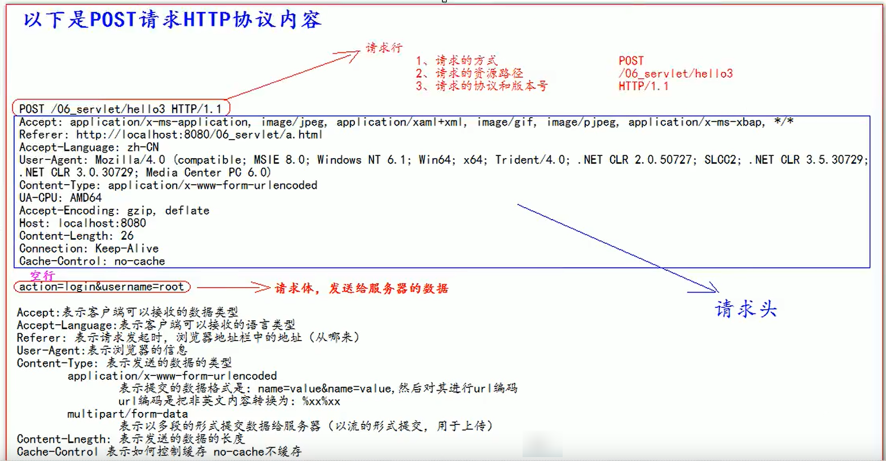

## 常用请求头

- Accept：表示客户端可以接收的数据类型
- Accpet-Languege：表示客户端可以接收的语言类型
- User-Agent：表示客户端浏览器的信息
- Host：表示请求时的服务器ip和端口号

## GET和POST请求的使用场景

- GET 请求有哪些：
  1. form标签method=get
  2. a标签
  3. link 标签引入css
  4. Script标签引入js文件
  5. img标签引入图片
  6. iframe 引入html页面
  7. 在浏览器地址栏中输入地址后敲回车

- POST 请求有哪些：
  - form标签method=post

## 响应的HTTP协议格式

- 响应行
  1. 响应的协议和版本号
  2. 响应状态码
  3. 响应状态描述符
- 响应头
  - key:value 不同的响应头，有其不同合义
  - 与响应体隔一个空行
- 响应体：就是回传给客户端的数据

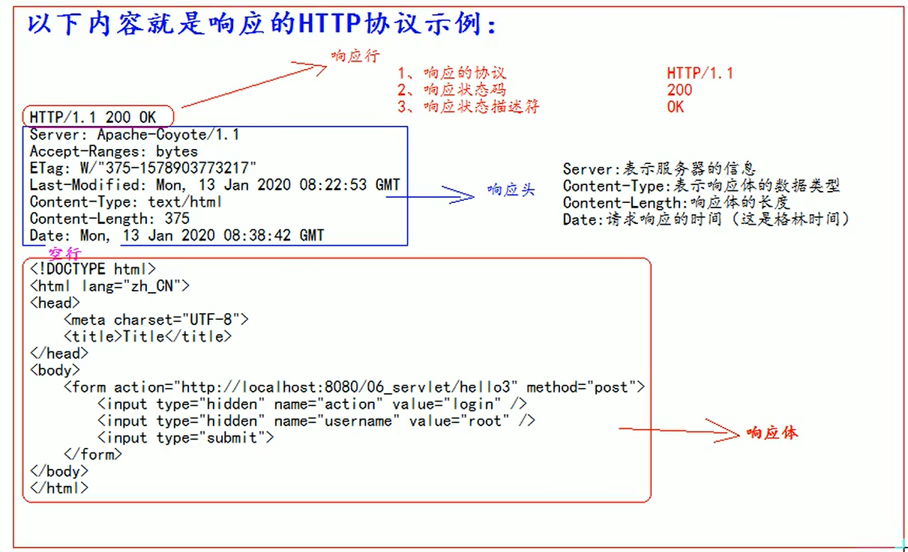

## 常见的响应码

- 200：表示请求成功
- 302：表示请求重定向
- 404表示请求服务器已经收到了，但是你要的数据不存在（请求地址错误）
- 500表示服务器已经收到请求，但是服务器内部错误（代码错误）

## MIME类型说明

- MIME是HTTP协议中数据类型。
- MIME的英文全称是"Multipurpose Internet Mail Extensions"多功能Internet 邮件扩充服务。MIME类型的格式是“大类型/小类型”，并与某一种文件的扩展名相对应。

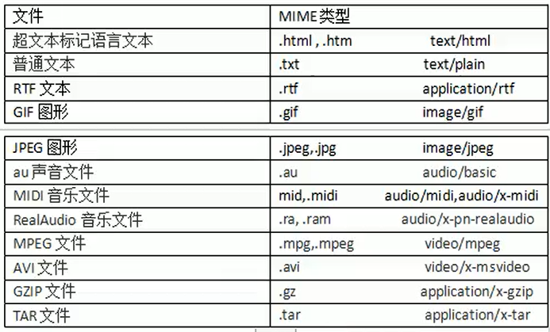

## 使用谷歌浏览器查看HTTP协议

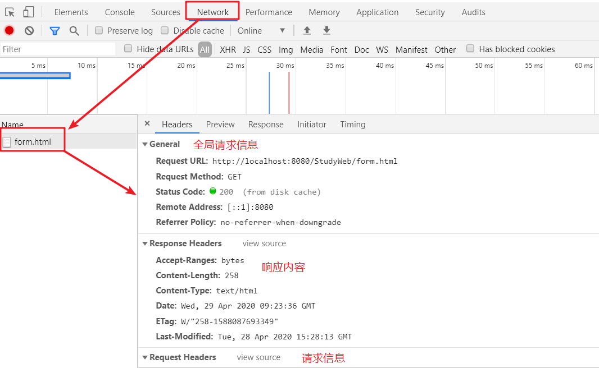

# HttpServletRequest

- 每次只要有请求进入Tomcat服务器，Tomcat 服务器就会把请求过来的HTTP协议信息解析好封装到Request对象中。
  然后传递到service 方法（doGet 和doPost）中给我们使用。我们可以通过HttpServletRequest对象，获取到所有请求的信息。

- 常用方法

```java
getRequestURI()  //获取请求的资源路径
getRequestURL()  //获取请求的统一资源定位符（绝对路径）
getRemoteHost()  //获取客户端的ip地址
getHeader()  //获取请求头
getParameter()  //获取请求的参数
getParameterValues()  //获取请求的参数（多个值的时候使用）
getMethod()  //获取请求的方式GET或POST 
setAttribute(key，value)  //设置域数据
getAttribute(key)  //获取域数据
getRequestDispatcher()  //获取请求转发对象
```

- 测试一：获取请求的资源路径、获取请求的统一资源定位符、获取客户端的ip地址、获取请求头、

```java
@Override
protected void doGet(HttpServletRequest req, HttpServletResponse resp) {
    String uri = req.getRequestURI();
    StringBuffer url = req.getRequestURL();
    /*
    在IDEA中，使用用localhost防问时，得到的客户端 ip她址是===>>>127.0.0.1
    在IDEA中，使用127.0.0.1访问时，得到的客户端 ip她址是===>>）127.0.0.1
    在IDEA中，使用真实ip访问时，得到的客户端ip她址是，真实的客户端 ip她址
     */
    String host = req.getRemoteHost();
    String header = req.getHeader("User-Agent");
    System.out.println("uri = " + uri);
    System.out.println("url = " + url);
    System.out.println("客户端ip地址 = " + host);
    System.out.println("请求头 = "+header);
}
```

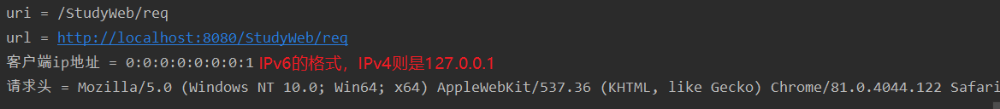

- **测试二：在表单中输入用户名和密码并选择爱好进行表单提交：表单内容为英文**

```java
protected void doGet(HttpServletRequest request, HttpServletResponse response) throws ServletException, IOException {
    String username = request.getParameter("username"); //获取一个参数
    String password = request.getParameter("password"); 
    String[] hobbies = request.getParameterValues("hobby"); //获取多个参数
    System.out.println("用户名 = " + username);
    System.out.println("密 码 = " + password);
    System.out.println("爱好 = " + Arrays.asList(hobbies));
}
/*
用户名 = superlkl
密 码 = 123456
爱好 = [.cpp, .java]
*/
```

- **测试三：提交的表单内容中有中文会出现乱码问题**

```java
@Override
protected void doPost(HttpServletRequest req, HttpServletResponse resp) throws ServletException, IOException {
    //post请求需要显示设置字符集编码，否则会出现中文乱码的情况
    req.setCharacterEncoding("UTF-8");
    String username = req.getParameter("username");
    String password = req.getParameter("password");
    String[] hobbies = req.getParameterValues("hobby");
    System.out.println("用户名 = " + username);
    System.out.println("密 码 = " + password);
    System.out.println("爱好 = " + Arrays.asList(hobbies));
}
```

## 请求转发

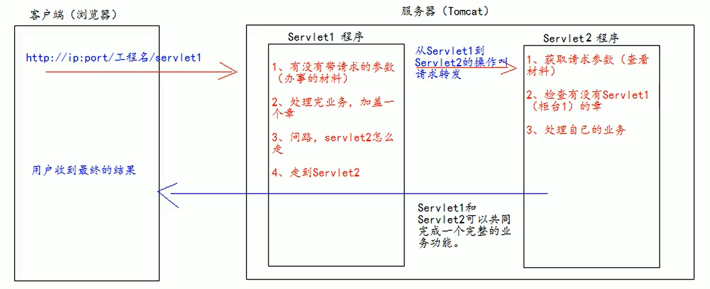

- **请求转发的特点：**

>1. 浏览器地址没有变化
>2. 他们是一次请求
>3. 他们共享Request域中的数据|
>4. 可以转发到WEB-INF目录下
>5. 不可以访问工程以外的资源

- 创建两个Servlet模拟事件分发

```java
public class MyServlet1 extends HttpServlet {
    protected void doGet(HttpServletRequest request, HttpServletResponse response) throws ServletException, IOException {
        //1.获段请求的参数（办事的材料）查看
        String username = request.getParameter("username");
        System.out.println("在MyServlet1中查看参数（材料）" + username);

        //2.给材料盖一个章，并传递到MyServlet2（柜台2）去查看
        request.setAttribute("key", "盖上柜台一的章");

        //3.问路，MyServlet2（柜台2）怎么走
        //请求转发必须要以斜杠打头，/斜杠表示地址为：http://ip:port/工程名/，映射到IDEA代码的web目录
        RequestDispatcher dispatcher = request.getRequestDispatcher("/my2");//填写<url-pattern>标签中设置的资源地址

        //4.走向MyServlet2（柜台2），前进
        dispatcher.forward(request,response);
    }
}
```

```java
public class MyServlet2 extends HttpServlet {

    protected void doGet(HttpServletRequest request, HttpServletResponse response) throws ServletException, IOException {
        //1.获段请求的参数（办事的材料）查看
        String username = request.getParameter("username");
        System.out.println("MyServlet2查看材料" + username);

        //2.查看柜台一是否有盖章
        Object key = request.getAttribute("key");
        System.out.println("MyServlet2查看MyServlet1（柜台1）盖的章"+key);

        //3.进行跟MyServlet2有关的业务办理
        System.out.println("处理MyServlet2自己的业务");
    }
}
```

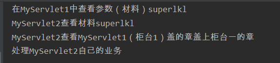

- web.xml文件中进行配置

```xml
<?xml version="1.0" encoding="UTF-8"?>
<web-app xmlns="http://xmlns.jcp.org/xml/ns/javaee"
         xmlns:xsi="http://www.w3.org/2001/XMLSchema-instance"
         xsi:schemaLocation="http://xmlns.jcp.org/xml/ns/javaee http://xmlns.jcp.org/xml/ns/javaee/web-app_4_0.xsd"
         version="4.0">
    <servlet>
        <servlet-name>MyServlet1</servlet-name>
        <servlet-class>test.MyServlet1</servlet-class>
    </servlet>
    <servlet>
        <servlet-name>MyServlet2</servlet-name>
        <servlet-class>test.MyServlet2</servlet-class>
    </servlet>

    <servlet-mapping>
        <servlet-name>MyServlet1</servlet-name>
        <url-pattern>/my1</url-pattern>
    </servlet-mapping>

    <servlet-mapping>
        <servlet-name>MyServlet2</servlet-name>
        <url-pattern>/my2</url-pattern>
    </servlet-mapping>
</web-app>
```

## base标签

- 文件测试目录

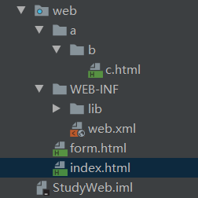

- c.html

```html
<!DOCTYPE html>
<html lang="en">
<head>
    <meta charset="UTF-8">
    <title>c.html</title>
    <!--base标签设置页面相对路径工作时参照的地址
        href属性就是参数的地址值-->
    <base href="http://localhost:8080/StudyWeb/a/b/c.html">
</head>
<body>
这是a下的b下的c.html页面<br/>
<a href="../../index.html">跳回首页</a>
</body>
</html>
```

- index.html

```html
<!DOCTYPE html>
<html lang="en">
<head>
    <meta charset="UTF-8">
    <title>首页</title>
</head>
<body>
这是web目录下的index.html页面<br/>
<a href="a/b/c.html">a/b/c.html</a><br/>
<a href="http://localhost:8080/StudyWeb/forwardC">请求转发到：a/b/c.html</a>
</body>
</html>
```

- 说明：从一个页面跳转到另一个页面：两种方法
  1. 使用相对路径的方式直接用超链接的形式进行跳转，不涉及请求转发
  2. **需要请求转发但必须加入base标签，在里面设置页面相对路径工作时参照的地址才可来回跳转成功**

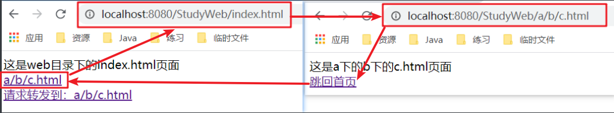

- 解析跳转的相对路径的参照逻辑


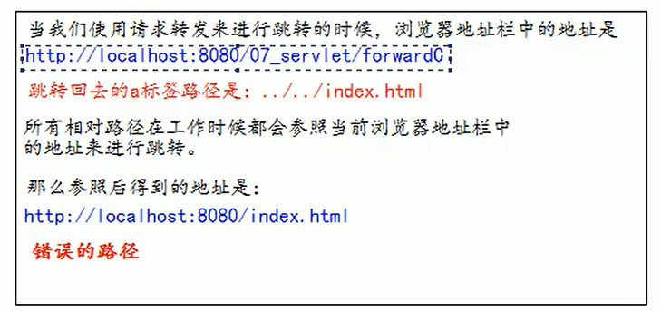

- 请求转发

```java
public class ForwardC extends HttpServlet {
    @Override
    protected void doGet(HttpServletRequest req, HttpServletResponse resp) throws ServletException, IOException {
        System.out.println("经过了ForwardC进行请求转发");
        //第一个斜杠表示映射到当前工程下的web目录
        req.getRequestDispatcher("/a/b/c.html").forward(req,resp);
    }
}
```

- 当访问http://localhost:8080/StudeyWeb/forwardC时就会跳转到c.html页面

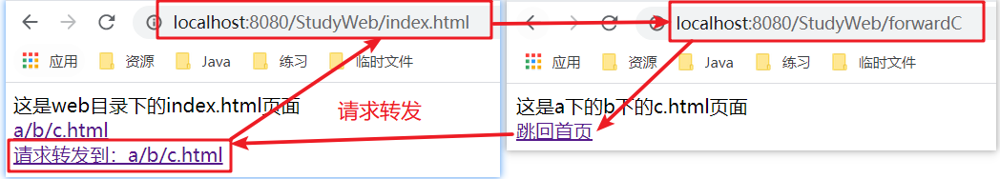

# 相对路径./与../区别

**一、基本概念**

1. 相对路径-顾名思义，相对路径就是相对于当前文件的路径。网页中一般表示路径使用这个方法。
2. 绝对路径-绝对路径就是你的主页上的文件或目录在硬盘上真正的路径。绝对路径就是你的主页上的文件或目录在硬盘上真正的路径
   - 比如，你的Perl 程序是存放在 c:/apache/cgi-bin 下的，那么 c:/apache/cgi-bin就是cgi-bin目录的绝对路径

- 在网络中，以http开头的链接都是绝对路径，绝对路径就是你的主页上的文件或目录在硬盘上真正的路径，绝对路径一般在CGI程序的路径配置中经常用到，而在制作网页中实际很少用到。

**二、相对路径使用的特殊符号**

- 以下为建立路径所使用的几个特殊符号，及其所代表的意义。

>- **“./”：代表目前所在的目录。**
>
>- **“../”：代表上一层目录。**
>
>- **以”/”开头：代表根目录。**

- 根目录下有Site1和Image/Image.jpg，Site1下有Page1.html文件和Site2文件夹。Site2下有Page2.html和Page2Image.jpg图片文件。

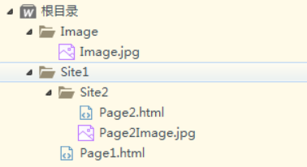

**1. 文件在当前目录**

```html
<!--Page2.html访问Page2Image.jpg-->

或者
```

**2. 文件在上一层目录**

```html
<!--Page1.html访问Image下的Image.jpg-->


<!--Page2.html访问Image下的Image.jpg-->                             

```

**3. 文件在下一层目录**

```html
<!--Page1.html访问Site2文件夹下的Page2Image.jpg-->

```

**4. 根目录表示任何页面访问Image下的Image.jpg图片**

```html

```

# Web中"/"的不同意义

- 在web中/斜杠是一种绝对路径。

  - /斜杠如果被浏览器解析，得到的地址是：http://ip/port/

  - ```xml
    <a href="/">斜杠</a>
    ```

- 斜杠如果被服务器解析，得到的地址是：http:/ip:port/工程路径

  1. ```xml
     <url-pattern>/MyServlet1</url-pattern>
     ```

  2. servletContext.getRealPath（"/”）;

  3. request.getRequestDispatcher（"/”）；

- 特殊情况：response.sendRedirect（"/”）；把斜杠发送给浏览器解析。得到http://ip:port/

# HttpServletResponse

- HttpServletResponse 类和HttpServletRequest类一样。每次请求进来，Tomcat服务器都会创建一个Response对象传递给Servlet 程序去使用。HttpServletRequest表示请求过来的信息，HttpServletResponse表示所有响应的信息，我们如果需要设置返回给客户端的信息，都可以通过HttpserletResponse对象来进行设置。

## 两个响应流

- 字节流getoutputstream()；常用于下载（传递二进制数据）
- 字符流getwriter()；常用于回传字符串（常用）两个流同时只能使用一个。
- 使用了字节流，就不能再使用字符流，反之亦然。

```java
public class IOServlet extends HttpServlet {
    protected void doGet(HttpServletRequest request, HttpServletResponse response) throws ServletException, IOException {
        response.getWriter(); //字符流
        response.getOutputStream(); //字节流
    }
}
```

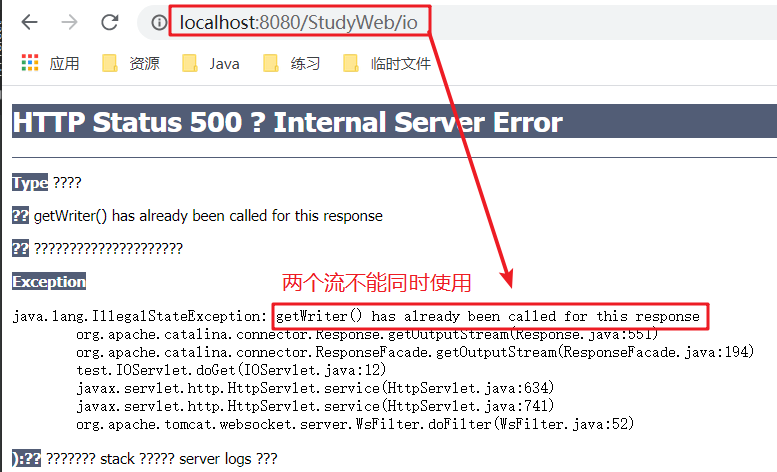

## 回传数据到客户端

```java
public class IOServlet extends HttpServlet {
    protected void doGet(HttpServletRequest request, HttpServletResponse response) throws ServletException, IOException {
         PrintWriter writer = response.getWriter();
         writer.write("response some information"+"\n");
         writer.write("回复客户端消息");
    }
}
```

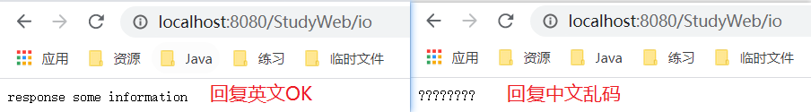

- 解决中文乱码的问题：方式一

```java
public class IOServlet extends HttpServlet {
    protected void doGet(HttpServletRequest request, HttpServletResponse response) throws ServletException, IOException {
        System.out.println(response.getCharacterEncoding());//得到默认字符集，ISO-8859-1
        //一定要在获取流之前设置，否则不起作用
        response.setCharacterEncoding("UTF-8"); //设置服务器字符集为UTF-8
        //通过响应头，设置浏览器也使用UTF-8字符集
        response.setHeader("Content-Type", "text/html;charset=UTF-8");
        PrintWriter writer = response.getWriter();
        writer.write("回复客户端消息");
    }
}
```

- 方式二：推荐使用

```java
public class IOServlet extends HttpServlet {
    protected void doGet(HttpServletRequest request, HttpServletResponse response) throws ServletException, IOException {
        //它会同时设置服务器和客户端都使用UTF-8字符集，还设置了响应头
        // 此方法一定要在获取流对象之前调用才有效
        response.setContentType("text/html;charset=UTF-8");
        PrintWriter writer = response.getWriter();
        System.out.println(response.getCharacterEncoding());//得到默认字符集，UTF-8
        writer.write("回复客户端消息");
    }
}
```

## 请求重定向

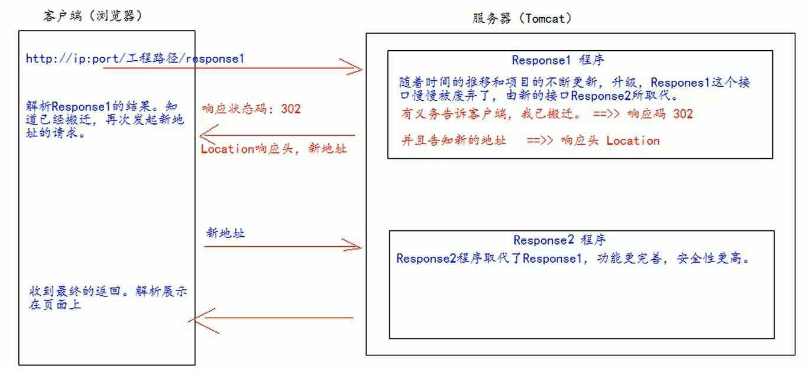

- **请求重定向的特点：**
  1. 浏览器地址栏会发生变化
  2. 两次请求
  3. 不共享Request域中数据
  4. 不能访问WEB-INF下的资源
  5. 可以访问工程外的资源

- **创建两个Servlet对象，方式一：**

```java
public class RespondServlet1 extends HttpServlet {
    protected void doGet(HttpServletRequest request, HttpServletResponse response) throws ServletException, IOException {

        System.out.println("RespondServlet1地址已搬迁");
        request.setAttribute("key","value");
        response.setStatus(302); //设置状态码
        response.setHeader("Location","http://localhost:8080/StudyWeb/respond2"); //设置重定向的URL
        //response.setHeader("Location","http://baidu.com"); 可以定位到百度页面,说明可以访问工程外的资源
    }
}
```

```java
public class RespondServlet2 extends HttpServlet {
    protected void doGet(HttpServletRequest request, HttpServletResponse response) throws ServletException, IOException {
        request.getAttribute("key"); //收到的value为空,说明不共享Request域中数据
        System.out.println("RespondServlet2返回数据给客户端");
        PrintWriter writer = response.getWriter(); //获取输出流
        writer.write("respond from RespondServlet2"); //RespondServlet2返回给客户端的信息
    }
}
```

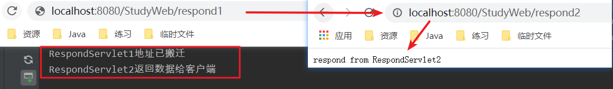

- 从结果可以看出浏览器地址栏会发生变化!!!
- **请求重定向方式二：推荐使用**

```java
public class RespondServlet1 extends HttpServlet {
    protected void doGet(HttpServletRequest request, HttpServletResponse response) throws ServletException, IOException {

        System.out.println("RespondServlet1地址已搬迁");
        //直接定位到目标地址
        response.sendRedirect("http://localhost:8080/StudyWeb/respond2");
    }
}
```

```java
public class RespondServlet2 extends HttpServlet {
    protected void doGet(HttpServletRequest request, HttpServletResponse response) throws ServletException, IOException {
        
        System.out.println("RespondServlet2返回数据给客户端");
        PrintWriter writer = response.getWriter();
        writer.write("respond from RespondServlet2");
    }
}
```

