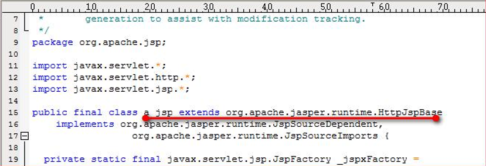
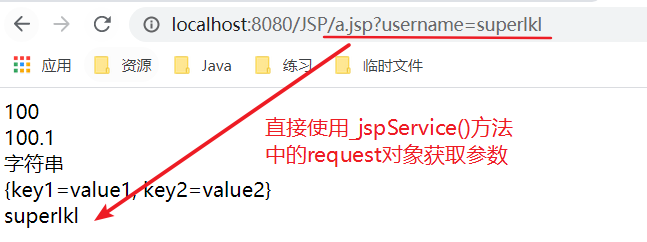
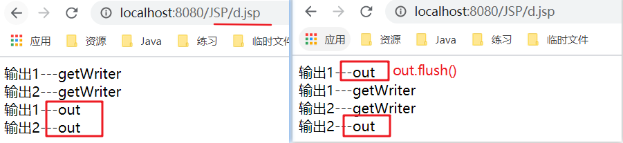

# JSP介绍

- jsp的全称是java server pages。Java的服务器页面
- jsp的主要作用是代替 Serlet 程序回传html页面的数据
- 因为Serlet 程序回传html页面数据是一件非常繁锁的事情。开发成本和维护成本都极高

---

- 如果使用Servlet回传 html 页面数据的代码： 

```java
public class PringHtml extends HttpServlet {
    @Override protected void doGet(HttpServletRequest req, HttpServletResponse resp) throws ServletException, IOException { // 通 过 响 应 的 回 传 流 回 传 html 页 面 数 据
        resp.setContentType("text/html; charset=UTF-8");
        PrintWriter writer = resp.getWriter();
        writer.write("<!DOCTYPE html>\r\n"); 
        writer.write(" <html lang=\"en\">\r\n"); 
        writer.write(" <head>\r\n"); 
        writer.write(" <meta charset=\"UTF-8\">\r\n"); 
        writer.write(" <title>Title</title>\r\n"); 
        writer.write(" </head>\r\n"); 
        writer.write(" <body>\r\n"); 
        writer.write(" 这是 html 页面数据 \r\n"); 
        writer.write(" </body>\r\n"); 
        writer.write("</html>\r\n"); 
        writer.write("\r\n");
    }
}
```

- 使用 jsp 回传一个简单 html 页面的代码： 

```jsp
<%@ page contentType="text/html;charset=UTF-8" language="java" %> 
<html> 
    <head> 
        <title>Title</title> 
    </head> 
    <body> 这是 html 页面数据 </body> 
</html>
```

- 如何创建 jsp 的页面? 直接在web工程目录下new一个jsp文件即可
- jsp 如何访问：jsp 页面和 html 页面一样，都是存放在 web 目录下。访问也跟访问 html 页面一样
- 比如： 在 web 目录下有如下的文件： 
  - a.html 页面 访问地址是 ------------------- http://ip:port/工程路径/a.html 
  - b.jsp 页面 访问地址是----------------------http://ip:port/工程路径/b.jsp

# JSP本质

- jsp 页面本质上是一个 Servlet 程序。
- 当我们第一次访问 jsp 页面的时候。Tomcat 服务器会帮我们把 jsp 页面翻译成为一个 java 源文件。并且对它进行编译成 为.class 字节码程序。我们打开 java 源文件不难发现其里面的内容是：



- 跟踪原代码发现，HttpJspBase 类。它直接地继承了 HttpServlet 类。也就是说。jsp 翻译出来的 java 类，它间接了继 承了 HttpServlet 类。也就是说，翻译出来的是一个 Servlet 程序


>**总结：通过翻译的 java 源代码我们就可以得到结论：jsp 就是 Servlet 程序**

- 去观察翻译出来的 a.jsp 程序的源代码，不难发现。其底层实现，也是通过输出流向上面在Servlet程序中那样。把 html 页面数据回传给客户端

# JSP的三种语法 

## jsp头部的page指令

- jsp 的 page 指令可以修改 jsp 页面中一些重要的属性，或者行为

```jsp
<%@ page contentType="text/html;charset=UTF-8" language="java" %>
```

- language属性： 表示 jsp 翻译后是什么语言文件。暂时只支持 java
-  contentType属性： 表示 jsp 返回的数据类型是什么。也是源码中 response.setContentType() 的参数值 
-  pageEncoding属性： 表示当前 jsp 页面文件本身的字符集
-  import属性： 跟 java 源代码中一样。用于导包，导类

---

- 两个属性是给 out 输出流使用

>-  autoFlush属性：设置当 out 输出流缓冲区满了之后，是否自动刷新冲级区。默认值是 true
>- buffer属性：设置 out 缓冲区的大小。默认是 8kb

## 声明脚本(极少使用)

- **格式：<%!      %>**
- 示例

```jsp
<%@ page import="java.util.Map" %>
<%@ page import="java.util.HashMap" %>
<%@ page contentType="text/html;charset=UTF-8" language="java" %>
<html>
<head>
    <title>a.jsp文件</title>
</head>
<body>
<!--声明类属性-->
<%!
    private Integer id;
    private String name;
    private static Map<String, String> map;
%>
<!--声明static静态代码块-->
<%!
    static {
        map = new HashMap<>();
        map.put("key1", "value1");
        map.put("key2", "value2");
    }
%>
<!--声明类方法-->
<%!
    public int sum(int a ,int b){
        return a+b;
    }
%>
<!--声明内部类-->
<%!
    static class Node{
        private Node next;
        private int data;
    }
%>

</body>
</html>
```


## 表达式脚本(常用)

- 表达式脚本的格式是：<%=表达式%>
- 表达式脚本的作用是：在jsp页面上输出数据。
- 表达式脚本的特点：
  1. 所有的表达式脚本都会被翻译到_jspService方法中
  2. 表达式脚本都会被制译成为out.print() 输出到页面上
  3. 由于表达式脚本翻译的内容都在 _jspService() 方法中，所以 _jspService()方法中的对象都可以直接使用
  4. 表达式脚本中的表达式不能以分号结束
- 示例

```jsp
<%=100 %><br/> <%--输出整型--%>
<%=100.1 %><br/> <%--输出浮点型--%>
<%="字符串" %><br/> <%--输出字符串--%>
<%=map %><br/> <%--输出对象--%>
```

- 查看a.jsp里的java文件中的_jspService方法

```java
public void _jspService(final javax.servlet.http.HttpServletRequest request, final javax.servlet.http.HttpServletResponse response)
    throws java.io.IOException, javax.servlet.ServletException {

    final java.lang.String _jspx_method = request.getMethod();
    if (!"GET".equals(_jspx_method) && !"POST".equals(_jspx_method) && !"HEAD".equals(_jspx_method) && !javax.servlet.DispatcherType.ERROR.equals(request.getDispatcherType())) {
        response.sendError(HttpServletResponse.SC_METHOD_NOT_ALLOWED, "JSPs only permit GET, POST or HEAD. Jasper also permits OPTIONS");
        return;
    }

    final javax.servlet.jsp.PageContext pageContext;
    javax.servlet.http.HttpSession session = null;
    final javax.servlet.ServletContext application;
    final javax.servlet.ServletConfig config;
    javax.servlet.jsp.JspWriter out = null;
    final java.lang.Object page = this;
    javax.servlet.jsp.JspWriter _jspx_out = null;
    javax.servlet.jsp.PageContext _jspx_page_context = null;


    try {
        response.setContentType("text/html;charset=UTF-8");
        pageContext = _jspxFactory.getPageContext(this, request, response,
                                                  null, true, 8192, true);
        _jspx_page_context = pageContext;
        application = pageContext.getServletContext();
        config = pageContext.getServletConfig();
        session = pageContext.getSession();
        out = pageContext.getOut();
        _jspx_out = out;

        out.write("\r\n");
        out.write("\r\n");
        out.write("\r\n");
        out.write("<html>\r\n");
        out.write("<head>\r\n");
        out.write("    <title>a.jsp文件</title>\r\n");
        out.write("</head>\r\n");
        out.write("<body>\r\n");
        out.write('\r');
        out.write('\n');
        out.write('\r');
        out.write('\n');
        out.write('\r');
        out.write('\n');
        out.write('\r');
        out.write('\n');
        out.write('\r');
        out.write('\n');
        out.write('\r');
        out.write('\n');
        out.write('\r');
        out.write('\n');
        out.write('\r');
        out.write('\n');
        out.print(100 ); //输出整型
        out.write("<br/>\r\n");
        out.print(100.1 ); //输出浮点型
        out.write("<br/>\r\n");
        out.print("字符串" ); //输出字符串
        out.write("<br/>\r\n");
        out.print(map ); //输出对象
        out.write("<br/>\r\n");
        out.write("\r\n");
        out.write("\r\n");
        out.write("</body>\r\n");
        out.write("</html>\r\n");
    } catch (java.lang.Throwable t) {
        if (!(t instanceof javax.servlet.jsp.SkipPageException)){
            out = _jspx_out;
            if (out != null && out.getBufferSize() != 0)
                try {
                    if (response.isCommitted()) {
                        out.flush();
                    } else {
                        out.clearBuffer();
                    }
                } catch (java.io.IOException e) {}
            if (_jspx_page_context != null) _jspx_page_context.handlePageException(t);
            else throw new ServletException(t);
        }
    } finally {
        _jspxFactory.releasePageContext(_jspx_page_context);
    }
}
```


```jsp
<%=request.getParameter("username")%>
```



## 代码脚本

- 格式：<% java语句 %>
- 代码脚本的作用是：可以在jsp页面中，编写我们自己需要的功能（写的是java语句）
- 代码脚本的特点是：
  1. 代码脚本翻译之后都在 _jspService 方法中
  2. 代码脚本由于翻译到 _jspService() 方法中，所以在 _jspService() 方法中的现有对象都可以直接使用
  3. 还可以由多个代码脚本块组合完成一个完整的java语句
  4. 代码脚本还可以和表达式脚本一起组合使用，在jsp页面上输出数据

```jsp
<%
    /* if(){}else{}语句 */
    int a = new Random().nextInt(10);
    if (a > 5) {
        System.out.println(a + "大大大"); //向控制台输出
    } else {
        System.out.println(a + "小小小");
    }
%>
<%
    /* for循环 */
    for (int i = 0; i < 5; i++) {
        System.out.print(i + " ");
    }
%>
<%
    System.out.println();
    String username = request.getParameter("username");
    System.out.println("用户名称是：" + username);
%>

<!--在控制台输出:
大大大
0 1 2 3 4 
用户名称是：superman
-->
```

- 组合使用，并输出到页面

```jsp
<% 
    /* for循环 */
    for (int i = 0; i < 5; i++)             /* 1 */
    {
%>                                          /* 1 */
<%=i                                        /* 2 输出到页面*/ 
%> /* 2 */
<%                                          /* 3 */
    } 
%>                                          /* 3 */
```

# 九大内置对象

- jsp 中的内置对象，是指 Tomcat 在翻译 jsp 页面成为 Servlet 源代码后，内部提供的九大对象，叫内置对象


## 四大域对象

- 四个域对象分别是： 

>- pageContext (PageContextImpl 类)----------------------当前 jsp 页面范围内有效 
>- request (HttpServletRequest 类)--------------------------一次请求内有效 
>- session (HttpSession 类)------------------------------------一个会话范围内有效（打开浏览器访问服务器，直到关闭浏览器） 
>- application (ServletContext 类)------------------------------整个 web 工程范围内都有效（只要 web 工程不停止，数据都在）

- 域对象是可以像 Map 一样存取数据的对象。四个域对象功能一样。不同的是它们对数据的存取范围。

- 虽然四个域对象都可以存取数据。在使用上它们是有优先顺序的。

- 四个域在使用的时候，优先顺序分别是：

  - 他们从小到大的范围的顺序，可以最大的释放资源

  - pageContext --------------->>> request----------------->>> session------------------->>> application

---

- **示例：请求转发**

- b.jsp页面

```jsp
<body>
<h1>b.jsp</h1>
<%
    pageContext.setAttribute("key", "pageContext");
    request.setAttribute("key", "request");
    session.setAttribute("key", "session");
    application.setAttribute("key", "application");
%>
pageContext域是否有值：<%=pageContext.getAttribute("key")%><br/>

request域是否有值：<%=request.getAttribute("key")%><br/>

session域是否有值：<%=session.getAttribute("key")%><br/>

application域是否有值：<%=application.getAttribute("key")%>
<%
    request.getRequestDispatcher("/c.jsp").forward(request, response); //--------请求转发到c.jsp页面
%>
</body>
```

- c.jsp页面

```jsp
<body>
<h1>c.jsp</h1>
pageContext域是否有值：<%=pageContext.getAttribute("key")%><br/>

request域是否有值：<%=request.getAttribute("key")%><br/>

session域是否有值：<%=session.getAttribute("key")%><br/>

application域是否有值：<%=application.getAttribute("key")%>
</body>
```


- pageContext 只在当前页面有效。请求转发离开了b.jsp页面，所以c.jsp页面取不到；
- request 是一次请求有效。而请求转发就是一次请求，所以c.jsp页面取到了b.jsp页面的值；
- session 一个会话范围内有效。虽然访问了两个页面，但是浏览器没有关闭，所以c.jsp页面取到了b.jsp页面的值；
- application 整个 web 工程范围内都有效。服务器没有停止，所以c.jsp页面取到了b.jsp页面的值。


# 输出out和getWriter的区别


- 证明out确实会执行flush()后追加数据到response缓冲区

```jsp
<body>
<%
    out.write("输出1---out<br/>");
    out.write("输出2---out<br/>");
    response.getWriter().write("输出1---getWriter<br/>");
    response.getWriter().write("输出2---getWriter<br/>");
%>
</body>
```

- flush()

```jsp
<%
    out.write("输出1---out<br/>");
    out.flush();
    out.write("输出2---out<br/>");
    response.getWriter().write("输出1---getWriter<br/>");
    response.getWriter().write("输出2---getWriter<br/>");
%>
```



- **由于jsp 翻译之后，底层源代码都是使用out 来进行输出，所以一般情况下。我们在jsp页面中统一使用out来进行输出。避免打乱页面输出内容的顺序**
- out.write()与out.print()的区别

>- out.write() 输出字符串没有问题 
>- out.print() 输出任意数据都没有问题（都转换成为字符串后调用的write输出）
>- 深入源码，浅出结论：在jsp页面中，可以统一使用out.print() 来进行输出

# 常用标签

## 静态包含


- 目的：能够更好的处理代码的维护


- main.jsp

```jsp
<%@ page contentType="text/html;charset=UTF-8" language="java" %>
<html>
<head>
    <title>主页</title>
</head>
<body>
头部信息<br/>
主体内容<br/>
<!--
    include file=""%>就是静态包含
    file 属性指定你要包含的jsp页面的路径
    地址中第一个斜杠/,表示为http://ip:port/工程路径/ 映射到代码的web目录
    静态包含的特点：
    1.静态包合不会翻译被包含的jsp页面。
    2.静态包合其实是把被包合的jsp页面的代码持贝到包含的位置执行输出
-->
<%@include file="/include/foot.jsp"%>
</body>
</html>
```

- foot.jsp

```jsp
<%@ page contentType="text/html;charset=UTF-8" language="java" %>
<html>
<head>
    <title>页脚</title>
</head>
<body>
页脚信息<br/>
页脚添加信息
</body>
</html>
```

>在main.jsp文件中包含了foot.jsp文件，只要在foot.jsp中修改内容，那么所有包含foot.jsp的jsp文件内容都会被修改，有利于代码的维护

## 动态包含

- 格式：`<jsp:include page="">`
- page 属性是指定你要包含的jsp页面的路径
- 动态包含也可以像静态包含一样。把被包含的内容执行输出到包含位置
- 动态包含的特点：

>1. 动态包含会把包含的jsp页面也翻译成为java代码
>2. 动态包含底层代码使用如下代码去竭用被包含的jsp页面执行输出：
>
>```java
>JspRuntimeLibrary.include（request，response，"/include/footer.jsp"，out，false）；
>```
>
>3. 动态包舍，还可以传递参数

- main.jsp

```jsp
<%@ page contentType="text/html;charset=UTF-8" language="java" %>
<html>
    <head>
        <title>主页</title>
    </head>
    <body>
        头部信息<br/>
        主体内容<br/>
        <jsp:include page="/include/foot.jsp">
            <!--必须要加参数信息，否则会报错-->
            <jsp:param name="username" value="superlkl"/>
            <jsp:param name="password" value="123456"/>
        </jsp:include>
    </body>
</html>
```

- foot.jsp

```jsp
<%@ page contentType="text/html;charset=UTF-8" language="java" %>
<html>
    <head>
        <title>页脚</title>
    </head>
    <body>
        页脚信息<br/>
        页脚添加信息<br/>
        <!--必须要加参数信息，否则会报错-->
        <%=request.getParameter("username")%>
        <%=request.getParameter("password")%>
    </body>
</html>
```

- 在动态包含时未带参数信息对main.jsp进行访问


- 底层原理


- 访问main.jsp


## 请求转发

- **a.jsp**

```jsp
<body>
    <h1>
        a.jsp页面
    </h1>
    <!--请求转发 page是要跳转到的目标页面-->
    <jsp:forward page="b.jsp">
         <!--将参数放入request域中-->
        <jsp:param name="username" value="superman"/>
    </jsp:forward>
</body>
```

- **b.jsp**

```jsp
<body>
    <h1>
        b.jsp页面
    </h1>
    <%=request.getParameter("username")%>
</body>
```


- 请求转发的过程


