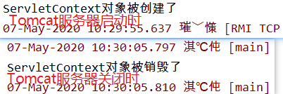

# Listener监听器

1. Listener 监听器它是JavaWeb的三大组件之一
2. JavaWeb的三大组件分别是：Servlet 程序、Filter 过滤器、Listener监听器。
3. Listener它是JavaEE的规范，就是接口
4. 监听器的作用是，监听某种事物的变化。然后通过回调函数，反馈给客户（程序）去做一些相应的处理。

# ServletContextListener

```java
public interface ServletContextListener extends EventListener {
    //ServletContex对象创建时调用
    void contextInitialized(ServletContextEvent var1);

    //ServletContex对象销毁时调用
    void contextDestroyed(ServletContextEvent var1);
}
```

- 示例

```java
public class MyServletContextListener implements ServletContextListener {
    @Override
    public void contextInitialized(ServletContextEvent servletContextEvent) {
        System.out.println("ServletContext对象被创建了");
    }

    @Override
    public void contextDestroyed(ServletContextEvent servletContextEvent) {
        System.out.println("ServletContext对象被销毁了");
    }
}
```

- 还需要在web.xml进行配置

```xml
<?xml version="1.0" encoding="UTF-8"?>
<web-app xmlns="http://xmlns.jcp.org/xml/ns/javaee"
                   xmlns:xsi="http://www.w3.org/2001/XMLSchema-instance"
                   xsi:schemaLocation="http://xmlns.jcp.org/xml/ns/javaee http://xmlns.jcp.org/xml/ns/javaee/web-app_4_0.xsd"
                   version="4.0">
<listener>
    <listener-class>com.kl.MyServletContextListener</listener-class>
</listener>
</web-app>
```

