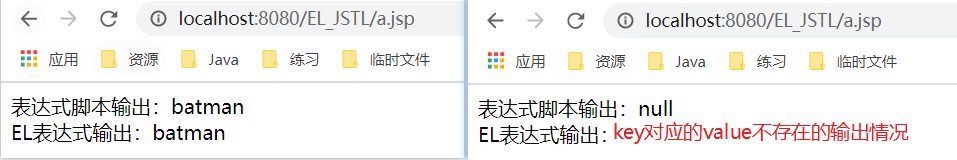
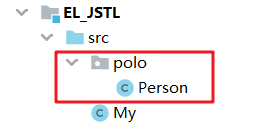
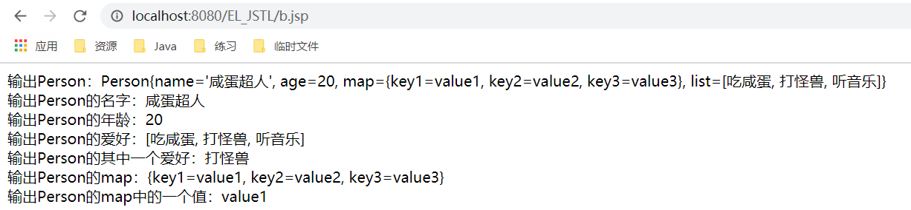
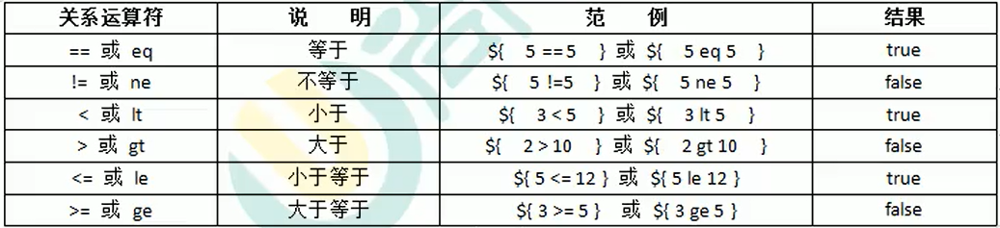
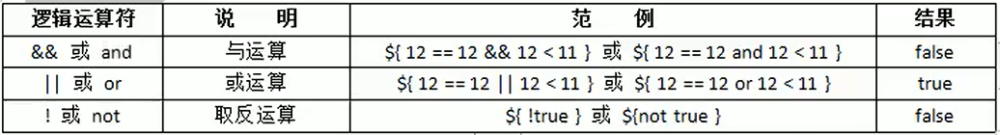
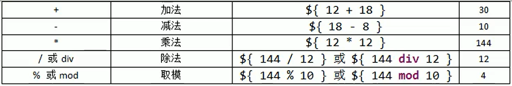
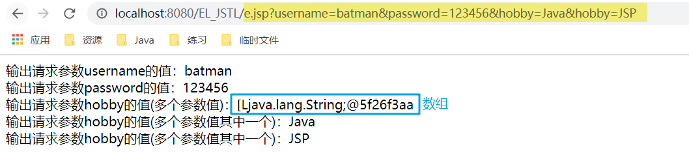
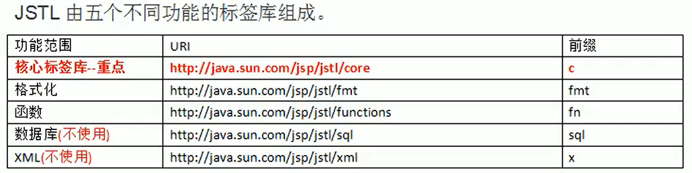
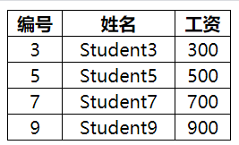
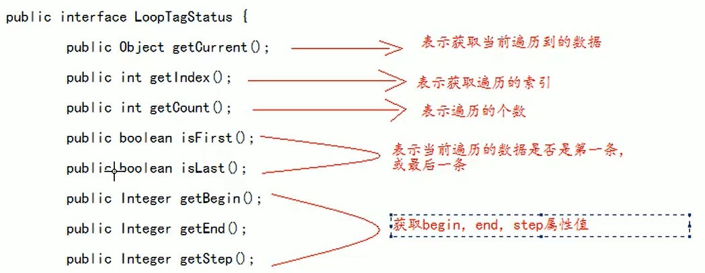

# EL表达式

- EL表达式的全称是：Expression Language。是表达式语言。
- EL表达式的什么作用：EL表达式主要是代替 jsp 页面中的表达式脚本在 jsp 页面中进行数据的输出。
- 因为EL表达式在输出数据的时候，要比jsp的表达式脚本要简洁很多。

---

- 对比示例

```elm
<%@ page contentType="text/html;charset=UTF-8" language="java" %>
<html>
<head>
    <title>EL表达式</title>
</head>
<body>
<%
    request.setAttribute("username", "batman");
%>
表达式脚本输出：<%=request.getAttribute("username")%>
<br/>
EL表达式输出：${username}
</body>
</html>
```



- EL表达式的格式是：${表达式}
- EL表达式在输出null 值的时候，输出的是空串。jsp表达式脚本输出null值的时候，输出的是null 字符串。

## 搜索域数据的顺序

- EL 表达式主要是在jsp页面中输出数据。
- 主要是输出域对象中的数据。
- 当四个域中都有相同的key的数据的时候，EL表达式会按照四个域的从小到大的顺序去进行搜索，找到就输出。

```elm
<body>
<%
    pageContext.setAttribute("username", "batman");
    request.setAttribute("username", "batman");
    session.setAttribute("username", "batman");
    application.setAttribute("username", "batman");
%>
${username}
</body>
```

## 输出复杂数据

- Person类中有名字、年龄、List数组、Map字典
- 注意：创建的Person类必须放在src目录下的一个包里，否则在b.jsp文件中读取不到该类



- My这个类在b.jsp文件中就无法使用!!!

```elm
<body>
<%
    Person person = new Person();
    person.setName("咸蛋超人");
    person.setAge(20);
    List<String> hobby = new ArrayList<>();
    hobby.add("吃咸蛋");
    hobby.add("打怪兽");
    hobby.add("听音乐");
    person.setList(hobby);
    Map<String,String> map = new HashMap<>();
    map.put("key1", "value1");
    map.put("key2", "value2");
    map.put("key3", "value3");
    person.setMap(map);
    pageContext.setAttribute("eggMan", person); //把Person对象放入pageContext域中才可以在页面进行输出
%>
输出Person：${eggMan}<br/>
输出Person的名字：${eggMan.name}<br/> <!--会默认调用person类中的getName()方法,这是底层原理-->
输出Person的年龄：${eggMan.age}<br/> <!--会默认调用person类中的getAge()方法-->
输出Person的爱好：${eggMan.list}<br/>
输出Person的其中一个爱好：${egg.list[1]}<br/>
输出Person的map：${eggMan.map}<br/>
输出Person的map中的一个值：${eggMan.map.key1}<br/>
</body>
```



## 运算

- 关系运算 



- 逻辑运算



- 算术运算



## empty运算

- empty运算可以判断一个数据是否为空，如果为空，则输出true，不为空输出false。
- 以下几种情况为空：

```elm
<body>

<%
    //1. 值为null值的时候，为空
    request.setAttribute("1",null);
    //2. 值为空串的时候，为空
    request.setAttribute("2","");
    //3. 值是object类型数组，长度为零的时候
    request.setAttribute("3",new Object[]{});
    //4. list集合，元素个数为零
    List<String> list = new ArrayList<>();
    request.setAttribute("4",list);
    //5. map集合，元素个数为零
    Map<String,String> map = new HashMap<>();
    request.setAttribute("5",map);
%>
${empty 1}<br/>
${empty 2}<br/>
${empty 3}<br/>
${empty 4}<br/>
${empty 5}<br/>

</body>

<!--在页面全部输出false-->
```

## 三元运算

- 表达式1？表达式2：表达式3
- 如果表达式1的值为真，返回表达式2的值，如果表达式1的值为假，返回表达式3的值。

## .点运算和[ ]中括号运算符

```elm
<body>

<%
  Map<String,String> map = new HashMap<>();
  map.put("c.a.t", "cat");
  map.put("d-o-g", "dog");
  map.put("p*i*g", "pig");
  request.setAttribute("map", map);
%>
输出map:${map}<br/>
输出map中对应key的value：${map['c.a.t']}<br/>
输出map中对应key的value：${map["d-o-g"]}<br/>

</body>
<!--
输出map:{p*i*g=pig, c.a.t=cat, d-o-g=dog}
输出map中对应key的value:cat
输出map中对应key的value:dog
-->
```

>因为map中的key有特殊字符,直接用点运行读取对应key的value是行不通的。这种情况需要把key放入中括号运算符中并对key加上双引号或者单引号

## EL中的11个隐含对象

- EL 个达式中 11 个隐含对象，是 EL 表达式中自己定义的，可以直接使用

|       变量       |         类型         |                         作用                         |
| :--------------: | :------------------: | :--------------------------------------------------: |
|   pageContext    |   PageContextImpl    |           它可以获取 jsp 中的九大内置对象            |
|    pageScope     |  Map<String,Object>  |          它可以获取 pageContext 域中的数据           |
|   requestScope   |  Map<String,Object>  |            它可以获取 Request 域中的数据             |
|   sessionScope   |  Map<String,Object>  |            它可以获取 Session 域中的数据             |
| applicationScope |  Map<String,Object>  |         它可以获取 ServletContext 域中的数据         |
|      param       |  Map<String,String>  |                它可以获取请求参数的值                |
|   paramValues    | Map<String,String[]> |    它也可以获取请求参数的值，获取多个值的时候使用    |
|      header      |  Map<String,String>  |                它可以获取请求头的信息                |
|   headerValues   | Map<String,String[]> |    它可以获取请求头的信息，它可以获取多个值的情况    |
|      cookie      |  Map<String,Cookie>  |           它可以获取当前请求的 Cookie 信息           |
|    initParam     |  Map<String,String>  | 它可以获取在 web.xml 中配置的< context-param >上下文 |

### EL获取四个特定域中的属性

- pageScope ====== pageContext 域 
- requestScope ====== Request 域 
- sessionScope ====== Session 域 
- applicationScope ====== ServletContext 域

```elm
<body>
<%
    pageContext.setAttribute("key1", "pageContext");
    request.setAttribute("key1", "request");
    session.setAttribute("key1", "session");
    application.setAttribute("key1", "application");
%>
${pageScope.key1}<br/>
${requestScope.key1}<br/>
${sessionScope.key1}<br/>
${applicationScope.key1}
</body>
<!--输出：
pageContext
request
session
application
-->
```

>当四个域中的key相同的，系统默认是按从小到大的优先级搜寻并输出其中一个，使用EL获取四个特定域中的属性则可以选择性的输出对应域中的value

### pageContext 对象的使用

- 它可以获取 jsp 中的九大内置对象

```elm
<body>
1. 协议：${pageContext.request.scheme}<br/>
2. 服务器 ip：${pageContext.request.serverName}<br/>
3. 服务器端口：${pageContext.request.serverPort}<br/>
4. 获取工程路径：${pageContext.request.servletPath}<br/>
5. 获取请求方法：${pageContext.request.method}<br/>
6. 获取客户端 ip 地址：${pageContext.request.remoteHost}<br/>
7. 获取会话的 id 编号：${pageContext.request.session.id}<br/>
</body>
```

-  小技巧：

```elm
<body>
<%=request.getScheme()%><br/> <!--获取协议-->
<%
    pageContext.setAttribute("req",request); //利用pageContext获取协议
%>
1. 协议：${req.scheme}<br/>
</body>
```

### EL表达式其他隐含对象的使用

- param获取参数

```elm
<body>
输出请求参数username的值：${param.username}<br/>
输出请求参数password的值：${param.password}<br/>
输出请求参数hobby的值(多个参数值)：${paramValues.hobby}<br/> <%--返回的是参数数组--%>
输出请求参数hobby的值(多个参数值其中一个)：${paramValues.hobby[0]}<br/>
输出请求参数hobby的值(多个参数值其中一个)：${paramValues.hobby[1]}<br/>
</body>
```



# JSTL标签库

- JSTL标签库全称是指JSP Standard Tag Library JSP标准标签库。是一个不断完善的开放源代码的JSP标签库
- **EL表达式主要是为了替换jsp中的表达式脚本，而标签库则是为了替换代码脚本。这样使得整个jsp页面变得更佳简洁**



## 使用步骤

1. 先导入JSTL标签库的jar包。
   - taglibs-standard-impl-1.2.1.jar
   - taglibs-standard-spec-1.2.1.jar
2. 第二步，使用 taglib 指令引入标签库。

```jsp
<%@ taglib prefix="c" uri="http://java.sun.com/jsp/jstl/core" %>
```

## core核心库的使用

-  < c:set/ >（使用很少）：set 标签可以往域中保存数据

```jsp
<body>
<!--作用：set 标签可以往域中保存数据
    
    scope 属性设置保存到哪个域
    page 表示PageContext域（默认值）
    request 表示 Request域
    session 表示Session域
    application 表示 ServletContext域
    var 属性设置key是多少
    value 属性设置值-->
保存之前：${requestScope.key1}<br/>   <!--取出key1对应的value-->
<c:set scope="request" var="key1" value="apple"/> <!-- 等同于===>域对象.setAttribute(key，value)；-->
保存之后：${requestScope.key1}<br/>
</body>
```

---

- **< c:if/ >：if 标签用来做 if 判断**

```jsp
<body>
    <!--test属性表示判断的条件(使用EL表达式输出)
-->
<c:if test="${12 == 12}">
    <h1>正确</h1>
</c:if>
<c:if test="${12 != 13}">
    <h1>正确</h1>
</c:if>
</body>
```

- 注：只有test测试的内容为true时才会输出标签体中的内容

---

- **< c:choose>< c:when >< c:otherwise >标签**
  - 作用：多路判断。跟 switch...case....default 非常接近

```jsp
<body>
<%
    request.setAttribute("height",180);
%>
<!--choose标签开始选择判断
    when标签表示每一种判断情况
    test属性表示当前这种判断情况的值-->
<c:choose>
    <%--1.在<c:choose>标签里不能使用html注释,要使用jsp注释,其他标签可以使用
        2.when 标签的父标签一定要是 choose 标签--%>
    <!--往request域中放入数据进行测试(这是html注释,这里为了颜色显示方便使用)-->
    <c:when test="${requestScope.height > 180}">
        <h1>打篮球的身高</h1>
    </c:when>
    <c:when test="${requestScope.height > 170}">
        <h1>踢足球的身高</h1>
    </c:when>
     <c:otherwise> <!--其他情况-->
        <h1>不适合当运动员</h1>
    </c:otherwise>
</c:choose>
</body>
<!--输出：
踢足球的身高
-->
```

- 注：代码从上往下执行，若其中一个test符合要求了下面的代码就不会再执行了，相等于被break掉

---

-  **< c:forEach/ >：遍历输出使用**
- 示例一：遍历遍历 1 到 5，并输出

```jsp
<body>
<!--
    begin属性设置开始的索引
    end 属性设置结束的索引
    var 属性表示循环的变量（也是当前正在遍历到的数据）
-->
<c:forEach begin="0" end="5" var="i">
    ${i}
</c:forEach>
</body>
```

- 示例二：遍历Object数组对象

```jsp
<body>
<%
    request.setAttribute("array",new String[]{"110","120","119"});
%>
<!--
   for (Object item: arr)  
   items 表示遍历的数据源（遍历的集合）
   var 表示当前遍历到的数据
-->
<c:forEach items="${requestScope.array}" var="i">
    ${i}
</c:forEach>
</body>
```

- 示例三：遍历map对象

```jsp
<body>
<%
    Map<String,String> map = new HashMap<>();
    map.put("苹果", "apple");
    map.put("梨子", "pear");
    map.put("橘子", "orange");
    request.setAttribute("map", map);
%>
<c:forEach items="${requestScope.map}" var="i">
    ${i}<br/> <!--输出map里的键值对-->
    ${i.key}<br/> <!--只输出map里的key-->
    ${i.value} <!--只输出map里的value-->
</c:forEach>
</body>
```

- 示例四：遍历List集合

```jsp
<body>
<%
    List<Student> studentList = new ArrayList<>();
    for (int i = 1; i <= 10; i++) {
        studentList.add(new Student(i,"Student"+i,i*100));
    }
    request.setAttribute("stu",studentList);
%>
<!--items表示遍历的集合
    var 表示遍历到的数据
    begin 表示遍历的开始索引值end 表示结索的索引值
    step 属性表示遍历的步长值
    varStatus 属性表示当前遍历到的数据的状态
    or（int i=1；i<10；i+=2）
-->
<table>
    <tr>
        <th>编号</th>
        <th>姓名</th>
        <th>工资</th>
    </tr>
<c:forEach items="${requestScope.stu}" var="student" begin="2" end="10" step="2" varStatus="status">
    <tr>
        <td>${student.id}</td>
        <td>${student.name}</td>
        <td>${student.salary}</td>
    </tr>
</c:forEach>
</table>
</body>
```

- 输出：

- varStatus类实现的接口



>- begin="2" end="10" step="2" varStatus="status"
>- begin end step varStatus都是可选择的，不设置就默认从0开始进行遍历


