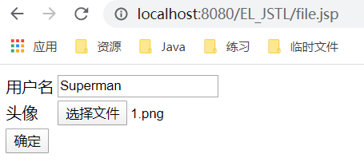
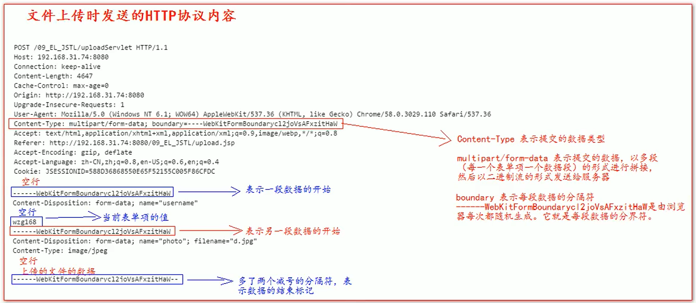
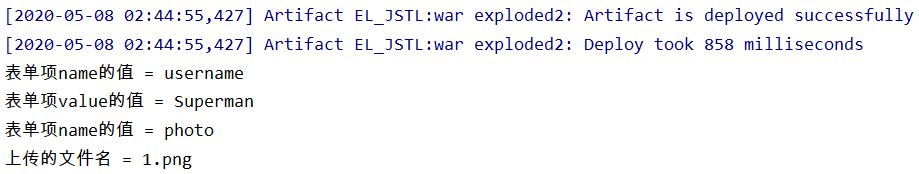
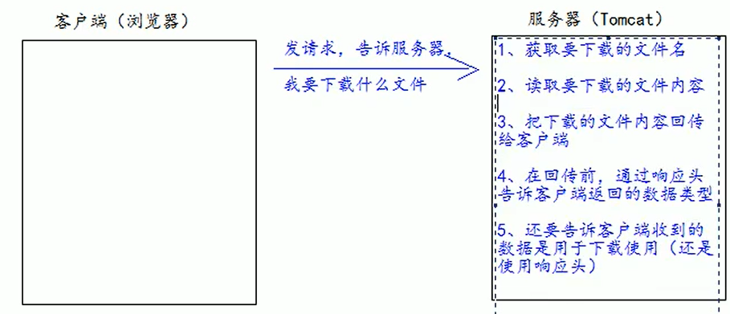
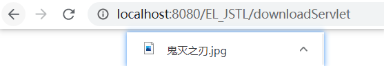

# 文件的上传和下载

- 文件的上传和下载，是非常常见的功能。很多的系统中，或者软件中都经常使用文件的上传和下载
- 比如：QQ头像，就使用了上传。邮箱中也有附件的上传和下载功能。
- OA系统中审批有附件材料的上传

# 文件的上传

1. 要有一个 form 标签，method=post 请求 
2. form 标签的 encType 属性值必须为 multipart/form-data 值 
3. 在 form 标签中使用 input type=file 添加上传的文件
4. 编写服务器代码（Servlet 程序）接收，处理上传的数据。

>encType=multipart / form-data 表示提交的数据，以多段（每一个表单项一个数据段）的形式进行拼 接，然后以二进制流的形式发送给服务器

## 表单

- file.jsp

```jsp
<%@ page contentType="text/html;charset=UTF-8" language="java" %>
<html>
<head>
    <title>文件上传</title>
</head>
<body>
    <form action="http://localhost:8080/EL_JSTL/uploadServlet" method="post" enctype="multipart/form-data">
        <table>
        <tr>
            <td>用户名</td>
            <td><input type="text" name="username"></td>
        </tr>
        <tr>
            <td>头像</td>
            <td><input type="file" name="photo"</td>
        </tr>
        <tr>
            <td><input type="submit" value="确定"></td>
        </tr>
        </table>
    </form>
</body>
</html>
```



- 文件上传，HTTP 协议的说明：



## 导入jar包

- commons-fileupload.jar 需要依赖 commons-io.jar 这个包，所以两个包都要引入
- 第一步，就是需要导入两个 jar 包： commons-fileupload-1.2.1.jar commons-io-1.4.jar
- commons-fileupload.jar 和 commons-io.jar 包中，我们常用的类有哪些？

```java
ServletFileUpload类 //用于解析上传的数据
FileItem类 //表示每一个表单项
boolean ServletFileUpload.isMultipartContent(HttpServletRequest request) //判断当前上传的数据格式是否是多段的格式。
publicList<FileItem>parseRequest(HttpServletRequestrequest) //解析上传的数据
boolean FileItem.isFormField() //判断当前这个表单项，是普通的表单项。还是上传的文件类型;true 表示普通类型的表单项 false 表示上传的文件类型
String FileItem.getFieldName() //获取表单项的 name 属性值
String FileItem.getString() //获取当前表单项的值,即在界面输入的数据value
String FileItem.getName(); //获取上传的文件名
void FileItem.write( file ) //将上传的文件写到 参数 file 所指向的硬盘位置
```


## 在Servlet类中调用API

```java
@SuppressWarnings("unchecked")
public class UploadServlet extends HttpServlet {
    @Override
    protected void doPost(HttpServletRequest req, HttpServletResponse resp) throws ServletException, IOException {
        //1.先判断上传的文件是否是多段数据(只有是多段数据,才是文件上传的)
        if (ServletFileUpload.isMultipartContent(req)){
            //创建FileItemFactory工厂实现类
            FileItemFactory fileItemFactory = new DiskFileItemFactory();
            //创建用于解析上传数据的工具类ServletFileUpload
            ServletFileUpload servletFileUpload = new ServletFileUpload(fileItemFactory);
            try {
                //解析上传的数据，得到每一个表单项FileItem
                List<FileItem> list = servletFileUpload.parseRequest(req);
                //循环判断每一个表单项是普通类型还是上传的文件类型
                for (FileItem fileItem : list) {
                    //处理普通表单项
                    if (fileItem.isFormField()){
                        System.out.println("表单项name的值 = "+fileItem.getFieldName());
                        //表单项value的值即用户在input输入的值,显示获取"UTF-8"编码的value,解决中文乱码问题
                        System.out.println("表单项value的值 = "+fileItem.getString("UTF-8"));
                    }else {
                        //处理上传的文件
                        System.out.println("表单项name的值 = "+fileItem.getFieldName());
                        System.out.println("上传的文件名 = "+fileItem.getName());
                        //将上传的文件输出到指定硬盘路径下
                        fileItem.write(new File("e:\\"+fileItem.getName()));
                    }
                }
            } catch (Exception e) {
                e.printStackTrace();
            }
        }
    }
}
```



# 文件的下载



```java
public class DownLoadServlet extends HttpServlet {
    @Override
    protected void doGet(HttpServletRequest req, HttpServletResponse resp) throws ServletException, IOException {
        //1.获取要下载的文件名
        String photoName = "1.png";

        //2.读取要下载的文件内容,通过ServletContext对象可以读取
        ServletContext servletContext = getServletContext();

        //web工程下的文件路径(web目录下的file文件目录一定不能大写,大写就会被拒绝访问)
        String filePath = "/file/" + photoName;
        //获取要下载的文件类型
        String mimeType = servletContext.getMimeType(filePath);
        System.out.println("下载的文件类型：" + mimeType); //下载的文件类型：image/png

        //3.在回传前通过响应头告诉客户端返回的数据类型
        resp.setContentType(mimeType);

        //4.还有告诉客户端收到的数据是用于下载使用的(依旧要使用响应头)
        // content-Disposition响应头，表示收到的数据怎么处理
        // attachment表示附件，表示下载使用
        // filename=表示指定下载的文件名,即浏览器下载时显示的图片名字,可以和web目录的的文件名不相同
        resp.setHeader("Content-Disposition", "attachment; fileName=" + photoName)

        //5.获取文件的输入流和响应的输出流
        InputStream resource = servletContext.getResourceAsStream(filePath);
        ServletOutputStream outputStream = resp.getOutputStream();

        //6.把下载的文件回传给客户端
        //读取流中的全部数,复制给输出流,输出到客户端
        IOUtils.copy(resource, outputStream);
    }
}
```

- **说明：**目录名大写后会访问到空指针异常!!!

- 修改上面的代码，让客户端下载的图片名为"鬼灭之刃"

```java
 resp.setHeader("Content-Disposition", "attachment; fileName=" + URLEncoder.encode("鬼灭之刃.png", StandardCharsets.UTF_8)); //注:是鬼灭之刃.png,别少了文件的后缀名
```



# URLEncoder 

- 解决 IE 和谷歌浏览器的 附件中 文名问题
- 如果客户端浏览器是 IE 浏览器 或者 是谷歌浏览器。我们需要使用 URLEncoder 类先对中文名进行 UTF-8 的编码 操作。 因为 IE 浏览器和谷歌浏览器收到含有编码后的字符串后会以 UTF-8 字符集进行解码显示

```java
// 把中文名进行 UTF-8 编码操作
String str = "attachment; fileName=" + URLEncoder.encode("中文.jpg", "UTF-8"); 
// 然后把编码后的字符串设置到响应头中
response.setHeader("Content-Disposition", str);
```

# Base64解编码

```java
public class Base64Test {
    public static void main(String[] args) {
        String content = "这是Base64需要编码的内容";
        //1.创建一个Base64编码器(Base64的构造函数是私有的,只能通过get方法获取)
        Base64.Encoder encoder = Base64.getEncoder();
        //2.按照UTF-8的规则执行编码操作
        byte[] encode = encoder.encode(content.getBytes(StandardCharsets.UTF_8));
        String s1 = new String(encode);
        System.out.println(s1); //6L+Z5pivQmFzZTY06ZyA6KaB57yW56CB55qE5YaF5a65

        //创建Base64解码器
        Base64.Decoder decoder = Base64.getDecoder();
        //解码
        byte[] decode = decoder.decode(encode);
        String s2 = new String(decode,StandardCharsets.UTF_8); //IDEA默认的就是UTF-8编码,第二个参数可以省略
        System.out.println(s2); //这是Base64需要编码的内容
    }
}
```

- 因为火狐使用的是 BASE64 的编解码方式还原响应中的汉字。所以需要使用 BASE64Encoder 类进行编码操作

```java
//获取浏览器信息
String header = req.getHeader("User=Agent");
//判断是否是火狐浏览器
if (header.contains("Firefox")) {
    // 1.使用下面的格式进行 Base64 编码后
    Base64.Encoder encoder = Base64.getEncoder();
    byte[] encode = encoder.encode("中文.jpg".getBytes(StandardCharsets.UTF_8));
    String s = new String(encode);
    String str = "attachment; fileName=" + "=?utf-8?B?" + s + "?=";
    // 2.设置到响应头中
    resp.setHeader("Content-Disposition", str);
} else {
    //把中文名进行UTF-8编码操作
    String str = "attachment; fileName=" + URLEncoder.encode("鬼灭之刃.jpg", StandardCharsets.UTF_8);
    //把编码后的字符串设置到响应头中
    resp.setHeader("Content-Disposition", str);
}
```

