# Cookie

## 什么是 Cookie?

- Cookie 翻译过来是饼干的意思
- Cookie 是服务器通知客户端保存键值对的一种技术
- 客户端有了 Cookie 后，每次请求都发送给服务器
- 每个 Cookie 的大小不能超过 4kb

## Cookie 联调页面

```jsp
<!DOCTYPE html PUBLIC "-//W3C//DTD HTML 4.01 Transitional//EN" "http://www.w3.org/TR/html4/loose.dtd">
<html lang="en">
<head>
<meta http-equiv="Content-Type" content="text/html; charset=UTF-8">
<title>Cookie</title>
   <base href="http://localhost:8080/cookie_session/">
<style type="text/css">

   ul li {
      list-style: none;
   }
   
</style>
</head>
<body>
      <ol>
         <li><a href="cookieServlet?action=creatCookie">Cookie的创建</a></li>
         <li><a href="cookieServlet?action=getCookie">Cookie的获取</a></li>
         <li><a href="cookieServlet?action=updateCookie">Cookie值的修改</a></li>
         <li>Cookie的存活周期</li>
         <li>
            <br/>
            <ul>
               <li><a href="cookieServlet?action=defaultCookie">Cookie的默认存活时间（会话）</a></li>
               <li><a href="cookieServlet?action=deleteCookie">Cookie立即删除</a></li>
               <li><a href="cookieServlet?action=keepCookie">Cookie存活60秒（1分钟）</a></li>
            </ul>
         </li>
         <li><a href="cookieServlet?action=cookiePath">Cookie的路径设置</a></li>
      </ol>
</body>
</html>
```

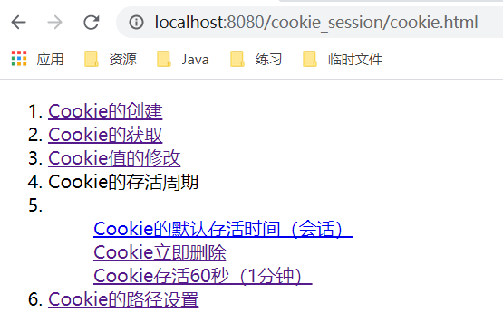

## 如何创建 Cookie

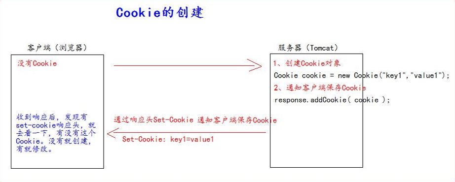

- Servlet 程序中的代码：服务器通知客户端保存键值对
- BaseServlet

```java
public abstract class BaseServlet extends HttpServlet {
    @Override
    protected void doGet(HttpServletRequest req, HttpServletResponse resp) throws ServletException, IOException {
        doPost(req,resp);
    }

    @Override
    protected void doPost(HttpServletRequest req, HttpServletResponse resp) throws ServletException, IOException {
        //处理请求和响应中文乱码的问题
        req.setCharacterEncoding("UTF-8");
        resp.setCharacterEncoding("UTF-8");
        String action = req.getParameter("action");
        try {
            //方法名 形参1 形参2
            Method method = this.getClass().getDeclaredMethod(action, HttpServletRequest.class, HttpServletResponse.class);
            //调用方法的对象 实参1 实参2
            method.invoke(this, req, resp);
        } catch (NoSuchMethodException | IllegalAccessException | InvocationTargetException e) {
            e.printStackTrace();
        }
    }
}
```

- CookieServlet

```java
public class CookieServlet extends BaseServlet{
    protected void creatCookie(HttpServletRequest req, HttpServletResponse resp) throws ServletException, IOException {
        //1.创建Cookie
        Cookie cookie1 = new Cookie("key1", "value1");
        //2.通知客户端保存Cookie
        resp.addCookie(cookie1);
        //创建多个cookie
        Cookie cookie2 = new Cookie("key2", "value2");
        resp.addCookie(cookie2);
        System.out.println("Cookie创建成功"); //Cookie创建成功
    }
}
```

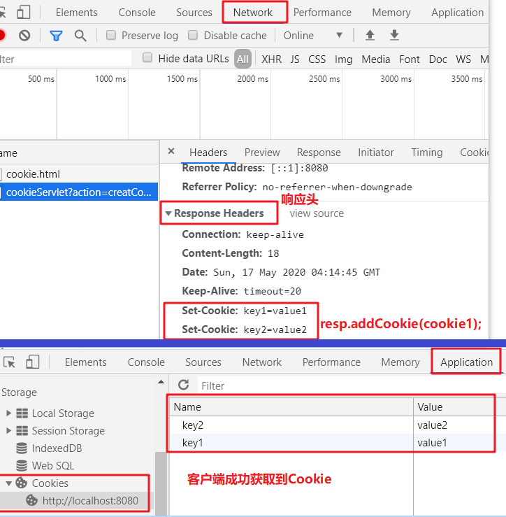

- 注意：若没有`resp.addCookie(cookie1);`这行代码，客户端是获取不到Cookie的

## 服务器如何获取 Cookie

- 服务器获取客户端的全部 Cookie 只需要一行代码：`req.getCookies():Cookie[]`

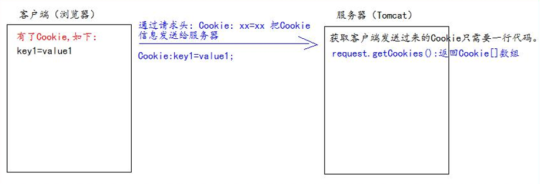

```java
protected void getCookie(HttpServletRequest req, HttpServletResponse resp) throws ServletException, IOException {
    //获取客户端发送来的Cookies
    Cookie[] cookies = req.getCookies();
    for (Cookie cookie : cookies) {
        //getName获取Cookie的key
        //getValue获取Cookie的value
        System.out.println("Cookie[" + cookie.getName() + "=" + cookie.getValue() + "]");
    }
}

/*输出
Cookie[JSESSIONID=A1032FD929446495893D1DE572125836]
Cookie[key1=value1]
Cookie[key2=value2]
*/
```

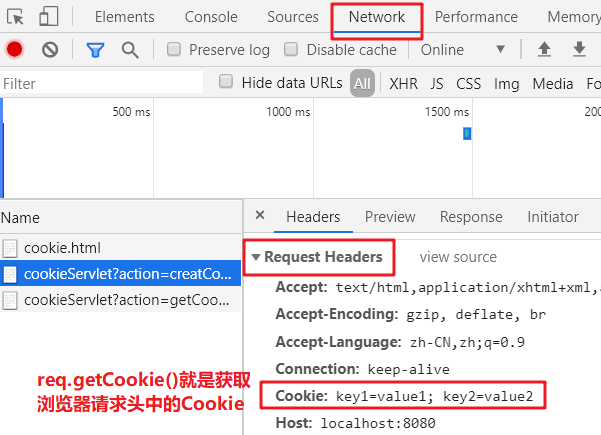

## Cookie 的工具类

```java
public class CookieUtils {

    /**
     * 查找指定名称的Cookie
     * @param name Cookie的名称(key值)
     * @param cookies Cookie对象数组
     * @return 返回查找对象
     */
    public static Cookie getCookie(String name,Cookie[] cookies){
        if (name == null || cookies == null || cookies.length == 0) return null;
        for (Cookie cookie : cookies) {
            if (name.equals(cookie.getName())){
                return cookie;
            }
        }
        return null;
    }
}
```

- **获取指定名称的Cookie对象**

```java
public class CookieServlet extends BaseServlet {
    protected void creatCookie(HttpServletRequest req, HttpServletResponse resp) throws ServletException, IOException {
        //....................
    }

    protected void getCookie(HttpServletRequest req, HttpServletResponse resp) throws ServletException, IOException {
        Cookie cookie = CookieUtils.getCookie("key1", req.getCookies());
        System.out.println("Cookie[" + cookie.getName() + "=" + cookie.getValue() + "]");
    }
}
```

## Cookie 值的修改

- **方案一**：

``` java
public class CookieServlet extends BaseServlet {
       protected void creatCookie(HttpServletRequest req, HttpServletResponse resp) throws ServletException, IOException {
        //....................
    }

    protected void getCookie(HttpServletRequest req, HttpServletResponse resp) throws ServletException, IOException {
        //....................
    }
    
    protected void updateCookie(HttpServletRequest req, HttpServletResponse resp) throws ServletException, IOException {
        //1.先创建一个要修改的同名（指的就是 key）的 Cookie 对象
        //2.在构造器，同时赋于新的 Cookie 值
        Cookie cookie = new Cookie("key1", "newValue1");
        //3.调用 response.addCookie(Cookie)通知客户端保存修改
        resp.addCookie(cookie);
        System.out.println("Cookie修改成功");
    }
}

/*
Cookie[JSESSIONID=A1032FD929446495893D1DE572125836]
Cookie[key1=value1]   ------先调用getCookie获取第一次创建的Cookie
Cookie修改成功        -------调用updateCookie修改Cookie
Cookie[key1=newValue1]   ---再调用getCookie获取更新后的Cookie
*/
```

- **方案二：**

```java
protected void updateCookie(HttpServletRequest req, HttpServletResponse resp) throws ServletException, IOException {
    //1.先查找到需要修改的 Cookie 对象
    Cookie cookie = CookieUtils.getCookie("key1", req.getCookies());
    if (cookie != null) {
        //2.调用 setValue()方法赋于新的 Cookie 值
        cookie.setValue("newValue2");
        //3.调用 response.addCookie()通知客户端保存修改
        resp.addCookie(cookie);
    }
    System.out.println("Cookie修改成功");
}

/*
Cookie[JSESSIONID=A1032FD929446495893D1DE572125836]
Cookie[key1=value1]   ------先调用getCookie获取第一次创建的Cookie
Cookie修改成功        -------调用updateCookie修改Cookie
Cookie[key1=newValue2]   ---再调用getCookie获取更新后的Cookie
*/
```

>**注意：Cookie中不能设置中文!!!**

## 浏览器查看 Cookie

- 谷歌浏览器

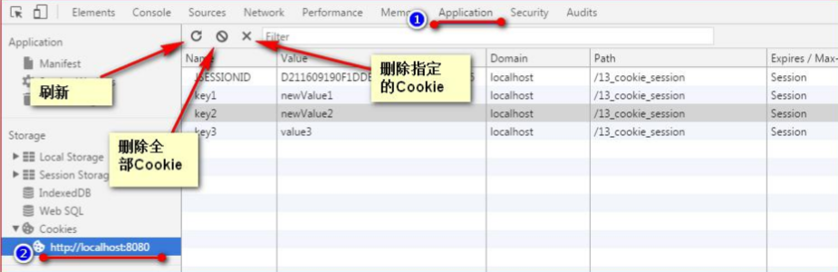

## Cookie 生命控制

- Cookie 的生命控制指的是如何管理 Cookie 什么时候被销毁（删除）
- setMaxAge(int expiry) 

>- 参数为正数，表示在指定的秒数后过期 
>- 参数为负数，表示浏览器一关，Cookie 就会被删除（默认值是-1） 
>- 参数为零，表示马上删除 Cookie

- **cookie.setMaxAge(-1);**

```java
protected void defaultCookie(HttpServletRequest req, HttpServletResponse resp) throws ServletException, IOException {
    Cookie cookie = new Cookie("default", "defaultValue");
    cookie.setMaxAge(-1);
    resp.addCookie(cookie);
    System.out.println("添加Cookie并查看默认存活时间");
}
```

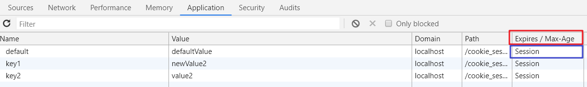

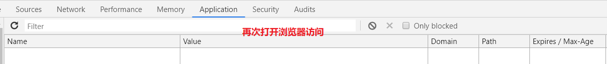

- **cookie.setMaxAge(0);**

```java
protected void deleteCookie(HttpServletRequest req, HttpServletResponse resp) throws ServletException, IOException {
    Cookie cookie = CookieUtils.getCookie("key2", req.getCookies());
    if (cookie != null){
        cookie.setMaxAge(0);
        resp.addCookie(cookie);
    }
    System.out.println("Cookie被立即删除了");
}
```

- **cookie.setMaxAge(60);**

```java
protected void keepCookie(HttpServletRequest req, HttpServletResponse resp) throws ServletException, IOException {
    Cookie cookie = CookieUtils.getCookie("key1", req.getCookies());
    if (cookie != null){
        cookie.setMaxAge(60);//设置Cookie一分钟后被删除
        resp.addCookie(cookie);
    }
    System.out.println("Cookie一分钟后会被删除");
}
```

## Cookie 有效路径 Path 的设置

- **Cookie 的 path 属性可以有效的过滤哪些 Cookie 可以发送给服务器。哪些不发**
- path 属性是通过请求的地址来进行有效的过滤
- 假如：
  - CookieA path=/工程路径 
  - CookieB path=/工程路径/abc

- 例1：请求地址如下

>-  http://ip:port/工程路径/a.html 
>  - CookieA 发送
>  - CookieB 不发送：abc与a.html不匹配

- 例2：请求地址如下

>http://ip:port/工程路径/abc/a.html
>
>- CookieA 发送 
>- CookieB 发送

- **CookieA 的path和 CookieB的path 与请求地址从头开始匹配，只要能请求地址能包含path地址Cookie就能发送**

- 若不对Cookies的path进行设置则默认为：工程路径

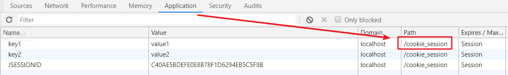

##  Cookie 免输入用户名登录

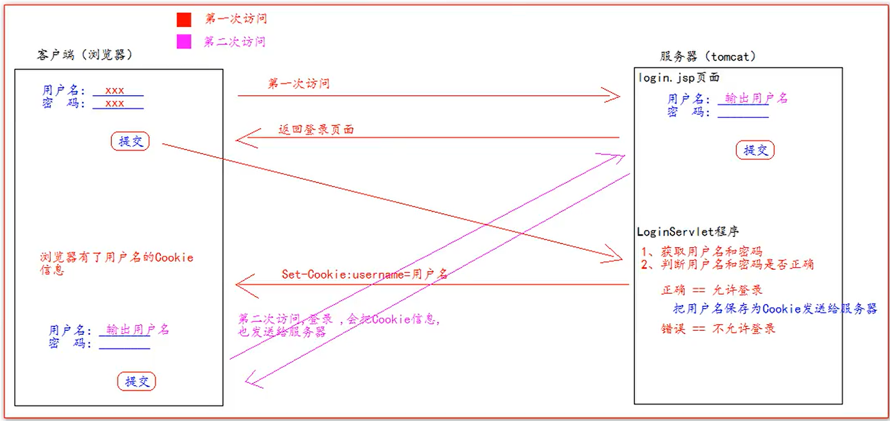

- 准备login.jsp

```jsp
<%@ page contentType="text/html;charset=UTF-8" language="java" %>
<html>
<head>
    <title>登录</title>
</head>
<body>
<form action="http://localhost:8080/cookie_session/loginServlet" method="get">
    <input type="hidden" name="action" value="login">
    <!--cookie是EL隐含对象之一-->
    用户名 <input type="text" name="username" value="${cookie.username.value}"><br/>
    密码 <input type="password" name="password"><br/>
    <input type="submit" value="登录">
</form>
</body>
</html>
```

- LoginServlet

```java
public class LoginServlet extends BaseServlet {

    protected void login(HttpServletRequest req, HttpServletResponse resp) throws ServletException, IOException {
        String username = req.getParameter("username");
        String password = req.getParameter("password");

        if ("batman".equals(username) && "123".equals(password)){
            System.out.println("登录成功");
            Cookie cookie = new Cookie("username", username);
            cookie.setMaxAge(60 * 60 * 24 * 7); //该Cookie一周内有效
            resp.addCookie(cookie);
        }else {
            System.out.println("登录失败");
            resp.sendRedirect(req.getContextPath()+"/login.jsp");
        }
    }
}
```

- **只要登录成功一次之后，在一个星期内再次访问login.jsp登录页面时都会回显用户名在表单项上**
- 前提是服务器不能关闭，若服务器重启，所有Cookie都会被清除

# Session 会话 

## 什么是 Session 会话?

- Session 就一个接口（HttpSession）
- Session 就是会话。它是用来维护一个客户端和服务器之间关联的一种技术
- 每个客户端都有自己的一个 Session 会话
- Session 会话中，我们经常用来保存用户登录之后的信息

## 如何创建 Session 和获取(id 号是否为新)

- 如何创建和获取 Session ：request.getSession()
- request.getSession() 第一次调用是：创建 Session 会话；之后调用都是：获取前面创建好的 Session 会话对象
- isNew(); 判断到底是不是刚创建出来的（新的） 
  - true 表示刚创建 
  - false 表示获取之前创建
- 每个会话都有一个身份证号，也就是 ID 值，而且这个 ID 是唯一的，getId() 得到 Session 的会话 id 值

```java
public class SessionServlet extends BaseServlet {

    protected void creatOtGetSession(HttpServletRequest req, HttpServletResponse resp) throws ServletException, IOException {
        //1.创建或获取session会话对象
        HttpSession session = req.getSession();
        //获取当前session会话的唯一标识 id
        String id = session.getId();
        //判断当前session会话对象是否是新创建出来的
        boolean aNew = session.isNew();

        System.out.println("session的id = " + id);
        System.out.println("session是否是新创建的 = " + aNew);
    }
}
```

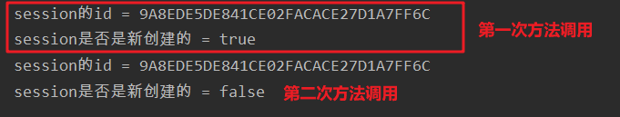

## Session 域数据的存取

```java
public class SessionServlet extends BaseServlet {

    protected void creatOtGetSession(HttpServletRequest req, HttpServletResponse resp) throws ServletException, IOException {
     //....................
    }

    //存数据
    protected void set(HttpServletRequest req, HttpServletResponse resp) throws ServletException, IOException {
        req.getSession().setAttribute("username", "batman");
        System.out.println("session域中放入了数据");
    }

    //取数据
    protected void get(HttpServletRequest req, HttpServletResponse resp) throws ServletException, IOException {
        Object username = req.getSession().getAttribute("username");
        System.out.println("取出session的数据 = " + username);
    }
}

/*
session域中放入了数据
取出session的数据 = batman
*/
```

##  Session 生命周期控制

- `public void setMaxInactiveInterval(intinterval) `设置 Session 的超时时间（以秒为单位），超过指定的时长，Session 就会被销毁
- 值为正数的时候，设定 Session 的超时时长。 负数表示永不超时（极少使用）
- `public int getMaxInactiveInterval()`获取 Session 的超时时间
- `public void invalidate() `让当前 Session 会话马上超时无效。

```java
protected void defaultTimeout(HttpServletRequest req, HttpServletResponse resp) throws ServletException, IOException {
    int maxInactiveInterval = req.getSession().getMaxInactiveInterval();
    System.out.println("Session的默认超时时长为 = " + maxInactiveInterval + "秒");
    //Session的默认超时时长为 = 1800秒
}
```

- Session 默认的超时时长是多少?
- Session 默认的超时时间长为 30 分钟。 因为在Tomcat服务器的配置文件web.xml中默认有以下的配置，它就表示配置了当前Tomcat服务器下所有的Session 超时配置默认时长为：30 分钟

- 在`C:\Users\XZND\.IntelliJIdea2019.3\system\tomcat\Tomcat_9_0_34_StudyWeb`里的web.xml文件中可以看到这行配置

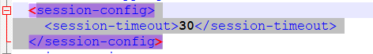

- 如果说，你希望你的 web 工程，默认的 Session 的超时时长为其他时长。你可以在你自己的 web.xml 配置文件中做 以上相同的配置，就可以修改你的 web 工程所有 Seession 的默认超时时长

```xml
<session-config>
    <session-timeout>20</session-timeout>
</session-config>
```

- 如果你想只修改个别 Session 的超时时长。可以使用API`setMaxInactiveInterval(intinterval)`来进行单独的设置，`session.setMaxInactiveInterval(intinterval)`单独设置超时时长
- Session 超时的概念介绍：

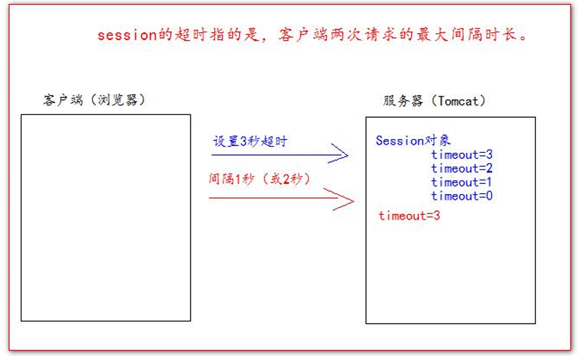

- **设置 Session 3秒后超时：**

```java
protected void setSessionTimeout(HttpServletRequest req, HttpServletResponse resp) throws ServletException, IOException {
    req.getSession().setMaxInactiveInterval(3);
    System.out.println("已经设置好session 3秒后超时");
}
```

>- 第一次获取session时session.isNew()为true，第二次获取时则为false；当设置session 3秒超时后等待3秒再次判断session.isNew()则为true

- **设置 Session 马上被超时：**

```java
protected void deleteNow(HttpServletRequest req, HttpServletResponse resp) throws ServletException, IOException {
    req.getSession().invalidate();
    System.out.println("设置session马上超时");
}
```

## Session 联调页面


## 浏览器和 Session 之间关联的技术内幕

- Session技术底层实际是基于Cookie技术来实现的

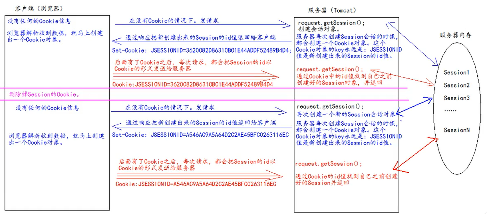

- 解答：为什么设置了Session的超时时间为30分钟，但是在关闭浏览器后Session也会随之结束生命
- 答：由于Session技术底层实际是基于Cookie技术来实现的，而Cookies默认在浏览器关闭的时候结束生命，在没有Cookies的情况下浏览器只能向服务器发送请求创建Session会话对象