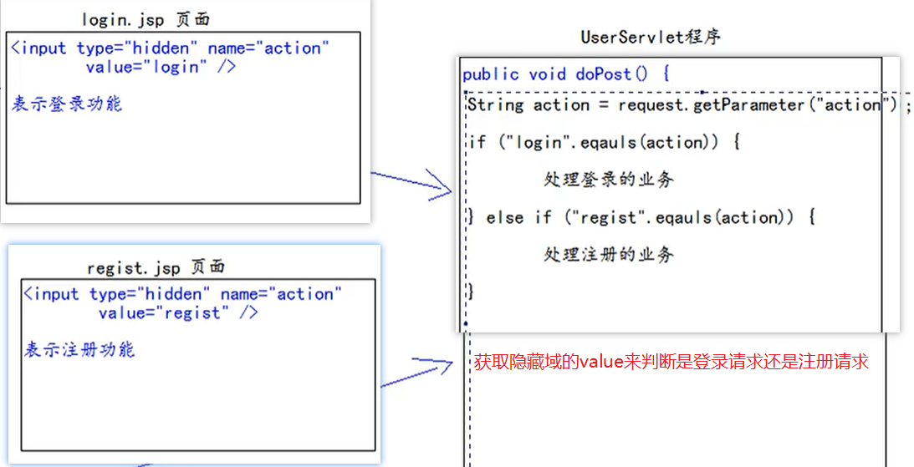
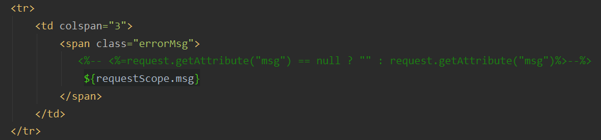

# 第一阶段：表单验证


- 验证用户名：必须由字母，数字下划线组成，并且长度为5到12位
- 验证密码：必须由字母，数字下划线组成，并且长度为5到12位验证确认密码：和密码相同
- 邮箱验证：xxxxx@xxx.com
- 验证码：现在只需要验证用户已输入。因为还没讲到服务器，验证码生成
- 项目结构


## 1.register.html页面

```html
<!DOCTYPE html>
<html lang="en">
    <head>
        <meta charset="UTF-8">
        <title>注册页面</title>
        <!--css样式控制-->
        <style type="text/css">
            /*让表格居中*/
            table {
                border: black 1px solid;
                margin: 200px auto auto;
            }

            tr, td {
                text-align: center;
            }

            span {
                text-align: center;
                color: red;
            }
        </style>
        <!--引入jquery-1.7.2.js文件-->
        <script type="text/javascript" src="../../static/script/jquery-1.7.2.js"></script>
        <!--使用jquery-1.7.2.js进行表单的初步验证-->
        <script type="text/javascript">
            $(function () {
                /*给注册按钮添加单击事件*/
                $("#btn_sub").click(function () {
                    //验证用户名：必须由字母，数字下划线组成，并且长度为5到12位
                    //1.通过查找id属性获取用户名输入框中的内容
                    let usernameVal = $("#username").val();

                    //2.创建正则表达式
                    let usernameRegExp = /^\w{5,12}$/;

                    //3.使用jquery中的test方法验证
                    if (!usernameRegExp.test(usernameVal)) {

                        //4.输入不符合规范则提示用户结果
                        $("span.errorMsg").text("用户名不合法!");
                        return false; //不向目标服务器提交表单数据
                    }

                    //验证密码：必须由字母，数字下划线组成，并且长度为5到12位验证确认密码：和密码相同
                    let passwordVal = $("#password").val();
                    let passwordRegExp = /^\w{5,12}$/;
                    if (!passwordRegExp.test(passwordVal)) {
                        $("span.errorMsg").text("密码不合法!");
                        return false;
                    }

                    let repeatVal = $("#repeatPw").val();
                    if (passwordVal !== repeatVal) {
                        $("span.errorMsg").text("两次密码输入不一致!");
                        return false;
                    }
                    //邮箱验证：xxxxx@xxx.com
                    //1.获取邮箱里的内容
                    let emailVal = $("#email").val();
                    //2.创建正则表达式对象：邮箱的固定写法
                    let emailRegExp = /^[a-z\d]+(\.[a-z\d]+)*@([\da-z](-[\da-z])?)+(\.{1,2}[a-z]+)+$/;
                    //3.使用test方法验证是否合法
                    if (!emailRegExp.test(emailVal)) {
                        //4.提示用户
                        $("span.errorMsg").text("邮箱格式不合法！");
                        return false;
                    }
                    //验证码：现在只需要验证用户已输入
                    let codeVal = $("#code").val();
                    //去掉验证码前后空格
                    codeVal = $.trim(codeVal);
                    if (codeVal == null || codeVal === "") {
                        $("span.errorMsg").text("验证码不能为空！");
                        return false;
                    }

                    //最后：去掉错误提示信息
                    $("span.errorMsg").text("");
                })
            })
        </script>
    </head>
    <body>
        <form action="register_success.html" method="post">
            <table>
                <tr>
                    <td>用户名</td>
                    <td><input type="text" name="username" id="username" placeholder="请输入用户名"></td>
                </tr>
                <tr>
                    <td>密码</td>
                    <td><input type="password" name="password" id="password" placeholder="请输入密码"></td>
                </tr>
                <tr>
                    <td>确认密码</td>
                    <td><input type="password" name="repeatPW" id="repeatPw" placeholder="请再次输入密码"></td>
                </tr>
                <tr>
                    <td>邮箱</td>
                    <td><input type="text" name="email" id="email" placeholder="请输入邮箱"></td>
                </tr>
                <tr>
                    <td>验证码</td>
                    <td><input type="text" name="code" id="code" placeholder="请输入验证码"></td>
                    <td></td>
                </tr>
                <tr>
                    <td colspan="3" align="center">
                        <input type="submit" id="btn_sub" value="注册" align="center">
                    </td>
                </tr>
                <tr>
                    <td colspan="3">
                        <span class="errorMsg"></span>
                    </td>
                </tr>
            </table>
        </form>
    </body>
</html>
```

## 2.login.html页面

```html
<!DOCTYPE html>
<html lang="en">
<head>
    <meta charset="UTF-8">
    <title>登录界面</title>
    <style type="text/css">

        table{
            border: black 1px solid;
            margin: 200px auto auto;
        }
        #attention{
            text-align: center;
            color: red;
        }
        tr,td{
            text-align: center;
        }
        #reg{
            width: 50px;
            text-align: right;
        }
    </style>
</head>
<body>
<form action="login_success.html" method="post">
    <table>
        <tr>
            <td colspan="2" id="attention">
                请输入用户名和密码
            </td>
        </tr>
        <tr>
            <td>用户名</td>
            <td><input type="text" id="username" placeholder="请输入用户名" name="username"></td>
        </tr>
        <tr>
            <td>密码</td>
            <td><input type="password" id="password" placeholder="请输入密码" name="password"></td>
        </tr>
        <tr>
            <td colspan="2"><input type="submit" value="登录" id="btn_log"></td>
            <td id="reg">
                <a href="register.html">注册</a>
            </td>
        </tr>
    </table>
</form>
</body>
</html>
```

## 第一阶段小结

- 主要是设计表单，表单里要提交的数据都要加上name属性才能提交到服务器；每条数据都要加上id属性，id属性主要是为了方便jQuery查找并获取用户输入的数据进行正则表达式判断
- 使用jQuety要引入jQuery文件
- 实现功能：对每个表单项进行规则检验,只有全部符合规则后才会将表单数据提交到服务器

# Java EE的三层架构


- 分层的目的是为了解耦。解耦就是为了降低代码的耦合度。方便项目后期的维护和升级。

- 项目结构

>- web层-----------包名 / servlet / controller
>- service层--------包名.service----------service接口包---------包名.service.impl--------service接口实现类
>- dao持久层-------包名.dao--------------Dao接口包--------------包名.dao.impl------------Dao接口实现类
>- 实体 bean 对象------------包名.pojo / entity / domain / bean---------------avaBean类
>- 测试包------------------------包名.test / junitI
>- 工具类-------------------------包名.utils

# 第二阶段：用户的注册和登录

## 项目代码编写步骤如下

- 整体结构


## 1. 创建注册登录需要的数据库和表


```mssql
drop database if exists book; -- 如果book这个数据库存在就删除

create database book; -- 创建book数据库
use book;
create table b_user(
`id` int primary key auto_increment, -- id设置为主键 自增长
`username` varchar(100) not null unique, -- 用户名设置为非空且唯一
`password` varchar(32) not null,  -- 密码设置为非空，大小设置为32是固定写法
`email` varchar(200) -- 邮箱
);

-- 向数据库中插入一条信息，注意`username`上的两点和'admin'上的两点不同，从颜色就可看出区别
insert into b_user(`username`,`password`,`email`) values ('admin','admin','admin123@163.com');

select * from b_user; -- 查询表中全部数据
```

## 2.编写数据库对应的JavaBean对象

- 和数据库表中字段对应的类属性
- 无参和有参的构造方法
- getter和setter方法
- toString()方法

```java
package com.kl.pojo;

public class User {
    //对应数据库表中的id,username,password,email
    private Integer id;
    private String username;
    private String password;
    private String email;

   //有参无参、getter/setter、toString方法--------------省略
}

```

## 3.编写工具类JdbcUtils和测试

- 先导入对应的jar包


- 在src目录下编写 jdbc.properties 配置文件


```properties
username=root
password=root
url=jdbc:mysql://localhost:3306/book
driverClassName=com.mysql.jdbc.Driver
initialSize = 5
maxActive = 10 
```

- 编写JbdcUtils工具类来获取数据库连接资源和关闭数据库连接资源

```java
package com.kl.utils;

import com.alibaba.druid.pool.DruidDataSource;
import com.alibaba.druid.pool.DruidDataSourceFactory;
import java.io.InputStream;
import java.sql.Connection;
import java.sql.SQLException;
import java.util.Properties;

public class JdbcUtils {
    private static DruidDataSource dataSource = null;

    static {
        //获取配置文件的输入流:注意要加斜杠
         InputStream stream = JdbcUtils.class.getResourceAsStream("/jdbc.properties");
        Properties properties = new Properties(); 
        try {
            assert stream != null;
            properties.load(stream); //使用Properties类加载流读取配置文件
            dataSource = (DruidDataSource) DruidDataSourceFactory.createDataSource(properties); //根据Properties类创建数据库连接池
        } catch (Exception e) {
            e.printStackTrace();
        }
    }

    public static Connection getConnection(){ //获取数据库连接
        Connection connection = null;
        try {
            connection =  dataSource.getConnection();
        } catch (SQLException e) {
            e.printStackTrace();
        }
        return connection;
}

    public static void close(Connection connection){ //关闭数据库连接，释放资源
        if (connection != null){
            try {
                connection.close();
            } catch (SQLException e) {
                e.printStackTrace();
            }
        }
    }
}
```

### 测试

```java
package com.kl.test;

import com.kl.utils.JdbcUtils;
import org.junit.Test;
import java.sql.Connection;

public class JdbcUtilTest {
    @Test
    public void test(){
        //测试数据库连接是否可以正常获取
        Connection connection = JdbcUtils.getConnection();
        System.out.println(connection);
        JdbcUtils.close(connection);
    }
}
```

## 4.编写BaseDao

- **主要用于代码复用,不需要对象实例**

```java
package com.kl.dao.impl;

import com.kl.utils.JdbcUtils;
import org.apache.commons.dbutils.DbUtils;
import org.apache.commons.dbutils.QueryRunner;
import org.apache.commons.dbutils.handlers.BeanHandler;
import org.apache.commons.dbutils.handlers.BeanListHandler;
import org.apache.commons.dbutils.handlers.ScalarHandler;

import java.sql.Connection;
import java.sql.SQLException;
import java.util.List;

public abstract class BaseDao {
    //使用dbUtils操作数据库
    private QueryRunner runner = new QueryRunner();

    /**
     * Update方法用来统一执行：Insert\Update\Delete语句
     * 增删改操作一般是不需要返回值的,这里为了判断sql语句是否执行成功可以根据返回的受影响的行数进行判断
     * @param sql 增删改语句
     * @param args 填充占位符的参数
     * @return 受影响的行数,返回-1说明执行失败
     */
    public int update(String sql,Object...args){
        Connection connection = JdbcUtils.getConnection();
        try {
            return runner.update(connection, sql, args);
        } catch (SQLException e) {
            e.printStackTrace();
        }finally {
            DbUtils.closeQuietly(connection);
        }
        return -1;
    }

    /**
     * @param type 返回的对象类型
     * @param sql  执行查询的sql语句
     * @param args 填充占位符的参数
     * @param <T> 返回的类型的泛型
     * @return 查询并返回一个JavaBean对象
     */
    public <T> T queryForOne(Class<T> type,String sql,Object...args){
        Connection connection = JdbcUtils.getConnection();
        try {
            return runner.query(connection,sql,new BeanHandler<>(type),args);
        } catch (SQLException e) {
            e.printStackTrace();
        }finally {
            JdbcUtils.close(connection);
        }
        return null;
    }

    /**
     * 查询并返回多个JavaBean对象
     * @param type 返回的对象类型
     * @param sql 执行查询的sql语句
     * @param args 填充占位符的参数
     * @param <T> 表示泛型方法
     * @return 返回符合条件的所有JavaBean对象
     */
    public <T> List<T> queryForList(Class<T> type, String sql, Object...args){
        Connection connection = JdbcUtils.getConnection();
        try {
            return runner.query(connection,sql,new BeanListHandler<>(type),args);
        } catch (SQLException e) {
            e.printStackTrace();
        }finally {
            JdbcUtils.close(connection);
        }
        return null;
    }

    /**
     * 查询返回单个值的情况
     * 用于做统计查询，返回一行一列
     * @param sql 统计相关的sql语句
     * @param args 填充占位符的参数
     * @return 返回统计的结果
     */
    public Object queryForSingleValue(String sql,Object...args){
        Connection connection = JdbcUtils.getConnection();
        try {
            return runner.query(connection, sql,new ScalarHandler(), args); //返回影响的行数
        } catch (SQLException e) {
            e.printStackTrace();
        }finally {
            DbUtils.closeQuietly(connection);
        }
        return null; //说明执行失败
    }
}
```

## 5.编写UserDao和测试

### 接口

```java
package com.kl.dao;
import com.kl.pojo.User;

public interface UserDao {

    /**
     * 根据用户名查询用户信息
     * @param username 用户在页面输入的用户名
     * @return 返回null则说明用户不存在
     */
    public User queryUserByUsername(String username);


    /**
     * 保存用户信息
     * @param user 符合注册规则,注册成功的用户
     * @return 返回-1说明数据库的行没有受到影响，保存失败
     */
    public int saveUser(User user);


    /**
     * 根据用户名和密码查询用户信息
     * @param username 用户在页面输入的用户名
     * @param password 用户在页面输入的密码
     * @return 返回null则说明用户名或密码错误或者该用户根本不存在
     */
    public User queryUserByUsernameAndPassword(String username,String password);
}
```

### 实现

```java
package com.kl.dao.impl;

import com.kl.dao.UserDao;
import com.kl.pojo.User;

public class UserDaoImpl extends BaseDao implements UserDao {

    @Override
    public User queryUserByUsername(String username) {
        //根据用户名查询用户信息
        String sql = "select `id`,`username`,`password`,`email` from b_user where username = ?";
        return queryForOne(User.class, sql, username);
    }

    @Override
    public int saveUser(User user) {
        //执行插入语句将用户信息存储到数据库对应的表中
        String sql = "insert into b_user(`username`,`password`,`email`) values (?,?,?)";
        return update(sql, user.getUsername(), user.getPassword(), user.getEmail());
    }

    @Override
    public User queryUserByUsernameAndPassword(String username, String password) {
        //根据用户名和密码查询用户信息
        String sql = "select `id`,`username`,`password`,`email` from b_user where username = ? and password = ?";
        return queryForOne(User.class, sql, username, password);
    }
}
```

### 测试

```java
package com.kl.test;

import com.kl.dao.UserDao;
import com.kl.dao.impl.UserDaoImpl;
import com.kl.pojo.User;
import org.junit.Test;

public class UserDaoTest {

    @Test
    public void queryUserByUsername() {
        UserDao userDao = new UserDaoImpl();
        User admin = userDao.queryUserByUsername("admin");
        if (admin == null){
            System.out.println("用户名可用");
        }else {
            System.out.println("用户名已存在");
        }
    }

    @Test
    public void saveUser() {
        UserDao userDao = new UserDaoImpl();
        int i = userDao.saveUser(new User(null, "superman", "123456", "supermam@163.com"));
        if (i == -1){
            System.out.println("保存失败");
        }else {
            System.out.println("保存成功");
        }
    }

    @Test
    public void queryUserByUsernameAndPassword() {
        UserDao userDao = new UserDaoImpl();
        User user = userDao.queryUserByUsernameAndPassword("admin", "admin");
        if (user == null){
            System.out.println("用户名或密码输入错误，登录失败");
        }else {
            System.out.println("登录成功");
        }
    }
}
```

## 6.编写UserService和测试

- 三个业务逻辑：登录、注册、检查用户名是否存在

### 接口

```java
package com.kl.service;
        import com.kl.pojo.User;

public interface UserService {

    /**
     * 用户注册
     * @param user 用户在表单填写的注册信息
     */
    public void registerUser(User user);

    /**
     * 用户登录
     * @param user 用户在表单填写的登录信息
     * @return 返回null表示用户不存在，登录失败
     */
    public User login(User user);

    /**
     * 判断用户名是否可用,用户名是唯一的
     * @return 返回true:用户名已存在,不可用 返回false:用户名不存在,可用
     */
    public boolean isExistUsername(String username);
}
```

### 实现

```java
package com.kl.service.impl;

import com.kl.dao.UserDao;
import com.kl.dao.impl.UserDaoImpl;
import com.kl.pojo.User;
import com.kl.service.UserService;

public class UserServiceImpl implements UserService {

    //UserDao对象能够直接对数据库进行相关CRUD操作
    private UserDao userDao = new UserDaoImpl();

    @Override
    public void registerUser(User user) {
        //将用户在注册页面填写的信息保存到数据库的表中
        userDao.saveUser(user);
    }

    @Override
    public User login(User user) {
        //判断用户在登录界面填写的用户名和密码是否存在数据库的表中
        return userDao.queryUserByUsernameAndPassword(user.getUsername(), user.getPassword());
    }

    @Override
    public boolean isExistUsername(String username){
        //用户在注册账号时判断用户名是否可用,没查到表示该用户名可用
        return userDao.queryUserByUsername(username) != null;
    }
}
```

### 测试

```java
package com.kl.test;

import com.kl.pojo.User;
import com.kl.service.UserService;
import com.kl.service.impl.UserServiceImpl;
import org.junit.Test;

public class UserServiceTest {
    private UserService userService = new UserServiceImpl();

    @Test
    public void registerUser() {
        userService.registerUser(new User(null, "batman", "123456", "batman@163.com"));
    }

    @Test
    public void login() {
        User user = userService.login(new User(null, "batman", "123456", null));
        if (user == null) {
            System.out.println("登录失败");
        } else {
            System.out.println(user); //User{id=3, username='batman', password='123456', email='batman@163.com'}
            System.out.println("登录成功");
        }
    }

    @Test
    public void isExistUsername() {
        boolean username = userService.isExistUsername("superman2");
        if (username) {
            System.out.println("用户名已存在");
        } else {
            System.out.println("用户名可用");
        }
    }
}
```

## 7.实现用户注册功能


- 创建管理注册功能的RegisterServlet对象

```java
package com.kl.web;
import com.kl.pojo.User;
import com.kl.service.UserService;
import com.kl.service.impl.UserServiceImpl;

import javax.servlet.ServletException;
import javax.servlet.http.HttpServlet;
import javax.servlet.http.HttpServletRequest;
import javax.servlet.http.HttpServletResponse;
import java.io.IOException;

public class RegisterServlet extends HttpServlet {
    private UserService userService = new UserServiceImpl();

    @Override
    protected void doPost(HttpServletRequest req, HttpServletResponse resp) throws ServletException, IOException {
        //1.在request域中获取表单中的请求参数
        String username = req.getParameter("username");
        String password = req.getParameter("password");
        String email = req.getParameter("email");
        String code = req.getParameter("code");

        //2.暂时规定验证码为apple->检查用户验证码输入是否正确
        if ("apple".equalsIgnoreCase(code)) {
            //3.检查用户名是否可用
            if (userService.isExistUsername(username)) { //不可用
                System.out.println("用户名" + username + "已存在");
                //跳回注册页面
                req.getRequestDispatcher("/pages/user/register.html").forward(req, resp);
            } else { //可用
                //保存用户的信息到数据库
                userService.registerUser(new User(null, username, password, email));
                //跳转到注册成功页面
                req.getRequestDispatcher("/pages/user/register_success.html").forward(req, resp);
            }
        } else {
            //验证码不正确,跳回注册页面
            System.out.println("验证码输入错误" + code);
            req.getRequestDispatcher("/pages/user/register.html").forward(req, resp);
        }
    }
}
```

- 配置web.xml

```xml
<?xml version="1.0" encoding="UTF-8"?>
<web-app xmlns="http://xmlns.jcp.org/xml/ns/javaee"
         xmlns:xsi="http://www.w3.org/2001/XMLSchema-instance"
         xsi:schemaLocation="http://xmlns.jcp.org/xml/ns/javaee http://xmlns.jcp.org/xml/ns/javaee/web-app_4_0.xsd"
         version="4.0">
    <servlet>
        <servlet-name>RegisterServlet</servlet-name>
        <servlet-class>com.kl.web.RegisterServlet</servlet-class>
    </servlet>

    <servlet-mapping>
        <servlet-name>RegisterServlet</servlet-name>
        <url-pattern>/registerServlet</url-pattern>
    </servlet-mapping>
</web-app>
```

- **修改html页面的路径**
- 以注册页面为例：加上base标签固定相对路径的位置
- 注：base标签只对当前页面有用，所以其他使用相对路径的页面都要按照此规则更换相对路径

```html
<meta charset="UTF-8">
<title>注册页面</title>
<!--1.base标签,永远固定相对路径跳转的结果-->
<base href="http://localhost:8080/Practice/">
...
<!--2.引入jquery-1.7.2.js文件-->
<script type="text/javascript" src="static/script/jquery-1.7.2.js"></script>
...
<!--3.将表单内容提交到http://localhost:8080/Practice/registerServlet程序中-->
<form action="registerServlet" method="post">
...
<!--4.验证码图片-->
<td></td>
```

## 8.实现用户登录功能


- 创建管理登录的LoginServlet对象

```java
package com.kl.web;

import com.kl.pojo.User;
import com.kl.service.UserService;
import com.kl.service.impl.UserServiceImpl;

import javax.servlet.ServletException;
import javax.servlet.http.HttpServlet;
import javax.servlet.http.HttpServletRequest;
import javax.servlet.http.HttpServletResponse;
import java.io.IOException;

public class LoginServlet extends HttpServlet {
    private UserService userService = new UserServiceImpl();
    @Override
    protected void doPost(HttpServletRequest req, HttpServletResponse resp) throws ServletException, IOException {
        //1.获取请求参数
        String username = req.getParameter("username");
        String password = req.getParameter("password");

        //2.处理登录
        User login = userService.login(new User(null, username, password, null));
        if (login == null){ //登录失败，跳回登录页面
            System.out.println("用户名或密码错误");
            //请求转发:重新回到登录界面
            req.getRequestDispatcher("/pages/user/login.html").forward(req, resp);
        }else { //登录成功，跳转到登录成功页面
            System.out.println("登录成功");
            //请求转发:跳转到登录成功界面
            req.getRequestDispatcher("/pages/user/login_success.html").forward(req, resp);
        }
    }
}
```

## 第二阶段小结

- 实现功能：将用户在登录界面或注册界面填写的表单数据进行处理
  - 注册：判断用户名是否唯一，若唯一则注册成功并存储数据到数据库
  - 登录：判断用户名和密码是否在数据库中有对应数据，若查询结果不为空则登录成功
- 主要使用了base标签固定每个页面的相对路径参照
- 使用了request读取Request域中用户提交过来的参数信息
- 涉及请求转发

# Debug调试

- Debug 调试代码，首先需要两个元素：断点 +Debug 启动服务器

1. 断点，只需要在代码需要停的行的左边上单击，就可以添加和取消 
2. Debug 启动 Tomcat 运行代码：


- 测试工具栏：

- ：让代码往下执行一行。
- ：可以进入当前方法体内（自己写的代码，非框架源码）
- ：跳出当前方法体外
- ：强制进入当前方法体内
- ：停在光标所在行（相当于临时断点）

---

- 变量窗口：它可以查看当前方法范围内所有有效的变量。


- 方法调用栈窗口
  1. 方法调用栈可以查看当前线程有哪些方法调用信息
  2. 下面的调用上一行的方法


- 其他常用调试相关按钮：


# 第三阶段：优化+回显注册和登录失败后的信息

## 1.页面 jsp 动态化

1. 在 html 页面顶行添加 page 指令: 

```jsp
<%@ page contentType="text/html;charset=UTF-8" language="java" %>
```

2. 修改所有.html文件的后缀名：.jsp


3. 使用 IDEA 搜索替换.html 为.jsp(快捷键：Ctrl+Shift+R)


## 2.抽取页面中相同的内容

- 例如：每个页面都要如下的信息

```jsp
<!--base标签,永远固定相对路径跳转的结果-->
<base href="http://localhost:8080/Practice/">
<!--引入jquery-1.7.2.js文件-->
<script type="text/javascript" src="static/script/jquery-1.7.2.js"></script>
```

- 把这些公共部分抽取出来放在一个单独的 jsp 页面,再对使用这些标签功能的地方使用静态包含


```jsp
<%@ page contentType="text/html;charset=UTF-8" language="java" %>
<!--base标签,永远固定相对路径跳转的结果-->
<base href="http://localhost:8080/Practice/">
<!--引入jquery-1.7.2.js文件-->
<script type="text/javascript" src="static/script/jquery-1.7.2.js"></script>
```

- 使用示例：

## 3.设置base标签动态值

- 以上base标签中的值设置为http://localhost:8080/Practice/
- 当我们使用本机真实IP地址进行访问时主页面也会正常出现，看似并没有什么问题，但当我们打开network查看文件的访问地址时可以清楚的看到jquery文件的访问的IP地址还是localhost，这会导致别人在访问我们的服务器时访问的是自己的电脑IP地址!!!


- 为了解决上述出现的问题，让其他人也能够通过服务器的IP地址访问数据时，我们就需要将base标签中的相对路径地址设置为动态的

- **修改head.jsp文件**

```jsp
--%>
<%@ page contentType="text/html;charset=UTF-8" language="java" %>
<%
    String basePath = request.getScheme() /*获取协议*/
            + "://"
            +request.getServerName() /*获取服务器IP地址*/
            +":"
            +request.getServerPort() /*获取服务器端口号*/
            +request.getContextPath() /*获取服务器工程名*/
            + "/";
%>
<!-- <%=basePath%>  向页面输出数据-->
<!--base标签,永远固定相对路径跳转的结果-->
<base href="<%=basePath%>">
<!--引入jquery-1.7.2.js文件-->
<script type="text/javascript" src="static/script/jquery-1.7.2.js"></script>
```

- 再次使用本机的真实IP地址进行访问，得到的jquery文件地址也是真实的IP地址


## 4.表单提交失败的错误回显

- **登录失败回显**


- 在进行登录判断时，把错误信息和需要回显的表单项信息保存到request域中：修改LoginServlet中的方法

```java
protected void doPost(HttpServletRequest req, HttpServletResponse resp) throws ServletException, IOException {
    //1.获取请求参数
    String username = req.getParameter("username");
    String password = req.getParameter("password");

    //2.处理登录
    User login = userService.login(new User(null, username, password, null));
    if (login == null){ //登录失败，跳回登录页面
        
        //关键步骤:把错误信息和需要回显的表单项信息保存到request域中
        req.setAttribute("msg", "用户名或密码错误!"); //----------------------错误提示信息
        req.setAttribute("username", username); //---------------------------回显用户名
      
        req.getRequestDispatcher("/pages/user/login.jsp").forward(req, resp);
    }else { 
        //...........
    }
}
```

- 修改登录的jsp文件

```jsp
<table>
    <tr>
        <td colspan="2" id="attention">
            <!--若requset域中的msg为空则提示...,若不为空则提示...-->
           <%=request.getAttribute("msg") == null ? "请输入用户名和密码" : request.getAttribute("msg")%>
        </td>
    </tr>
    <tr>
        <td>用户名</td>
        <!--若requset域中的username为空则表单项的默认值为空串,若不为空则回显该username所携带的value-->
        <td><input type="text" id="username" placeholder="请输入用户名" name="username"            
                   value="<%=request.getAttribute("username") == null ? "" : request.getAttribute("username")%>"></td>
    </tr>
   <!---------------省略------------------------>
</table>
```

- **注册失败回显**


- 在进行注册判断时，把错误信息和需要回显的表单项信息保存到request域中：修改RegisterServlet中的方法

```java
protected void doPost(HttpServletRequest req, HttpServletResponse resp) throws ServletException, IOException {
    //1.获取请求参数
    String username = req.getParameter("username");
    String password = req.getParameter("password");
    String email = req.getParameter("email");
    String code = req.getParameter("code");

    //2.规定验证码为apple->检查用户验证码输入是否正确
    if ("apple".equalsIgnoreCase(code)) {
        //3.检查用户名是否可用
        if (userService.isExistUsername(username)) { //不可用
            
            req.setAttribute("msg", "用户名已存在!"); //-------------------回显错误提示信息
            req.setAttribute("username", username); //--------------------回显用户名
            req.setAttribute("email", email);       //--------------------回显邮箱

            //请求转发:跳回注册页面
            req.getRequestDispatcher("/pages/user/register.jsp").forward(req, resp);
        } else { //可用
            //保存用户的信息到数据库
            userService.registerUser(new User(null, username, password, email));
            //请求转发:跳转到注册成功页面
            req.getRequestDispatcher("/pages/user/register_success.jsp").forward(req, resp);
        }
    } else {
        //请求转发:验证码不正确,跳回注册页面
        System.out.println("验证码输入错误" + code);

        req.setAttribute("msg", "验证码错误!"); //---------------------回显错误提示信息
        req.setAttribute("username", username); //--------------------回显用户名
        req.setAttribute("email", email);       //--------------------回显邮箱
        req.getRequestDispatcher("/pages/user/register.jsp").forward(req, resp);
    }
}
```

- 修改注册的jsp页面信息

```jsp
<table>
    <tr>
        <td>用户名</td>
        <td><input type="text" name="username" id="username" placeholder="请输入用户名"
                   value="<%=request.getAttribute("username") == null ? "" : request.getAttribute("username")%>"></td>
    </tr>
    <!--------------------------省略--------------------------------->
    <tr>
        <td>邮箱</td>
        <td><input type="text" name="email" id="email" placeholder="请输入邮箱"
                   value="<%=request.getAttribute("email") == null ? "" : request.getAttribute("email")%>"></td>
    </tr>
    <!-----------------------省略---------------------------------->
    <tr>
        <td colspan="3">
            <span class="errorMsg"><%=request.getAttribute("msg") == null ? "" : request.getAttribute("msg")%></span>
        </td>
    </tr>
</table>
```

## 5.代码优化一：合并Servlet程序

- 在实际的项目开发中，一个模块，一般只使用一个 Servlet 程序



- **合并LoginServlet和RegisterServlet为一个UserServlet程序**

```java
package com.kl.web;

import com.kl.pojo.User;
import com.kl.service.UserService;
import com.kl.service.impl.UserServiceImpl;

import javax.servlet.ServletException;
import javax.servlet.http.HttpServlet;
import javax.servlet.http.HttpServletRequest;
import javax.servlet.http.HttpServletResponse;
import java.io.IOException;

public class UserServlet extends HttpServlet {
    UserService userService = new UserServiceImpl();
    @Override
    protected void doPost(HttpServletRequest req, HttpServletResponse resp) throws ServletException, IOException {
        String action = req.getParameter("action");
        if ("login".equals(action)){
            System.out.println("处理登录的功能");
            login(req, resp);
        }else if ("register".equals(action)){
            System.out.println("处理注册的功能");
            register(req, resp);
        }
    }


     /*处理登录请求*/
    protected void login(HttpServletRequest req, HttpServletResponse resp) throws ServletException, IOException {
        //1.获取请求参数
        String username = req.getParameter("username");
        String password = req.getParameter("password");

        //2.处理登录
        User login = userService.login(new User(null, username, password, null));
        if (login == null){ //登录失败，跳回登录页面
            System.out.println("用户名或密码错误");
            //把错误信息和需要回显的表单项信息保存到request域中
            req.setAttribute("msg", "用户名或密码错误!");
            req.setAttribute("username", username);

            //请求转发:重新回到登录界面
            req.getRequestDispatcher("/pages/user/login.jsp").forward(req, resp);
        }else { //登录成功，跳转到登录成功页面
            System.out.println("登录成功");
            //请求转发:跳转到登录成功界面
            req.getRequestDispatcher("/pages/user/login_success.jsp").forward(req, resp);
        }
    }

    /*处理注册请求*/
    protected void register(HttpServletRequest req, HttpServletResponse resp) throws ServletException, IOException {
        //1.获取请求参数
        String username = req.getParameter("username");
        String password = req.getParameter("password");
        String email = req.getParameter("email");
        String code = req.getParameter("code");

        //2.规定验证码为apple->检查用户验证码输入是否正确
        if ("apple".equalsIgnoreCase(code)) {
            //3.检查用户名是否可用
            if (userService.isExistUsername(username)) { //不可用
                System.out.println("用户名" + username + "已存在");

                req.setAttribute("msg", "用户名已存在!");
                req.setAttribute("username", username);
                req.setAttribute("email", email);

                //请求转发:跳回注册页面
                req.getRequestDispatcher("/pages/user/register.jsp").forward(req, resp);
            } else { //可用
                //保存用户的信息到数据库
                userService.registerUser(new User(null, username, password, email));
                //请求转发:跳转到注册成功页面
                req.getRequestDispatcher("/pages/user/register_success.jsp").forward(req, resp);
            }
        } else {
            //请求转发:验证码不正确,跳回注册页面
            System.out.println("验证码输入错误" + code);

            req.setAttribute("msg", "验证码错误!");
            req.setAttribute("username", username);
            req.setAttribute("email", email);
            req.getRequestDispatcher("/pages/user/register.jsp").forward(req, resp);
        }
    }
}
```

>- **记得要在web.xml中配置UserServlet**

- 修改login.jsp和register.jsp页面部分信息

```jsp
<!--将表单内容提交到http://localhost:8080/Practice/userServlet-->
<form action="userServlet" method="post">
    <input type="hidden" name="action" value="register">
    <!-------------注册jsp页面-----------------省略-------------------------->
</form>
```

```jsp
<form action="userServlet" method="post">
    <input type="hidden" name="action" value="login">
        <!--------------登录jsp页面----------------省略-------------------------->
</form>
```

## 6.代码优化二：使用反射

- 问题：在业务中通常不止注册和登录业务，当我们需要添加其他业务时就得在UserServlet程序中增加对应方法并且在doPost()方法中增加大量的if---else判断
- 如果利用反射，那么就可以动态的调用对应的业务方法，从而省略了大量的if---else判断，让我们可以专注于业务逻辑代码的实现
- **通过反射获取方法的测试**

```java
package com.kl.test;

import com.kl.web.UserServlet;

import javax.servlet.http.HttpServletRequest;
import javax.servlet.http.HttpServletResponse;
import java.lang.reflect.InvocationTargetException;
import java.lang.reflect.Method;

public class UserServletTest {
    public void login() {
        System.out.println("登录方法被调用");
    }

    public void register(){
        System.out.println("注册方法被调用");
    }

    //通过反射调用方法
    public static void main(String[] args) {
        try {
            //1.获取使用类的class对象
            //2.获取改class对象指定的方法:参数1---指明获取的方法的名称 参数2---参数2:指明获取的方法的参数列表(空参则不写)
            Method loginMethod = UserServletTest.class.getDeclaredMethod("login");//返回login方法实例
            System.out.println(loginMethod); //public void com.kl.test.UserServletTest.login()
            
            //3.invoke调用该方法:参数1---拥有该方法的对象实例 参数2---给方法赋值的实参(空参则不写)
            loginMethod.invoke(new UserServletTest());

            Method registerMethod = UserServletTest.class.getDeclaredMethod("register");
            registerMethod.invoke(new UserServletTest());
        } catch (NoSuchMethodException | IllegalAccessException | InvocationTargetException e) {
            e.printStackTrace();
        }
    }
}
//---------------------------------------------------------------------------------------------------
/*输出:
登录方法被调用
注册方法被调用
*/
```

- **反射优化doPost方法**

```java
protected void doPost(HttpServletRequest req, HttpServletResponse resp) throws ServletException, IOException {
    //获得用户在哪个页面执行操作
    String action = req.getParameter("action");
    try {
        //方法名 形参1 形参2
        Method method = this.getClass().getDeclaredMethod(action,HttpServletRequest.class,HttpServletResponse.class);
        //调用方法的对象 实参1 实参2
        method.invoke(this,req,resp);
    } catch (NoSuchMethodException | IllegalAccessException | InvocationTargetException e) {
        e.printStackTrace();
    }
}
```

## 7.代码优化三：抽取BaseServlet程序

- 抽取公共相同的代码操作，利用代码复用减少重复代码的编写


- 在web包下创建BaseServletd对象

```java
public abstract class BaseServlet extends HttpServlet {

    @Override
    protected void doPost(HttpServletRequest req, HttpServletResponse resp) throws ServletException, IOException {
        String action = req.getParameter("action");
        try {
            //方法名 形参1 形参2
            Method method = this.getClass().getDeclaredMethod(action, HttpServletRequest.class, HttpServletResponse.class);
            //调用方法的对象 实参1 实参2
            method.invoke(this, req, resp);
        } catch (NoSuchMethodException | IllegalAccessException | InvocationTargetException e) {
            e.printStackTrace();
        }
    }
}
```

- UserServlet不再继承HttpServlet，而是继承BaseServlet

```java
public class UserServlet extends BaseServlet{
    UserService userService = new UserServiceImpl();
    //-------------------------省略---------------------------
}
```

# BeanUtils工具类

- 问题：以该项目为例，每次在进行登录验证和注册用户的时候都要获取用户在表单提交的数据并封装成一个User对象,每次都需要new一个User对象。在该项目中参数不是很多看起来也不觉得麻烦，但在实际项目中一个表单会有二三十个的参数，就意味着如下获取参数的方法要调用二三十次 

  ```java
  //1.获取请求参数
  String username = req.getParameter("username");
  ```

- Beanutils 工具类，它可以一次性的把所有请求的参数注入到JavaBean中

- Beanutils它不是Jdk的类。而是第三方的工具类。所以需要导包。

  1. 导入需要的jar包：commons-beanutils-1.8.0.jar和commons-logging-1.1.1.jar
  2. 使用Beanutils类方法实现注入

- **以注册用户为例**

```java
protected void register(HttpServletRequest req, HttpServletResponse resp) throws ServletException, IOException {
    //方式一:获取请求参数(可以省略了!!!)
    String username = req.getParameter("username");
    String password = req.getParameter("password");
    String email = req.getParameter("email");
    String code = req.getParameter("code");

    User user = new User();
    System.out.println("注入之前"+user);
    try {
        //方式二:使用BeanUtils类注入 参数1:需要注入的类对象 参数2:表单参数的键值对name-value
        BeanUtils.populate(user, req.getParameterMap());
        System.out.println("注入之后"+user);
    } catch (IllegalAccessException | InvocationTargetException e) {
        e.printStackTrace();
    }
   //--------------------------省略----------------------------------
    }
}

/*---------------------------------输出--------------------------------------------------------------
注入之前User{id=null, username='null', password='null', email='null'}
注入之后User{id=null, username='pig123', password='123456', email='pig@163.com'}
*/
```

- **Beanutils中populate方法的注入原理**

```java
protected void register(HttpServletRequest req, HttpServletResponse resp) throws ServletException, IOException {
    Map<String, String[]> parameterMap = req.getParameterMap();
    Set<String> keySet = parameterMap.keySet();
    for (String s : keySet) {
        System.out.println("key="+s+"---value="+ Arrays.toString(parameterMap.get(s)));
    }
}
/*--------输出------------
key=action---value=[register]
key=username---value=[admin]
key=password---value=[123456]
key=repeatPW---value=[123456]
key=email---value=[lkl@163.com]
key=code---value=[apple]
*/
```

- 实质是populate方法在获取到参数的 键 之后就会到传入的对象Object中去找对应的setter方法，即拿到username键就找对象中是否有setUserName()方法，有就进行设置，没有就跳过
- 注意：在编写JavaBean时一定要规范，若username的setter方法改成了setUserName1()或者其他形式那么该属性就无法注入!!!

- **封装注入方法到工具类WebUtils：**

```java
package com.kl.utils;

import org.apache.commons.beanutils.BeanUtils;
import java.lang.reflect.InvocationTargetException;
import java.util.Map;

public class WebUtils {

    /**
     * 根据表单提交的参数键值对注入对象
     *
     * @param values 表单中的参数键值对
     * @param bean   需要注入参数的对象,一般调用对象的空参构造函数
     * @param <T>    标明是泛型方法
     * @return 返回注入后的对象实例
     */
    public static <T> T copyParameterToBean(Map<String, String[]> values, T bean) {
        try {
            BeanUtils.populate(bean, values);
        } catch (IllegalAccessException | InvocationTargetException e) {
            e.printStackTrace();
        }
        return bean;
    }
}
```

- 使用

```java
protected void register(HttpServletRequest req, HttpServletResponse resp) throws ServletException, IOException {
//只需一行代码便可将所有参数注入对象
User user = WebUtils.copyParameterToBean(req.getParameterMap(), new User());
}
```

>- 为什么copyParameterToBean()方法中的第一个参数不使用HttpServletRequest req呢？调用该对象的req.getParameterMap()也可以获得参数Map
>- 因为req参数在Dao层和Service不能使用，只在Web层使用，就会导致该方法和Web层的耦合度高，不利于代码的扩展。而声明参数为Map<String, String[]> values则在Dao/Service/Web层都可以使用，降低了耦合度

# 第四阶段：使用EL实现表单回显

- 一般都使用EL表达式替换JSP页面中的表达式脚本
- **修改login.jsp页面**


- emply方法若判断为空默认会写空字符串
- **修改register.jsp页面**




# MVC概念

- MVC 全称：Model 模型、 View 视图、 Controller 控制器
- MVC 最早出现在 JavaEE 三层中的 Web 层，它可以有效的指导 Web 层的代码如何有效分离，单独工作
- View 视图：只负责数据和界面的显示，不接受任何与显示数据无关的代码，便于程序员和美工的分工合作—— JSP/HTML
- Controller 控制器：只负责接收请求，调用业务层的代码处理请求，然后派发页面，是一个“调度者”的角色——Servlet。 转到某个页面。或者是重定向到某个页面
- Model 模型：将与业务逻辑相关的数据封装为具体的 JavaBean 类，其中不掺杂任何与数据处理相关的代码—— JavaBean/domain/entity/pojo
- MVC 是一种思想 ，MVC 的理念是将软件代码拆分成为组件，单独开发，组合使用（目的还是为了降低耦合度）


- MVC 的作用还是为了降低耦合。让代码合理分层。方便后期升级和维护

# 第五阶段：图书模块

## 1.编写图书模块的数据库表

```sql
-- 创建数据库表
create table t_book( 
`id` int primary key auto_increment, 
`name` varchar(100), -- 书名
`price` decimal(11,2), -- 价格
 `author` varchar(100),  -- 作者
 `sales` int, `stock` int,  -- 销量
 `img_path` varchar(200)  -- 图书封面路径
 );
```

- **添加测试数据**

```sql
-- 插入初始化测试数据 
insert into t_book(`id` , `name` , `author` , `price` , `sales` , `stock` , `img_path`) values(null , 'java 从入门到放弃' , '国哥' , 80 , 9999 , 9 , 'static/img/default.jpg');
insert into t_book(`id` , `name` , `author` , `price` , `sales` , `stock` , `img_path`) values(null , '数据结构与算法' , '严敏君' , 78.5 , 6 , 13 , 'static/img/default.jpg');
insert into t_book(`id` , `name` , `author` , `price` , `sales` , `stock` , `img_path`) values(null , '斗破苍穹' , '天蚕土豆' , 68, 99999 , 52 , 'static/img/default.jpg');
insert into t_book(`id` , `name` , `author` , `price` , `sales` , `stock` , `img_path`) values(null , '斗罗大陆' , '唐家三少' , 16, 1000 , 50 , 'static/img/default.jpg');
insert into t_book(`id` , `name` , `author` , `price` , `sales` , `stock` , `img_path`) values(null , '功夫' , '周星驰' , 45.5 , 14 , 95 , 'static/img/default.jpg');
insert into t_book(`id` , `name` , `author` , `price` , `sales` , `stock` , `img_path`) values(null , '时间管理者' , '罗志祥' , 9.9, 12 , 53 , 'static/img/default.jpg');
insert into t_book(`id` , `name` , `author` , `price` , `sales` , `stock` , `img_path`) values(null , '赌神' , '周润发' , 66.5, 125 , 535 , 'static/img/default.jpg');
insert into t_book(`id` , `name` , `author` , `price` , `sales` , `stock` , `img_path`) values(null , 'Java 编程思想' , '佚名' , 99.5 , 47 , 36 , 'static/img/default.jpg');
insert into t_book(`id` , `name` , `author` , `price` , `sales` , `stock` , `img_path`) values(null , 'JavaScript 从入门到精通' , '婷姐' , 9.9 , 85 , 95 , 'static/img/default.jpg');
insert into t_book(`id` , `name` , `author` , `price` , `sales` , `stock` , `img_path`) values(null , 'cocos2d-x 游戏编程入门' , '国哥' , 49, 52 , 62 , 'static/img/default.jpg');
insert into t_book(`id` , `name` , `author` , `price` , `sales` , `stock` , `img_path`) values(null , 'C 语言程序设计' , '谭浩强' , 28 , 52 , 74 , 'static/img/default.jpg');
insert into t_book(`id` , `name` , `author` , `price` , `sales` , `stock` , `img_path`) values(null , '装逼大王' , '吴亦凡' , 51.5 , 48 , 82 , 'static/img/default.jpg');
insert into t_book(`id` , `name` , `author` , `price` , `sales` , `stock` , `img_path`) values(null , '西游记' , '罗贯中' , 12, 19 , 9999 , 'static/img/default.jpg');
insert into t_book(`id` , `name` , `author` , `price` , `sales` , `stock` , `img_path`) values(null , '水浒传' , '施耐庵' , 33.05 , 22 , 88 , 'static/img/default.jpg');
insert into t_book(`id` , `name` , `author` , `price` , `sales` , `stock` , `img_path`) values(null , '操作系统原理' , '刘优' , 133.05 , 122 , 188 , 'static/img/default.jpg');
insert into t_book(`id` , `name` , `author` , `price` , `sales` , `stock` , `img_path`) values(null , '数据结构 java 版' , '封大神' , 173.15 , 21 , 81 , 'static/img/default.jpg');
insert into t_book(`id` , `name` , `author` , `price` , `sales` , `stock` , `img_path`) values(null , 'UNIX 高级环境编程' , '乐天' , 99.15 , 210 , 810 , 'static/img/default.jpg');
insert into t_book(`id` , `name` , `author` , `price` , `sales` , `stock` , `img_path`) values(null , 'javaScript 高级编程' , '谷歌浏览器' , 69.15 , 210 , 810 , 'static/img/default.jpg');
insert into t_book(`id` , `name` , `author` , `price` , `sales` , `stock` , `img_path`) values(null , '表情管理者' , '刘敏涛' , 89.15 , 20 , 10 , 'static/img/default.jpg');
insert into t_book(`id` , `name` , `author` , `price` , `sales` , `stock` , `img_path`) values(null , '红楼梦' , '曹雪芹' , 88.15 , 20 , 80 , 'static/img/default.jpg');

-- 查看表内容 
select id,name,author,price,sales,stock,img_path from t_book;
```


## 2.编写图书模块的JavaBean

- JavaBean和数据库表对应
- Java在java.math包中提供的API类BigDecimal，用来对超过16位有效位的数进行精确的运算。双精度浮点型变量double可以处理16位有效数。在实际应用中，需要对更大或者更小的数进行运算和处理。float和double只能用来做科学计算或者是工程计算，**在商业计算中要用java.math.BigDecimal。BigDecimal所创建的是对象**，我们不能使用传统的+、-、*、/等算术运算符直接对其对象进行数学运算，而必须调用其相对应的方法。方法中的参数也必须是BigDecimal的对象。

```java
package com.kl.pojo;

import java.math.BigDecimal;

public class Book {
    private Integer id;
    private String name;
    private String author;
    private BigDecimal price;
    private Integer sales;
    private Integer stock;
    private String imgPath = "static/img/default.jpg"; //图书封面需要有一个默认值

    public Book() {
    }

    public Book(Integer id, String name, String author, BigDecimal price, Integer sales, Integer stock, String imgPath) {
        this.id = id;
        this.name = name;
        this.author = author;
        this.price = price;
        this.sales = sales;
        this.stock = stock;
        //要求给定的图书封面路径不能为空,若为空则使用默认图片路径进行图片显示
        if (imgPath != null && !"".equals(imgPath)){
            this.imgPath = imgPath;
        }
    }

    public void setImgPath(String imgPath) {
        //要求给定的图书封面路径不能为空,若为空则使用默认图片路径进行图片显示
        if (imgPath != null && !"".equals(imgPath)){
            this.imgPath = imgPath;
        }
        this.imgPath = imgPath;
    }

    //其他getter/setter、toString方法--------------省略
}
```

## 3.编写图书模块的Dao和测试Dao

- **BookDao接口**

```java
package com.kl.dao;

import com.kl.pojo.Book;
import java.util.List;

public interface BookDao {
    /**
     * 添加图书
     * @param book 图书信息
     * @return 返回-1则说明添加失败
     */
    int addBook(Book book);

    /**
     * 根据书本的id编号来删除对应图书信息
     * @param id 数据库表中的id编号
     * @return 返回-1则说明删除失败
     */
    int deleteBookById(Integer id);

    /**
     * 根据书本的id编号来修改对应图书信息
     * @param book 图书信息
     * @return 返回-1则说明修改失败
     */
    int updateBook(Book book);

    /**
     * 根据书本的id来查询对应的图书信息
     * @param id 数据库表中的id编号
     * @return 返回null则说明查询失败
     */
    Book queryBookById(Integer id);

    /**
     * 查询数据库表中的全部图书信息
     * @return 返回书本集合
     */
    List<Book> queryBookList();
}

```

- **BookDaoImpl接口实现类**

```java
package com.kl.dao.impl;

import com.kl.dao.BookDao;
import com.kl.pojo.Book;

import java.util.List;

public class BookDaoImpl extends BaseDao implements BookDao {
    @Override
    public int addBook(Book book) {
        String sql = "insert into t_book(`name`,`author`,`price`,`sales`,`stock`,`img_path`) values(?,?,?,?,?,?)";
        return update(sql, book.getName(),book.getAuthor(),book.getPrice(),book.getSales(),book.getStock(),book.getImgPath());
    }

    @Override
    public int deleteBookById(Integer id) {
        String sql = "delete from t_book where id = ?";
        return update(sql,id);
    }

    @Override
    public int updateBook(Book book) {
        String sql = "update t_book set `name` = ?,`author` = ?,`price` = ?,`sales` = ?,`stock` = ?,`img_path` = ? " +
                "where id = ?";
        return update(sql, book.getName(),book.getAuthor(),book.getPrice(),
                book.getSales(),book.getStock(),book.getImgPath(),book.getId());
    }

    @Override
    public Book queryBookById(Integer id) {
        String sql = "select `id`,`name`,`author`,`price`,`sales`,`stock`,`img_path` imgPath from t_book where id = ?";
        return queryForOne(Book.class, sql, id);
    }

    @Override
    public List<Book> queryBookList() {
        String sql = "select `id`,`name`,`author`,`price`,`sales`,`stock`,`img_path` imgPath from t_book";
        return queryForList(Book.class, sql);
    }
}
```

- **BookDaoTest测试类**

```java
package com.kl.test;
import com.kl.dao.BookDao;
import com.kl.dao.impl.BookDaoImpl;
import com.kl.pojo.Book;
import org.junit.Test;

import java.math.BigDecimal;
import java.util.List;

public class BookDaoTest {
    BookDao bookDao = new BookDaoImpl();

    @Test
    public void addBook() {
        int i = bookDao.addBook(new Book(null, "四世同堂", "老舍",
                new BigDecimal("99.9"), 10000, 200, null));
        if (i != -1){
            System.out.println("添加成功");
        }else {
            System.out.println("添加失败");
        }
    }

    @Test
    public void deleteBookById() {
        int i = bookDao.deleteBookById(20);
        if (i != -1){
            System.out.println("删除成功");
        }else {
            System.out.println("没有找到该书籍，删除失败");
        }
    }

    @Test
    public void updateBook() {
        bookDao.updateBook(new Book(20,"骆驼祥子","老舍",
                new BigDecimal("89.9"),10000,0,null));
    }

    @Test
    public void queryBookById() {
        Book book = bookDao.queryBookById(20);
        System.out.println(book);
    }

    @Test
    public void queryBookList() {
        List<Book> books = bookDao.queryBookList();
        for (Book book : books) {
            System.out.println(book);
        }
    }
}
```

## 4.编写图书模块的Service层和测试

- **BookService接口**

```java
package com.kl.service;

import com.kl.pojo.Book;
import java.util.List;

public interface BookService {

    void addBook(Book book);

    void deleteBookById(Integer id);

    void updateBook(Book book);

    Book queryBookById(Integer id);

    List<Book> queryBookList();
}
```

- **BookServiceImpl实现**

```java
package com.kl.service.impl;

import com.kl.dao.BookDao;
import com.kl.dao.impl.BookDaoImpl;
import com.kl.pojo.Book;
import com.kl.service.BookService;

import java.util.List;

public class BookServiceImpl implements BookService {
    private BookDao bookDao = new BookDaoImpl();
    @Override
    public void addBook(Book book) {
        bookDao.addBook(book);
    }

    @Override
    public void deleteBookById(Integer id) {
        bookDao.deleteBookById(id);
    }

    @Override
    public void updateBook(Book book) {
        bookDao.updateBook(book);
    }

    @Override
    public Book queryBookById(Integer id) {
        return bookDao.queryBookById(id);
    }

    @Override
    public List<Book> queryBookList() {
        return bookDao.queryBookList();
    }
}
```

- **BookServiceTest测试**

```java
package com.kl.test;

import com.kl.pojo.Book;
import com.kl.service.BookService;
import com.kl.service.impl.BookServiceImpl;
import org.junit.Test;

import java.math.BigDecimal;
import java.util.List;

public class BookServiceTest {

    private BookService bookService = new BookServiceImpl();
    @Test
    public void addBook() {
        bookService.addBook(new Book(null,"天珠变","唐家三少",
                new BigDecimal("35.5"),3000,20,null));
    }

    @Test
    public void deleteBookById() {
        bookService.deleteBookById(21);
    }

    @Test
    public void updateBook() {
        bookService.updateBook(new Book(21,"酒神","唐家三少",
                new BigDecimal("35.5"),3000,20,null));
    }

    @Test
    public void queryBookById() {
        Book book = bookService.queryBookById(21);
        System.out.println(book);
    }

    @Test
    public void queryBookList() {
        List<Book> books = bookService.queryBookList();
        for (Book book : books) {
            System.out.println(book);
        }
    }
}
```

## 5.编写图书模块的Web层和页面联调

### 5.1图书展示功能的实现


- **manager.jsp：后台管理页面**

```jsp
<%@ page contentType="text/html;charset=UTF-8" language="java" %>
<html>
<head>
    <title>管理员</title>
    <!--静态包含 base标签 jQuery文件-->
    <%@include file="/pages/common/head.jsp"%>
    <style type="text/css">
        body{
            text-align: center;
        }
    </style>
</head>
<body>
<h1>欢迎进入后台管理页面</h1>
<h2><a href="manager/bookServlet?action=queryList">图书管理</a></h2>
</body>
</html>
```

- **manager.jsp页面访问BookServlet程序获得所有图书信息**
- 创建BookServlet程序

```java
public class BookServlet extends BaseServlet {
    private BookService bookService = new BookServiceImpl();

    //查询图书列表并存放在request域中
    protected void queryList(HttpServletRequest req, HttpServletResponse resp) throws ServletException, IOException {
        //1.通过BookService查询全部图书
        List<Book> books = bookService.queryBookList();
        //2.把全部图书保存到Request域中
        req.setAttribute("bookList", books);
        //3.请求转发到/pages/manager/book_manager.jsp页面
        req.getRequestDispatcher("/pages/manager/book_manager.jsp").forward(req, resp);
    }
}
```

- web.xml文件配置

```xml
<servlet>
    <servlet-name>BookServlet</servlet-name>
    <servlet-class>com.kl.web.BookServlet</servlet-class>
</servlet>

<servlet-mapping>
    <servlet-name>BookServlet</servlet-name>
    <!--注意该地址与以往有所变动，这样的设计主要是为了表示该地址作为后台业务-->
    <url-pattern>/manager/bookServlet</url-pattern>
</servlet-mapping>
```

- BookServlet程序将查询到的图书信息放入request域中请求转发到book_manager.jsp页面
- **book_manager.jsp：图书管理页面**
- 通过JSTL标签中的foreach标签将request域中的图书信息取出并遍历写入到表格中

```jsp
<%@ taglib prefix="c" uri="http://java.sun.com/jsp/jstl/core" %>
<%@ page contentType="text/html;charset=UTF-8" language="java" %>
<html>
<head>
    <title>图书管理</title>
    <!--静态包含 base标签 jQuery文件-->
    <%@include file="/pages/common/head.jsp"%>
    <style type="text/css">

        table{
            margin: 100px 400px;
            text-align: center;
            width: 600px;
            height: 100px;
            border: 1px royalblue solid;
        }
        td,tr{
            height: 80px;
            border: 1px royalblue solid;
        }

    </style>
</head>
<body>
<table>
    <tr>
        <th colspan="7">图书列表</th>
    </tr>
    <tr>
        <td>名称</td>
        <td>价格</td>
        <td>作者</td>
        <td>销量</td>
        <td>库存</td>
        <td colspan="2">操作</td>
    </tr>
    <!--取出request域中的bookList数据并遍历   var="book"表示每个遍历到的对象-->
    <c:forEach items="${requestScope.bookList}" var="book">
    <tr>
        <td>${book.name}</td>
        <td>${book.price}</td>
        <td>${book.author}</td>
        <td>${book.sales}</td>
        <td>${book.stock}</td>
        <td><a href="book_edit.jsp">修改</a></td>
        <td><a href="#">删除</a></td>
    </tr>
    </c:forEach>
    <tr>
        <td colspan="7" align="right">
            <a href="pages/manager/book_edit.jsp">添加图书</a>
        </td>
    </tr>
</table>
</body>
</html>

```

### 5.2前后台介绍


### 5.3添加图书功能的实现


- **book_edit.jsp图书编辑页面**

```jsp
<%@ page contentType="text/html;charset=UTF-8" language="java" %>
<html>
<head>
    <title>修改图书</title>
    <!--静态包含 base标签 jQuery文件-->
    <%@include file="/pages/common/head.jsp"%>
    <style type="text/css">
        table{
            text-align: center;
        }
    </style>
</head>
<body>
<h1>修改图书</h1>
<form action="manager/bookServlet" method="post">
    <input type="hidden" name="action" value="add">
    <table>
        <tr>
            <td>名称</td>
            <td>价格</td>
            <td>作者</td>
            <td>销量</td>
            <td>库存</td>
            <td>操作</td>
        </tr>
        <tr>
            <td><input type="text" name="name"></td>
            <td><input type="text" name="price"></td>
            <td><input type="text" name="author"></td>
            <td><input type="text" name="sales"></td>
            <td><input type="text" name="stock"></td>
            <td><input type="submit" value="提交"></td>
        </tr>
    </table>
</form>
</body>
</html>
```


- **点击提交后就会访问BookServlet程序，根据表单中的隐藏域action=add会调用BookServlet程序中的add方法**

```java
public class BookServlet extends BaseServlet {
    private BookService bookService = new BookServiceImpl();

    protected void add(HttpServletRequest req, HttpServletResponse resp) throws ServletException, IOException {
        req.setCharacterEncoding("UTF-8");
        //1.获取请求的参数封装为Book对象
        Book book = WebUtils.copyParameterToBean(req.getParameterMap(), new Book());
        //2.调用BookService.addBook()保存图书
        bookService.addBook(book);
        //3.跳转到图书页面:使用请求重定向---两次请求
        //重定向中的'/'解析到端口号,所以还需要加上工程文件名!!!
        resp.sendRedirect(req.getContextPath() + "/manager/bookServlet?action=queryList");
    }
    protected void queryList(HttpServletRequest req, HttpServletResponse resp) throws ServletException, IOException {
        //---------------省略---------------------
    }
}
```

- **为什么使用请求重定向**

>- 使用请求转发会出现表单重复提交：当用户提交完请求，浏览器会记录下最后一次请求的全部信息。当用户按下功能键F5，就会发起浏览器记录的最后一次请求，而最后一次请求是http://localhost:8080/Practice/manager/bookServlet?action=add，所以再次请求时又会将表单项的数据提交进行添加书籍，这样就会添加多本重复的数据
>- 使用重定向是两次请求，第一次浏览器发送请求到http://localhost:8080/Practice/manager/bookServlet?action=add，进行重定向后浏览器又发送请求到http://localhost:8080/Practice/manager/bookServlet?action=queryList，再次F5时由请求到查询书籍列表的程序方法中，相当于起到了刷新的作用

- **在BaseDao中添加doGet方法，并且在doPost方法开始前设置字符编码解决表单提交的参数中出现中文乱码**

```java
package com.kl.web;

import javax.servlet.ServletException;
import javax.servlet.http.HttpServlet;
import javax.servlet.http.HttpServletRequest;
import javax.servlet.http.HttpServletResponse;
import java.io.IOException;
import java.lang.reflect.InvocationTargetException;
import java.lang.reflect.Method;

public abstract class BaseServlet extends HttpServlet {
    @Override
    protected void doGet(HttpServletRequest req, HttpServletResponse resp) throws ServletException, IOException {
        //点击图书管理超链接跳转访问BookServlet程序中的queryList方法,默认是get方法,这里我们套用doPost中的方法完成即可
        doPost(req,resp);
    }

    @Override
    protected void doPost(HttpServletRequest req, HttpServletResponse resp) throws ServletException, IOException {
        //post请求在处理含中文参数的表单项value时会出现乱码，需要手动设置字符编码
        req.setCharacterEncoding("UTF-8");
        String action = req.getParameter("action");
        try {
            //方法名 形参1 形参2
            Method method = this.getClass().getDeclaredMethod(action, HttpServletRequest.class, HttpServletResponse.class);
            //调用方法的对象 实参1 实参2
            method.invoke(this, req, resp);
        } catch (NoSuchMethodException | IllegalAccessException | InvocationTargetException e) {
            e.printStackTrace();
        }
    }
}
```

### 5.4删除图书功能的实现


- **在book_manager.jsp页面为删除操作添加超链接请求**

```jsp
<tr>
    <td>${book.name}</td>
    <td>${book.price}</td>
    <td>${book.author}</td>
    <td>${book.sales}</td>
    <td>${book.stock}</td>
    <td><a href="book_edit.jsp">修改</a></td>
    <!--删除操作向BookServlet程序发起请求 参数1:需要调用的方法 参数2:需要删除的图书id-->
    <td><a class="deleteClass" href="manager/bookServlet?action=delete&id=${book.id}">删除</a></td>
</tr>
```

- **BookServlet程序添加delete方法**

```java
public class BookServlet extends BaseServlet {
    private BookService bookService = new BookServiceImpl();

    protected void add(HttpServletRequest req, HttpServletResponse resp) throws ServletException, IOException {
      //---------省略-----------
    }

    protected void delete(HttpServletRequest req, HttpServletResponse resp) throws ServletException, IOException {
        //1.获取请求的参数id
        String id = req.getParameter("id");
        int i = WebUtils.parseInt(id,0);
        //2.bookService.deleteBookById()删除图书
        bookService.deleteBookById(i);
        //3.重定向会图书管理页面,相当于刷新数据
        resp.sendRedirect(req.getContextPath() + "/manager/bookServlet?action=queryList");
    }
    
    protected void queryList(HttpServletRequest req, HttpServletResponse resp) throws ServletException, IOException {
       //---------省略-----------
    }
}
```

- 请求传来的id是String类型需要解析为int类型才可使用
- 在WebUtils中添加 parseInt 方法

```java
public class WebUtils {
    public static <T> T copyParameterToBean(Map<String, String[]> values, T bean) {
        //--------省略-----------
    }

   /**
     * 解析一个字符串数字转换为int类型数字
     * @param number 字符串数字
     * @param defaultValue 默认返回值
     * @return 当number不合法时则返回defaultValue
     */
    public static int parseInt(String number,int defaultValue){
        try {
            if (number != null){
                return Integer.parseInt(number);
            }
        } catch (NumberFormatException e) {
            e.printStackTrace();
        }
        return defaultValue;
    }
}
```

- **为了使用户点击删除时有一个提示,还需要在book_manager.jsp页面为点击删除的a标签设置点击事件**

```jsp
<script type="text/javascript">
    $(function () {
        //给删除的a标签绑定单击事件用于确定删除操作
        $("a.deleteClass").click(function () {
            /**
             * confirm是确定提示框函数,参数是它的提示内容
             * confirm有两个按钮,一个确定---返回true,一个取消---返回false
             * 在事件function函数中有一个this对象是当前正在响应时间的dom对象
             * 这里的this即是a标签,先拿到a标签的父标签td,再拿到爷爷标签tr,再取爷爷标签下的第一个td标签中的内容,即书名
             */
            return confirm("你确定要删除《"+$(this).parent().parent().find("td:first").text()+"》吗？")
        })
    })
</script>
```


### 5.5修改图书功能的实现


- **book_manager.jsp页面添加修改请求的超链接地址**

```jsp
<tr>
    <td>${book.name}</td>
    <td>${book.price}</td>
    <td>${book.author}</td>
    <td>${book.sales}</td>
    <td>${book.stock}</td>
    <!--修改图书,先请求获取图书要修改的图书信息并显示到页面上-->
    <td><a href="manager/bookServlet?action=getBook&id=${book.id}">修改</a></td>
    <td><a class="deleteClass" href="manager/bookServlet?action=delete&id=${book.id}">删除</a></td>
</tr>
```

- **BookServlet程序增加获取图书信息的方法**

```java
public class BookServlet extends BaseServlet {
    private BookService bookService = new BookServiceImpl();

    protected void add(HttpServletRequest req, HttpServletResponse resp) throws ServletException, IOException {
       //--------------省略--------------------
    }

    protected void delete(HttpServletRequest req, HttpServletResponse resp) throws ServletException, IOException {
         //------------省略--------------------
    }

    protected void getBook(HttpServletRequest req, HttpServletResponse resp) throws ServletException, IOException {
        //1.获取请求的参数id
        String id = req.getParameter("id");
        int i = WebUtils.parseInt(id,0);
        Book book = bookService.queryBookById(i);
        //2.把图书信息放入request域中
        req.setAttribute("book", book);
        //3.请求转发到book_edit.jsp页面
        req.getRequestDispatcher("/pages/manager/book_edit.jsp").forward(req, resp);
    }

    protected void queryList(HttpServletRequest req, HttpServletResponse resp) throws ServletException, IOException {
     //------------省略--------------------
    }
}
```

- 此时当点击修改后则会显示如下


- **当修改成功后点击提交按钮则又向BookServlet程序发起请求将更新后的图书信息保存到数据库中**
- **在BookServlet程序增加更新图书信息的方法**

```java
public class BookServlet extends BaseServlet {
    private BookService bookService = new BookServiceImpl();

    protected void add(HttpServletRequest req, HttpServletResponse resp) throws ServletException, IOException {
        //------------省略--------------------
    }

    protected void delete(HttpServletRequest req, HttpServletResponse resp) throws ServletException, IOException {
        //------------省略--------------------
    }

    protected void update(HttpServletRequest req, HttpServletResponse resp) throws ServletException, IOException {
        //1.获取请求参数封装成对象
        Book book = WebUtils.copyParameterToBean(req.getParameterMap(), new Book());
        //2.添加到数据库
        bookService.updateBook(book);
        //3.请求重定向刷新数据:返回图书管理展示页面
        resp.sendRedirect(req.getContextPath() + "/manager/bookServlet?action=queryList");
    }
    protected void getBook(HttpServletRequest req, HttpServletResponse resp) throws ServletException, IOException {
        //1.获取请求的参数id
        String id = req.getParameter("id");
        int i = WebUtils.parseInt(id,0);
        Book book = bookService.queryBookById(i);
        //2.把图书信息放入request域中
        req.setAttribute("book", book);
        //3.请求转发到book_edit.jsp页面
        req.getRequestDispatcher("/pages/manager/book_edit.jsp").forward(req, resp);
    }

    protected void queryList(HttpServletRequest req, HttpServletResponse resp) throws ServletException, IOException {
       //------------省略--------------------
    }
}
```

- **注意，由于修改图书信息和添加图书都是在book_edit.jsp页面完成的，那么意味着我们需要根据不同的业务动态修改隐藏域中action=?的值，以便调用对应的业务方法**
- **注意book_edit.jsp页面的隐藏域信息，很关键!!!**

```jsp
<form action="manager/bookServlet" method="post">
    <%--如果跳转到该编辑页面时参数id为空说明是要添加图书,反之则是修改图书--%>
    <input type="hidden" name="action" value="${empty param.id ? "add" : "update" }">
    <%--当修改图书的时候需要当前图书的id来确定,如果是添加图书id返回null即可--%>
    <input type="hidden" name="id" value="${empty requestScope.book.id ? null : requestScope.book.id}">
    <table>
        <tr>
            <td>名称</td>
            <td>价格</td>
            <td>作者</td>
            <td>销量</td>
            <td>库存</td>
            <td>操作</td>
        </tr>
        <tr>
            <%--根据request域中的book对象取出对象里的属性值显示到页面--%>
            <td><input type="text" name="name" value="${requestScope.book.name}"></td>
            <td><input type="text" name="price" value="${requestScope.book.price}"></td>
            <td><input type="text" name="author" value="${requestScope.book.author}"></td>
            <td><input type="text" name="sales" value="${requestScope.book.sales}"></td>
            <td><input type="text" name="stock" value="${requestScope.book.stock}"></td>
            <td><input type="submit" value="提交"></td>
        </tr>
    </table>
</form>
```
