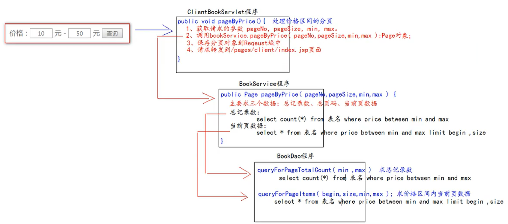

# 第六阶段：后台图书分页


## 1.编写数据库对应的JavaBean对象

- 数据库t_bool已经建立
- **Page对象**

```java
package com.kl.pojo;

import java.util.List;

/**
 * page是分页的模型的对象
 * @param <T> 具体的模块JavaBean类
 */
public class Page<T> {
   
    //每页展示的数据
    public static final Integer PAGE_SIZE = 2;
    
    //当前页码
    private Integer pageNo;

    //总页码数
    private Integer pageTotal;

    //当前页的显示数量
    private Integer pageSize = PAGE_SIZE;

    //数据库表中的总记录数
    private Integer pageTotalCount;

    //当前页的数据
    private List<T> items;

    public Integer getPageNo() {
        return pageNo;
    }

    public void setPageNo(Integer pageNo) {
        //边界检查
        if (pageNo < 1){
            this.pageNo = 1;
        }else if (pageNo > pageTotal){
            this.pageNo = pageTotal;
        }else {
            this.pageNo = pageNo;
        }
    }
    
    //不需要全参构造函数、其他getter/setter、toString方法--------------省略
}
```

## 2.在BookDao中添加分页查询方法

```java
public interface BookDao {
    //----------------省略------------------
    
    
    /**
     * 统计当前数据库表中的全部信息条数
     * @return 返回数量大小
     */
    Integer queryForPageTotalCount();

    /**
     *
     * @param begin 查询的起始索引,索引从0开始
     * @param pageSize 查询信息的条数
     * @return 返回从begin到begin+pageSize的所有信息
     */
    List<Book> queryForPageItems(int begin, int pageSize);
}
```

- **BookDaoImpl实现BookDao中接口方法**

```java
public class BookDaoImpl extends BaseDao implements BookDao {
    //--------------------省略-----------------------

    @Override
    public Integer queryForPageTotalCount() {
        String sql = "select count(*) from t_book";
        //从数据库中返回的信息数量类型为Number类型,不能直接强转为int类型!!!
        Number count = (Number) queryForSingleValue(sql);
        //转换为int类型
        return count.intValue();
    }

    @Override
    public List<Book> queryForPageItems(int begin, int pageSize) {
        String sql = "select `id`,`name`,`author`,`price`,`sales`,`stock`,`img_path` imgPath from t_book limit ?,?";
        return queryForList(Book.class, sql, begin,pageSize);
    }
}
```

- **测试**

```java
public class BookDaoTest {
    BookDao bookDao = new BookDaoImpl();

    //-------------------其他------------------------
    
    @Test
    public void queryForPageTotalCount() {
        //查询t_book表中的全部数据大小
        Integer totalCount = bookDao.queryForPageTotalCount();
        System.out.println(totalCount);
    }

    @Test
    public void queryForPageItems() {
        //开始索引为0,显示4条数据的查询集合
        List<Book> books = bookDao.queryForPageItems(0, 4);
        for (Book book : books) {
            System.out.println(book);
        }
    }
}
```

## 3.在BookService添加查询图书列表和返回page的方法

```java
public interface BookService {
    
    //-------------其他----------------

    List<Book> queryBookList();

    Page<Book> page(int pageNo, int pageSize);
}
```

- **在BookServiceImpl中实现**

```java
public class BookServiceImpl implements BookService {
    private BookDao bookDao = new BookDaoImpl();
    
    @Override
    public List<Book> queryBookList() {
        return bookDao.queryBookList();
    }

    //注:因为在Page对象中的setPageNo方法中进行了pageNo和PageTotal的合法性比较检查,所以要在设置pageNo前求出PageTotal的大小,否则会出现空指针异常
    @Override
    public Page<Book> page(int pageNo, int pageSize) {
        Page<Book> page = new Page<>();
        //1.求总的图书数量并设置
        Integer pageTotalCount = bookDao.queryForPageTotalCount();
        page.setPageTotalCount(pageTotalCount);
        //2.求总页码,向上取整,再转换为整型
        double ceil = Math.ceil(pageTotalCount * 1.0 / pageSize);
        Integer pageTotal = (int) ceil;
        page.setPageTotal(pageTotal);
        //3.设置当前页码
        page.setPageNo(pageNo);
        //4.设置每页展示的数据量
        page.setPageSize(pageSize);
        //求当前页数据的开始索引
        int begin = (pageNo - 1) * pageSize;
        //5.查询并设置当前页数据
        List<Book> items = bookDao.queryForPageItems(begin,pageSize);
        page.setItems(items);
        return page;
    }
}
```

- **测试**

```java
public class BookServiceTest {

    private BookService bookService = new BookServiceImpl();

    //------------------其他--------------------------

    @Test
    public void queryBookList() {
        List<Book> books = bookService.queryBookList();
        for (Book book : books) {
            System.out.println(book);
        }
    }

    @Test
    public void page() {
        //查询第1页的4条数据
        Page<Book> page = bookService.page(1, 4);
        System.out.println(page);
    }
}
```

## 4.在BookServlet程序中添加page方法和页面交互

```java
public class BookServlet extends BaseServlet {
    private BookService bookService = new BookServiceImpl();
    protected void page(HttpServletRequest req, HttpServletResponse resp) throws ServletException, IOException {
        //1.获取请求参数并解析为int类型
        int pageNo = WebUtils.parseInt(req.getParameter("pageNo"), 1);
        int pageSize = WebUtils.parseInt(req.getParameter("pageSize"), Page.PAGE_SIZE);
        //2.调用BookService.page(pageNo,pageSize):返回Page对象
        Page<Book> bookPage = bookService.page(pageNo,pageSize);
        //3.保存Page对象到request域中
        req.setAttribute("bookPage", bookPage);
        //4.请求转发到pages/manager/book_manager.jsp页面
        req.getRequestDispatcher("/pages/manager/book_manager.jsp").forward(req, resp);
    }
}
```

## 5.web层和页面联调

- 在跳转到book_manager.jsp页面之前应该要先取得Page对象,再解析Page对象中的信息来展示在book_manager.jsp页面上
- **修改manager.jsp页面的请求地址，需求请求BookServlet并调用其中的page方法取得Page对象**

```jsp
<body>
<h1>欢迎进入后台管理页面</h1>
<h2><a href="manager/bookServlet?action=page">图书管理</a></h2>
</body>
```

- **在book_manager.jsp页面解析Page对象的数据**

```jsp
<%@ taglib prefix="c" uri="http://java.sun.com/jsp/jstl/core" %>
<%@ page contentType="text/html;charset=UTF-8" language="java" %>
<html>
<head>
    <title>图书管理</title>
    <%--静态包含 base标签 jQuery文件--%>
    <%@include file="/pages/common/head.jsp" %>
    <style type="text/css">

        table {
            margin-left: 450px;
            text-align: center;
            width: 600px;
            height: 100px;
            border: 1px royalblue solid;
        }

        td, tr {
            height: 80px;
            border: 1px royalblue solid;
        }
    </style>
    <script type="text/javascript">
        $(function () {
            //给删除的a标签绑定单击事件用于确定删除操作
            $("a.deleteClass").click(function () {
                /**
                 * confirm是确定提示框函数,参数是它的提示内容
                 * confirm有两个按钮,一个确定---返回true,一个取消---返回false
                 * 在事件function函数中有一个this对象是当前正在响应时间的dom对象
                 * 这里的this即是a标签,先拿到a标签的父标签td,再拿到爷爷标签tr,再取爷爷标签下的第一个td标签中的内容,即书名
                 */
                return confirm("你确定要删除《" + $(this).parent().parent().find("td:first").text() + "》吗？")
            });

            //跳转到指定的页码
            $("#jump").click(function () {
                let pageNo = $("#target").val();
                //校验:合法的页码才进行跳转
                if (pageNo > 0 && pageNo <= ${requestScope.bookPage.pageTotal}) {
                    /**
                     * location是JavaScript语言中提供的地址栏对象
                     * location一个属性是href可以获取浏览器地址栏中的地址
                     * href属性可读可写
                     * @type {string}
                     */
                    location.href = "${pageContext.getAttribute("basePath")}manager/bookServlet?action=page&pageNo=" + pageNo;
                }
            })
        })
    </script>
</head>
<body>
<table>
    <tr>
        <th colspan="7">图书列表</th>
    </tr>
    <tr>
        <td>名称</td>
        <td>价格</td>
        <td>作者</td>
        <td>销量</td>
        <td>库存</td>
        <td colspan="2">操作</td>
    </tr>
    <c:forEach items="${requestScope.bookPage.items}" var="book">
        <tr>
            <td>${book.name}</td>
            <td>${book.price}</td>
            <td>${book.author}</td>
            <td>${book.sales}</td>
            <td>${book.stock}</td>
                <%--修改图书,先请求获取图书要修改的图书信息并显示到页面上--%>
            <td><a href="manager/bookServlet?action=getBook&id=${book.id}">修改</a></td>
                <%--删除操作向BookServlet程序发起请求 参数1:需要调用的方法 参数2:需要删除的图书id--%>
            <td><a class="deleteClass" href="manager/bookServlet?action=delete&id=${book.id}">删除</a></td>
        </tr>
    </c:forEach>
    <tr>
        <td colspan="7" align="right">
            <a href="pages/manager/book_edit.jsp">添加图书</a>
        </td>
    </tr>
    <tr>
        <td colspan="7">
            <c:if test="${requestScope.bookPage.pageNo > 1}">
                <a href="manager/bookServlet?action=page&pageNo=1">首页</a>
                <a href="manager/bookServlet?action=page&pageNo=${requestScope.bookPage.pageNo-1}">上一页</a>
            </c:if>
            <%--页码输出:要求最多显示5个页码--%>
            <c:choose>
                <%--情况1：总页码小于等于5的情况，页码的范围是1到总页码--%>
                <c:when test="${requestScope.bookPage.pageTotal <= 5}">
                    <c:set var="begin" value="1"/>
                    <c:set var="end" value="${requestScope.bookPage.pageTotal}"/>
                </c:when>
                <%--情况2：总页码大于5的情况--%>
                <c:when test="${requestScope.bookPage.pageTotal > 5}">
                    <c:choose>
                        <%--小情况1：当前页码为前面3个，即1,2,3的情况，页码的范围是1到5--%>
                        <c:when test="${requestScope.bookPage.pageNo <= 3}">
                            <c:set var="begin" value="1"/>
                            <c:set var="end" value="5"/>
                        </c:when>
                        <%--小情况2：当前页码为最后3个，即8,9,10，页码的范围 = 总页码 - 4 到 总页码--%>
                        <c:when test="${requestScope.bookPage.pageNo > requestScope.bookPage.pageTotal - 3}">
                            <c:set var="begin" value="${requestScope.bookPage.pageTotal - 4}"/>
                            <c:set var="end" value="${requestScope.bookPage.pageTotal}"/>
                        </c:when>
                        <%--小情况3：4,5,6,7,页码范围是当前页码减2 到 当前页码加2--%>
                        <c:otherwise>
                            <c:set var="begin" value="${requestScope.bookPage.pageNo - 2}"/>
                            <c:set var="end" value="${requestScope.bookPage.pageNo + 2}"/>
                        </c:otherwise>
                    </c:choose>
                </c:when>
            </c:choose>
            <c:forEach begin="${begin}" end="${end}" var="i">
                <c:if test="${i == requestScope.bookPage.pageNo}">【${i}】</c:if>
                <c:if test="${i != requestScope.bookPage.pageNo}">
                    <a href="manager/bookServlet?action=page&pageNo=${i}">${i}</a>
                </c:if>
            </c:forEach>
            <c:if test="${requestScope.bookPage.pageNo < requestScope.bookPage.pageTotal}">
                <a href="manager/bookServlet?action=page&pageNo=${requestScope.bookPage.pageNo+1}">下一页</a>
                <a href="manager/bookServlet?action=page&pageNo=${requestScope.bookPage.pageTotal}">末页</a>
            </c:if>
            共${requestScope.bookPage.pageTotal}页，${requestScope.bookPage.pageTotalCount}条记录
            到第<input value="${requestScope.bookPage.pageNo}" id="target" size="1px">页
            <input type="button" id="jump" value="确定">
        </td>
    </tr>
</table>
</body>
</html>
```


- **分页操作对其他操作会造成影响，需要把BookServlet程序中所有之前向queryList方法发起请求的地址改为向page方法发起请求**
- 如add / detele / updata方法中修改重定向地址

```java
 resp.sendRedirect(req.getContextPath() + "/manager/bookServlet?action=queryLsit");
```

- 修改为：

```java
 resp.sendRedirect(req.getContextPath() + "/manager/bookServlet?action=page");
```

- 由于在添加或者删除或者修改后我们需要定位到我们所改动的那个数据，而不是从第一页开始显示，所以在进行请求定位的时候还有加上pageNo参数

```java
resp.sendRedirect(req.getContextPath() + "/manager/bookServlet?action=page&pageNo="+req.getParameter("pageNo"));
```

- 在book_manager.jsp页面也要加上请求参数，否则BookServlet程序获取不到

```jsp
<!--1.附带pageNo参数-->
<td><a href="manager/bookServlet?action=getBook&id=${book.id}&pageNo=${requestScope.bookPage.pageNo}">修改</a></td>

<!--2.-->
<td><a class="deleteClass" href="manager/bookServlet?action=delete&id=${book.id}&pageNo=${requestScope.bookPage.pageNo}">删除</a></td>

<!--3.-->
<td colspan="7" align="right">
    <a href="pages/manager/book_edit.jsp?pageNo=${requestScope.bookPage.pageTotal}">添加图书</a>
</td>
```

## 6.小结

- 到这里后台的任务就算基本完成了！！！

# 第七阶段：前台图书分页


## 1.初步实现

1. 服务器启动进入主页面index.jsp，主页面只负责请求转发

```jsp
<%@ page contentType="text/html;charset=UTF-8" language="java" %>
<!--只负责请求转发-->
<jsp:forward page="/client/clientBookServlet?action=page"/>
```

2. 在web层下创建CilentBookServlet程序

```java
public class ClientBookServlet extends BaseServlet {
    private BookService bookService = new BookServiceImpl();

    protected void page(HttpServletRequest req, HttpServletResponse resp) throws ServletException, IOException {
        //1.获取请求参数并解析为int类型
        int pageNo = WebUtils.parseInt(req.getParameter("pageNo"), 1);
        int pageSize = WebUtils.parseInt(req.getParameter("pageSize"), Page.PAGE_SIZE);
        //2.调用BookService.page(pageNo,pageSize):返回Page对象
        Page<Book> bookPage = bookService.page(pageNo,pageSize);
        //3.保存Page对象到request域中
        req.setAttribute("bookPage", bookPage);
        //4.请求转发到pages/manager/book_manager.jsp页面
        req.getRequestDispatcher("/pages/client/index.jsp").forward(req, resp);
    }
}
```

3. 在pages目录下创建client目录，并创建index.jsp文件用户给主页面的index.jsp回显数据

```jsp
<%@ taglib prefix="c" uri="http://java.sun.com/jsp/jstl/core" %>
<%@ page contentType="text/html;charset=UTF-8" language="java" %>
<%--静态包含 base标签 jQuery文件--%>
<%@include file="/pages/common/head.jsp" %>
<html>
<head>
    <title>Title</title>
    <style type="text/css">
        td{
            /*border: 1px blue solid;*/
            margin-left: 50px;
        }
        #inner{
            margin-left: 100px;
            width: 300px;
        }
        #out{
            margin: 10px 400px;
        }
    </style>
</head>
<body>
<h1 align="center">欢迎</h1>
<table>
    <tr>
        <td><h2><a href="pages/user/login.jsp">登录</a></h2></td>
        <td> <h2><a href="pages/user/register.jsp">注册</a></h2></td>
        <td> <h2><a href="pages/manager/manager.jsp">后台管理</a></h2></td>
    </tr>
</table>
<table>
    <tr>
<c:forEach items="${requestScope.bookPage.items}" var="book">
    <td>
    <table id="inner">
        <tr>
            <td colspan="2">
        </tr>
        <tr>
            <td>书名:</td>
            <td>${book.name}</td>
        </tr>
        <tr>
            <td>作者:</td>
            <td>${book.author}</td>
        </tr>
        <tr>
            <td>价格:</td>
            <td>${book.price}</td>
        </tr>
        <tr>
            <td>销量:</td>
            <td>${book.sales}</td>
        </tr>
        <tr>
            <td>库存:</td>
            <td>${book.stock}</td>
        </tr>
    </table>
    </td>
</c:forEach>
    </tr>
</table>
<table id="out">

    <td colspan="7">
        <c:if test="${requestScope.bookPage.pageNo > 1}">
            <a href="client/clientBookServlet?action=page&pageNo=1">首页</a>
            <a href="client/clientBookServlet?action=page&pageNo=${requestScope.bookPage.pageNo-1}">上一页</a>
        </c:if>
        <%--页码输出:要求最多显示5个页码--%>
        <c:choose>
            <%--情况1：总页码小于等于5的情况，页码的范围是1到总页码--%>
            <c:when test="${requestScope.bookPage.pageTotal <= 5}">
                <c:set var="begin" value="1"/>
                <c:set var="end" value="${requestScope.bookPage.pageTotal}"/>
            </c:when>
            <%--情况2：总页码大于5的情况--%>
            <c:when test="${requestScope.bookPage.pageTotal > 5}">
                <c:choose>
                    <%--小情况1：当前页码为前面3个，即1,2,3的情况，页码的范围是1到5--%>
                    <c:when test="${requestScope.bookPage.pageNo <= 3}">
                        <c:set var="begin" value="1"/>
                        <c:set var="end" value="5"/>
                    </c:when>
                    <%--小情况2：当前页码为最后3个，即8,9,10，页码的范围 = 总页码 - 4 到 总页码--%>
                    <c:when test="${requestScope.bookPage.pageNo > requestScope.bookPage.pageTotal - 3}">
                        <c:set var="begin" value="${requestScope.bookPage.pageTotal - 4}"/>
                        <c:set var="end" value="${requestScope.bookPage.pageTotal}"/>
                    </c:when>
                    <%--小情况3：4,5,6,7,页码范围是当前页码减2 到 当前页码加2--%>
                    <c:otherwise>
                        <c:set var="begin" value="${requestScope.bookPage.pageNo - 2}"/>
                        <c:set var="end" value="${requestScope.bookPage.pageNo + 2}"/>
                    </c:otherwise>
                </c:choose>
            </c:when>
        </c:choose>
        <c:forEach begin="${begin}" end="${end}" var="i">
            <c:if test="${i == requestScope.bookPage.pageNo}">【${i}】</c:if>
            <c:if test="${i != requestScope.bookPage.pageNo}">
                <a href="client/clientBookServlet?action=page&pageNo=${i}">${i}</a>
            </c:if>
        </c:forEach>
        <c:if test="${requestScope.bookPage.pageNo < requestScope.bookPage.pageTotal}">
            <a href="client/clientBookServlet?action=page&pageNo=${requestScope.bookPage.pageNo+1}">下一页</a>
            <a href="client/clientBookServlet?action=page&pageNo=${requestScope.bookPage.pageTotal}">末页</a>
        </c:if>
        共${requestScope.bookPage.pageTotal}页，${requestScope.bookPage.pageTotalCount}条记录
        到第<input value="${requestScope.bookPage.pageNo}" id="target" size="1px">页
        <input type="button" id="jump" value="确定">
    </td>

</table>
</body>
</html>
```


- **注意页码输出栏的请求地址和后台的页面请求地址不同**

## 2.分页条的抽取

- 问题：前台的页面请求和后台的相差不大，仅仅是在点击页码时请求的地址变化了，所以，可以将页码部分提出到公共部分，在前后台使用静态包含页面即可
- 注意，要把点击事件的Script也包含进去，否则前台数据不能指定页码跳转
- 为了让前后台请求的地址正确，在Page类中增加一个URL属性来设置他们各自的请求地址 

```java
public class Page<T> {
    //....................
    
    //请求地址
    private String baseURL;

    public String getBaseURL() {
        return baseURL;
    }

    public void setBaseURL(String baseURL) {
        this.baseURL = baseURL;
    }
    
    //.....................
}
```

- 将分页是jsp代码放入/pages/common/pageLine.jsp中，并修改请求地址为动态形式，如下

```jsp
<a href="${requestScope.bookPage.baseURL}&pageNo=${requestScope.bookPage.pageNo+1}">下一页</a>
```

- 在前后台Servlet程序中设置baseURL地址
- 前台：

```java
Page<Book> bookPage = bookService.page(pageNo,pageSize);
bookPage.setBaseURL("client/clientBookServlet?action=page");
```

- 后台

```java
Page<Book> bookPage = bookService.page(pageNo,pageSize);
bookPage.setBaseURL("manager/bookServlet?action=page");
```

- 在前后台需要分页的地方使用动态包含

```jsp
<%@include file="/pages/common/pageLine.jsp"%>
```

## 3.价格区间搜索



- **在client文件下的index.jsp文件中增加搜索框**


```jsp
<form action="client/clientBookServlet" method="post">
    <input type="hidden" name="action">
    价格：<input type="text" size="1px" name="min">
    &nbsp;元 - <input type="text" size="1px" name="max" value="${param.max}">&nbsp;元
    &nbsp;<input type="submit" value="确定">
</form>
```

- web层需要调用按照价格来分页的方法

```java
protected void pageByPrice(HttpServletRequest req, HttpServletResponse resp) throws ServletException, IOException {
    //1.获取请求参数并解析为int类型
    int pageNo = WebUtils.parseInt(req.getParameter("pageNo"), 1);
    int pageSize = WebUtils.parseInt(req.getParameter("pageSize"), Page.PAGE_SIZE);
    int min = WebUtils.parseInt(req.getParameter("min"),0);
    int max = WebUtils.parseInt(req.getParameter("max"),Integer.MAX_VALUE);

    //2.调用BookService.pageByPrice(pageNo,pageSize,min,max):返回Page对象
    Page<Book> bookPage = bookService.pageByPrice(pageNo,pageSize,min,max);
    bookPage.setBaseURL("client/clientBookServlet?action=pageByPrice");
    //3.保存Page对象到request域中
    req.setAttribute("bookPage", bookPage);
    //4.请求转发到pages/manager/book_manager.jsp页面
    req.getRequestDispatcher("/pages/client/index.jsp").forward(req, resp);
}
```

- service层需要利用dao层实现按照价格区间来获取分页实例的方法

```java
public class BookServiceImpl implements BookService {
    private BookDao bookDao = new BookDaoImpl();
    
    //.....................
    
    @Override
    public Page<Book> pageByPrice(int pageNo, int pageSize, int min, int max) {
        Page<Book> page = new Page<>();
        //1.求总的图书数量并设置
        Integer pageTotalCount = bookDao.queryForPageTotalCountByPrice(min,max);
        page.setPageTotalCount(pageTotalCount);
        //2.求总页码,向上取整,再转换为整型
        double ceil = Math.ceil(pageTotalCount * 1.0 / pageSize);
        Integer pageTotal = (int) ceil;
        page.setPageTotal(pageTotal);
        //3.设置当前页码
        page.setPageNo(pageNo);
        //4.设置每页展示的数据量
        page.setPageSize(pageSize);
        //求当前页数据的开始索引
        int begin = (page.getPageNo() - 1) * pageSize;
        //5.查询并设置当前页数据
        List<Book> items = bookDao.queryForPageItemsByPrice(begin, pageSize,min,max);
        page.setItems(items);
        return page;
    }
}
```

- dao层需要实现和数据库直接交互，按照价格区间查询区间里的总数据和每页对应的Item

```java
public class BookDaoImpl extends BaseDao implements BookDao {
    
    @Override
    public Integer queryForPageTotalCountByPrice(int min, int max) {
        String sql = "select count(*) from t_book where price between ? and ?";
        //从数据库中返回的信息数量类型为Number类型,不能直接强转为int类型
        Number count = (Number) queryForSingleValue(sql,min,max);
        //转换为int类型
        return count.intValue();
    }

    @Override
    public List<Book> queryForPageItemsByPrice(int begin, int pageSize, int min, int max) {
        String sql = "select `id`,`name`,`author`,`price`,`sales`,`stock`,`img_path` imgPath from t_book " +
            "where price between ? and ? order by price limit ?,?";
        return queryForList(Book.class, sql, min,max,begin,pageSize);
    }
}
```

## 4.搜索价格区间的回显

- 经过上面的步骤查询已经没有问题，但是我们查询结束之后价格填写的价格区间就会消息
- 给输入框的value属性动态赋值即可

```java
<form action="client/clientBookServlet" method="post">
    <input type="hidden" name="action" value="pageByPrice">
    价格：<input type="text" size="1px" name="min" value="${param.min}">
    &nbsp;元 - <input type="text" size="1px" name="max" value="${param.max}">&nbsp;元
    &nbsp;<input type="submit" value="确定">
</form>
```

## 5.解决分页条中不带价格区间的bug

- 在查询数据之后，假如本来查询的结果是两页，结果点击下一页之后会出现其他页码


- 需要在web层进行请求转发时带上区间参数
- 修改ClientBookServlet程序中的pageByPrice函数

```java
protected void pageByPrice(HttpServletRequest req, HttpServletResponse resp) throws ServletException, IOException {
    //1.获取请求参数并解析为int类型
    int pageNo = WebUtils.parseInt(req.getParameter("pageNo"), 1);
    int pageSize = WebUtils.parseInt(req.getParameter("pageSize"), Page.PAGE_SIZE);
    int min = WebUtils.parseInt(req.getParameter("min"),0);
    int max = WebUtils.parseInt(req.getParameter("max"),Integer.MAX_VALUE);

    //2.调用BookService.pageByPrice(pageNo,pageSize,min,max):返回Page对象
    Page<Book> bookPage = bookService.pageByPrice(pageNo,pageSize,min,max);
    StringBuilder builder = new StringBuilder();
    
    //追加上min和max参数
    builder.append("client/clientBookServlet?action=pageByPrice");
    if (req.getParameter("min") != null){
        builder.append("&min=");
        builder.append(req.getParameter("min"));
    }
    if (req.getParameter("max") != null){
        builder.append("&max=");
        builder.append(req.getParameter("max"));
    }
    bookPage.setBaseURL(builder.toString());
    //3.保存Page对象到request域中
    req.setAttribute("bookPage", bookPage);
    //4.请求转发到pages/manager/book_manager.jsp页面
    req.getRequestDispatcher("/pages/client/index.jsp").forward(req, resp);
}
```


# 第八阶段：回显用户信息和注销

- 在主页面显示用户登录和注册
- 当用户登录成功后返回主页面有用户名提示信息
- 登录成功后可以注销用户和进入后台管理页面进行图书管理

---

- **在登录成功后在session中保存用户信息**

```java
protected void login(HttpServletRequest req, HttpServletResponse resp) throws ServletException, IOException {
    //1.获取请求参数
    String username = req.getParameter("username");
    String password = req.getParameter("password");

    //2.处理登录
    User login = userService.login(new User(null, username, password, null));
    if (login == null){ //登录失败，跳回登录页面
        System.out.println("用户名或密码错误");
        //把错误信息和需要回显的表单项信息保存到request域中
        req.setAttribute("msg", "用户名或密码错误!");
        req.setAttribute("user", null);


        //请求转发:重新回到登录界面
        req.getRequestDispatcher("/pages/user/login.jsp").forward(req, resp);
    }else { //登录成功，跳转到登录成功页面
        System.out.println("登录成功");
        
        //--------------------------关键代码----------------------------------
        req.getSession().setAttribute("user", user);
        //请求转发:跳转到登录成功界面
        req.getRequestDispatcher("/pages/user/login_success.jsp").forward(req, resp);
    }
}
```

- **在Userservlet中增加注销代码**

```java
protected void logout(HttpServletRequest req, HttpServletResponse resp) throws ServletException, IOException {
    req.getSession().invalidate();  //立即消除session
    resp.sendRedirect(req.getContextPath()+"/index.jsp"); //重定向到主页
    System.out.println("用户注销成功");
}
```

- 在回显到主页的client/index.jsp文件中读取session域中的用户名信息
  - 登录成功：显示注销和后台管理连接

```jsp
<table>
    <tr>
        <c:if test="${empty sessionScope.user}">
        <td><h2><a href="pages/user/login.jsp">登录</a></h2></td>
        <td> <h2><a href="pages/user/register.jsp">注册</a></h2></td>
        </c:if>
        <c:if test="${not empty sessionScope.user}">
            <td><h2>欢迎${sessionScope.user.username}</h2></td>
            <td><h2><a href="userServlet?action=logout">注销</a></h2></td>
        <td> <h2><a href="pages/manager/manager.jsp">后台管理</a></h2></td>
        </c:if>
    </tr>
<table>
```


# 第九阶段：购物车


## 1.创建购物车模型

- 在pojo中创建购物车的商品项CartItem

```java
package com.kl.pojo;
import java.math.BigDecimal;

public class CartItem {
    private Integer id; //商品编号
    private String name; //商品名称
    private Integer count; //商品数量
    private BigDecimal price; //商品单价
    private BigDecimal totalPrice; //商品总价 = 商品单价 X 商品数量
    
    //有参、无参构造函数、getter/setter方法...................省略
}
```

- 在pojo中创建购物车对象Cart

```java
package com.kl.pojo;

import java.math.BigDecimal;
import java.util.Collection;
import java.util.LinkedHashMap;
import java.util.Map;

public class Cart {
    /**
     * key是单个商品对应的id
     * value是对应的单个商品
     */
    private Map<Integer, CartItem> cartItemMap = new LinkedHashMap<>();

    public void addItem(CartItem cartItem) {

        //先查看购物车中是否已经添加过此商品
        //若商品存在则在原来的商品数量上加一,总价格也需要更新:单价 X 总量
        CartItem item = cartItemMap.get(cartItem.getId());
        if (item != null) {
            item.setCount(item.getCount() + 1);
            item.setTotalPrice(item.getPrice().multiply(new BigDecimal(item.getCount())));
        } else {
            cartItemMap.put(cartItem.getId(), cartItem);
        }
    }

    /**
     * 通过商品id删除某件特定的商品
     */
    public void deleteItemById(Integer id) {
        CartItem cartItem = cartItemMap.get(id);
        if (cartItem != null){
            cartItemMap.remove(id);
        }
    }

    /**
     * 清空购物车
     */
    public void clearCart() {
        cartItemMap.clear();
    }

    /**
     * 更新商品总量
     */
    public void updateCount(Integer id,Integer count) {
        CartItem item = cartItemMap.get(id);
        //若商品存在则更新商品数量
        if (item != null) {
            item.setCount(count);
            item.setTotalPrice(item.getPrice().multiply(new BigDecimal(item.getCount())));
        }
    }


    /**
     * @return 返回购物车里总的商品数量
     */
    public Integer getTotalCount() {
        Integer totalCount = 0;
        Collection<CartItem> values = cartItemMap.values();
        for (CartItem value : values) {
            totalCount += value.getCount();
        }
        return totalCount;
    }


    public BigDecimal getTotalPrice() {
        BigDecimal totalPrice = new BigDecimal("0");
        Collection<CartItem> values = cartItemMap.values();
        for (CartItem value : values) {
            totalPrice = totalPrice.add(value.getPrice().multiply(new BigDecimal(value.getCount())));
        }
        return totalPrice;
    }


    public Map<Integer, CartItem> getCartItemMap() {
        return cartItemMap;
    }

    @Override
    public String toString() {
        return "Cart{"
                + "totalCount=" + getTotalCount()
                + "totalPrice=" + getTotalPrice()
                + ", cartItemMap=" + cartItemMap
                + '}';
    }
}
```

- 对于商品的总量和总价格不应该设置setter方法，需要由用户的选择决定

## 2.购物车方法测试

```java
package com.kl.test;

import com.kl.pojo.Cart;
import com.kl.pojo.CartItem;
import org.junit.Test;
import java.math.BigDecimal;
import static org.junit.Assert.*;

public class CartTest {

    public Cart getCart(){
        Cart cart = new Cart();
        cart.addItem(new CartItem(1,"Java基础",1,
                new BigDecimal("10"),new BigDecimal("10")));
        cart.addItem(new CartItem(1,"Java基础",1,
                new BigDecimal("10"),new BigDecimal("10")));
        cart.addItem(new CartItem(2,"Java高级",1,
                new BigDecimal("20"),new BigDecimal("20")));
        return cart;
    }

    @Test
    public void addItem() {
        Cart cart = getCart();
        System.out.println(cart);
    }

    @Test
    public void deleteItemById() {
        Cart cart = getCart();
        System.out.println(cart);
        cart.deleteItemById(2);
        System.out.println(cart);
    }

    @Test
    public void clearCart() {
        Cart cart = getCart();
        System.out.println(cart);
        cart.clearCart();
        System.out.println(cart);
    }

    @Test
    public void updateCount() {
        Cart cart = getCart();
        System.out.println(cart);
        cart.updateCount(1,10);
        System.out.println(cart);
    }
}
```

## 3.加入购物车功能的实现

- **在web层创建CartServlet程序并配置**

```java
public class CartServlet extends BaseServlet{
    BookService bookService = new BookServiceImpl();

    protected void addItem(HttpServletRequest req, HttpServletResponse resp) throws ServletException, IOException {
        //1.根据用户的点击获取到商品的id属性
        int id = WebUtils.parseInt(req.getParameter("id"),0);

        //2.在数据库中根据id属性查找到对应的book信息
        Book book = bookService.queryBookById(id);

        //3.将该book转化为商品项CartItem
        CartItem cartItem = new CartItem
                (book.getId(),book.getName(),1,book.getPrice(),book.getPrice());

        //4.若不存在购物车对象则创建并放入session域中
        Cart cart = (Cart) req.getSession().getAttribute("cart");
        if (cart == null){
            cart = new Cart();
            req.getSession().setAttribute("cart", cart);
        }
        //5.添加商品
        cart.addItem(cartItem);
        System.out.println(cartItem + "添加成功");
        //6.获取请求头地址 并 请求重定向回到用户点击的页面
        resp.sendRedirect(req.getHeader("Referer"));
    }
}
```

- **重定向回到当前访问页面的思路逻辑**


- 在client/index页面加入购物车功能

```jsp
<tr>
    <td colspan="2"><input type="button" class="addToCart" id="${book.id}" value="添加到购物车"></td>
</tr>
```

## 4.购物车的展示

- cart.jsp页面实现

```jsp
<%@ taglib prefix="c" uri="http://java.sun.com/jsp/jstl/core" %>
<%@ page contentType="text/html;charset=UTF-8" language="java" %>
<%--静态包含 base标签 jQuery文件--%>
<%@include file="/pages/common/head.jsp" %>
<html>
<head>
    <title>Title</title>
    <script>
        $(function () {
            $("a.delete").click(function () {
                return confirm("你确定要删除《" + $(this).parent().parent().find("td:first").text() + "》吗？")
            })
        })
    </script>
    <style type="text/css">
        td{
            margin-left: 50px;

        }
        #bottom{
            text-align: center;
            margin-left: 300px;
            border: blue 1px solid;
            width: 800px;
        }
    </style>
</head>
<body>
<table style="float: right">
    <tr>
        <td><a href=""><h3>我的订单</h3></a> </td>
        <td><a href="index.jsp"><h3>返回</h3></a> </td>
    </tr>
</table>
<table id="bottom">
    <tr>
        <td>书名</td>
        <td>数量</td>
        <td>单价</td>
        <td>总价</td>
        <td>操作</td>
    </tr>
    <!--购物车不为空的情况-->
    <c:if test="${not empty sessionScope.cart.cartItemMap}">
        <c:forEach items="${sessionScope.cart.cartItemMap}" var="node">
            <tr>
                <td>${node.value.name}</td>
                <td>${node.value.count}</td>
                <td>${node.value.price}</td>
                <td>${node.value.totalPrice}</td>
                <td><a href="#" class="delete">删除</a> </td>
            </tr>
        </c:forEach>
        <tr>
            <td>购物车中有&nbsp;<font style="color: red">${sessionScope.cart.totalCount}&nbsp;</font>件商品</td>
            <td>总金额<font color="blue">&nbsp;${sessionScope.cart.totalPrice}</font></td>
            <td><a href="">清空购物车</a></td>
            <td><a href="">去结账</a></td>
        </tr>
    </c:if>
    <!--购物车为空的情况-->
    <c:if test="${empty sessionScope.cart.cartItemMap}">
        <tr>
            <td colspan="4"><a href="index.jsp">亲，您的购物车为空，快去选购商品吧(*￣︶￣)</a></td>
        </tr>
    </c:if>
</table>
</body>
</html>
```


## 5.删除购物车商品项

```java
public class CartServlet extends BaseServlet{
    BookService bookService = new BookServiceImpl();

    protected void addItem(HttpServletRequest req, HttpServletResponse resp) throws ServletException, IOException {
        //.........................
    }

    protected void deleteItem(HttpServletRequest req, HttpServletResponse resp) throws ServletException, IOException {
        int id = WebUtils.parseInt(req.getParameter("id"), 0);
        Cart cart = (Cart) req.getSession().getAttribute("cart");
        if (cart != null){
            cart.deleteItemById(id);
        }
        resp.sendRedirect(req.getHeader("Referer"));
    }
}
```

- cart.jsp页面

```jsp
<!-------------提醒用户是否确定删除------------------->
<script>
    $(function () {
        $("a.delete").click(function () {
            return confirm("你确定要删除《" + $(this).parent().parent().find("td:first").text() + "》吗？")
        })
    })
</script>

<!-------------------------------->
<td><a href="cartServlet?action=deleteItem&id=${node.value.id}" class="delete">删除</a> </td>
```

## 6.清空购物车

```java
public class CartServlet extends BaseServlet{
    BookService bookService = new BookServiceImpl();

    protected void addItem(HttpServletRequest req, HttpServletResponse resp) throws ServletException, IOException {
        //............................
    }

    protected void deleteItem(HttpServletRequest req, HttpServletResponse resp) throws ServletException, IOException {
        //............................
    }
    
    protected void clear(HttpServletRequest req, HttpServletResponse resp) throws ServletException, IOException {
        Cart cart = (Cart) req.getSession().getAttribute("cart");
        if (cart != null){
            cart.clearCart();
        }
        resp.sendRedirect(req.getHeader("Referer"));
    }
}
```

- cart.jsp页面

```jsp
<script>
    $(function () {
        $("a.delete").click(function () {
            return confirm("你确定要删除《" + $(this).parent().parent().find("td:first").text() + "》吗？")
        });

        //提醒用户是否确定清空购物车
        $("a.clear").click(function () {
            return confirm("你确定要清空购物车吗？")
        })
    })
</script>

<!--------------------------------->
td><a href="cartServlet?action=clear" class="clear">清空购物车</a></td>
```

## 7.修改购物车商品数量

```java
protected void updateCount(HttpServletRequest req, HttpServletResponse resp) throws ServletException, IOException {
    int id = WebUtils.parseInt(req.getParameter("id"), 0);
    int count = WebUtils.parseInt(req.getParameter("count"), 1);
    Cart cart = (Cart) req.getSession().getAttribute("cart");
    if (cart != null){
        cart.updateCount(id, count);
    }
    System.out.println("修改成功");
    resp.sendRedirect(req.getHeader("Referer"));
}
```

- cart.jsp页面

```jsp
<script>
    //------------------------
    
    $("input.updateCount").change(function () {
        //获取商品名称、id和数量
        let name = $(this).parent().parent().find("td:first").text();
        let bookId = $(this).attr("id");
        let count = this.value;
        alert(count);
        if (confirm("你确定要将《" + name + "》商品数量修改为:" + count + "吗？")) {
            //注意注意:这里的location是小写，大写的跳转不了
            location.href = "http://localhost:8080/Practice/cartServlet?action=updateCount&count="+count+"&id="+bookId
        }else {
            this.value = this.defaultValue;
        }
    });
    })
</script>
```


- 修改数量属性为输入框

```jsp
<td><input type="text" style="text-align: center" size="1"
           value="${node.value.count}"
           class="updateCount" id="${node.value.id}"></td>
```

# 第十阶段：订单


## 1.创建数据库表

```mysql
use book;

create table t_order(
`order_id` varchar(50) primary key,
`create_time` datetime, -- 年月日 时分秒
`price` decimal(11,2),
`status` int,
`user_id` int,
foreign key(`user_id`) references b_user(`id`) -- 外键引用
);

create table t_order_item(
`id` int primary key auto_increment,
`name` varchar(100),
`count` int,
`price` decimal(11,2),
`total_price` decimal(11,2),
`order_id` varchar(50),
foreign key(`order_id`) references t_order(`order_id`)
);
```

## 2.创建订单模块的数据类型

- 订单Order

```java
public class Order {
    private String orderId; //订单号
    private Data createTime; //订单生成时间
    private BigDecimal price; //商品价格

    //0未发货 1已发货 2已签收
    private Integer status = 0; //订单状态
    private Integer userId; //确定是个用户的订单

    
    //有参无参、getter/setter、toString方法-----------省略
}
```

- 订单项OrderItem

```java
public class OrderItem {
    private Integer id; //订单项主键
    private String name; //商品名称
    private Integer count; //商品数量
    private BigDecimal price; //商品单价
    private BigDecimal totalCount; //商品总价
    private String orderId; //订单编号
    
    
     //有参无参、getter/setter、toString方法-----------省略
}
```

## 3.Dao模块和测试

- OrderDao接口

```java
package com.kl.dao;
import com.kl.pojo.Order;

public interface OrderDao {
    //保存订单
    public int saveOrder(Order order);
}
```

- OrderItemDao接口

```java
package com.kl.dao;
import com.kl.pojo.OrderItem;

public interface OrderItemDao {
    //保存订单项
    public int saveOrderItem(OrderItem orderItem);
}
```

- OrderDaoImpl实现

```java
package com.kl.dao.impl;
import com.kl.dao.OrderDao;
import com.kl.pojo.Order;

public class OrderDaoImpl extends BaseDao implements OrderDao {
    @Override
    public int saveOrder(Order order) {
      String sql = "insert into t_order(`order_id`,`create_time`,`price`,`status`,`user_id`) " +
              "values(?,?,?,?,?)";
        return update(sql,order.getOrderId(),order.getCreateTime(),order.getPrice(),order.getStatus(),order.getUserId());
    }
}
```

- OrderItemDaoImpl实现

```java
package com.kl.dao.impl;
import com.kl.dao.OrderItemDao;
import com.kl.pojo.OrderItem;

public class OrderItemDaoImpl extends BaseDao implements OrderItemDao {
    @Override
    public int saveOrderItem(OrderItem orderItem) {
        String sql = "insert into t_order_item(`name`,`count`,`price`,`total_price`,`order_id`) " +
                "values(?,?,?,?,?)";
        return update(sql,orderItem.getName(),orderItem.getCount(),
                orderItem.getPrice(),orderItem.getTotalPrice(),orderItem.getOrderId());
    }
}
```

- 测试

```java
public class OrderDaoTest {
    @Test
    public void saveOrder() {
        OrderDaoImpl orderDao = new OrderDaoImpl();
        orderDao.saveOrder(new Order("123456",new Date(),new BigDecimal("100"),0,1));
    }
}
```

```java
public class OrderItemDaoTest {

    @Test
    public void saveOrderItem() {
        OrderItemDaoImpl orderItemDao = new OrderItemDaoImpl();
        orderItemDao.saveOrderItem(new OrderItem(null,"算法",1,new BigDecimal("100"),
                new BigDecimal("100"),"123456"));
        orderItemDao.saveOrderItem(new OrderItem(null,"数据结构",2,new BigDecimal("50"),
                new BigDecimal("100"),"123456"));
    }
}
```

## 4.Service模块和测试

- OrderService接口

```java
public interface OrderService {
    String createOrder(Cart cart , Integer userId);
}
```

- OrderServiceImpl实现

```java
public class OrderServiceImpl implements OrderService {
    OrderDao orderDao = new OrderDaoImpl();
    OrderItemDao orderItemDao = new OrderItemDaoImpl();

    @Override
    public String createOrder(Cart cart, Integer userId) {
        //确保订单号的唯一性
        String orderId = System.currentTimeMillis()+""+userId;
        //创建一个订单对象
        Order order = new Order(orderId,new Date(),cart.getTotalPrice(),0,userId);
        //1.保存订单
        orderDao.saveOrder(order);

        //遍历购物车中的每一个商品项并转换成为订单保存到数据库中
        Collection<CartItem> values = cart.getCartItemMap().values();
        for (CartItem value : values) {
            OrderItem orderItem = new OrderItem(null,value.getName(),
                    value.getCount(),value.getPrice(),value.getTotalPrice(),orderId);
            //2.保存订单项
            orderItemDao.saveOrderItem(orderItem);
        }
        //清空购物车
        cart.clearCart();
        return orderId;
    }
}
```

- 测试

```java
public class OrderServiceTest {

    @Test
    public void createOrder() {
        Cart cart = new Cart();
        cart.addItem(new CartItem(1, "Java基础", 1,
                new BigDecimal("10"), new BigDecimal("10")));
        cart.addItem(new CartItem(1, "Java基础", 1,
                new BigDecimal("10"), new BigDecimal("10")));
        cart.addItem(new CartItem(2, "Java高级", 1,
                new BigDecimal("20"), new BigDecimal("20")));

        OrderService orderService = new OrderServiceImpl();
        String order = orderService.createOrder(cart, 1);
        System.out.println("生成的订单号 = " + order);
    }
}
```

## 4.web 层和页面联调

- OrderServlet

```java
public class OrderServlet extends BaseServlet {
    OrderService orderService = new OrderServiceImpl();

    protected void createOrder(HttpServletRequest req, HttpServletResponse resp) throws ServletException, IOException {
        User user = (User) req.getSession().getAttribute("user");
        if (user == null){
            req.getRequestDispatcher("/pages/user/login.jsp").forward(req,resp);
            return;
        }
        Integer id = user.getId();
        Cart cart = (Cart) req.getSession().getAttribute("cart");
        String orderId = orderService.createOrder(cart, id);

        req.getSession().setAttribute("orderId", orderId);
        resp.sendRedirect(req.getContextPath()+"/pages/cart/checkout.jsp");
    }
}
```

# 第十一阶段：拦截后台和管理事务

## 1.使用Filter过滤器实现后台权限管理

- 问题：当我们没有登录的时候：用户直接访问http://localhost:8080/pages/manager/book_manager.jsp页面能够直接跳转，这是不安全的
- 解决：使用filter过滤器检查，只有用户登录后，用户名存在的情况下才允许直接访问后台页面
- 创建ManagerFilter类

```java
public class ManagerFilter implements Filter {
    @Override
    public void init(FilterConfig filterConfig) throws ServletException {

    }

 @Override
    public void doFilter(ServletRequest servletRequest, ServletResponse servletResponse, FilterChain filterChain) throws IOException, ServletException {
        HttpServletRequest request = (HttpServletRequest) servletRequest;
        User user = (User) request.getSession().getAttribute("user");
        if (user == null){
            //用户没有登录，拒绝访问管理页面
            request.getRequestDispatcher("/pages/user/login.jsp").forward(servletRequest, servletResponse);
        }else {
            //放行
            filterChain.doFilter(servletRequest,servletResponse);
        }
    }

    @Override
    public void destroy() {

    }
}
```

- web.xml配置

```xml
<filter>
    <filter-name>ManagerFilter</filter-name>
    <filter-class>com.kl.filter.ManagerFilter</filter-class>
</filter>
<filter-mapping>
    <filter-name>ManagerFilter</filter-name>
    <!--1.拦截管理页面-->
    <url-pattern>/pages/manager/*</url-pattern>
    <!--2.拦截用户直接访问后台Servlet程序-->
    <url-pattern>/manager/bookServlet</url-pattern>
</filter-mapping>
```

## 2.使用 Filter 和 ThreadLocal 组合管理事务


- JdbcUtils 工具类的修改

```java
public class JdbcUtils {
    private static DruidDataSource dataSource = null;
    private static ThreadLocal<Connection> threadLocal = new ThreadLocal<>();

    static {
        //获取配置文件的输入流:注意要加斜杠
        InputStream stream = JdbcUtils.class.getResourceAsStream("/jdbc.properties");
        Properties properties = new Properties();
        try {
            assert stream != null;
            properties.load(stream); //使用Properties类加载流读取配置文件
            dataSource = (DruidDataSource) DruidDataSourceFactory.createDataSource(properties); //根据Properties类创建数据库连接池
        } catch (Exception e) {
            e.printStackTrace();
        }
    }

    public static Connection getConnection(){ //获取数据库连接
        Connection connection = threadLocal.get();
        if (connection == null){
            try {
                connection =  dataSource.getConnection();
                connection.setAutoCommit(false); //设置为手动管理事务
                threadLocal.set(connection); //保存到ThreadLocal中供后面的JDBC操作使用
            } catch (SQLException e) {
                e.printStackTrace();
            }
        }
        return connection;
    }

    public static void commitAndClose(){
        Connection conn = threadLocal.get();
        if (conn != null){
            try {
                conn.commit(); //提交事务
            } catch (SQLException e) {
                e.printStackTrace();
            }finally {
                try {
                    conn.close(); //关闭连接资源
                } catch (SQLException e) {
                    e.printStackTrace();
                }
            }
        }
        threadLocal.remove(); //一定要执行remove操作否则就会出错,因为Tomcat服务器底层使用了线程池技术
    }

    public static void rollbackAndClose(){
        Connection conn = threadLocal.get();
        if (conn != null){
            try {
               conn.rollback(); //提交事务
            } catch (SQLException e) {
                e.printStackTrace();
            }finally {
                try {
                    conn.close(); //关闭连接资源
                } catch (SQLException e) {
                    e.printStackTrace();
                }
            }
        }
        threadLocal.remove(); //一定要执行remove操作否则就会出错,因为Tomcat服务器底层使用了线程池技术
    }
```

- 修改 BaseDao，所有方法都在捕获异常后再抛出异常

```java
catch (SQLException e) {
    e.printStackTrace();
    throw new RuntimeException(e);
}
```

- 使用 Filter 过滤器统一给所有的 Service 方法都加上 try-catch。来进行实现的管理


- Filter 类代码：

```java
public class TransactionFilter implements Filter {
    @Override
    public void init(FilterConfig filterConfig) throws ServletException {

    }

    @Override
    public void doFilter(ServletRequest servletRequest, ServletResponse servletResponse, FilterChain filterChain) throws IOException, ServletException {
        try {
            filterChain.doFilter(servletRequest, servletResponse);
            JdbcUtils.commitAndClose(); //若无异常-提交事务并关闭连接资源
        } catch (Exception e) {
            e.printStackTrace();
            JdbcUtils.rollbackAndClose(); //回滚事务并关闭连接资源
        }
    }

    @Override
    public void destroy() {

    }
}
```

- 在 web.xml 中的配置： 

```xml
<filter>
    <filter-name>TransactionFilter</filter-name>
    <filter-class>com.kl.filter.TransactionFilter</filter-class>
</filter>
<filter-mapping>
    <filter-name>TransactionFilter</filter-name>
    <!--拦截所有页面-->
    <url-pattern>/*</url-pattern>
</filter-mapping>
```

- 一定要记得把 BaseServlet 中的异常往外抛给 Filter 过滤器 

```java
@Override
protected void doPost(HttpServletRequest req, HttpServletResponse resp) throws ServletException, IOException {
    req.setCharacterEncoding("UTF-8");
    String action = req.getParameter("action");
    try {
        //方法名 形参1 形参2
        Method method = this.getClass().getDeclaredMethod(action, HttpServletRequest.class, HttpServletResponse.class);
        //调用方法的对象 实参1 实参2
        method.invoke(this, req, resp);
    } catch (NoSuchMethodException | IllegalAccessException | InvocationTargetException e) {
        e.printStackTrace();
        throw new RuntimeException(); //----------------抛出异常
    }
}
```

- 将所有异常都统一交给 Tomcat，让 Tomcat 展示友好的错误信息页面，在web.xml中进行配置
- 注意，若需要实现错误页面自动跳转还需要在Filter过滤器里抛出异常

```xml
<error-page>
    <!--错误类型-->
    <error-code>500</error-code>
    <!--表示要跳转去的页面路径-->
    <location>/pages/error/error500.jsp</location>
</error-page>

<error-page>
    <!--错误类型-->
    <error-code>404</error-code>
    <!--表示要跳转去的页面路径-->
    <location>/pages/error/error404.jsp</location>
</error-page>
```

- TransactionFilter

```java
@Override
public void doFilter(ServletRequest servletRequest, ServletResponse servletResponse, FilterChain filterChain) throws IOException, ServletException {
    try {
        filterChain.doFilter(servletRequest, servletResponse);
        JdbcUtils.commitAndClose(); //提交事务并关闭连接资源
    } catch (Exception e) {
        JdbcUtils.rollbackAndClose(); //回滚事务并关闭连接资源
        e.printStackTrace();
        throw new RuntimeException();
    }
}
```

# 第十二阶段：使用AJAX请求

## 1.使用AJAX请求验证用户名是否可用


- 在注册页面为用户名表单项注册失去焦点事件

```jsp
<script type="text/javascript">
    $(function () {

        //给注册用户名一栏添加失去焦点事件
        $("#username").blur(function () {
            let username = this.value;
            $.getJSON("http://localhost:8080/Practice/userServlet","action=ajaxIsExistUserName&username="+username,function (data) {
                if (data.isExist){
                    $("span.errorMsg").text("用户名已存在!!!");
                }else {
                    $("span.errorMsg").text("用户名可用");
                }
            })
        });
        
        //.....................
</script>
```

- 在UserServlet程序中增加ajaxIsExistUserName方法

```java
public class UserServlet extends BaseServlet{
    UserService userService = new UserServiceImpl();

    protected void ajaxIsExistUserName(HttpServletRequest req, HttpServletResponse resp) throws ServletException, IOException {
        //获取用户名参数并判断是否存在于数据库中
        boolean isExist = userService.isExistUsername(req.getParameter("username"));
        Map<String,Boolean> map = new HashMap<>();
        map.put("isExist",isExist); //保存到map中并转化为json字符串
        Gson gson = new Gson();
        String json = gson.toJson(map);
        resp.getWriter().write(json); //回传到页面
    }
    //.......................
}
```


## 2.修改添加商品到购物车的实现

- 问题：之前的做法每次加入购物车都会重新发起请求返回一个新的页面，这会给服务器带来很大的压力
- 解决：使用异步调用避免阻塞


- CartServlet 程序：

```java
public class CartServlet extends BaseServlet{
    BookService bookService = new BookServiceImpl();

    protected void ajaxAddItem(HttpServletRequest req, HttpServletResponse resp) throws ServletException, IOException {
        //1.根据用户的点击获取到商品的id属性
        int id = WebUtils.parseInt(req.getParameter("id"),0);

        //2.在数据库中根据id属性查找到对应的book信息
        Book book = bookService.queryBookById(id);

        //3.将该book转化为商品项CartItem
        CartItem cartItem = new CartItem
                (book.getId(),book.getName(),1,book.getPrice(),book.getPrice());

        //4.若不存在购物车对象则创建并放入session域中
        Cart cart = (Cart) req.getSession().getAttribute("cart");
        if (cart == null){
            cart = new Cart();
            req.getSession().setAttribute("cart", cart);
        }
        //5.添加商品
        cart.addItem(cartItem);
        System.out.println(cartItem + "添加成功");
        
        //6.像浏览器返回信息,这部分一定要有,即使返回无用的信息,要配合jQuery中ajax的回调函数
        Gson gson = new Gson();
        String json = gson.toJson("回调函数");
        resp.getWriter().write(json);
    }
    
    //...........................
}
```

- pages/client/index.jsp 页面

```jsp
<script type="text/javascript">
   $(function () {
       $("input.addToCart").click(function () {
           let bookId = $(this).attr("id");
           //location.href = "cartServlet?action=addItem&id="+bookId;
           $.getJSON("http://localhost:8080/Practice/cartServlet","action=ajaxAddItem&id="+bookId,function (data) {
           })
       })
   })
</script>
```

