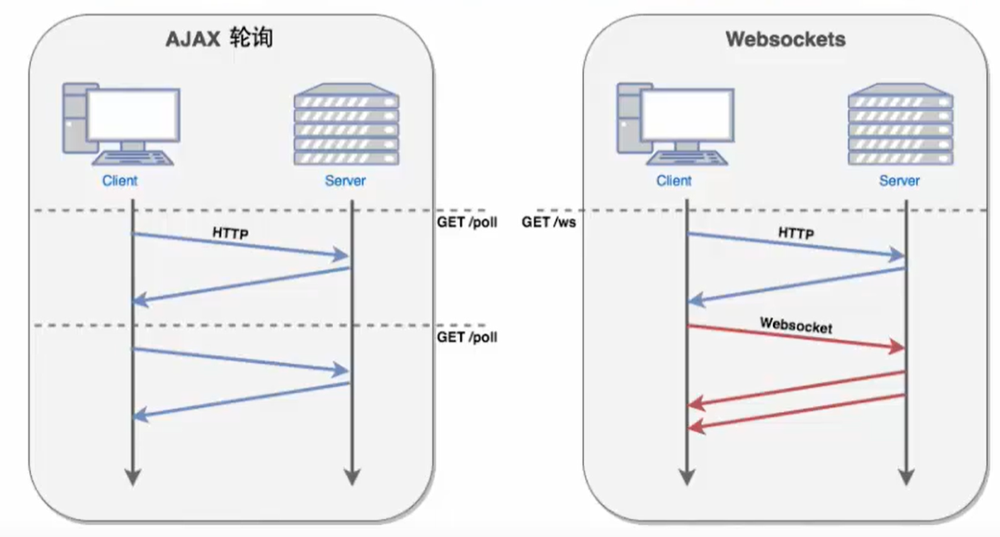
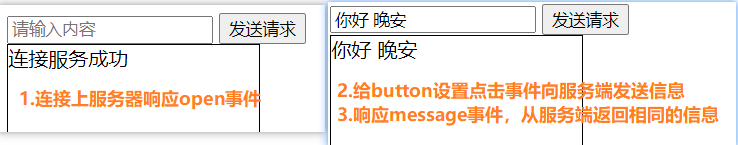

# WebSocket

## 1.介绍

>- WebSocket协议是基于TCP的一种新的网络协议。它实现了浏览器与服务器全双工（full-duplex）通信——允许服务器主动发送信息给客户端
>- 全双工：允许客户端主动的给服务端发送消息，服务端也可以主动的给客户端发送消息
>- websocket是一种持久协议，http是非持久协议
>- 持久协议：客户端与浏览器连接后不会断开，客户端可以不停的给服务端发消息，服务端也可以不停的给客户端发消息
>- 传统的socket连接也是长连接，但是很耗费资源，不建议使用

- 现在很多网站都有实时推送的需求，比如聊天，客服咨询等
- 早期没有websocket时，通过ajax轮询进行聊天转发
- ajax轮询：由于http请求，服务器无法给浏览器主动发送数据，因此需要浏览器定时的给服务器发送请求（比如1s一次），服务器把最新的数据响应给浏览器。也就是不断的询问服务器是否有最新的数据
- 这种模式的缺点就是浪费性能和资源



## 2.基本使用

- 在HTML5中，浏览器已经实现了websocket的API，直接使用即可

### 创建websocket对象

```html
<script>
/*
H5中已经提供了WebSocket的API,可直接使用
参数一:websocket的服务地址
 */
//1.创建WebSocket对象
let socket = new WebSocket('ws://echo.websocket.org');
</script>
```

### websocket事件

| 事件    | 事件处理程序     | 描述                       |
| :------ | :--------------- | :------------------------- |
| open    | Socket.onopen    | 连接建立时触发             |
| message | Socket.onmessage | 客户端接收服务端数据时触发 |
| error   | Socket.onerror   | 通信发生错误时触发         |
| close   | Socket.onclose   | 连接关闭时触发             |

### websocket方法

| 方法           | 描述             |
| :------------- | :--------------- |
| Socket.send()  | 使用连接发送数据 |
| Socket.close() | 关闭连接         |

```html
<!DOCTYPE html>
<html lang="en">
<head>
    <meta charset="UTF-8">
    <title>websocket</title>
    <style>
        div{
            width: 200px;
            height: 200px;
            border: 1px solid black;
        }
    </style>
</head>
<body>
<label>
    <input type="text" placeholder="请输入内容">
</label>
<button>发送请求</button>
<div></div>
<script>
    let input = document.querySelector('input');
    let button = document.querySelector('button');
    let div = document.querySelector('div');
    /*
    H5中已经提供了WebSocket的API,可直接使用
    参数一:websocket的服务地址
     */
    //1.创建WebSocket对象:官方提供的服务地址
    let socket = new WebSocket('ws://echo.websocket.org');

    //2.open:和WebSocket连接成功的时候触发
    socket.addEventListener('open',function () {
        div.innerHTML = '连接服务成功';
    });

    //3.主动给WebSocket服务发送请求
    button.addEventListener('click',function () {
        let value = input.value;
        socket.send(value);
    });

    //4.接收WebSocket服务的数据
    socket.addEventListener('message',function (e) {
        console.log(e.data);
        div.innerText = e.data;
    });

</script>
</body>
</html>
```

