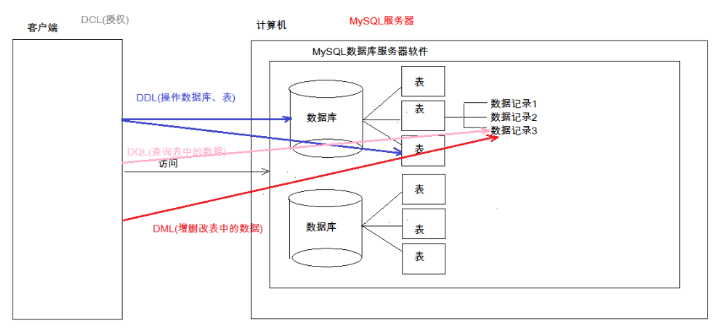
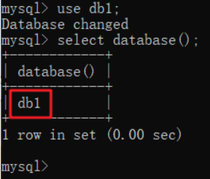

[数据库的基本概念](#1)

[什么是SQL](#2)

[SQL的分类和操作](#3)

[操作数据库](#数据库)

[操作表](#表)

[增删改表中数据](#增删改表中数据)

[查询表中的记录](#查询表中的记录)


# <a id=1>1.数据的基本概念</a>

1. 数据库的英文单词：DataBase 简称：DB
2. 数据库的定义：用于存储和管理数据的仓库
3. 数据库的特点
   - 持久化储存数据，其实数据库就是一个文件系统
   - 方便存储和管理数据
   - 使用了统一的方式操作数据库
4. 常见的数据库软件
   - 数据库就是一个概念，而数据库软件就是这些概念的实现
   - Oracle:收费的大型数据库
   - SQLite：嵌入式小型数据库，应用在手机端
   - 常用数据库：Oracle,MySQL

# <a id=2>2.MySQL</a>


- 什么是SQL?
  - 结构化查询语言，其实就是定义了操作所有的**关系型数据库的规则**。
  - 每一种数据库操作的方式存在不一样的地方，称为“方言”
- SQL通用语法
  - SQL 语句可以单行或多行书写，以分号结尾
    - `show databases;`
  - 使用空格和缩进来缩进语句的可读性
  - 语句不区分大小写，关键字建议使用大写
    - `show dataBASES;`
- 三种注释
  - 单行注释
    - -- 注释内容或# 注释内容(注意-- 需要一个空格，但是#号可以不需要空格)
  - 多行注释
    - `/* 注释 */`


# <a id=3>3.SQL的分类</a>

1. DDL(Data Definition Language)数据定义语言
   用来定义数据库对象：数据库，表，列等。关键字：create, drop,alter 等
2. DML(Data Manipulation Language)数据操作语言
   用来对数据库中表的数据进行增删改。关键字：insert, delete, update 等
3. DQL(Data Query Language)数据查询语言
   用来查询数据库中表的记录(数据)。关键字：select, where 等
4. DCL(Data Control Language)数据控制语言(了解)
   用来定义数据库的访问权限和安全级别，及创建用户。关键字：GRANT， REVOKE 等



## DDL：操作数据库、表

<a id="数据库">操作数据库</a>

1. 操作数据库：CRUD
   - C(Create)：创建
     - 创建数据库：create database 数据库名称 ;
     - 创建数据库，判断不存在，再创建
       - create database if not exists 数据库名称 ;
     - 创建数据库并指定字符集
       - create database 数据库名称 character set 字符集名 ;
     - 创建db1数据库，判断是否存在，并制定字符集为gbk
       - create database if not exists db1 character set gbk;
   - R(Retrieve)：查询
     - 查询所有的数据库名称：show databases;
     - 查询某个数据库的字符集：show create database 数据库名称; ->实际上是查看某个数据库的创建语句
   - U(Update)：修改
     - 修改数据库的字符集
       - alter database 数据库名称 character set 字符集名称;
   - D(Delete)：删除
     - 删除数据库
       - drop database 数据库名称;
     - 判断数据库存在然后再删除
       - drop database if exists 数据库名称;
   - 使用数据库
     - 查询当前正在使用的数据库名称
     - 使用数据库：use 数据库名称;

- 先看查询操作


使用命令行查询到的是四个数据库文件，按理说打开隐藏文件里的data文件也应该有四个对应的文件，但这里却只显示了三个，为什么？

`information_schema`这个不是真实存在的物理文件，他对应的是视图，是虚表，所以不存在data文件夹里

`mysql`是核心数据库

`performance_schema`是跟性能提升有关的数据库

`test`是一个空的数据库，想删就删，我们在使用的时候一般也不会使用这个数据库

- 使用数据库

  

没有正在使用的数据库，所以显示为NULL，需要先指定一个数据库使用



这样就可以查询出来了，相当于进入了db1数据库所在的那个文件夹


<a id=表>操作表</a>

2. 操作表

   - C(Create)：创建

     - 语法：create table 表名;

       ```sql
       create table 表名(
       				列名1 数据类型1,
       				列名2 数据类型2,
       				....
       				列名n 数据类型n
       			);
       ```

       注意：最后一列不需要加逗号(,)

     - 数据类型

       - int：整数类型

         age int;

       - double：小数类型

         - score double(5,2)
         - 表示这个小数最多有五位，小数点后保留两位小数
         - 最大值为：999.99

       - data：日期，只包含年月日，yyy-MM-dd

       - datatime：日期，包含年月日时分秒 yyyy-MM-dd HH:mm:ss

       - timestamp：时间戳类型，包含年月日时分秒 yyyy-MM-dd HH:mm:ss	

         - 注意：这个类型->如果将来不给这个字段赋值，或赋值为null，则默认使用当前的系统时间，来自动赋值

     - varchar：字符串

       - name varchar(20)：姓名最大20个字符
       - zhangsan 8个字符  张三 2个字符

   - R(Retrieve)：查询

     - 查询数据库中所有表的名称：show tables;
     - 查询表结构：desc 表名;

   - U(Update)：修改

     - 修改表名
       - alter table 表名 rename to 新的表名
     - 修改表的字符集
       -  alter table 表名 character set 字符集名称;
     - 添加一列
       - alter table 表名 add 列名 数据类型
     - 修改列的名称和类型
       -  alter table 表名 change 列名 新类名 新数据类型;
       - alter 表名 modify 列名 新数据类型;
     - 删除列
       -  alter table 表名 drop 列名;

   - D(Delete)：删除

     - drop table 表名;
     - drop table if exists 表名;

3. 创建表

```sql
create table student(
				id int,
				name varchar(32),
				age int ,
				score double(4,1),
				birthday date,
                -- 插入时间
				insert_time timestamp
			);
```

4. 复制表

```sql
create table 表名like 被复制的表名;
```

## <a id=增删改表中数据>DML：增删改表中数据</a>

1.  添加数据：
   - 语法：
     * insert into 表名(列名1,列名2,...列名n) values(值1,值2,...值n);
   - 注意：
     1. 列名和值要一一对应。
     2. 如果表名后，不定义列名，则默认给所有列添加值
        - insert into 表名 values(值1,值2,...值n);
     3. 除了数字类型，其他类型需要使用引号(单双都可以)引起来
2. 删除数据：
   - 语法：
     - delete from 表名 [where 条件]
   - 注意：
     1. 如果不加条件，则删除表中所有记录。
     2. 如果要删除所有
        - delete from 表名; -- 不推荐使用。有多少条记录就会执行多少次删除操作
        - TRUNCATE TABLE 表名; -- 推荐使用，效率更高 先删除表，然后再创建一张一样的表。
3. 修改数据：
   - 语法：
     - update 表名 set 列名1 = 值1, 列名2 = 值2,... [where 条件];
   - 注意：
     - 如果不加任何条件，则会将表中所有记录全部修改。

## <a id=查询表中的记录>DQL：查询表中的记录</a>

```sql
select * from 表名;
```

语法：

```sql
select
		字段列表
	from
		表名列表
	where
		条件列表
	group by
		分组字段
	having
		分组之后的条件
	order by
		排序
	limit
		分页限定
```

一、基础查询

1. 多个字段的查询

```sql
select 字段名1，字段名2... from 表名；
```

* 注意：
			* 如果查询所有字段，则可以使用*来替代字段列表。

2. 去除重复：distinct

3. 计算列
   - 一般可以使用四则运算计算一些列的值。（一般只会进行数值型的计算）
   - ifnull(表达式1,表达式2)：null参与的运算，计算结果都为null
   - 表达式1：哪个字段需要判断是否为null
   - 如果该字段为null后的替换值。

4. 起别名：as：as也可以省略


二、条件查询

1.  where子句后跟条件
2. 运算符
   - `> 、< 、<= 、>= 、= 、<>`
   -  BETWEEN...AND  
   - IN( 集合) 
   - LIKE：模糊查询
     - 占位符：
       - _:单个任意字符
       - %：多个任意字符
   - IS NULL  
   - and  或 &&
   - or  或 || 
   - not  或 !

```sql
-- 查询年龄大于20岁

SELECT * FROM student WHERE age > 20;

SELECT * FROM student WHERE age >= 20;

-- 查询年龄等于20岁
SELECT * FROM student WHERE age = 20;

-- 查询年龄不等于20岁
SELECT * FROM student WHERE age != 20;
SELECT * FROM student WHERE age <> 20;

-- 查询年龄大于等于20 小于等于30

SELECT * FROM student WHERE age >= 20 &&  age <=30;
SELECT * FROM student WHERE age >= 20 AND  age <=30;
SELECT * FROM student WHERE age BETWEEN 20 AND 30;

-- 查询年龄22岁，18岁，25岁的信息
SELECT * FROM student WHERE age = 22 OR age = 18 OR age = 25
SELECT * FROM student WHERE age IN (22,18,25);

-- 查询英语成绩为null
SELECT * FROM student WHERE english = NULL; -- 不对的。null值不能使用 = （!=） 判断

SELECT * FROM student WHERE english IS NULL;

-- 查询英语成绩不为null
SELECT * FROM student WHERE english  IS NOT NULL;
```

```sql
-- 查询姓马的有哪些？ like
SELECT * FROM student WHERE NAME LIKE '马%';
-- 查询姓名第二个字是化的人

SELECT * FROM student WHERE NAME LIKE "_化%";

-- 查询姓名是3个字的人
SELECT * FROM student WHERE NAME LIKE '___';

-- 查询姓名中包含德的人
SELECT * FROM student WHERE NAME LIKE '%德%';
```

---


1. 排序查询

   - 语法：order by 字句
     - order by 排序字段1 排序方式1，排序字段2 排序方式2...
   - 排序方式
     - ASC：升序，默认的
     - DESC：降序
   - 注意：如果有多个排序条件，则当前面的条件值一样时，才会判断第二条件

2. 聚合函数：将一列数据作为一个整体，进行纵向的计算。

   - count：计算个数
     - 一般选择非空的列：主键
     - count(*)
   - max：计算最大值
   - min：计算最小值
   - sum：计算和
   - avg：计算平均值

   注意：聚合函数的计算，排除null值。

   解决方案：

   1. 选择不包含非空的列进行计算
   2. IFNULL函数

3. 分组查询:

   - 语法：group by 分组字段；
   - 注意：
     1. 分组之后查询的字段：分组字段、聚合函数
     2. where 和 having 的区别？
        - where 在分组之前进行限定，如果不满足条件，则不参与分组。having在分组之后进行限定，如果不满足结果，则不会被查询出来
        - where 后不可以跟聚合函数，having可以进行聚合函数的判断。

```sql
-- 按照性别分组。分别查询男、女同学的平均分
SELECT sex , AVG(math) FROM student GROUP BY sex;
		
-- 按照性别分组。分别查询男、女同学的平均分,人数		
SELECT sex , AVG(math),COUNT(id) FROM student GROUP BY sex;
		
--  按照性别分组。分别查询男、女同学的平均分,人数 要求：分数低于70分的人，不参与分组
SELECT sex , AVG(math),COUNT(id) FROM student WHERE math > 70 GROUP BY sex;
		
--  按照性别分组。分别查询男、女同学的平均分,人数 要求：分数低于70分的人，不参与分组,分组之后。人数要大于2个人
SELECT sex , AVG(math),COUNT(id) FROM student WHERE math > 70 GROUP BY sex HAVING COUNT(id) > 2;
		
SELECT sex , AVG(math),COUNT(id) 人数 FROM student WHERE math > 70 GROUP BY sex HAVING 人数 > 2;
```

4. 分页查询

   - 语法：limit 开始的索引,每页查询的条数;
   - 公式：开始的索引 = （当前的页码 - 1） * 每页显示的条数

   ```sql
   -- 每页显示3条记录 
   
   SELECT * FROM student LIMIT 0,3; -- 第1页
   		
   SELECT * FROM student LIMIT 3,3; -- 第2页
   		
   SELECT * FROM student LIMIT 6,3; -- 第3页
   ```

   - limit 是一个MySQL"方言"